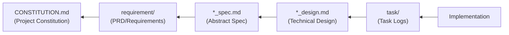

# AI-SDD Development Principles

**Document Type**: Plugin Design Principles (not a sub-agent)

**Purpose**: This document defines the principles, document structure, and management rules for AI-driven Specification-Driven Development (AI-SDD) workflow. All agents, commands, and skills in this plugin reference this document as the source of truth.

**Usage**:
- This document is NOT a sub-agent executable via Task tool
- This is a reference document that all agents read via Read tool
- All agents must read this document before execution to understand AI-SDD principles

---

## What is AI-SDD?

AI-SDD (AI-driven Specification-Driven Development) is a development methodology that treats **specifications as
contracts governing code behavior** and serves as the **source of truth** that AI agents reference.

### Problems It Solves

It addresses the following issues in traditional development:

| Issue                                 | Details                                                                                       |
|:--------------------------------------|:----------------------------------------------------------------------------------------------|
| **Vibe Coding Problem**               | The problem where AI must guess thousands of undefined requirements due to vague instructions |
| **Lack of Architectural Consistency** | Design disorder caused by ad-hoc implementations                                              |
| **Technical Debt Accumulation**       | Documentation obsolescence and loss of design intent                                          |
| **Opaque Design Decisions**           | Unable to understand "why this design was chosen"                                             |

### AI-SDD Development Principles

| Principle                        | Details                                                                                |
|:---------------------------------|:---------------------------------------------------------------------------------------|
| **Specification-First**          | **Start with specifications** rather than writing code first and documenting later     |
| **AI Guardrails**                | Provide **high-abstraction specifications** as guardrails to AI, eliminating ambiguity |
| **Design Decision Transparency** | Clarify the **"why"** that code alone cannot convey through specifications             |
| **Knowledge Asset Persistence**  | Prevent documentation bloat and maintain only the latest design intent persistently    |

## Four Structured Phases

AI-SDD transforms ad-hoc development into these four phases:

```
Specify → Plan → Tasks → Implement & Review
```

| Phase                  | Purpose                                                                      | Deliverables     |
|:-----------------------|:-----------------------------------------------------------------------------|:-----------------|
| **Specify**            | Clarify "what to build" and "why to build it." **Exclude technical details** | PRD, `*_spec.md` |
| **Plan**               | Consider "how to implement." Architecture design and technology selection    | `*_design.md`    |
| **Tasks**              | Break down design into independently testable small tasks                    | Under `task/`    |
| **Implement & Review** | AI executes each task, continuously verifying specification compliance       | Source code      |

## Project Configuration File

### Configuration File Specification

AI-SDD workflow supports customizing directory names via a `.sdd-config.json` file.

**Configuration File Path**: `.sdd-config.json` at project root

```json
{
  "root": ".sdd",
  "directories": {
    "requirement": "requirement",
    "specification": "specification",
    "task": "task"
  }
}
```

### Configuration Items

| Item                        | Default Value   | Description                                      |
|:----------------------------|:----------------|:-------------------------------------------------|
| `root`                      | `.sdd`          | Root directory                                   |
| `directories.requirement`   | `requirement`   | PRD/Requirements specification directory         |
| `directories.specification` | `specification` | Abstract specification/design document directory |
| `directories.task`          | `task`          | Task log/temporary work log directory            |

### Configuration File Loading Rules

1. Check if `.sdd-config.json` exists at project root
2. If exists: Load configuration values and use for path resolution
3. If not exists: Use default values
4. Partial configuration is supported (unspecified items use default values)

### Environment Variable Path Resolution

At session start, the `session-start` hook reads `.sdd-config.json` and sets the following environment variables.

| Environment Variable     | Default Value        | Description                  |
|:-------------------------|:---------------------|:-----------------------------|
| `SDD_ROOT`               | `.sdd`               | Root directory               |
| `SDD_REQUIREMENT_DIR`    | `requirement`        | Requirements directory name  |
| `SDD_SPECIFICATION_DIR`  | `specification`      | Specification directory name |
| `SDD_TASK_DIR`           | `task`               | Task log directory name      |
| `SDD_REQUIREMENT_PATH`   | `.sdd/requirement`   | Requirements full path       |
| `SDD_SPECIFICATION_PATH` | `.sdd/specification` | Specification full path      |
| `SDD_TASK_PATH`          | `.sdd/task`          | Task log full path           |

**Path Resolution Priority:**

1. Use `SDD_*` environment variables if set
2. Check `.sdd-config.json` if environment variables are not set
3. Use default values if neither exists

Agents, commands, and skills use these environment variables when referencing document paths.

### Custom Configuration Example

```json
{
  "root": "docs",
  "directories": {
    "requirement": "requirements",
    "specification": "specs",
    "task": "wip"
  }
}
```

With this configuration, the directory structure becomes:

```
docs/
├── requirements/          # PRD (Requirements Specification)
├── specs/                 # Specifications and Design Documents
└── wip/                   # Temporary task logs
```

## Document Structure and Management Rules

### Recommended Directory Structure

Both flat and hierarchical structures are supported. Choose based on project scale.

#### Flat Structure (for small to medium projects)

```
.sdd/
├── CONSTITUTION.md               # Project constitution (non-negotiable principles)
├── SPECIFICATION_TEMPLATE.md     # Abstract specification template
├── DESIGN_DOC_TEMPLATE.md        # Technical design document template
├── requirement/          # PRD (Requirements Specification) - SysML requirements diagram format
│   └── {feature-name}.md         # High-level requirements, business value
├── specification/                # Persistent knowledge assets
│   ├── {feature-name}_spec.md    # Abstract specification (SysML model)
│   └── {feature-name}_design.md  # Technical design document (Design Doc)
└── task/                         # Temporary task logs (deleted after implementation)
    └── {ticket-number}/
        └── xxx.md
```

#### Hierarchical Structure (for medium to large projects)

```
.sdd/
├── CONSTITUTION.md               # Project constitution (non-negotiable principles)
├── SPECIFICATION_TEMPLATE.md     # Abstract specification template
├── DESIGN_DOC_TEMPLATE.md        # Technical design document template
├── requirement/          # PRD (Requirements Specification) - SysML requirements diagram format
│   ├── {feature-name}.md         # Top-level feature (backward compatible with flat structure)
│   └── {parent-feature}/         # Parent feature directory
│       ├── index.md              # Parent feature overview and requirements list
│       └── {child-feature}.md    # Child feature requirements
├── specification/                # Persistent knowledge assets
│   ├── {feature-name}_spec.md    # Top-level feature (backward compatible with flat structure)
│   ├── {feature-name}_design.md
│   └── {parent-feature}/         # Parent feature directory
│       ├── index_spec.md         # Parent feature abstract specification
│       ├── index_design.md       # Parent feature technical design document
│       ├── {child-feature}_spec.md   # Child feature abstract specification
│       └── {child-feature}_design.md # Child feature technical design document
└── task/                         # Temporary task logs (deleted after implementation)
    └── {ticket-number}/
        └── xxx.md
```

### File Naming Convention (Important)

**⚠️ Suffix requirements differ between requirement and specification directories. Do not confuse them.**

| Directory         | File Type     | Naming Pattern                                 | Examples                                  |
|:------------------|:--------------|:-----------------------------------------------|:------------------------------------------|
| **requirement**   | All files     | `{name}.md` (no suffix)                        | `user-login.md`, `index.md`               |
| **specification** | Abstract spec | `{name}_spec.md` (`_spec` suffix required)     | `user-login_spec.md`, `index_spec.md`     |
| **specification** | Design doc    | `{name}_design.md` (`_design` suffix required) | `user-login_design.md`, `index_design.md` |

#### Naming Pattern Quick Reference

```
# ✅ Correct naming
requirement/auth/index.md              # Parent feature overview (no suffix)
requirement/auth/user-login.md         # Child feature requirements (no suffix)
specification/auth/index_spec.md       # Parent feature abstract spec (_spec required)
specification/auth/index_design.md     # Parent feature design doc (_design required)
specification/auth/user-login_spec.md  # Child feature abstract spec (_spec required)
specification/auth/user-login_design.md # Child feature design doc (_design required)

# ❌ Incorrect naming (never use these)
requirement/auth/index_spec.md         # requirement does not need _spec
specification/auth/user-login.md       # specification requires _spec or _design
specification/auth/index.md            # specification requires _spec or _design
```

### Document Link Convention

Follow these formats for markdown links within documents:

| Link Target   | Format                                   | Link Text           | Example                                              |
|:--------------|:-----------------------------------------|:--------------------|:-----------------------------------------------------|
| **File**      | `[filename.md](path or URL)`             | Include filename    | `[user-login.md](../requirement/auth/user-login.md)` |
| **Directory** | `[directory-name](path or URL/index.md)` | Directory name only | `[auth](../requirement/auth/index.md)`               |

This convention makes it visually easy to distinguish whether the link target is a file or a directory.

#### Hierarchical Structure Guidelines

| Condition                                | Recommended Structure  |
|:-----------------------------------------|:-----------------------|
| Less than 10 features                    | Flat structure         |
| 10 or more features                      | Hierarchical structure |
| Features spanning multiple domains       | Hierarchical structure |
| Features with parent-child relationships | Hierarchical structure |

**Hierarchical path examples**:

- `requirement/auth/index.md` → Auth domain overview and requirements list
- `requirement/auth/user-login.md` → User login requirements under auth domain
- `specification/auth/index_spec.md` → Auth domain abstract specification
- `specification/auth/index_design.md` → Auth domain technical design document
- `specification/auth/user-login_spec.md` → User login specification under auth domain
- `specification/payment/checkout_design.md` → Checkout design under payment domain

### Document Persistence Rules

| Path                        | Persistence    | Management Rules                                                                                                  |
|:----------------------------|:---------------|:------------------------------------------------------------------------------------------------------------------|
| `requirement/`              | **Persistent** | Define high-level requirements (business requirements). Foundation for SysML requirements diagrams                |
| `specification/*_spec.md`   | **Persistent** | Define the **abstract structure and behavior** of the system. No technical details                                |
| `specification/*_design.md` | **Persistent** | Describe **specific technical design**, architecture, and rationale for technology selection                      |
| `task/`                     | **Temporary**  | **Delete** after implementation complete. Integrate important design decisions into `*_design.md` before deletion |

### Document Dependencies



**Meaning of Dependency Direction**:

- `Implementation` is created based on `task/` task logs
- `task/` references `*_design.md` for task breakdown
- `*_design.md` is created referencing `*_spec.md` (concretizing abstract "what")
- `*_spec.md` is created referencing `requirement` (converting business requirements to technical specifications)
- `requirement` is created following `CONSTITUTION.md` principles (non-negotiable project principles)

## Role of Each Document and Abstraction Level

### 1. PRD / Requirements Diagram (`requirement/`)

**Abstraction Level: Highest** | **Focus: What to build, why to build it**

| Item                  | Details                                                                                                      |
|:----------------------|:-------------------------------------------------------------------------------------------------------------|
| **Purpose**           | Define high-level product requirements (business value)                                                      |
| **Content**           | User requirements, functional requirements, non-functional requirements in SysML requirements diagram format |
| **Technical Details** | **Not included**                                                                                             |
| **SysML Elements**    | Requirements Diagram (req)                                                                                   |

### 2. Abstract Specification (`*_spec.md`)

**Abstraction Level: High** | **Focus: System logical structure and behavior**

| Item                  | Details                                                                                    |
|:----------------------|:-------------------------------------------------------------------------------------------|
| **Purpose**           | Define the **logical, abstract structure** of the system to fulfill PRD requirements       |
| **Content**           | Public API, data models, abstraction of behavior                                           |
| **Technical Details** | **Not included** (abstract models only)                                                    |
| **SysML Elements**    | Block Definition Diagram (bdd), Sequence Diagram (sd), Activity Diagram (act)              |
| **Role**              | Functions as **guardrails** for AI, enabling judgment of design philosophy and correctness |

**Required Sections**: Background, Overview, API
**Recommended Sections**: Requirements Definition, Use Cases
**Optional Sections**: Type Definitions, Glossary, Behavior Diagrams, Constraints

### 3. Technical Design Document (`*_design.md`)

**Abstraction Level: Medium to Low** | **Focus: How to implement**

| Item                  | Details                                                                                           |
|:----------------------|:--------------------------------------------------------------------------------------------------|
| **Purpose**           | Translate abstract specifications into **concrete technical plans**                               |
| **Content**           | Technology stack selection, architecture design, module breakdown, rationale for design decisions |
| **Technical Details** | **Included** (specific technology selection and implementation approach)                          |
| **Role**              | Ensure **design decision transparency**, enabling future developers to understand design intent   |

**Required Sections**: Implementation Status, Design Goals, Technology Stack, Architecture, Design Decisions
**Optional Sections**: Data Models, Interface Definitions, Testing Strategy, Change History

### 4. Task Logs (`task/{ticket-number}/`)

**Persistence: Temporary** | **Focus: Task breakdown and execution logs**

| Item          | Details                                                                                           |
|:--------------|:--------------------------------------------------------------------------------------------------|
| **Purpose**   | **Temporary work records** for implementation                                                     |
| **Content**   | Task lists, investigation logs, implementation schedules, test case details                       |
| **Lifecycle** | **Delete** after implementation complete. Integrate important design decisions into `*_design.md` |
| **Role**      | **Prevent documentation noise**                                                                   |

## Related Agents

The AI-SDD workflow provides specialized review agents for each document type.

### Document Review Agents

| Agent | Target Documents | Role |
|:--|:--|:--|
| `prd-reviewer` | PRD (`requirement/`) | PRD quality review and CONSTITUTION.md compliance check |
| `spec-reviewer` | `*_spec.md`, `*_design.md` | Specification/design quality review and CONSTITUTION.md compliance check |

### Importance of CONSTITUTION.md Compliance Check

All documents are created following `CONSTITUTION.md` project principles. Review agents check the following principle categories:

| Principle Category | ID Format | Impact on PRD | Impact on spec/design |
|:--|:--|:--|:--|
| **Business Principles** | B-xxx | Directly reflected in background/purpose, user requirements | Business logic reflection |
| **Architecture Principles** | A-xxx | Documented as constraints | Directly reflected in architecture design |
| **Development Method Principles** | D-xxx | Affects verification method selection | Reflected in test strategy, module design |
| **Technical Constraints** | T-xxx | Documented as constraints | Directly affects technology stack selection |

### When to Use Review Agents

```
PRD generation/update
   ↓
prd-reviewer review (Required)
   ├─ CONSTITUTION.md compliance check
   ├─ On violation: Output fix proposals
   └─ Main agent reviews and applies approved fixes
   ↓
spec generation/update
   ↓
spec-reviewer review (Required)
   ├─ CONSTITUTION.md compliance check (Architecture principles focus)
   ├─ PRD ↔ spec consistency check
   └─ On violation/inconsistency: Output fix proposals → Main agent applies
   ↓
design generation/update
   ↓
spec-reviewer review (Required)
   ├─ CONSTITUTION.md compliance check (Technical constraints focus)
   ├─ spec ↔ design consistency check
   └─ On violation/inconsistency: Output fix proposals → Main agent applies
```

### Command and Review Agent Mapping

| Command | Review Agent Called |
|:--|:--|
| `/generate_prd` | `prd-reviewer` (auto-executed after PRD generation) |
| `/generate_spec` | `spec-reviewer` (auto-executed after spec generation and after design generation) |

**Note**: Review agents are automatically called within generation commands. For manual review, call the respective review agent directly.

## Vibe Coding Prevention

Detect vague instructions and prompt specification clarification:

**Detection Patterns**:

| Category                   | Example Patterns                                                                                |
|:---------------------------|:------------------------------------------------------------------------------------------------|
| **Vague Instructions**     | "Make it nice," "Fix it somehow," "Make it work," "Make it look good"                           |
| **Unclear Scope**          | "Improve that feature," "Optimize performance" (target unclear)                                 |
| **Missing Specifications** | Change requests for features without existing specs, implementation requests without API design |
| **Implicit Assumptions**   | "Same as before," "As usual" (reference unclear)                                                |
| **Ambiguous Priority**     | "If possible," "When you have time" (unclear if out of scope)                                   |

**Risk Level Assessment**:

| Level  | State                            | Response                                                 |
|:-------|:---------------------------------|:---------------------------------------------------------|
| High   | No specs + vague instructions    | **Require** specification creation before implementation |
| Medium | Specs exist + some ambiguity     | Clarify ambiguous points before implementation           |
| Low    | Specs exist + clear requirements | Can start implementation                                 |

**Response Flow**:

```
1. Identify ambiguous points, confirm with user
   ↓
2. Propose specification creation/update
   ↓
3. If user declines:
   - Explicitly warn of risks
   - Record inferred specifications in task/
   ↓
4. Establish guardrail specifications
```

**Escalation When Specifications Are Insufficient**:

Even when user refuses specification creation, ensure minimum guardrails:

1. **Document Inferred Specifications**: Record inferred specs in `task/{ticket}/assumed-spec.md`
2. **Set Verification Points**: List items to confirm with user upon implementation completion
3. **Visualize Risks**: Warn of potential issues due to specification gaps

## Workflow Management Guidelines

### Task Type Determination

Determine required phases and documents based on task nature:

| Task Type               | Required Phases                    | Deliverables                      |
|:------------------------|:-----------------------------------|:----------------------------------|
| New Feature (Large)     | Specify → Plan → Tasks → Implement | PRD → spec → design → task        |
| New Feature (Small)     | Specify → Plan → Tasks → Implement | spec → design → task              |
| Bug Fix                 | Tasks → Implement                  | task (investigation log) only     |
| Refactoring             | Plan → Tasks → Implement           | design (change plan) → task       |
| Technical Investigation | Tasks                              | task (investigation results) only |

**Task Scale Criteria**:

| Scale   | Criteria                                                                             |
|:--------|:-------------------------------------------------------------------------------------|
| Large   | New business domain, changes spanning multiple features, external system integration |
| Small   | Feature additions within existing features, changes contained to single module       |
| Bug Fix | Correcting deviations from existing specifications (no spec changes)                 |

### Knowledge Asset Persistence Management

Manage lifecycle of files under `task/`:

**Flow at Implementation Completion**:

```
1. Review contents under task/
   ↓
2. Integrate important design decisions into *_design.md
   ↓
3. Delete files under task/
   ↓
4. Commit
```

**Content to Integrate**:

- Design decisions and their rationale
- Alternative evaluation results
- Insights to convey to future developers

**Content Safe to Delete**:

- Temporary investigation logs
- Work progress notes
- Specific implementation steps (already reflected in code)

### Consistency Checking

Verify consistency between documents:

| Check Target                | Verification Items                                                                         |
|:----------------------------|:-------------------------------------------------------------------------------------------|
| **PRD ↔ spec**              | Requirement ID to spec mapping, functional requirement coverage                            |
| **spec ↔ design**           | API definition match, requirement reflection in design decisions, constraint consideration |
| **design ↔ Implementation** | Module structure match, interface definition match                                         |

**Check Execution Timing**:

| Timing                    | Check Content                       | Response                             |
|:--------------------------|:------------------------------------|:-------------------------------------|
| Task Start                | Verify existing document existence  | If missing, go to Specify phase      |
| Plan Completion           | spec ↔ design consistency           | If inconsistent, modify design       |
| Implementation Completion | design ↔ implementation consistency | If inconsistent, update design       |
| Review                    | All inter-document consistency      | Resolve inconsistencies before merge |

### Document Update Triggers

Criteria for when to update each document:

**When to Update `*_spec.md`**:

- Public API signature changes (arguments, return values, types)
- New data model additions
- Fundamental changes to existing behavior
- When new requirements added in requirements diagram

**When to Update `*_design.md`**:

- Technology stack changes (library additions/changes)
- Important architectural decisions
- Module structure changes
- New design pattern introductions

**When Updates Are NOT Needed**:

- Internal implementation optimization (no interface changes)
- Bug fixes (correcting deviations from specifications)
- Refactoring (no behavior changes)

---

This document defines the principles for AI-SDD workflow, treating **specifications as the source of truth**, preventing Vibe Coding problems, and achieving high-quality implementations by AI agents.
Thoroughly separate persistent documentation from temporary logs and support sustainable growth of knowledge assets.
