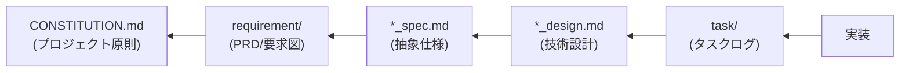

# AI-SDD 開発原則

**ドキュメント種別**: プラグイン設計原則（サブエージェントではありません）

**目的**: このドキュメントは、AI駆動仕様駆動開発（AI-SDD）ワークフローの原則、ドキュメント構成、管理ルールを定義します。このプラグインのすべてのエージェント、コマンド、スキルは、このドキュメントを真実の源として参照します。

**使用方法**:

- このドキュメントは Task ツール経由で実行可能なサブエージェントではありません
- すべてのエージェントが Read ツールで読み込む参照ドキュメントです
- すべてのエージェントは実行前にこのドキュメントを読み込み、AI-SDD の原則を理解する必要があります

---

## AI-SDDとは

AI-SDD（AI-driven Specification-Driven Development）は、**仕様書をコードの動作を規定する契約** とし、
AIエージェントが参照する **真実の源** とする開発手法です。

### 解決する課題

従来の開発が抱える以下の問題を解決します：

| 課題                | 詳細                              |
|:------------------|:--------------------------------|
| **Vibe Coding問題** | 曖昧な指示によりAIが数千の未定義要件を推測せざるを得ない問題 |
| **アーキテクチャの一貫性欠如** | 場当たり的な実装による設計の乱れ                |
| **技術的負債の蓄積**      | ドキュメントの陳腐化と設計意図の喪失              |
| **設計判断の不透明性**     | 「なぜこの設計にしたのか」が分からない             |

### AI-SDDの開発原則

| 原則            | 詳細                                     |
|:--------------|:---------------------------------------|
| **仕様書中心**     | コードを書いて後でドキュメントを作成するのではなく、**仕様書から始める** |
| **AIのガードレール** | 曖昧さを排除した**抽象度の高い仕様**をAIに護欄として提供        |
| **設計判断の透明性**  | コードだけでは分からない**「なぜ」**を仕様書で明確化           |
| **知識資産の永続性**  | ドキュメントの肥大化を防ぎ、最新の設計意図のみを永続的に維持         |

## 4つの構造化されたフェーズ

AI-SDDは、アドホックな開発を以下の4フェーズに変換します：

```
Specify（仕様化） → Plan（計画） → Tasks（タスク分解） → Implement & Review（実装と検証）
```

| フェーズ                   | 目的                                | 成果物             |
|:-----------------------|:----------------------------------|:----------------|
| **Specify**            | 「何を作るか」「なぜ作るか」を明確化。**技術的詳細は含めない** | PRD、`*_spec.md` |
| **Plan**               | 「どのように実現するか」を検討。アーキテクチャ設計と技術選定    | `*_design.md`   |
| **Tasks**              | 設計を独立してテスト可能な小タスクに分解              | `task/` 配下      |
| **Implement & Review** | AIが各タスクを実行し、仕様との整合性を継続検証          | ソースコード          |

## プロジェクト設定ファイル

### 設定ファイルの仕様

AI-SDDワークフローでは、`.sdd-config.json` ファイルによるディレクトリ名のカスタマイズをサポートします。

**設定ファイルパス**: プロジェクトルートの `.sdd-config.json`

```json
{
  "root": ".sdd",
  "directories": {
    "requirement": "requirement",
    "specification": "specification",
    "task": "task"
  }
}
```

### 設定項目

| 項目                          | デフォルト値          | 説明                     |
|:----------------------------|:----------------|:-----------------------|
| `root`                      | `.sdd`          | ルートディレクトリ              |
| `directories.requirement`   | `requirement`   | PRD/要求仕様書ディレクトリ名       |
| `directories.specification` | `specification` | 抽象仕様書・技術設計書ディレクトリ名     |
| `directories.task`          | `task`          | タスクログディレクトリ名（一時的な作業ログ） |

### 設定ファイルの読み込みルール

1. プロジェクトルートに `.sdd-config.json` が存在するか確認
2. 存在する場合: 設定値を読み込み、パス解決に使用
3. 存在しない場合: デフォルト値を使用
4. 部分的な設定も可能（指定されていない項目はデフォルト値を使用）

### 環境変数によるパス解決

セッション開始時に `session-start` フックが `.sdd-config.json` を読み込み、以下の環境変数を設定します。

| 環境変数                     | デフォルト値               | 説明             |
|:-------------------------|:---------------------|:---------------|
| `SDD_ROOT`               | `.sdd`               | ルートディレクトリ      |
| `SDD_REQUIREMENT_DIR`    | `requirement`        | 要求仕様書ディレクトリ名   |
| `SDD_SPECIFICATION_DIR`  | `specification`      | 仕様書・設計書ディレクトリ名 |
| `SDD_TASK_DIR`           | `task`               | タスクログディレクトリ名   |
| `SDD_REQUIREMENT_PATH`   | `.sdd/requirement`   | 要求仕様書フルパス      |
| `SDD_SPECIFICATION_PATH` | `.sdd/specification` | 仕様書・設計書フルパス    |
| `SDD_TASK_PATH`          | `.sdd/task`          | タスクログフルパス      |

**パス解決の優先順位:**

1. 環境変数 `SDD_*` が設定されている場合はそれを使用
2. 環境変数がない場合は `.sdd-config.json` を確認
3. どちらもない場合はデフォルト値を使用

エージェント・コマンド・スキルは、ドキュメントパスを参照する際にこれらの環境変数を使用します。

### カスタム設定の例

```json
{
  "root": "docs",
  "directories": {
    "requirement": "requirements",
    "specification": "specs",
    "task": "wip"
  }
}
```

この設定の場合、ディレクトリ構造は以下のようになります：

```
docs/
├── requirements/          # PRD（要求仕様書）
├── specs/                 # 仕様書・設計書
└── wip/                   # 一時的なタスクログ
```

## ドキュメント構成と管理ルール

### 推奨ディレクトリ構造

フラット構造と階層構造の両方をサポートします。プロジェクトの規模に応じて選択してください。

#### フラット構造（小〜中規模プロジェクト向け）

```
.sdd/
├── CONSTITUTION.md               # プロジェクト原則（非妥協原則）
├── SPECIFICATION_TEMPLATE.md     # 抽象仕様書テンプレート
├── DESIGN_DOC_TEMPLATE.md        # 技術設計書テンプレート
├── requirement/          # PRD（要求仕様書）- SysML要求図形式
│   └── {機能名}.md              # 高レベルな要求、ビジネス価値
├── specification/                # 永続的な知識資産
│   ├── {機能名}_spec.md         # 抽象仕様書（SysMLモデル）
│   └── {機能名}_design.md       # 技術設計書（Design Doc）
└── task/                         # 一時的なタスクログ（実装完了後に削除）
    └── {チケット番号}/
        └── xxx.md
```

#### 階層構造（中〜大規模プロジェクト向け）

```
.sdd/
├── CONSTITUTION.md               # プロジェクト原則（非妥協原則）
├── SPECIFICATION_TEMPLATE.md     # 抽象仕様書テンプレート
├── DESIGN_DOC_TEMPLATE.md        # 技術設計書テンプレート
├── requirement/          # PRD（要求仕様書）- SysML要求図形式
│   ├── {機能名}.md              # トップレベル機能（フラット構造との互換性）
│   └── {親機能名}/              # 親機能ディレクトリ
│       ├── index.md             # 親機能の概要・要求一覧
│       └── {子機能名}.md        # 子機能の要求仕様
├── specification/                # 永続的な知識資産
│   ├── {機能名}_spec.md         # トップレベル機能（フラット構造との互換性）
│   ├── {機能名}_design.md
│   └── {親機能名}/              # 親機能ディレクトリ
│       ├── index_spec.md        # 親機能の抽象仕様書
│       ├── index_design.md      # 親機能の技術設計書
│       ├── {子機能名}_spec.md   # 子機能の抽象仕様書
│       └── {子機能名}_design.md # 子機能の技術設計書
└── task/                         # 一時的なタスクログ（実装完了後に削除）
    └── {チケット番号}/
        └── xxx.md
```

### ファイル命名規則（重要）

**⚠️ requirement と specification でサフィックスの有無が異なります。混同しないでください。**

| ディレクトリ            | ファイル種別 | 命名パターン                               | 例                                         |
|:------------------|:-------|:-------------------------------------|:------------------------------------------|
| **requirement**   | 全ファイル  | `{名前}.md`（サフィックスなし）                  | `user-login.md`, `index.md`               |
| **specification** | 抽象仕様書  | `{名前}_spec.md`（`_spec` サフィックス必須）     | `user-login_spec.md`, `index_spec.md`     |
| **specification** | 技術設計書  | `{名前}_design.md`（`_design` サフィックス必須） | `user-login_design.md`, `index_design.md` |

#### 命名パターン早見表

```
# ✅ 正しい命名
requirement/auth/index.md              # 親機能の概要（サフィックスなし）
requirement/auth/user-login.md         # 子機能の要求仕様（サフィックスなし）
specification/auth/index_spec.md       # 親機能の抽象仕様書（_spec 必須）
specification/auth/index_design.md     # 親機能の技術設計書（_design 必須）
specification/auth/user-login_spec.md  # 子機能の抽象仕様書（_spec 必須）
specification/auth/user-login_design.md # 子機能の技術設計書（_design 必須）

# ❌ 誤った命名（絶対に使用しないこと）
requirement/auth/index_spec.md         # requirement に _spec は不要
specification/auth/user-login.md       # specification には _spec/_design が必須
specification/auth/index.md            # specification には _spec/_design が必須
```

### ドキュメントリンク規約

ドキュメント内でのマークダウンリンクは以下の形式に従ってください：

| リンク先       | 形式                             | リンクテキスト   | 例                                                    |
|:-----------|:-------------------------------|:----------|:-----------------------------------------------------|
| **ファイル**   | `[ファイル名.md](パスまたはURL)`         | ファイル名を含める | `[user-login.md](../requirement/auth/user-login.md)` |
| **ディレクトリ** | `[ディレクトリ名](パスまたはURL/index.md)` | ディレクトリ名のみ | `[auth](../requirement/auth/index.md)`               |

この規約により、リンク先がファイルかディレクトリかが視覚的に判別しやすくなります。

#### 階層構造の使用ガイドライン

| 条件             | 推奨構造   |
|:---------------|:-------|
| 機能数が10個以下      | フラット構造 |
| 機能数が10個以上      | 階層構造   |
| 複数のドメインにまたがる機能 | 階層構造   |
| 機能間に親子関係がある    | 階層構造   |

**階層構造でのパス指定例**:

- `requirement/auth/index.md` → 認証ドメインの概要・要求一覧
- `requirement/auth/user-login.md` → 認証ドメイン配下のユーザーログイン要求
- `specification/auth/index_spec.md` → 認証ドメインの抽象仕様書
- `specification/auth/index_design.md` → 認証ドメインの技術設計書
- `specification/auth/user-login_spec.md` → 認証ドメイン配下のユーザーログイン仕様
- `specification/payment/checkout_design.md` → 決済ドメイン配下のチェックアウト設計

### ドキュメントの永続性ルール

| パス                          | 永続性     | 管理ルール                                         |
|:----------------------------|:--------|:----------------------------------------------|
| `requirement/`              | **永続**  | 高レベルな要求（ビジネス要求）を定義。SysML要求図の基盤                |
| `specification/*_spec.md`   | **永続**  | システムの**抽象的な構造と振る舞い**を定義。技術詳細は含めない             |
| `specification/*_design.md` | **永続**  | **具体的な技術設計**、アーキテクチャ、技術選定の根拠を記述               |
| `task/`                     | **一時的** | 実装完了後に**削除**。重要な設計判断は `*_design.md` に統合してから削除 |

### ドキュメント間の依存関係



**依存方向の意味**:

- `実装` は `task/` のタスクログに基づいて作成される
- `task/` は `*_design.md` を参照してタスク分解される
- `*_design.md` は `*_spec.md` を参照して作成される（抽象的な「何を」を具体化）
- `*_spec.md` は `requirement` を参照して作成される（ビジネス要求を技術仕様に変換）
- `requirement` は `CONSTITUTION.md` の原則に従って作成される（プロジェクトの非交渉原則）

## 各ドキュメントの役割と抽象度

### 1. PRD / 要求図（`requirement/`）

**抽象度: 最高** | **焦点: 何を作るか、なぜ作るか**

| 項目          | 詳細                             |
|:------------|:-------------------------------|
| **目的**      | 製品の高レベルな要求（ビジネス価値）を定義          |
| **内容**      | ユーザ要求、機能要求、非機能要求をSysML要求図形式で記述 |
| **技術詳細**    | **含めない**                       |
| **SysML要素** | 要求図 (req)                      |

### 2. 抽象仕様書（`*_spec.md`）

**抽象度: 高** | **焦点: システムの論理構造と振る舞い**

| 項目          | 詳細                                       |
|:------------|:-----------------------------------------|
| **目的**      | PRDの要求を実現するためのシステムの**論理的・抽象的な構造**を定義     |
| **内容**      | 公開API、データモデル、振る舞いの抽象化                    |
| **技術詳細**    | **含めない**（抽象的なモデルのみ）                      |
| **SysML要素** | ブロック定義図 (bdd)、シーケンス図 (sd)、アクティビティ図 (act) |
| **役割**      | AIへの**ガードレール**として機能し、設計思想と正しさを判断させる      |

**必須セクション**: 背景、概要、API
**推奨セクション**: 要求定義、使用例
**任意セクション**: 型定義、用語集、振る舞い図、制約事項

### 3. 技術設計書（`*_design.md`）

**抽象度: 中〜低** | **焦点: どのように実現するか**

| 項目       | 詳細                                      |
|:---------|:----------------------------------------|
| **目的**   | 抽象仕様を**具体的な技術計画**に落とし込む                 |
| **内容**   | 技術スタック選定、アーキテクチャ設計、モジュール分割、設計判断の根拠      |
| **技術詳細** | **含める**（具体的な技術選定と実装方針）                  |
| **役割**   | **設計判断の透明性**を確保し、将来の開発者が設計意図を理解できるようにする |

**必須セクション**: 実装ステータス、設計目標、技術スタック、アーキテクチャ、設計判断
**任意セクション**: データモデル、インターフェース定義、テスト戦略、変更履歴

### 4. タスクログ（`task/{チケット番号}/`）

**永続性: 一時的** | **焦点: タスク分解と実行ログ**

| 項目          | 詳細                                      |
|:------------|:----------------------------------------|
| **目的**      | 実装のための**一時的な作業記録**                      |
| **内容**      | タスクリスト、調査ログ、実装スケジュール、テストケース詳細           |
| **ライフサイクル** | 実装完了後に**削除**。重要な設計判断は `*_design.md` に統合 |
| **役割**      | ドキュメントの**ノイズ化を防ぐ**                      |

## 関連エージェント

AI-SDDワークフローでは、ドキュメント種別ごとに専門のレビューエージェントが用意されています。

### ドキュメントレビューエージェント

| エージェント          | 対象ドキュメント                   | 役割                                   |
|:----------------|:---------------------------|:-------------------------------------|
| `prd-reviewer`  | PRD（`requirement/`）        | PRDの品質レビューとCONSTITUTION.md準拠チェック     |
| `spec-reviewer` | `*_spec.md`, `*_design.md` | 仕様書・設計書の品質レビューとCONSTITUTION.md準拠チェック |

### CONSTITUTION.md 準拠チェックの重要性

すべてのドキュメントは `CONSTITUTION.md` のプロジェクト原則に従って作成されます。レビューエージェントは以下の原則カテゴリをチェックします：

| 原則カテゴリ        | ID形式  | PRDへの影響          | spec/designへの影響  |
|:--------------|:------|:-----------------|:-----------------|
| **ビジネス原則**    | B-xxx | 背景・目的、ユーザ要求に直接反映 | ビジネスロジックの反映      |
| **アーキテクチャ原則** | A-xxx | 制約事項として記載        | アーキテクチャ設計に直接反映   |
| **開発手法原則**    | D-xxx | 検証方法の選択に影響       | テスト戦略、モジュール設計に反映 |
| **技術制約**      | T-xxx | 制約事項として記載        | 技術スタック選定に直接影響    |

### レビューエージェントの使用タイミング

```
PRD生成/更新
   ↓
prd-reviewer によるレビュー（必須）
   ├─ CONSTITUTION.md 準拠チェック
   ├─ 違反検出時: 自動修正を試行
   └─ 修正不可: 手動修正箇所をレポート
   ↓
spec生成/更新
   ↓
spec-reviewer によるレビュー（必須）
   ├─ CONSTITUTION.md 準拠チェック（アーキテクチャ原則重視）
   ├─ PRD ↔ spec 整合性チェック
   └─ 違反/不整合検出時: 修正
   ↓
design生成/更新
   ↓
spec-reviewer によるレビュー（必須）
   ├─ CONSTITUTION.md 準拠チェック（技術制約重視）
   ├─ spec ↔ design 整合性チェック
   └─ 違反/不整合検出時: 修正
```

### コマンドとレビューエージェントの対応

| コマンド             | 呼び出されるレビューエージェント                            |
|:-----------------|:--------------------------------------------|
| `/generate_prd`  | `prd-reviewer`（PRD生成後に自動実行）                 |
| `/generate_spec` | `spec-reviewer`（spec生成後、design生成後にそれぞれ自動実行） |

**注意**: レビューエージェントは生成コマンド内で自動的に呼び出されます。手動でレビューを実行する場合は、該当するレビューエージェントを直接呼び出してください。

## Vibe Coding防止

曖昧な指示を検出し、仕様の明確化を促します：

**検出パターン**:

| カテゴリ        | パターン例                           |
|:------------|:--------------------------------|
| **曖昧な指示**   | 「いい感じに実装して」「適当に直して」「うまくやって」     |
| **範囲の不明確さ** | 「あの機能を改善して」「パフォーマンスを上げて」（対象が不明） |
| **仕様の欠如**   | 既存仕様書がない機能への変更要求、API設計なしでの実装要求  |
| **暗黙の前提**   | 「前と同じように」「いつも通りに」（参照先が不明）       |
| **優先度の曖昧さ** | 「できれば」「余裕があれば」（スコープ外かどうか不明）     |

**リスクレベル判定**:

| レベル  | 状態              | 対応                  |
|:-----|:----------------|:--------------------|
| 🔴 高 | 仕様書なし + 曖昧な指示   | 実装前に仕様書作成を**必須**とする |
| 🟡 中 | 仕様書あり + 曖昧な部分あり | 曖昧な箇所を明確化してから実装     |
| 🟢 低 | 仕様書あり + 要件明確    | 実装を開始可能             |

**対応フロー**:

```
1. 曖昧な箇所を特定し、ユーザーに確認
   ↓
2. 仕様書の作成/更新を提案
   ↓
3. ユーザーが拒否した場合：
   - リスクを明示的に警告
   - 推測した仕様を task/ に記録（実装後に検証）
   ↓
4. ガードレールとなる仕様を整備
```

**仕様不足時のエスカレーション**:

ユーザーが仕様書作成を拒否した場合でも、以下の最低限のガードレールを確保：

1. **推測仕様の明文化**: `task/{ticket}/assumed-spec.md` に推測した仕様を記録
2. **検証ポイントの設定**: 実装完了時にユーザーと確認すべき項目をリスト化
3. **リスクの可視化**: 仕様不足による潜在的な問題を警告

## ワークフロー管理ガイドライン

### タスク種別の判定

タスクの性質に応じて、必要なフェーズとドキュメントを判定します：

| タスク種別      | 必要なフェーズ                            | 成果物                        |
|:-----------|:-----------------------------------|:---------------------------|
| 新機能追加（大規模） | Specify → Plan → Tasks → Implement | PRD → spec → design → task |
| 新機能追加（小規模） | Specify → Plan → Tasks → Implement | spec → design → task       |
| バグ修正       | Tasks → Implement                  | task（調査ログ）のみ               |
| リファクタリング   | Plan → Tasks → Implement           | design（変更計画）→ task         |
| 技術調査       | Tasks                              | task（調査結果）のみ               |

**タスク規模の判定基準**:

| 規模   | 基準                                   |
|:-----|:-------------------------------------|
| 大規模  | 新しいビジネスドメイン、複数フィーチャーにまたがる変更、外部システム連携 |
| 小規模  | 既存フィーチャー内の機能追加、単一モジュールで完結する変更        |
| バグ修正 | 既存仕様からの逸脱を修正（仕様変更を伴わない）              |

### 知識資産の永続化管理

`task/` 配下のファイルのライフサイクルを管理：

**実装完了時のフロー**:

```
1. task/ 配下の内容を確認
   ↓
2. 重要な設計判断を *_design.md に統合
   ↓
3. task/ 配下のファイルを削除
   ↓
4. コミット
```

**統合すべき内容**:

- 設計判断とその根拠
- 代替案の検討結果
- 将来の開発者に伝えるべき知見

**削除して良い内容**:

- 一時的な調査ログ
- 作業進捗メモ
- 具体的な実装手順（コードに反映済み）

### 整合性チェック

ドキュメント間の整合性を確認します：

| チェック対象            | 確認項目                         |
|:------------------|:-----------------------------|
| **PRD ↔ spec**    | 要求IDと仕様の対応、機能要求の網羅性          |
| **spec ↔ design** | API定義の一致、要求の設計判断への反映、制約事項の考慮 |
| **design ↔ 実装**   | モジュール構成の一致、インターフェース定義の一致     |

**チェック実行タイミング**:

| タイミング   | チェック内容             | 対応                   |
|:--------|:-------------------|:---------------------|
| タスク開始時  | 既存ドキュメントの存在確認      | 不足があれば Specify フェーズへ |
| Plan完了時 | spec ↔ design の整合性 | 不整合があれば設計を修正         |
| 実装完了時   | design ↔ 実装の整合性    | 不整合があれば design を更新   |
| レビュー時   | 全ドキュメント間の整合性       | 不整合を解消してからマージ        |

### ドキュメント更新トリガー

各ドキュメントをいつ更新すべきかの判断基準：

**`*_spec.md` を更新すべき場合**:

- 公開APIのシグネチャ変更（引数、戻り値、型）
- 新しいデータモデルの追加
- 既存の振る舞いの根本的な変更
- 要求図で新しい要求が追加された場合

**`*_design.md` を更新すべき場合**:

- 技術スタックの変更（ライブラリ追加・変更など）
- アーキテクチャ上の重要な判断
- モジュール構成の変更
- 新しい設計パターンの導入

**更新不要な場合**:

- 内部実装の最適化（インターフェース変更なし）
- バグ修正（仕様からの逸脱を修正）
- リファクタリング（動作変更なし）

---

このドキュメントは、AI-SDD ワークフローの基盤として、**仕様書を真実の源** とし、Vibe Coding
問題を防ぎ、AIエージェントによる高品質な実装を実現するための原則を定義します。
ドキュメントの永続化と一時ログの分離を徹底し、知識資産の持続可能な成長を支援します。
