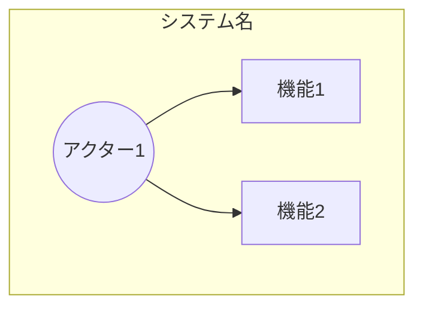
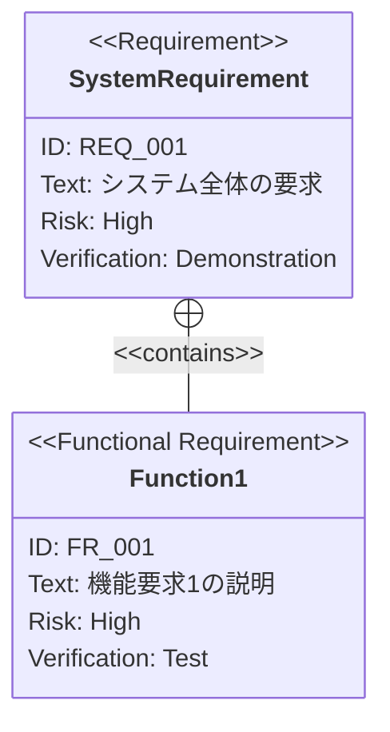

# PRD（要求仕様書）テンプレート

このドキュメントは `.sdd/requirement/` 配下のPRD（要求仕様書）を作成する際のテンプレートです。
ファイル名は `{機能名}.md` となります。

## 仕様書・設計書との違い

| ドキュメント             | SDDフェーズ          | 役割と焦点                                               | 抽象度      |
|--------------------|------------------|-----------------------------------------------------|----------|
| `requirement/*.md` | **Specify（仕様化）** | **「何を作るか」「なぜ作るか」** - ビジネス要求を定義。技術詳細は含めない            | 最高（抽象的）  |
| `xxx_spec.md`      | **Specify（仕様化）** | **「何を作るか」** - システムの抽象的な構造と振る舞いを定義。技術的詳細は含めない        | 高（抽象的）   |
| `xxx_design.md`    | **Plan（計画/設計）**  | **「どのように実現するか」** - 抽象仕様を実現するための具体的な技術設計。設計判断の透明性を確保 | 中〜低（具体的） |

---

# {機能名} 要求仕様書 `<MUST>`

## 概要 `<MUST>`

このドキュメントの目的と対象範囲を簡潔に説明します。

---

# 1. 要求図の読み方 `<RECOMMENDED>`

## 1.1. 要求タイプ

- **requirement**: 一般的な要求
- **functionalRequirement**: 機能要求
- **performanceRequirement**: パフォーマンス要求
- **interfaceRequirement**: インターフェース要求
- **designConstraint**: 設計制約

## 1.2. リスクレベル

- **High**: 高リスク（ビジネスクリティカル、実装困難）
- **Medium**: 中リスク（重要だが代替可能）
- **Low**: 低リスク（Nice to have）

## 1.3. 検証方法

- **Analysis**: 分析による検証
- **Test**: テストによる検証
- **Demonstration**: デモンストレーションによる検証
- **Inspection**: インスペクション（レビュー）による検証

## 1.4. 関係タイプ

- **contains**: 包含関係（親要求が子要求を含む）
- **derives**: 派生関係（要求から別の要求が導出される）
- **satisfies**: 満足関係（要素が要求を満たす）
- **verifies**: 検証関係（テストケースが要求を検証する）
- **refines**: 詳細化関係（要求をより詳細に定義する）
- **traces**: トレース関係（要求間の追跡可能性）

---

# 2. 要求一覧 `<MUST>`

## 2.1. ユースケース図（概要） `<RECOMMENDED>`

主要機能とアクターの関係を示す概要図です。

## 2.2. 機能一覧（テキスト形式） `<MUST>`

- 機能カテゴリ1
    - サブ機能1-1
    - サブ機能1-2
- 機能カテゴリ2
    - サブ機能2-1

---

# 3. 要求図（SysML Requirements Diagram） `<MUST>`

## 3.1. 全体要求図

---

# 4. 要求の詳細説明 `<MUST>`

## 4.1. 機能要求

### FR_001: {機能要求名}

{機能の詳細な説明}

**検証方法:** テストによる検証

---

# 5. 制約事項 `<OPTIONAL>`

## 5.1. 技術的制約

- 技術的な制約

## 5.2. ビジネス的制約

- ビジネス的な制約（スケジュール、予算など）

---

# 6. 前提条件 `<OPTIONAL>`

- この機能が動作するための前提
- 依存する他システム・機能

---

# 7. スコープ外 `<OPTIONAL>`

以下は本PRDのスコープ外とします：

- この機能に含まれないこと

---

# 8. 用語集 `<RECOMMENDED>`

| 用語   | 定義   |
|------|------|
| [用語] | [定義] |

---

# セクション必須度の凡例

| マーク             | 意味 | 説明                 |
|-----------------|----|--------------------|
| `<MUST>`        | 必須 | すべてのPRDで必ず記載してください |
| `<RECOMMENDED>` | 推奨 | 可能な限り記載することを推奨します  |
| `<OPTIONAL>`    | 任意 | 必要に応じて記載してください     |

---

# ガイドライン

## 含めるべき内容

- ユースケース図（概要・詳細）
- SysML要求図（requirementDiagram構文）
- 要求の詳細説明（機能要求、パフォーマンス要求、インターフェース要求、設計制約）
- 制約事項・前提条件
- スコープ外の明示
- 用語集

## 含めないべき内容（→ Spec / Design Doc へ）

- 技術的な実装詳細
- アーキテクチャ・モジュール構成
- 技術スタックの選定
- API定義・型定義
