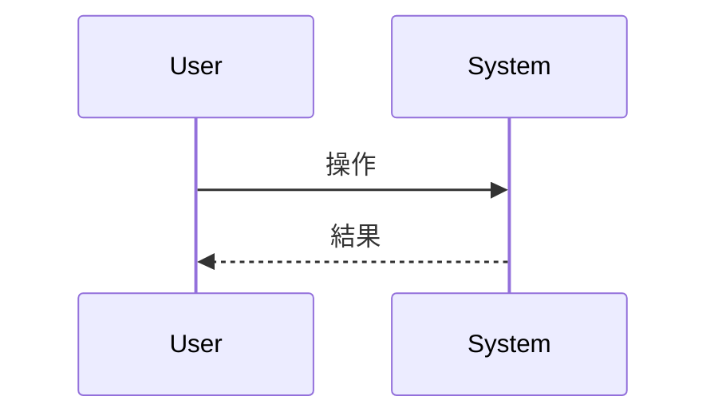

# 抽象仕様書テンプレート

このドキュメントは `.sdd/specification/` 配下の抽象仕様書を作成する際のテンプレートです。
ファイル名は `{機能名}_spec.md` となります。

## 技術設計書との違い

| ドキュメント          | SDDフェーズ          | 役割と焦点                                               | 抽象度      |
|-----------------|------------------|-----------------------------------------------------|----------|
| `xxx_spec.md`   | **Specify（仕様化）** | **「何を作るか」「なぜ作るか」** - システムの抽象的な構造と振る舞いを定義。技術的詳細は含めない | 高（抽象的）   |
| `xxx_design.md` | **Plan（計画/設計）**  | **「どのように実現するか」** - 抽象仕様を実現するための具体的な技術設計。設計判断の透明性を確保 | 中〜低（具体的） |

---

# {機能名} `<MUST>`

**ドキュメント種別:** 抽象仕様書 (Spec)
**SDDフェーズ:** Specify (仕様化)
**最終更新日:** YYYY-MM-DD
**関連 Design Doc:** [xxx_design.md へのリンク]
**関連 PRD:** [requirement/{機能名}.md へのリンク]

---

# 1. 背景 `<MUST>`

なぜこの機能が必要なのかを説明します。

# 2. 概要 `<MUST>`

機能の目的と主要な設計原則を説明します。
**技術的な実装詳細は含めず、「何を実現するか」に焦点を当てます。**

# 3. 要求定義 `<RECOMMENDED>`

## 3.1. 機能要件 (Functional Requirements)

| ID     | 要件   | 優先度 | 根拠   |
|--------|------|-----|------|
| FR-001 | [要件] | 必須  | [理由] |

## 3.2. 非機能要件 (Non-Functional Requirements) `<OPTIONAL>`

| ID      | カテゴリ | 要件   | 目標値  |
|---------|------|------|------|
| NFR-001 | 性能   | [要件] | [目標] |

# 4. API `<MUST>`

公開APIの一覧を表形式で記載します。

| ディレクトリ | ファイル名 | エクスポート | 概要   |
|--------|-------|--------|------|
| [dir]  | [file] | [export] | [概要] |

## 4.1. 型定義 `<OPTIONAL>`

```typescript
interface SomeType {
  property: string;
}
```

# 5. 用語集 `<OPTIONAL>`

| 用語   | 説明   |
|------|------|
| [用語] | [説明] |

# 6. 使用例 `<RECOMMENDED>`

```tsx
import { SomeComponent } from './SomeComponent';

function Example() {
  return <SomeComponent prop="value" />;
}
```

# 7. 振る舞い図 `<OPTIONAL>`

Mermaid形式で振る舞いを記述します。



# 8. 制約事項 `<OPTIONAL>`

ビジネス制約や技術的制約を記載します。

---

# セクション必須度の凡例

| マーク             | 意味 | 説明                 |
|-----------------|----|--------------------|
| `<MUST>`        | 必須 | すべての仕様書で必ず記載してください |
| `<RECOMMENDED>` | 推奨 | 可能な限り記載することを推奨します  |
| `<OPTIONAL>`    | 任意 | 必要に応じて記載してください     |

---

# ガイドライン

## 含めるべき内容

- 機能の目的と背景
- 公開API（インターフェース）の定義
- データモデルの論理構造
- 振る舞いの抽象的な記述
- 機能要件・非機能要件

## 含めないべき内容（→ Design Doc へ）

- 実装ステータス・進捗
- 技術スタックの選定理由
- アーキテクチャ・モジュール構成
- 実装パターン・デザインパターンの適用
- ディレクトリ構造・ファイル配置
- テスト戦略・カバレッジ目標
- 設計判断の記録
