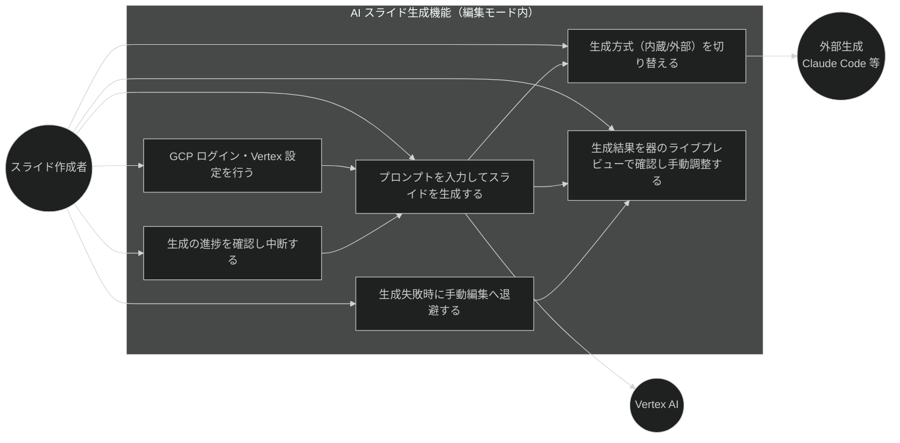

# AI スライド生成機能（内蔵生成） 要求仕様書

## 概要

[Issue #13](https://github.com/ToshikiImagawa/slide-presentation-app/issues/13) で用意した編集モード（器）の上に、**アプリ内のプロンプト入力から Claude で `slides.json` を生成し、器へ流し込んで手動調整・書き出しまで完結できる内蔵生成機能**を追加する。現状、スライド生成は当面「外部（Claude Code 等）に委ねる」方針であり、アプリ単体ではプロンプトからスライドを起こす導線がない。

本 PRD は、この生成フローをアプリに取り込む。具体的には (1) 編集モード内の生成パネルからのプロンプト入力と生成実行、(2) 内蔵（Vertex AI）と外部（Claude Code 等）を切り替えられる**差し込み可能な共通生成インターフェース**、(3) 生成結果 `slides.json` の**器への流し込み**（本番同一レンダラのライブプレビュー＋手動調整）、(4) 生成結果の**バリデーションと自動修正ループ**、(5) **GCP 認証と Vertex 設定の安全な保管**、(6) ネットワーク通信と認証情報を**編集モード かつ 生成有効時のみ**有効化する capability 分離、を定義する。

本 PRD は [Epic #12](https://github.com/ToshikiImagawa/slide-presentation-app/issues/12)「スライド作成機能のアプリ化」配下の第2 Feature（[Issue #14](https://github.com/ToshikiImagawa/slide-presentation-app/issues/14)）である。先行する器 Feature（[slide-edit-mode.md](./slide-edit-mode.md)・[Issue #13](https://github.com/ToshikiImagawa/slide-presentation-app/issues/13)）が「あとから生成機能を差し込める器」として編集・保存・書き出しの基盤を提供済みであり、本 Feature は生成機能を**「編集モードの一入力手段」**としてその器へ差し込む。

編集・保存・書き出し・ライブプレビュー・シリアライズ（`SlideEditor` / ライブプレビュー / 無損失往復 / Rust コマンド境界での書き込みゲート）は [slide-edit-mode.md](./slide-edit-mode.md) が定義済みであり、本 Feature はこれらを**再実装せず再利用**する。本 Feature が新たに導入するのは「生成」「ネットワーク通信」「GCP 認証（ADC）と Vertex 設定の保管」であり、これらはビューワーの読み取り中心の性質と構造的に分離する。

### 背景・目的

#### 現状の課題

- 器（編集モード）は完成したが、スライド生成は外部（Claude Code 等）に委ねる前提であり、**アプリ内でプロンプトからスライドを起こす導線がない**。非エンジニアが外部ツールを併用せずに下書きを得る手段がない。
- 生成を内蔵するにはネットワーク通信と GCP 認証という新しい関心事が加わるが、ビューワーは読み取り中心で外部通信も認証情報も持たない設計である。**安全性を損なわずに生成能力だけを足す**方法が必要。
- 生成 AI の出力は必ずしもスキーマに適合せず、そのまま保存・表示すると壊れる恐れがある。**生成結果を安全に検証し器へ取り込む**仕組みが必要。

#### ビジネス価値

- **オーサリングの内製化（生成の内蔵）**: 作成者がアプリ内で「プロンプト → 生成 → ライブプレビュー → 手動調整 → 書き出し」を完結でき、外部生成ツールへの依存を減らす。
- **capability 分離による安全性**: ネットワークと秘密情報を編集モード・生成有効時のみ有効化することで、ビューワーとしての読み取り中心の安全性を維持したまま生成能力を足せる。
- **外部/内蔵の切替による柔軟性**: 差し込み可能な生成インターフェースにより、内蔵（Vertex AI）と外部（Claude Code 等）を用途・環境に応じて切り替えられる。

#### 方針（確定事項）

- **器を土台にする。** 生成は編集モードの一入力手段として `SlideEditor` の単一真実源へ流し込み、既存のライブプレビュー・保存・書き出しをそのまま再利用する。
- **生成部は差し込み可能なインターフェースにする。** 内蔵（Vertex AI）と外部（Claude Code 等）を編集モード内で切り替え可能とする。
- **ネットワーク・認証情報はネイティブ（Rust）側に閉じる。** GCP 認証は ADC（gcloud ログイン）を用い、Vertex 設定は plugin-store に保管し、HTTP 実行も Rust コマンド境界に集約する。トークン生値・fetch 権限をフロントエンド（JS）へ渡さない。
- **生成失敗でも器は壊さない。** 生成が失敗・オフライン・中断しても、器の手動編集・保存・書き出しは継続でき、生成結果を全体フォールバックへは流さない（A-005）。
- **課金は特別扱いしない。** オンライン依存・課金は UI の注意書きで周知するに留め、コスト上限管理はスコープ外とする（ただし応答タイムアウト・自動修正試行上限でコストを境界付ける）。

---

# 1. 要求図の読み方

## 1.1. 要求タイプ

- **requirement**: 一般的な要求
- **functionalRequirement**: 機能要求
- **performanceRequirement**: パフォーマンス要求
- **designConstraint**: 設計制約

## 1.2. リスクレベル

- **High**: 高リスク（ビジネスクリティカル、実装困難）
- **Medium**: 中リスク（重要だが代替可能）
- **Low**: 低リスク（Nice to have）

## 1.3. 検証方法

- **Analysis**: 分析による検証
- **Test**: テストによる検証
- **Demonstration**: デモンストレーションによる検証
- **Inspection**: インスペクション（レビュー）による検証

## 1.4. 関係タイプ

- **contains**: 包含関係（親要求が子要求を含む）
- **derives**: 派生関係（`A - derives -> B` は B が A から導出される＝A が基盤側・B が派生側。contains と同じ左→右の向き）
- **traces**: トレース関係（要求間の追跡可能性）

---

# 2. 要求一覧

## 2.1. ユースケース図（概要）

**アクター**

| アクター         | 説明                                                            |
|:-------------|:--------------------------------------------------------------|
| スライド作成者     | アプリ内でプロンプトからスライドを生成し、器で調整・書き出す作成者・発表者                       |
| Vertex AI | 内蔵生成の呼び出し先となる外部 LLM サービス（オンライン・従量課金）                          |
| 外部生成（Claude Code 等） | 内蔵の代わりに選択できる外部の生成手段（ローカル CLI 等）                            |

**ユースケース**

| ユースケース                       | 説明                                                                |
|:-----------------------------|:------------------------------------------------------------------|
| プロンプト入力＋生成             | 編集モード内の生成パネルにプロンプトを入力し、`slides.json` を生成する                         |
| 生成方式の切替                 | 差し込み可能な共通生成インターフェースを介して、内蔵（Vertex AI）と外部（Claude Code 等）を切り替える |
| GCP 認証・Vertex 設定の管理        | GCP 認証（ADC）と Vertex 設定（project/region/model）を安全に保管し、設定・更新・削除する                        |
| 生成結果の確認・手動調整         | 生成結果を器の単一真実源へ流し込み、本番同一レンダラのライブプレビューで確認して手動調整する                    |
| 進捗確認・中断                 | 生成中の進捗を確認し、実行中の生成を中断する                                          |
| 失敗時の手動退避               | 生成失敗・オフライン・中断時に、器の手動編集へ安全に退避する                                  |

## 2.2. 機能一覧（テキスト形式）

- 生成の実行（#14）
    - 編集モード内の生成パネルでのプロンプト入力と生成実行
    - 生成の進捗通知・中断・同時実行 1 件制限
- 差し込み可能な生成インターフェース（#14）
    - 内蔵（Vertex AI）と外部（Claude Code 等）を切り替える共通インターフェース
    - 内蔵生成は Rust コマンド境界から Vertex AI（GCP ADC 認証・モデルは利用者設定）を呼び出す
- 生成結果の器への流し込み（#14）
    - 生成 `slides.json` を `SlideEditor` の単一真実源へ流し込み、本番同一レンダラのライブプレビューと手動調整に合流（当面はドキュメント全体の置換）
    - 取り込み時の構造化バリデーションと、不正時の自動修正ループ（上限 N 回・上限で最良候補を退避）
- GCP 認証と Vertex 設定の安全な保管（#14）
    - GCP 認証（ADC）と Vertex 設定（project/region/model）の保管・更新・削除
    - キーの生値はフロントエンド（WebView）へ渡さない
- capability 分離（#14）
    - 生成・ネットワーク通信・キー操作は編集モード かつ 生成有効時のみ実行可能とし、Rust コマンド境界でゲートする
    - キー未設定・外部 CLI 未検出など前提未充足時は生成導線を無効化し設定へ誘導する（事前ゲート）
- 失敗時フォールバック（#14）
    - 生成失敗・オフライン・中断時は器の手動編集へ安全退避し、生成結果を全体フォールバックへは流さない

---

# 3. 要求図（SysML Requirements Diagram）

## 3.1. 全体要求図

```mermaid
requirementDiagram
    requirement GenerationFoundation {
        id: UR_001
        text: "器の上にプロンプトから slides.json を生成し編集モードで調整して仕上げられる内蔵生成機能を提供すること"
        risk: high
        verifymethod: demonstration
    }

    requirement SafeGeneration {
        id: UR_002
        text: "生成に伴うネットワーク通信と秘密情報がビューワーの読み取り中心の安全性を損なわないこと"
        risk: high
        verifymethod: inspection
    }

    functionalRequirement PromptGenerate {
        id: FR_001
        text: "編集モード内の生成パネルでプロンプトを入力し生成を実行できること"
        risk: medium
        verifymethod: demonstration
    }

    functionalRequirement PluggableInterface {
        id: FR_002
        text: "差し込み可能な共通生成インターフェースを介して内蔵と外部を編集モード内で切り替えられること"
        risk: high
        verifymethod: demonstration
    }

    functionalRequirement BuiltinVertex {
        id: FR_003
        text: "内蔵生成は Rust コマンド境界から Vertex AI を設定した Vertex モデルで呼び出すこと"
        risk: high
        verifymethod: test
    }

    functionalRequirement InjectToEditor {
        id: FR_004
        text: "生成結果 slides.json を器の単一真実源へ流し込みライブプレビューと手動調整に合流させること 当面は全体置換"
        risk: high
        verifymethod: demonstration
    }

    functionalRequirement ValidateAutoRepair {
        id: FR_005
        text: "取り込み時に構造化バリデーションを行い不正時は自動修正を上限N回まで試み上限で最良候補を退避しエラー提示すること"
        risk: high
        verifymethod: test
    }

    functionalRequirement KeyStorage {
        id: FR_006
        text: "GCP 認証（ADC）と Vertex 設定を保管し設定更新削除でき生値を WebView へ渡さないこと"
        risk: high
        verifymethod: inspection
    }

    functionalRequirement PreGate {
        id: FR_007
        text: "内蔵はVertex設定未完了 外部は対応CLI未検出の前提未充足時は生成導線を無効化し設定へ誘導すること 判定条件は設計で列挙する"
        risk: medium
        verifymethod: demonstration
    }

    functionalRequirement SafeRetreat {
        id: FR_008
        text: "生成の失敗オフライン中断時は器の手動編集へ安全退避しエラー提示すること 全体フォールバックへ流さない"
        risk: high
        verifymethod: test
    }

    functionalRequirement CapabilityGate {
        id: FR_009
        text: "生成ネットワーク通信キー操作は編集モードかつ生成有効時のみ実行可能とし Rust コマンド境界でゲートすること"
        risk: high
        verifymethod: inspection
    }

    functionalRequirement ProgressCancel {
        id: FR_010
        text: "生成の進捗を通知し実行中の生成を中断でき同時実行を1件に制限すること"
        risk: medium
        verifymethod: demonstration
    }

    requirement NoRegression {
        id: NFR_001
        text: "既存の表示開く発表者ビュー編集モードパッケージ配布が従来どおり動作し typecheck test が通ること"
        risk: high
        verifymethod: test
    }

    requirement RoundTripIntegrity {
        id: NFR_002
        text: "生成結果の器への取り込みが無損失往復 未定義キー HTML customCSS props を壊さないこと"
        risk: high
        verifymethod: test
    }

    requirement LeastPrivilege {
        id: NFR_003
        text: "ネットワーク通信と秘密情報を Rust コマンド境界の単一チョークポイントに集約し fetch や秘密権限を JS へ開放しないこと"
        risk: high
        verifymethod: inspection
    }

    requirement SecretMinimization {
        id: NFR_004
        text: "外部へ送信するのはプロンプトとスキーマ テンプレートと編集起点時の現行 slides.json に限定しキー生値や任意ローカルファイルを送らないこと"
        risk: high
        verifymethod: inspection
    }

    performanceRequirement CostBoundary {
        id: NFR_005
        text: "1回の生成に応答タイムアウトを設け自動修正の試行回数に上限を設けて想定外のコストと時間の増大を防ぐこと"
        risk: medium
        verifymethod: test
    }

    designConstraint ReuseVessel {
        id: DC_001
        text: "器 SlideEditor ライブプレビュー シリアライズ とレンダラを再実装せず再利用すること"
        risk: medium
        verifymethod: inspection
    }

    designConstraint NativeBoundary {
        id: DC_002
        text: "ネットワーク実行と GCP トークン取得を Rust コマンド境界に集約し内蔵はネイティブHTTPで接続し WebView から直接 fetch しないこと"
        risk: high
        verifymethod: inspection
    }

    designConstraint GenerationGate {
        id: DC_003
        text: "生成とキー操作は編集モード状態と生成有効フラグで実行時にゲートし非有効時はコマンドを拒否すること"
        risk: high
        verifymethod: inspection
    }

    designConstraint PersistenceSeparation {
        id: DC_004
        text: "生成器は永続化せず候補 slides.json 文字列を返すのみとし公開slides.jsonへの反映は検証と利用者の明示確定を経ること"
        risk: high
        verifymethod: inspection
    }

    designConstraint FullReplace {
        id: DC_005
        text: "生成出力は当面ドキュメント全体の置換とし部分マージやスライド単位生成は行わないこと"
        risk: low
        verifymethod: inspection
    }

    designConstraint ThemeVariable {
        id: DC_006
        text: "色とフォントは theme CSS 変数経由とし生成 UI は固定 UI テーマに載せ色値をハードコードしないこと"
        risk: low
        verifymethod: inspection
    }

    GenerationFoundation - contains -> PromptGenerate
    GenerationFoundation - contains -> PluggableInterface
    GenerationFoundation - contains -> BuiltinVertex
    GenerationFoundation - contains -> InjectToEditor
    GenerationFoundation - contains -> ValidateAutoRepair
    GenerationFoundation - contains -> SafeRetreat
    GenerationFoundation - contains -> ProgressCancel
    SafeGeneration - contains -> KeyStorage
    SafeGeneration - contains -> PreGate
    SafeGeneration - contains -> CapabilityGate
    PluggableInterface - derives -> BuiltinVertex
    PromptGenerate - derives -> InjectToEditor
    InjectToEditor - derives -> ValidateAutoRepair
    KeyStorage - derives -> PreGate
    SafeGeneration - derives -> BuiltinVertex
    SafeGeneration - derives -> SafeRetreat
    CapabilityGate - traces -> BuiltinVertex
    CapabilityGate - traces -> KeyStorage
    GenerationFoundation - traces -> NoRegression
    InjectToEditor - traces -> RoundTripIntegrity
    CapabilityGate - traces -> LeastPrivilege
    BuiltinVertex - traces -> SecretMinimization
    ValidateAutoRepair - traces -> CostBoundary
    InjectToEditor - traces -> ReuseVessel
    SafeRetreat - traces -> ReuseVessel
    CapabilityGate - traces -> NativeBoundary
    BuiltinVertex - traces -> NativeBoundary
    KeyStorage - traces -> NativeBoundary
    CapabilityGate - traces -> GenerationGate
    ValidateAutoRepair - traces -> PersistenceSeparation
    InjectToEditor - traces -> PersistenceSeparation
    InjectToEditor - traces -> FullReplace
    PromptGenerate - traces -> ThemeVariable
    SafeRetreat - traces -> NoRegression
```

> **既存要求の再利用**: 本 PRD の FR-004（器への流し込み）・FR-008（失敗時退避）・NFR-002（無損失往復）は [slide-edit-mode.md](./slide-edit-mode.md) の `SlideEditor` の単一真実源・ライブプレビュー（FR-002）・無損失往復（FR-004/NFR-002）・安全な保存（FR-005）を前提として派生する（DC-001）。FR-009（capability ゲート）・NFR-003（最小権限）・DC-002（Rust コマンド境界集約）は、同 PRD の capability 分離（FR-011）・最小権限（NFR-003）・書き込みの Rust コマンド境界集約（DC-002）を、**ネットワーク通信と秘密情報の領域へ拡張**したものである。

---

# 4. 要求の詳細説明

## 4.1. ユーザ要求

### UR-001: 内蔵生成の提供（器への差し込み）

スライド作成者が、アプリ内のプロンプト入力から Claude で `slides.json` を生成し、その結果を器（編集モード）へ流し込んで本番同一レンダラのライブプレビューで確認し、手動調整・保存・書き出しまでを完結できること。生成は編集モードの一入力手段として位置づけられ、器の既存フローを再利用すること。

**検証方法:** デモンストレーションによる検証

### UR-002: 安全な生成（capability 分離）

生成に伴って新たに導入されるネットワーク通信と認証情報（GCP トークン）が、ビューワーの読み取り中心の安全性を損なわないこと。ネットワークと認証情報は編集モード かつ 生成有効時のみ有効化され、通信実行とトークン取得はネイティブ（Rust）側に閉じ、フロントエンド（JS）へ fetch 権限やトークンの生値を開放しないこと。

**検証方法:** インスペクション（設計・権限レビュー）による検証

## 4.2. 機能要求

### FR-001: プロンプト入力と生成実行

**優先度**: Must ／ **派生元**: UR-001

編集モード内の生成パネルにプロンプトを入力し、生成を実行できる。生成は器（編集モード）に統合され、生成結果は器の単一真実源へ反映される（FR-004）。生成パネルの UI は色・フォントを `--theme-*` 経由で参照する（DC-006）。

**検証方法:** デモンストレーションによる検証

### FR-002: 差し込み可能な共通生成インターフェース

**優先度**: Must ／ **派生元**: UR-001

生成は、内蔵（Vertex AI）と外部（Claude Code 等）を差し替え可能な**共通の生成インターフェース**を介して行う。抽象の切れ目は「モデル呼び出し」ではなく「生成器（プロンプト → `slides.json` を返す単位）」に置き、外部の完結した生成手段（Claude Code 等）も同一の契約を満たせるようにする。利用者は編集モード内で生成方式を切り替えられる。

**検証方法:** デモンストレーション（内蔵/外部の切替が機能する）による検証

### FR-003: 内蔵生成（Vertex AI 呼び出し）

**優先度**: Must ／ **派生元**: UR-001 / UR-002

内蔵生成は、Rust コマンド境界から Vertex AI（rawPredict）を呼び出して `slides.json` を生成する。認証は GCP ADC（Bearer トークン）で、project/region/model は利用者設定として解決する。呼び出しはネイティブ（Rust）側で行い、GCP トークンの生値やネットワーク権限をフロントエンド（JS）へ渡さない（DC-002）。外部へ送信する情報はプロンプト・スキーマ／テンプレート・現行 `slides.json` に限定する（NFR-004）。

**検証方法:** テストによる検証

### FR-004: 生成結果の器への流し込み

**優先度**: Must ／ **派生元**: UR-001（[slide-edit-mode.md](./slide-edit-mode.md) を再利用）

生成結果 `slides.json` を器（`SlideEditor` の単一真実源）へ流し込み、本番同一レンダラのライブプレビューと手動調整に合流させる。当面、生成はドキュメント全体を置換する（DC-005）。生成器は永続化を行わず候補を返すのみとし、公開 `slides.json`（ランタイム／前回パッケージ）への反映は、バリデーションと利用者の明示確定（保存操作）を経る（DC-004）。

**検証方法:** デモンストレーション（生成結果がライブプレビューに反映され手動調整できる）による検証

### FR-005: 取り込み時バリデーションと自動修正ループ

**優先度**: Must ／ **派生元**: UR-001

生成結果を器へ取り込む際に、既存の構造化バリデーション（`loader.ts` の `getValidationErrors`）で検証する。不正な場合は、検証エラーを Claude へ再投入して**自動修正を上限 N 回まで試みる**。上限に到達しても不正が残る場合は、最良候補を器へ退避したうえで検証エラーを提示する。生成結果を、破損時にプレゼン全体をデフォルトへ差し替える既存の全体フォールバックへは流さない（FR-008・A-005）。

**検証方法:** テストによる検証

### FR-006: GCP 認証と Vertex 設定の安全な保管

**優先度**: Must ／ **派生元**: UR-002

GCP 認証は `gcloud auth application-default login`（ADC）で用意し、Vertex 設定（project/region/model・非秘密）をアプリ内で設定・更新・削除できる。GCP トークンの生値はフロントエンド（WebView）へ渡さない。取得系はトークンに触れず、「設定済み／未設定」等の状態のみを返す。保管・取得・削除・認証はネイティブ（Rust）コマンド境界に集約する（DC-002）。

**検証方法:** インスペクション（設計・権限レビュー）による検証

### FR-007: 前提未充足時の事前ゲート

**優先度**: Should ／ **派生元**: UR-002

生成の前提が満たされないときは、対応する生成導線を無効化し、設定への導線を提示する。対象は少なくとも次を含む: 内蔵生成の Vertex 設定未完了（project/region/model）、外部生成の CLI 未検出（判定条件の完全な列挙は設計フェーズで確定する）。生成不可の状態を実行前に利用者へ明示し、無効な状態での生成実行を未然に防ぐ。

**検証方法:** デモンストレーションによる検証

### FR-008: 失敗時の安全な退避

**優先度**: Must ／ **派生元**: UR-001 / UR-002

生成の失敗・オフライン・中断時は、器の手動編集へ安全に退避し、平易なエラーを提示する。生成不可の状況でも、器の編集・保存・書き出しは従来どおり継続できること。生成結果を全体フォールバックへ流さないこと（A-005）。

**検証方法:** テストによる検証

### FR-009: capability 分離（生成ゲート）

**優先度**: Must ／ **派生元**: UR-002

生成・ネットワーク通信・GCP 認証操作は、**編集モード かつ 生成有効時のみ**実行可能とし、Rust コマンド境界でゲートする。編集モードが無効、または生成が無効なときは、生成・ネットワーク・認証コマンドを拒否する。フロントエンドの表示制御だけに依存せず、ネイティブ側でゲート条件を検査してからネットワーク／GCP 認証に到達する（DC-003）。

**検証方法:** インスペクション（設計・権限レビュー）による検証

### FR-010: 進捗通知・中断・同時実行制限

**優先度**: Should ／ **派生元**: UR-001

生成の進捗を利用者に通知し、実行中の生成を中断できる。生成はネットワーク往復を伴い数秒以上かかり得るため、UI をブロックせず進捗を提示する。同時に実行できる生成は 1 件に制限する。

**検証方法:** デモンストレーションによる検証

## 4.3. 非機能要求

### NFR-001: 既存機能のリグレッションなし

**優先度**: Must ／ **カテゴリ**: 互換性

既存の表示・「開く」・発表者ビュー・編集モード・ビルド時同梱／`.spkg` 配布が従来どおり動作すること。`npm run typecheck` / `npm run test` が通ること。生成機能の追加が View（発表本番）および編集モードの既存挙動を変えないこと。

**検証方法:** テストによる検証

### NFR-002: 取り込みの無損失（データ整合性）

**優先度**: Must ／ **カテゴリ**: 信頼性

生成結果を器へ取り込み、手動調整・保存する往復で、未編集フィールドが変化しないこと。生成 `slides.json` の未定義キー・文字列内 HTML・意味を持つ空白・`customCSS`・任意 `component` props 等を、器の既存の無損失往復を通じて保持すること。

**検証方法:** テストによる検証

### NFR-003: 最小権限（capability）

**優先度**: Must ／ **カテゴリ**: セキュリティ

ネットワーク通信と認証情報（GCP トークン）を、Rust コマンド境界の単一チョークポイントに集約すること。`fetch` 等のネットワーク権限やトークンの生値をフロントエンド（JS）へ開放しないこと。生成無効・編集モード外では、ネットワークにも GCP 認証にも到達しないこと。

**検証方法:** インスペクションによる検証

### NFR-004: 機密最小化（送信情報の限定）

**優先度**: Must ／ **カテゴリ**: セキュリティ

生成のために外部へ送信する情報は、次に限定すること: プロンプト、`slides.json` のスキーマ／テンプレート、（既存スライドを起点に生成する場合の）現行 `slides.json`。GCP トークンの生値・任意のローカルファイル・他パッケージの内容を送信しないこと。送信情報・送信禁止情報を設計で明示し、コードレベルで検証可能とすること。

**検証方法:** インスペクションによる検証

### NFR-005: コスト境界（タイムアウト・試行上限）

**優先度**: Should ／ **カテゴリ**: 信頼性

1 回の生成に応答タイムアウトを設けること。自動修正ループ（FR-005）の試行回数に上限を設け、想定外のコスト・時間の増大を防ぐこと。上限・タイムアウトの目標値は設計フェーズで確定する。

**検証方法:** テストによる検証

## 4.4. 設計制約

### DC-001: 器・レンダラの再利用（非再実装）

生成結果のプレビュー・編集・保存・書き出しは、[slide-edit-mode.md](./slide-edit-mode.md) が定義した器（`SlideEditor` の単一真実源・ライブプレビュー・無損失シリアライズ）と、既存レンダラ（`SlideRenderer` 等）を再実装せず再利用する。これにより「生成結果のプレビュー＝本番ビュー」を保証する。

**検証方法:** インスペクションによる検証

### DC-002: ネットワーク・秘密情報の Rust コマンド境界集約

ネットワーク通信（Vertex AI 呼び出し）と GCP トークン取得は、Rust コマンド境界の単一チョークポイントに集約する。内蔵生成はネイティブ（Rust）側の HTTP 経路で Vertex AI に直接（GCP ADC・Bearer 方式）接続し、WebView からの直接 `fetch` は行わない。`@tauri-apps` の HTTP／秘密系権限や GCP トークンの生値をフロントエンド（JS）へ開放しない。これは [slide-edit-mode.md](./slide-edit-mode.md) の DC-002（書き込みの Rust コマンド境界集約）を、ネットワークと秘密情報の領域へ拡張したものである。

**検証方法:** インスペクションによる検証

### DC-003: 生成ゲート（編集モード＋生成有効）

生成・ネットワーク通信・認証操作は、編集モード状態と生成有効フラグで実行時にゲートする。非有効時はコマンドを拒否する。ゲート検査はネイティブ（Rust）側で行い、ネットワーク／GCP 認証に到達する前に条件を満たすことを保証する。フロントエンドの表示制御だけに依存しない。

**検証方法:** インスペクションによる検証

### DC-004: 永続化の分離（候補を返すのみ）

生成器は永続化（保存・書き出し）を行わず、候補となる `slides.json` 文字列を返すのみとする。公開 `slides.json`（ランタイム／前回パッケージ）への反映は、バリデーション（FR-005）と利用者の明示確定（保存操作）を経て初めて行う。これにより、誤生成が無自覚に保存・配布されることを構造的に防ぐ。

**検証方法:** インスペクションによる検証

### DC-005: 全体置換（部分マージを行わない）

生成出力は当面、ドキュメント全体の置換とする。部分マージ・スライド単位生成は行わない。生成結果は器の単一真実源をまるごと置き換え、その後の微調整は器の手動編集で行う。

**検証方法:** インスペクションによる検証

### DC-006: テーマ・色のハードコード禁止

生成 UI（生成パネル・進捗表示・設定導線）の色・フォントは `--theme-*` CSS 変数経由で参照し、色値をハードコードしない。生成 UI は器と同じく固定 UI テーマ（editorUiTheme）に載せ、プレゼンテーマの波及と分離する（A-002）。

**検証方法:** インスペクションによる検証

---

# 5. 制約事項

## 5.1. 技術的制約

- 生成結果のプレビュー・編集・保存・書き出しは、器（[slide-edit-mode.md](./slide-edit-mode.md)）の `SlideEditor`・ライブプレビュー・無損失シリアライズ・Rust コマンド境界での書き込みゲートを流用する（DC-001 / A-001 / A-003）。
- ネットワーク通信は Rust 側の HTTP 経路で行い、GCP 認証は ADC（gcloud ログイン）を用い、Vertex 設定は plugin-store に保管する。使用ライブラリ（HTTP クライアント）の選定は設計フェーズで確定する（DC-002）。
- 生成結果のバリデーションは既存 `loader.ts` の構造化 `ValidationError` を踏襲する（D-002）。生成結果は外部データ（untrusted）として、使用前に必ずバリデーションする。
- TypeScript strict mode での型安全性を確保する（T-001）。
- 使用する Vertex モデル ID（`@date` 付き。例 `claude-sonnet-4-5@20250929`）は利用者が project/region と併せて設定する。

## 5.2. ビジネス的制約

- プレゼンテーションの表示品質・伝達力に影響を与えない（B-001）。
- 生成失敗・オフライン・キー未設定時も、既存のスライド表示・「開く」・編集モードの手動編集・保存・書き出しは従来どおり可能であること（A-005: フォールバックファースト設計）。
- **課金・オンライン依存は方式別に UI で周知する**（内蔵: Vertex AI へオンライン接続し、利用者の GCP プロジェクトで従量課金が発生する／外部: ローカル CLI 等・Claude Code の導入とログインが前提）。コスト上限管理はスコープ外とし、UI の注意書きで周知するに留める（ただし応答タイムアウト・自動修正試行上限でコストを境界付ける: NFR-005）。

---

# 6. 前提条件

- 器（編集モード）が動作していること: View/Edit モード切替、`SlideEditor` の単一真実源（`text`）と無損失往復、本番同一レンダラのライブプレビュー、`slides.json` 保存・`.spkg` 書き出し、編集モード時のみ書き込みを有効化する capability 分離（[slide-edit-mode.md](./slide-edit-mode.md)）。
- 書き込みが Rust コマンド境界に集約され、編集モード状態でゲートされていること（[slide-edit-mode.md](./slide-edit-mode.md) の DC-002 / FR-011）。本 Feature はこの境界にネットワーク通信・キー操作を追加する。
- 生成結果の取り込みに用いる構造化バリデーション（`loader.ts` の `getValidationErrors`）が存在すること。
- 内蔵生成には Vertex AI を有効化した GCP プロジェクトと `gcloud` ログイン（ADC）・オンライン接続、外部生成には対応する外部生成手段（Claude Code 等）の導入が、利用者環境に用意されること。

---

# 7. スコープ外

以下は本 PRD のスコープ外とします：

- **器側の既存機能**（モード切替・JSON 編集・ライブプレビュー・保存・`.spkg` 書き出し・アドオン付け外し・capability 分離）は先行 Feature [slide-edit-mode.md](./slide-edit-mode.md)（[#13](https://github.com/ToshikiImagawa/slide-presentation-app/issues/13)）で対応済み。
- **課金上限・コスト見積り管理**（トークン/コストの上限設定・事前見積り UI）。オンライン依存・課金は UI の注意書きで周知するに留める。
- **部分マージ・スライド単位生成**（DC-005）。当面は全体置換のみ。
- **トークン単位のストリーミング逐次プレビュー**（v1 は試行・フェーズ単位の進捗通知に留める）。
- **画像・音声・テーマ等アセットの生成**（生成対象は `slides.json` のテキスト構造に限定）。
- **生成履歴の永続化**（v1 はセッション内に留める）。
- **アドオンの生成・オーサリング**（別検討 [Issue #17](https://github.com/ToshikiImagawa/slide-presentation-app/issues/17) の範囲）。

---

# 8. 用語集

| 用語                    | 定義                                                                            |
|:----------------------|:------------------------------------------------------------------------------|
| 内蔵生成                 | アプリが Vertex AI を直接呼び出して `slides.json` を生成する方式                        |
| 外部生成                 | Claude Code 等の外部の生成手段を用いる方式。内蔵と切替可能                                   |
| 生成インターフェース          | 内蔵と外部を差し替え可能にする共通の生成契約（プロンプト → `slides.json` 候補を返す）                    |
| 生成パネル                | 編集モード内でプロンプト入力・生成実行・方式選択・進捗表示を行う UI                              |
| 自動修正ループ              | 生成結果が検証に通らない場合に、検証エラーを Claude へ再投入して上限 N 回まで修正を試みる仕組み             |
| 事前ゲート                | キー未設定・外部 CLI 未検出など前提未充足時に、生成導線を実行前に無効化し設定へ誘導すること              |
| capability 分離         | ネットワーク通信・秘密情報を編集モード かつ 生成有効時のみ有効化し、権限を最小化する設計                  |
| GCP ADC           | `gcloud auth application-default login` が生成する Application Default Credentials。内蔵生成の GCP アクセストークン取得に用いる（ディスクの ADC ファイルを Rust が読みトークン交換） |
| 器（うつわ）               | 生成機能を差し込む先の、編集・保存・書き出しの基盤（[slide-edit-mode.md](./slide-edit-mode.md) が提供）    |
| 単一真実源               | 器が編集対象として保持する `slides.json` テキスト。生成結果はここへ流し込まれる                          |
