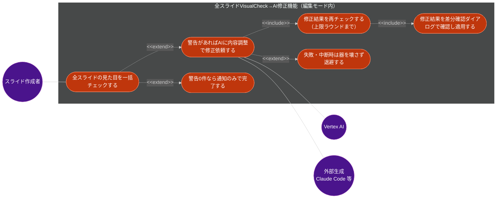

# 全スライドVisualCheck→AI修正機能 要求仕様書

## 概要

編集画面には、スライドの見た目の破綻（はみ出し・セーフエリア侵入・装飾との重なり・埋める要素の高さ0・内部クリッピングの5種）を検出する VisualCheck 機構が既にあるが、現状これを呼べるのは「ライブ実行中に現在表示している1枚のスライドのみ」と「CIスクリプト（配布サンプル・基準見本デッキの検査）」の2箇所に限られ、**編集中に全スライドを一括でチェックする手段がない**。そのため、見切れ等の問題は個別スライドを順番に目視するか、CI検査を待つまで気づけない。

本 PRD は、編集画面の AI 生成パネルに**「全スライドの見た目を一括チェックし、問題が見つかった場合は AI に内容の調整だけで修正させる」新規ボタン**を追加する機能を定義する。既存の AI スライド生成機能（[ai-slide-generation.md](./ai-slide-generation.md)）が持つ「生成 → 検証 → 検証エラー要約を次試行へ再投入する自動修正ループ」を、VisualCheck の警告に対しても同じ経路で適用できるようにし、修正結果は既存の差分確認ダイアログで確認してから適用する。新しい安全性・課金上の懸念を持ち込まないよう、本機能は既存の生成インターフェース・事前ゲート・安全退避・差分確認フローを**再利用**し、独自の適用経路や独自のAI呼び出し口は新設しない。

### 背景・目的

#### 現状の課題

- VisualCheck が検出できる5種の問題は、実際に画面に表示された1枚のスライドの DOM 実測を前提とする設計であり、**編集中に「全スライドまとめてチェックする」導線が存在しない**。作成者は各スライドを手で送って目視するか、CI（配布サンプル検査等）の実行を待つ必要がある。
- 見た目の破綻が見つかった場合、**修正は作成者が文言・構成を手作業で調整する以外の手段がない**。修正案の自動生成を行う仕組みがない。
- 既存の AI 生成機能（[ai-slide-generation.md](./ai-slide-generation.md)）は「生成 → スキーマ検証 → 検証エラー要約を次試行に再投入する」自動修正ループを持つが、これは構造・スキーマ上のエラーのみを対象としており、**見た目（レイアウト実測）の問題を検証入力として使う経路がない**。

#### ビジネス価値

- **見た目の破綻を作成中に発見できる**: 配布・発表直前ではなく編集の時点で全スライドの見た目破綻を一括検出でき、手直しの手戻りを減らす（B-001 表示品質の優先）。
- **修正の内製化**: 見つかった問題をAIに文言・構成の調整だけで直させることで、レイアウト実装を都度変更せずに済み、修正コストを下げる。
- **既存資産の再利用による低リスクな機能追加**: 新しいAI呼び出し口・適用経路を作らず、既存の自動修正ループ・差分確認ダイアログ・capability分離・安全退避をそのまま利用することで、AI生成機能が既に確保した安全性水準を損なわない。

#### 方針（確定事項）

- **既存の自動修正ループにそのまま乗せる。** VisualCheck の警告を、既存の「検証エラー要約を次試行へ再投入する」経路（repairFeedback）と同じ形式で投入し、独自の修正AI呼び出し口を新設しない。
- **全スライド分の実測は、ライブプレビューと同じ描画規則で行う。** アセットパスの解決・ブランドテーマの合成など、ライブプレビューと異なる結果にならないようにする。
- **適用は既存の差分確認ダイアログに一本化する。** 修正結果は新規UIを作らず、既存のAI生成結果の確認・適用フローへ合流させる。
- **AIへの指示は内容（文言・構成）調整に限定する。** レイアウトの実装やコンポーネントの使い方を変える指示は行わない（既知の見切れ修正で採用した方針を本機能のAI指示にも適用する）。
- **警告が無ければAIを呼ばない。** 全スライドチェックで警告が1件も無い場合は、AI呼び出し・課金を発生させずに完了を通知する。
- **AI呼び出しには上限を設ける。** チェック→修正→再チェックのラウンド数に上限を設け、想定外のコスト・時間増大を防ぐ。上限到達後も警告が残る場合は、残数を明示した上でその時点の候補を提示し、隠さない。

---

# 1. 要求図の読み方

## 1.1. 要求タイプ

- **requirement**: 一般的な要求
- **functionalRequirement**: 機能要求
- **performanceRequirement**: パフォーマンス要求
- **designConstraint**: 設計制約

## 1.2. リスクレベル

- **High**: 高リスク（ビジネスクリティカル、実装困難）
- **Medium**: 中リスク（重要だが代替可能）
- **Low**: 低リスク（Nice to have）

## 1.3. 検証方法

- **Analysis**: 分析による検証
- **Test**: テストによる検証
- **Demonstration**: デモンストレーションによる検証
- **Inspection**: インスペクション（レビュー）による検証

## 1.4. 関係タイプ

- **contains**: 包含関係（親要求が子要求を含む）
- **derives**: 派生関係（`A - derives -> B` は B が A から導出される＝A が基盤側・B が派生側）
- **traces**: トレース関係（要求間の追跡可能性）

---

# 2. 要求一覧

## 2.1. ユースケース図（概要）

**アクター**

| アクター | 説明 |
|:---|:---|
| スライド作成者 | 編集画面で全スライドの見た目チェック→AI修正を実行し、差分を確認して適用する作成者 |
| Vertex AI | 既存のAI生成機能が内蔵生成として呼び出す外部LLMサービス（[ai-slide-generation.md](./ai-slide-generation.md) を再利用） |
| 外部生成（Claude Code 等） | 既存のAI生成機能が外部生成として呼び出す手段（[ai-slide-generation.md](./ai-slide-generation.md) を再利用） |

**ユースケース**

| ユースケース | 説明 |
|:---|:---|
| 全スライドの一括チェック | 編集中の全スライドを1枚ずつ実測し、見た目の破綻（5種）を検出する |
| AIへの修正依頼 | 検出した警告を既存の自動修正ループへ投入し、内容調整のみでの修正を依頼する |
| 修正結果の再チェック | AI修正後の候補を再度一括チェックし、警告が残るか確認する（上限ラウンドまで） |
| 差分確認と適用 | 最終候補を既存の差分確認ダイアログへ渡し、確認のうえ器へ適用する |
| 警告0件時の即時完了 | 警告が1件も無ければAIを呼ばずに完了を通知する |
| 失敗・中断時の安全退避 | AI呼び出しの失敗・中断時は器に触れず、既存の安全退避と同じ挙動にする |

## 2.2. 機能一覧（テキスト形式）

- 全スライド一括VisualCheck
    - 編集画面のAI生成パネルに、既存の生成ボタンに隣接する新規ボタンを追加
    - 全スライドを1枚ずつ実測し、警告をスライド単位で集約
    - ライブプレビューと同じ規則（アセット解決・ブランドテーマ合成）で実測する
- 既存自動修正ループへの統合
    - 検出した警告を既存のrepairFeedback経路の書式で投入し、既存のAI生成インターフェース（内蔵/外部の切替を含む）をそのまま呼び出す
    - AIへの指示は内容（文言・構成）調整に限定し、レイアウト実装の変更を促さない
- 再チェックと上限制御
    - AI修正後に再度一括チェックを行い、警告が残る場合は上限ラウンド数まで再投入する
    - 上限到達後も警告が残る場合は残数を明示し、候補をそのまま提示する
- 既存フローへの統合・安全性の継承
    - 最終候補は既存の差分確認ダイアログへ渡し、新規の適用経路を作らない
    - 既存の事前ゲート・中断・失敗時の安全退避を、既存の生成ボタンと共有する（相互排他）
    - 警告0件時はAI呼び出しを行わない

---

# 3. 要求図（SysML Requirements Diagram）

## 3.1. 全体要求図

```mermaid
requirementDiagram
    requirement VisualCheckAndFix {
        id: UR_001
        text: "作成者が全スライドの見た目上の問題を編集画面から一括検出し AIに内容調整だけで修正させ 差分を確認してから適用できること"
        risk: high
        verifymethod: demonstration
    }

    requirement SafeReuse {
        id: UR_002
        text: "既存のAI生成機能が確保した自動修正ループ 事前ゲート 安全退避 差分確認を再利用し新たな安全性リスクを持ち込まないこと"
        risk: high
        verifymethod: inspection
    }

    functionalRequirement CheckButton {
        id: FR_001
        text: "編集画面の生成パネルに既存の生成ボタンへ隣接する新規ボタンを設け押下で全スライドの一括チェックを開始できること"
        risk: medium
        verifymethod: demonstration
    }

    functionalRequirement BulkVisualCheck {
        id: FR_002
        text: "全スライドを1枚ずつ実測し既存のVisualCheck機構で警告を検出しスライド単位で集約すること"
        risk: medium
        verifymethod: test
    }

    functionalRequirement NoIssueShortCircuit {
        id: FR_003
        text: "警告が0件の場合はAI呼び出しを行わず問題なしを通知して終了すること"
        risk: low
        verifymethod: test
    }

    functionalRequirement FeedIntoRepairLoop {
        id: FR_004
        text: "警告がある場合は既存のrepairFeedback経路へ投入し既存の自動修正ループでAIに内容調整のみでの修正を指示すること"
        risk: high
        verifymethod: test
    }

    functionalRequirement RecheckWithBound {
        id: FR_005
        text: "AI修正結果を再チェックし警告が残る場合は上限ラウンド数まで再投入し上限到達後も残る場合は残数を明示すること"
        risk: medium
        verifymethod: test
    }

    functionalRequirement UnifyDiffDialog {
        id: FR_006
        text: "最終候補は既存の差分確認ダイアログへ渡し新規の適用経路を作らず既存のAI生成結果と同一の確認適用フローに統合すること"
        risk: high
        verifymethod: demonstration
    }

    functionalRequirement ShareGateAndCancel {
        id: FR_007
        text: "事前ゲートと中断を既存の生成ボタンと共有し両ボタンを相互排他に制御すること"
        risk: medium
        verifymethod: demonstration
    }

    functionalRequirement ProgressFeedback {
        id: FR_008
        text: "実行中はチェック中 修正依頼中 再チェック中 および既存の試行回数表示を利用者に提示すること"
        risk: low
        verifymethod: demonstration
    }

    requirement NoRegression {
        id: NFR_001
        text: "既存の表示 編集 AI生成 保存 書き出し機能にリグレッションが無いこと typecheck test lintが通ること"
        risk: high
        verifymethod: test
    }

    requirement RenderingParity {
        id: NFR_002
        text: "全スライド一括チェックの実測がライブプレビューと同じ規則で行われ実測結果がライブ表示と一致すること"
        risk: medium
        verifymethod: test
    }

    performanceRequirement CostBoundary {
        id: NFR_003
        text: "チェック修正再チェックのラウンド数に上限を設け想定外のコストと時間の増大を防ぐこと"
        risk: medium
        verifymethod: test
    }

    requirement NonBlockingOffscreen {
        id: NFR_004
        text: "全スライドチェックのオフスクリーン描画が通常の編集操作を妨げないこと"
        risk: low
        verifymethod: demonstration
    }

    designConstraint ReuseRepairLoop {
        id: DC_001
        text: "既存のVisualCheck機構 自動修正ループ 差分確認ダイアログを再実装せず再利用すること"
        risk: medium
        verifymethod: inspection
    }

    designConstraint ReuseRenderer {
        id: DC_002
        text: "オフスクリーン描画は既存の本番同一レンダラをそのまま使い独自の描画ロジックを新設しないこと"
        risk: medium
        verifymethod: inspection
    }

    designConstraint ContentOnlyInstruction {
        id: DC_003
        text: "AI修正の指示は内容の調整のみとしレイアウト実装やコンポーネントの変更を促さないこと"
        risk: low
        verifymethod: inspection
    }

    designConstraint UIThemeConvention {
        id: DC_004
        text: "新規に追加するボタンや進捗表示は既存の編集モードUIと同じテーマCSS変数を用い色値をハードコードしないこと"
        risk: low
        verifymethod: inspection
    }

    VisualCheckAndFix - contains -> CheckButton
    VisualCheckAndFix - contains -> BulkVisualCheck
    VisualCheckAndFix - contains -> NoIssueShortCircuit
    VisualCheckAndFix - contains -> FeedIntoRepairLoop
    VisualCheckAndFix - contains -> RecheckWithBound
    VisualCheckAndFix - contains -> ProgressFeedback
    SafeReuse - contains -> UnifyDiffDialog
    SafeReuse - contains -> ShareGateAndCancel
    BulkVisualCheck - derives -> NoIssueShortCircuit
    FeedIntoRepairLoop - derives -> RecheckWithBound
    RecheckWithBound - derives -> UnifyDiffDialog
    SafeReuse - derives -> FeedIntoRepairLoop
    VisualCheckAndFix - traces -> NoRegression
    BulkVisualCheck - traces -> RenderingParity
    RecheckWithBound - traces -> CostBoundary
    BulkVisualCheck - traces -> NonBlockingOffscreen
    FeedIntoRepairLoop - traces -> ReuseRepairLoop
    UnifyDiffDialog - traces -> ReuseRepairLoop
    BulkVisualCheck - traces -> ReuseRenderer
    FeedIntoRepairLoop - traces -> ContentOnlyInstruction
    CheckButton - traces -> UIThemeConvention
    ProgressFeedback - traces -> UIThemeConvention
```

> **既存要求の再利用**: 本 PRD の FR-004（既存自動修正ループへの投入）・FR-006（差分確認ダイアログへの統合）・FR-007（事前ゲート・中断の共有）は、[ai-slide-generation.md](./ai-slide-generation.md) の FR-002（差し込み可能な生成インターフェース）・FR-004（生成結果の器への流し込み）・FR-005（取り込み時バリデーションと自動修正ループ）・FR-007（前提未充足時の事前ゲート）・FR-010（進捗通知・中断）をそのまま流用する（DC-001）。編集画面自体（`SlideEditor` の単一真実源・保存・書き出し）は [slide-edit-mode.md](./slide-edit-mode.md) が定義済みであり、本機能はこれらを再実装しない。

---

# 4. 要求の詳細説明

## 4.1. ユーザ要求

### UR-001: 全スライドの見た目チェックとAI修正

作成者が、編集画面から全スライドの見た目上の問題（はみ出し・セーフエリア侵入・装飾との重なり・埋める要素の高さ0・内部クリッピング）を一括で検出し、見つかった問題をAIに文言・構成の調整だけで修正させ、その結果を確認してから編集中の内容へ適用できること。

**検証方法:** デモンストレーションによる検証

### UR-002: 既存資産の再利用による安全性の継承

本機能が、既存のAI生成機能が確保した自動修正ループ・事前ゲート・安全退避・差分確認のフローを再利用し、新たな安全性・課金上のリスクを持ち込まないこと。

**検証方法:** インスペクション（設計レビュー）による検証

## 4.2. 機能要求

### FR-001: 一括チェックボタンの追加

**優先度**: Must ／ **派生元**: UR-001

編集画面の生成パネルに、既存の生成ボタンに隣接する新規ボタンを設け、押下で全スライドの一括見た目チェックを開始できる。

**検証方法:** デモンストレーションによる検証

### FR-002: 全スライドの一括VisualCheck

**優先度**: Must ／ **派生元**: UR-001

全スライドを1枚ずつ実測し、既存のVisualCheck機構（はみ出し・セーフエリア侵入・装飾との重なり・埋める要素の高さ0・内部クリッピングの5種）で警告を検出し、どのスライドの警告かが分かる形で集約する。

**検証方法:** テストによる検証

### FR-003: 警告0件時の即時完了

**優先度**: Must ／ **派生元**: UR-001

全スライドチェックで警告が1件も検出されない場合は、AI呼び出しを行わずに「問題なし」を通知して終了する。

**検証方法:** テストによる検証

### FR-004: 既存自動修正ループへの投入

**優先度**: Must ／ **派生元**: UR-001 / UR-002

検出した警告を、既存の検証エラー要約の再投入経路（[ai-slide-generation.md](./ai-slide-generation.md) FR-005 の自動修正ループ）と同じ形式で投入し、既存の生成インターフェース（内蔵/外部の切替を含む）を呼び出す。AIへの指示は文言・構成の調整に限定し、レイアウトの実装やコンポーネントの使い方を変える指示は行わない（DC-003）。

**検証方法:** テストによる検証

### FR-005: 再チェックと上限ラウンド制御

**優先度**: Must ／ **派生元**: UR-001

AI修正後の候補を再度一括チェックし、警告が残っていれば上限ラウンド数まで同じ経路で再投入する。上限に到達しても警告が残る場合は、残数を利用者に明示したうえで、その時点の候補をそのまま次のステップへ進める（隠さない）。

**検証方法:** テストによる検証

### FR-006: 差分確認ダイアログへの統合

**優先度**: Must ／ **派生元**: UR-002（[ai-slide-generation.md](./ai-slide-generation.md) を再利用）

最終候補は、既存のAI生成結果と同一の差分確認ダイアログへ渡し、確認・適用のフローに統合する。本機能専用の新規適用経路・確認UIは作らない。

**検証方法:** デモンストレーションによる検証

### FR-007: 事前ゲート・中断の共有

**優先度**: Should ／ **派生元**: UR-002（[ai-slide-generation.md](./ai-slide-generation.md) を再利用）

既存の生成の事前ゲート（内蔵=Vertex設定済み／外部=CLI利用可能）と中断操作を、本機能のボタンと既存の生成ボタンで共有する。いずれか一方が実行中は、もう一方を無効化し同時実行させない。

**検証方法:** デモンストレーションによる検証

### FR-008: 進捗の提示

**優先度**: Should ／ **派生元**: UR-001

実行中は「チェック中」「AIに修正依頼中」「再チェック中」の段階と、既存の生成が提示する試行回数表示を利用者に提示する。

**検証方法:** デモンストレーションによる検証

## 4.3. 非機能要求

### NFR-001: 既存機能のリグレッションなし

**優先度**: Must ／ **カテゴリ**: 互換性

既存の表示・編集・AI生成・保存・書き出し機能が従来どおり動作すること。`npm run typecheck` / `npm run test` / `npm run lint:css` が通ること。

**検証方法:** テストによる検証

### NFR-002: ライブプレビューとの実測整合性

**優先度**: Must ／ **カテゴリ**: 信頼性

全スライドの一括チェックにおける実測が、ライブプレビューと同じ規則（アセットパスの解決、ブランドテーマの合成）で行われ、ライブ表示時の実測結果と食い違わないこと。

**検証方法:** テストによる検証

### NFR-003: コスト境界（ラウンド数上限）

**優先度**: Should ／ **カテゴリ**: 信頼性

チェック→AI修正→再チェックのラウンド数に上限（2ラウンド）を設け、想定外のコスト・時間の増大を防ぐこと。

**検証方法:** テストによる検証

### NFR-004: 編集操作を妨げない非ブロッキング実行

**優先度**: Should ／ **カテゴリ**: ユーザビリティ

全スライドの一括チェックに使うオフスクリーン描画が、画面上に表示されず、通常のJSON編集・プレビュー切替等の操作を妨げないこと。

**検証方法:** デモンストレーションによる検証

## 4.4. 設計制約

### DC-001: 既存の自動修正ループ・差分確認ダイアログの再利用（非再実装）

本機能は、[ai-slide-generation.md](./ai-slide-generation.md) が定義した自動修正ループ（検証エラー要約の再投入）・差分確認ダイアログ・事前ゲート・安全退避・生成インターフェースを再実装せず再利用する。これにより、既存のAI生成機能が確保した安全性・確認フローの水準をそのまま継承する。

**検証方法:** インスペクションによる検証

### DC-002: 本番同一レンダラの再利用

全スライドの一括チェックに用いるオフスクリーン描画は、既存の本番同一レンダラ（表示・編集プレビューが共通で使うもの）をそのまま使う。チェック専用の新しい描画ロジックは新設しない。

**検証方法:** インスペクションによる検証

### DC-003: AI指示の内容調整限定

AIへの修正指示は、スライドの文言・構成の調整に限定する。レイアウトの実装やコンポーネントの使い方を変える指示は行わない。これは、見た目の破綻に対する望ましい修正手段（実装変更よりコンテンツ調整を優先する）という確定方針に基づく。

**検証方法:** インスペクションによる検証

### DC-004: 新規UI要素のテーマ規約継承

新規に追加するボタン・進捗表示は、既存の編集モードUIと同じテーマCSS変数・MUI `sx` prop を用いて実装し、色値をハードコードしない。

**検証方法:** インスペクションによる検証

---

# 5. 制約事項

## 5.1. 技術的制約

- 本機能は、既存のAI生成機能（[ai-slide-generation.md](./ai-slide-generation.md)）が確立した生成インターフェース・自動修正ループ・事前ゲート・安全退避・capability分離を再利用する（DC-001）。
- 全スライドの一括チェックは、既存のVisualCheck機構（5種の検知）と、既存の本番同一レンダラを再利用する（DC-002）。新しい検知ロジック・描画ロジックの新設はスコープ外。
- TypeScript strict mode での型安全性を確保する（T-001）。

## 5.2. ビジネス的制約

- プレゼンテーションの表示品質・伝達力に影響を与えない（B-001）。むしろ表示品質を損なう問題を編集時点で検出・修正することが本機能の目的そのものである。
- AI呼び出しに伴う課金・オンライン依存は、既存のAI生成機能と同一の注意書き・事前ゲートに従う。本機能独自の追加費用の周知・上限管理はスコープ外とし、ラウンド数上限（NFR-003）でコストを境界付けるに留める。

---

# 6. 前提条件

- 既存のAI生成機能（[ai-slide-generation.md](./ai-slide-generation.md)）が実装済みであること: 生成インターフェース（内蔵/外部切替）・自動修正ループ（repairFeedback）・差分確認ダイアログ・事前ゲート・安全退避。
- 既存のVisualCheck機構（はみ出し・セーフエリア侵入・装飾との重なり・埋める要素の高さ0・内部クリッピングの5種の検知）が実装済みであること。
- 編集画面（[slide-edit-mode.md](./slide-edit-mode.md)）が動作していること: `SlideEditor` の単一真実源、本番同一レンダラのライブプレビュー。

---

# 7. スコープ外

以下は本 PRD のスコープ外とします：

- **個別スライド単位でのチェック実行**。v1では常に全スライドを対象とする。
- **検出パターンごとの専用修正ロジック（ルールベース修正）**。修正案の生成はAIの自由な文言調整に委ね、パターン別の機械的な置換は行わない。
- **チェック実行中（DOM実測フェーズ）のキャンセル**。中断操作が有効になるのはAI呼び出しフェーズのみとし、実測フェーズ自体の中断はv1のスコープ外とする。
- **チェック結果・修正履歴の永続化**。v1はセッション内に留める。
- **VisualCheck機構自体の検知精度の改善・新種の検知パターンの追加**。本PRDは既存の検知結果を利用する側であり、検知ロジック自体の変更は別途扱う。

---

# 8. 用語集

| 用語 | 定義 |
|:---|:---|
| VisualCheck | はみ出し・セーフエリア侵入・装飾との重なり・埋める要素の高さ0・内部クリッピングの5種を検出する既存の仕組み |
| 自動修正ループ | 生成結果が検証に通らない場合に、検証エラー要約を次の試行に再投入して上限回数まで修正を試みる既存の仕組み（[ai-slide-generation.md](./ai-slide-generation.md)） |
| repairFeedback | 自動修正ループで次試行に積む検証エラー・警告の要約文字列 |
| 差分確認ダイアログ | AI生成・修正結果を器へ適用する前に、変更内容を確認するための既存UI |
| オフスクリーン描画 | 画面には表示せず、既存の本番同一レンダラで1枚のスライドを描画して実測する手法 |
| 器（うつわ） | 編集・保存・書き出しの基盤（[slide-edit-mode.md](./slide-edit-mode.md) が提供する `SlideEditor` の単一真実源） |

---

# 9. 原則との関連

| 制約ID | 関連する原則 | 説明 |
|:---|:---|:---|
| DC-001 | A-001 | 既存のVisualCheck機構・自動修正ループ・差分確認ダイアログという既存の責務分離を保ったまま機能を追加し、責務を混在させない |
| DC-001 | A-005 | 既存の自動修正ループが持つ失敗・中断時の安全退避（フォールバックファースト設計）を再利用し、本機能独自の退避経路を作らない |
| DC-002 | A-003 | オフスクリーン描画に既存の本番同一レンダラ（データ駆動描画の単一経路）をそのまま使い、新しい描画経路を作らない |
| DC-003 | B-001 | AI修正の指示を内容調整に限定し、表示品質を損なう実装変更をAIに促さないことで、表示品質の優先を維持する |
| DC-004 | A-002 | 新規UI要素の色・フォントをテーマCSS変数経由で参照し、色値のハードコードを禁止する |
