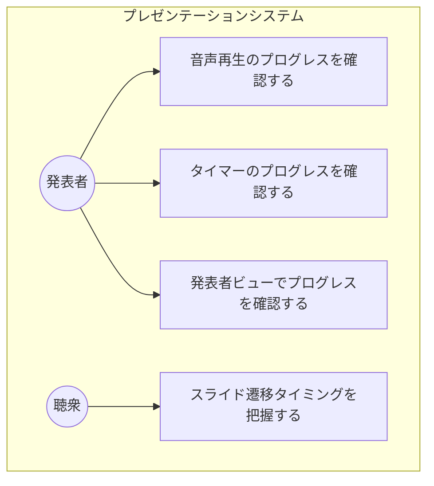
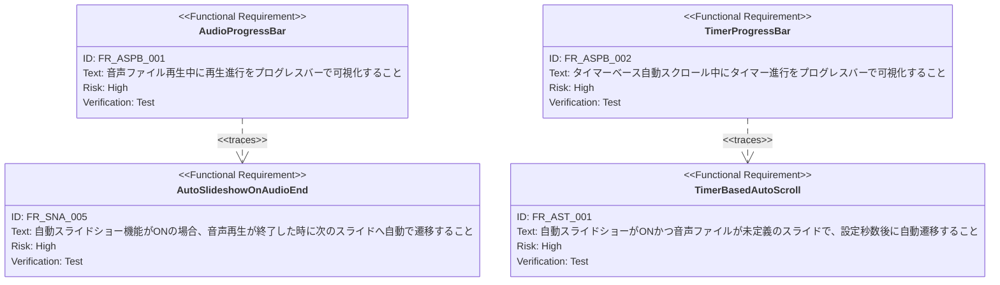

# 自動スクロールプログレスバー（Auto Scroll Progress Bar）要求仕様書

## 概要

本ドキュメントは、自動スクロール（音声再生またはタイマーベース）の進行状況を可視化するプログレスバーの要求を定義する。プログレスバーはメインウィンドウのスライド下部および発表者ビューのコントロールバー下部に左から右へ伸びる形式で表示され、発表者と聴衆の双方に次のスライドへの遷移タイミングを視覚的に示す。音声ファイルがある場合は再生開始から終了まで、タイマーベースの場合はスライド表示から設定時間までの進行をそれぞれ可視化する。

---

# 1. 要求図の読み方

## 1.1. 要求タイプ

- **requirement**: 一般的な要求
- **functionalRequirement**: 機能要求
- **designConstraint**: 設計制約

## 1.2. リスクレベル

- **High**: 高リスク（ビジネスクリティカル、実装困難）
- **Medium**: 中リスク（重要だが代替可能）
- **Low**: 低リスク（Nice to have）

## 1.3. 検証方法

- **Test**: テストによる検証
- **Demonstration**: デモンストレーションによる検証
- **Inspection**: インスペクション（レビュー）による検証

## 1.4. 関係タイプ

- **contains**: 包含関係（親要求が子要求を含む）
- **derives**: 派生関係（要求から別の要求が導出される）
- **traces**: トレース関係（要求間の追跡可能性）

---

# 2. 要求一覧

## 2.1. ユースケース図（概要）

## 2.2. 機能一覧（テキスト形式）

- プログレスバー表示
    - 自動スクロール中にスライド下部にプログレスバーを表示
    - 左から右に伸びるアニメーションで進行を可視化
- 音声再生プログレス
    - 音声ファイル再生時：再生開始（0%）から再生終了（100%）まで進行
- タイマープログレス
    - タイマーベース自動スクロール時：スライド表示（0%）から設定時間経過（100%）まで進行
- 発表者ビュープログレスバー
    - 発表者ビューウィンドウのコントロールバー下部にプログレスバーを表示
    - メインウィンドウと同じ進行状況を同期表示
- 非表示条件
    - 自動スライドショーがOFFの場合はプログレスバーを非表示

---

# 3. 要求図（SysML Requirements Diagram）

## 3.1. 全体要求図

```mermaid
requirementDiagram
    requirement AutoScrollProgressBar {
        id: UR_ASPB_001
        text: "自動スクロール（音声再生またはタイマー）の進行状況を、左から右に伸びるプログレスバーで可視化し、次スライドへの遷移タイミングを発表者と聴衆に示すこと"
        risk: medium
        verifymethod: demonstration
    }

    functionalRequirement AudioProgressBar {
        id: FR_ASPB_001
        text: "音声ファイル再生中に、再生開始から終了までの進行をプログレスバーで左から右に可視化すること"
        risk: high
        verifymethod: test
    }

    functionalRequirement TimerProgressBar {
        id: FR_ASPB_002
        text: "タイマーベース自動スクロール中に、スライド表示から設定時間経過までの進行をプログレスバーで左から右に可視化すること"
        risk: high
        verifymethod: test
    }

    functionalRequirement ProgressBarPosition {
        id: FR_ASPB_003
        text: "プログレスバーがスライドの下部に表示されること"
        risk: medium
        verifymethod: demonstration
    }

    functionalRequirement ProgressBarAnimation {
        id: FR_ASPB_004
        text: "プログレスバーが左端（0%）から右端（100%）へ滑らかに伸びるアニメーションで表示されること"
        risk: medium
        verifymethod: demonstration
    }

    functionalRequirement ProgressBarHideWhenOff {
        id: FR_ASPB_005
        text: "自動スライドショーがOFFの場合、プログレスバーが非表示であること"
        risk: medium
        verifymethod: test
    }

    functionalRequirement ProgressBarResetOnSlideChange {
        id: FR_ASPB_006
        text: "スライドが切り替わった際にプログレスバーが0%にリセットされ、新しいスライドの条件に応じて再度進行を開始すること"
        risk: medium
        verifymethod: test
    }

    designConstraint ProgressBarStyling {
        id: DC_ASPB_001
        text: "プログレスバーのスタイリングはCSS変数（--theme-*）を使用し、テーマとの統一感を保つこと（A-002 準拠）"
        risk: low
        verifymethod: inspection
    }

    designConstraint ProgressBarNonIntrusive {
        id: DC_ASPB_002
        text: "プログレスバーはスライドコンテンツの表示を妨げない位置・サイズで配置すること（B-001 準拠）"
        risk: low
        verifymethod: demonstration
    }

    designConstraint ProgressBarLifecycle {
        id: DC_ASPB_003
        text: "プログレスバーのアニメーション・タイマーのライフサイクルは useEffect で管理し、クリーンアップ時にリソースを解放すること（T-003 準拠）"
        risk: low
        verifymethod: inspection
    }

    functionalRequirement PresenterViewProgressBar {
        id: FR_ASPB_007
        text: "発表者ビューウィンドウのコントロールバー下部に、メインウィンドウと同じ進行状況を示すプログレスバーを表示すること"
        risk: medium
        verifymethod: demonstration
    }

    AutoScrollProgressBar - contains -> AudioProgressBar
    AutoScrollProgressBar - contains -> TimerProgressBar
    AutoScrollProgressBar - contains -> ProgressBarPosition
    AutoScrollProgressBar - contains -> ProgressBarAnimation
    AutoScrollProgressBar - contains -> ProgressBarHideWhenOff
    AutoScrollProgressBar - contains -> ProgressBarResetOnSlideChange
    AutoScrollProgressBar - contains -> PresenterViewProgressBar
    AutoScrollProgressBar - contains -> ProgressBarStyling
    AutoScrollProgressBar - contains -> ProgressBarNonIntrusive
    AutoScrollProgressBar - contains -> ProgressBarLifecycle
    AudioProgressBar - derives -> ProgressBarAnimation
    TimerProgressBar - derives -> ProgressBarAnimation
    PresenterViewProgressBar - derives -> ProgressBarAnimation
    PresenterViewProgressBar - derives -> ProgressBarHideWhenOff
    ProgressBarResetOnSlideChange - derives -> AudioProgressBar
    ProgressBarResetOnSlideChange - derives -> TimerProgressBar
```

## 3.2. 関連PRDとのトレース

---

# 4. 要求の詳細説明

## 4.1. 機能要求

### FR-ASPB-001: 音声再生プログレスバー

音声ファイル（notes.voice）が定義されているスライドで自動スライドショーがONの場合、音声再生の進行状況をプログレスバーで可視化する。プログレスバーは音声の再生開始時に0%（左端）から始まり、再生終了時に100%（右端）に達する。音声の
currentTime / duration の比率に基づいてリアルタイムに更新される。

**優先度:** Must

**検証方法:** テストによる検証

### FR-ASPB-002: タイマープログレスバー

音声ファイルが未定義のスライドでタイマーベース自動スクロールが動作している場合、タイマーの進行状況をプログレスバーで可視化する。プログレスバーはスライド表示時に0%（左端）から始まり、設定されたスクロールスピード（秒数）の経過時に100%（右端）に達する。

**優先度:** Must

**検証方法:** テストによる検証

### FR-ASPB-003: プログレスバー配置

プログレスバーはスライドの下部に細いバー（例：高さ3-4px程度）として表示される。スライドコンテンツと重ならない位置に配置する。

**優先度:** Should

**検証方法:** デモンストレーションによる検証

### FR-ASPB-004: スムーズアニメーション

プログレスバーは左端から右端へ滑らかなアニメーションで伸びる。カクつきや急激な変化がなく、視覚的に自然な進行を表現する。

**優先度:** Should

**検証方法:** デモンストレーションによる検証

### FR-ASPB-005: 自動スライドショーOFF時の非表示

自動スライドショーがOFFの場合、プログレスバーは表示しない。自動スライドショーがONに切り替えられた際に、現在のスライドの条件に応じてプログレスバーの表示を開始する。

**優先度:** Should

**検証方法:** テストによる検証

### FR-ASPB-006: スライド切替時のリセット

スライドが切り替わった際（手動操作・自動遷移の両方）、プログレスバーは0%にリセットされる。新しいスライドの条件（音声あり/なし）に応じて、適切なモード（音声プログレス/タイマープログレス）で再度進行を開始する。

**優先度:** Should

**検証方法:** テストによる検証

### FR-ASPB-007: 発表者ビュープログレスバー

発表者ビューウィンドウのコントロールバー（ナビゲーションボタン・音声コントロールが配置されたヘッダー）の下部に、メインウィンドウと同じ進行状況を示すプログレスバーを表示する。進行率はメインウィンドウから
BroadcastChannel 経由で同期される。自動スライドショーがOFFの場合は非表示とする。

**優先度:** Should

**検証方法:** デモンストレーションによる検証

## 4.2. 設計制約

### DC-ASPB-001: テーマ準拠のスタイリング

プログレスバーのスタイリングはCSS変数（`--theme-*`）を使用し、テーマカラーとの統一感を保つ（CONSTITUTION.md A-002
準拠）。色のハードコードは禁止する。

### DC-ASPB-002: コンテンツ非干渉

プログレスバーはスライドコンテンツの視認性・伝達力を損なわない位置・サイズ・透明度で配置する（CONSTITUTION.md B-001 準拠）。

### DC-ASPB-003: ライフサイクル管理

プログレスバーのアニメーションフレーム（requestAnimationFrame等）やタイマーのライフサイクルは useEffect
で管理し、コンポーネントのアンマウント時やスライド遷移時にリソースを解放する（CONSTITUTION.md T-003 準拠）。

---

# 5. 制約事項

## 5.1. 技術的制約

- TypeScript strict モードで型安全性を確保すること（T-001 準拠）
- Reveal.js の DOM 構造との互換性を維持すること（T-002 準拠）
- アニメーション・タイマーのライフサイクルは useEffect で管理し、クリーンアップ時にリソースを解放すること（T-003 準拠）
- スタイリングは3層モデルに従い、テーマカラーは CSS変数（`--theme-*`）経由で参照すること（A-002 準拠）

## 5.2. ビジネス的制約

- プレゼンテーションの視覚的品質と伝達力を損なわないこと（B-001 準拠）
- プログレスバーは補助的なUI要素であり、スライドの主要コンテンツを遮らないこと

---

# 6. 前提条件

- メインウィンドウでプレゼンテーションが正常に動作していること
- 自動スライドショー機能（[speaker-note-audio.md](./speaker-note-audio.md) FR_SNA_005, FR_SNA_006）が実装済みであること
- 音声再生機能（[speaker-note-audio.md](./speaker-note-audio.md) FR_SNA_001〜FR_SNA_003）が実装済みであること
- タイマーベース自動スクロール機能（[auto-scroll-timer.md](./auto-scroll-timer.md) FR_AST_001）が実装済みまたは同時に実装されること

---

# 7. スコープ外

以下は本PRDのスコープ外とします：

- 残り秒数のテキスト表示（数値カウントダウン）
- プログレスバーのクリックによるシーク操作
- プログレスバーの色・スタイルのカスタマイズUI

---

# 8. 用語集

| 用語                        | 定義                                 |
|---------------------------|------------------------------------|
| プログレスバー（Progress Bar）     | 自動スクロールの進行状況を左から右に伸びるバーで可視化するUI要素  |
| 音声プログレス（Audio Progress）   | 音声ファイル再生の進行に基づくプログレスバーの表示モード       |
| タイマープログレス（Timer Progress） | タイマーベース自動スクロールの進行に基づくプログレスバーの表示モード |
| スクロールスピード（Scroll Speed）   | 音声未定義スライドで次スライドへ自動遷移するまでの待機時間（秒）   |
