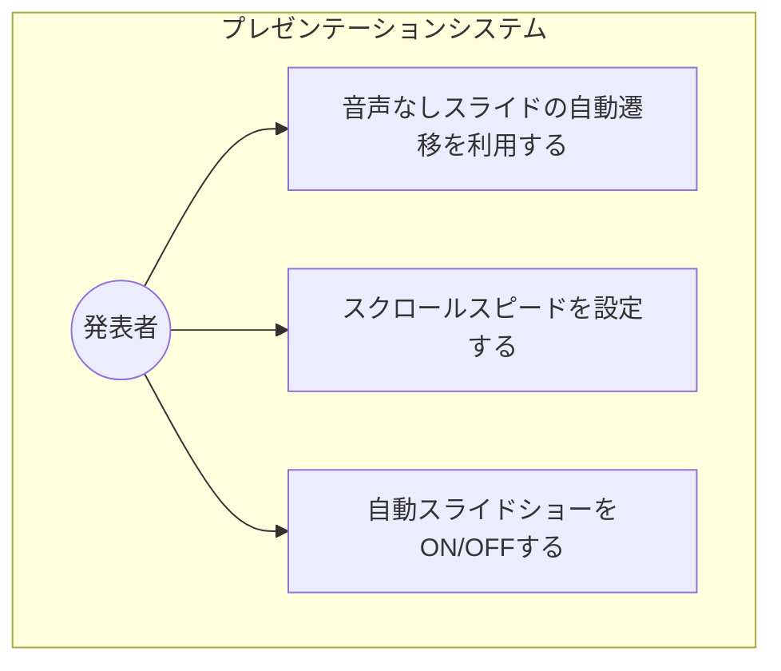
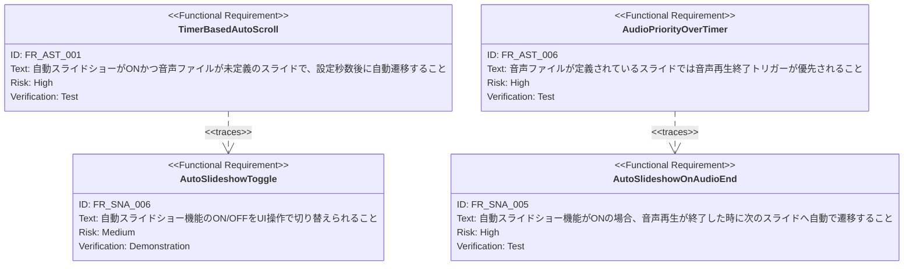

# タイマーベース自動スクロール（Auto Scroll Timer）要求仕様書

## 概要

本ドキュメントは、スライドに音声ファイル（notes.voice）が定義されていない場合に、設定されたスクロールスピード（秒数）に基づいて自動的に次のスライドへ遷移する機能の要求を定義する。既存の自動スライドショー機能（FR_SNA_005）は音声再生終了をトリガーとするが、本機能は音声がないスライドに対して時間ベースの自動遷移を提供し、ハンズフリープレゼンテーションの完全な自動化を実現する。

---

# 1. 要求図の読み方

## 1.1. 要求タイプ

- **requirement**: 一般的な要求
- **functionalRequirement**: 機能要求
- **designConstraint**: 設計制約

## 1.2. リスクレベル

- **High**: 高リスク（ビジネスクリティカル、実装困難）
- **Medium**: 中リスク（重要だが代替可能）
- **Low**: 低リスク（Nice to have）

## 1.3. 検証方法

- **Test**: テストによる検証
- **Demonstration**: デモンストレーションによる検証
- **Inspection**: インスペクション（レビュー）による検証

## 1.4. 関係タイプ

- **contains**: 包含関係（親要求が子要求を含む）
- **derives**: 派生関係（要求から別の要求が導出される）
- **traces**: トレース関係（要求間の追跡可能性）

---

# 2. 要求一覧

## 2.1. ユースケース図（概要）

## 2.2. 機能一覧（テキスト形式）

- タイマーベース自動スクロール
    - 音声ファイル未定義のスライドで、指定秒数後に次スライドへ自動遷移
    - 自動スライドショーがONの場合にのみ動作
- スクロールスピード設定
    - 設定ウィンドウからスクロールスピード（秒数）を変更可能
    - デフォルト値の提供（例：20秒）

---

# 3. 要求図（SysML Requirements Diagram）

## 3.1. 全体要求図

```mermaid
requirementDiagram
    requirement AutoScrollTimer {
        id: UR_AST_001
        text: "音声ファイルが定義されていないスライドにおいて、設定されたスクロールスピード（秒数）に基づき自動的に次のスライドへ遷移できること"
        risk: high
        verifymethod: demonstration
    }

    functionalRequirement TimerBasedAutoScroll {
        id: FR_AST_001
        text: "自動スライドショーがONかつ音声ファイル（notes.voice）が未定義のスライドが表示された場合、設定されたスクロールスピード（秒数）のカウントダウン後に自動的に次のスライドへ遷移すること"
        risk: high
        verifymethod: test
    }

    functionalRequirement ScrollSpeedSetting {
        id: FR_AST_002
        text: "設定ウィンドウからスクロールスピード（秒数）を変更できること"
        risk: high
        verifymethod: demonstration
    }

    functionalRequirement DefaultScrollSpeed {
        id: FR_AST_003
        text: "スクロールスピードのデフォルト値として20秒が設定されていること"
        risk: low
        verifymethod: test
    }

    functionalRequirement TimerResetOnManualNavigation {
        id: FR_AST_004
        text: "タイマーカウント中に手動でスライドを移動した場合、タイマーがリセットされ新しいスライドで再カウントが開始されること"
        risk: medium
        verifymethod: test
    }

    functionalRequirement TimerStopOnLastSlide {
        id: FR_AST_005
        text: "最終スライドではタイマーによる自動遷移を行わないこと"
        risk: medium
        verifymethod: test
    }

    functionalRequirement AudioPriorityOverTimer {
        id: FR_AST_006
        text: "音声ファイル（notes.voice）が定義されているスライドでは、タイマーベースの自動遷移ではなく音声再生終了トリガーの自動遷移（FR_SNA_005）が優先されること"
        risk: high
        verifymethod: test
    }

    designConstraint TimerLifecycleManagement {
        id: DC_AST_001
        text: "タイマーのライフサイクルは useEffect で管理し、コンポーネントのアンマウント時やスライド遷移時にタイマーをクリアすること（T-003 準拠）"
        risk: low
        verifymethod: inspection
    }

    designConstraint DataDrivenScrollSpeed {
        id: DC_AST_002
        text: "スクロールスピードの設定値はデータ駆動で管理し、ハードコードを禁止すること（A-003 準拠）"
        risk: low
        verifymethod: inspection
    }

    AutoScrollTimer - contains -> TimerBasedAutoScroll
    AutoScrollTimer - contains -> ScrollSpeedSetting
    AutoScrollTimer - contains -> DefaultScrollSpeed
    AutoScrollTimer - contains -> TimerResetOnManualNavigation
    AutoScrollTimer - contains -> TimerStopOnLastSlide
    AutoScrollTimer - contains -> AudioPriorityOverTimer
    AutoScrollTimer - contains -> TimerLifecycleManagement
    AutoScrollTimer - contains -> DataDrivenScrollSpeed
    TimerBasedAutoScroll - derives -> ScrollSpeedSetting
    TimerBasedAutoScroll - derives -> DefaultScrollSpeed
    TimerResetOnManualNavigation - derives -> TimerBasedAutoScroll
    TimerStopOnLastSlide - derives -> TimerBasedAutoScroll
    AudioPriorityOverTimer - derives -> TimerBasedAutoScroll
```

## 3.2. 関連PRDとのトレース

---

# 4. 要求の詳細説明

## 4.1. 機能要求

### FR-AST-001: タイマーベース自動スクロール

自動スライドショーがONの状態で、音声ファイル（notes.voice）が定義されていないスライドが表示された場合、設定されたスクロールスピード（秒数）をカウントダウンし、カウント完了後に自動的に次のスライドへ遷移する。音声ファイルが定義されているスライドではこのタイマーは動作せず、既存の音声再生終了トリガー（FR_SNA_005）が使用される。

**優先度:** Must

**検証方法:** テストによる検証

### FR-AST-002: スクロールスピード設定

設定ウィンドウにスクロールスピード（秒数）の入力フィールドを配置し、発表者がスクロールスピードを任意の値に変更できるようにする。設定変更は即座に反映される。

**優先度:** Must

**検証方法:** デモンストレーションによる検証

### FR-AST-003: デフォルトスクロールスピード

スクロールスピードの初期値として20秒を設定する。ユーザーが変更しない限り、この値が使用される。

**優先度:** Could

**検証方法:** テストによる検証

### FR-AST-004: 手動操作時のタイマーリセット

タイマーカウント中に発表者が手動でスライドを前後に移動した場合、現在のタイマーはリセットされ、新しいスライドの表示に応じて再度タイマーが開始される（音声未定義の場合のみ）。

**優先度:** Should

**検証方法:** テストによる検証

### FR-AST-005: 最終スライドでのタイマー停止

最終スライドが表示されている場合、タイマーによる自動遷移は行わない。タイマーは動作しないか、カウントダウンを開始しない。

**優先度:** Should

**検証方法:** テストによる検証

### FR-AST-006: 音声ファイル優先

音声ファイル（notes.voice）が定義されているスライドでは、タイマーベースの自動遷移は無効化され、既存の音声再生終了トリガー（FR_SNA_005:
自動スライドショー）が優先される。これにより、音声ありスライドと音声なしスライドが混在するプレゼンテーションでも一貫した自動進行が実現される。

**優先度:** Must

**検証方法:** テストによる検証

## 4.2. 設計制約

### DC-AST-001: タイマーライフサイクル管理

タイマー（setTimeout/setInterval等）のライフサイクルは useEffect
で管理し、コンポーネントのアンマウント時やスライド遷移時にタイマーをクリアしてメモリリークを防止する（CONSTITUTION.md
T-003 準拠）。

### DC-AST-002: データ駆動型スクロールスピード

スクロールスピードの設定値はデータ駆動で管理し、コード内へのハードコードを禁止する（CONSTITUTION.md A-003
準拠）。設定値はアプリケーション状態として管理される。

---

# 5. 制約事項

## 5.1. 技術的制約

- TypeScript strict モードで型安全性を確保すること（T-001 準拠）
- Reveal.js の DOM 構造との互換性を維持すること（T-002 準拠）
- タイマーのライフサイクルは useEffect で管理し、クリーンアップ時にリソースを解放すること（T-003 準拠）
- スタイリングは3層モデルに従い、テーマカラーは CSS変数（`--theme-*`）経由で参照すること（A-002 準拠）

## 5.2. ビジネス的制約

- プレゼンテーションの視覚的品質と伝達力を損なわないこと（B-001 準拠）
- 自動スクロールが聴衆のコンテンツ理解を妨げない適切なデフォルト値を設定すること

---

# 6. 前提条件

- メインウィンドウでプレゼンテーションが正常に動作していること
- 自動スライドショー機能（[speaker-note-audio.md](./speaker-note-audio.md) FR_SNA_005, FR_SNA_006）が実装済みであること
- slides.json にスライドデータが定義されていること

---

# 7. スコープ外

以下は本PRDのスコープ外とします：

- スライドごとの個別スクロールスピード設定
- プログレスバーによる残り時間の可視化（別PRD [auto-scroll-progress-bar.md](./auto-scroll-progress-bar.md) で定義）
- 音声再生中のタイマー一時停止・再開
- タイマーの一時停止/再開UI

---

# 8. 用語集

| 用語                                      | 定義                                     |
|-----------------------------------------|----------------------------------------|
| スクロールスピード（Scroll Speed）                 | 音声未定義スライドで次スライドへ自動遷移するまでの待機時間（秒）       |
| タイマーベース自動スクロール（Timer-based Auto Scroll） | 音声ファイルがないスライドで、指定秒数後に自動でスライドを遷移させる機能   |
| 自動スライドショー（Auto Slideshow）               | 音声再生終了またはタイマー完了をトリガーに次スライドへ自動遷移する機能の総称 |
| 設定ウィンドウ（Settings Window）                | スクロールスピード等のプレゼンテーション設定を変更するためのUI       |
