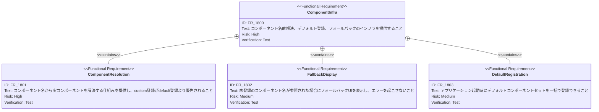

# 組み込みUIコンポーネント群 要求仕様書

## 概要

このドキュメントは、スライドプレゼンテーションで使用する組み込みUIコンポーネントセットの要求仕様を定義します。

SlideRenderer が各レイアウトのスライドを描画する際に使用する再利用可能なUIパーツを提供し、JSON
データから宣言的にプレゼンテーションのビジュアルを構築できるようにすることを目的とします。

### 背景

データ駆動型スライドシステム（slide-content-customization）により、スライドの内容はJSONデータで定義される設計となっています。JSONデータをブラウザ上のビジュアル要素に変換するには、テキスト表示・リスト・コードブロック・タイムラインなど、プレゼンテーションに必要な基本的なUIパーツが揃っている必要があります。これらのコンポーネントはスライド全体で一貫したデザインを提供し、テーマシステムのCSS変数と連動して動作します。

### 目的

- JSONデータから宣言的にスライドビジュアルを構築するためのUIパーツを提供する
- スライド全体で一貫性のある視覚的デザインを実現する
- テーマシステム（CSS変数）と連動し、テーマ変更時にすべてのコンポーネントが追従する
- アドオンによる上書き・拡張の基盤となるデフォルトコンポーネントセットを確立する

---

# 1. 要求図の読み方

## 1.1. 要求タイプ

- **requirement**: 一般的な要求
- **functionalRequirement**: 機能要求
- **performanceRequirement**: パフォーマンス要求
- **designConstraint**: 設計制約

## 1.2. リスクレベル

- **High**: 高リスク（ビジネスクリティカル、実装困難）
- **Medium**: 中リスク（重要だが代替可能）
- **Low**: 低リスク（Nice to have）

## 1.3. 検証方法

- **Test**: テストによる検証
- **Demonstration**: デモンストレーションによる検証
- **Inspection**: インスペクション（レビュー）による検証

## 1.4. 関係タイプ

- **contains**: 包含関係（親要求が子要求を含む）
- **derives**: 派生関係（要求から別の要求が導出される）

---

# 2. 要求一覧

## 2.1. ユースケース図（概要）

## 2.2. 機能一覧（テキスト形式）

- テキスト・見出しコンポーネント
    - スライド見出し（バリアント対応、説明テキスト付き）
    - サブタイトル表示
    - 下線付き見出し
    - 強調テキスト（プライマリカラー適用）
- リストコンポーネント
    - 箇条書きリスト（アイコン付き項目）
    - タイトル付き箇条書きリスト
- レイアウトコンポーネント
    - 2カラムグリッド
    - 機能紹介タイルグリッド（3カラム）
- コード表示コンポーネント
    - ヘッダー付きコードブロック
- タイムラインコンポーネント
    - 縦型タイムライン（番号付きステップ）
- インタラクティブコンポーネント
    - ターミナルアニメーション（タイピングエフェクト、行分類ハイライト、表示トリガー）
    - コマンドリスト（色指定対応）
- リンク・メディアコンポーネント
    - QRコード生成カード
    - GitHubリポジトリリンク
    - フォールバック付き画像表示
- コンポーネントインフラ
    - 名前によるコンポーネント解決（default/custom 二層構造）
    - 未登録コンポーネントのフォールバック表示
    - デフォルトコンポーネントの一括登録

---

# 3. 要求図（SysML Requirements Diagram）

## 3.1. 全体要求図

## 3.2. テキスト・見出しコンポーネント要求図

## 3.3. リストコンポーネント要求図

## 3.4. インタラクティブコンポーネント要求図

## 3.5. コンポーネントインフラ要求図

## 3.6. 非機能要求図

## 3.7. 要求間のトレーサビリティ

---

# 4. 要求の詳細説明

## 4.1. ユーザ要求

### UR_300: 組み込みUIコンポーネント群

スライドプレゼンテーションに必要な組み込みUIコンポーネントセットを提供し、JSONデータから一貫性のあるビジュアルを宣言的に構築できること。コンポーネントはテーマシステムと連動し、アドオンによる上書き・拡張の基盤となること。

**優先度:** Must

**検証方法:** デモンストレーション — 各コンポーネントがスライド上で正しく表示されることを確認

## 4.2. 機能要求

### FR_1100: テキスト・見出しコンポーネント

スライドの見出し、サブタイトル、強調テキストなどテキスト表示に必要なコンポーネントセットを提供する。

**優先度:** Must

**検証方法:** デモンストレーション

| サブ要求    | 優先度    | 説明                      |
|:--------|:-------|:------------------------|
| FR_1101 | Must   | バリアント対応・説明テキスト付きスライド見出し |
| FR_1102 | Should | サブタイトル表示                |
| FR_1103 | Could  | 下線付き見出し                 |
| FR_1104 | Could  | プライマリカラー強調テキスト          |

### FR_1200: リストコンポーネント

箇条書きリストおよびタイトル付きリストなど、リスト表示に必要なコンポーネントセットを提供する。

**優先度:** Must

**検証方法:** デモンストレーション

| サブ要求    | 優先度    | 説明            |
|:--------|:-------|:--------------|
| FR_1201 | Must   | アイコン付き箇条書きリスト |
| FR_1202 | Should | タイトル付き箇条書きリスト |

### FR_1300: レイアウトコンポーネント

2カラムグリッドおよびタイルグリッドなど、スライド内のコンテンツ配置に必要なレイアウトコンポーネントを提供する。

**優先度:** Must

**検証方法:** デモンストレーション

| サブ要求    | 優先度    | 説明                |
|:--------|:-------|:------------------|
| FR_1301 | Must   | 2カラムグリッドレイアウト     |
| FR_1302 | Should | 機能紹介タイルグリッド（3カラム） |

### FR_1400: インタラクティブコンポーネント

ターミナルアニメーションやコマンドリストなど、動的な表示を行うインタラクティブコンポーネントを提供する。

**優先度:** Should

**検証方法:** テスト

| サブ要求    | 優先度    | 説明                                   |
|:--------|:-------|:-------------------------------------|
| FR_1401 | Should | タイピングアニメーション・行分類ハイライト・自動リスタート付きターミナル |
| FR_1402 | Should | URLからのログテキスト取得機能                     |
| FR_1403 | Could  | 色指定対応コマンドリスト                         |

### FR_1500: メディア・リンクコンポーネント

QRコード、GitHubリンク、画像表示など外部リソースとの連携に必要なコンポーネントを提供する。

**優先度:** Could

**検証方法:** デモンストレーション

| サブ要求    | 優先度   | 説明                |
|:--------|:------|:------------------|
| FR_1501 | Could | QRコード生成カード        |
| FR_1502 | Could | GitHubリポジトリリンク表示  |
| FR_1503 | Could | エラー時フォールバック付き画像表示 |

### FR_1600: コード表示コンポーネント

ヘッダー付きのスタイル付きコードブロックを表示するコンポーネントを提供する。

**優先度:** Should

**検証方法:** デモンストレーション

### FR_1700: タイムラインコンポーネント

番号付きステップによる縦型タイムラインを表示するコンポーネントを提供する。

**優先度:** Should

**検証方法:** デモンストレーション

### FR_1800: コンポーネントインフラ

コンポーネントの名前解決、デフォルト登録、未登録時フォールバックなどの基盤機能を提供する。

**優先度:** Must

**検証方法:** テスト

| サブ要求    | 優先度  | 説明                             |
|:--------|:-----|:-------------------------------|
| FR_1801 | Must | 名前解決（custom優先、default フォールバック） |
| FR_1802 | Must | 未登録コンポーネントのフォールバックUI表示         |
| FR_1803 | Must | デフォルトコンポーネントの一括登録              |

## 4.3. 非機能要求

### NFR_300: テーマ連動

すべての組み込みコンポーネントがテーマシステムのCSS変数（`--theme-primary`, `--theme-text-heading`
等）と連動し、テーマ変更時にすべてのコンポーネントの配色・フォントが自動的に追従すること。

**優先度:** Must

**検証方法:** デモンストレーション

### NFR_301: コンポーネントの合成可能性

各コンポーネントが独立して使用可能であり、SlideRenderer や他のコンポーネントから自由に組み合わせて利用できること。コンポーネント間の暗黙的な依存関係を持たないこと。

**優先度:** Must

**検証方法:** テスト

### NFR_302: アニメーションパフォーマンス

TerminalAnimation 等のインタラクティブコンポーネントが60fpsで滑らかに動作し、プレゼンテーション全体のパフォーマンスに悪影響を与えないこと。

**優先度:** Should

**検証方法:** デモンストレーション

### NFR_303: エラー耐性

画像読み込み失敗、コンポーネント未登録、不正なprops など、エラー状態において適切なフォールバック表示を行い、アプリケーションがクラッシュしないこと。

**優先度:** Must

**検証方法:** テスト

---

# 5. 制約事項

## 5.1. 技術的制約

- TypeScript strict モードに準拠すること（T-001）
- Reveal.js の DOM 構造（`.reveal > .slides > section`）内で正しく動作すること（T-002）
- テーマシステムのCSS変数を直接参照し、ハードコードされた色値を使用しないこと

## 5.2. ビジネス的制約

- 1280x720 の解像度で正しく表示されること（B-001）
- プレゼンテーションの視覚的品質と伝達力を支えるデザインであること（B-001）

---

# 6. 前提条件

- データ駆動型スライドシステム（slide-content-customization）が動作していること
- テーマシステム（CSS変数）が適用済みであること
- ComponentRegistry が利用可能であること
- MUI（Material-UI）ライブラリが導入されていること

---

# 7. スコープ外

以下は本PRDのスコープ外とします：

- スライドレイアウトの定義（→ slide-content-customization FR_203 で管理）
- アドオンコンポーネントの実装（→ visual-addon で管理）
- テーマシステム自体の定義（→ slide-content-customization FR_200 で管理）
- SlideRenderer の実装（→ slide-content-customization FR_104 で管理）
- GUIベースのコンポーネントエディタの提供

---

# 8. 用語集

| 用語                    | 定義                                                                 |
|:----------------------|:-------------------------------------------------------------------|
| 組み込みコンポーネント           | アプリケーションにデフォルトで含まれるUIパーツ。アドオンによる上書きが可能                             |
| ComponentRegistry     | コンポーネント名から実コンポーネントを解決する名前解決システム。default/custom の二層構造を持つ            |
| デフォルト登録               | `registerDefaultComponent` によるコンポーネント登録。custom 登録で上書き可能            |
| フォールバック               | コンポーネントが見つからない場合や画像読み込みに失敗した場合に、代替のUIを表示する仕組み                      |
| CSS変数                 | `--theme-primary` 等のCSS カスタムプロパティ。テーマシステムにより動的に値が設定される             |
| SlideRenderer         | スライドデータの `layout` フィールドに基づいて適切なレンダリング関数を呼び出し、組み込みコンポーネントを配置するレンダラー |
| Intersection Observer | ブラウザAPIの一つ。要素が表示領域に入ったことを検知し、TerminalAnimation の開始トリガーとして使用される     |
