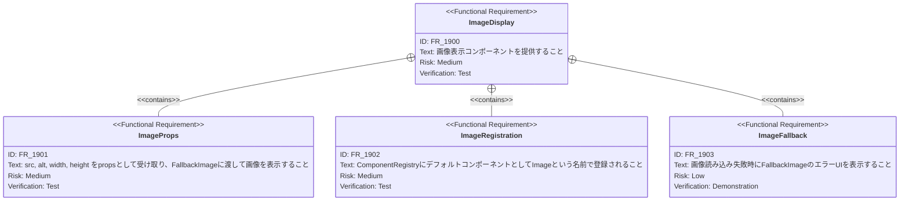
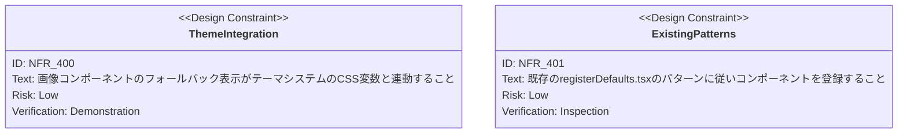

# 画像表示コンポーネント 要求仕様書

## 概要

このドキュメントは、スライドJSON の `component` フィールドから画像を表示できるコンポーネントの要求仕様を定義します。

### 背景

現在、`FallbackImage` コンポーネント（`src/components/FallbackImage.tsx`）は画像表示機能を持っていますが、
`ComponentRegistry` に登録されていないため、スライドJSONの `component` フィールドから参照できません。コンテンツ作成者がスライドに画像を埋め込むには、
`FallbackImage` をラップした専用コンポーネントを `ComponentRegistry` に登録する必要があります。

### 目的

- スライドJSONの `component` フィールドから画像を表示できるようにする
- 既存の `FallbackImage` を活用し、エラー時のフォールバック表示を維持する
- デフォルトスライドに画像表示の使用例を追加し、利用方法を示す

---

# 1. 要求図の読み方

## 1.1. 要求タイプ

- **requirement**: 一般的な要求
- **functionalRequirement**: 機能要求
- **designConstraint**: 設計制約

## 1.2. リスクレベル

- **Medium**: 中リスク（重要だが代替可能）
- **Low**: 低リスク（Nice to have）

## 1.3. 検証方法

- **Test**: テストによる検証
- **Demonstration**: デモンストレーションによる検証

## 1.4. 関係タイプ

- **contains**: 包含関係（親要求が子要求を含む）
- **derives**: 派生関係（要求から別の要求が導出される）

---

# 2. 要求一覧

## 2.1. ユースケース図（概要）

## 2.2. 機能一覧（テキスト形式）

- 画像表示コンポーネント
    - JSON の component フィールドから画像を表示
    - src / alt / width / height を props で指定
    - FallbackImage による読み込みエラー時のフォールバック
- ComponentRegistry への登録
    - デフォルトコンポーネントとして `Image` を登録
- デフォルトスライドへの使用例追加
    - 画像表示コンポーネントの利用方法を示すスライド

---

# 3. 要求図（SysML Requirements Diagram）

## 3.1. 全体要求図

## 3.2. 画像表示コンポーネント要求図

## 3.3. 非機能要求図

---

# 4. 要求の詳細説明

## 4.1. ユーザ要求

### UR_400: 画像表示コンポーネント

スライドJSON の `component` フィールドから画像を表示できるコンポーネントを提供し、デフォルトスライドに使用例を含めること。

**優先度:** Must

**検証方法:** デモンストレーション — スライド上で画像が正しく表示されることを確認

## 4.2. 機能要求

### FR_1900: 画像表示コンポーネント

`FallbackImage` をラップし、`ComponentRegistry` に登録された画像表示コンポーネントを提供する。

**優先度:** Must

**検証方法:** テスト

| サブ要求    | 優先度    | 説明                                        |
|:--------|:-------|:------------------------------------------|
| FR_1901 | Must   | src, alt, width, height を props として受け取り表示 |
| FR_1902 | Must   | ComponentRegistry に `Image` として登録         |
| FR_1903 | Should | 画像読み込み失敗時の FallbackImage エラーUI 表示         |

### FR_2000: デフォルトスライドへの使用例追加

デフォルトスライド（`src/data/default-slides.json`）に画像表示コンポーネントの使用例を含むスライドを追加する。

**優先度:** Should

**検証方法:** デモンストレーション

---

# 5. 制約事項

## 5.1. 技術的制約

- TypeScript strict モードに準拠すること
- 既存の `FallbackImage` コンポーネントを再利用すること
- `registerDefaults.tsx` の既存パターンに従うこと

---

# 6. 前提条件

- `FallbackImage` コンポーネント（`src/components/FallbackImage.tsx`）が実装済みであること
- `ComponentRegistry` が利用可能であること
- `registerDefaultComponents()` が起動時に呼ばれること

---

# 7. スコープ外

以下は本PRDのスコープ外とします：

- 画像のリサイズ・トリミング機能
- 画像のアップロード・管理機能
- 画像ギャラリーやスライドショー機能
- `FallbackImage` 自体の機能変更

---

# 8. 用語集

| 用語                | 定義                                                        |
|:------------------|:----------------------------------------------------------|
| FallbackImage     | 画像読み込み・エラーハンドリング付きの img ラッパーコンポーネント                       |
| ComponentRegistry | コンポーネント名から実コンポーネントを解決する名前解決システム                           |
| component フィールド   | スライド JSON でカスタムコンポーネントを参照するための `{ name, props }` 形式のフィールド |
