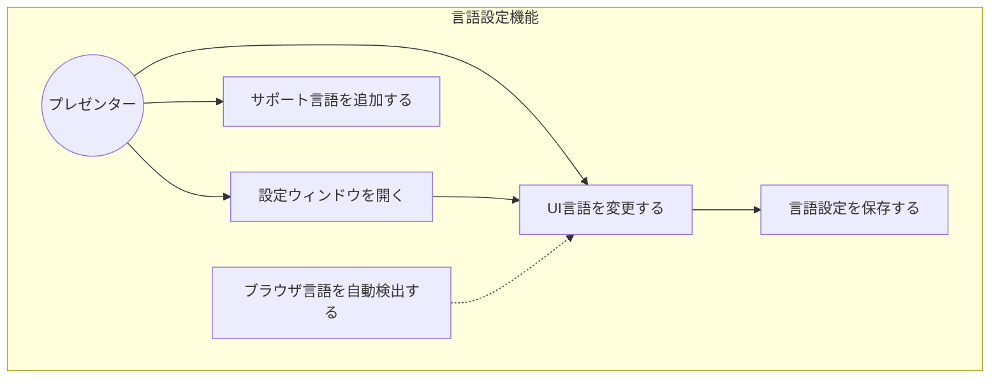

# 言語設定機能 要求仕様書

## 概要

本ドキュメントは、スライドプレゼンテーションアプリのUI言語を切り替える「言語設定機能」の要求仕様を定義する。ユーザーがスライド画面上の設定ボタンから設定ウィンドウを開き、プルダウンでUI表示言語を変更できる仕組みを提供する。言語リソースは
`assets` 配下のJSONファイルとして管理し、ファイル追加のみでサポート言語を拡張可能とする。

---

# 1. 要求図の読み方

## 1.1. 要求タイプ

- **requirement**: 一般的な要求
- **functionalRequirement**: 機能要求
- **performanceRequirement**: パフォーマンス要求
- **interfaceRequirement**: インターフェース要求
- **designConstraint**: 設計制約

## 1.2. リスクレベル

- **High**: 高リスク（ビジネスクリティカル、実装困難）
- **Medium**: 中リスク（重要だが代替可能）
- **Low**: 低リスク（Nice to have）

## 1.3. 検証方法

- **Analysis**: 分析による検証
- **Test**: テストによる検証
- **Demonstration**: デモンストレーションによる検証
- **Inspection**: インスペクション（レビュー）による検証

## 1.4. 関係タイプ

- **contains**: 包含関係（親要求が子要求を含む）
- **derives**: 派生関係（要求から別の要求が導出される）
- **satisfies**: 満足関係（要素が要求を満たす）
- **verifies**: 検証関係（テストケースが要求を検証する）
- **refines**: 詳細化関係（要求をより詳細に定義する）
- **traces**: トレース関係（要求間の追跡可能性）

---

# 2. 要求一覧

## 2.1. ユースケース図（概要）

## 2.2. 機能一覧（テキスト形式）

- 設定UI
    - スライド左上の設定ボタン表示
    - 設定ウィンドウのオーバーレイ表示
- 言語切り替え
    - プルダウンによるUI言語選択
    - 選択後のUI即時反映
- 言語検出・フォールバック
    - ブラウザ言語設定からの自動検出
    - 英語へのフォールバック
- 言語設定の永続化
    - ユーザーが選択した言語の保存
    - 再訪問時の設定復元
- 言語リソース管理
    - assets配下のJSONファイルによる言語定義
    - ファイル追加のみでの言語拡張

---

# 3. 要求図（SysML Requirements Diagram）

## 3.1. 全体要求図

```mermaid
requirementDiagram
    requirement LanguageSettings {
        id: UR_LANG_001
        text: "ユーザーがアプリのUI表示言語を設定ウィンドウから変更できること"
        risk: medium
        verifymethod: demonstration
    }

    functionalRequirement SettingsButton {
        id: FR_LANG_001
        text: "メインスライドの左上に設定ボタンを表示する"
        risk: low
        verifymethod: demonstration
    }

    functionalRequirement SettingsWindow {
        id: FR_LANG_002
        text: "設定ボタン押下時にスライドの上にオーバーレイとして設定ウィンドウを表示する"
        risk: medium
        verifymethod: demonstration
    }

    functionalRequirement LanguageSelector {
        id: FR_LANG_003
        text: "設定ウィンドウ内にプルダウン形式の言語選択UIを表示する"
        risk: low
        verifymethod: demonstration
    }

    functionalRequirement LanguageSwitch {
        id: FR_LANG_004
        text: "プルダウンで言語を選択すると、UIテキストが即座に切り替わる"
        risk: medium
        verifymethod: test
    }

    functionalRequirement LanguageDetection {
        id: FR_LANG_005
        text: "初回訪問時にブラウザの言語設定を検出し、対応言語があればその言語をデフォルトとする"
        risk: low
        verifymethod: test
    }

    functionalRequirement FallbackLanguage {
        id: FR_LANG_006
        text: "ブラウザ言語が非対応の場合、英語をフォールバックとして使用する"
        risk: low
        verifymethod: test
    }

    functionalRequirement PersistLanguage {
        id: FR_LANG_007
        text: "ユーザーが選択した言語設定を永続化し、再訪問時に復元する"
        risk: low
        verifymethod: test
    }

    functionalRequirement LanguageResources {
        id: FR_LANG_008
        text: "言語リソースをassets配下のJSONファイルとして管理し、ファイル配置のみで自動的に読み込む"
        risk: medium
        verifymethod: test
    }

    functionalRequirement MinimumLanguages {
        id: FR_LANG_009
        text: "最低限、日本語（ja-JP）と英語（en-US）をサポートする"
        risk: low
        verifymethod: test
    }

    functionalRequirement SettingsExtensibility {
        id: FR_LANG_010
        text: "設定ウィンドウは将来的に言語以外の設定項目を追加できる構造とする"
        risk: low
        verifymethod: inspection
    }

    LanguageSettings - contains -> SettingsButton
    LanguageSettings - contains -> SettingsWindow
    LanguageSettings - contains -> LanguageSelector
    LanguageSettings - contains -> LanguageSwitch
    LanguageSettings - contains -> LanguageDetection
    LanguageSettings - contains -> FallbackLanguage
    LanguageSettings - contains -> PersistLanguage
    LanguageSettings - contains -> LanguageResources
    LanguageSettings - contains -> MinimumLanguages
    performanceRequirement LanguageLoadTime {
        id: NFR_LANG_001
        text: "言語切り替え時、UIテキストの反映は500ms以内に完了すること"
        risk: low
        verifymethod: test
    }

    LanguageSettings - contains -> SettingsExtensibility
    LanguageSettings - contains -> LanguageLoadTime
    LanguageDetection - derives -> FallbackLanguage
    LanguageResources - derives -> MinimumLanguages
```

---

# 4. 要求の詳細説明

## 4.1. ユーザ要求

### UR-LANG-001: UI言語設定

ユーザー（プレゼンター）がアプリのUI表示言語を自由に変更できること。設定はプレゼンテーション画面から離れることなく行え、選択した言語は次回訪問時にも維持される。

**優先度:** Must

---

## 4.2. 機能要求

### FR-LANG-001: 設定ボタン

メインスライド画面の左上に設定ボタン（アイコン）を常時表示する。ボタンはスライドコンテンツの上にオーバーレイとして配置され、Reveal.jsのスライド操作を妨げない。

**優先度:** Must
**検証方法:** デモンストレーションによる検証

---

### FR-LANG-002: 設定ウィンドウ

設定ボタンを押下すると、スライドの上にモーダル/オーバーレイ形式で設定ウィンドウを表示する。ウィンドウ外のクリックまたは閉じるボタンで非表示にできる。

**優先度:** Must
**検証方法:** デモンストレーションによる検証

---

### FR-LANG-003: 言語選択UI

設定ウィンドウ内にプルダウン（ドロップダウン）形式の言語選択UIを配置する。プルダウンには現在読み込まれているすべてのサポート言語が選択肢として表示される。

**優先度:** Must
**検証方法:** デモンストレーションによる検証

---

### FR-LANG-004: 言語切り替え

プルダウンで言語を選択すると、アプリのUIテキスト（ボタンラベル、ウィンドウタイトル等）が即座に選択した言語に切り替わる。ページリロードは不要とする。

**優先度:** Must
**検証方法:** テストによる検証

---

### FR-LANG-005: ブラウザ言語自動検出

初回訪問時（保存された言語設定がない場合）、ブラウザの言語設定（`navigator.language`）を検出し、対応するサポート言語が存在すればそれをデフォルト言語として使用する。

**優先度:** Should
**検証方法:** テストによる検証

---

### FR-LANG-006: フォールバック言語

ブラウザの言語設定に対応する言語リソースが存在しない場合、または言語リソースの一部キーが欠落している場合、英語（en-US）をフォールバックとして使用する。

**優先度:** Must
**検証方法:** テストによる検証

---

### FR-LANG-007: 言語設定の永続化

ユーザーが言語を選択した後、その設定（例: `ja-JP`）を永続化し、次回アプリを開いた際に自動的に復元する。

**優先度:** Must
**検証方法:** テストによる検証

---

### FR-LANG-008: 言語リソースの自動読み込み

言語リソースファイルを `assets` 配下の所定ディレクトリに格納し、アプリ起動時にディレクトリ内のファイルを自動検出・読み込みする。新しい言語の追加はJSONファイルの配置のみで完了し、コード変更を不要とする。

**バリデーション要件**（D-002準拠）:

- 言語リソースJSONファイルの構造を検証すること
- 必須キーの欠落を検出し、フォールバック言語（en-US）から補完すること
- バリデーションエラーはコンソールに警告として出力し、アプリの動作は継続すること

**優先度:** Must
**検証方法:** テストによる検証

---

### FR-LANG-009: 最低限のサポート言語

日本語（ja-JP）と英語（en-US）の2言語を最低限サポートする。追加言語はJSONファイルの配置で拡張可能。

**優先度:** Must
**検証方法:** テストによる検証

---

### FR-LANG-010: 設定ウィンドウの拡張性

設定ウィンドウは、将来的にテーマ設定など言語以外の設定項目を追加できる構造とする。

**優先度:** Could
**検証方法:** インスペクション（レビュー）による検証

---

## 4.3. 非機能要求

### NFR-LANG-001: 言語切り替えの応答性

言語切り替え時、UIテキストの反映は500ms以内に完了すること。ユーザーが言語を変更した際に遅延を感じないこと。

**優先度:** Should
**検証方法:** テストによる検証

---

# 5. 制約事項

## 5.1. 技術的制約

### アーキテクチャ原則への準拠

本機能は以下のアーキテクチャ原則に従って設計・実装される：

- **A-001（コンポーネント分離）**: 設定ウィンドウは独立したコンポーネントとして実装し、既存のSlideRendererとは分離する
- **A-002（スタイルの階層管理）**: すべての色・フォントは `--theme-*` CSS変数を使用し、色値のハードコードを禁止する
- **A-005（フォールバックファースト設計）**: 言語リソースの読み込み失敗時に英語（en-US）へフォールバックする（FR-LANG-006）
- **D-002（バリデーション駆動型データ処理）**: 言語リソースJSONファイルの構造を検証し、不正なデータに対してフォールバックを提供する

### その他の制約

- 言語リソースファイルの形式はJSONとする
- フォールバック言語は英語（en-US）で固定
- Reveal.jsのスライド操作（キーボードショートカット等）を妨げないUIとすること

## 5.2. ビジネス的制約

- 日本語・英語の2言語は初期リリースで必須

---

# 6. 前提条件

- 既存のスライドプレゼンテーションアプリ（React + Reveal.js）が動作していること
- スライドコンテンツ自体の多言語化は本PRDのスコープ外とする（対象はアプリUIテキストのみ）

---

# 7. スコープ外

以下は本PRDのスコープ外とします：

- スライドコンテンツ（slides.json内のテキスト）の多言語化
- RTL（右から左）言語のサポート
- 言語リソースのリモートサーバーからの動的取得
- 発表者ビューの言語設定（メインビューと連動する場合は対象内）

---

# 8. 用語集

| 用語      | 定義                               |
|---------|----------------------------------|
| UI言語    | アプリのインターフェース（ボタン、ラベル等）の表示言語      |
| 言語リソース  | 各言語のUIテキストを定義するJSONファイル          |
| フォールバック | 指定言語のリソースが見つからない場合に使用される代替言語（英語） |
| 言語コード   | BCP 47形式の言語識別子（例: ja-JP, en-US）  |
