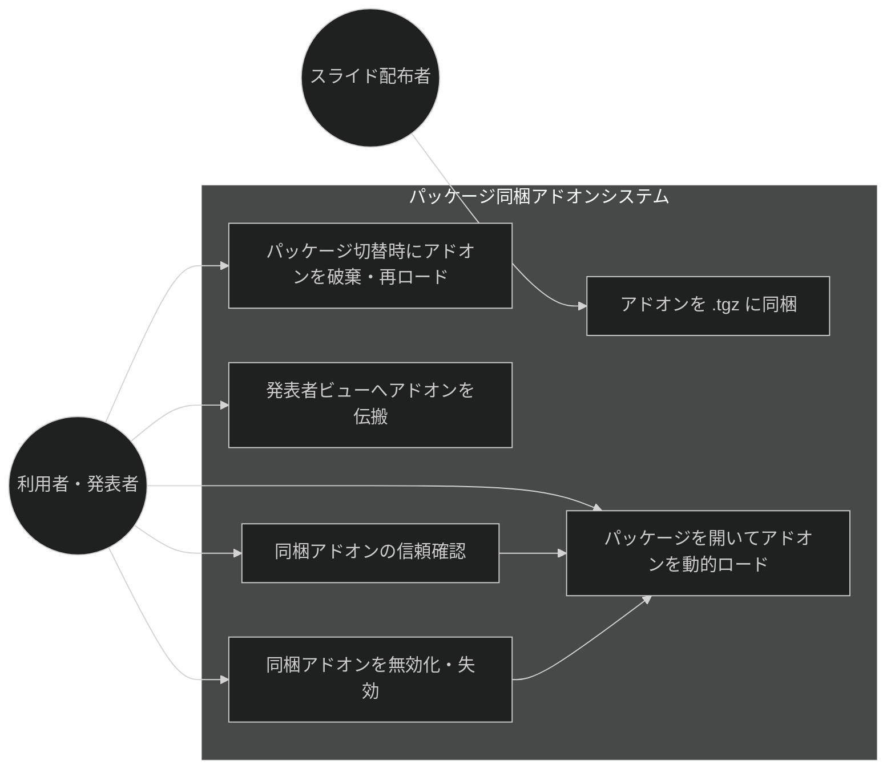

# パッケージ同梱アドオンのランタイムロード 要求仕様書

## 概要

アドオン（ビジュアルコンポーネント群の IIFE バンドル）を、スライドデータと同様に **`.tgz` スライドパッケージに同梱し、そのパッケージを開いたときに起動後に動的ロードして利用できる**ようにする。現状アドオンはビルド時に固定され、起動時に一度だけ `/addons/manifest.json` から読み込まれるため、スライドごとに差し替えられない。本要求では、これを「ローカルスライド選択」と同じく起動後のオーバーレイとして拡張する。

同梱アドオンはサンドボックスなしでアプリと同一権限で実行される（RCE 相当）ため、利用者側での信頼確認・オプトアウトを併せて定義する。

本 PRD は既存の [visual-addon.md](./visual-addon.md)（ビルド時同梱の起動時一括ロード）を上流に持ち、その FR-001（独立 IIFE バンドル化）・FR-002（ComponentRegistry の custom 登録）・DC-001（ComponentRegistry 互換性）を再利用しつつ、ランタイムロード・ライフサイクル・セキュリティ・パッケージング・発表者ビュー伝搬を新規要求として定義する。

### 背景・目的

#### 現状の課題

- アドオンは起動時に一度だけ `/addons/manifest.json` から読み込まれ、ビルド時に固定される。スライド（パッケージ）ごとにアドオンを差し替えられない
- `ComponentRegistry` の `customComponents` はモジュール singleton の Map であり、`App` が `presentationKey` で再マウントされても中身が残る。パッケージ切替時に**古いアドオンの残留・同名の silent 上書き・戻り時の混線**が発生する構造になっている

#### ビジネス価値

- **配布性の向上**: スライド作成者が必要なビジュアルコンポーネントをパッケージに同梱して配布でき、受け手はパッケージを開くだけで完結する
- **拡張性の向上**: スライドごとに固有のアドオンを持てるため、本体ビルドを変更せずに表現を拡張できる
- **安全性の担保**: 実行コードを含むパッケージに対して利用者が実行可否を制御でき、信頼できない発行元からの被害を緩和できる

---

# 1. 要求図の読み方

## 1.1. 要求タイプ

- **requirement**: 一般的な要求
- **functionalRequirement**: 機能要求
- **performanceRequirement**: パフォーマンス要求
- **designConstraint**: 設計制約

## 1.2. リスクレベル

- **High**: 高リスク（ビジネスクリティカル、実装困難）
- **Medium**: 中リスク（重要だが代替可能）
- **Low**: 低リスク（Nice to have）

## 1.3. 検証方法

- **Analysis**: 分析による検証
- **Test**: テストによる検証
- **Demonstration**: デモンストレーションによる検証
- **Inspection**: インスペクション（レビュー）による検証

## 1.4. 関係タイプ

- **contains**: 包含関係（親要求が子要求を含む）
- **derives**: 派生関係（要求から別の要求が導出される）
- **traces**: トレース関係（要求間の追跡可能性）

---

# 2. 要求一覧

## 2.1. ユースケース図（概要）

**アクター**

| アクター       | 説明                                                     |
|:-----------|:-------------------------------------------------------|
| スライド配布者    | アドオンをスライドパッケージ（`.tgz`）に同梱して配布する開発者・作成者                |
| 利用者・発表者    | パッケージを開いてスライドを表示・発表し、同梱アドオンの実行可否を判断する                  |

**ユースケース**

| ユースケース                | 説明                                                        |
|:----------------------|:----------------------------------------------------------|
| アドオンを `.tgz` に同梱      | `export-slides --addons` でビルド済みアドオンをパッケージに含める             |
| パッケージを開いてアドオンを動的ロード | 起動後に開いた `.tgz` の `addons/manifest.json` を読み、バンドルをロードする    |
| パッケージ切替時に破棄・再ロード     | パッケージ A→B 切替時に A のアドオンを破棄し、B のアドオンをロードしてから再マウントする          |
| 発表者ビューへ伝搬            | 別ウィンドウの発表者ビューにも同じアドオンをロード・登録する                            |
| 同梱アドオンの信頼確認         | 実行コードを含むパッケージの初回オープン時に許可/拒否を確認する                          |
| 同梱アドオンを無効化・失効       | 設定で一律無効化し、許可済みパッケージの判断を失効（リセット）する                         |

## 2.2. 機能一覧（テキスト形式）

- ランタイムロード（#6）
    - `.tgz` 展開ディレクトリの IIFE バンドルを asset URL 経由で `<script>` 注入してロード
    - manifest 読取と `<script>`/`<style>` 注入の共通化・冪等化
- ライフサイクル管理（#6）
    - `ComponentRegistry` のオーナースコープ付き登録・アンロード API
    - パッケージ切替時の「旧破棄 → await ロード → 再マウント」順序制御
- 発表者ビュー伝搬（#6）
    - `PresenterViewMessage` の拡張によるアドオン変更の通知
    - 発表者ビューでの描画前ロード・切替時アンロード
- パッケージング（#6）
    - `export-slides --addons` による同梱と manifest の相対パス化
- セキュリティ・オプトアウト（#7）
    - 初回オープン時の信頼確認ダイアログ（既定拒否）と path 単位の永続化
    - 設定での一律無効化と許可済み path の失効
    - ロード対象を manifest 宣言かつ `baseDir/addons/` 配下に限定

---

# 3. 要求図（SysML Requirements Diagram）

## 3.1. 全体要求図

```mermaid
requirementDiagram
    requirement PackageEmbeddedAddon {
        id: UR_001
        text: "配布者が .tgz に同梱したアドオンを、開いた利用者が起動後にロードして利用できること"
        risk: high
        verifymethod: demonstration
    }

    requirement AddonSecurity {
        id: UR_002
        text: "利用者が信頼できない同梱アドオンの実行を拒否・無効化できること"
        risk: high
        verifymethod: demonstration
    }

    functionalRequirement RuntimeLoad {
        id: FR_001
        text: "manifest 記載の IIFE を asset URL 経由で script 注入し起動後にロードすること"
        risk: high
        verifymethod: demonstration
    }

    functionalRequirement OwnerScopedRegistry {
        id: FR_002
        text: "ComponentRegistry に owner 単位の登録・アンロード API を追加すること"
        risk: medium
        verifymethod: test
    }

    functionalRequirement SwitchLifecycle {
        id: FR_003
        text: "パッケージ切替時に旧破棄 await ロード 再マウントの順序を守ること"
        risk: high
        verifymethod: test
    }

    functionalRequirement IdempotentLoader {
        id: FR_004
        text: "同一バンドルの script 二重注入を防止すること"
        risk: medium
        verifymethod: test
    }

    functionalRequirement PackageAddonResolution {
        id: FR_005
        text: "allow_asset_dir 後に addons manifest を読み bundle を asset URL 化して返すこと"
        risk: medium
        verifymethod: test
    }

    functionalRequirement PresenterPropagation {
        id: FR_006
        text: "発表者ビューへアドオン変更を伝搬し描画前にロード登録すること"
        risk: medium
        verifymethod: demonstration
    }

    functionalRequirement AddonPackaging {
        id: FR_007
        text: "export-slides でアドオンを同梱し manifest を相対パス化すること"
        risk: low
        verifymethod: test
    }

    functionalRequirement TrustConfirmation {
        id: FR_008
        text: "同梱アドオン初回オープン時に確認ダイアログを出し既定拒否で path 単位に永続化すること"
        risk: high
        verifymethod: demonstration
    }

    functionalRequirement GlobalOptOut {
        id: FR_009
        text: "設定で同梱アドオンを一律無効化でき許可済み path を失効できること"
        risk: medium
        verifymethod: demonstration
    }

    functionalRequirement LoadScopeLimit {
        id: FR_010
        text: "ロード対象を manifest 宣言かつ baseDir addons 配下に限定すること"
        risk: high
        verifymethod: inspection
    }

    requirement SwitchRobustness {
        id: NFR_003
        text: "A B A 切替でアドオンの残留や混線が起きないこと"
        risk: high
        verifymethod: test
    }

    designConstraint RegistryResolveOrder {
        id: DC_001
        text: "解決順 custom default fallback は不変とし追加 API のみとすること"
        risk: medium
        verifymethod: inspection
    }

    designConstraint TauriRuntimeOnly {
        id: DC_002
        text: "対象は Tauri ランタイム経路に限定し dev build 経路は対象外とすること"
        risk: low
        verifymethod: inspection
    }

    designConstraint NoOriginIsolation {
        id: DC_003
        text: "React 単一インスタンス共有要件のため origin iframe 分離は採らないこと"
        risk: medium
        verifymethod: inspection
    }

    designConstraint LoadOrderConstraint {
        id: DC_004
        text: "展開 allow_asset_dir script 注入の順序を守ること allow 前は 403 となる"
        risk: high
        verifymethod: test
    }

    PackageEmbeddedAddon - contains -> RuntimeLoad
    PackageEmbeddedAddon - contains -> OwnerScopedRegistry
    PackageEmbeddedAddon - contains -> SwitchLifecycle
    PackageEmbeddedAddon - contains -> IdempotentLoader
    PackageEmbeddedAddon - contains -> PackageAddonResolution
    PackageEmbeddedAddon - contains -> PresenterPropagation
    PackageEmbeddedAddon - contains -> AddonPackaging
    AddonSecurity - contains -> TrustConfirmation
    AddonSecurity - contains -> GlobalOptOut
    AddonSecurity - contains -> LoadScopeLimit
    SwitchLifecycle - derives -> OwnerScopedRegistry
    RuntimeLoad - derives -> PackageAddonResolution
    RuntimeLoad - derives -> IdempotentLoader
    TrustConfirmation - traces -> RuntimeLoad
    LoadScopeLimit - traces -> PackageAddonResolution
    SwitchRobustness - traces -> SwitchLifecycle
```

> **既存要求の再利用**: 本 PRD の FR-001（ランタイムロード）は [visual-addon.md](./visual-addon.md) の FR-001（独立 IIFE バンドル化）・FR-002（ComponentRegistry の custom 登録）を前提として派生する。DC-001 は visual-addon の DC-001（ComponentRegistry 互換性）を継承し、「解決ロジックは不変・追加 API のみ」と明文化したものである。

---

# 4. 要求の詳細説明

## 4.1. ユーザ要求

### UR-001: パッケージ同梱アドオンのランタイムロード

スライド配布者が `.tgz` パッケージにアドオンを同梱でき、パッケージを開いた利用者が起動後にそのアドオンをロードして、スライドの `{ "component": { "name": ... } }` 参照を解決・描画できること。

**検証方法:** デモンストレーションによる検証

### UR-002: 同梱アドオンの実行制御

同梱アドオンはサンドボックスなしでアプリと同一権限で実行される（RCE 相当）ため、利用者が信頼できないパッケージの同梱アドオン実行を拒否・無効化できること。

**検証方法:** デモンストレーションによる検証

## 4.2. 機能要求

### FR-001: パッケージ同梱アドオンのランタイムロード

**優先度**: Must ／ **派生元**: UR-001（[visual-addon.md](./visual-addon.md) FR-001/FR-002 を再利用）

`.tgz` を開いた後、パッケージ内 `addons/manifest.json` に宣言されたバンドルを、`convertFileSrc` が返す asset URL を `<script src>` に注入することで起動後にロードする。ロード方式は実機（macOS/WKWebView）で確認済みの「IIFE + asset URL の `<script>` 注入」を採る。

**検証方法:** デモンストレーション（パッケージを開きコンポーネントが解決される）による検証

### FR-002: オーナースコープ型レジストリ API

**優先度**: Must ／ **派生元**: UR-001

`ComponentRegistry` に、登録時の所有者（owner）を記録する登録 API と、指定 owner の custom 登録のみを削除するアンロード API を追加する。default 登録は温存する。同名別 owner の登録は警告する。既存の `resolveComponent` の解決順（custom → default → fallback）は変更しない（DC-001）。

**検証方法:** テストによる検証

### FR-003: パッケージ切替のライフサイクル制御

**優先度**: Must ／ **派生元**: UR-001

パッケージ切替時に、**(1) 旧 owner のアンロード → (2) 新バンドルの `<script>` 注入と `onload` の `await` → (3) 再マウント（データ差し替え）** の順序を厳守する。`customComponents` は React 状態ではないため、描画前に登録が完了している必要がある。

**検証方法:** テスト（A→B→A 切替の残留・混線がないこと）による検証

### FR-004: ローダの冪等化

**優先度**: Must ／ **派生元**: UR-001

同一 `src` のバンドルは、同一パッケージの再オープンや複数回のロードでも二重に注入されないよう冪等化する。（現行アドオンは JS のみを出力し CSS ファイルを持たないため、`<style>` の冪等化は将来アドオンが CSS を出力する場合の条件付き対応とする。）

**検証方法:** テストによる検証

### FR-005: パッケージからのアドオン解決

**優先度**: Must ／ **派生元**: UR-001

パッケージ読み込み処理は、`allow_asset_dir` 完了後に `${baseDir}/addons/manifest.json` を読み、各バンドルを `convertFileSrc` で asset URL 化し、owner（= `baseDir`）とともに呼び出し側へ返す。

**検証方法:** テストによる検証

### FR-006: 発表者ビューへのアドオン伝搬

**優先度**: Must ／ **派生元**: UR-001

別ウィンドウ（別レジストリ）の発表者ビューにも同じアドオンをロード・登録する。メインウィンドウはパッケージ切替時および発表者ビューの ready 受信時にアドオン変更を通知し、発表者ビューはスライド描画前にロード・登録し、切替時は旧 owner をアンロードする。

**検証方法:** デモンストレーション（発表者ビューで fallback にならないこと）による検証

### FR-007: パッケージング

**優先度**: Must ／ **派生元**: UR-001

`export-slides` にアドオン同梱オプションを追加し、ビルド済みアドオン（`addons.iife.js` / `manifest.json`）をパッケージの `addons/` に含める。manifest のバンドルパスはルート絶対（`/addons/…`）からパッケージ相対へ書き換え、パッケージの同梱ファイル一覧に `addons` を追加する。空同梱を防ぐため、エクスポート前にアドオンビルドを前段として実行する。

**検証方法:** テストによる検証

### FR-008: 初回信頼確認とオプトアウト（既定拒否）

**優先度**: Must ／ **派生元**: UR-002

同梱アドオンを含むパッケージの初回オープン時に確認ダイアログを表示する。**既定の挙動は「拒否」**とし、利用者が明示的に「有効化」を選ばない限りアドオンをロードしない。判断結果（許可/拒否）は path 単位で永続化し、次回以降は再確認しない。拒否した場合でもスライド自体は開け、未解決コンポーネントは fallback で描画する。

**検証方法:** デモンストレーションによる検証

### FR-009: グローバル無効化と失効

**優先度**: Should ／ **派生元**: UR-002

設定に「同梱アドオンを常に無効化する」トグルを追加する。ON の場合は確認ダイアログを出さず、一律で同梱アドオンをロードしない。また、許可済み path の判断をまとめて失効（リセット）できる導線を提供する。

**検証方法:** デモンストレーションによる検証

### FR-010: ロード対象の限定

**優先度**: Must ／ **派生元**: UR-002

ロードするのは manifest に宣言されたバンドルのみとし、`${baseDir}/addons/` 配下に限定する。スコープ外のパスは読み込まない。

**検証方法:** インスペクション（コードレビュー）による検証

## 4.3. 非機能要求

### NFR-001: セキュリティ（RCE 緩和）

**優先度**: Must ／ **カテゴリ**: セキュリティ

同梱 JS はホストと同一 origin・同一権限で実行される（本アプリ構成の本質的リスク）。利用者が実行を止められる制御を必ず提供し、既定挙動は「確認して拒否」とする。信頼できる発行元のパッケージのみを開くべきこと、およびアドオンを無効化できることをドキュメントに明記する。

**検証方法:** インスペクション（設計・ドキュメントレビュー）による検証

### NFR-002: 既存機能のリグレッションなし

**優先度**: Must ／ **カテゴリ**: 互換性

既存のビルド時同梱（`public/slides.json`・`VITE_SLIDE_PACKAGE` 経由の npm パッケージ／`.tgz` 配布）と、起動時の組み込み `/addons/manifest.json` ロードは従来どおり動作すること。`npm run typecheck` / `npm run test` が通ること。

**検証方法:** テストによる検証

### NFR-003: 切替の堅牢性

**優先度**: Must ／ **カテゴリ**: 信頼性

パッケージ A→B→A と切り替えても、A のアドオンが B に残らず、同名衝突・混線が起きないこと。ホーム復帰・サンプル表示時には custom 登録がクリアされること。

**検証方法:** テストによる検証

### NFR-004: 実機互換性

**優先度**: Should ／ **カテゴリ**: 互換性

macOS（WKWebView）で asset URL の `<script>` 実行が可能であること（実機 PoC で確認済み）。Windows（WebView2）での動作はフォローアップとして追跡する。

**検証方法:** デモンストレーション（実機確認）による検証

## 4.4. 設計制約

### DC-001: ComponentRegistry 解決順の不変

`resolveComponent` の解決順（custom → default → fallback）は変更しない。owner 管理は追加 API として実装し、既存の解決ロジックには手を入れない。これは [visual-addon.md](./visual-addon.md) の DC-001（ComponentRegistry 互換性）を継承し、「解決ロジックは不変・追加 API のみ」と明文化したものである。

**検証方法:** インスペクションによる検証

### DC-002: Tauri ランタイム経路への限定

本要求の対象は Tauri ランタイム経路（`.tgz` をローカルで開いて起動後にアドオンをロードする経路）に限定する。dev/build（Vite）経路での同梱アドオン配信はスコープ外とする。

**検証方法:** インスペクションによる検証

### DC-003: origin/iframe 分離を採らない

別 origin / iframe による分離は、React 単一インスタンス共有の要件と両立しないため採用しない。分離ではなくオプトアウトによってセキュリティリスクを緩和する。

**検証方法:** インスペクションによる検証

### DC-004: ロード順序制約

アドオンのロードは「`.tgz` 展開 → `allow_asset_dir(baseDir)` → `<script>` 注入」の順序を守る。`allow_asset_dir` 実行前に asset URL を読むと 403 になる（実機 PoC で確認済み）。

**検証方法:** テストによる検証

---

# 5. 制約事項

## 5.1. 技術的制約

- CSP 無効（`tauri.conf.json` の `csp: null`）と asset プロトコルの `text/javascript` 配信を前提とする
- 既存の IIFE ローダ（`loadAddonScript` / `addon-bridge` / `window.__ADDON_REGISTER__`）を流用する（A-004: 多層コンポーネントレジストリ）
- TypeScript strict mode での型安全性を確保する（T-001）
- `ComponentRegistry` の解決優先順位を維持する（A-004、DC-001）

## 5.2. ビジネス的制約

- プレゼンテーションの表示品質・伝達力に影響を与えない（B-001）
- アドオン拒否時もスライドは表示可能であること（A-005: フォールバックファースト設計）

---

# 6. 前提条件

- `extract_slide_package`（`.tgz` 展開）と `allow_asset_dir`（asset スコープの再帰許可）が Rust 側に存在すること
- `convertFileSrc` によりローカルパスを asset URL 化できること
- 実機 PoC（#5）で macOS における asset URL の `<script>` 実行が確認済みであること
- `ComponentRegistry` が default/custom の二層構造で動作していること

---

# 7. スコープ外

以下は本 PRD のスコープ外とします：

- dev/build（Vite）経路での同梱アドオン配信（`servedPaths`/alias 競合を解く manifest マージが別途必要）
- 既存のビルド時同梱（`public/slides.json`・`VITE_SLIDE_PACKAGE`・`.tgz` 配布）の仕様変更
- アドオンのバージョン管理・依存関係解決・ホットリロード
- 別 origin / iframe によるサンドボックス分離
- Windows（WebView2）実機動作の保証（フォローアップとして追跡）

---

# 8. 用語集

| 用語                     | 定義                                                                    |
|:-----------------------|:----------------------------------------------------------------------|
| 同梱アドオン                | `.tgz` スライドパッケージ内 `addons/` に含めて配布されるアドオン                            |
| ランタイムロード             | 起動後、パッケージを開いた時点でアドオンを動的にロードすること                                     |
| owner（オーナースコープ）      | 登録されたコンポーネントの所有者識別子。パッケージ単位（= `baseDir`）でスコープする                     |
| アンロード                 | 指定 owner の custom 登録のみをレジストリから削除すること（default は温存）                    |
| asset URL             | `convertFileSrc` が返す `asset://localhost/<絶対パス>` 形式のローカルリソース URL      |
| `allow_asset_dir`     | 展開先ディレクトリを asset プロトコルの読み取りスコープに再帰的に許可する Rust コマンド                  |
| `extract_slide_package` | `.tgz` をアプリのキャッシュディレクトリに展開する Rust コマンド                              |
| RCE 相当                 | 同梱 JS がサンドボックスなしでアプリと同一権限で実行される状態（Remote Code Execution 相当のリスク）    |
| オプトアウト                | 利用者が同梱アドオンのロードを拒否・無効化すること。既定挙動は「確認して拒否」                            |
| 発表者ビュー                | `WebviewWindow` で生成される別ウィンドウの発表者用ビュー（別レジストリを持つ）                     |
