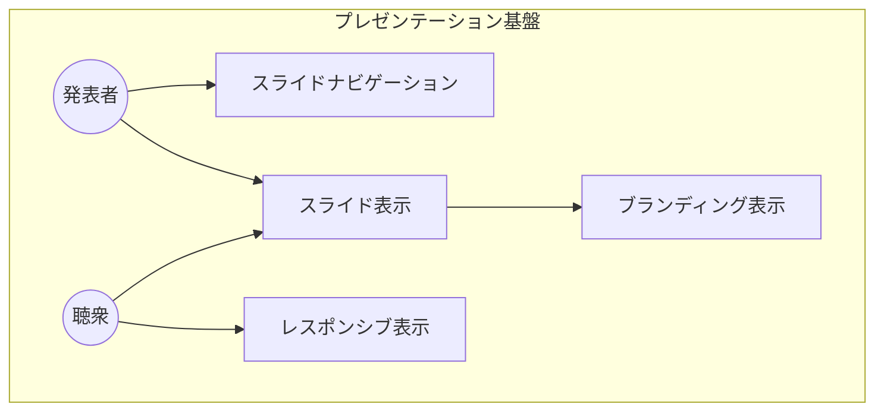
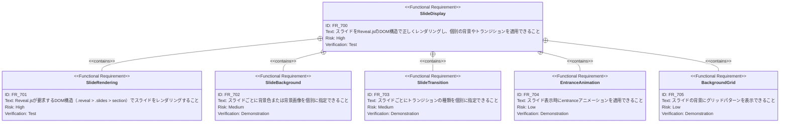
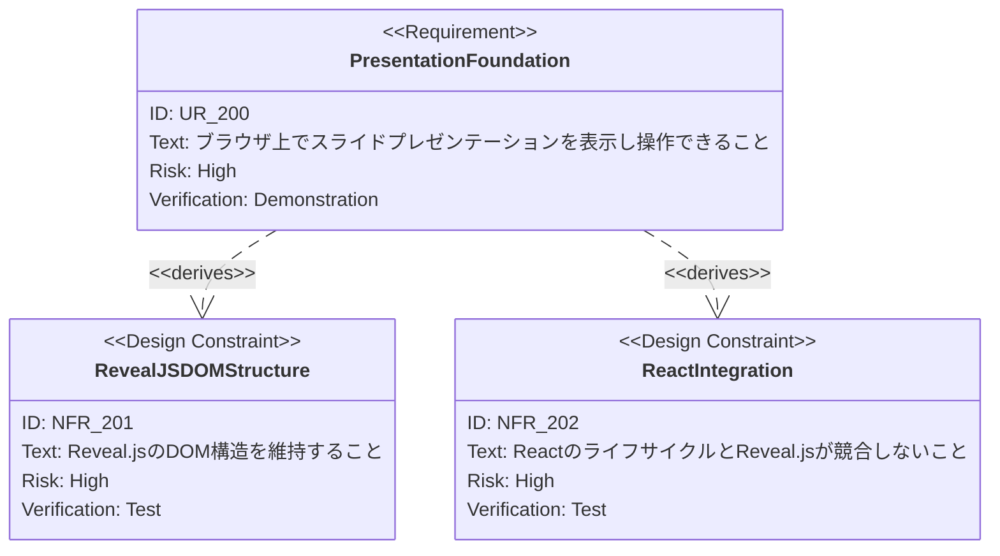

# Reveal.js プレゼンテーション基盤 要求仕様書

## 概要

このドキュメントは、ブラウザ上でスライドプレゼンテーションを表示・操作するための基盤機能の要求仕様を定義します。

React アプリケーション内で Reveal.js を統合し、スライドの表示・ナビゲーション・トランジション・レスポンシブスケーリング等のプレゼンテーション体験を提供することを目的とします。

### 背景

スライドプレゼンテーションをブラウザ上で動作させるには、スライドの順序制御、ナビゲーション（キーボード・タッチ・UI）、トランジションアニメーション、画面サイズへの適応といったプレゼンテーション固有の機能が必要です。これらを Reveal.js ライブラリとの統合により実現し、React のコンポーネントライフサイクルと調和させる必要があります。

### 目的

- ブラウザ上でスライドプレゼンテーションを表示・操作できるようにする
- キーボード・タッチ・UIコントロールによる直感的なナビゲーションを提供する
- 様々な画面サイズに対応するレスポンシブなスケーリングを実現する
- スライドごとの背景やトランジションのカスタマイズに対応する
- React コンポーネントとしての宣言的な統合を提供する

---

# 1. 要求図の読み方

## 1.1. 要求タイプ

- **requirement**: 一般的な要求
- **functionalRequirement**: 機能要求
- **performanceRequirement**: パフォーマンス要求
- **designConstraint**: 設計制約

## 1.2. リスクレベル

- **High**: 高リスク（ビジネスクリティカル、実装困難）
- **Medium**: 中リスク（重要だが代替可能）
- **Low**: 低リスク（Nice to have）

## 1.3. 検証方法

- **Test**: テストによる検証
- **Demonstration**: デモンストレーションによる検証
- **Inspection**: インスペクション（レビュー）による検証

## 1.4. 関係タイプ

- **contains**: 包含関係（親要求が子要求を含む）
- **derives**: 派生関係（要求から別の要求が導出される）

---

# 2. 要求一覧

## 2.1. ユースケース図（概要）

## 2.2. 機能一覧（テキスト形式）

- スライドナビゲーション
    - キーボード操作（矢印キー等）によるスライド移動
    - タッチ操作によるスライド移動
    - コントロールUI（矢印ボタン）の表示
    - スライド番号の表示（現在/合計）
    - URLハッシュルーティングによるスライド位置の永続化
    - プログレスバーによる全体進捗の表示
- スライド表示
    - Reveal.js によるスライドのレンダリング
    - スライドごとの背景色・背景画像指定
    - スライドごとのトランジション指定
    - スライド entrance アニメーション
    - 背景グリッドパターンの表示
- レスポンシブ表示
    - 基準解像度（1280x720）でのレンダリング
    - ウインドウサイズに応じた自動スケーリング
- ブランディング表示
    - ロゴの固定表示（左下）
    - `meta.logo` によるロゴ画像・サイズのカスタマイズ
    - ロゴ未指定時はロゴ非表示
- ライフサイクル管理
    - React コンポーネントのマウント/アンマウントに連動した初期化・破棄

---

# 3. 要求図（SysML Requirements Diagram）

## 3.1. 全体要求図

```mermaid
requirementDiagram
    requirement PresentationFoundation {
        id: UR_200
        text: "ブラウザ上でスライドプレゼンテーションを表示し、直感的に操作できること"
        risk: high
        verifymethod: demonstration
    }

    functionalRequirement SlideNavigation {
        id: FR_600
        text: "キーボード・タッチ・UIコントロールによりスライド間を移動でき、現在位置を把握できること"
        risk: high
        verifymethod: demonstration
    }

    functionalRequirement SlideDisplay {
        id: FR_700
        text: "スライドをReveal.jsのDOM構造で正しくレンダリングし、個別の背景やトランジションを適用できること"
        risk: high
        verifymethod: test
    }

    functionalRequirement ResponsiveScaling {
        id: FR_800
        text: "基準解像度を維持しつつ、ウインドウサイズに応じて自動的にスケーリングできること"
        risk: medium
        verifymethod: demonstration
    }

    functionalRequirement BrandingDisplay {
        id: FR_900
        text: "プレゼンテーション画面にロゴを固定位置で常時表示でき、表示するロゴをカスタマイズできること"
        risk: low
        verifymethod: demonstration
    }

    functionalRequirement LogoCustomization {
        id: FR_901
        text: "ロゴ画像のパス・幅・高さをmeta.logoフィールドで設定できること"
        risk: low
        verifymethod: test
    }

    functionalRequirement LogoFallback {
        id: FR_902
        text: "meta.logo未指定時にロゴを非表示とすること"
        risk: low
        verifymethod: test
    }

    BrandingDisplay - contains -> LogoCustomization
    BrandingDisplay - contains -> LogoFallback

    functionalRequirement LifecycleManagement {
        id: FR_1000
        text: "Reactコンポーネントのライフサイクルに連動してプレゼンテーションエンジンを初期化・破棄できること"
        risk: medium
        verifymethod: test
    }

    PresentationFoundation - contains -> SlideNavigation
    PresentationFoundation - contains -> SlideDisplay
    PresentationFoundation - contains -> ResponsiveScaling
    PresentationFoundation - contains -> BrandingDisplay
    PresentationFoundation - contains -> LifecycleManagement
```

## 3.2. スライドナビゲーション要求図

```mermaid
requirementDiagram
    functionalRequirement SlideNavigation {
        id: FR_600
        text: "キーボード・タッチ・UIコントロールによりスライド間を移動でき、現在位置を把握できること"
        risk: high
        verifymethod: demonstration
    }

    functionalRequirement KeyboardNavigation {
        id: FR_601
        text: "キーボードの矢印キー等でスライドを前後に移動できること"
        risk: high
        verifymethod: demonstration
    }

    functionalRequirement TouchNavigation {
        id: FR_602
        text: "タッチ操作（スワイプ等）でスライドを前後に移動できること"
        risk: medium
        verifymethod: demonstration
    }

    functionalRequirement ControlUI {
        id: FR_603
        text: "画面上にナビゲーション用の矢印ボタンを表示し、クリックでスライド移動できること"
        risk: medium
        verifymethod: demonstration
    }

    functionalRequirement SlideNumber {
        id: FR_604
        text: "現在のスライド番号と総スライド数を表示できること"
        risk: low
        verifymethod: demonstration
    }

    functionalRequirement HashRouting {
        id: FR_605
        text: "現在のスライド位置をURLハッシュに反映し、URLから特定のスライドに直接アクセスできること"
        risk: low
        verifymethod: test
    }

    functionalRequirement ProgressBar {
        id: FR_606
        text: "プレゼンテーション全体の進捗をプログレスバーで表示できること"
        risk: low
        verifymethod: demonstration
    }

    SlideNavigation - contains -> KeyboardNavigation
    SlideNavigation - contains -> TouchNavigation
    SlideNavigation - contains -> ControlUI
    SlideNavigation - contains -> SlideNumber
    SlideNavigation - contains -> HashRouting
    SlideNavigation - contains -> ProgressBar
```

## 3.3. スライド表示要求図

## 3.4. 非機能要求図

```mermaid
requirementDiagram
    performanceRequirement ScalingPerformance {
        id: NFR_200
        text: "スケーリング処理がリアルタイムに行われ、ウインドウリサイズ時に視覚的な遅延が発生しないこと"
        risk: medium
        verifymethod: demonstration
    }

    designConstraint RevealJSDOMStructure {
        id: NFR_201
        text: "Reveal.jsの要求するDOM構造（.reveal > .slides > section）を厳密に維持すること"
        risk: high
        verifymethod: test
    }

    designConstraint ReactIntegration {
        id: NFR_202
        text: "Reveal.jsのライフサイクル管理がReactのコンポーネントライフサイクルと競合しないこと"
        risk: high
        verifymethod: test
    }

    designConstraint BaseResolution {
        id: NFR_203
        text: "基準解像度を1280x720とし、スケーリング範囲を0.2〜2.0倍とすること"
        risk: medium
        verifymethod: test
    }
```

## 3.5. 要求間のトレーサビリティ

---

# 4. 要求の詳細説明

## 4.1. ユーザ要求

### UR_200: プレゼンテーション基盤

ブラウザ上でスライドプレゼンテーションを表示し、発表者がキーボードやUI操作で直感的にスライドを操作でき、聴衆がどの画面サイズでも適切に閲覧できること。

**優先度:** Must

**検証方法:** デモンストレーション — プレゼンテーションの表示・操作が正しく動作することを確認

## 4.2. 機能要求

### FR_600: スライドナビゲーション

キーボード・タッチ・UIコントロールによりスライド間を移動でき、スライド番号・プログレスバー・URLハッシュにより現在位置を把握・共有できるようにする。

**優先度:** Must

**検証方法:** デモンストレーション

| サブ要求   | 優先度    | 説明                       |
|:-------|:-------|:-------------------------|
| FR_601 | Must   | キーボード操作によるスライド移動         |
| FR_602 | Should | タッチ操作によるスライド移動           |
| FR_603 | Should | コントロールUI（矢印ボタン）の表示      |
| FR_604 | Could  | スライド番号の表示（現在/合計）         |
| FR_605 | Could  | URLハッシュルーティングによるスライド位置の永続化 |
| FR_606 | Could  | プログレスバーの表示               |

### FR_700: スライド表示

スライドを Reveal.js のDOM構造で正しくレンダリングし、スライドごとの背景やトランジション、アニメーション効果を適用する。

**優先度:** Must

**検証方法:** テスト

| サブ要求   | 優先度    | 説明                      |
|:-------|:-------|:------------------------|
| FR_701 | Must   | Reveal.js互換のDOM構造でのレンダリング |
| FR_702 | Should | スライドごとの背景色・背景画像の個別指定   |
| FR_703 | Should | スライドごとのトランジション指定       |
| FR_704 | Could  | スライド entrance アニメーション   |
| FR_705 | Could  | 背景グリッドパターンの表示          |

### FR_800: レスポンシブスケーリング

基準解像度（1280x720）を維持しつつ、表示ウインドウのサイズに応じて自動的にスケーリングし、あらゆる画面サイズで適切に表示する。

**優先度:** Must

**検証方法:** デモンストレーション

### FR_900: ブランディング表示

プレゼンテーション画面の固定位置（左下）にロゴを常時表示し、スライド操作やナビゲーションに影響を与えないようにする。

**優先度:** Could

**検証方法:** デモンストレーション

| サブ要求   | 優先度    | 説明                                                   |
|:-------|:-------|:-----------------------------------------------------|
| FR_901 | Could  | ロゴ画像のパス・幅・高さを `meta.logo` フィールドで設定できること            |
| FR_902 | Could  | `meta.logo` 未指定時にロゴを非表示とすること |

### FR_1000: ライフサイクル管理

React コンポーネントのマウント時に Reveal.js を初期化し、アンマウント時に破棄する。Reactの再レンダリングサイクルと Reveal.js の状態管理が競合しないようにする。

**優先度:** Must

**検証方法:** テスト

## 4.3. 非機能要求

### NFR_200: スケーリングパフォーマンス

ウインドウリサイズ時のスケーリング処理がリアルタイムに行われ、視覚的な遅延やちらつきが発生しないこと。

**優先度:** Should

**検証方法:** デモンストレーション

### NFR_201: Reveal.js DOM構造の維持

Reveal.js が要求する `.reveal > .slides > section` のDOM構造を厳密に維持し、Reveal.js のすべてのAPI・機能が正常に動作すること。

**優先度:** Must

**検証方法:** テスト

### NFR_202: React統合の安全性

Reveal.js のライフサイクル管理（初期化・破棄）が React のコンポーネントライフサイクルと競合せず、メモリリークやイベントリスナーの残留が発生しないこと。

**優先度:** Must

**検証方法:** テスト

### NFR_203: 基準解像度とスケーリング範囲

基準解像度を 1280x720 とし、スケーリング範囲は 0.2〜2.0 倍とする。マージンは 0 とする。

**優先度:** Must

**検証方法:** テスト

---

# 5. 制約事項

## 5.1. 技術的制約

- Reveal.js のDOM構造（`.reveal > .slides > section`）を維持すること（T-002）
- React + TypeScript の技術スタックを維持すること
- TypeScript strict モードに準拠すること（T-001）
- Reveal.js の初期化と破棄が React のライフサイクルと適切に連動すること

## 5.2. ビジネス的制約

- 1280x720 の解像度で正しく表示されること（B-001）
- プレゼンテーションの視覚的品質と伝達力を損なわないこと（B-001）

---

# 6. 前提条件

- Reveal.js ライブラリがプロジェクトに導入されていること
- ブラウザが JavaScript を有効にしていること
- スライドデータが Reveal.js 互換のDOM構造（`<section>` 要素）で提供されること

---

# 7. スコープ外

以下は本PRDのスコープ外とします：

- スライドコンテンツの定義・管理（→ slide-content-customization で管理）
- テーマ・デザインのカスタマイズ（→ slide-content-customization で管理）
- スピーカービュー（2画面表示）の提供
- PDF/画像エクスポート機能
- マルチプレイヤー同期（リモートコントロール）
- Reveal.js プラグインの管理機構

---

# 8. 用語集

| 用語               | 定義                                                                |
|:-----------------|:------------------------------------------------------------------|
| Reveal.js        | HTML ベースのプレゼンテーションフレームワーク                                         |
| スケーリング           | 基準解像度を維持しつつ、表示領域に合わせてスライド全体を拡大・縮小する処理                             |
| トランジション          | スライド間の切り替え時に適用される視覚効果（fade, slide 等）                              |
| ハッシュルーティング       | URLの `#` 以降の文字列を使って現在のスライド位置を永続化し、ブラウザの戻る/進む操作やURL共有に対応する仕組み     |
| entrance アニメーション | スライドが表示される際に要素が画面内にアニメーションしながら出現する効果                              |
| プログレスバー          | プレゼンテーション全体に対する現在の進行度合いを示す水平バー                                    |
| ライフサイクル管理        | React コンポーネントの生成（マウント）・破棄（アンマウント）に連動して外部ライブラリの初期化・クリーンアップを行う仕組み |
