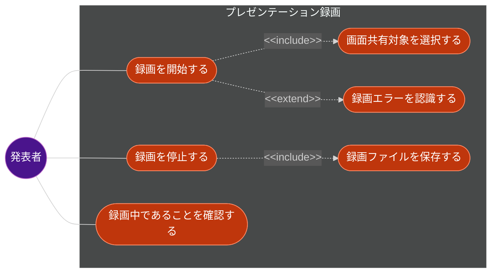
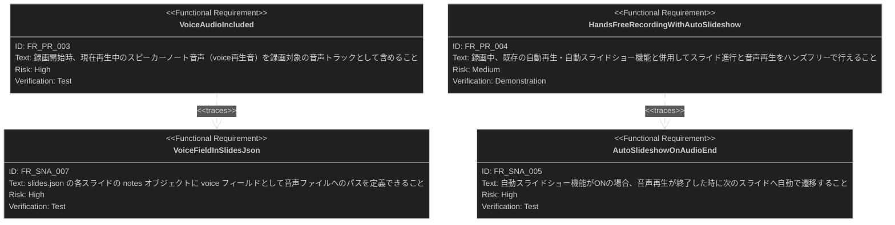

# プレゼンテーション録画（Presentation Recording）要求仕様書

## 概要

本ドキュメントは、プレゼンテーション発表中の画面表示とスピーカーノート音声（[speaker-note-audio.md](./speaker-note-audio.md) で定義された `voice` 再生音）をまとめて録画し、動画ファイルとして保存する機能の要求を定義する。これにより、ライブ発表に参加できなかった視聴者への共有や、研修・オンボーディング資料としての再利用など、プレゼンテーション資産をオンデマンドで活用できるようにする。ツールバーの既存「PDFで保存」ボタン（`PdfExportButton`）の横にレコーディング開始/停止ボタンを追加し、既存の自動再生・自動スライドショー機能と組み合わせることで、ハンズフリーのプレゼンテーション進行をそのまま動画として記録できるようにする。

対応 GitHub Issue: [#381](https://github.com/ToshikiImagawa/slide-presentation-app/issues/381)

---

# 1. 要求図の読み方

## 1.1. 要求タイプ

- **requirement**: 一般的な要求
- **functionalRequirement**: 機能要求
- **designConstraint**: 設計制約

## 1.2. リスクレベル

- **High**: 高リスク（ビジネスクリティカル、実装困難）
- **Medium**: 中リスク（重要だが代替可能）
- **Low**: 低リスク（Nice to have）

## 1.3. 検証方法

- **Test**: テストによる検証
- **Demonstration**: デモンストレーションによる検証
- **Inspection**: インスペクション（レビュー）による検証

## 1.4. 関係タイプ

- **contains**: 包含関係（親要求が子要求を含む）
- **derives**: 派生関係（要求から別の要求が導出される）
- **traces**: トレース関係（要求間の追跡可能性）

---

# 2. 要求一覧

## 2.1. ユースケース図（概要）

### アクター

| アクター | 説明 |
|:---|:---|
| 発表者（Presenter） | プレゼンテーションを操作し、ツールバーのレコーディングボタンで録画の開始・停止を行うユーザー |

### ユースケース

| ユースケース | 説明 |
|:---|:---|
| 録画を開始する | ツールバーのレコーディングボタンを押して録画を開始する |
| 画面共有対象を選択する | OS標準の画面/ウィンドウ共有選択ダイアログで録画対象を選択する（録画開始に内包） |
| 録画を停止する | レコーディングボタンを再度押して録画を終了する |
| 録画ファイルを保存する | 録画終了後、動画ファイルの保存先を選択して保存する（録画停止に内包） |
| 録画中であることを確認する | ツールバー上のインジケータ（ボタンの見た目変化）で録画中の状態を確認する |
| 録画エラーを認識する | 画面共有の中断や権限拒否等で録画が継続できない場合にエラー状態を認識する（録画開始の拡張） |

## 2.2. 機能一覧（テキスト形式）

- レコーディングボタン
    - ツールバー（「PDFで保存」ボタンの横）への開始/停止トグルボタンの表示
    - 録画中インジケータの表示
- 録画開始
    - 画面/ウィンドウキャプチャ対象の選択（OS標準ダイアログ）
    - スピーカーノート音声（voice再生音）を録画対象の音声トラックに含める
    - 既存の自動再生・自動スライドショー機能との併用
- 録画停止
    - 録画の終了
    - 動画ファイルの保存（保存先選択ダイアログ）
- 異常系
    - 画面共有選択のキャンセル時のフォールバック
    - 録画中の中断・エラー時のフォールバック

---

# 3. 要求図（SysML Requirements Diagram）

## 3.1. 全体要求図

```mermaid
%%{init: {'theme': 'dark'}}%%
requirementDiagram
    requirement PresentationRecording {
        id: UR_PR_001
        text: "発表者がプレゼンテーションの画面表示とスピーカーノート音声をまとめて録画し、動画ファイルとして保存できること"
        risk: high
        verifymethod: demonstration
    }

    functionalRequirement RecordingButtonInToolbar {
        id: FR_PR_001
        text: "ツールバーの「PDFで保存」ボタンの横に、録画の開始/停止を行うレコーディングボタンを表示すること"
        risk: low
        verifymethod: test
    }

    functionalRequirement CaptureSourceSelection {
        id: FR_PR_002
        text: "レコーディングボタン押下時、画面/ウィンドウキャプチャの選択を要求し、選択完了後に録画を開始すること"
        risk: high
        verifymethod: test
    }

    functionalRequirement VoiceAudioIncluded {
        id: FR_PR_003
        text: "録画開始時、現在再生中のスピーカーノート音声（voice再生音）を録画対象の音声トラックとして含めること"
        risk: high
        verifymethod: test
    }

    functionalRequirement HandsFreeRecordingWithAutoSlideshow {
        id: FR_PR_004
        text: "録画中、既存の自動再生・自動スライドショー機能と併用してスライド進行と音声再生をハンズフリーで行えること"
        risk: medium
        verifymethod: demonstration
    }

    functionalRequirement RecordingIndicator {
        id: FR_PR_005
        text: "録画中であることをツールバー上のボタンの見た目変化（録画中インジケータ）で示すこと"
        risk: low
        verifymethod: test
    }

    functionalRequirement StopRecording {
        id: FR_PR_006
        text: "レコーディングボタンを再度押すことで録画を停止すること"
        risk: low
        verifymethod: test
    }

    functionalRequirement SaveRecordedFile {
        id: FR_PR_007
        text: "録画停止時、記録された内容を動画ファイルとして保存先を選択して保存すること"
        risk: medium
        verifymethod: test
    }

    functionalRequirement CaptureSelectionCancelFallback {
        id: FR_PR_008
        text: "画面/ウィンドウ共有の選択がキャンセルされた場合、録画を開始せずボタンを操作前の状態に戻すこと"
        risk: medium
        verifymethod: test
    }

    functionalRequirement RecordingErrorFallback {
        id: FR_PR_009
        text: "録画中に共有対象が失われる、または録画処理でエラーが発生した場合、録画を安全に終了し、記録済み内容を保存可能な状態にすること"
        risk: high
        verifymethod: test
    }

    designConstraint PresentationContinuesOnFailure {
        id: DC_PR_001
        text: "共有キャンセル・録画エラー時もプレゼンテーション表示自体は中断せず継続すること（A-005準拠）"
        risk: medium
        verifymethod: inspection
    }

    designConstraint RecordingResourceLifecycle {
        id: DC_PR_002
        text: "録画に使用するメディアストリーム・レコーダーのリソースはuseEffectで管理し、アンマウント時・録画終了時に解放すること（T-003準拠）"
        risk: low
        verifymethod: inspection
    }

    designConstraint RecordingUiAsAppChrome {
        id: DC_PR_003
        text: "レコーディングボタン・録画中インジケータはスライドコンテンツではなくアプリのクロムUIであり、App.tsxで直接構成しComponentRegistry管理（A-004）の対象外とすること"
        risk: low
        verifymethod: inspection
    }

    PresentationRecording - contains -> RecordingButtonInToolbar
    PresentationRecording - contains -> CaptureSourceSelection
    PresentationRecording - contains -> VoiceAudioIncluded
    PresentationRecording - contains -> HandsFreeRecordingWithAutoSlideshow
    PresentationRecording - contains -> RecordingIndicator
    PresentationRecording - contains -> StopRecording
    PresentationRecording - contains -> SaveRecordedFile
    PresentationRecording - contains -> CaptureSelectionCancelFallback
    PresentationRecording - contains -> RecordingErrorFallback
    PresentationRecording - contains -> PresentationContinuesOnFailure
    PresentationRecording - contains -> RecordingResourceLifecycle
    PresentationRecording - contains -> RecordingUiAsAppChrome

    VoiceAudioIncluded - derives -> CaptureSourceSelection
    StopRecording - derives -> CaptureSourceSelection
    SaveRecordedFile - derives -> StopRecording
    CaptureSelectionCancelFallback - derives -> CaptureSourceSelection
    RecordingErrorFallback - derives -> CaptureSourceSelection
```

## 3.2. 関連PRDとのトレース

---

# 4. 要求の詳細説明

## 4.1. 要求サマリ

| カテゴリ | 件数 |
|:---|:---|
| UR（ユーザー要求） | 1 |
| FR（機能要求） | 9 |
| NFR（非機能要求） | 3 |
| **合計** | **13** |

DC（設計制約）は3件（DC-PR-001〜003）あるが、MoSCoW優先度分類の対象外のため上表には含めない。

| 優先度 | 件数 |
|:---|:---|
| Must | 10 |
| Should | 3 |
| Could | 0 |

## 4.2. ユーザー要求

| ID | 要求 | 優先度 | リスク |
|:---|:---|:---|:---|
| UR-PR-001 | 発表者がプレゼンテーションの画面表示とスピーカーノート音声をまとめて録画し、動画ファイルとして保存できること | Must | High |

## 4.3. 機能要求

| ID | 要求 | 派生元 | 優先度 | リスク | 検証方法 |
|:---|:---|:---|:---|:---|:---|
| FR-PR-001 | ツールバーの「PDFで保存」ボタンの横に、録画の開始/停止を行うレコーディングボタンを表示すること | UR-PR-001 | Must | Low | Test |
| FR-PR-002 | レコーディングボタン押下時、画面/ウィンドウキャプチャの選択を要求し、選択完了後に録画を開始すること | UR-PR-001 | Must | High | Test |
| FR-PR-003 | 録画開始時、現在再生中のスピーカーノート音声（voice再生音）を録画対象の音声トラックとして含めること | UR-PR-001 | Must | High | Test |
| FR-PR-004 | 録画中、既存の自動再生・自動スライドショー機能と併用してスライド進行と音声再生をハンズフリーで行えること | UR-PR-001 | Should | Medium | Demonstration |
| FR-PR-005 | 録画中であることをツールバー上のボタンの見た目変化（録画中インジケータ）で示すこと | UR-PR-001 | Must | Low | Test |
| FR-PR-006 | レコーディングボタンを再度押すことで録画を停止すること | UR-PR-001 | Must | Low | Test |
| FR-PR-007 | 録画停止時、記録された内容を動画ファイルとして保存先を選択して保存すること | UR-PR-001 | Must | Medium | Test |
| FR-PR-008 | 画面/ウィンドウ共有の選択がキャンセルされた場合、録画を開始せずボタンを操作前の状態に戻すこと | UR-PR-001 | Must | Medium | Test |
| FR-PR-009 | 録画中に共有対象が失われる、または録画処理でエラーが発生した場合、録画を安全に終了し、記録済み内容を保存可能な状態にすること | UR-PR-001 | Must | High | Test |

### FR-PR-001: レコーディングボタンの表示

ツールバー（`toolbar` クラス配下、`PdfExportButton` の隣）にレコーディングボタンを表示する。ボタンは開始/停止の単一トグルとして機能する。

**優先度:** Must

**検証方法:** テストによる検証

### FR-PR-002: 画面/ウィンドウキャプチャ対象の選択

レコーディングボタン押下時、OS標準の画面/ウィンドウ共有選択ダイアログが表示される。発表者が対象を選択すると録画が開始される。

**優先度:** Must

**検証方法:** テストによる検証

### FR-PR-003: スピーカーノート音声の録画への含有

録画対象には、再生中のスピーカーノート音声（[speaker-note-audio.md](./speaker-note-audio.md) の `voice` 再生音）を音声トラックとして含める。画面のみが録画され音声が欠落する状態にはしない。

**優先度:** Must

**検証方法:** テストによる検証

### FR-PR-004: 自動再生・自動スライドショーとの併用

録画中に自動再生（`autoPlay`）・自動スライドショー（`autoSlideshow`）をONにすることで、発表者が操作せずにスライド進行と音声再生が続き、その様子がそのまま録画される。

**優先度:** Should

**検証方法:** デモンストレーションによる検証

### FR-PR-005: 録画中インジケータ

録画中は、レコーディングボタンの見た目（色・アイコン等）が変化し、発表者が録画中であることを一目で確認できる。

**優先度:** Must

**検証方法:** テストによる検証

### FR-PR-006: 録画の停止

録画中にレコーディングボタンを再度押すと録画が停止する。

**優先度:** Must

**検証方法:** テストによる検証

### FR-PR-007: 録画ファイルの保存

録画停止後、記録された動画データを保存先ダイアログを通じてファイルとして保存できる。

**優先度:** Must

**検証方法:** テストによる検証

### FR-PR-008: 共有選択キャンセル時のフォールバック

画面/ウィンドウ共有選択ダイアログでキャンセルが選択された場合、録画は開始されず、レコーディングボタンは操作前の状態（idle）に戻る。エラー表示は行わない。

**優先度:** Must

**検証方法:** テストによる検証

### FR-PR-009: 録画中断・エラー時のフォールバック

録画中に共有対象のウィンドウが閉じられる等でキャプチャが中断された場合、または録画処理中にエラーが発生した場合、録画処理を安全に終了する。中断までに記録された内容は破棄せず、保存可能な状態にする。

**優先度:** Must

**検証方法:** テストによる検証

## 4.4. 非機能要求

| ID | 要求 | 派生元 | カテゴリ | 優先度 | リスク | 検証方法 |
|:---|:---|:---|:---|:---|:---|:---|
| NFR-PR-001 | macOSでは画面録画に対するOSのプライバシー許可が必要になるため、録画開始前にその旨を発表者が理解できる形で示すこと | UR-PR-001 | Usability | Should | Medium | Demonstration |
| NFR-PR-002 | 録画機能は本アプリが動作するデスクトップ環境（Tauri WebView）上で、選択した実現方式（画面/ウィンドウキャプチャ + メディア録画API）が利用可能な環境で動作すること | UR-PR-001 | Compatibility | Must | Medium | Test |
| NFR-PR-003 | 録画中もスライド遷移・音声再生が視覚的・聴覚的に滑らかであり、録画がプレゼンテーション本体の表示に認識可能な遅延やフレーム落ちを生じさせないこと。具体的な数値基準（フレームレート等の閾値）は `presentation-recording_design.md` で定義する | UR-PR-001 | Performance | Should | Medium | Demonstration |

## 4.5. 設計制約

### DC-PR-001: 失敗時もプレゼンテーション表示を継続

共有選択のキャンセルや録画中のエラーが発生しても、プレゼンテーション本体の表示・操作は中断させない（CONSTITUTION.md A-005 準拠）。

### DC-PR-002: 録画リソースのライフサイクル管理

録画に使用するメディアストリーム・レコーダー等のリソースは `useEffect` で管理し、コンポーネントのアンマウント時や録画終了時に確実に解放する（CONSTITUTION.md T-003 準拠）。

### DC-PR-003: 録画UIはアプリのクロムUI

レコーディングボタン・録画中インジケータは、スライドコンテンツではなくアプリのクロムUIである。既存の `PdfExportButton` / `AudioPlayButton` と同様に `App.tsx` で直接構成し、`ComponentRegistry`（CONSTITUTION.md A-004）による管理の対象外とする。

---

# 5. 制約事項

## 5.1. 技術的制約

- TypeScript strict モードで型安全性を確保すること（T-001 準拠）
- Reveal.js の DOM 構造との互換性を維持すること（T-002 準拠）
- 録画対象・録画方式（画面/ウィンドウキャプチャ、音声トラックの合成方式等）の具体的な技術選定・実装詳細は `presentation-recording_spec.md` / `presentation-recording_design.md` で定義する
- 長時間録画時のメモリ・ディスク使用量に関する制約は本PRDでは扱わず、実現方式選定時に `presentation-recording_design.md` で評価する
- 録画中インジケータおよびレコーディングボタンのスタイリングは3層モデルに従い、テーマカラーは CSS変数（`--theme-*`）経由で参照すること（A-002 準拠）

## 5.2. ビジネス的制約

- 録画機能の追加によって、既存のプレゼンテーション表示品質・操作性を損なわないこと（B-001 準拠）
- 録画UIはスライドの内容表示を妨げない位置・サイズで配置すること

---

# 6. 前提条件

- メインウィンドウでプレゼンテーションが正常に動作していること
- [speaker-note-audio.md](./speaker-note-audio.md) で定義されたスピーカーノート音声再生機能（`voice` フィールド・自動再生・自動スライドショー）が実装済みであること
- 発表者が使用する OS・ブラウザ環境（Tauri WebView）が、選択された画面キャプチャ・メディア録画方式に対応していること
- macOS で画面録画を行う場合、OS の画面録画権限がアプリに許可されていること
- Tauri のファイル保存ダイアログ機能が利用可能であること

---

# 7. スコープ外

以下は本PRDのスコープ外とします：

- 録画した動画の編集機能（トリミング・字幕付与・エンコード形式変換等）
- 録画データのクラウドアップロード・外部共有機能
- 発表者ビュー（別ウィンドウ）専用の録画操作UI
- マイク入力（発表者の肉声）やアプリ外のシステム音声の録音（録画対象の音声は `voice` 再生音のみ）
- 録画中の一時停止・再開操作（開始・停止のみをサポートする）
- 録画時間の上限管理・自動停止機能
- 選択した実現方式が対応しないOS・環境での動作保証

---

# 8. 用語集

| 用語 | 定義 |
|:---|:---|
| レコーディングボタン | ツールバー上で録画の開始・停止を切り替えるボタン |
| 画面共有選択ダイアログ | 録画対象の画面/ウィンドウを選択するOS標準のダイアログ |
| 録画中インジケータ | レコーディングボタンの見た目変化等で録画中であることを示すUI表現 |
| voice再生音 | [speaker-note-audio.md](./speaker-note-audio.md) で定義されたスピーカーノート音声（`notes.voice`）の再生音 |

---

# 9. 原則との関連

| 制約ID | 関連する原則 | 説明 |
|:---|:---|:---|
| DC-PR-001 | A-005 | 共有キャンセル・録画エラー時もプレゼンテーション表示自体は継続させるフォールバック |
| DC-PR-002 | T-003 | 録画リソース（メディアストリーム・レコーダー）のライフサイクルをuseEffectで管理し確実に解放する |
| DC-PR-003 | A-004 | 録画UIはアプリのクロムUIとしてApp.tsxで直接構成し、ComponentRegistry管理の対象外とする |
