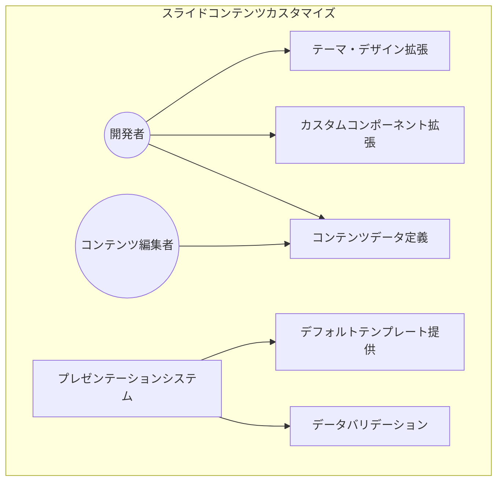
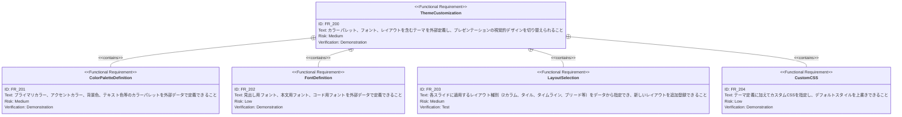
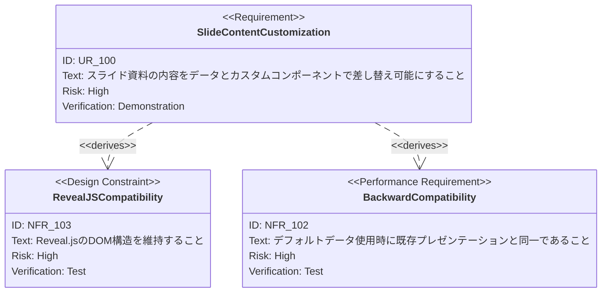

# スライドコンテンツカスタマイズ 要求仕様書

## 概要

このドキュメントは、プレゼンテーションのスライドコンテンツをJSON等の構造化データとカスタムデザインコンポーネントにより差し替え可能にする機能の要求仕様を定義します。

既存の10枚のスライドをデモ用テンプレートと位置づけ、外部データファイルとプラグイン型コンポーネントの仕組みにより、コードを直接変更せずにプレゼンテーション内容を柔軟に変更できるようにすることを目的とします。

### 背景

現在のプレゼンテーションでは、スライドの内容（テキスト、構成、レイアウト）がReactコンポーネント内にハードコードされています。スライド内容を変更するにはソースコードを直接編集する必要があり、開発者以外が資料を更新することが困難です。また、同じプレゼンテーション構造を異なるテーマや内容で再利用する仕組みが存在しません。

### 目的

- プレゼンテーション内容をソースコードから分離し、データ駆動で管理できるようにする
- 開発者がカスタムコンポーネントやレイアウトを拡張できる仕組みを提供する
- 非技術者がJSONファイルを編集するだけでスライド内容を差し替えられるようにする
- 既存のデモ用スライドをデフォルトテンプレートとして保持する

---

# 1. 要求図の読み方

## 1.1. 要求タイプ

- **requirement**: 一般的な要求
- **functionalRequirement**: 機能要求
- **performanceRequirement**: パフォーマンス要求
- **interfaceRequirement**: インターフェース要求
- **designConstraint**: 設計制約

## 1.2. リスクレベル

- **High**: 高リスク（ビジネスクリティカル、実装困難）
- **Medium**: 中リスク（重要だが代替可能）
- **Low**: 低リスク（Nice to have）

## 1.3. 検証方法

- **Analysis**: 分析による検証
- **Test**: テストによる検証
- **Demonstration**: デモンストレーションによる検証
- **Inspection**: インスペクション（レビュー）による検証

## 1.4. 関係タイプ

- **contains**: 包含関係（親要求が子要求を含む）
- **derives**: 派生関係（要求から別の要求が導出される）
- **satisfies**: 満足関係（要素が要求を満たす）
- **verifies**: 検証関係（テストケースが要求を検証する）
- **refines**: 詳細化関係（要求をより詳細に定義する）
- **traces**: トレース関係（要求間の追跡可能性）

---

# 2. 要求一覧

## 2.1. ユースケース図（概要）

## 2.2. 機能一覧（テキスト形式）

- データ駆動型コンテンツ管理
    - JSONフォーマットによるスライドコンテンツ定義
    - スライド構成（枚数・順序・レイアウト種別）の定義
    - テキストコンテンツ（タイトル、本文、リスト項目）の定義
    - メタ情報（アニメーション設定、フラグメント表示、スピーカーノート）の定義
- テーマ・デザインカスタマイズ
    - カラーパレット・フォントの外部定義
    - レイアウト種別（2カラム、タイル、タイムライン等）の選択と追加
    - カスタムCSSの適用
- コンポーネント拡張
    - カスタムReactコンポーネントのプラグイン的登録
    - スライドデータからカスタムコンポーネントの参照
    - デフォルトコンポーネントの上書き
- デフォルトテンプレート
    - 既存の10枚スライドをデフォルトデータとして提供
    - データファイルが未指定時にデフォルトで表示
- データバリデーション
    - JSONスキーマによるデータ構造の検証
    - 不正なデータ入力時のエラーメッセージ表示

---

# 3. 要求図（SysML Requirements Diagram）

## 3.1. 全体要求図

## 3.2. データ駆動型コンテンツ要求図

## 3.3. テーマ・デザインカスタマイズ要求図

## 3.4. コンポーネント拡張要求図

## 3.5. デフォルトテンプレートおよびバリデーション要求図

## 3.6. 非機能要求図

## 3.7. 要求間のトレーサビリティ

---

# 4. 要求の詳細説明

## 4.1. ユーザ要求

### UR_100: スライドコンテンツカスタマイズ

スライド資料の内容を、構造化データファイル（JSON）とカスタムデザインコンポーネントを指定することで、ソースコードを直接変更せずに差し替えられること。既存のデモ用スライドはデフォルトテンプレートとして保持し、データファイルの編集のみで資料内容を変更できる仕組みを提供する。

開発者がカスタムコンポーネントやテーマの初期設定を行い、非技術者（プレゼンテーション作成者）がJSONファイルの編集で内容を差し替える運用を想定する。

**優先度:** Must

**検証方法:** デモンストレーション — デフォルトデータとカスタムデータの両方でプレゼンテーションが正しく表示されることを確認

## 4.2. 機能要求

### FR_100: データ駆動型コンテンツ管理

JSONフォーマットの構造化データにより、スライドのテキスト、構成（枚数・順序・レイアウト種別）、メタ情報（アニメーション、フラグメント、スピーカーノート）を定義し、プレゼンテーションに反映する。

**優先度:** Must

**検証方法:** テスト

| サブ要求   | 優先度    | 説明                                   |
|:-------|:-------|:-------------------------------------|
| FR_101 | Must   | スライド構成（枚数・順序・レイアウト種別）のJSON定義         |
| FR_102 | Must   | テキストコンテンツ（タイトル、本文、リスト等）のJSON定義       |
| FR_103 | Should | メタ情報（アニメーション、フラグメント、スピーカーノート）のJSON定義 |
| FR_104 | Must   | JSONデータファイルの読み込みと動的レンダリング            |

### FR_200: テーマ・デザインカスタマイズ

カラーパレット、フォント、レイアウト種別を含むテーマを外部定義し、プレゼンテーション全体の視覚的デザインを切り替えられるようにする。

**優先度:** Should

**検証方法:** デモンストレーション

| サブ要求   | 優先度    | 説明              |
|:-------|:-------|:----------------|
| FR_201 | Should | カラーパレットの外部定義    |
| FR_202 | Could  | フォントの外部定義       |
| FR_203 | Should | レイアウト種別の選択と追加登録 |
| FR_204 | Could  | カスタムCSSの適用      |

### FR_300: コンポーネント拡張

開発者がカスタムReactコンポーネントをプラグイン的に登録し、スライドデータの中で名前で参照して使用できるようにする。デフォルトコンポーネントの上書きも可能とする。

**優先度:** Should

**検証方法:** テスト

| サブ要求   | 優先度    | 説明                          |
|:-------|:-------|:----------------------------|
| FR_301 | Should | カスタムコンポーネントの名前付き登録          |
| FR_302 | Could  | デフォルトコンポーネントの上書き            |
| FR_303 | Should | スライドデータからコンポーネントへのprops受け渡し |

### FR_400: デフォルトテンプレート

既存の10枚のデモ用スライドをデフォルトテンプレートとして提供する。外部データファイルが未指定または読み込み失敗時には、デフォルトテンプレートにフォールバックして表示する。

**優先度:** Must

**検証方法:** テスト

| サブ要求   | 優先度  | 説明                             |
|:-------|:-----|:-------------------------------|
| FR_401 | Must | 現在のスライド内容をJSON形式のデフォルトデータとして提供 |
| FR_402 | Must | データ未指定・読み込み失敗時のフォールバック表示       |

### FR_500: データバリデーション

スライドデータの構造を検証し、不正なデータが入力された場合に分かりやすいエラーメッセージを表示する。

**優先度:** Should

**検証方法:** テスト

| サブ要求   | 優先度    | 説明                      |
|:-------|:-------|:------------------------|
| FR_501 | Should | JSONスキーマに基づくデータ構造検証     |
| FR_502 | Should | エラー箇所と修正方法を含むエラーメッセージ表示 |

## 4.3. 非機能要求

### NFR_100: ビルドパフォーマンス

JSONデータからのスライド生成が開発サーバー起動時に完了し、ViteのHMRによるデータ変更が即座にプレゼンテーションに反映されること。

**優先度:** Should

**検証方法:** テスト

### NFR_101: データフォーマットの文書化

スライドデータフォーマットがJSONスキーマで文書化され、VSCode等のエディタで入力補完（IntelliSense）が利用可能であること。

**優先度:** Should

**検証方法:** インスペクション

### NFR_102: 後方互換性

デフォルトデータを使用した場合のプレゼンテーションが、カスタマイズ機能導入前の既存プレゼンテーションと見た目・動作が完全に同一であること。

**優先度:** Must

**検証方法:** テスト — 既存のスライド表示と比較

### NFR_103: Reveal.js互換性

データ駆動で生成されたスライドが、Reveal.jsのDOM構造（`.reveal > .slides > section`）およびAPIとの互換性を維持すること。

**優先度:** Must

**検証方法:** テスト

### NFR_104: 型安全性

スライドデータの型定義がTypeScriptの型システムで表現され、JSONデータとコンポーネント間のインターフェースが型安全であること。

**優先度:** Must

**検証方法:** テスト（ビルド時型チェック）

---

# 5. 制約事項

## 5.1. 技術的制約

- React + TypeScript + Viteの技術スタックを維持すること
- Reveal.jsのプレゼンテーション機能との互換性を維持すること
- CSS Modules（スライド固有スタイル）とグローバルCSS（共通スタイル）の使い分けを維持すること
- TypeScript strictモードに準拠すること

## 5.2. ビジネス的制約

- 既存のデモ用プレゼンテーションの見た目・動作を一切変更しないこと（デフォルトデータとして保持）
- AI-SDDワークフローの価値提案を正確に伝えるデフォルトコンテンツを維持すること
- 非技術者がJSONファイルの編集のみでコンテンツ差し替えが可能であること

---

# 6. 前提条件

- Node.js環境が利用可能であること
- JSONファイルの基本的な編集が可能なテキストエディタが利用可能であること
- カスタムコンポーネント拡張（FR_300）を使用する場合は、React/TypeScriptの開発環境が必要
- ViteのJSON importおよびHMR機能が使用可能であること

---

# 7. スコープ外

以下は本PRDのスコープ外とします：

- GUIベースのスライドエディタ（WYSIWYGエディタ）の提供
- スライドデータのサーバーサイド管理・データベース保存
- 複数ユーザーによるリアルタイム共同編集
- スライドデータのバージョン管理機能（Gitで管理することを前提）
- JSON以外のデータフォーマット（YAML、TOML等）への対応
- プレゼンテーションのエクスポート（PDF、画像等）

---

# 8. 用語集

| 用語          | 定義                                                    |
|:------------|:------------------------------------------------------|
| スライドデータ     | プレゼンテーションの内容を定義するJSON形式の構造化データ                        |
| レイアウト種別     | スライドの表示形式（2カラム、タイル、タイムライン、ブリード画像等）                    |
| テーマ         | カラーパレット、フォント、レイアウトのデフォルト設定を含む視覚的定義                    |
| カスタムコンポーネント | 開発者が作成し、スライドデータから参照可能なReactコンポーネント                    |
| フォールバック     | 外部データが利用不可時にデフォルトデータに切り替わる動作                          |
| デフォルトテンプレート | 現在の10枚のデモ用スライドを再現するデフォルトのスライドデータ                      |
| フラグメント      | スライド内のコンテンツ要素を段階的に表示するReveal.jsの機能                    |
| HMR         | Hot Module Replacement。開発時にファイル変更を即座にブラウザに反映するViteの機能 |
| JSONスキーマ    | JSONデータの構造、型、必須フィールドを定義する仕様                           |
