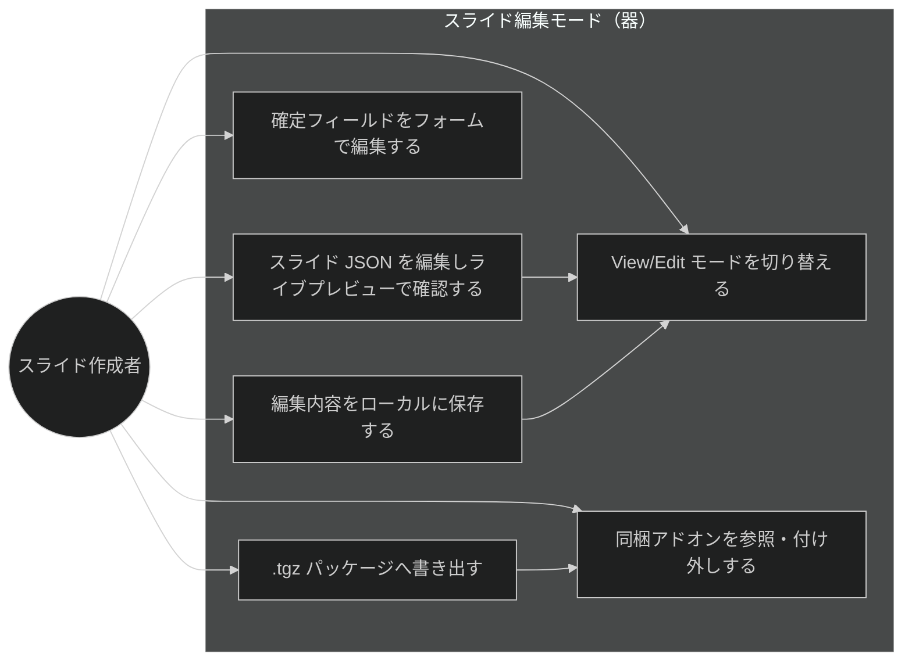

# スライド編集モード（器の作成） 要求仕様書

## 概要

既存のスライドビューワーに **「編集モード」を同梱**し、スライドの作成・調整・書き出しを**アプリ内で完結**できる基盤（＝器）を提供する。現状、スライド資料の作成は「`slides.json` を手書き」→「`npm run export:slides` で `.tgz` にパッケージ化」という CLI ベースのフローに依存しており、ビューワーは Tauri デスクトップアプリ化済みだが**作成（オーサリング）は依然として npm コマンド頼み**である。

本 PRD は、この作成フローをアプリに取り込む。具体的には (1) View / Edit のモード切替、(2) `slides.json`（`PresentationData` / `SlideData` / `SlideContent`）のアプリ内編集とライブプレビュー、(3) 同梱アドオンの参照・付け外し、(4) `.tgz` パッケージの書き出し、(5) 編集モードでのみ書き込みを有効化する capability 分離、を定義する。

本 PRD は [Epic #12](https://github.com/ToshikiImagawa/slide-presentation-app/issues/12)「スライド作成機能のアプリ化」配下の第1 Feature（[Issue #13](https://github.com/ToshikiImagawa/slide-presentation-app/issues/13)）である。**スライド生成機能（Claude）は本 Feature に含めず**、後続 Feature（[Issue #14](https://github.com/ToshikiImagawa/slide-presentation-app/issues/14)）で追加する。本 Feature はあくまで「あとから生成機能を差し込める器」を作ることを目的とする。

レンダラ一式（`SlideRenderer` / `ComponentRegistry` / `applyTheme` / レイアウト / Reveal.js）は既存 Feature（[presentation-foundation.md](./presentation-foundation.md)・[slide-content-customization.md](./slide-content-customization.md)）が定義済みであり、本 Feature はこれらを**再実装せず再利用**して「編集プレビュー＝本番ビュー」を保証する。同梱アドオンの参照・付け外しは [package-embedded-addon.md](./package-embedded-addon.md) が定義した実行時信頼制御（`addonTrust`）とパッケージ同梱を上流に持ち、それを編集操作として拡張する。

### 背景・目的

#### 現状の課題

- スライド作成は `slides.json` の手書きと `npm run export:slides`（Node スクリプト）に依存し、アプリ単体では完結しない。npm/Node のある開発環境が前提になる。
- ビューワーは表示専用で、開いたスライドを**その場で編集して確認する導線がない**。
- 同梱アドオンの選択・信頼制御は設定画面での一律無効化・失効に限られ、**作成者がスライド単位で参照アドオンを組み立てる**手段がない。

#### ビジネス価値

- **オーサリングの内製化**: 作成者がアプリ内で「編集 → ライブプレビュー → 書き出し」を完結でき、CLI 環境への依存を減らす。
- **編集プレビューの正確性**: 本番ビューと同一のレンダラで編集結果を確認できるため、「見た目が本番と違う」問題が原理的に起きない。
- **段階的な生成機能の受け皿**: 器を先に用意することで、後続の Claude 生成機能（#14）を「編集モードの一入力手段」として無理なく差し込める。

#### 方針（確定事項）

- **別アプリ化はしない。** 既存ビューワーと同一コードベースに「編集モード」として同梱する。
- **段階的に着手する。** まず器を作り、スライド生成は当面外部（Claude Code 等）に委ねる。アプリ内蔵の生成は後続 #14 で追加する。
- **編集は「AI 生成メイン＋手動微調整」を想定**し、フル WYSIWYG（ドラッグ配置）エディタは本 Feature では作らない。

---

# 1. 要求図の読み方

## 1.1. 要求タイプ

- **requirement**: 一般的な要求
- **functionalRequirement**: 機能要求
- **performanceRequirement**: パフォーマンス要求
- **designConstraint**: 設計制約

## 1.2. リスクレベル

- **High**: 高リスク（ビジネスクリティカル、実装困難）
- **Medium**: 中リスク（重要だが代替可能）
- **Low**: 低リスク（Nice to have）

## 1.3. 検証方法

- **Analysis**: 分析による検証
- **Test**: テストによる検証
- **Demonstration**: デモンストレーションによる検証
- **Inspection**: インスペクション（レビュー）による検証

## 1.4. 関係タイプ

- **contains**: 包含関係（親要求が子要求を含む）
- **derives**: 派生関係（要求から別の要求が導出される）
- **traces**: トレース関係（要求間の追跡可能性）

---

# 2. 要求一覧

## 2.1. ユースケース図（概要）

**アクター**

| アクター     | 説明                                                        |
|:---------|:----------------------------------------------------------|
| スライド作成者 | アプリ内でスライドを編集・調整し、パッケージとして書き出す作成者・発表者                     |

**ユースケース**

| ユースケース                       | 説明                                                                |
|:-----------------------------|:------------------------------------------------------------------|
| View/Edit モード切替             | 表示専用の View と、編集導線を出す Edit を切り替える。編集導線は Edit 時のみ表示する               |
| スライド JSON 編集＋ライブプレビュー      | `slides.json` を編集し、本番と同一レンダラのプレビューへ即時反映する                          |
| 確定フィールドをフォームで編集           | 型が確定したメタ・テーマ・レイアウト・id をフォームで編集する（自由記述は生テキストのまま保持）                 |
| 編集内容をローカルに保存               | 編集した `slides.json` をローカルに保存する（保存前にバリデーション）                        |
| `.tgz` パッケージへ書き出し           | アセット収集 → パッケージ生成を行い `.tgz` を出力する（既存の「開く」で読み込める）                    |
| 同梱アドオンを参照・付け外し             | スライドで使うアドオンを実行時信頼・export 同梱・組み込みの各層で参照・付け外しする                      |

## 2.2. 機能一覧（テキスト形式）

- モード切替（#13）
    - View / Edit のモード状態管理と切替 UI
    - 編集導線（エディタ・保存・書き出し）は Edit 時のみ表示し、発表本番での誤操作を防ぐ
- スライド JSON 編集＋ライブプレビュー（#13）
    - JSON テキストエディタを土台とし、構文検証しながら編集する
    - 本番と同一の `SlideRenderer` によるライブプレビュー（Reveal 全再初期化を伴わない差分反映）
    - 型が確定したフィールド（meta / theme / layout / id）の段階的フォーム編集
- ラウンドトリップ保持（#13）
    - GUI で表現しきれない自由記述（`SlideContent` の未定義キー、文字列内 HTML、意味を持つ空白、`customCSS`、任意 `component` props、`fragment` 制御）を破壊せず往復させる
    - 保存前バリデーションと、破損時に既存の全体フォールバックへ流さない安全な保存
- 書き出し・保存（#13）
    - `slides.json` のローカル保存
    - `.tgz` パッケージの書き出し（アセット収集 → パッケージ生成）
- Addon 参照・付け外し（#13）
    - 層C: 実行時信頼（`addonTrust`）の個別 on/off
    - 層B: `.tgz` export 時の同梱アドオンの個別選択
    - 層A: 組み込みアドオン（`addons/src/{name}/entry.ts`）の増減（dev 環境限定・要再ビルド）
- capability 分離（#13）
    - 編集モードでのみ fs 書き込みを有効化する
    - fs 書き込みは Rust コマンド境界に集約し、編集モード状態でゲートする

---

# 3. 要求図（SysML Requirements Diagram）

## 3.1. 全体要求図

```mermaid
requirementDiagram
    requirement EditModeFoundation {
        id: UR_001
        text: "既存ビューワーに編集モードを同梱し、スライドの作成・調整・書き出しをアプリ内で完結できる基盤を提供すること"
        risk: high
        verifymethod: demonstration
    }

    requirement SafeEditing {
        id: UR_002
        text: "編集機能は編集モード時のみ有効化し、発表本番のビュー体験と安全性を損なわないこと"
        risk: high
        verifymethod: demonstration
    }

    functionalRequirement ModeSwitch {
        id: FR_001
        text: "View と Edit のモードを切り替え、編集導線を Edit 時のみ表示すること"
        risk: medium
        verifymethod: demonstration
    }

    functionalRequirement JsonEditLivePreview {
        id: FR_002
        text: "slides.json を編集し本番と同一レンダラのライブプレビューへ即時反映すること"
        risk: high
        verifymethod: demonstration
    }

    functionalRequirement StructuredForm {
        id: FR_003
        text: "型が確定したフィールド meta theme layout id をフォームで編集できること"
        risk: medium
        verifymethod: test
    }

    functionalRequirement RoundTripPreservation {
        id: FR_004
        text: "GUI で表現しない自由記述 未定義キー HTML 空白 customCSS props fragment を破壊せず往復させること"
        risk: high
        verifymethod: test
    }

    functionalRequirement SafeSave {
        id: FR_005
        text: "保存前にバリデーションし破損時は全体フォールバックへ流さず保存を止めること"
        risk: high
        verifymethod: test
    }

    functionalRequirement SaveSlidesJson {
        id: FR_006
        text: "編集した slides.json を Rust コマンド境界でローカルに保存すること"
        risk: medium
        verifymethod: test
    }

    functionalRequirement ExportPackage {
        id: FR_007
        text: "アセット収集とパッケージ生成を行い tgz を書き出し既存の開くで読み込めること"
        risk: high
        verifymethod: demonstration
    }

    functionalRequirement AddonTrustToggle {
        id: FR_008
        text: "実行時信頼 addonTrust の個別 on off をアプリ内で操作できること 層C"
        risk: medium
        verifymethod: test
    }

    functionalRequirement AddonBundleSelection {
        id: FR_009
        text: "tgz export 時に同梱アドオンを個別選択できること 層B"
        risk: medium
        verifymethod: test
    }

    functionalRequirement EmbeddedAddonAuthoring {
        id: FR_010
        text: "組み込みアドオン entry.ts の増減をアプリから操作できること 層A dev 限定"
        risk: low
        verifymethod: demonstration
    }

    functionalRequirement CapabilityGate {
        id: FR_011
        text: "fs 書き込みを Rust コマンド境界に集約し編集モード状態でゲートすること"
        risk: high
        verifymethod: inspection
    }

    requirement NoRegression {
        id: NFR_001
        text: "既存の表示 開く 発表者ビュー パッケージ配布が従来どおり動作し typecheck test が通ること"
        risk: high
        verifymethod: test
    }

    requirement DataIntegrity {
        id: NFR_002
        text: "編集の往復で情報が欠落せず意味的差分が生じないこと"
        risk: high
        verifymethod: test
    }

    requirement LeastPrivilege {
        id: NFR_003
        text: "編集モード外では書き込み不可であり fs write を JS へ開放しないこと"
        risk: high
        verifymethod: inspection
    }

    requirement PreviewResponsiveness {
        id: NFR_004
        text: "編集からプレビュー反映が入力停止後 300ms 以内で Reveal 全再初期化を伴わないこと"
        risk: medium
        verifymethod: demonstration
    }

    designConstraint ReuseRenderer {
        id: DC_001
        text: "SlideRenderer ComponentRegistry applyTheme レイアウトを再実装せず再利用すること"
        risk: medium
        verifymethod: inspection
    }

    designConstraint RustCommandBoundary {
        id: DC_002
        text: "書き込みは Rust コマンド境界に集約し plugin-fs write を JS へ開放しないこと"
        risk: high
        verifymethod: inspection
    }

    designConstraint SingleAssetRule {
        id: DC_003
        text: "export のアセット収集規則は export-slides.mjs の extractAssetPaths を単一の真実源とすること"
        risk: medium
        verifymethod: inspection
    }

    designConstraint LayerADevOnly {
        id: DC_004
        text: "層A の付け外しは再ビルドを要するため dev 環境限定とし本番配布では層B へ委譲すること"
        risk: medium
        verifymethod: inspection
    }

    designConstraint NoFullWysiwyg {
        id: DC_005
        text: "フル WYSIWYG ドラッグ配置は本 Feature では作らないこと"
        risk: low
        verifymethod: inspection
    }

    EditModeFoundation - contains -> ModeSwitch
    EditModeFoundation - contains -> JsonEditLivePreview
    EditModeFoundation - contains -> StructuredForm
    EditModeFoundation - contains -> RoundTripPreservation
    EditModeFoundation - contains -> SafeSave
    EditModeFoundation - contains -> SaveSlidesJson
    EditModeFoundation - contains -> ExportPackage
    EditModeFoundation - contains -> AddonTrustToggle
    EditModeFoundation - contains -> AddonBundleSelection
    EditModeFoundation - contains -> EmbeddedAddonAuthoring
    SafeEditing - contains -> CapabilityGate
    SafeEditing - derives -> ModeSwitch
    JsonEditLivePreview - derives -> StructuredForm
    JsonEditLivePreview - derives -> RoundTripPreservation
    SaveSlidesJson - derives -> SafeSave
    ExportPackage - derives -> AddonBundleSelection
    CapabilityGate - traces -> SaveSlidesJson
    CapabilityGate - traces -> ExportPackage
    RoundTripPreservation - traces -> DataIntegrity
    JsonEditLivePreview - traces -> PreviewResponsiveness
    EditModeFoundation - traces -> NoRegression
    CapabilityGate - traces -> LeastPrivilege
    JsonEditLivePreview - traces -> ReuseRenderer
    CapabilityGate - traces -> RustCommandBoundary
    ExportPackage - traces -> SingleAssetRule
    EmbeddedAddonAuthoring - traces -> LayerADevOnly
    StructuredForm - traces -> NoFullWysiwyg
```

> **既存要求の再利用**: 本 PRD の FR-002（ライブプレビュー）は [presentation-foundation.md](./presentation-foundation.md) のレンダラ・Reveal 初期化と [slide-content-customization.md](./slide-content-customization.md) の `SlideRenderer` レイアウト分岐・`ComponentRegistry` 解決を前提として派生する（DC-001）。FR-007（export）と FR-009（層B 同梱選択）は [package-embedded-addon.md](./package-embedded-addon.md) の `export-slides --addons`・`.tgz` 同梱を、FR-008（層C 信頼）は同じく package-embedded-addon.md の FR-008/FR-009（`addonTrust` の許可/失効）を上流に持ち、それらを編集操作として拡張する。

---

# 4. 要求の詳細説明

## 4.1. ユーザ要求

### UR-001: 編集モードの同梱（器の提供）

スライド作成者が、既存ビューワーと同一アプリ内でスライドを編集・調整し、その場でライブプレビューで確認し、ローカル保存および `.tgz` パッケージへの書き出しまでを完結できること。編集プレビューは本番ビューと同一のレンダラで描画され、見た目が一致すること。

**検証方法:** デモンストレーションによる検証

### UR-002: 安全な編集（発表本番の非破壊）

編集機能は編集モード時のみ有効化され、View（発表本番）のビュー体験を損なわないこと。編集導線と fs 書き込みは編集モード時に限定され、発表中の誤操作や意図しない書き込みが起きないこと。

**検証方法:** デモンストレーションによる検証

## 4.2. 機能要求

### FR-001: View/Edit モード切替

**優先度**: Must ／ **派生元**: UR-001 / UR-002

アプリに View / Edit のモード状態を追加し、切替 UI を提供する。編集導線（JSON エディタ・フォーム・保存・書き出し・アドオン付け外し）は Edit 時のみ表示し、View 時は従来どおりの発表本番ビューを保つ。

**検証方法:** デモンストレーションによる検証

### FR-002: スライド JSON 編集とライブプレビュー

**優先度**: Must ／ **派生元**: UR-001（[presentation-foundation.md](./presentation-foundation.md) / [slide-content-customization.md](./slide-content-customization.md) を再利用）

`slides.json` をアプリ内で編集し、本番と同一の `SlideRenderer` によるプレビューへ即時反映する。JSON テキストエディタを土台とし、構文検証しながら編集する。プレビューはプレゼンテーション全体の再マウント（Reveal 全再初期化）を伴わず、編集中のスライドを差分描画する。

**検証方法:** デモンストレーション（編集がプレビューに即時反映される）による検証

### FR-003: 確定フィールドの構造化フォーム編集

**優先度**: Should ／ **派生元**: UR-001

型が確定したフィールド（`meta` / `theme` / `layout` / `id`）については、JSON を直接触らずフォームで編集できるようにする。型が確定していない自由記述フィールドはフォーム化せず、生テキストのまま扱う（FR-004）。

**検証方法:** テストによる検証

### FR-004: ラウンドトリップの無損失保持

**優先度**: Must ／ **派生元**: UR-001

GUI で表現しきれない自由記述を、編集・保存の往復で破壊せず保持する。対象は少なくとも次を含む: `SlideContent` の未定義キー（`left` / `right` / `steps` / `tiles` / `codeBlock` 等）、文字列内の HTML、意味を持つ空白（改行・コードブロックのインデント）、`theme.customCSS`、任意 `component` の props / style、`ContentItem.fragment` / `fragmentIndex`。編集器はこれらの未知の内容を黙って捨ててはならない。

**検証方法:** テスト（編集していないフィールドが往復で変化しないこと）による検証

### FR-005: 保存前バリデーションと安全な保存

**優先度**: Must ／ **派生元**: UR-001

保存時に編集内容をバリデーションし、破損している場合は保存を止めてエラーを提示する。既存の読み込みは 1 スライドの破損でもプレゼン全体をデフォルトへ差し替えるフォールバックを持つため、編集途中の不整合をそのまま保存してこのフォールバックへ流し込まないこと。

**検証方法:** テストによる検証

### FR-006: slides.json のローカル保存

**優先度**: Must ／ **派生元**: UR-001

編集した `slides.json` をローカルに保存する。書き込みは Rust コマンド境界で行い、保存先は利用者が選択・確認したパスに限定する。

**検証方法:** テストによる検証

### FR-007: `.tgz` パッケージの書き出し

**優先度**: Must ／ **派生元**: UR-001（[package-embedded-addon.md](./package-embedded-addon.md) を再利用）

編集中のスライドから、アセット収集（`image/` `voice/` `theme/` `font/` の相対参照）→ パッケージ生成を行い `.tgz` を書き出す。書き出した `.tgz` は既存の「スライドを開く」機能でそのまま読み込めること。アセット収集規則は既存の `extractAssetPaths` を単一の真実源とする（DC-003）。

**検証方法:** デモンストレーション（書き出した `.tgz` を「開く」で読み込める）による検証

### FR-008: 同梱アドオンの参照・付け外し（層C: 実行時信頼）

**優先度**: Should ／ **派生元**: UR-001（[package-embedded-addon.md](./package-embedded-addon.md) FR-008/FR-009 を再利用）

パッケージ同梱アドオンの実行時信頼（`addonTrust`）を、アプリ内で個別に on/off できるようにする。既存の一律無効化・失効に加え、スライド単位・アドオン単位での参照可否を作成者が制御できる。

**検証方法:** テストによる検証

### FR-009: 同梱アドオンの参照・付け外し（層B: export 同梱選択）

**優先度**: Should ／ **派生元**: UR-001（[package-embedded-addon.md](./package-embedded-addon.md) FR-007 を再利用）

`.tgz` export 時に、パッケージへ同梱するアドオンを個別に選択できるようにする。既存の `export-slides --addons` の all-or-nothing 同梱を、個別選択できる粒度へ拡張する。

**検証方法:** テストによる検証

### FR-010: 組み込みアドオンの付け外し（層A: dev 限定）

**優先度**: Could ／ **派生元**: UR-001

組み込みアドオン（`addons/src/{name}/entry.ts`）の増減をアプリから操作できるようにする。ただし組み込みアドオンはビルド時に固定され再ビルド（`npm run build:addons`）を要するため、**本機能は npm/vite が利用可能な dev 環境に限定**する。本番配布アプリでは層B（パッケージ同梱）へ委譲する（DC-004）。

**検証方法:** デモンストレーションによる検証

### FR-011: capability 分離（編集モードゲート）

**優先度**: Must ／ **派生元**: UR-002

fs 書き込み（`slides.json` 保存・`.tgz` export）は Rust コマンド境界に集約し、編集モード状態でゲートする。編集モードが有効でないときは書き込みコマンドを拒否する。`@tauri-apps/plugin-fs` の write 系権限をフロントエンド（JS）へ開放しない（DC-002）。

**検証方法:** インスペクション（設計・権限レビュー）による検証

## 4.3. 非機能要求

### NFR-001: 既存機能のリグレッションなし

**優先度**: Must ／ **カテゴリ**: 互換性

既存の表示・「開く」・発表者ビュー・ビルド時同梱／`.tgz` 配布が従来どおり動作すること。`npm run typecheck` / `npm run test` が通ること。編集モードの追加が View（発表本番）の描画・挙動を変えないこと。

**検証方法:** テストによる検証

### NFR-002: データ整合性（無損失）

**優先度**: Must ／ **カテゴリ**: 信頼性

編集していないフィールドが編集・保存の往復で変化しないこと。パース → 再シリアライズで未知キー・HTML・意味を持つ空白が保持され、意味的差分が生じないこと。

**検証方法:** テストによる検証

### NFR-003: 最小権限（capability）

**優先度**: Must ／ **カテゴリ**: セキュリティ

編集モード外では書き込みができないこと。fs write 権限をフロントエンドへ開放せず、書き込み経路を Rust コマンドの単一チョークポイントに限定すること。

**検証方法:** インスペクションによる検証

### NFR-004: プレビュー応答性

**優先度**: Should ／ **カテゴリ**: 性能

編集からプレビューへの反映が、入力停止後おおむね 300ms 以内に行われること（目標値は設計フェーズで確定）。プレゼンテーション全体の再マウント（Reveal 全再初期化）を伴わず、編集中スライドを差分描画すること。

**検証方法:** デモンストレーションによる検証

## 4.4. 設計制約

### DC-001: レンダラの再利用（非再実装）

編集プレビューは `SlideRenderer` / `ComponentRegistry` / `applyTheme` / レイアウト（`TitleLayout` 等）を再実装せず再利用する。これにより「編集プレビュー＝本番ビュー」を保証する。

**検証方法:** インスペクションによる検証

### DC-002: 書き込みの Rust コマンド境界集約

fs 書き込みは Rust コマンド境界に集約し、`@tauri-apps/plugin-fs` の write 系をフロントエンドへ開放しない。既存の `allow_asset_dir` / `extract_slide_package` と同じく、fs 実務を Rust の単一境界に閉じる設計に忠実とする。

**検証方法:** インスペクションによる検証

### DC-003: アセット収集規則の単一真実源

`.tgz` export のアセット収集規則は、既存 `scripts/export-slides.mjs` の `extractAssetPaths` を単一の真実源とする。ビルド時スクリプトとアプリ内 export で規則を二重管理しない。

**検証方法:** インスペクションによる検証

### DC-004: 層A は dev 環境限定

組み込みアドオン（層A）の付け外しは `npm run build:addons` による再ビルドを要するため、npm/vite が利用可能な dev 環境に限定する。本番配布アプリでは、実行時ロード可能な層B（パッケージ同梱）へ委譲する。

**検証方法:** インスペクションによる検証

### DC-005: フル WYSIWYG を作らない

本 Feature では、要素のドラッグ配置に代表されるフル WYSIWYG エディタは作らない。編集は「AI 生成メイン＋手動微調整」を前提とし、JSON 編集＋ライブプレビュー＋確定フィールドのフォームに限定する。

**検証方法:** インスペクションによる検証

---

# 5. 制約事項

## 5.1. 技術的制約

- レンダラ・Reveal.js・`ComponentRegistry`・`applyTheme` の既存実装を流用する（A-001 / A-003 / A-004）。
- 書き込みは Rust（`flate2` / `tar` は依存済み）で行い、`.tgz` 生成は既存の `extract_slide_package` と同系のクレートで実現する（DC-002）。
- TypeScript strict mode での型安全性を確保する（T-001）。
- バリデーションは既存 `loader.ts` の構造化 `ValidationError` を踏襲する（D-002）。
- ライブプレビューの差分反映は Reveal.js の DOM 構造（`.reveal > .slides > section`）を維持し、既存 `useReveal.ts` のライフサイクル管理（`useEffect` + クリーンアップ）に従う（T-002 / T-003）。

## 5.2. ビジネス的制約

- プレゼンテーションの表示品質・伝達力に影響を与えない（B-001）。
- 編集失敗・保存失敗時も既存のスライド表示・「開く」は従来どおり可能であること（A-005: フォールバックファースト設計）。

---

# 6. 前提条件

- レンダラ一式（`SlideRenderer` / `ComponentRegistry` / `applyTheme` / レイアウト / `useReveal`）が動作していること（[presentation-foundation.md](./presentation-foundation.md)）。
- ローカルスライド選択・`.tgz` 展開（`extract_slide_package`）・asset スコープ動的許可（`allow_asset_dir`）が Rust 側に存在すること（[package-embedded-addon.md](./package-embedded-addon.md)）。
- `@tauri-apps/plugin-store`（永続化）・`@tauri-apps/plugin-dialog`（ファイル選択・保存）が利用可能であること。
- 同梱アドオンの実行時信頼制御（`addonTrust`）とパッケージ同梱（`export-slides --addons`）が存在すること（[package-embedded-addon.md](./package-embedded-addon.md)）。

---

# 7. スコープ外

以下は本 PRD のスコープ外とします：

- **アプリ内蔵の Claude 生成機能**（後続 Feature [#14](https://github.com/ToshikiImagawa/slide-presentation-app/issues/14) で対応）。
- **完全な別アプリ化**（編集専用バイナリの分離配布）。
- **フル WYSIWYG（ドラッグ配置）エディタ**（DC-005）。
- **本番配布アプリでの組み込みアドオン（層A）の付け外し**（dev 環境限定・DC-004）。
- テーマ・アセットのアップロード管理や、外部ストレージ連携。

---

# 8. 用語集

| 用語                    | 定義                                                                            |
|:----------------------|:------------------------------------------------------------------------------|
| 編集モード（Edit）          | 編集導線（エディタ・保存・書き出し・アドオン付け外し）を表示し、fs 書き込みを有効化するモード                       |
| 表示モード（View）          | 発表本番のビュー。編集導線を出さず書き込みも行わない従来の表示状態                                    |
| ライブプレビュー             | 本番と同一のレンダラで編集結果を即時描画するプレビュー                                            |
| ラウンドトリップ             | 編集器が JSON を「パース → 編集 → 再シリアライズ」する往復。無損失であることが要件                        |
| 自由記述フィールド            | 型が確定しておらず GUI で構造化しづらい内容（`SlideContent` の未定義キー・文字列内 HTML・`customCSS` 等）  |
| capability 分離         | 編集モード時のみ fs 書き込みを有効化し、権限を最小化する設計                                        |
| 層A / 層B / 層C（アドオン）    | 付け外しの対象層。A=組み込み `entry.ts`（要再ビルド）／B=`.tgz` export 同梱選択／C=実行時信頼 `addonTrust` |
| extractAssetPaths     | `export-slides.mjs` のアセット収集関数。`.tgz` に含める相対参照アセットを抽出する                    |
| 器（うつわ）               | あとから生成機能（#14）を差し込める、編集・保存・書き出しの基盤                                        |
