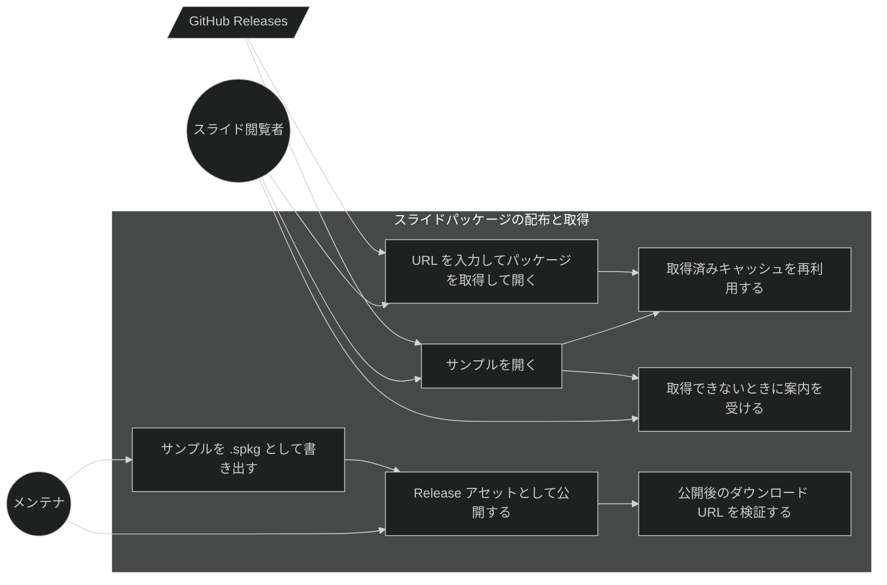

# スライドパッケージの配布と取得 要求仕様書

## 概要

本 PRD は、**スライドパッケージをネットワーク越しに取得して開く経路**と、**アプリが提示するサンプルスライドの配布**を所有する。対象は次の3領域である。

| 領域 | 状態 |
|:---|:---|
| HTTPS URL からスライドパッケージを取得し、キャッシュへ展開して開く | 実装済み（[Issue #40](https://github.com/ToshikiImagawa/slide-presentation-app/issues/40)）だが **`.sdd` に未記載**。本 PRD で as-is を文書化 |
| 取得したパッケージのキャッシュ契約（展開先の命名・再利用の可否・サニタイズ） | 一部実装済み。本 PRD で契約として明文化し、キャッシュ再利用を追加 |
| **テンプレートガイドのサンプルスライドを `.spkg` として配布し、アプリが取得して表示する** | **本 PRD で新規追加** |

[slide-package-open.md](./slide-package-open.md) が「**どの入口から開く要求が届くか**」を所有するのに対し、本 PRD は「**パッケージの中身をネットワークからどう手に入れ、どこに置き、いつ再利用するか**」を所有する。両者の境界は次のとおりである。

| 関心事 | 所有 PRD |
|:---|:---|
| ファイル選択ダイアログ / URL 入力 / 最近開いた一覧 / OS 関連付けという**入口の集合** | [slide-package-open.md](./slide-package-open.md) |
| 開いた後の共通読み込み手順（asset スコープ許可・バリデーション・アドオン解決・アセット URL 書き換え） | [slide-package-open.md](./slide-package-open.md) |
| **HTTPS 取得の制約・キャッシュの契約・配布チャネル・サンプルの所在とロケール解決** | **本 PRD** |

### 背景・目的

#### 現状の課題

- **テンプレートガイドのサンプル（17 枚）がアプリにビルトインされていた。** サンプルの誤字修正や新機能の紹介スライド追加のような**内容の更新が、アプリ本体のリリースに縛られていた**。サンプルはアプリの使い方を伝える資料であり、アプリのコードとは更新頻度が本質的に異なる。
- **サンプルの音声アセット（3.1MB）がアプリバンドルに常時同梱されていた。** サンプルを一度も開かない利用者もこの容量を配布物として受け取っていた。
- **ビルトインのアセット参照が壊れていた。** 英語版サンプルが参照する音声には実体がなく、`/demo-log.txt` は配布ビルドに存在しなかった。参照だけが残っても書き出しは警告のみで続行するため、**壊れていることに気づく仕組みがなかった**。
- **フランス語のサンプルが存在しなかった。** UI は fr-FR に対応済みだったが、サンプルは ja / en のみで、フランス語環境では英語版が表示されていた。
- **URL からパッケージを取得する経路（Issue #40）が `.sdd` に一切記載されていない。** https 限定という制約、展開先の命名規則、失敗時の扱いがコードだけに存在し、要求の所有者が不在だった。本変更でこの経路が**サンプル取得の基幹経路**になるため、未文書化のまま拡張することはできない。

#### ビジネス価値

- **サンプルの更新をアプリのリリースから切り離す**: サンプルは Release アセットの差し替えだけで更新でき、利用者はアプリを更新せずに新しいサンプルを受け取れる。
- **アプリバンドルの縮小**: サンプルのスライドと音声がバンドルから外れる。
- **配布物の完全性の保証**: 参照アセットが欠けたパッケージを作らせない仕組みを CI ゲートとして持つ。
- **ロケール拡張の低コスト化**: サンプルのロケール追加が「ファイルを1つ置いて宣言を1行足す」だけで済む。
- **要求の所有者の明確化**: URL 取得とキャッシュの契約が文書化され、以後の取得経路の追加（サンプル以外の遠隔配布など）が既存要求の派生として扱える。

#### 方針（確定事項）

- **サンプルはアプリに同梱せず、GitHub Releases のアセットとして配布する。** アプリに残すのは取得できなかったときの最小フォールバック（1 枚）のみとする。
- **オフラインでもホーム画面が機能不全にならないこと。** サンプルを取得できない場合は案内スライドを表示し、利用者に理由と対処を伝える。
- **利用者を長時間待たせない。** サンプル取得は短いタイムアウトで打ち切り、次の候補・案内スライドへ進む。
- **配布サンプルの宣言は1箇所を単一の真実源とする。** アプリ・ビルドスクリプト・CI・開発サーバーがすべて同じ宣言を読む。
- **キャッシュの再利用は「内容が不変な URL」にのみ許す。** 同じ URL が別の内容を返し得る経路では再利用しない。

---

# 1. 要求図の読み方

## 1.1. 要求タイプ

- **requirement**: 一般的な要求
- **functionalRequirement**: 機能要求
- **performanceRequirement**: パフォーマンス要求
- **designConstraint**: 設計制約

## 1.2. リスクレベル

- **High**: 高リスク（ビジネスクリティカル、実装困難）
- **Medium**: 中リスク（重要だが代替可能）
- **Low**: 低リスク（Nice to have）

## 1.3. 検証方法

- **Analysis**: 分析による検証
- **Test**: テストによる検証
- **Demonstration**: デモンストレーションによる検証
- **Inspection**: インスペクション（レビュー）による検証

## 1.4. 関係タイプ

- **contains**: 包含関係（親要求が子要求を含む）
- **derives**: 派生関係（要求から別の要求が導出される）
- **traces**: トレース関係（要求間の追跡可能性）

---

# 2. 要求一覧

## 2.1. ユースケース図（概要）

**アクター**

| アクター | 説明 |
|:---|:---|
| スライド閲覧者 | ホーム画面からサンプルを開く、または URL を入力して配布されたパッケージを開く利用者 |
| メンテナ | サンプルを更新し、リリース時に Release アセットとして公開する開発者 |
| GitHub Releases | サンプルパッケージの配布先。バージョン固定 URL と latest URL の2種の静的ダウンロード URL を提供する外部システム |

**ユースケース**

| ユースケース | 説明 |
|:---|:---|
| URL を入力してパッケージを取得して開く | ホーム画面の URL 入力に HTTPS の URL を入れ、パッケージを取得・展開して開く |
| サンプルを開く | ホーム画面の「サンプルを開く」から、テンプレートガイドのサンプルスライドを表示する |
| 取得済みキャッシュを再利用する | 内容が不変な URL は、2 回目以降ネットワークに触れず展開済みキャッシュから開く |
| 取得できないときに案内を受ける | オフライン等でサンプルを取得できない場合に、理由と対処を伝える案内スライドとトーストを受け取る |
| サンプルを .spkg として書き出す | 宣言されたロケール分のサンプルを、参照アセットを含めた `.spkg` として書き出す |
| Release アセットとして公開する | 書き出したサンプルをリリースのアセットとして添付し、静的 URL で取得可能にする |
| 公開後のダウンロード URL を検証する | 公開後、アプリが参照する静的 URL に実際に到達できることを確認する |

## 2.2. 機能一覧（テキスト形式）

- URL からの取得（as-is・[Issue #40](https://github.com/ToshikiImagawa/slide-presentation-app/issues/40)）
    - HTTPS スキームのみを許可する URL 検証
    - アプリのキャッシュディレクトリへのダウンロードと展開
    - 展開結果の検証（`slides.json` の所在の確定）
- キャッシュの契約（本 PRD で明文化・拡張）
    - 展開先ディレクトリ名の決定（URL 由来の安定名、または明示されたキャッシュキー）
    - キャッシュキーのサニタイズによるキャッシュ領域外への逸脱防止
    - 内容が不変な URL に限ったキャッシュ再利用
    - 呼び出しごとのタイムアウト指定
- サンプルの配布（本 PRD で新規追加）
    - 配布サンプルの単一真実源（取得元ディレクトリ・フォールバックロケール・ロケール別パッケージ）
    - ロケール解決（言語コードで照合し、無いロケールはフォールバックロケール）
    - Release アセットの命名規約（バージョンを含めない）
    - サンプル取得の3段フォールバック（同梱 → 配布パッケージ → 案内スライド）
    - サンプル専用の読み込み（最近開いた一覧に記録しない・エラーダイアログを出さない）
    - 取得元の上書き（未公開バージョンでの検証・独自サンプルへの差し替え）
- 配布物のビルドと公開（本 PRD で新規追加）
    - サンプル書き出しスクリプトと基準ディレクトリの指定
    - 参照アセットの欠損を失敗として扱う厳格モード
    - CI での書き出し検証ゲート
    - リリース時のアセット添付と、公開後の静的 URL 到達性検証
- アプリ内の最小フォールバック（本 PRD で新規追加）
    - スライドデータが不正なときのフォールバック
    - サンプルを取得できなかったときの案内スライド

---

# 3. 要求図（SysML Requirements Diagram）

## 3.1. 全体要求図

```mermaid
requirementDiagram
    requirement DecoupledSampleDistribution {
        id: UR_001
        text: "サンプルスライドの更新をアプリのリリースから切り離し アプリのバンドルにサンプルを含めないこと"
        risk: medium
        verifymethod: demonstration
    }

    requirement AlwaysUsableHome {
        id: UR_002
        text: "取得できない状況でもホーム画面から必ず何かを表示でき 利用者を長時間待たせないこと"
        risk: high
        verifymethod: demonstration
    }

    requirement TrustworthyDistribution {
        id: UR_003
        text: "配布されるパッケージが参照アセットを欠かず 公開された URL から実際に取得できること"
        risk: high
        verifymethod: test
    }

    functionalRequirement FetchFromHttps {
        id: FR_001
        text: "HTTPS の URL からスライドパッケージを取得できること https 以外のスキームは拒否すること"
        risk: medium
        verifymethod: test
    }

    functionalRequirement ExtractToCache {
        id: FR_002
        text: "取得したパッケージをアプリのキャッシュディレクトリへ展開し slides.json のある基準ディレクトリを返すこと"
        risk: medium
        verifymethod: test
    }

    functionalRequirement ValidateExtraction {
        id: FR_003
        text: "展開結果に slides.json が見つからない場合は成功として返さずエラーにすること"
        risk: medium
        verifymethod: test
    }

    functionalRequirement ReuseCache {
        id: FR_004
        text: "内容が不変な URL に限り展開済みキャッシュをネットワークに触れず再利用できること"
        risk: medium
        verifymethod: test
    }

    functionalRequirement PerRequestTimeout {
        id: FR_005
        text: "取得のタイムアウトを呼び出しごとに指定できること 未指定なら従来の既定値で動くこと"
        risk: medium
        verifymethod: test
    }

    functionalRequirement SampleManifest {
        id: FR_006
        text: "配布サンプルの取得元とロケール別パッケージを単一の宣言で管理し アプリとビルドの双方がそれを読むこと"
        risk: medium
        verifymethod: inspection
    }

    functionalRequirement SampleLocaleResolution {
        id: FR_007
        text: "利用者のロケールを言語コードで照合し サンプルが無いロケールはフォールバックロケールのサンプルを使うこと"
        risk: low
        verifymethod: test
    }

    functionalRequirement SampleFallbackChain {
        id: FR_008
        text: "サンプル取得を同梱 配布パッケージ 案内スライドの3段で解決し 先に成功したものを採用すること"
        risk: high
        verifymethod: test
    }

    functionalRequirement SampleLoadIsolation {
        id: FR_009
        text: "サンプル取得は最近開いた一覧に記録せず 失敗時にエラーダイアログを出さないこと"
        risk: medium
        verifymethod: test
    }

    functionalRequirement BundledSlidesDetection {
        id: FR_010
        text: "ビルド時同梱の slides.json は応答の種別と内容の妥当性の両方を検証してから採用すること"
        risk: high
        verifymethod: test
    }

    functionalRequirement SampleSourceOverride {
        id: FR_011
        text: "サンプルの取得元を上書きでき 同梱を無視してリモート経路のみを検証できること"
        risk: low
        verifymethod: demonstration
    }

    functionalRequirement StrictPackageBuild {
        id: FR_012
        text: "配布物のビルドでは参照アセットが1つでも欠けていたら失敗させ 書き出しの基準ディレクトリを指定できること"
        risk: high
        verifymethod: test
    }

    functionalRequirement ReleaseAssetPublication {
        id: FR_013
        text: "宣言された全ロケールのサンプルをリリースのアセットとして添付し 公開後に静的 URL の到達性を検証すること"
        risk: high
        verifymethod: test
    }

    functionalRequirement MinimalFallbackSlides {
        id: FR_014
        text: "スライドデータが不正なときとサンプルを取得できなかったときで それぞれ原因に応じた最小フォールバックを表示すること"
        risk: medium
        verifymethod: test
    }

    requirement OfflineDegradation {
        id: NFR_001
        text: "ネットワークが使えない状況でもアプリが操作可能であり 一度取得したサンプルは再取得なしで開けること"
        risk: high
        verifymethod: demonstration
    }

    performanceRequirement BoundedWait {
        id: NFR_002
        text: "サンプル取得で利用者を待たせる時間に上限を設け 上限を超えたら次の候補または案内へ進むこと"
        risk: high
        verifymethod: test
    }

    requirement CacheContainment {
        id: NFR_003
        text: "展開先ディレクトリが常にアプリのキャッシュ領域の内側に収まること"
        risk: high
        verifymethod: test
    }

    requirement DistributionIntegrity {
        id: NFR_004
        text: "参照アセットを欠いたパッケージがリリースへ到達しないこと"
        risk: high
        verifymethod: test
    }

    requirement NoSampleInBundle {
        id: NFR_005
        text: "サンプルのスライドと音声アセットが本番ビルドの出力に含まれないこと"
        risk: medium
        verifymethod: inspection
    }

    requirement DistributionNoRegression {
        id: NFR_006
        text: "既存の URL 取得 ビルド時同梱 ローカル選択 編集モードの保存が従来どおり動作すること"
        risk: medium
        verifymethod: test
    }

    designConstraint SingleSampleSource {
        id: DC_001
        text: "配布サンプルの宣言は1ファイルを単一の真実源とし アプリ ビルド 開発サーバーがすべてそれを読むこと"
        risk: medium
        verifymethod: inspection
    }

    designConstraint VersionlessAssetName {
        id: DC_002
        text: "Release アセット名にバージョンを含めないこと"
        risk: high
        verifymethod: inspection
    }

    designConstraint ReuseOnlyImmutable {
        id: DC_003
        text: "キャッシュ再利用は内容が不変な URL にのみ指定し 内容が変わりうる URL では毎回取得すること"
        risk: high
        verifymethod: inspection
    }

    designConstraint StableCacheKey {
        id: DC_004
        text: "キャッシュを再利用する経路は安定したキャッシュキーを明示し 値はサニタイズすること"
        risk: high
        verifymethod: test
    }

    designConstraint DevOnlySampleServing {
        id: DC_005
        text: "開発時のサンプル配信は開発サーバー限定とし 本番出力と既存の同梱指定を上書きしないこと"
        risk: medium
        verifymethod: inspection
    }

    designConstraint TestableSourceResolution {
        id: DC_006
        text: "取得元の決定ロジックはテストから読み込める単位に置くこと"
        risk: medium
        verifymethod: inspection
    }

    DecoupledSampleDistribution - contains -> SampleManifest
    DecoupledSampleDistribution - contains -> SampleLocaleResolution
    DecoupledSampleDistribution - contains -> SampleFallbackChain
    DecoupledSampleDistribution - contains -> ReleaseAssetPublication
    AlwaysUsableHome - contains -> SampleFallbackChain
    AlwaysUsableHome - contains -> MinimalFallbackSlides
    AlwaysUsableHome - contains -> ReuseCache
    AlwaysUsableHome - contains -> PerRequestTimeout
    TrustworthyDistribution - contains -> StrictPackageBuild
    TrustworthyDistribution - contains -> ReleaseAssetPublication
    TrustworthyDistribution - contains -> ValidateExtraction
    SampleFallbackChain - derives -> FetchFromHttps
    SampleFallbackChain - derives -> SampleLoadIsolation
    SampleFallbackChain - derives -> BundledSlidesDetection
    SampleFallbackChain - derives -> SampleSourceOverride
    FetchFromHttps - contains -> ExtractToCache
    ExtractToCache - derives -> ValidateExtraction
    ExtractToCache - derives -> ReuseCache
    ReuseCache - traces -> OfflineDegradation
    SampleManifest - traces -> SingleSampleSource
    ReleaseAssetPublication - traces -> VersionlessAssetName
    ReuseCache - traces -> ReuseOnlyImmutable
    ReuseCache - traces -> StableCacheKey
    ExtractToCache - traces -> CacheContainment
    PerRequestTimeout - traces -> BoundedWait
    SampleFallbackChain - traces -> OfflineDegradation
    MinimalFallbackSlides - traces -> OfflineDegradation
    StrictPackageBuild - traces -> DistributionIntegrity
    ReleaseAssetPublication - traces -> DistributionIntegrity
    DecoupledSampleDistribution - traces -> NoSampleInBundle
    BundledSlidesDetection - traces -> DevOnlySampleServing
    SampleSourceOverride - traces -> TestableSourceResolution
    DecoupledSampleDistribution - traces -> DistributionNoRegression
```

## 3.2. 要求間のトレーサビリティ

| 上位要求 | 下位要求 | 関係 |
|:---|:---|:---|
| UR-001 | FR-006 / FR-007 / FR-008 / FR-013 | contains |
| UR-002 | FR-004 / FR-005 / FR-008 / FR-014 | contains |
| UR-003 | FR-003 / FR-012 / FR-013 | contains |
| FR-008 | FR-001 / FR-009 / FR-010 / FR-011 | derives |
| FR-001 | FR-002 | contains |
| FR-002 | FR-003 / FR-004 | derives |
| FR-002 | NFR-003 | traces |
| FR-004 | NFR-001 / DC-003 / DC-004 | traces |
| FR-005 | NFR-002 | traces |
| FR-006 | DC-001 | traces |
| FR-008 / FR-014 | NFR-001 | traces |
| FR-010 | DC-005 | traces |
| FR-011 | DC-006 | traces |
| FR-012 / FR-013 | NFR-004 | traces |
| FR-013 | DC-002 | traces |
| UR-001 | NFR-005 / NFR-006 | traces |

> **既存要求との関係**: FR-001 / FR-002 は [slide-package-open.md](./slide-package-open.md) の FR-002（URL からの取得と読み込み）を**詳細化**した要求である。あちらは「URL 入力という入口が存在する」ことを、本 PRD は「その取得がどう成立し、キャッシュがどう振る舞うか」を所有する。FR-002 の展開結果（基準ディレクトリ）以降の処理は [slide-package-open.md](./slide-package-open.md) の FR-009（共通読み込み手順）に接続し、本 PRD では再定義しない。FR-012 のパッケージ書き出しは [package-embedded-addon.md](./package-embedded-addon.md) の書き出し要求（同梱アドオンの個別選択）と同じスクリプトを共有する。FR-014 の最小フォールバックは [slide-content-customization.md](./slide-content-customization.md) の FR_402（デフォルトデータへのフォールバック）の実体を、ビルトインのデモスライドからコード生成の 1 枚へ置き換えたものである。

---

# 4. 要求の詳細説明

## 4.1. ユーザ要求

### UR-001: サンプル配布のアプリからの分離

テンプレートガイドのサンプルスライドの内容更新が、アプリ本体のリリースサイクルに縛られないこと。またサンプルのスライドと音声アセットがアプリのバンドルに含まれないこと。ロケールを追加する作業が、宣言を1行足すだけで完結すること。

**検証方法:** デモンストレーションによる検証

### UR-002: 常に使えるホーム画面

サンプルを取得できない状況（オフライン、リリースアセット未添付、未公開バージョンのローカルビルド）でも、ホーム画面の「サンプルを開く」が無反応にならず、利用者に理由と対処が伝わること。また取得の待ち時間に上限があり、ホーム画面が長時間操作不能にならないこと。一度取得したサンプルは、次回以降ネットワークがなくても開けること。

**検証方法:** デモンストレーションによる検証

### UR-003: 配布物の信頼性

配布されるパッケージが、参照しているアセット（音声・画像・テーマ・フォント）を実際に含んでいること。またアプリが参照する静的ダウンロード URL から、公開後に実際に取得できること。

**検証方法:** テストによる検証

## 4.2. 機能要求

### FR-001: HTTPS URL からの取得（既存）

**優先度**: Must ／ **派生元**: UR-003 / FR-008 ／ **状態**: 実装済み（[Issue #40](https://github.com/ToshikiImagawa/slide-presentation-app/issues/40)）

任意の HTTPS URL からスライドパッケージ（tar+gzip 形式。`.spkg` / 旧 `.tgz`）を取得できる。**スキームは https に限定し、それ以外は拒否する**。取得先ドメインの事前許可リストは設けない（任意 URL を開けることが要件であるため）。

**検証方法:** テストによる検証

### FR-002: キャッシュディレクトリへの展開（既存）

**優先度**: Must ／ **派生元**: FR-001

取得したパッケージをアプリのキャッシュディレクトリ配下へ展開し、`slides.json` の置かれた**基準ディレクトリ**を返す。展開先ディレクトリ名は、既定では URL から導出した安定した名前とし、同一 URL は同じ展開先を再利用・上書きする。呼び出し側が明示的なキャッシュキーを指定できる（FR-004 / DC-004）。

**検証方法:** テストによる検証

### FR-003: 展開結果の検証（変更）

**優先度**: Must ／ **派生元**: UR-003 / FR-002

展開したディレクトリから `slides.json` を見つけられない場合、成功として基準ディレクトリを返してはならず、エラーとして扱う。従来は展開先をそのまま返していたため、中身が期待と違うアーカイブでも「成功」してから後段で失敗していた。

**検証方法:** テストによる検証

### FR-004: キャッシュの再利用（新規）

**優先度**: Must ／ **派生元**: UR-002 / FR-002

呼び出し側が指定した場合、展開済みキャッシュが利用可能ならネットワークに触れず、そのキャッシュから基準ディレクトリを返す。**この指定は内容が不変な URL にのみ許される**（DC-003）。キャッシュが利用可能かどうかの判定は、FR-003 と同じ「`slides.json` が見つかるか」で行い、展開途中・破損したキャッシュを再利用しない。

**検証方法:** テストによる検証

### FR-005: 呼び出しごとのタイムアウト指定（新規）

**優先度**: Must ／ **派生元**: UR-002

取得のタイムアウトを呼び出しごとに指定できる。未指定の場合は従来の既定値（大きなパッケージのダウンロードを想定した長めの値）で動作し、既存の URL 入力経路の挙動を変えない。

**検証方法:** テストによる検証

### FR-006: 配布サンプルの単一真実源（新規）

**優先度**: Must ／ **派生元**: UR-001

配布サンプルの「取得元ディレクトリ」「フォールバックロケール」「ロケール別パッケージ（ロケール・スライドファイル名・パッケージ名）」を1つの宣言で管理する。アプリ（サンプル取得）とビルド（書き出しスクリプト）、CI、開発サーバーがすべて同じ宣言を読む（DC-001）。

**検証方法:** インスペクションによる検証

### FR-007: ロケール解決（新規）

**優先度**: Must ／ **派生元**: UR-001

利用者のロケールを**言語コード**で照合してサンプルパッケージを解決する（`ja-JP` → `ja`）。宣言に該当する言語コードがない場合は**フォールバックロケール**のサンプルを使う。

**検証方法:** テストによる検証

### FR-008: サンプル取得の3段フォールバック（新規）

**優先度**: Must ／ **派生元**: UR-001 / UR-002

サンプルの取得を次の3段で解決し、先に成功したものを採用する。

1. **ビルド時同梱の `slides.json`**（存在する場合）。ビルド時にパッケージを同梱した配布形態、スクリーンショット撮影用の fixture、開発サーバーでのサンプル配信がここに該当する
2. **配布パッケージ**。アプリのバージョンに対応するアセットを先に試し、失敗したら latest のアセットを試す
3. **案内スライド**。どこからも取得できなかった場合、理由と対処を伝える最小フォールバック（FR-014）を表示し、あわせて通知する

**検証方法:** テストによる検証

### FR-009: サンプル読み込みの隔離（新規）

**優先度**: Must ／ **派生元**: FR-008

サンプルの読み込みは、利用者が明示的に開いたパッケージとは扱いを分ける。

- **最近開いた一覧に記録しない**。サンプルはボタンからいつでも開けるため一覧を占有させない
- **失敗時にエラーダイアログを出さない**。呼び出し側が次の候補・案内スライドへフォールバックするため、途中の失敗を利用者に突きつけない

また、URL 由来のパッケージは**ローカルの元ファイルを持たない**ため、編集モードの保存ダイアログの既定パスとして URL を渡してはならない。

**検証方法:** テストによる検証

### FR-010: 同梱スライドの妥当性判定（新規）

**優先度**: Must ／ **派生元**: FR-008

ビルド時同梱の `slides.json` は、**応答が成功したことだけでは同梱の存在を判定できない**。開発サーバーは存在しないパスに対してもアプリ本体の HTML を成功応答として返し得るため、**応答の種別（内容の形式）とスライドデータとしての妥当性の両方**を検証してから採用する。いずれかを満たさない場合は「同梱なし」として次の段へ進む。

**検証方法:** テストによる検証

### FR-011: 取得元の上書き（新規）

**優先度**: Should ／ **派生元**: FR-008

サンプルの取得元 URL を上書きできる（未公開バージョンでの検証、独自サンプルへの差し替え）。また、同梱を無視して必ずリモートから取得させる指定ができ、リモート経路を実機で確認できる。

**検証方法:** デモンストレーションによる検証

### FR-012: 配布物ビルドの厳格化（新規）

**優先度**: Must ／ **派生元**: UR-003

パッケージ書き出しにおいて、次の2点を満たす。

- **基準ディレクトリを指定できる**。スライドファイルと参照アセットの入力元を固定せず、サンプルのような別ディレクトリからも書き出せる
- **参照アセットが1つでも欠けていたら失敗させる指定ができる**。従来は警告のみで続行したため、参照だけが残り実体のないパッケージが黙って作られていた。既定の挙動（警告して続行）は変えず、配布物のビルドでのみ厳格モードを使う

**検証方法:** テストによる検証

### FR-013: リリースアセットの公開と検証（新規）

**優先度**: Must ／ **派生元**: UR-001 / UR-003

リリース時に、宣言された全ロケールのサンプルを書き出してリリースのアセットとして添付する。アセット名にはバージョンを含めない（DC-002）。**公開後に、アプリが参照する静的ダウンロード URL へ実際に到達できることを検証する**。添付漏れや命名のズレは、公開前の検証では検出できない（公開前は認証付き API 経由でしか参照できない）。

また、CI では通常のプッシュ時にも書き出しが成立することを検証し、リリース時に初めて壊れていることに気づく事態を防ぐ。

**検証方法:** テストによる検証

### FR-014: 原因別の最小フォールバック（新規）

**優先度**: Must ／ **派生元**: UR-002

アプリに残す最小フォールバックは、**原因の異なる2つ**とする。ビルトインのデモスライドは持たず、いずれもコード内で生成する1枚とする。

| 用途 | 表示する状況 |
|:---|:---|
| データ不正のフォールバック | 与えられたスライドデータがバリデーションを通らないとき |
| サンプル取得失敗の案内 | サンプルをどこからも取得できなかったとき |

原因が違えば利用者が取るべき行動も違う（前者はデータの修正、後者はネットワークの確認）ため、文言を共有しない。

**検証方法:** テストによる検証

## 4.3. 非機能要求

### NFR-001: オフライン時の縮退動作

**優先度**: Must ／ **カテゴリ**: 信頼性・可用性

サンプルをアプリから外したことで、**サンプル表示はネットワークに依存する機能になった**。この依存が利用者の作業を止めないよう、次の縮退動作を保証する。

| 状況 | 期待される動作 |
|:---|:---|
| オフライン・初回（キャッシュなし） | 案内スライドとトーストを表示する。ホーム画面は操作可能なまま保たれ、ローカルファイルを開く経路は影響を受けない |
| オフライン・2 回目以降（キャッシュあり） | 展開済みキャッシュから**ネットワークに触れず**サンプルを開ける |
| オンラインだが対象アセットが存在しない | 次の候補へ進み、すべて失敗したら案内スライドを表示する |
| ビルド時同梱がある配布形態 | ネットワークに一切触れずサンプルを開ける（3段の1段目で完結する） |

**利用者の作業（ローカルの `slides.json` / `.spkg` を開く、編集する、発表する）はネットワークの有無に一切依存しない。** ネットワーク依存はサンプル表示に限定されること。

**検証方法:** デモンストレーション（ネットワークを切断した状態でホーム画面の全操作を確認）による検証

### NFR-002: 待ち時間の上限

**優先度**: Must ／ **カテゴリ**: パフォーマンス

サンプル取得中はホーム画面の操作ボタンが無効化されるため、待ち時間には上限が必要である。取得の各候補にタイムアウトを設け、上限を超えたら次の候補または案内スライドへ進む。既定のタイムアウト（大きなパッケージのダウンロード向けの長い値）を候補数ぶん直列に待つ構成にしてはならない。

**検証方法:** テストによる検証

### NFR-003: キャッシュ領域からの逸脱防止

**優先度**: Must ／ **カテゴリ**: セキュリティ

展開先ディレクトリは常にアプリのキャッシュ領域の内側に収まること。呼び出し側が指定するキャッシュキーにパス区切りや相対参照が含まれても、キャッシュ領域の外に出てはならない。

**検証方法:** テストによる検証

### NFR-004: 配布物の完全性

**優先度**: Must ／ **カテゴリ**: 信頼性

参照アセットを欠いたパッケージがリリースへ到達しないこと。欠損はパッケージのビルド時点で失敗として検出されること。

**検証方法:** テストによる検証

### NFR-005: バンドルへの非混入

**優先度**: Should ／ **カテゴリ**: 配布サイズ

サンプルのスライドデータと音声アセットが本番ビルドの出力に含まれないこと。開発時の利便性のための仕組みが本番出力に混入しないこと（DC-005）。

**検証方法:** インスペクションによる検証

### NFR-006: 既存機能のリグレッションなし

**優先度**: Must ／ **カテゴリ**: 互換性

既存の URL 入力からの取得、ビルド時同梱（`public/slides.json` および同梱パッケージ指定）、ローカルファイル選択、最近開いた一覧、編集モードの保存が従来どおり動作すること。タイムアウトとキャッシュのオプションは**未指定時に従来の挙動を維持**すること。

**検証方法:** テストによる検証

## 4.4. 設計制約

### DC-001: 配布サンプル宣言の単一真実源

配布サンプルの宣言は1ファイルを単一の真実源とし、アプリ・書き出しスクリプト・CI・開発サーバーがすべてそれを読む。ロケールを追加するとき、複数箇所へ同じ情報を書き足す二重管理をしない。

**検証方法:** インスペクションによる検証

### DC-002: アセット名にバージョンを含めない

Release アセット名にバージョンを含めない。アプリは「最新リリースのアセット」を指す静的 URL をフォールバック先として参照するが、**その URL を組み立てる時点で最新リリースのバージョンを知り得ない**。アセット名にバージョンが含まれていると URL を確定できず、フォールバックが成立しない。

**検証方法:** インスペクションによる検証

### DC-003: キャッシュ再利用は内容が不変な URL に限る

キャッシュ再利用の指定は、同じ URL が常に同じ内容を返すと保証できる場合にのみ行う。「最新リリースのアセット」のように内容が入れ替わりうる URL では再利用せず、毎回取得する。再利用してしまうと、リリース後もアプリが古いサンプルを表示し続ける。

**検証方法:** インスペクションによる検証

### DC-004: 安定したキャッシュキーの明示とサニタイズ

キャッシュを再利用したい経路は、安定したキャッシュキーを明示する。URL から機械的に導出する名前は、処理系のバージョン間で同じ値になることが保証されないため、再利用の前提にできない。またキャッシュキーの値はサニタイズし、キャッシュ領域の外に出ないようにする（NFR-003）。

**検証方法:** テストによる検証

### DC-005: 開発時のサンプル配信は開発サーバー限定

開発時にサンプルを表示するための配信は開発サーバー限定とし、本番ビルドの出力には一切混入させない（NFR-005 と両立させる）。また既存のビルド時同梱指定（`public/slides.json` および同梱パッケージ指定）を上書きしない。

**検証方法:** インスペクションによる検証

### DC-006: 取得元決定ロジックの配置

取得元（URL の候補列とその取得オプション）を決めるロジックは、テストから読み込める単位に置く。アプリの起動処理そのものを行う場所に混在させると、読み込むだけで副作用が発生しテストできない。

**検証方法:** インスペクションによる検証

---

# 5. 制約事項

## 5.1. 技術的制約

- 取得のスキームは https のみ。取得先ドメインの事前許可方式は本要件（任意 URL を開ける）と相性が悪いため採用しない（FR-001）。
- パッケージは tar+gzip 形式であり、展開は拡張子に依存しない（[slide-package-open.md](./slide-package-open.md)）。
- URL から機械的に導出する展開先名は、処理系のバージョン間で安定と保証されない（DC-004）。
- 配布チャネルは GitHub Releases のアセットに依存する。バージョン固定 URL と「最新」URL の2種の静的 URL が利用できることを前提とする。
- 公開前のリリースに添付されたアセットは静的 URL から取得できないため、URL の到達性検証は公開後にしか行えない（FR-013）。
- 開発サーバーは存在しないパスに対してもアプリ本体の HTML を成功応答として返し得る（FR-010）。
- アプリのバージョンを取得できない実行環境（ネイティブ層のない素のブラウザ）が存在する。この場合はバージョン固定 URL を組み立てられない（FR-008）。
- 読み込んだデータのバリデーションは既存の構造化 `ValidationError` を踏襲する（D-002）。
- TypeScript strict mode での型安全性を確保する（T-001）。

## 5.2. ビジネス的制約

- プレゼンテーションの表示品質・伝達力に影響を与えない（B-001）。
- サンプルを取得できない場合も、アプリの他の機能（ローカルファイルを開く・編集・発表）は従来どおり使えること（A-005: フォールバックファースト設計）。
- サンプルの内容自体（何を説明するか）は本 PRD のスコープに含めない。[slide-content-customization.md](./slide-content-customization.md) が扱うスライド表現の範囲で作られる。

---

# 6. 前提条件

- HTTPS URL からのダウンロードとキャッシュ展開がネイティブ側に存在すること（[slide-package-open.md](./slide-package-open.md) FR-002）。
- 展開後の共通読み込み手順（asset スコープの動的許可・バリデーション・同梱アドオン解決・アセット URL 書き換え）が存在すること（[slide-package-open.md](./slide-package-open.md) FR-009）。
- パッケージ書き出しスクリプトが存在すること（[package-embedded-addon.md](./package-embedded-addon.md)）。
- UI の多言語対応と現在ロケールの取得手段が存在すること（[language-settings.md](./language-settings.md)）。
- ホーム画面に通知（トースト）の提示手段が存在すること。
- リリースワークフローが下書きリリースを作成してから公開する構成であること。

---

# 7. スコープ外

以下は本 PRD のスコープ外とします：

- **HTTP（非 HTTPS）URL からの取得**（FR-001 の既存制約を維持）。
- **取得先ドメインの許可リスト方式**。
- **パッケージの署名検証・完全性検証**（チェックサム・署名）。配布元の信頼は同梱アドオンの実行時信頼（[package-embedded-addon.md](./package-embedded-addon.md)）で扱う。
- **キャッシュの容量管理・世代削除**。展開先は同一キーで上書きされるが、キーが変わった古い世代の削除は行わない。
- **バックグラウンドでのサンプル事前取得・自動更新**。取得は利用者が「サンプルを開く」を操作した時点で行う。
- **サンプル以外のパッケージのカタログ配布**（配布パッケージ一覧の提示・検索）。
- **サンプルの内容そのものの設計**（どのスライドで何を説明するか）。
- **fr ロケールのサンプル音声**。フランス語サンプルは音声なしで配布する。

---

# 8. 用語集

| 用語 | 定義 |
|:---|:---|
| スライドパッケージ（`.spkg`） | `slides.json` と参照アセット（`image/` `voice/` `theme/` `font/`）・任意の同梱アドオンを1ファイルにまとめた配布形式。実体は tar+gzip で、旧拡張子は `.tgz` |
| 配布サンプル | ホーム画面の「サンプルを開く」で表示されるテンプレートガイドのスライド。アプリに同梱せず Release アセットとして配布する |
| サンプル宣言 | 配布サンプルの取得元ディレクトリ・フォールバックロケール・ロケール別パッケージを列挙した単一真実源 |
| フォールバックロケール | サンプルが用意されていないロケールで代わりに使うロケール |
| 基準ディレクトリ | `slides.json` が置かれたディレクトリ。相対アセット参照の解決基準 |
| 展開済みキャッシュ | 取得したパッケージを展開した状態でアプリのキャッシュ領域に保持しているもの |
| キャッシュキー | 展開先ディレクトリ名を決める識別子。明示しない場合は URL から機械的に導出する |
| バージョン固定 URL | アプリのバージョンに対応するリリースのアセットを指す静的 URL。内容が不変 |
| latest URL | 最新リリースのアセットを指す静的 URL。指す内容がリリースごとに変わる |
| 3段フォールバック | サンプル取得を「ビルド時同梱 → 配布パッケージ → 案内スライド」の順で解決する規約 |
| 最小フォールバック | アプリ内でコード生成する1枚のスライド。データ不正時と、サンプル取得失敗時の2種がある |
| 厳格モード | パッケージ書き出しで、参照アセットの欠損を失敗として扱う指定 |
