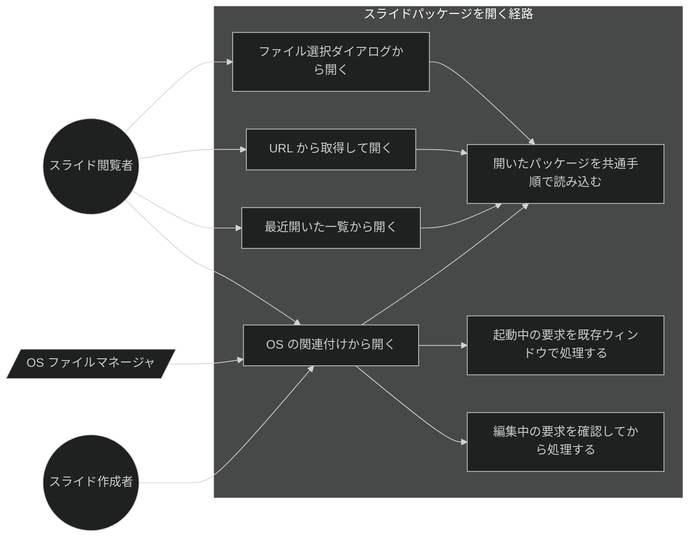

# スライドパッケージを開く経路 要求仕様書

## 概要

本 PRD は、**利用者がスライド資料（`slides.json` / `.spkg` パッケージ）をアプリに読み込ませるすべての入口**を所有する。対象は次の4経路である。

| 経路 | 状態 |
|:---|:---|
| ホーム画面の「ファイルを開く」ボタンからファイル選択ダイアログで選ぶ | 実装済み（as-is 記述） |
| ホーム画面の URL 入力から HTTPS でパッケージを取得する | 実装済み（as-is 記述） |
| ホーム画面の「最近開いたスライド」一覧から再度開く | 実装済み（as-is 記述） |
| **OS のファイル関連付け（ダブルクリック・右クリック→このアプリで開く）から開く** | **本 PRD で新規追加** |

これらは入口が違うだけで、**開いた後の処理は完全に共通**である（パッケージのキャッシュ展開 → asset スコープの動的許可 → バリデーション → 同梱アドオン解決 → 相対アセットの URL 書き換え → 最近開いた一覧への登録）。本 PRD はこの「入口の集合と共通後段」を一つの Feature として定義し、入口が増えるたびに要求の所有者が不在になる状態を解消する。

### 背景・目的

#### 現状の課題

- **「スライドパッケージを開く」という要求が `.sdd` のどこにも UR/FR として定義されていない。** [presentation-foundation_spec.md](../specification/presentation-foundation_spec.md) のユースケース表に「ホーム画面からスライド（サンプルまたはローカルパッケージ）を選ぶ」と散文で登場するのみで、URL 取得経路（[Issue #40](https://github.com/ToshikiImagawa/slide-presentation-app/issues/40)）は `.sdd` に完全に未記載である。
- 配布された `.spkg` を受け取った側は、**必ずアプリを先に起動してからホーム画面で選び直す**必要がある。OS のファイルマネージャからダブルクリックで開けないため、`.spkg` は「アプリの中でしか意味を持たないファイル」になっている。
- 入口ごとに要求の所有者が分かれていると、粒度が不整合になる。「ファイル関連付け」だけの PRD を新設すると、兄弟の入口（ボタン / URL / 最近開いた一覧）を誰も所有しないまま新経路だけが文書化される。

#### ビジネス価値

- **配布の完結**: 作成者が書き出した `.spkg` を受け手がダブルクリックするだけで開ける。「アプリを起動して、ホーム画面で、このファイルを選んでください」という手順書が不要になる。
- **要求の所有者の明確化**: 開く経路が1つの PRD に集まり、以後の入口追加（ドラッグ&ドロップ等）が既存要求の派生として扱える。
- **OS ネイティブアプリらしさ**: デスクトップアプリとして期待される「ファイルを関連付けて開く」挙動を満たす。

#### 方針（確定事項）

- **対応 OS は macOS / Windows / Linux の全 OS。** 特定 OS 限定にはしない。
- **アプリ起動中に開いた場合は既存ウィンドウで開き直す。** 二重起動して別ウィンドウを増やさない。
- **編集モード中に外部から開く要求が来た場合は確認ダイアログを出す。** 未保存の編集内容を黙って破棄しない。
- **OS から届いたパスは「取得と同時にクリアする」単一の取り出し口だけで受け取る。** 通知イベントには実データ（パス）を載せない。

---

# 1. 要求図の読み方

## 1.1. 要求タイプ

- **requirement**: 一般的な要求
- **functionalRequirement**: 機能要求
- **performanceRequirement**: パフォーマンス要求
- **designConstraint**: 設計制約

## 1.2. リスクレベル

- **High**: 高リスク（ビジネスクリティカル、実装困難）
- **Medium**: 中リスク（重要だが代替可能）
- **Low**: 低リスク（Nice to have）

## 1.3. 検証方法

- **Analysis**: 分析による検証
- **Test**: テストによる検証
- **Demonstration**: デモンストレーションによる検証
- **Inspection**: インスペクション（レビュー）による検証

## 1.4. 関係タイプ

- **contains**: 包含関係（親要求が子要求を含む）
- **derives**: 派生関係（要求から別の要求が導出される）
- **traces**: トレース関係（要求間の追跡可能性）

---

# 2. 要求一覧

## 2.1. ユースケース図（概要）

**アクター**

| アクター | 説明 |
|:---|:---|
| スライド閲覧者 | 配布されたスライドを開いて閲覧・発表する利用者 |
| スライド作成者 | `.spkg` を書き出して配布する作成者。書き出した成果物を関連付け経由で検証する |
| OS ファイルマネージャ | Finder / エクスプローラ / ファイルマネージャ。関連付けに従いアプリを起動または前面化してパスを渡す外部システム |

**ユースケース**

| ユースケース | 説明 |
|:---|:---|
| ファイル選択ダイアログから開く | ホーム画面の「ファイルを開く」から `slides.json` または `.spkg`（旧 `.tgz`）を選ぶ |
| URL から取得して開く | ホーム画面の URL 入力に HTTPS の URL を入れ、パッケージを取得して開く |
| 最近開いた一覧から開く | 永続化された最近開いたパッケージの一覧から選び直す |
| OS の関連付けから開く | ファイルマネージャで `.spkg` をダブルクリック、または「このアプリで開く」を選ぶ |
| 開いたパッケージを共通手順で読み込む | 入口を問わず、展開 → asset スコープ許可 → バリデーション → アドオン解決 → アセット URL 書き換えの共通手順で読み込む |
| 起動中の要求を既存ウィンドウで処理する | アプリ起動中に関連付け経由の要求が来たとき、二重起動せず既存ウィンドウで開き直す |
| 編集中の要求を確認してから処理する | 編集モード中に外部から要求が来たとき、未保存の破棄可否を利用者に確認する |

## 2.2. 機能一覧（テキスト形式）

- 既存の入口（as-is）
    - ファイル選択ダイアログからの読み込み（`slides.json` / `.spkg` / 旧 `.tgz`）
    - HTTPS URL からのダウンロードとキャッシュ読み込み
    - 最近開いたパッケージ一覧（永続化・上限あり・失効エントリの自動除去）
- OS ファイル関連付け（#106）
    - `.spkg` を macOS / Windows / Linux の3 OS でアプリに関連付ける
    - コールドスタート（アプリ未起動）での起動要求の受け取り
    - ホットスタート（アプリ起動中）での既存ウィンドウでの開き直し
    - 取りこぼし防止のための保留領域と「取得と同時にクリアする」取り出し口
    - 編集モード中の要求に対する確認ダイアログ
- 共通後段（既存の再利用）
    - パッケージのキャッシュ展開・asset スコープの動的許可・アセット相対参照の URL 書き換え
    - 同梱アドオンの実行時信頼の判定とロード順序の維持

---

# 3. 要求図（SysML Requirements Diagram）

## 3.1. 全体要求図

```mermaid
requirementDiagram
    requirement UnifiedOpenPaths {
        id: UR_001
        text: "利用者がスライドパッケージを開くすべての入口を一貫した共通手順に接続し どの入口からでも同じ結果になること"
        risk: medium
        verifymethod: demonstration
    }

    requirement NoLossOnOpen {
        id: UR_002
        text: "外部から届いた開く要求を取りこぼさず 編集中の未保存内容を失わせないこと"
        risk: high
        verifymethod: demonstration
    }

    functionalRequirement PickFromDialog {
        id: FR_001
        text: "ファイル選択ダイアログから slides.json または spkg 旧 tgz を選んで開けること"
        risk: low
        verifymethod: demonstration
    }

    functionalRequirement OpenFromUrl {
        id: FR_002
        text: "HTTPS の URL からパッケージを取得しキャッシュへ保存して開けること"
        risk: medium
        verifymethod: test
    }

    functionalRequirement OpenFromRecent {
        id: FR_003
        text: "最近開いたパッケージの一覧を永続化し そこから選び直して開けること"
        risk: low
        verifymethod: test
    }

    functionalRequirement OpenFromFileAssociation {
        id: FR_004
        text: "OS のファイル関連付けにより spkg のダブルクリックまたはこのアプリで開くから開けること macOS Windows Linux の3 OS"
        risk: high
        verifymethod: demonstration
    }

    functionalRequirement PendingTakeHandoff {
        id: FR_005
        text: "OS から届いたパスを保留領域に蓄積し 取得と同時にクリアする単一の取り出し口から受け渡すこと"
        risk: high
        verifymethod: test
    }

    functionalRequirement SignalOnlyNotification {
        id: FR_006
        text: "起動中の到着通知は実データを含まないシグナルとし 実データの取得は取り出し口に限ること"
        risk: high
        verifymethod: inspection
    }

    functionalRequirement ReuseExistingWindow {
        id: FR_007
        text: "アプリ起動中に関連付け経由の要求が来たとき二重起動せず既存ウィンドウで開き直すこと"
        risk: medium
        verifymethod: demonstration
    }

    functionalRequirement ConfirmWhileEditing {
        id: FR_008
        text: "編集モード中に外部から要求が来たとき確認ダイアログを出し 破棄の同意なしに編集内容を失わせないこと"
        risk: high
        verifymethod: demonstration
    }

    functionalRequirement SharedLoadPipeline {
        id: FR_009
        text: "入口を問わず展開 asset スコープ許可 バリデーション アドオン解決 アセット URL 書き換えの共通手順を通ること"
        risk: medium
        verifymethod: inspection
    }

    requirement NoDroppedRequest {
        id: NFR_001
        text: "WebView が通知の購読を開始する前に届いた要求も失われないこと"
        risk: high
        verifymethod: test
    }

    requirement NoDoubleOpen {
        id: NFR_002
        text: "同一の要求が起動時取得と通知受信の両方で二重に処理されないこと"
        risk: high
        verifymethod: test
    }

    requirement EditDataSafety {
        id: NFR_003
        text: "未保存の編集内容が利用者の同意なく破棄されないこと"
        risk: high
        verifymethod: demonstration
    }

    requirement CrossPlatformParity {
        id: NFR_004
        text: "macOS Windows Linux で関連付けの登録と起動要求の受け取りが同等に成立すること"
        risk: high
        verifymethod: demonstration
    }

    requirement OpenPathNoRegression {
        id: NFR_005
        text: "既存の3経路と発表者ビュー 同梱アドオン 最近開いた一覧が従来どおり動作すること"
        risk: medium
        verifymethod: test
    }

    designConstraint TakeIsSoleOutlet {
        id: DC_001
        text: "保留領域の取り出し口を1つに限り 取得とクリアを不可分に行うこと"
        risk: high
        verifymethod: inspection
    }

    designConstraint SingleInstanceFirst {
        id: DC_002
        text: "多重起動抑止の仕組みは他のどの初期化よりも先に登録すること"
        risk: high
        verifymethod: inspection
    }

    designConstraint PlatformGuardedVariant {
        id: DC_003
        text: "OS 依存のファイルオープン通知は対象 OS でのみ存在するため条件付きコンパイルで隔離すること"
        risk: medium
        verifymethod: inspection
    }

    designConstraint SingleAssociationSource {
        id: DC_004
        text: "関連付けの宣言は設定の1箇所を単一の真実源とし3 OS 分を生成すること"
        risk: medium
        verifymethod: inspection
    }

    designConstraint PreserveAddonLoadOrder {
        id: DC_005
        text: "OS 起動経由でも展開 asset スコープ許可 アドオン注入の順序を変えないこと"
        risk: medium
        verifymethod: test
    }

    UnifiedOpenPaths - contains -> PickFromDialog
    UnifiedOpenPaths - contains -> OpenFromUrl
    UnifiedOpenPaths - contains -> OpenFromRecent
    UnifiedOpenPaths - contains -> OpenFromFileAssociation
    UnifiedOpenPaths - contains -> SharedLoadPipeline
    NoLossOnOpen - contains -> PendingTakeHandoff
    NoLossOnOpen - contains -> ConfirmWhileEditing
    OpenFromFileAssociation - derives -> PendingTakeHandoff
    OpenFromFileAssociation - derives -> SignalOnlyNotification
    OpenFromFileAssociation - derives -> ReuseExistingWindow
    OpenFromFileAssociation - derives -> ConfirmWhileEditing
    PendingTakeHandoff - traces -> NoDroppedRequest
    SignalOnlyNotification - traces -> NoDoubleOpen
    ConfirmWhileEditing - traces -> EditDataSafety
    OpenFromFileAssociation - traces -> CrossPlatformParity
    UnifiedOpenPaths - traces -> OpenPathNoRegression
    PendingTakeHandoff - traces -> TakeIsSoleOutlet
    SignalOnlyNotification - traces -> TakeIsSoleOutlet
    ReuseExistingWindow - traces -> SingleInstanceFirst
    OpenFromFileAssociation - traces -> PlatformGuardedVariant
    OpenFromFileAssociation - traces -> SingleAssociationSource
    SharedLoadPipeline - traces -> PreserveAddonLoadOrder
```

## 3.2. 要求間のトレーサビリティ

| 上位要求 | 下位要求 | 関係 |
|:---|:---|:---|
| UR-001 | FR-001 / FR-002 / FR-003 / FR-004 / FR-009 | contains |
| UR-002 | FR-005 / FR-008 | contains |
| FR-004 | FR-005 / FR-006 / FR-007 / FR-008 | derives |
| FR-005 / FR-006 | DC-001 | traces |
| FR-005 | NFR-001 | traces |
| FR-006 | NFR-002 | traces |
| FR-007 | DC-002 | traces |
| FR-008 | NFR-003 | traces |
| FR-004 | NFR-004 / DC-003 / DC-004 | traces |
| FR-009 | DC-005 | traces |
| UR-001 | NFR-005 | traces |

> **既存要求との関係**: FR-001 / FR-003 は [presentation-foundation.md](./presentation-foundation.md) の FR_700（スライド表示）に対して**上流**にあたる入口である。従来 presentation-foundation の散文に埋もれていた「開く」要求を本 PRD が引き取り、presentation-foundation は開いた後の描画に責務を絞る。FR-009 の共通後段（`.spkg` 展開・asset スコープ許可・同梱アドオンのロード順序）は [package-embedded-addon.md](./package-embedded-addon.md) の DC-004（ロード順序制約）を上流に持つ。FR-008 は [slide-edit-mode.md](./slide-edit-mode.md) の FR-005（保存前バリデーションと安全な保存）と同じ「編集内容を失わせない」原則の延長で、外部起因の遷移に適用する。

---

# 4. 要求の詳細説明

## 4.1. ユーザ要求

### UR-001: 開く経路の統一

利用者がスライドパッケージを開くすべての入口（ファイル選択 / URL / 最近開いた一覧 / OS ファイル関連付け）が、共通の読み込み手順に接続され、どの入口から開いても同じ結果（同じ描画・同じアセット解決・同じアドオン信頼判定・同じ最近開いた一覧への登録）になること。

**検証方法:** デモンストレーションによる検証

### UR-002: 開く要求と編集内容の非損失

OS から届いた開く要求が、アプリの起動タイミングによって取りこぼされたり二重に処理されたりしないこと。また、編集モード中に外部から要求が来た場合に、未保存の編集内容が利用者の同意なく破棄されないこと。

**検証方法:** デモンストレーションによる検証

## 4.2. 機能要求

### FR-001: ファイル選択ダイアログからの読み込み（既存）

**優先度**: Must ／ **派生元**: UR-001 ／ **状態**: 実装済み

ホーム画面の「ファイルを開く」から、`slides.json` ファイル、または `.spkg` スライドパッケージ（旧 `.tgz` も後方互換で受け付ける）を選択して開ける。ダイアログのフィルタは JSON とパッケージ拡張子の2種を提示し、単一選択とする。キャンセル時は何も変更しない。

**検証方法:** デモンストレーションによる検証

### FR-002: URL からの取得と読み込み（既存）

**優先度**: Should ／ **派生元**: UR-001 ／ **状態**: 実装済み（[Issue #40](https://github.com/ToshikiImagawa/slide-presentation-app/issues/40)）

ホーム画面の URL 入力から、HTTPS の URL でパッケージを取得して開ける。スキームは HTTPS に限定し、それ以外は拒否する。取得したパッケージはアプリのキャッシュディレクトリへ URL 由来の安定した名前で保存し、以降は展開済みの内容を読み込む。

**検証方法:** テストによる検証

### FR-003: 最近開いた一覧からの読み込み（既存）

**優先度**: Should ／ **派生元**: UR-001 ／ **状態**: 実装済み

開いたパッケージのパス・タイトル・開いた時刻を永続化し、ホーム画面の一覧から選び直して開ける。一覧には上限件数を設け、新しいものを先頭に保つ。開けなかったエントリ（移動・削除されたファイル等）は一覧から自動的に除去する。利用者による明示的な削除もできる。

**検証方法:** テストによる検証

### FR-004: OS ファイル関連付けからの読み込み（新規）

**優先度**: Must ／ **派生元**: UR-001

`.spkg` 拡張子をアプリに関連付け、OS のファイルマネージャからダブルクリック、または「このアプリで開く」を選ぶことでスライドを開ける。対応 OS は **macOS / Windows / Linux の全 OS** とする。関連付けの宣言は設定の1箇所に集約し、3 OS 分の登録情報をそこから生成する（DC-004）。

要求の到着タイミングは次の2つがあり、いずれも成立させる。

- **コールドスタート**: アプリ未起動の状態でファイルを開いた場合。OS はアプリを起動し、対象パスを引き渡す。
- **ホットスタート**: アプリ起動中にファイルを開いた場合。二重起動せず、既存ウィンドウで開き直す（FR-007）。

**検証方法:** デモンストレーション（3 OS で `.spkg` をダブルクリックして開けること）による検証

### FR-005: 保留領域と取り出し口による受け渡し（新規）

**優先度**: Must ／ **派生元**: UR-002 / FR-004

OS から届いたパスは、ネイティブ側の**保留領域**に蓄積する。フロントエンドはこの保留領域から、**取得と同時に内容をクリアする単一の取り出し口**を通じてパスを受け取る（DC-001）。取り出し口が空を返した場合は「開く要求なし」を意味する。

これにより、フロントエンドが通知の購読を開始する前に届いた要求も失われず（NFR-001）、同一の要求が起動時の取得と通知受信の両方で二重に処理されることもない（NFR-002）。

**検証方法:** テストによる検証

### FR-006: 到着通知はシグナルのみ（新規）

**優先度**: Must ／ **派生元**: UR-002 / FR-004

アプリ起動中に新しい要求が届いたことをフロントエンドへ知らせる通知は、**実データ（パス）を含まないシグナル**とする。通知を受けたフロントエンドは、必ず FR-005 の取り出し口から実データを取得する。通知そのものにパスを載せてはならない（DC-001）。

**検証方法:** インスペクション（設計・実装レビュー）による検証

### FR-007: 既存ウィンドウでの開き直し（新規）

**優先度**: Must ／ **派生元**: UR-001 / FR-004

アプリ起動中に関連付け経由の要求が来たとき、アプリの新しいインスタンスを起動して別ウィンドウを増やすのではなく、**既存ウィンドウを前面化してそこで開き直す**。多重起動抑止の仕組みは、他のどの初期化よりも先に登録する（DC-002）。

**検証方法:** デモンストレーション（起動中に別の `.spkg` をダブルクリックしてウィンドウが増えないこと）による検証

### FR-008: 編集モード中の確認ダイアログ（新規）

**優先度**: Must ／ **派生元**: UR-002 / FR-004

編集モード中に外部から開く要求が届いた場合、直ちに遷移せず確認ダイアログを提示する。利用者が破棄に同意した場合のみ編集モードを離れて新しいパッケージを開き、拒否した場合は編集モードを維持して要求を破棄する。編集内容が未保存でない場合の扱いは設計フェーズで確定する。

**検証方法:** デモンストレーションによる検証

### FR-009: 共通読み込み手順の通過（既存の再利用）

**優先度**: Must ／ **派生元**: UR-001

入口を問わず、開く処理は次の共通手順を通る。

1. パッケージ（`.spkg` / 旧 `.tgz`）の場合はアプリのキャッシュディレクトリへ展開し、エントリとなる `slides.json` とその基準ディレクトリを決定する
2. 基準ディレクトリに対して asset プロトコルの読み取りスコープを動的に許可する
3. `slides.json` を読み込み、バリデーションする
4. 同梱アドオンの一覧とパッケージ同一性を解決し、実行時信頼を判定する
5. `image/` `voice/` `theme/` `font/` の相対参照をローカル asset URL に書き換える
6. 最近開いた一覧へ登録する

2 → 5（およびアドオンの `<script>` 注入）の順序は不変とする（DC-005）。

**検証方法:** インスペクションによる検証

## 4.3. 非機能要求

### NFR-001: 起動要求の取りこぼし防止

**優先度**: Must ／ **カテゴリ**: 信頼性

フロントエンドが通知の購読を開始する前に OS の要求が届いても、その要求が失われないこと。アプリの初期化は並行ロードの完了を待ってから描画を始めるため、購読開始までに無視できない時間がある。この間に届いた要求は保留され、購読開始後の最初の取得で必ず観測できること。

**検証方法:** テストによる検証

### NFR-002: 二重オープンの防止

**優先度**: Must ／ **カテゴリ**: 信頼性

同一の要求が「起動時の取得」と「通知受信後の取得」の両方で処理され、同じパッケージが二度開かれることがないこと。排他は取り出し口の内部で不可分に成立させ、フロントエンド側のフラグ管理に依存しないこと。

**検証方法:** テストによる検証

### NFR-003: 編集内容の保護

**優先度**: Must ／ **カテゴリ**: 信頼性

未保存の編集内容が、外部起因の遷移によって利用者の同意なく破棄されないこと。

**検証方法:** デモンストレーションによる検証

### NFR-004: 3 OS での同等性

**優先度**: Must ／ **カテゴリ**: 互換性

macOS / Windows / Linux のいずれでも、`.spkg` の関連付け登録と起動要求の受け取りが同等に成立すること。OS ごとの実現手段の差（起動引数で渡るか、専用イベントで渡るか、MIME 型の登録が別途必要か）は実装側で吸収し、利用者体験に差を出さないこと。

**検証方法:** デモンストレーションによる検証

### NFR-005: 既存機能のリグレッションなし

**優先度**: Must ／ **カテゴリ**: 互換性

既存の3経路（ファイル選択 / URL / 最近開いた一覧）、サンプル読み込み、発表者ビュー、同梱アドオンの実行時信頼、ビルド時同梱が従来どおり動作すること。`npm run typecheck` / `npm run test` および Rust 側の単体テストが通ること。

**検証方法:** テストによる検証

## 4.4. 設計制約

### DC-001: 取り出し口の一意性と原子性

保留領域から実データを取り出す口は1つに限り、取得とクリアを不可分に行う。通知イベントに実データを載せてはならない。取り出し口を唯一にすることで、「起動時の取得」と「通知受信後の取得」の排他が、フロントエンドの状態管理ではなくネイティブ側で原子的に成立する。

**検証方法:** インスペクションによる検証

### DC-002: 多重起動抑止の最優先登録

多重起動抑止の仕組みは、他のプラグイン登録・状態管理・コマンド登録・初期化処理よりも**先に**登録する。既存の自動更新のような初期化フェーズ内での登録では、二重起動の判定に間に合わない。

**検証方法:** インスペクションによる検証

### DC-003: OS 依存通知の条件付きコンパイル隔離

OS 依存のファイルオープン通知は、対象 OS でのみ存在する。他の OS ではその通知を表す型そのものが存在しないため、参照箇所を条件付きコンパイルで隔離し、全 OS でビルドが通る形にする。

**検証方法:** インスペクションによる検証

### DC-004: 関連付け宣言の単一真実源

`.spkg` の関連付け宣言は設定ファイルの1箇所を単一の真実源とし、3 OS 分の登録情報をそこから生成する。OS ごとに別の場所へ拡張子を書き足す二重管理をしない。ただし、生成物で覆えない OS 固有の登録（Linux の MIME 型定義など）は、追加リソースとして補う。

**検証方法:** インスペクションによる検証

### DC-005: アドオンロード順序の不変

OS 起動経由で開いた場合も、`.spkg` 展開 → asset スコープ許可 → アドオン `<script>` 注入の順序を変えない（[package-embedded-addon.md](./package-embedded-addon.md) DC-004）。入口が増えても、この順序を守る共通経路を必ず通す。

**検証方法:** テストによる検証

---

# 5. 制約事項

## 5.1. 技術的制約

- 関連付けの宣言と3 OS 分の生成は Tauri のバンドラ機能に依存する（DC-004）。
- OS 依存のファイルオープン通知は macOS 系のみに存在するバリアントであり、条件付きコンパイルを要する（DC-003）。
- Windows / Linux では対象パスがプロセスの起動引数として渡る。多重起動抑止の仕組みが起動引数を既存インスタンスへ転送する（DC-002）。
- Linux ではデスクトップエントリの MIME 型宣言だけでは関連付けが成立せず、MIME 型そのものの定義を別途同梱する必要がある（DC-004）。
- 保留領域はネイティブ側の共有状態として保持し、取得と同時にクリアする（DC-001）。
- TypeScript strict mode での型安全性を確保する（T-001）。
- 読み込んだデータのバリデーションは既存の構造化 `ValidationError` を踏襲する（D-002）。

## 5.2. ビジネス的制約

- プレゼンテーションの表示品質・伝達力に影響を与えない（B-001）。
- 関連付け経由で開けなかった場合も、ホーム画面からの既存経路で従来どおり開けること（A-005: フォールバックファースト設計）。

---

# 6. 前提条件

- `.spkg` / 旧 `.tgz` の展開、asset スコープの動的許可、URL からのダウンロードがネイティブ側に存在すること（[package-embedded-addon.md](./package-embedded-addon.md)）。
- 最近開いたパッケージの永続化基盤が存在すること。
- 編集モードの状態と未保存判定がフロントエンドに存在すること（[slide-edit-mode.md](./slide-edit-mode.md)）。
- 同梱アドオンの実行時信頼制御が存在すること（[package-embedded-addon.md](./package-embedded-addon.md)）。
- `.spkg` 拡張子がプロジェクト固有の拡張子として確定していること（旧 `.tgz` は後方互換で開けるが、関連付けの対象外とする）。

---

# 7. スコープ外

以下は本 PRD のスコープ外とします：

- **旧 `.tgz` の OS 関連付け**。`.tgz` は汎用の tar+gzip 拡張子であり、アーカイバとの関連付けを奪うため対象としない。開く側の後方互換（既存3経路での読み込み）は維持する。
- **`slides.json` の OS 関連付け**。汎用の `.json` 拡張子をアプリへ関連付けない。
- **URL スキームによる起動**（`slides://...` 等のディープリンク）。
- **ドラッグ&ドロップによる読み込み**。
- **複数パッケージの同時オープン**（複数ウィンドウでの並行表示）。関連付けで複数ファイルを選択した場合の扱いは設計フェーズで確定する。
- **`.spkg` のサムネイル・Quick Look プレビュー**などの OS 統合機能。
- **HTTP（非 HTTPS）URL からの取得**（FR-002 の既存制約を維持）。

---

# 8. 用語集

| 用語 | 定義 |
|:---|:---|
| スライドパッケージ（`.spkg`） | `slides.json` と参照アセット（`image/` `voice/` `theme/` `font/`）・任意の同梱アドオンを1ファイルにまとめた配布形式。実体は tar+gzip で、旧拡張子は `.tgz` |
| ファイル関連付け | OS に「この拡張子はこのアプリで開く」を登録する仕組み。ダブルクリックや「このアプリで開く」の対象になる |
| コールドスタート | アプリ未起動の状態で関連付け経由の要求が発生し、アプリがそのために起動される経路 |
| ホットスタート | アプリ起動中に関連付け経由の要求が発生する経路。既存ウィンドウで処理する |
| 保留領域 | OS から届いたパスを、フロントエンドが取り出すまでネイティブ側で保持する場所 |
| 取り出し口 | 保留領域の内容を返し、同時にクリアする単一の窓口。空を返すことが「要求なし」を意味する |
| シグナル | 実データを含まない「何かが届いた」だけの通知。受け手は必ず取り出し口から実データを取る |
| 多重起動抑止 | 2つ目のプロセス起動を検出して既存インスタンスへ引数を転送し、自身を終了させる仕組み |
| 共通読み込み手順 | 入口を問わず通る、展開 → asset スコープ許可 → バリデーション → アドオン解決 → アセット URL 書き換え → 最近開いた登録の一連の処理 |
