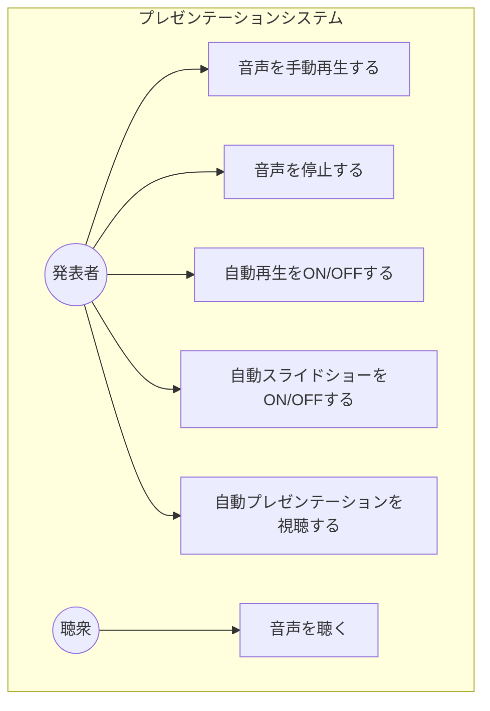
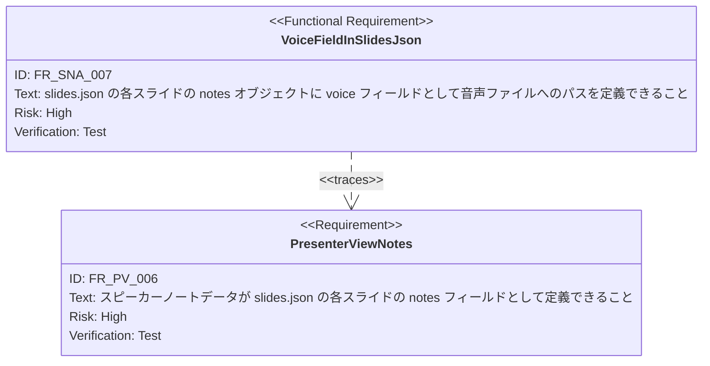

# スピーカーノート音声再生（Speaker Note Audio）要求仕様書

## 概要

本ドキュメントは、スライドのスピーカーノートに紐づく音声ファイルの再生機能の要求を定義する。slides.json の notes に voice フィールドとして音声ファイルパスを指定することで、発表者または視聴者がスピーカーアイコンを押して音声を再生できる。さらに、自動再生機能と自動スライドショー機能により、ハンズフリーでのプレゼンテーション進行を実現する。

---

# 1. 要求図の読み方

## 1.1. 要求タイプ

- **requirement**: 一般的な要求
- **functionalRequirement**: 機能要求
- **designConstraint**: 設計制約

## 1.2. リスクレベル

- **High**: 高リスク（ビジネスクリティカル、実装困難）
- **Medium**: 中リスク（重要だが代替可能）
- **Low**: 低リスク（Nice to have）

## 1.3. 検証方法

- **Test**: テストによる検証
- **Demonstration**: デモンストレーションによる検証
- **Inspection**: インスペクション（レビュー）による検証

## 1.4. 関係タイプ

- **contains**: 包含関係（親要求が子要求を含む）
- **derives**: 派生関係（要求から別の要求が導出される）
- **traces**: トレース関係（要求間の追跡可能性）

---

# 2. 要求一覧

## 2.1. ユースケース図（概要）

## 2.2. 機能一覧（テキスト形式）

- 音声再生
    - スピーカーアイコンによる手動再生
    - 音声ファイルの再生・停止
- 自動再生
    - スライド表示時に自動で音声再生を開始
    - 自動再生のON/OFF切り替え
- 自動スライドショー
    - 音声再生終了時に次のスライドへ自動遷移
    - 自動スライドショーのON/OFF切り替え
- データ定義
    - slides.json の notes.voice フィールドで音声ファイルパスを指定

---

# 3. 要求図（SysML Requirements Diagram）

## 3.1. 全体要求図

```mermaid
requirementDiagram
    requirement SpeakerNoteAudio {
        id: UR_SNA_001
        text: "スライドのスピーカーノートに紐づく音声ファイルを再生でき、自動再生および自動スライドショーによるハンズフリーのプレゼンテーション進行を実現すること"
        risk: high
        verifymethod: demonstration
    }

    functionalRequirement ManualAudioPlayback {
        id: FR_SNA_001
        text: "notes に voice フィールドが定義されているスライドで、スピーカーアイコンを押すことで音声ファイルが再生されること"
        risk: high
        verifymethod: test
    }

    functionalRequirement AudioStopControl {
        id: FR_SNA_002
        text: "再生中の音声を停止できること"
        risk: high
        verifymethod: test
    }

    functionalRequirement AutoPlayOnSlideDisplay {
        id: FR_SNA_003
        text: "自動再生機能がONの場合、スライドが表示された時に自動で音声再生が開始されること"
        risk: high
        verifymethod: test
    }

    functionalRequirement AutoPlayToggle {
        id: FR_SNA_004
        text: "自動再生機能のON/OFFをUI操作で切り替えられること"
        risk: medium
        verifymethod: demonstration
    }

    functionalRequirement AutoSlideshowOnAudioEnd {
        id: FR_SNA_005
        text: "自動スライドショー機能がONの場合、音声再生が終了した時に次のスライドへ自動で遷移すること"
        risk: high
        verifymethod: test
    }

    functionalRequirement AutoSlideshowToggle {
        id: FR_SNA_006
        text: "自動スライドショー機能のON/OFFをUI操作で切り替えられること"
        risk: medium
        verifymethod: demonstration
    }

    functionalRequirement VoiceFieldInSlidesJson {
        id: FR_SNA_007
        text: "slides.json の各スライドの notes オブジェクトに voice フィールドとして音声ファイルへのパスを定義できること"
        risk: high
        verifymethod: test
    }

    functionalRequirement SpeakerIconVisibility {
        id: FR_SNA_008
        text: "voice フィールドが定義されているスライドにのみスピーカーアイコンが表示されること"
        risk: medium
        verifymethod: test
    }

    designConstraint DataDrivenAudio {
        id: DC_SNA_001
        text: "音声ファイルパスはJSONデータ駆動で管理し、データ駆動型スライドアーキテクチャ（A-003）に準拠すること"
        risk: low
        verifymethod: inspection
    }

    designConstraint FallbackOnNoVoice {
        id: DC_SNA_002
        text: "voice 未定義時はアイコン非表示、音声読み込み失敗時はタイマーフォールバックで自動スライドショーを継続すること（A-005 準拠）"
        risk: medium
        verifymethod: test
    }

    designConstraint AudioLifecycleManagement {
        id: DC_SNA_003
        text: "音声再生のライフサイクルは useEffect で管理し、コンポーネントのアンマウント時にリソースを解放すること（T-003 準拠）"
        risk: low
        verifymethod: inspection
    }

    SpeakerNoteAudio - contains -> ManualAudioPlayback
    SpeakerNoteAudio - contains -> AudioStopControl
    SpeakerNoteAudio - contains -> AutoPlayOnSlideDisplay
    SpeakerNoteAudio - contains -> AutoPlayToggle
    SpeakerNoteAudio - contains -> AutoSlideshowOnAudioEnd
    SpeakerNoteAudio - contains -> AutoSlideshowToggle
    SpeakerNoteAudio - contains -> VoiceFieldInSlidesJson
    SpeakerNoteAudio - contains -> SpeakerIconVisibility
    SpeakerNoteAudio - contains -> DataDrivenAudio
    SpeakerNoteAudio - contains -> FallbackOnNoVoice
    SpeakerNoteAudio - contains -> AudioLifecycleManagement

    ManualAudioPlayback - derives -> VoiceFieldInSlidesJson
    AutoPlayOnSlideDisplay - derives -> ManualAudioPlayback
    AutoSlideshowOnAudioEnd - derives -> AutoPlayOnSlideDisplay
    SpeakerIconVisibility - derives -> VoiceFieldInSlidesJson
```

## 3.2. 関連PRDとのトレース

---

# 4. 要求の詳細説明

## 4.1. 機能要求

### FR-SNA-001: 手動音声再生

slides.json の notes に voice フィールドが定義されているスライドにおいて、スピーカーアイコンをクリックすることで、指定された音声ファイルの再生が開始される。スピーカーアイコンは視覚的に再生可能であることを示し、再生中は再生状態が分かるUIフィードバックを提供する。

**優先度:** Must

**検証方法:** テストによる検証

### FR-SNA-002: 音声停止

再生中の音声を停止する操作が可能であること。再生中にスピーカーアイコンを再度クリックするか、停止用のUI操作により音声を停止できる。

**優先度:** Must

**検証方法:** テストによる検証

### FR-SNA-003: 自動再生

自動再生機能がONの状態で、スライドが表示された際（スライド遷移時）に、そのスライドの notes.voice に音声ファイルが定義されていれば自動的に再生を開始する。voice フィールドが未定義のスライドでは何も行わない。

**優先度:** Must

**検証方法:** テストによる検証

### FR-SNA-004: 自動再生ON/OFF切り替え

自動再生機能のON/OFFをUI上のトグルスイッチまたはボタンで切り替えられること。デフォルトはOFF。

**優先度:** Should

**検証方法:** デモンストレーションによる検証

### FR-SNA-005: 自動スライドショー

自動スライドショー機能がONの状態で、音声再生が終了（ended イベント）した時に、自動的に次のスライドへ遷移する。最終スライドの場合は遷移を行わない。

**優先度:** Must

**検証方法:** テストによる検証

### FR-SNA-006: 自動スライドショーON/OFF切り替え

自動スライドショー機能のON/OFFをUI上のトグルスイッチまたはボタンで切り替えられること。デフォルトはOFF。

**優先度:** Should

**検証方法:** デモンストレーションによる検証

### FR-SNA-007: slides.json の voice フィールド定義

各スライドの notes オブジェクト内に voice フィールドとして音声ファイルへの相対パスを指定できる。notes オブジェクトが既に text や summary フィールドを持つ場合、voice フィールドは追加のプロパティとして共存する。

**優先度:** Must

**検証方法:** テストによる検証

### FR-SNA-008: スピーカーアイコンの条件付き表示

voice フィールドが定義されているスライドにのみスピーカーアイコンを表示する。voice フィールドが未定義または空文字列のスライドではアイコンを表示しない。

**優先度:** Should

**検証方法:** テストによる検証

## 4.2. 設計制約

### DC-SNA-001: データ駆動型音声管理

音声ファイルパスはデータ駆動型スライドアーキテクチャ（CONSTITUTION.md A-003）に従い、slides.json のデータとして定義する。音声パスのハードコードは禁止する。

### DC-SNA-002: voice 未定義時・音声読み込み失敗時のフォールバック

voice フィールドが定義されていないスライドでは、スピーカーアイコンを非表示とし、エラーを発生させない（CONSTITUTION.md A-005 準拠）。音声ファイルが見つからない場合も、プレゼンテーション全体の表示に影響を与えない。

自動スライドショー動作中に音声ファイルの読み込みに失敗した場合（voice フィールドは定義されているが、ファイルが存在しない等）、音声再生終了トリガーの代わりにタイマーベース自動スクロール（FR_AST_001）にフォールバックし、自動スライドショーの進行を継続する。

### DC-SNA-003: 音声ライフサイクル管理

音声再生に使用する Audio オブジェクトのライフサイクルは useEffect で管理し、コンポーネントのアンマウント時やスライド遷移時に再生を停止しリソースを解放する（CONSTITUTION.md T-003 準拠）。

---

# 5. 制約事項

## 5.1. 技術的制約

- TypeScript strict モードで型安全性を確保すること（T-001 準拠）
- Reveal.js の DOM 構造との互換性を維持すること（T-002 準拠）
- 音声オブジェクトのライフサイクルは useEffect で管理し、クリーンアップ時にリソースを解放すること（T-003 準拠）
- slides.json の voice フィールドはバリデーションを実施し、型安全性を保証すること（D-002 準拠）
- スピーカーアイコンおよび再生コントロールUIのスタイリングは3層モデルに従い、テーマカラーは CSS変数（`--theme-*`）経由で参照すること（A-002 準拠）
- コンポーネントは ComponentRegistry で管理し、拡張性を確保すること（A-004 準拠）

## 5.2. ビジネス的制約

- プレゼンテーションの視覚的品質と伝達力を損なわないこと（B-001 準拠）
- 音声再生UIはスライドの内容表示を妨げない位置・サイズで配置すること

---

# 6. 前提条件

- メインウィンドウでプレゼンテーションが正常に動作していること
- slides.json にスライドデータが定義されていること
- 音声ファイル（voice フィールドで指定）が public/ ディレクトリ等のアクセス可能な場所に配置されていること
- ブラウザが Web Audio API / HTML5 Audio をサポートしていること
- 既存の [presenter-view.md](./presenter-view.md) で定義された notes フィールド（FR_PV_006）が実装済みであること

---

# 7. スコープ外

以下は本PRDのスコープ外とします：

- 音声ファイルのアップロード・管理機能
- 音声の録音機能
- 音量調整UI
- 音声の再生速度変更
- 音声のシーク（特定位置への移動）機能
- 複数音声の同時再生
- 発表者ビューウィンドウでの音声再生コントロール（発表者ビュー固有のUI）

---

# 8. 用語集

| 用語 | 定義 |
|------|------|
| スピーカーアイコン（Speaker Icon） | 音声再生が可能なスライドに表示されるUI要素。クリックで音声の再生/停止を行う |
| 自動再生（Auto Play） | スライド表示時に自動で音声再生を開始する機能 |
| 自動スライドショー（Auto Slideshow） | 音声再生終了時に自動で次のスライドへ遷移する機能 |
| voice フィールド | slides.json の notes オブジェクト内で音声ファイルパスを指定するプロパティ |
| notes オブジェクト | slides.json の各スライドに付与されるスピーカーノート情報のオブジェクト |
