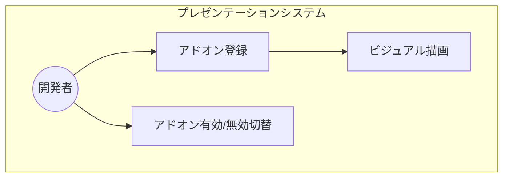
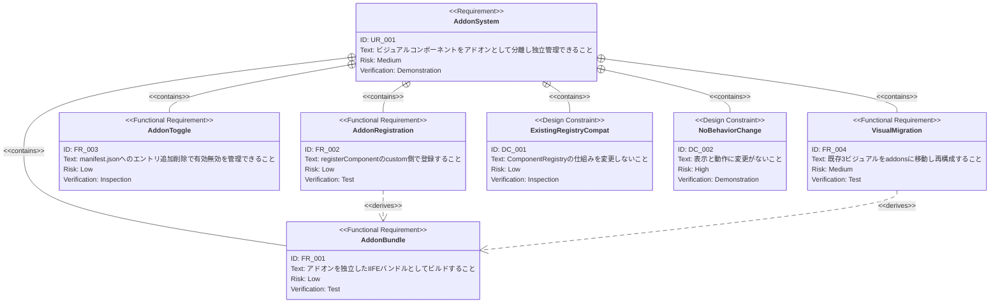

# ビジュアルコンポーネントのアドオン化 要求仕様書

## 概要

`src/visuals/` 配下のビジュアルコンポーネント（VibeCodingDemo, HierarchyFlowVisual,
PersistenceVisual）を「アドオン」として本体コードから分離し、独立したモジュールとして管理可能にする。これにより、プレゼンテーション本体の変更なしにビジュアル要素の追加・削除が可能となり、拡張性と保守性を向上させる。

## 背景・目的

### 現状の課題

ビジュアルコンポーネントは `src/visuals/` に配置され、`registerDefaults.tsx` で本体のデフォルトコンポーネントとして登録されている。これらは
AI-SDD デモ用の特化コンポーネントであり、本体の汎用コンポーネント（TerminalAnimation、MUI
アイコン等）とは性質が異なるが、同じ登録経路で管理されている。この結合により、特定のビジュアル要素の追加・削除が本体コードの変更を伴う。

### ビジネス価値

- **カスタマイズ性向上**: 特定の聴衆や用途に応じてビジュアルセットを選択可能にする
- **保守性の向上**: ビジュアル要素の変更が本体コードに影響しない
- **拡張性の向上**: 新しいビジュアルアドオンの追加が manifest.json へのエントリ追加で完結する

---

# 1. 要求図の読み方

## 1.1. 要求タイプ

- **requirement**: 一般的な要求
- **functionalRequirement**: 機能要求
- **designConstraint**: 設計制約

## 1.2. リスクレベル

- **High**: 高リスク（ビジネスクリティカル、実装困難）
- **Medium**: 中リスク（重要だが代替可能）
- **Low**: 低リスク（Nice to have）

## 1.3. 検証方法

- **Test**: テストによる検証
- **Inspection**: インスペクション（レビュー）による検証
- **Demonstration**: デモンストレーションによる検証

## 1.4. 関係タイプ

- **contains**: 包含関係（親要求が子要求を含む）
- **derives**: 派生関係（要求から別の要求が導出される）

---

# 2. 要求一覧

## 2.1. ユースケース図（概要）

## 2.2. 機能一覧（テキスト形式）

- アドオン定義
    - 独立した IIFE バンドルとしてアドオンをパッケージ化
    - アドオン単位でのコンポーネントグループ化
- アドオン登録
    - ComponentRegistry の custom 側への動的登録
    - `window.__ADDON_REGISTER__` グローバルコールバックによる起動時登録
- アドオン管理
    - manifest.json による有効アドオンの宣言的管理
    - 動的スクリプトロードによるアドオンの読み込み

---

# 3. 要求図（SysML Requirements Diagram）

## 3.1. 全体要求図

---

# 4. 要求の詳細説明

## 4.1. ユーザ要求

### UR-001: ビジュアルコンポーネントのアドオン化

開発者がビジュアルコンポーネントをプレゼンテーション本体から独立して管理でき、アドオンの追加・削除がシンプルな操作（manifest.json の変更）で完結すること。

**検証方法:** デモンストレーションによる検証

## 4.2. 機能要求

### FR-001: アドオンの独立バンドル化

**優先度**: Must

アドオンは独立した IIFE バンドルとしてビルドされ、以下の構造を持つ：

- アドオン名（name）
- 提供するコンポーネント一覧 — 各コンポーネントは登録名と React コンポーネントのペア
- 独立したビルド設定（vite.config.ts）による自己完結型バンドル

**検証方法:** テスト（ビルド成功・型チェック）による検証

### FR-002: ComponentRegistry への登録

**優先度**: Must

アドオンが提供するコンポーネントは、既存の ComponentRegistry の `registerComponent`（custom側）を使用して登録される。これにより、アドオンのコンポーネントはデフォルトコンポーネントを上書き可能となる。

**検証方法:** テストによる検証
### FR-003: manifest.json による有効/無効管理

**優先度**: Must

`manifest.json` で有効なアドオンの一覧を宣言的に管理し、アドオンの有効/無効は該当するエントリの追加/削除で切り替え可能とする。ホストアプリは起動時に manifest.json を fetch し、記載されたバンドルを動的にロードする。

**検証方法:** コードレビュー（インスペクション）による検証

### FR-004: 既存ビジュアルの移動

**優先度**: Must

以下の3つのビジュアルコンポーネントを `src/visuals/` から `addons/src/ai-sdd-visuals/` に移動し、独立バンドルとして再構成する：

- VibeCodingDemo
- HierarchyFlowVisual
- PersistenceVisual

**検証方法:** テスト（既存テストの通過）による検証

## 4.3. 非機能要求

### NFR-001: ビルドサイズへの影響

**優先度**: Should

アドオン化によるプロダクションビルドサイズの増加は最小限（ファイル分割による overhead 程度）に抑えること。

**検証方法:** テスト（ビルド前後のサイズ比較）による検証

### NFR-002: 開発者体験

**優先度**: Must

アドオンの追加・削除は manifest.json のエントリ変更のみで完結し、ホストアプリのソースコード修正を必要としないこと。

**検証方法:** インスペクション（コードレビュー）による検証

## 4.4. 設計制約

### DC-001: ComponentRegistry 互換性

既存の ComponentRegistry の仕組み（default/custom の二層構造、resolveComponent の優先順位）は変更しない。アドオンは
custom側の登録 API を利用する。

**検証方法:** コードレビューによる検証

### DC-002: 表示・動作の無変更

アドオン化はアーキテクチャの変更であり、プレゼンテーションの表示・動作に影響を与えてはならない。すべてのスライドが既存と同一の表示結果となること。

**検証方法:** デモンストレーション（目視確認）による検証

---

# 5. 制約事項

## 5.1. 技術的制約

- 既存の ComponentRegistry のインターフェースを維持する（A-001: コンポーネント分離）
- TypeScript strict mode での型安全性を確保する（T-001）
- Reveal.js との互換性を維持する（T-002）

## 5.2. ビジネス的制約

- プレゼンテーションの表示品質に影響を与えない（B-001）

---

# 6. 前提条件

- ComponentRegistry が default/custom の二層構造で動作していること
- 移動対象のビジュアルコンポーネントが他のコンポーネントから直接 import されていないこと（レジストリ経由でのみ使用）
- Vite によるビルド環境が利用可能であること

---

# 7. スコープ外

以下は本PRDのスコープ外とします：

- TerminalAnimation のアドオン化（本体のデフォルトコンポーネントとして残す）
- MUI アイコンのアドオン化
- アドオンのバージョン管理・依存関係解決
- アドオンのホットリロード（開発中はビルド後にリロードが必要）

---

# 8. 用語集

| 用語                     | 定義                                                               |
|------------------------|------------------------------------------------------------------|
| アドオン（Addon）            | プレゼンテーション本体から独立した IIFE バンドルとしてパッケージされたコンポーネント群      |
| IIFE バンドル              | 即時実行関数式（Immediately Invoked Function Expression）形式の JavaScript バンドル |
| manifest.json          | 有効なアドオンの一覧とバンドルパスを定義する設定ファイル                          |
| addon-bridge           | ホストアプリとアドオン間の接続を担うグローバル登録インターフェース                     |
| `__ADDON_REGISTER__`   | アドオンがコンポーネントを登録するためのグローバルコールバック関数                     |
| ComponentRegistry      | コンポーネント名から実コンポーネントを解決するレジストリ機構                        |
| default コンポーネント        | registerDefaults.tsx で登録される標準コンポーネント                          |
| custom コンポーネント         | アドオン経由で登録され、default を上書き可能なコンポーネント                      |
