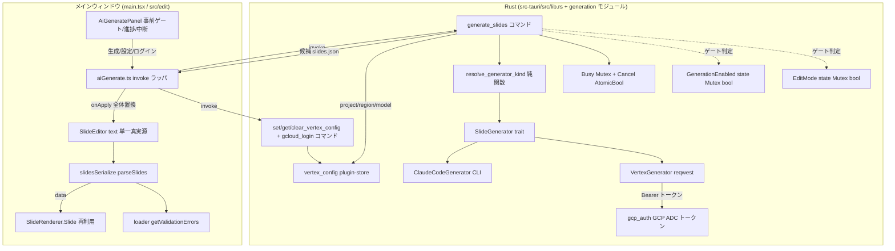

# AI スライド生成機能（内蔵生成）

**ドキュメント種別:** 技術設計書 (Design Doc)
**SDDフェーズ:** Plan (計画/設計)
**最終更新日:** 2026-08-28
**関連 Spec:** [ai-slide-generation_spec.md](./ai-slide-generation_spec.md)
**関連 PRD:** [ai-slide-generation.md](../requirement/ai-slide-generation.md)

---

# 1. 実装ステータス

**ステータス:** ✅ 実装済み（Issue #14・ブランチ `feature/ai-slide-generation-impl`）。器（#13 [slide-edit-mode_design.md](./slide-edit-mode_design.md)）の上に生成・ネットワーク・GCP 認証の各層を新設した。内蔵生成は **Vertex AI（GCP ADC）** 直。全ゲート green（`cargo test`/`clippy -D warnings`/`fmt` ・ `npm run typecheck`/`test`/`format:check`/`build`）。実機 macOS の手動検証（GCP ログイン→project/region/model 設定→Vertex 生成疎通・トークン非露出・ゲート）は完了条件に残る（tasks 4.5）。後続で `promptIntent`（#302）・`themeConstraints`（#211）・`visualWarnings`/`themeWarnings`（見た目チェック機能・§9.1参照）を`GenerateRequest`に追加したが、本ドキュメントは§10 v0.7まで反映が漏れていた。

## 1.1. 実装進捗

| モジュール/機能 | ステータス | 備考 |
|----------|--------|------|
| 生成器抽象（`SlideGenerator` trait ＋ enum ＋ resolve/factory ＋ Mock） | ✅ | FR-002。ticketvc `llm_backend.rs` パターンを流用 |
| 内蔵生成（Vertex AI 直・reqwest） | ✅ | FR-003。`Authorization: Bearer`（ADC）＋body `anthropic_version:"vertex-2023-10-16"`・model は URL 側・with_retry |
| 外部生成（Claude Code CLI） | ✅ | FR-002。`claude --print --output-format json --strict-mcp-config` を spawn（ticketvc `claude_cli/llm_client.rs` 流用） |
| GCP 認証（ADC）＋Vertex 設定保管（plugin-store） | ✅ | FR-006。トークンは ADC から都度取得・55 分キャッシュ・WebView 非開放。project/region/model は非秘密で plugin-store 保存 |
| 生成/network/キー操作の Rust ゲート（EditMode＋生成有効） | ✅ | FR-009/DC-003。#13 `EditMode(Mutex<bool>)` 拡張 |
| 取り込み検証＋自動修正ループ | ✅ | FR-005。`getValidationErrors`＋上限 N＋最良候補退避 |
| 器への流し込み（`SlideEditor` text 受け口） | ✅ | FR-004/DC-004。現状 `text` は useState 初期化のみ→外部注入の受け口追加 |
| 生成パネル UI（`AiGeneratePanel`・事前ゲート・進捗・中断） | ✅ | FR-001/007/010。editorUiTheme・`--theme-*` |
| 進捗イベント＋中断＋同時実行1件 | ✅ | FR-010。Tauri event＋`AtomicBool`＋`Mutex` busy |
| i18n（`aiGenerate.*`） | ✅ | ja/en/fr の生成 UI 文言。方式別の課金/オンライン依存注意書き（`aiGenerate.billingNoticeBuiltin` / `.billingNoticeExternal`。i18n の `t()` が 2 階層までのため平坦キー）を含む（PRD §5.2） |
| プロンプト意味論の明示（`promptIntent`） | ✅ | #302。`prompt`が新規内容か変更指示かをUIで選択させ`user_prompt()`が明示ラベルを付与（本ドキュメント§10 v0.7で反映） |
| 意匠制約プロンプト（`themeConstraints`/`buildThemeConstraintsPrompt`） | ✅ | #211。適用中テーマ・登録済みコンポーネント/アイコン名・書体をsystem prompt末尾に追記（本ドキュメント§10 v0.7で反映） |
| 見た目チェック警告の別レール送信＋逸脱防止ガードレール（`visualWarnings`/`themeWarnings`） | ✅ | 「見た目をチェックして修正」ボタン専用（[ai-visual-check-and-fix_design.md](./ai-visual-check-and-fix_design.md) v0.4）。`repairFeedback`とは別フィールドで警告種別を保ち、Rust`user_prompt()`が種別ごとの指示文＋ガードレールを生成（本ドキュメント§9.1/§10 v0.7で反映） |

---

# 2. 設計目標

1. **生成能力の追加と読み取り中心の安全性の両立** — ネットワーク通信と GCP 認証（ADC トークン）を、編集モード かつ 生成有効時のみ有効化し、通信実行とトークン取得をネイティブ（Rust）境界に閉じる。ビューワーの capability 分離（#13）をネットワーク・認証の領域へ拡張する（DC-002/DC-003/NFR-003）。
2. **生成器の差し替え可能性** — 内蔵（Vertex AI 直）と外部（Claude Code CLI）を同一契約（プロンプト → `slides.json` 候補）で差し替える。抽象の切れ目を「生成器単位」に置き、外部の完結エージェントも契約を満たせるようにする（FR-002）。
3. **誤生成の無自覚な保存の構造的防止** — 生成器は永続化せず候補を返すのみとし、公開 `slides.json` への反映は検証（自動修正含む）と利用者の明示確定を経る（DC-004/FR-005）。
4. **器の完全再利用** — 生成結果のプレビュー・編集・保存・書き出しは #13 の器（`SlideEditor` の単一真実源・無損失往復・Rust 書き込みコマンド）をそのまま再利用し、再実装しない（DC-001/NFR-002）。
5. **過剰設計の回避** — 参照実装 ticketvc の重量級フロント構成（4層 Clean Architecture＋DI＋RxJS＋MVVM）は移植せず、本アプリの軽量 React+hooks 構成に合わせる。取り込むのは Rust 側の抽象・境界パターンに絞る（CONSTITUTION「シンプルさ」）。
6. **リグレッションゼロ** — View（発表本番）・「開く」・発表者ビュー・編集モードの既存挙動を変えない（NFR-001）。

---

# 3. 技術スタック

**なぜその技術を選んだのか**の判断根拠を残す。

| 領域 | 採用技術 | 選定理由 |
|------|------|------|
| HTTP クライアント（内蔵生成） | Rust `reqwest`（`rustls-tls` / `json` / `stream`） | トークンを WebView に出さず Vertex AI rawPredict を直接叩ける（DC-002/NFR-003）。GCP トークン交換（form POST）も同一クライアントで実施。`Cargo.lock` に既存でビルドコスト小。ticketvc も全 LLM 通信を Rust `reqwest` に集約 |
| 非同期ランタイム | `tokio`（`reqwest` 依存） | `reqwest` の async 実行。Tauri の `async` コマンドと統合 |
| GCP 認証（トークン取得） | ADC ファイル読取＋`refresh_token` グラント（GCP 認証クレット不使用・`reqwest` のみ） | `gcloud auth application-default login`（初回のみ）が生成する ADC を読み `oauth2.googleapis.com/token` で access_token を得る。トークンは 55 分キャッシュしディスク保存せず WebView にも出さない（NFR-003）。ticketvc `gcp_auth.rs` と同方式（GCP SDK 追加不要） |
| Vertex 設定保管 | plugin-store（`ai-vertex-config.json`・平文） | project_id/region/model は秘密でないため平文で十分。keyring/secrecy は不要（内蔵の秘密＝短命トークンはメモリキャッシュのみ） |
| 生成器抽象 | trait ＋ 閉じた enum ＋ resolve 純関数 ＋ factory ＋ Mock | 内蔵/外部を同一契約 `Box<dyn SlideGenerator>` で差し替え、テスト時に Mock を注入する（FR-002）。開放的プラグイン機構ではなく閉じた列挙で十分（ticketvc `llm_backend.rs` の `AiBackendKind`＋`resolve_backend_from`＋`create_*` パターン） |
| 外部生成 | ローカル `claude` CLI サブプロセス（`--print --output-format json --strict-mcp-config`） | 外部は完結エージェント。生 Messages を渡さず結果 JSON を受け取る（ticketvc `claude_cli/llm_client.rs` 流用：一時 cwd で spawn・タイムアウト安全弁・`is_error` 判定） |
| 生成結果検証 | 既存 `loader.ts` `getValidationErrors`（構造化 `ValidationError`） | D-002（バリデーション駆動）。既存検証資産を再利用（FR-005） |
| 生成結果の取り込み | 既存 `slidesSerialize.parseSlides` / `SlideEditor` の `text` 単一真実源（#13） | 無損失往復（NFR-002）。生成 JSON をそのまま器へ流し込み、以降の調整は器の手動編集（DC-001） |
| リトライ／エラー整形 | `with_retry`（429/529 指数バックオフ）＋ エラーボディ切詰め＋ `tools` 空時 `tool_choice` 省略 | 一時的失敗に強く、UI へ内部情報を漏らさない（NFR-005・FR-008）。ticketvc `anthropic_client.rs` の実績パターン |
| 生成 UI | 編集モード内パネル（React / MUI・`editorUiTheme`） | 器と同じ固定 UI テーマに載せ、色は `--theme-*` 経由（A-002/DC-006）。フロントは軽量 hooks 構成を維持（ticketvc の 4層/RxJS/MVVM は移植しない） |
| 進捗・中断・同時実行制御 | JS 進捗コールバック（Tauri event 非使用・T-003）＋ `CancelToken`（`Arc<AtomicBool>`＋`cancelled()` を `tokio::select!` で in-flight と競合させドロップ中断）＋ `Mutex` busy | 長時間の生成を非ブロッキングで進捗通知・中断し、同時実行を 1 件に制限（FR-010）。進捗は JS オーケストレータ内で完結（購読ライフサイクル不要）。ticketvc `AppState`（cancel_flag＋busy_lock）相当 |
| モデル | Vertex のモデル ID（`@date` 付き。例 `claude-sonnet-4-5@20250929`）を利用者設定 | Vertex は publisher モデルを `@date` 版で指定するため、project/region と同じく利用者がパネルで設定する（既定固定は置かない・FR-003） |

---

# 4. アーキテクチャ

## 4.1. システム構成図



自動修正ループ（FR-005）は **JS（`aiGenerate.ts`）が駆動**する: `generate_slides`（Rust・候補 1 件）を呼ぶ → `parseSlides` / `getValidationErrors`（JS・検証の単一真実源）で検証 → 不正なら検証エラー要約を次の `GenerateRequest.repairFeedback` に載せて再度 `generate_slides` を呼ぶ、を上限 N 回。これにより検証規則を JS に一元化（D-002）し、Rust は「生成器で候補を 1 件返す」責務に限定する（§9.1 の決定事項）。

## 4.2. モジュール分割

| モジュール名 | 責務 | 依存関係 | 配置場所 |
|--------|------|------|------|
| `AiGeneratePanel` | 生成パネル UI。プロンプト入力・方式選択・事前ゲート・進捗・中断・方式別の課金/オンライン依存注意書き表示（PRD §5.2） | `aiGenerate`, `SlideEditor`(注入) | `src/edit/AiGeneratePanel.tsx`（新規） |
| `aiGenerate` | 生成・キー管理コマンドの呼び出し口。**自動修正ループの駆動（`generate_slides` を上限 N 回呼ぶ）・`getValidationErrors` 検証・`GenerateResult` 組立**・進捗通知 | `@tauri-apps/api/core`, `loader`, `slidesSerialize` | `src/aiGenerate.ts`（新規） |
| `SlideEditor` | 生成結果を単一真実源 `text` へ流し込む受け口を追加（外部注入経路） | `slidesSerialize`, `AiGeneratePanel` | `src/edit/SlideEditor.tsx`（改修） |
| `slidesSerialize` | 生成 JSON の無損失パース・取り込み | `types`, `loader` | `src/edit/slidesSerialize.ts`（**再利用**） |
| `loader` | 生成結果の取り込み前バリデーション | なし | `src/data/loader.ts`（**再利用**） |
| `generation`（Rust） | 生成器 trait・enum・`resolve_generator_kind`・factory（候補 1 件生成に限定。自動修正ループは JS 側 `aiGenerate` が駆動する） | `reqwest`, `tokio`, `serde_json` | `src-tauri/src/generation/mod.rs`（新規） |
| `VertexGenerator`（Rust） | Vertex AI rawPredict 呼び出し（reqwest・Bearer/ADC・retry・エラー整形） | `reqwest`, `gcp_auth` | `src-tauri/src/generation/vertex.rs`（新規） |
| `gcp_auth`（Rust） | GCP ADC トークン取得（ADC 読取→refresh_token grant→55 分キャッシュ）。crate 内部限定 | `reqwest`, `tokio` | `src-tauri/src/generation/gcp_auth.rs`（新規） |
| `ClaudeCodeGenerator`（Rust） | 外部 `claude` CLI サブプロセス実行 | `std::process`, `tokio` | `src-tauri/src/generation/claude_cli.rs`（新規） |
| `vertex_config`（Rust） | Vertex 設定（project/region/model）の plugin-store 保管・取得・状態・削除（非秘密・平文） | `tauri-plugin-store`, `serde` | `src-tauri/src/vertex_config.rs`（新規） |
| `lib.rs` | `GenerationEnabled` state・`generate_slides`・`cancel_generation`・Vertex 設定/ログインコマンド登録・ゲート | `generation`, `vertex_config`, `EditMode` | `src-tauri/src/lib.rs`（改修） |

> #13 が確立した `EditMode(Mutex<bool>)`・`set_edit_mode`・書き込みコマンドの単一境界パターンを踏襲し、本 Feature は `GenerationEnabled` state・生成/Vertex 設定コマンドを同じ `invoke_handler` に追加する。フロント側 `aiGenerate.ts` は `editModeSave.ts` と同じ invoke ラッパ規約（camelCase→snake_case・編集モード前提）に従う。

---

# 5. データモデル

`slides.json` のデータ構造（`PresentationData` / `SlideData` / `SlideContent` 等）は既存 `src/data/types.ts` をそのまま用い、**生成のための新規スライドデータ型は追加しない**（DC-001 器・レンダラの再利用／DC-005 全体置換・生成結果は既存構造の `slides.json` 文字列）。本 Feature が追加するのは生成の契約型とゲート state。**Rust ⇔ TS のワイヤーフォーマットは serde 属性で明示変換する**（Tauri `invoke` の既定は Rust 表記のままシリアライズされ、属性なしだと TS 契約と実行時に不一致になるため）。

```rust
// src-tauri/src/generation/mod.rs — 生成器抽象（ticketvc llm_backend パターン）
// serde 変換: struct は camelCase、enum は kebab-case 文字列（TS 契約 spec §4.1 と一致）
#[derive(serde::Serialize, serde::Deserialize)]
#[serde(rename_all = "camelCase")]
pub struct GenerateRequest {
    pub prompt: String,
    pub kind: SlideGeneratorKind,
    pub base_slides: Option<String>,        // 編集起点時の現行 slides.json（NFR-004 の送出対象に限定）
    pub repair_feedback: Option<String>,    // 自動修正の再試行時に JS が積む検証エラー要約（FR-005）
    // v1.1（#302）: prompt が新規内容か変更指示かの明示。未指定は後方互換のためラベルなし
    pub prompt_intent: Option<PromptIntent>,
    // v1.1（#211）: JS 側 buildThemeConstraintsPrompt が組み立てる意匠制約テキスト。system prompt 末尾に追記
    pub theme_constraints: Option<String>,
    // v1.2（見た目チェック機能）: DOM実測警告／テーマ静的検証警告。repair_feedbackとは別レール（§9.1参照）
    pub visual_warnings: Option<Vec<String>>,
    pub theme_warnings: Option<Vec<String>>,
}

// TS 側は同一ワイヤー値（'builtin-vertex' / 'external-claude-code'）を GeneratorKind として定義（spec §4.1）。
// Rust 側は内部型を明確化するため SlideGeneratorKind と命名するが、kebab-case 文字列は一致する。
#[derive(serde::Serialize, serde::Deserialize, Clone, Copy, PartialEq)]
#[serde(rename_all = "kebab-case")]
pub enum SlideGeneratorKind { BuiltinVertex, ExternalClaudeCode }

// v1.1（#302）: TS 側は同一ワイヤー値（'new-content' / 'change-instruction'）を PromptIntent として定義
#[derive(serde::Serialize, serde::Deserialize, Clone, Copy, PartialEq)]
#[serde(rename_all = "kebab-case")]
pub enum PromptIntent { NewContent, ChangeInstruction }

// 生成器は「プロンプト → slides.json 候補 1 件」の単一契約（生成器単位で抽象化）。
// 検証・自動修正ループ・outcome 判定は JS 側（aiGenerate.ts）が駆動する（§9.1 の決定事項）。
// このため GenerateOutcome / GenerateResult は Rust には置かず TS 側の型とする。
#[async_trait::async_trait]
pub trait SlideGenerator: Send + Sync {
    async fn generate(&self, req: &GenerateRequest, cancel: &CancelToken) -> Result<String, GenerateError>;
}

// 解決（純関数・単体テスト対象）: dev override（env・untyped）→ UI/設定の型付き選択 fallback
pub fn resolve_generator_kind(env_override: Option<&str>, fallback: SlideGeneratorKind) -> SlideGeneratorKind;
// factory: 内蔵は VertexConfig を受け取り（未設定は NotConfigured）、外部は設定不要。トークンは各生成器が実行時に取得
pub fn create_generator(kind: SlideGeneratorKind, vertex_config: Option<VertexConfig>) -> Result<Box<dyn SlideGenerator>, GenerateError>;
```

```rust
// src-tauri/src/vertex_config.rs — Vertex 設定（project/region/model・非秘密・plugin-store 平文）
// project/region/model は秘密でないため keyring は使わない。内蔵の秘密＝GCP アクセストークンは gcp_auth が
// ADC から都度取得し 55 分キャッシュする（ディスク保存せず・WebView 非開放）。vertex_status は生値を返さない。
#[derive(serde::Serialize, serde::Deserialize, Clone, Default)]
#[serde(rename_all = "camelCase")]
pub struct VertexConfig { pub project_id: String, pub region: String, pub model: String }  // is_complete()=3 項目充足
#[derive(serde::Serialize)]
pub struct VertexStatus { pub configured: bool }  // 3 項目充足のみを返す（事前ゲート用・生値なし）
pub fn set_vertex_config(app, config: VertexConfig) -> Result<(), String>;   // 検証（3 項目必須）→ plugin-store 保存
pub fn get_vertex_config(app) -> Result<Option<VertexConfig>, String>;        // フォームのプリフィル・生成実行で使用
pub fn vertex_status(app) -> Result<VertexStatus, String>;                    // configured のみ
pub fn clear_vertex_config(app) -> Result<(), String>;

// src-tauri/src/generation/gcp_auth.rs — GCP ADC トークン取得（crate 内部限定・生値非開放）
// ADC は authorized_user 型のみ対応。GOOGLE_APPLICATION_CREDENTIALS が service_account 鍵を指す場合は
// 汎用 serde エラーにせず「SA 鍵は未対応・gcloud login か env 解除を」の明確な文言で弾く（type 先読み）。
pub(crate) async fn get_access_token(client: &reqwest::Client) -> Result<String, String>; // 55 分キャッシュ。Vertex の Bearer 付与にのみ使用
pub(crate) async fn invalidate_token_cache();  // 再ログイン後・401 検出時にキャッシュ破棄（旧/失効トークンの 55 分居座りを防ぐ）
```

```typescript
// src/aiGenerate.ts — 生成・Vertex 設定の invoke ラッパ＆オーケストレータ（型は spec §4.1 と一致）
export type GeneratorKind = 'builtin-vertex' | 'external-claude-code'
export type PromptIntent = 'new-content' | 'change-instruction'  // v1.1（#302）
export interface GenerateRequest {
  prompt: string
  kind: GeneratorKind
  baseSlides?: string
  repairFeedback?: string
  visualWarnings?: string[]   // v1.2。DOM実測警告（見た目チェック機能専用。repairFeedbackとは別レール）
  themeWarnings?: string[]    // v1.2。テーマ静的検証警告（同上）
  promptIntent?: PromptIntent // v1.1（#302）
}
export type GenerateOutcome = 'succeeded' | 'exhausted' | 'cancelled' | 'failed'
// GenerateResult は JS オーケストレータ generateSlides() が組み立てる（Rust の generate_slides は候補 1 件を返すのみ）
export interface GenerateResult { outcome: GenerateOutcome; slidesJson: string | null; validationErrors: ValidationError[]; attempts: number }
export interface GenerateProgress { attempt: number; maxAttempts: number; phase: 'generating' | 'validating' | 'repairing' }
export interface VertexConfig { projectId: string; region: string; model: string }
export interface VertexStatus { configured: boolean }
```

---

# 6. インターフェース定義

```rust
// src-tauri/src/lib.rs（改修）— 生成有効フラグと生成/キー管理コマンド
struct GenerationEnabled(std::sync::Mutex<bool>);          // 既定 false
struct GenerationBusy(std::sync::Mutex<bool>);             // 同時実行 1 件（FR-010）
// キャンセルは実行中トークン（AtomicBool）。cancel_generation は in-flight の HTTP（reqwest abort）/
// サブプロセス（child kill）を中断する。次の自動修正試行の開始は JS が制御するため Rust 側ループ中断は不要

#[tauri::command] fn set_generation_enabled(state: State<GenerationEnabled>, enabled: bool);  // 編集モード必須
// generate_slides / cancel_generation は関数冒頭で「編集モード かつ 生成有効」を検査してから
// GCP トークン取得・network に到達する（DC-003 / NFR-003）
#[tauri::command] async fn generate_slides(/* states */, request: GenerateRequest) -> Result<String, String>;  // 候補 1 件（検証/ループは JS）
#[tauri::command] fn cancel_generation(/* cancel token */) -> Result<(), String>;
// Vertex 設定は編集モード必須（非秘密・plugin-store）。get_vertex_status/get_vertex_config は状態/設定のみ返し
// トークンに触れないため、生成無効でも事前ゲート表示のために呼べる（NFR-003 と両立）
#[tauri::command] fn set_vertex_config(/* states */, config: VertexConfig) -> Result<(), String>;
#[tauri::command] fn clear_vertex_config(/* states */) -> Result<(), String>;
#[tauri::command] fn get_vertex_config(/* states */) -> Result<Option<VertexConfig>, String>;  // フォームのプリフィル
#[tauri::command] fn get_vertex_status(/* states */) -> Result<VertexStatus, String>;          // configured のみ
#[tauri::command] async fn gcloud_login(/* states */) -> Result<(), String>;  // `gcloud auth application-default login`（初回のみ・編集モード必須）。成功時にトークンキャッシュを破棄し再ログインを即時反映
```

```typescript
// src/aiGenerate.ts（新規）
// generateSlides はオーケストレータ: generate_slides（Rust・候補 1 件）を上限 N 回呼び、
// parseSlides / getValidationErrors で検証・自動修正して GenerateResult を組み立てる（FR-005）。
// onProgress は JS 内で試行/フェーズ遷移時に呼ぶ（Tauri event を張らないため購読ライフサイクル不要）。
// generate_slides / cancelGenerate は編集モード かつ 生成有効時のみ成功（Rust 側ゲート）。
export async function setGenerationEnabled(enabled: boolean): Promise<void>
export async function generateSlides(request: GenerateRequest, onProgress?: (p: GenerateProgress) => void): Promise<GenerateResult>
export async function cancelGenerate(): Promise<void>
// Vertex 設定は編集モードで可（生成有効は不要・セットアップ手順）。getVertexStatus/getVertexConfig は状態/設定のみ取得（事前ゲート用）
export async function setVertexConfig(config: VertexConfig): Promise<void>
export async function clearVertexConfig(): Promise<void>
export async function getVertexConfig(): Promise<VertexConfig | null>       // フォームのプリフィル
export async function getVertexStatus(): Promise<VertexStatus>              // configured のみ
export async function gcloudLogin(): Promise<void>                          // GCP ADC ログイン（初回のみ）

// src/edit/SlideEditor.tsx（改修）— 生成結果を単一真実源へ流し込む受け口
// applyGeneratedSlides(json) は即時置換せず差分確認ダイアログ（GeneratedDiffDialog・構造サマリ）へ候補を渡し、
// [適用する]で prettyPrintJson（2スペース整形）して text へ全体置換、[キャンセル]で破棄（器に触れない・FR-008）。
```

Vertex 内蔵呼び出し（`VertexGenerator`・Rust reqwest）: `Authorization: Bearer <gcp_auth の ADC トークン>` ＋ `content-type: application/json`。エンドポイントは `POST https://{region-or-global}-aiplatform.googleapis.com/v1/projects/{project}/locations/{region}/publishers/anthropic/models/{model}:rawPredict`（`global` はホスト名を分岐）、body に `anthropic_version:"vertex-2023-10-16"`・`max_tokens`・`system`・`messages`（`model` は URL 側で body には入れない）。長い出力に備えストリーミング採否は §9.2。認証は API キーではなく GCP ADC（Bearer）で、ticketvc の Vertex 経路と同方式（§9.1）。

HTTP エラー分類は原因に対応させ、UI の案内が誤誘導にならないようにする: **401（UNAUTHENTICATED）** はトークン失効としてキャッシュを破棄し「`gcloud auth application-default login` を再実行」文言（`Credential`）で返す。**403（PERMISSION_DENIED）** は再ログインでは直らない（Vertex AI API 未有効化・IAM 権限不足・Model Garden のモデル未有効化など）ため、401 と区別して切詰めた診断ボディ付き `Api` エラーで返す（原因はボディに含まれる）。429/529 のみ指数バックオフでリトライする（NFR-005）。

---

# 7. 非機能要件実現方針

| 要件 | 実現方針 |
|------|------|
| NFR-001（互換性・リグレッションなし） | 生成は編集モード内の追加パネルとして実装し、View／発表者ビュー／既存編集フローの分岐を変更しない。既存 `EditMode` ゲートに `GenerationEnabled` を **追加**（既存コマンドの挙動は不変）。`npm run test`／`typecheck`／`cargo test`／`clippy -D warnings`／`fmt --check` を green 維持 |
| NFR-002（無損失取り込み） | 生成結果は `slidesSerialize.parseSlides` で取り込み、`SlideEditor` の単一真実源 `text` に載せる。以降の往復は #13 の無損失シリアライズをそのまま通す（新規シリアライザを作らない） |
| NFR-003（最小権限） | ネットワーク・GCP トークン取得を Rust の `generation`／`gcp_auth` モジュールに閉じる。`capabilities` に `http`／`fetch`／秘密系の JS 権限を追加しない（`reqwest` は CSP を通らないため CSP 変更も不要）。トークン生値を返す JS コマンドを作らない（`get_vertex_status`/`get_vertex_config` は状態/非秘密設定のみ） |
| NFR-004（機密最小化） | Vertex へ送る body はプロンプト・スキーマ／テンプレート・（編集起点時の）`base_slides`・（自動修正時の）`repair_feedback` のみで構築する純関数（`build_request_body`）に集約し、任意ローカルファイル・他パッケージを混入させない。送出内容の単体テストで body に `authorization`/`bearer` が構造的に含まれないことを検証。GCP アクセストークンは body には入れず `Authorization: Bearer` ヘッダにのみ付与する（`gcp_auth` が ADC から取得・生値は WebView 非開放） |
| NFR-005（コスト境界） | `generate_slides`（Rust・候補 1 件）に応答タイムアウト **120 秒（暫定確定・実測見直し可）** を設定。自動修正ループの上限 **N=3（暫定確定）** を JS（`aiGenerate.ts`）で定数化。`with_retry` は 429/529 のみ指数バックオフ（無制限リトライを避ける） |
| T-003（外部連携ライフサイクル） | 生成の進捗通知は JS オーケストレータ内のコールバックで完結させ Tauri event 購読を張らない。将来 Tauri `listen`（逐次ストリーミング等）を導入する場合は `usePresenterView` と同様に `useEffect` 内で登録し、返り値の unsubscribe をクリーンアップで解除する |

---

# 8. テスト戦略

| テストレベル | 対象 | カバレッジ目標 |
|--------|------|---------|
| Rust 単体 | `resolve_generator_kind`（純関数・env/設定/既定の分岐）、ゲート（編集モード・生成有効の true/false で許可/拒否）、自動修正ループ（Mock 生成器で succeeded/exhausted/cancelled/failed の各 outcome）、`vertex_config`（status 判定・camelCase 直列化）、`gcp_auth`（ADC パース・authorized_user 検証・service_account 拒否文言・パス解決）、`vertex`（URL の global 分岐・body 形状・model が URL 側）、送出 body 構築（機密最小化：トークン/認証情報が含まれない） | 分岐網羅・ゲートは true/false 双方を直接検証（#13 の純粋関数テスト方針を踏襲） |
| JS 単体（Vitest） | `AiGeneratePanel` の事前ゲート（Vertex 未設定で生成無効）、`aiGenerate` の invoke 引数、生成結果の `SlideEditor` 流し込み（全体置換）・検証エラー提示、進捗/中断ハンドリング | 主要分岐・NFR-001 の既存テスト green 維持 |
| 結合 | 生成 → 検証 → 自動修正 → 器のプレビュー反映のフロー（Mock 生成器）。失敗/中断時に器の手動編集へ退避し既存データを壊さない | 主要ユースケース（成功／exhausted／失敗／中断） |
| 手動（実機・macOS） | GCP ログイン→project/region/model 設定→Vertex 内蔵生成疎通、外部 CLI 検出・生成、トークンが WebView/ログに出ないことの確認、capability ゲート（生成無効時にコマンド拒否） | #13 と同様に実機検証を完了条件に含める |

> **e2e（Playwright）は本 Feature ではスコープ外**とする。UI 配線（事前ゲート・退避・全体置換注入）は JS component テスト（jsdom）で、実生成の統合は手動（実機・macOS）で担保する。e2e/screenshot ハーネスは `@tauri-apps/api/core`（`invoke`）を意図的に非モックのため（実 plugin-fs/dialog が依存）、e2e を追加しても IPC はモックのままで「実生成」ギャップは埋まらない（実 API/CLI が必要）。

**実装結果**: Rust 単体 42・JS 単体/component 264（30 ファイル）で上記の Rust 単体・JS 単体・結合の目標を満たし green。手動（実機・macOS）は完了条件として残る（tasks 4.5）。

---

# 9. 設計判断

## 9.1. 決定事項

| 決定事項 | 選択肢 | 決定内容 | 理由 |
|------|-----|------|------|
| HTTP 経路 | (A) Rust `reqwest` / (B) WebView `fetch` / (C) `tauri-plugin-http` | **(A) Rust reqwest** | キーを WebView に出さず CORS も回避（DC-002/NFR-003）。`Cargo.lock` に既存で追加コスト小。ticketvc も全 LLM 通信を Rust reqwest に集約。CSP は Rust 経路のため変更不要 |
| GCP 認証・設定保管 | (A) ADC ファイル＋refresh grant（keyring 不要） / (B) API キー＋keyring / (C) GCP SDK クレット | **(A) ADC＋refresh grant** | 内蔵は Vertex（下段）のため認証は GCP ADC。トークンは短命でメモリキャッシュのみ（ディスク保存せず keyring 不要）。project/region/model は非秘密で plugin-store に平文保存。GCP SDK 追加は不要（reqwest で token 交換・ticketvc `gcp_auth.rs` 実証） |
| 生成抽象の切れ目 | (A) 生成器単位（プロンプト→slides.json） / (B) モデル呼び出し単位（Messages 形状） | **(A) 生成器単位** | 外部 Claude Code は内部にツールループを持つ完結エージェントで、生 Messages リクエストを受けられない。生成器単位なら内蔵/外部の双方が同一契約を満たせる（ticketvc `chat_backend.rs` の明示的教訓） |
| 切替の実装 | (A) 閉じた enum＋match / (B) 開放的プラグイン登録機構 | **(A) 閉じた enum＋resolve 純関数＋factory** | 内蔵/外部の 2 種で十分機能し、テスト・解決が単純。ticketvc `AiBackendKind` と同型 |
| 内蔵の接続先 | (A) Anthropic 直（`x-api-key`） / (B) GCP Vertex 経由（ADC） | **(B) GCP Vertex 経由（ADC）** ※要件変更で改訂 | 利用者の実要件は Vertex AI（DeNA/GCP 文脈）。当初 (A) Anthropic 直を選んだが要件と相違したため (B) へ改訂。認証は GCP ADC（Bearer）、エンドポイントは Vertex rawPredict（project/region/model 設定）、`anthropic_version` は body。ticketvc `anthropic_client.rs` の Vertex 経路と同方式（reqwest 境界・retry・切詰めは流用） |
| 出力契約 | (A) ドキュメント全体置換 / (B) 部分マージ・スライド単位 | **(A) 全体置換（v1）** | slides 構造の一貫性を保ちやすく実装が簡潔。以降の微調整は器の手動編集。部分マージは後続（DC-005） |
| 検証後処理 | (A) 自動修正ループ（上限 N） / (B) 手動修正のみ | **(A) 自動修正ループ** | 手動修正負担を減らす。ticketvc AuthoringService に実績。上限 N＋最良候補退避＋タイムアウトでコストを境界（NFR-005） |
| 未設定時 UX | (A) 事前ゲート（無効化＋設定導線） / (B) 事後エラー | **(A) 事前ゲート** | capability 分離思想に忠実で UX が明確。フロント無効化に加え Rust 入口でもゲート検証（DC-003） |
| 永続化 | (A) 生成器は候補のみ返す（確定は器経由） / (B) 生成器が保存も行う | **(A) 候補のみ返す（DC-004 型）** | 誤生成が無自覚に保存・配布されるのを構造的に防ぐ。ticketvc DC-014「利用者確認まで永続化しない」と同型（※ DC-014 は姉妹アプリ ticketvc 側の制約 ID。本 PRD の DC ではない） |
| フロント構成 | (A) 軽量 React+hooks / (B) 4層 DI＋RxJS＋MVVM（ticketvc 流） | **(A) 軽量 React+hooks** | 本アプリの既存構成に合わせ過剰設計を回避（CONSTITUTION「シンプルさ」）。Rust 側の抽象・境界パターンのみ ticketvc から流用 |
| 器への注入方式 | (A) 生成結果で新規 `EditSource` を作り再マウント（key 更新） / (B) `SlideEditor` に注入受け口を追加 | **(B) 注入受け口を追加**（実装で確定） | 全体置換 v1 では (A) の再マウントでも成立するが、生成→手動調整の連続性・進捗表示との統合を考えると (B) が素直。実装では `SlideEditor` に `applyGeneratedSlides(json)`（全体置換で単一真実源 `text` へ流し込み）を追加した |
| 中断の実装方式 | (A) `AtomicBool` フラグ監視のみ / (B) `tokio::select!` で in-flight と競わせ future ドロップで中断 | **(B) select! ＋ future ドロップ**（実装で確定） | フラグ監視だけでは in-flight の HTTP／サブプロセスを止められない（敵対的レビューで判明）。`CancelToken::cancelled()`（100ms ポーリング）を各生成器の実行 future と `select!` で競わせ、キャンセル時に処理 future をドロップして reqwest を abort・サブプロセスを `kill_on_drop` で kill する。JS 側も invoke 解決後に中断を再検査し無効候補を器へ適用しない（§6 の契約を実装で確定・FR-010/FR-008） |
| 自動修正ループの実行場所 | (A) Rust 内完結（検証も Rust） / (B) JS 駆動（`aiGenerate.ts`） | **(B) JS 駆動** | 検証の単一真実源は JS `getValidationErrors`（D-002）。Rust に検証を複製せず、Rust は候補 1 件生成に限定する。FR-005「取り込み時バリデーション」を器の JS フローに一致させる。JS が上限 N 回ループし、各試行で `generate_slides` を呼ぶ |
| タイムアウト・自動修正上限 N | (A) 実装フェーズへ全送り / (B) 設計で暫定確定 | **(B) 内蔵タイムアウト 120 秒・N=3（暫定確定・実測見直し可）** | PRD NFR-005 は「設計フェーズで確定」を要求。無制限リトライ/生成を避けコストを境界付ける。実測で見直す |
| 事前ゲート判定条件（初期セット） | — | **内蔵=`getVertexStatus().configured`（project/region/model 充足）／外部=`claude --version` の終了コード 0＋PATH 解決可否（タイムアウトは未検出扱い）** | FR-007「判定条件は設計フェーズで確定」。GCP 未ログイン時は生成失敗→再ログイン文言で手動編集へ退避（FR-008） |
| Rust↔TS ワイヤーフォーマット | (A) serde 属性で変換 / (B) 手動整合 | **(A) serde `rename_all`（struct=camelCase・enum=kebab/lowercase）** | Tauri `invoke` の既定は Rust 表記のままシリアライズされ、属性なしだと TS 契約（`slidesJson` 等）と実行時に不一致になり `tsc` で検出できない |
| 見た目チェック警告（`visualWarnings`/`themeWarnings`）の投入経路（v1.2） | (A) 既存`repair_feedback`にそのまま乗せる / (B) 専用のAI呼び出し口を新設する / (C) `repair_feedback`とは別の専用フィールドを`GenerateRequest`に追加する | **(C) 専用フィールドを追加** | 実機検証で、(A)（当初採用）だと`user_prompt()`の「前回の出力には次の検証エラーがありました」という構造/スキーマ検証エラー専用の文脈でテーマ警告がラップされ、AIが指摘外の`speakerNotes`だけを書き換える不具合が生じた。(B)は事前ゲート・中断・差分確認・安全退避の二重実装が必要になり過剰。(C)により`user_prompt()`が警告種別ごとに適切な指示文を生成できるようにした。詳細は [ai-visual-check-and-fix_design.md](./ai-visual-check-and-fix_design.md) §9.1参照 |
| 検証対象外フィールドへの逸脱書き換えの防止（v1.2） | (A) 指示文のみで統制（ガードレールなし） / (B) 「指摘箇所以外は変更しない」ガードレール文を`user_prompt()`に追加 | **(B) ガードレール追加** | `speakerNotes`等、構造/スキーマ/テーマのいずれの検証対象にもならないフィールドへの書き換えは後段バリデーションで検出できない。`visual_warnings`/`theme_warnings`が1件以上あるときのみガードレールを追加し、警告が無い通常の生成（新規作成等）には影響を与えない設計とした |

## 9.2. 未解決の課題

| 課題 | 影響度 | 対応方針 |
|------|-----|------|
| ストリーミング（SSE）採否 | 低 | v1 は全体置換・試行/フェーズ単位進捗のため非ストリーミング（一括生成）で十分か検証。逐次プレビューが要る場合のみ ticketvc `sse_parser.rs` 相当を導入（スコープ外候補） |
| タイムアウト・上限 N の実測チューニング | 低 | 実装で確定（内蔵 120 秒・外部 CLI 180 秒・N=3）。実運用データで見直す（NFR-005） |
| モデルのキュレート一覧取得の要否 | 低 | v1 は利用者が Vertex モデル ID（`@date` 付き）をパネルで手入力。将来は project/region から利用可能モデルの動的一覧取得を検討 |
| 外部 Claude Code の検出・設定 UX の細部 | 低 | 実装で確定: `check_claude_cli`（`claude --version` 終了コード＋PATH/代表配置解決・5 秒タイムアウト）で判定し、未検出時はパネルで無効化＋導線表示。再検出操作の細部は後続 |

---

# 10. 変更履歴

## v0.7（2026-08-28・後続拡張（#302/#211/見た目チェック機能）の反映漏れをまとめて解消＋実機不具合対応）

**背景:** v0.6以降、`promptIntent`（#302）・`themeConstraints`（#211）が実装されたが本ドキュメントには反映されておらず、`GenerateRequest`の定義が実装から取り残されていた。加えて、見た目チェック機能（[ai-visual-check-and-fix_design.md](./ai-visual-check-and-fix_design.md)）が実機で「AIが指摘外の`speakerNotes`だけを書き換える」不具合を起こし、`GenerateRequest`に新規フィールドを追加する対応が発生した。本v0.7でこれらをまとめて反映する。

**変更内容:**

- §1.1実装進捗に`promptIntent`・`themeConstraints`・`visualWarnings`/`themeWarnings`の3行を追加。
- §5データモデルのRust`GenerateRequest`構造体に`prompt_intent: Option<PromptIntent>`・`theme_constraints: Option<String>`・`visual_warnings: Option<Vec<String>>`・`theme_warnings: Option<Vec<String>>`を追加。`PromptIntent` enum定義を追加。
- §5データモデルのTS`GenerateRequest`インターフェースに`visualWarnings`/`themeWarnings`/`promptIntent`を追加（`PromptIntent`型定義も追加）。`themeConstraints`は実装上`generateSlides()`内部で動的に付与されるためTS側interfaceには含めない（実装と一致）。
- §9.1決定事項に2行追加: 「見た目チェック警告の投入経路」（`repair_feedback`とは別の専用フィールドを新設した理由）・「検証対象外フィールドへの逸脱書き換えの防止」（ガードレール追加の理由）。
- 詳細は [ai-slide-generation_spec.md](./ai-slide-generation_spec.md) §10 v1.1、[ai-visual-check-and-fix_design.md](./ai-visual-check-and-fix_design.md) §9.1/§10 v0.4を参照。

## v0.6（2026-07-27・生成精度改善: 参照スキーマの単一ソース化）

**変更内容（生成プロンプトが最小スキーマしか提示しておらず、レイアウト別 content 構造を持っていなかった問題への対応）:**

- `system_prompt()`（L189 以降）にはこれまで `meta.title` / `slides[].id,layout,content` という最小構造しか含まれておらず、`.claude/skills/create-slides/LAYOUT_REFERENCE.md`（Claude Code skill 専用の詳細リファレンス）はプロンプトから一切参照されていなかった。加えて LAYOUT_REFERENCE.md は既にドリフトしていた（組み込みアイコン `FactCheck` が抜けていた）。
- 新設 `schema/slide-content-schema.json` をレイアウト別 content 構造の単一ソースとし、以下の両方がこれを参照する構成へ変更した:
  - Rust `system_prompt()`: `include_str!` でコンパイル時埋め込みし、プロンプト末尾に同梱（`SLIDE_CONTENT_SCHEMA_JSON`）。
  - TS 新設 `src/data/slideContentSchema.ts`（`getSchemaConformanceErrors`）: AI生成の自動修正ループ（`aiGenerate.ts` `generateSlides()`）専用の厳格チェック。未知 layout・既知フィールドの型不一致を検出し `repairFeedback` に反映する。
- 既存 `src/data/loader.ts` の `getValidationErrors`（一般ロード・編集時バリデーション）は**変更していない**。`layout` を意図的に緩く検証する既存設計（`SlideRenderer.tsx` の未知 layout フォールバック・手動編集やアドオンの拡張性）を壊さないため、厳格チェックは生成専用の別関数として追加した（D-002 の検証単一真実源は維持しつつ、生成という別ユースケースに専用の追加チェックを設けた）。
- `LAYOUT_REFERENCE.md` に `schema/slide-content-schema.json` への相互参照注記を追加し、`FactCheck` アイコンのドリフトを修正。

## v0.5（2026-07-26・後続 feature/edit-apply-ux）

**変更内容（#14 出荷後の適用フロー改善）:**

- 生成結果の適用を**即時全体置換→差分確認ダイアログ経由**に変更（案3 構造サマリ）。`SlideEditor.applyGeneratedSlides` は pending 候補を保持して `GeneratedDiffDialog`（`src/edit/GeneratedDiffDialog.tsx`・`slidesDiff.computeSlidesDiff`）を開き、[適用する]で `prettyPrintJson`（`slidesSerialize`・2スペース整形）して全体置換、[キャンセル]で破棄（FR-008 の退避を UI 化）。`succeeded`/`exhausted` 双方が対象。構造解析不能な候補は「全体置換」フォールバック表示。
- 生成 JSON の1行出力を適用時に 2 スペース整形（`prettyPrintJson`。壊れた JSON は原文維持で内容を失わない）。

## v0.4（2026-07-25）

**変更内容（内蔵の接続先を Anthropic 直 → Vertex AI（GCP ADC）へ改訂・要件変更反映）:**

- §9.1「内蔵の接続先」を (A) Anthropic 直 → **(B) GCP Vertex 経由（ADC）** へ改訂（利用者の実要件が Vertex／DeNA・GCP 文脈）。「GCP 認証・設定保管」決定を ADC＋refresh grant（keyring 不要）へ。
- 実装を全面置換: `credential.rs`(keyring/secrecy) を撤去し `vertex_config.rs`（project/region/model を plugin-store 平文保存）＋ `generation/gcp_auth.rs`（ADC トークン取得・55 分キャッシュ）＋ `generation/vertex.rs`（Vertex rawPredict・`global` ホスト分岐・body `anthropic_version`・model は URL 側）を新設。`anthropic.rs` は削除。
- コマンド刷新: `set_api_key`/`delete_api_key`/`has_api_key` → `set_vertex_config`/`clear_vertex_config`/`get_vertex_config`/`get_vertex_status`／`gcloud_login` を追加。ワイヤー値 `'builtin-anthropic'` → `'builtin-vertex'`。TS `ApiKeyStatus` → `VertexConfig`/`VertexStatus`。
- 依存整理: `keyring`・`secrecy`・`time` を撤去、`tokio` に `fs`/`sync` を追加。全ゲート green（`cargo test` 45・`clippy -D warnings`・`fmt` / `npm run typecheck`・`test` 265・`format:check`・`build`）。
- 中断（`select!`＋drop）・検証/自動修正ループ（JS 単一真実源・N=3）・器への全体置換注入・capability ゲート（編集モード＋生成有効）・外部 Claude Code CLI 経路は不変。

## v0.3（2026-07-25）

**変更内容（実装完了・`impl-status` を `implemented` に更新）:**

- Phase 1〜5 を実装（`generation` モジュール〔trait/enum/resolve/factory/内蔵 reqwest/外部 CLI〕・`credential`〔keyring 二層〕・`aiGenerate.ts`〔オーケストレータ〕・`AiGeneratePanel`・Rust コマンド配線・i18n ja/en/fr）。全ゲート green（`cargo test` 42・`clippy -D warnings`・`fmt` / `npm run typecheck`・`test` 264・`format:check`・`build`）。
- 敵対的レビュー（Phase 2・3）で確定した修正を反映: (1) 中断は `CancelToken::cancelled()`＋`tokio::select!` で in-flight を実際に中断（reqwest ドロップ abort・サブプロセス `kill_on_drop`）、(2) JS は invoke 解決後にも中断を再検査し無効候補を適用しない、(3) `cancelled` は候補を返さない（`slidesJson: null`）、(4) `set_api_key` はストア失敗時に keyring をロールバック、(5) 後片付けは cancel トークン→busy の順、(6) warn 色は `--theme-primary` へフォールバック。
- §9.1 の暫定判断を確定（器への注入方式＝受け口 `applyGeneratedSlides`／タイムアウト 120s・N=3／中断の実装方式を追記）。§9.2 の該当課題を「実装で確定」に更新。
- §3 進捗・中断行を実装に整合（Tauri event 非使用・JS コールバック進捗＋`select!` 中断）。§8 に e2e スコープ外（手動 4.5 で代替）を明記。

## v0.2（2026-07-25）

**変更内容（SDD 縦整合レビュー反映）:**

- spec↔design 契約整合: TS `GenerateRequest` に `repairFeedback?: string` を追加（Rust の `repair_feedback` と一致・自動修正ループの再投入に必要。spec §4.1 と同期）。
- §4.2 モジュール表: `generation`（Rust）の責務から「自動修正ループ」を除き「候補 1 件生成に限定（ループは JS `aiGenerate` 駆動）」に統一（§4.1／§9.1 と整合）。
- `ApiKeyStatus.last_updated` に `skip_serializing_if` を付与し、TS `lastUpdated?: string` と整合（`null` を出さずキー省略）。
- 表記統一: `resolve_generator`→`resolve_generator_kind`（§4.1 図）、外部 CLI オプションに `--strict-mcp-config` を明記（§1.1）、`SlideGeneratorKind`⇔TS `GeneratorKind` の同一ワイヤー値を注記（§5）。

## v0.1（2026-07-25）

**変更内容:**

- 初版（設計フェーズ）。器（#13）の上に生成器抽象・内蔵（Anthropic 直・reqwest）・外部（Claude Code CLI）・keyring 保管・EditMode＋生成有効ゲート・取り込み検証/自動修正ループ・生成パネル UI を設計。
