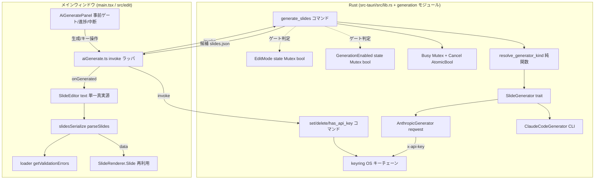

# AI スライド生成機能（内蔵生成）

**ドキュメント種別:** 技術設計書 (Design Doc)
**SDDフェーズ:** Plan (計画/設計)
**最終更新日:** 2026-07-25
**関連 Spec:** [ai-slide-generation_spec.md](./ai-slide-generation_spec.md)
**関連 PRD:** [ai-slide-generation.md](../requirement/ai-slide-generation.md)

---

# 1. 実装ステータス

**ステータス:** 🔴 未実装（設計フェーズ・Issue #14）。器（#13 [slide-edit-mode_design.md](./slide-edit-mode_design.md)）の上に生成・ネットワーク・秘密情報の各層を新設する。参照実装は姉妹アプリ ticketvc-jira-management-app(NexusBoard) の Anthropic/LLM 連携（`ai_tool` feature）。

## 1.1. 実装進捗

| モジュール/機能 | ステータス | 備考 |
|----------|--------|------|
| 生成器抽象（`SlideGenerator` trait ＋ enum ＋ resolve/factory ＋ Mock） | 🔴 | FR-002。ticketvc `llm_backend.rs` パターンを流用 |
| 内蔵生成（Anthropic 直・reqwest） | 🔴 | FR-003。`x-api-key`＋`anthropic-version`・既定 `claude-opus-4-8`・with_retry |
| 外部生成（Claude Code CLI） | 🔴 | FR-002。`claude --print --output-format json --strict-mcp-config` を spawn（ticketvc `claude_cli/llm_client.rs` 流用） |
| API キー保管（keyring／OS キーチェーン） | 🔴 | FR-006。取得は存在のみ・fail-closed・マスク |
| 生成/network/キー操作の Rust ゲート（EditMode＋生成有効） | 🔴 | FR-009/DC-003。#13 `EditMode(Mutex<bool>)` 拡張 |
| 取り込み検証＋自動修正ループ | 🔴 | FR-005。`getValidationErrors`＋上限 N＋最良候補退避 |
| 器への流し込み（`SlideEditor` text 受け口） | 🔴 | FR-004/DC-004。現状 `text` は useState 初期化のみ→外部注入の受け口追加 |
| 生成パネル UI（`AiGeneratePanel`・事前ゲート・進捗・中断） | 🔴 | FR-001/007/010。editorUiTheme・`--theme-*` |
| 進捗イベント＋中断＋同時実行1件 | 🔴 | FR-010。Tauri event＋`AtomicBool`＋`Mutex` busy |
| i18n（`aiGenerate.*`） | 🔴 | ja/en/fr の生成 UI 文言。方式別の課金/オンライン依存注意書き（`aiGenerate.billingNotice.builtin` / `.external`）を含む（PRD §5.2） |

---

# 2. 設計目標

1. **生成能力の追加と読み取り中心の安全性の両立** — ネットワーク通信と秘密情報（API キー）を、編集モード かつ 生成有効時のみ有効化し、通信実行とキー保管をネイティブ（Rust）境界に閉じる。ビューワーの capability 分離（#13）をネットワーク・秘密情報の領域へ拡張する（DC-002/DC-003/NFR-003）。
2. **生成器の差し替え可能性** — 内蔵（Anthropic 直）と外部（Claude Code CLI）を同一契約（プロンプト → `slides.json` 候補）で差し替える。抽象の切れ目を「生成器単位」に置き、外部の完結エージェントも契約を満たせるようにする（FR-002）。
3. **誤生成の無自覚な保存の構造的防止** — 生成器は永続化せず候補を返すのみとし、公開 `slides.json` への反映は検証（自動修正含む）と利用者の明示確定を経る（DC-004/FR-005）。
4. **器の完全再利用** — 生成結果のプレビュー・編集・保存・書き出しは #13 の器（`SlideEditor` の単一真実源・無損失往復・Rust 書き込みコマンド）をそのまま再利用し、再実装しない（DC-001/NFR-002）。
5. **過剰設計の回避** — 参照実装 ticketvc の重量級フロント構成（4層 Clean Architecture＋DI＋RxJS＋MVVM）は移植せず、本アプリの軽量 React+hooks 構成に合わせる。取り込むのは Rust 側の抽象・境界パターンに絞る（CONSTITUTION「シンプルさ」）。
6. **リグレッションゼロ** — View（発表本番）・「開く」・発表者ビュー・編集モードの既存挙動を変えない（NFR-001）。

---

# 3. 技術スタック

**なぜその技術を選んだのか**の判断根拠を残す。参照実装として姉妹 Tauri アプリ ticketvc-jira-management-app(NexusBoard) の稼働実装を随所で下敷きにする。

| 領域 | 採用技術 | 選定理由 |
|------|------|------|
| HTTP クライアント（内蔵生成） | Rust `reqwest`（`rustls-tls` / `json` / `stream`） | キーを WebView に出さず Anthropic API を直接叩ける（DC-002/NFR-003）。`Cargo.lock` に tauri の transitive 依存として既存でありビルドコストが小さい。ticketvc も全 LLM 通信を Rust `reqwest` に集約 |
| 非同期ランタイム | `tokio`（`reqwest` 依存） | `reqwest` の async 実行。Tauri の `async` コマンドと統合 |
| API キー保管 | Rust `keyring` v3（`apple-native` / `windows-native` / `sync-secret-service`） | OS ネイティブのセキュアストレージ（macOS Keychain / Windows Credential Manager / Linux Secret Service）。平文保存を避ける（NFR-003）。ticketvc(`token_store.rs`) が同一クレット・同一 feature 構成で本番実証済み |
| 秘密のメモリ保持・ログ | `secrecy::SecretString` ＋ マスクラッパー | 復号後のキーを平文 `String` で持ち回らず、ログ・エラー・`Debug` に生値を出さない（NFR-003/NFR-004）。ticketvc `MaskedSecret` 相当 |
| 生成器抽象 | trait ＋ 閉じた enum ＋ resolve 純関数 ＋ factory ＋ Mock | 内蔵/外部を同一契約 `Box<dyn SlideGenerator>` で差し替え、テスト時に Mock を注入する（FR-002）。開放的プラグイン機構ではなく閉じた列挙で十分（ticketvc `llm_backend.rs` の `AiBackendKind`＋`resolve_backend_from`＋`create_*` パターン） |
| 外部生成 | ローカル `claude` CLI サブプロセス（`--print --output-format json --strict-mcp-config`） | 外部は完結エージェント。生 Messages を渡さず結果 JSON を受け取る（ticketvc `claude_cli/llm_client.rs` 流用：一時 cwd で spawn・タイムアウト安全弁・`is_error` 判定） |
| 生成結果検証 | 既存 `loader.ts` `getValidationErrors`（構造化 `ValidationError`） | D-002（バリデーション駆動）。既存検証資産を再利用（FR-005） |
| 生成結果の取り込み | 既存 `slidesSerialize.parseSlides` / `SlideEditor` の `text` 単一真実源（#13） | 無損失往復（NFR-002）。生成 JSON をそのまま器へ流し込み、以降の調整は器の手動編集（DC-001） |
| リトライ／エラー整形 | `with_retry`（429/529 指数バックオフ）＋ エラーボディ切詰め＋ `tools` 空時 `tool_choice` 省略 | 一時的失敗に強く、UI へ内部情報を漏らさない（NFR-005・FR-008）。ticketvc `anthropic_client.rs` の実績パターン |
| 生成 UI | 編集モード内パネル（React / MUI・`editorUiTheme`） | 器と同じ固定 UI テーマに載せ、色は `--theme-*` 経由（A-002/DC-006）。フロントは軽量 hooks 構成を維持（ticketvc の 4層/RxJS/MVVM は移植しない） |
| 進捗・中断・同時実行制御 | Tauri event（`emit`/`listen`）＋ `Arc<AtomicBool>` cancel ＋ `Mutex` busy | 長時間の生成を非ブロッキングで進捗通知・中断し、同時実行を 1 件に制限（FR-010）。ticketvc `AppState`（cancel_flag＋busy_lock）相当 |
| モデル | 既定 `claude-opus-4-8` ＋ 設定上書き ＋ 将来キュレート選択 | 実装時点の最新モデル。既定定数 → 利用者設定 → 将来一覧取得の三段解決（FR-003） |

---

# 4. アーキテクチャ

## 4.1. システム構成図



自動修正ループ（FR-005）は **JS（`aiGenerate.ts`）が駆動**する: `generate_slides`（Rust・候補 1 件）を呼ぶ → `parseSlides` / `getValidationErrors`（JS・検証の単一真実源）で検証 → 不正なら検証エラー要約を次の `GenerateRequest.repairFeedback` に載せて再度 `generate_slides` を呼ぶ、を上限 N 回。これにより検証規則を JS に一元化（D-002）し、Rust は「生成器で候補を 1 件返す」責務に限定する（§9.1 の決定事項）。

## 4.2. モジュール分割

| モジュール名 | 責務 | 依存関係 | 配置場所 |
|--------|------|------|------|
| `AiGeneratePanel` | 生成パネル UI。プロンプト入力・方式選択・事前ゲート・進捗・中断・方式別の課金/オンライン依存注意書き表示（PRD §5.2） | `aiGenerate`, `SlideEditor`(注入) | `src/edit/AiGeneratePanel.tsx`（新規） |
| `aiGenerate` | 生成・キー管理コマンドの呼び出し口。**自動修正ループの駆動（`generate_slides` を上限 N 回呼ぶ）・`getValidationErrors` 検証・`GenerateResult` 組立**・進捗通知 | `@tauri-apps/api/core`, `loader`, `slidesSerialize` | `src/aiGenerate.ts`（新規） |
| `SlideEditor` | 生成結果を単一真実源 `text` へ流し込む受け口を追加（外部注入経路） | `slidesSerialize`, `AiGeneratePanel` | `src/edit/SlideEditor.tsx`（改修） |
| `slidesSerialize` | 生成 JSON の無損失パース・取り込み | `types`, `loader` | `src/edit/slidesSerialize.ts`（**再利用**） |
| `loader` | 生成結果の取り込み前バリデーション | なし | `src/data/loader.ts`（**再利用**） |
| `generation`（Rust） | 生成器 trait・enum・`resolve_generator_kind`・factory（候補 1 件生成に限定。自動修正ループは JS 側 `aiGenerate` が駆動する） | `reqwest`, `tokio`, `serde_json` | `src-tauri/src/generation/mod.rs`（新規） |
| `AnthropicGenerator`（Rust） | Anthropic Messages API 呼び出し（reqwest・retry・エラー整形） | `reqwest`, `credential` | `src-tauri/src/generation/anthropic.rs`（新規） |
| `ClaudeCodeGenerator`（Rust） | 外部 `claude` CLI サブプロセス実行 | `std::process`, `tokio` | `src-tauri/src/generation/claude_cli.rs`（新規） |
| `credential`（Rust） | API キーの keyring 保管・取得（存在のみ返す）・削除・マスク | `keyring`, `secrecy` | `src-tauri/src/credential.rs`（新規） |
| `lib.rs` | `GenerationEnabled` state・`generate_slides`・`cancel_generation`・キー管理コマンド登録・ゲート | `generation`, `credential`, `EditMode` | `src-tauri/src/lib.rs`（改修） |

> #13 が確立した `EditMode(Mutex<bool>)`・`set_edit_mode`・書き込みコマンドの単一境界パターンを踏襲し、本 Feature は `GenerationEnabled` state・生成/キー管理コマンドを同じ `invoke_handler` に追加する。フロント側 `aiGenerate.ts` は `editModeSave.ts` と同じ invoke ラッパ規約（camelCase→snake_case・編集モード前提）に従う。

---

# 5. データモデル

`slides.json` のデータ構造（`PresentationData` / `SlideData` / `SlideContent` 等）は既存 `src/data/types.ts` をそのまま用い、**生成のための新規スライドデータ型は追加しない**（DC-001 器・レンダラの再利用／DC-005 全体置換・生成結果は既存構造の `slides.json` 文字列）。本 Feature が追加するのは生成の契約型とゲート state。**Rust ⇔ TS のワイヤーフォーマットは serde 属性で明示変換する**（Tauri `invoke` の既定は Rust 表記のままシリアライズされ、属性なしだと TS 契約と実行時に不一致になるため）。

```rust
// src-tauri/src/generation/mod.rs — 生成器抽象（ticketvc llm_backend パターン）
// serde 変換: struct は camelCase、enum は kebab-case 文字列（TS 契約 spec §4.1 と一致）
#[derive(serde::Serialize, serde::Deserialize)]
#[serde(rename_all = "camelCase")]
pub struct GenerateRequest {
    pub prompt: String,
    pub kind: SlideGeneratorKind,
    pub base_slides: Option<String>,      // 編集起点時の現行 slides.json（NFR-004 の送出対象に限定）
    pub repair_feedback: Option<String>,  // 自動修正の再試行時に JS が積む検証エラー要約（FR-005）
}

// TS 側は同一ワイヤー値（'builtin-anthropic' / 'external-claude-code'）を GeneratorKind として定義（spec §4.1）。
// Rust 側は内部型を明確化するため SlideGeneratorKind と命名するが、kebab-case 文字列は一致する。
#[derive(serde::Serialize, serde::Deserialize, Clone, Copy, PartialEq)]
#[serde(rename_all = "kebab-case")]
pub enum SlideGeneratorKind { BuiltinAnthropic, ExternalClaudeCode }

// 生成器は「プロンプト → slides.json 候補 1 件」の単一契約（生成器単位で抽象化）。
// 検証・自動修正ループ・outcome 判定は JS 側（aiGenerate.ts）が駆動する（§9.1 の決定事項）。
// このため GenerateOutcome / GenerateResult は Rust には置かず TS 側の型とする。
#[async_trait::async_trait]
pub trait SlideGenerator: Send + Sync {
    async fn generate(&self, req: &GenerateRequest, cancel: &CancelToken) -> Result<String, GenerateError>;
}

// 閉じた解決（純関数・単体テスト対象）: dev override → 設定 provider → 既定
pub fn resolve_generator_kind(env_override: Option<&str>, config_provider: Option<&str>) -> SlideGeneratorKind;
// factory: 解決済み trait object のみ利用側へ渡す（利用側は内蔵/外部を意識しない）
pub fn create_generator(kind: SlideGeneratorKind, key: Option<SecretString>, model: &str) -> Box<dyn SlideGenerator>;
```

```rust
// src-tauri/src/credential.rs — API キー保管（生値を返さない・fail-closed・二層構造）
// 秘密本体（API キー）は keyring（OS キーチェーン）に保管。メタデータ（configured / last_updated）は
// plugin-store に非秘密値として並置する（ticketvc の二層パターン）。これにより has_api_key は
// keyring に触れず状態のみ返せ、NFR-003「生成無効時はキーチェーンへ到達しない」と事前ゲート表示を両立する。
#[derive(serde::Serialize)]
#[serde(rename_all = "camelCase")]
pub struct ApiKeyStatus {
    pub configured: bool,
    #[serde(skip_serializing_if = "Option::is_none")]
    pub last_updated: Option<String>,  // None のときキー自体を省略し TS lastUpdated?: string と一致（null を出さない）
}
pub fn set_api_key(key: &str) -> Result<(), CredentialError>;      // keyring へ保管＋plugin-store の configured/last_updated 更新。失敗時はエラー（平文フォールバック禁止）
pub fn delete_api_key() -> Result<(), CredentialError>;            // keyring エントリ削除＋メタデータ消去
pub fn has_api_key() -> Result<ApiKeyStatus, CredentialError>;     // plugin-store のメタデータのみ読む（keyring 非アクセス・生値を返さない）
pub(crate) fn load_api_key() -> Result<SecretString, CredentialError>; // crate 内部限定。generate_slides 実行時に keyring から取得し HTTP ヘッダ付与にのみ使用
```

```typescript
// src/aiGenerate.ts — 生成・キー管理の invoke ラッパ＆オーケストレータ（型は spec §4.1 と一致）
export type GeneratorKind = 'builtin-anthropic' | 'external-claude-code'
export interface GenerateRequest { prompt: string; kind: GeneratorKind; baseSlides?: string; repairFeedback?: string }
export type GenerateOutcome = 'succeeded' | 'exhausted' | 'cancelled' | 'failed'
// GenerateResult は JS オーケストレータ generateSlides() が組み立てる（Rust の generate_slides は候補 1 件を返すのみ）
export interface GenerateResult { outcome: GenerateOutcome; slidesJson: string | null; validationErrors: ValidationError[]; attempts: number }
export interface GenerateProgress { attempt: number; maxAttempts: number; phase: 'generating' | 'validating' | 'repairing' }
export interface ApiKeyStatus { configured: boolean; lastUpdated?: string }
```

---

# 6. インターフェース定義

```rust
// src-tauri/src/lib.rs（改修）— 生成有効フラグと生成/キー管理コマンド
struct GenerationEnabled(std::sync::Mutex<bool>);          // 既定 false
struct GenerationBusy(std::sync::Mutex<bool>);             // 同時実行 1 件（FR-010）
// キャンセルは実行中トークン（AtomicBool）。cancel_generation は in-flight の HTTP（reqwest abort）/
// サブプロセス（child kill）を中断する。次の自動修正試行の開始は JS が制御するため Rust 側ループ中断は不要

#[tauri::command] fn set_generation_enabled(state: State<GenerationEnabled>, enabled: bool);  // 編集モード必須
// generate_slides / cancel_generation は関数冒頭で「編集モード かつ 生成有効」を検査してから
// keyring 取得・network に到達する（DC-003 / NFR-003）
#[tauri::command] async fn generate_slides(/* states */, request: GenerateRequest) -> Result<String, String>;  // 候補 1 件（検証/ループは JS）
#[tauri::command] fn cancel_generation(/* cancel token */) -> Result<(), String>;
// キー管理は編集モード必須。set/delete は keyring に触れる。has_api_key は plugin-store のメタデータのみ
// 読み keyring に触れないため、生成無効でも事前ゲート表示のために呼べる（NFR-003 と両立）
#[tauri::command] fn set_api_key(/* states */, key: String) -> Result<(), String>;
#[tauri::command] fn delete_api_key(/* states */) -> Result<(), String>;
#[tauri::command] fn has_api_key(/* states */) -> Result<ApiKeyStatus, String>;  // configured / lastUpdated のみ・生値を返さない
```

```typescript
// src/aiGenerate.ts（新規）
// generateSlides はオーケストレータ: generate_slides（Rust・候補 1 件）を上限 N 回呼び、
// parseSlides / getValidationErrors で検証・自動修正して GenerateResult を組み立てる（FR-005）。
// onProgress は JS 内で試行/フェーズ遷移時に呼ぶ（Tauri event を張らないため購読ライフサイクル不要）。
// generate_slides / cancelGenerate は編集モード かつ 生成有効時のみ成功（Rust 側ゲート）。
export async function setGenerationEnabled(enabled: boolean): Promise<void>
export async function generateSlides(request: GenerateRequest, onProgress?: (p: GenerateProgress) => void): Promise<GenerateResult>
export async function cancelGenerate(): Promise<void>
// キー管理は編集モードで可（生成有効は不要・セットアップ手順）。getApiKeyStatus は keyring に触れず状態のみ取得（事前ゲート用）
export async function setApiKey(key: string): Promise<void>
export async function deleteApiKey(): Promise<void>
export async function getApiKeyStatus(): Promise<ApiKeyStatus>              // 生値は受け取らない

// src/edit/SlideEditor.tsx（改修）— 生成結果を単一真実源へ流し込む受け口
// 現状 text は useState 初期化のみで外部再注入経路がない。生成結果注入のため、
// (a) 生成 → 新規 EditSource を作り再マウント（key 更新）するか、
// (b) SlideEditor に applyGeneratedSlides(json) の受け口を追加するか、を §9.1 で決定。
```

Anthropic 内蔵呼び出しのヘッダ（`AnthropicGenerator`・Rust reqwest）: `x-api-key: <keyring から load>` ＋ `anthropic-version: 2023-06-01` ＋ `content-type: application/json`。エンドポイントは `POST https://api.anthropic.com/v1/messages`、body に `model`（既定 `claude-opus-4-8`）・`max_tokens`・`messages`。長い出力に備えストリーミング採否は §9.2。ticketvc は Vertex 経由（ADC Bearer）だが本 Feature は Anthropic 直（API キー方式）である点が唯一の主要差分（§9.1）。

---

# 7. 非機能要件実現方針

| 要件 | 実現方針 |
|------|------|
| NFR-001（互換性・リグレッションなし） | 生成は編集モード内の追加パネルとして実装し、View／発表者ビュー／既存編集フローの分岐を変更しない。既存 `EditMode` ゲートに `GenerationEnabled` を **追加**（既存コマンドの挙動は不変）。`npm run test`／`typecheck`／`cargo test`／`clippy -D warnings`／`fmt --check` を green 維持 |
| NFR-002（無損失取り込み） | 生成結果は `slidesSerialize.parseSlides` で取り込み、`SlideEditor` の単一真実源 `text` に載せる。以降の往復は #13 の無損失シリアライズをそのまま通す（新規シリアライザを作らない） |
| NFR-003（最小権限） | ネットワーク・キー保管を Rust の `generation`／`credential` モジュールに閉じる。`capabilities` に `http`／`fetch`／秘密系の JS 権限を追加しない（`reqwest` は CSP を通らないため CSP 変更も不要）。キー生値を返す JS コマンドを作らない（`has_api_key` は状態のみ） |
| NFR-004（機密最小化） | Anthropic へ送る body はプロンプト・スキーマ／テンプレート・（編集起点時の）`base_slides` のみで構築する純関数に集約し、キー本体・任意ローカルファイル・他パッケージを混入させない。送出内容の単体テストで検証。キーはヘッダ付与時のみ `SecretString` から取り出す |
| NFR-005（コスト境界） | `generate_slides`（Rust・候補 1 件）に応答タイムアウト **120 秒（暫定確定・実測見直し可）** を設定。自動修正ループの上限 **N=3（暫定確定）** を JS（`aiGenerate.ts`）で定数化。`with_retry` は 429/529 のみ指数バックオフ（無制限リトライを避ける） |
| T-003（外部連携ライフサイクル） | 生成の進捗通知は JS オーケストレータ内のコールバックで完結させ Tauri event 購読を張らない。将来 Tauri `listen`（逐次ストリーミング等）を導入する場合は `usePresenterView` と同様に `useEffect` 内で登録し、返り値の unsubscribe をクリーンアップで解除する |

---

# 8. テスト戦略

| テストレベル | 対象 | カバレッジ目標 |
|--------|------|---------|
| Rust 単体 | `resolve_generator_kind`（純関数・env/設定/既定の分岐）、ゲート（編集モード・生成有効の true/false で許可/拒否）、自動修正ループ（Mock 生成器で succeeded/exhausted/cancelled/failed の各 outcome）、`credential`（保管→存在確認→削除・fail-closed・マスク）、送出 body 構築（機密最小化：キー・禁止情報が含まれない） | 分岐網羅・ゲートは true/false 双方を直接検証（#13 の純粋関数テスト方針を踏襲） |
| JS 単体（Vitest） | `AiGeneratePanel` の事前ゲート（キー未設定で生成無効）、`aiGenerate` の invoke 引数、生成結果の `SlideEditor` 流し込み（全体置換）・検証エラー提示、進捗/中断ハンドリング | 主要分岐・NFR-001 の既存テスト green 維持 |
| 結合 | 生成 → 検証 → 自動修正 → 器のプレビュー反映のフロー（Mock 生成器）。失敗/中断時に器の手動編集へ退避し既存データを壊さない | 主要ユースケース（成功／exhausted／失敗／中断） |
| 手動（実機・macOS） | 実 API キーでの内蔵生成疎通、外部 CLI 検出・生成、キーが WebView/ログに出ないことの確認、capability ゲート（生成無効時にコマンド拒否） | #13 と同様に実機検証を完了条件に含める |

---

# 9. 設計判断

## 9.1. 決定事項

| 決定事項 | 選択肢 | 決定内容 | 理由 |
|------|-----|------|------|
| HTTP 経路 | (A) Rust `reqwest` / (B) WebView `fetch` / (C) `tauri-plugin-http` | **(A) Rust reqwest** | キーを WebView に出さず CORS も回避（DC-002/NFR-003）。`Cargo.lock` に既存で追加コスト小。ticketvc も全 LLM 通信を Rust reqwest に集約。CSP は Rust 経路のため変更不要 |
| API キー保管 | (A) OS キーチェーン `keyring` / (B) `tauri-plugin-stronghold` / (C) `plugin-store` 平文 / (D) 環境変数 | **(A) keyring（OS キーチェーン）** | OS ネイティブ暗号化で平文回避。ticketvc `token_store.rs` が同一クレットで実証。stronghold はパスフレーズ運用が重く、平文/env は秘密情報に不適 |
| 生成抽象の切れ目 | (A) 生成器単位（プロンプト→slides.json） / (B) モデル呼び出し単位（Messages 形状） | **(A) 生成器単位** | 外部 Claude Code は内部にツールループを持つ完結エージェントで、生 Messages リクエストを受けられない。生成器単位なら内蔵/外部の双方が同一契約を満たせる（ticketvc `chat_backend.rs` の明示的教訓） |
| 切替の実装 | (A) 閉じた enum＋match / (B) 開放的プラグイン登録機構 | **(A) 閉じた enum＋resolve 純関数＋factory** | 内蔵/外部の 2 種で十分機能し、テスト・解決が単純。ticketvc `AiBackendKind` と同型 |
| 内蔵の接続先 | (A) Anthropic 直（`x-api-key`） / (B) GCP Vertex 経由（ADC） | **(A) Anthropic 直** | 個人デスクトップ＋BYO API キー前提。ticketvc は組織/GCP 文脈で Vertex/ADC だが、本アプリは直・API キー方式が適切（保管機構・reqwest 境界は流用、認証ヘッダのみ差分） |
| 出力契約 | (A) ドキュメント全体置換 / (B) 部分マージ・スライド単位 | **(A) 全体置換（v1）** | slides 構造の一貫性を保ちやすく実装が簡潔。以降の微調整は器の手動編集。部分マージは後続（DC-005） |
| 検証後処理 | (A) 自動修正ループ（上限 N） / (B) 手動修正のみ | **(A) 自動修正ループ** | 手動修正負担を減らす。ticketvc AuthoringService に実績。上限 N＋最良候補退避＋タイムアウトでコストを境界（NFR-005） |
| 未設定時 UX | (A) 事前ゲート（無効化＋設定導線） / (B) 事後エラー | **(A) 事前ゲート** | capability 分離思想に忠実で UX が明確。フロント無効化に加え Rust 入口でもゲート検証（DC-003） |
| 永続化 | (A) 生成器は候補のみ返す（確定は器経由） / (B) 生成器が保存も行う | **(A) 候補のみ返す（DC-004 型）** | 誤生成が無自覚に保存・配布されるのを構造的に防ぐ。ticketvc DC-014「利用者確認まで永続化しない」と同型（※ DC-014 は姉妹アプリ ticketvc 側の制約 ID。本 PRD の DC ではない） |
| フロント構成 | (A) 軽量 React+hooks / (B) 4層 DI＋RxJS＋MVVM（ticketvc 流） | **(A) 軽量 React+hooks** | 本アプリの既存構成に合わせ過剰設計を回避（CONSTITUTION「シンプルさ」）。Rust 側の抽象・境界パターンのみ ticketvc から流用 |
| 器への注入方式 | (A) 生成結果で新規 `EditSource` を作り再マウント（key 更新） / (B) `SlideEditor` に注入受け口を追加 | **(B) 注入受け口を追加**（暫定・実装で最終確認） | 全体置換 v1 では (A) の再マウントでも成立するが、生成→手動調整の連続性・進捗表示との統合を考えると (B) が素直。現状 `text` は useState 初期化のみで外部再注入経路がないため受け口追加が必要 |
| 自動修正ループの実行場所 | (A) Rust 内完結（検証も Rust） / (B) JS 駆動（`aiGenerate.ts`） | **(B) JS 駆動** | 検証の単一真実源は JS `getValidationErrors`（D-002）。Rust に検証を複製せず、Rust は候補 1 件生成に限定する。FR-005「取り込み時バリデーション」を器の JS フローに一致させる。JS が上限 N 回ループし、各試行で `generate_slides` を呼ぶ |
| タイムアウト・自動修正上限 N | (A) 実装フェーズへ全送り / (B) 設計で暫定確定 | **(B) 内蔵タイムアウト 120 秒・N=3（暫定確定・実測見直し可）** | PRD NFR-005 は「設計フェーズで確定」を要求。無制限リトライ/生成を避けコストを境界付ける。実測で見直す |
| 事前ゲート判定条件（初期セット） | — | **内蔵=`getApiKeyStatus().configured`／外部=`claude --version` の終了コード 0＋PATH 解決可否（タイムアウトは未検出扱い）** | FR-007「判定条件は設計フェーズで確定」。UI 文言等の細部のみ実装フェーズに残す |
| Rust↔TS ワイヤーフォーマット | (A) serde 属性で変換 / (B) 手動整合 | **(A) serde `rename_all`（struct=camelCase・enum=kebab/lowercase）** | Tauri `invoke` の既定は Rust 表記のままシリアライズされ、属性なしだと TS 契約（`slidesJson` 等）と実行時に不一致になり `tsc` で検出できない |

## 9.2. 未解決の課題

| 課題 | 影響度 | 対応方針 |
|------|-----|------|
| ストリーミング（SSE）採否 | 低 | v1 は全体置換・試行/フェーズ単位進捗のため非ストリーミング（一括生成）で十分か検証。逐次プレビューが要る場合のみ ticketvc `sse_parser.rs` 相当を導入（スコープ外候補） |
| タイムアウト・上限 N の実測チューニング | 低 | §9.1 で暫定確定（内蔵 120 秒・N=3）。実運用データで見直す（NFR-005） |
| モデルのキュレート一覧取得の要否 | 低 | v1 は既定 `claude-opus-4-8`＋設定上書きで足りるか検証。動的一覧取得は後続 |
| 外部 Claude Code の検出・設定 UX の細部 | 低 | 判定条件の初期セットは §9.1 で確定。未検出時の設定導線・UI 文言・再検出操作の細部を実装フェーズで具体化（ticketvc `ClaudeCliStatus` 相当） |

---

# 10. 変更履歴

## v0.2（2026-07-25）

**変更内容（SDD 縦整合レビュー反映）:**

- spec↔design 契約整合: TS `GenerateRequest` に `repairFeedback?: string` を追加（Rust の `repair_feedback` と一致・自動修正ループの再投入に必要。spec §4.1 と同期）。
- §4.2 モジュール表: `generation`（Rust）の責務から「自動修正ループ」を除き「候補 1 件生成に限定（ループは JS `aiGenerate` 駆動）」に統一（§4.1／§9.1 と整合）。
- `ApiKeyStatus.last_updated` に `skip_serializing_if` を付与し、TS `lastUpdated?: string` と整合（`null` を出さずキー省略）。
- 表記統一: `resolve_generator`→`resolve_generator_kind`（§4.1 図）、外部 CLI オプションに `--strict-mcp-config` を明記（§1.1）、`SlideGeneratorKind`⇔TS `GeneratorKind` の同一ワイヤー値を注記（§5）。

## v0.1（2026-07-25）

**変更内容:**

- 初版（設計フェーズ）。器（#13）の上に生成器抽象・内蔵（Anthropic 直・reqwest）・外部（Claude Code CLI）・keyring 保管・EditMode＋生成有効ゲート・取り込み検証/自動修正ループ・生成パネル UI を設計。参照実装 ticketvc-jira-management-app の Rust 側パターンを流用（フロントの重量級構成は非移植）。
