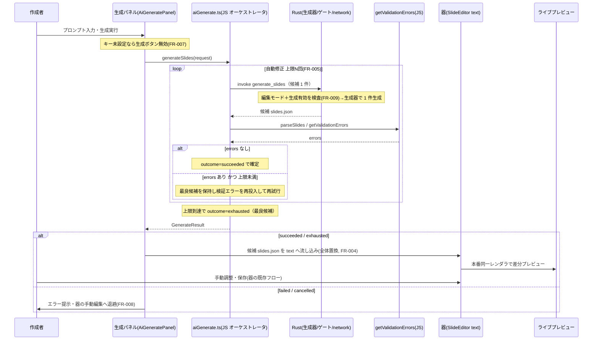

# AI スライド生成機能（内蔵生成）

**ドキュメント種別:** 抽象仕様書 (Spec)
**SDDフェーズ:** Specify (仕様化)
**最終更新日:** 2026-08-28
**関連 Design Doc:** [ai-slide-generation_design.md](./ai-slide-generation_design.md)
**関連 PRD:** [ai-slide-generation.md](../requirement/ai-slide-generation.md)

---

# 1. 背景

[slide-edit-mode.md](../requirement/slide-edit-mode.md)（#13）で用意した編集モード（器）は、`slides.json` の編集・ライブプレビュー・ローカル保存・`.spkg` 書き出しをアプリ内で完結させた。しかしスライドの**生成**は当面「外部（Claude Code 等）に委ねる」方針であり、アプリ単体でプロンプトからスライドを起こす導線はない。非エンジニアが外部ツールを併用せずに下書きを得る手段がまだない。

生成を内蔵するには、ビューワーがこれまで持たなかった 2 つの関心事—**ネットワーク通信**（Vertex AI 呼び出し）と**認証情報**（GCP ADC トークン）—を導入する必要がある。ビューワーは読み取り中心で外部通信も認証情報も持たない設計であり、#13 の器も「編集モード時のみ書き込みを有効化する capability 分離」で安全性を担保している。本仕様は、この安全性を損なわずに**生成能力だけを足す**ことを最大の設計課題とする。

加えて、生成 AI の出力は必ずしもスキーマに適合しない。そのまま保存・表示すると壊れる恐れがあるため、**生成結果を安全に検証してから器へ取り込む**仕組みが要る。

関連する既存仕様: [slide-edit-mode_spec.md](./slide-edit-mode_spec.md)（器＝`SlideEditor` の単一真実源・無損失往復・書き込みの Rust コマンド境界集約）。本仕様はこれを上流に持ち、生成を「編集モードの一入力手段」として差し込む。

# 2. 概要

編集モード内に**生成パネル**を追加し、プロンプト入力 → 生成 → 器のライブプレビュー → 手動調整 → 書き出し、をアプリ内で完結させる。本仕様は PRD の **UR-001**（内蔵生成の提供）と **UR-002**（capability 分離による安全な生成）を満たすことを目的とする。設計原則は以下のとおり。

- **器の再利用**: 生成結果は器（`SlideEditor` の単一真実源 `text`）へ流し込み、本番同一レンダラのライブプレビュー・保存・書き出しをそのまま再利用する（**DC-001**）。生成結果のプレビュー＝本番ビューを保証する。
- **差し込み可能な生成インターフェース**: 生成は「生成器（プロンプト → `slides.json` 候補を返す単位）」として抽象化し、内蔵（Vertex AI）と外部（Claude Code 等）を同一契約で差し替える（**FR-002**）。抽象の切れ目をモデル呼び出しではなく生成器単位に置くことで、外部の完結した生成手段も同一契約を満たせる。
- **ネットワーク・認証情報のネイティブ境界集約**: Vertex AI 呼び出しと GCP トークン取得は Rust コマンド境界の単一チョークポイントに集約し、内蔵はネイティブ（Rust）側の HTTP 経路で接続する。`fetch` 権限や GCP トークンの生値をフロントエンド（JS）へ渡さない（**DC-002 / NFR-003**）。
- **編集モード＋生成有効ゲート**: 生成・ネットワーク・キー操作は編集モード かつ 生成有効時のみ Rust 側で実行可能とする（**DC-003 / FR-009**）。前提未充足時（キー未設定・外部 CLI 未検出）は生成導線を実行前に無効化する（**FR-007**）。
- **検証と自動修正、永続化分離**: 生成結果は取り込み時に構造化バリデーションし、不正なら自動修正を上限内で試み、上限到達時は最良候補を器へ退避する（**FR-005**）。生成器は永続化せず候補を返すのみとし、公開 `slides.json` への反映は検証と利用者の明示確定を経る（**DC-004**）。

**生成出力は当面ドキュメント全体の置換とする（DC-005）。課金上限管理・部分マージ生成・アセット生成・トークン単位ストリーミングはスコープ外。** 課金は方式別に UI の注意書きで周知するに留める。

# 3. 要求定義

## 3.1. 機能要件 (Functional Requirements)

| ID     | 要件                                                                                 | 優先度 | 根拠（PRD）        |
|--------|------------------------------------------------------------------------------------|-----|---------------|
| FR-001 | 編集モード内の生成パネルでプロンプトを入力し、生成を実行する                                     | 必須  | FR-001 / UR-001 / DC-006 |
| FR-002 | 差し込み可能な共通生成インターフェースを介して内蔵（Vertex AI）と外部（Claude Code 等）を切り替える | 必須  | FR-002 / UR-001 |
| FR-003 | 内蔵生成は Rust コマンド境界から Vertex AI（GCP ADC 認証）を設定モデルで呼び出す                | 必須  | FR-003 / UR-001 / UR-002 / DC-002 |
| FR-004 | 生成結果 `slides.json` を器の単一真実源へ流し込み、ライブプレビューと手動調整に合流させる（全体置換） | 必須  | FR-004 / UR-001 / DC-001 / DC-005 |
| FR-005 | 取り込み時にバリデーションし、不正時は自動修正を上限内で試み、上限で最良候補を退避しエラー提示する      | 必須  | FR-005 / UR-001 / DC-004 |
| FR-006 | GCP 認証（ADC）と Vertex 設定（project/region/model）を保管・更新・削除し、トークン生値を JS へ渡さない | 必須  | FR-006 / UR-002 / DC-002 |
| FR-007 | 前提未充足時（キー未設定・外部 CLI 未検出）は生成導線を無効化し、設定へ誘導する（事前ゲート）        | 推奨  | FR-007 / UR-002 |
| FR-008 | 生成の失敗・オフライン・中断時は器の手動編集へ安全退避し、全体フォールバックへ流さない               | 必須  | FR-008 / UR-001 / UR-002 |
| FR-009 | 生成・ネットワーク・キー操作を編集モード かつ 生成有効時のみ Rust コマンド境界でゲートする          | 必須  | FR-009 / UR-002 / DC-003 |
| FR-010 | 生成の進捗を通知し、実行中の生成を中断でき、同時実行を 1 件に制限する                           | 推奨  | FR-010 / UR-001 |

## 3.2. 非機能要件 (Non-Functional Requirements)

| ID      | カテゴリ    | 優先度 | 要件                                                             | 目標値／根拠（PRD） |
|---------|---------|-----|----------------------------------------------------------------|-------------|
| NFR-001 | 互換性     | 必須  | 既存の表示・「開く」・発表者ビュー・編集モード・パッケージ配布が従来どおり動作。typecheck/test 通過 | NFR-001     |
| NFR-002 | 信頼性     | 必須  | 生成結果の器への取り込み・手動調整・保存の往復で無損失（未定義キー・HTML・`customCSS`・props 保持） | NFR-002     |
| NFR-003 | セキュリティ  | 必須  | ネットワーク通信と秘密情報を Rust コマンド境界の単一チョークポイントに集約。`fetch`／秘密を JS へ開放しない | NFR-003     |
| NFR-004 | セキュリティ  | 必須  | 外部へ送信するのはプロンプト・スキーマ／テンプレート・（編集起点時の）現行 `slides.json` に限定。キー生値・任意ローカルファイル・他パッケージの内容を送らない | NFR-004     |
| NFR-005 | 信頼性／コスト | 推奨  | 1 回の生成に応答タイムアウト、自動修正の試行回数に上限を設けコスト・時間の増大を防ぐ            | NFR-005     |

# 4. API

本仕様で追加・変更する公開インターフェース（実装詳細・技術選定は Design Doc 参照）。

| ディレクトリ | ファイル名 | エクスポート | 概要 |
|--------|-------|--------|------|
| `src/edit` | `SlideEditor.tsx` | `<SlideEditor source onExit />`（受け口拡張） | 生成結果を単一真実源 `text` へ流し込む受け口を追加（現状はマウント後の外部再注入経路がない）（FR-004） |
| `src/edit` | `AiGeneratePanel.tsx` | `<AiGeneratePanel onGenerated onError />` | 生成パネル UI。プロンプト入力・方式選択・進捗表示・中断・事前ゲート表示（FR-001/002/007/010） |
| `src` | `aiGenerate.ts` | `generateSlides(request)` / `cancelGenerate()` / `setVertexConfig` / `clearVertexConfig` / `getVertexConfig` / `getVertexStatus` / `gcloudLogin` / `setGenerationEnabled` / `buildThemeConstraintsPrompt()` | Rust コマンドの呼び出し口。生成/中断（`generateSlides`/`cancelGenerate`）は編集モード かつ 生成有効時のみ成功。Vertex 設定/ログイン（`setVertexConfig`/`clearVertexConfig`/`getVertexConfig`/`getVertexStatus`/`gcloudLogin`）と `setGenerationEnabled` は編集モードのみ必須（生成有効化前のセットアップ・事前ゲート表示のため）（FR-003/006/007/009/010）。`buildThemeConstraintsPrompt()` は適用中テーマ・登録済みコンポーネント/アイコンから意匠制約テキストを組み立て、`generateSlides` が試行ごとに `themeConstraints` として送出する（v1.1・#211） |
| `src/edit` | `slidesSerialize.ts` | `parseSlides`（再利用） | 生成 JSON の取り込み・無損失往復（FR-004/005・NFR-002） |
| `src/data` | `loader.ts` | `getValidationErrors`（再利用） | 生成結果の取り込み前バリデーション（FR-005） |
| `src-tauri` | `lib.rs` | `generate_slides`（Rust コマンド） | 生成器経由で `slides.json` 候補を**1件**生成。編集モード＋生成有効 state でゲート。自動修正ループと構造化バリデーションは JS 側 `aiGenerate.ts` が駆動する（FR-003/009） |
| `src-tauri` | `lib.rs` | `cancel_generation`（Rust コマンド） | 実行中の生成を中断する（FR-010） |
| `src-tauri` | `lib.rs` | `set_generation_enabled`（Rust コマンド） | 生成有効フラグを切り替える（編集モードのみ必須。内部状態管理は Design Doc 参照）（FR-009） |
| `src-tauri` | `lib.rs` | `set_vertex_config` / `clear_vertex_config` / `get_vertex_config` / `get_vertex_status` / `gcloud_login`（Rust コマンド） | Vertex 設定（project/region/model・非秘密）の保管・削除・取得・状態、および GCP ADC ログイン。編集モードのみ必須（生成有効は不要＝セットアップ手順）。`get_vertex_status`/`get_vertex_config` はトークンに触れず状態/設定のみ返し、生成無効時も事前ゲート表示のために呼べる（FR-006/007） |

## 4.1. 型定義

```typescript
// 生成の論理契約（詳細な内部構造は Design Doc 参照）
export type GeneratorKind = 'builtin-vertex' | 'external-claude-code'

// `prompt` が「新規スライドの内容そのもの」なのか「既存スライドへの変更依頼（差分指示）」なのかの明示（v1.1・#302）。
// AI がプロンプトの意味を取り違えやすいため、UI で選択させ Rust 側 user_prompt() に明示ラベルを付与させる
export type PromptIntent = 'new-content' | 'change-instruction'

export interface GenerateRequest {
  prompt: string
  kind: GeneratorKind
  /** 編集起点で生成する場合の現行 slides.json（新規生成時は省略。NFR-004 の送出対象） */
  baseSlides?: string
  /** 自動修正の再試行時に JS オーケストレータが積む検証エラー要約（初回は省略。FR-005。Rust の repair_feedback と一致） */
  repairFeedback?: string
  /** 見た目チェック（DOM実測。getVisualCheckWarnings由来）で検出された警告。「見た目をチェックして修正」
   * ボタン専用（v1.2・[ai-visual-check-and-fix_spec.md](./ai-visual-check-and-fix_spec.md)）。
   * repairFeedback（自動修正ループ専用・構造/スキーマ検証エラー）とは別レール */
  visualWarnings?: string[]
  /** テーマ設定の静的検証（getThemeWarnings由来）で検出された警告。同ボタン専用（v1.2） */
  themeWarnings?: string[]
  /** 適用中テーマ・登録済みコンポーネント/アイコンから JS 側（buildThemeConstraintsPrompt）が組み立てた
   * 意匠制約テキスト（v1.1・#211）。試行ごとに一度だけ組み立て、各試行の request に付与される */
  themeConstraints?: string
  /** `prompt` が新規内容か変更指示かの明示（v1.1・#302）。未指定は後方互換のためラベルなし */
  promptIntent?: PromptIntent
}

export type GenerateOutcome = 'succeeded' | 'exhausted' | 'cancelled' | 'failed'

// generateSlides()（JS オーケストレータ）の戻り値。Rust の generate_slides（候補 1 件）を
// 上限 N 回まで呼び、getValidationErrors で検証・自動修正した最終結果を組み立てる（FR-005）
export interface GenerateResult {
  outcome: GenerateOutcome
  /** 候補 slides.json 文字列。succeeded / exhausted で非 null、cancelled / failed で null */
  slidesJson: string | null
  /** 取り込み時バリデーションの残存エラー（exhausted で非空になりうる） */
  validationErrors: ValidationError[]
  /** 自動修正ループの試行回数 */
  attempts: number
}

// 内蔵（Vertex）設定＝非秘密（FR-006）。トークンは JS へ渡さない（NFR-003）
export interface VertexConfig {
  projectId: string
  region: string
  model: string
}
export interface VertexStatus {
  configured: boolean  // project/region/model がすべて設定済みか（生値なし）
}

// 生成進捗（FR-010）。JS オーケストレータが試行/フェーズ単位で通知する
export interface GenerateProgress {
  attempt: number       // 現在の試行回数（1 起点）
  maxAttempts: number   // 自動修正ループの上限 N
  phase: 'generating' | 'validating' | 'repairing'
}
```

```rust
// src-tauri/src/lib.rs — 生成・Vertex 設定コマンド。生成/中断（generate_slides/cancel_generation）は
// 編集モード かつ 生成有効時のみ成功。Vertex 設定/ログイン（set/clear/get_vertex_config・get_vertex_status・
// gcloud_login）と set_generation_enabled は編集モードのみ必須（生成有効は不要）。
// get_vertex_status/get_vertex_config はトークンに触れず状態/設定のみ返す。
// 内部ゲート機構・生成器 trait・Vertex/ADC 実装は Design Doc §5/§6 参照）
fn set_generation_enabled(enabled: bool)
fn generate_slides(request: GenerateRequest) -> Result<String, String>  // 候補 slides.json を 1 件返す（検証/自動修正ループは JS 側 aiGenerate.ts が駆動）
fn cancel_generation() -> Result<(), String>
fn set_vertex_config(config: VertexConfig) -> Result<(), String>
fn clear_vertex_config() -> Result<(), String>
fn get_vertex_config() -> Result<Option<VertexConfig>, String>
fn get_vertex_status() -> Result<VertexStatus, String>  // configured のみ
async fn gcloud_login() -> Result<(), String>  // GCP ADC ログイン（初回のみ）
```

# 5. 用語集

| 用語 | 説明 |
|------|------|
| 内蔵生成 | アプリが GCP Vertex AI（ADC 認証）を直接呼び出して `slides.json` を生成する方式（`GeneratorKind='builtin-vertex'`） |
| 外部生成 | Claude Code 等の外部生成手段を用いる方式（`GeneratorKind='external-claude-code'`）。内蔵と切替可能 |
| 生成インターフェース | 内蔵と外部を差し替え可能にする共通契約（プロンプト → `slides.json` 候補を返す生成器単位） |
| 生成パネル | 編集モード内でプロンプト入力・生成実行・方式選択・進捗表示・中断を行う UI（`AiGeneratePanel`） |
| 自動修正ループ | 生成結果が検証に通らない場合、検証エラーを再投入して上限 N 回まで修正を試みる仕組み（FR-005） |
| 事前ゲート | 前提未充足（キー未設定・外部 CLI 未検出）時に、生成導線を実行前に無効化し設定へ誘導すること（FR-007） |
| 生成有効フラグ | Rust 側で保持する生成許可 state。編集モード state と併せて生成/ネットワーク/キー操作をゲートする |
| capability 分離 | ネットワーク通信・秘密情報を編集モード かつ 生成有効時のみ有効化し権限を最小化する設計 |
| 器（うつわ） | 生成機能を差し込む先の編集・保存・書き出しの基盤（[slide-edit-mode_spec.md](./slide-edit-mode_spec.md) が提供） |
| promptIntent | `prompt` が「新規スライドの内容そのもの」か「既存スライドへの変更依頼」かの明示（v1.1・#302）。UI で選択させ Rust `user_prompt()` に明示ラベルを付与させる |
| themeConstraints | 適用中テーマ・登録済みコンポーネント/アイコン名・現在の書体から JS 側（`buildThemeConstraintsPrompt`）が組み立てる意匠制約テキスト。system prompt 末尾に追記される（v1.1・#211） |
| visualWarnings／themeWarnings | 「見た目をチェックして修正」ボタン（[ai-visual-check-and-fix_spec.md](./ai-visual-check-and-fix_spec.md)）専用の警告フィールド。DOM実測警告／テーマ静的検証警告をそれぞれ保持し、`repairFeedback`とは別レールで扱う（v1.2） |

# 6. 使用例

```tsx
// 編集モード内の生成パネル → 器への流し込み（概念例）
function AiGeneratePanel({ onGenerated, onError }: AiGeneratePanelProps) {
  const status = useVertexStatus() // FR-007: Vertex 設定状態を購読
  const [prompt, setPrompt] = useState('')

  const handleGenerate = async () => {
    const result = await generateSlides({ prompt, kind: 'builtin-vertex' }) // FR-003/009: Rust 境界（編集モード＋生成有効ゲート）
    if (result.outcome === 'succeeded' || result.outcome === 'exhausted') {
      onGenerated(result.slidesJson!, result.validationErrors) // FR-004: 候補を器の text へ流し込む（全体置換）
    } else {
      onError(result.outcome) // FR-008: 失敗/中断は器の手動編集へ退避
    }
  }

  // FR-007: 内蔵はキー未設定なら生成ボタンを無効化し設定導線を出す（事前ゲート）
  const canGenerate = status.configured && prompt.trim().length > 0
  return <GeneratePanelView disabled={!canGenerate} onGenerate={handleGenerate} onCancel={cancelGenerate} />
}
```

# 7. 振る舞い図

## 7.1. プロンプト生成 → 器への流し込みのフロー



# 8. 制約事項

- 生成結果のプレビュー・編集・保存・書き出しは器（`SlideEditor` / ライブプレビュー / `slidesSerialize` / Rust 書き込みコマンド）を再利用し、再実装しない（DC-001）。
- ネットワーク通信と GCP トークン取得は Rust コマンド境界に集約し、内蔵はネイティブ HTTP で Vertex AI へ接続する。`fetch`／認証権限を JS へ開放しない（DC-002 / NFR-003）。
- 生成・キー操作は編集モード state ＋生成有効フラグで Rust 側ゲートし、非有効時はコマンドを拒否する（DC-003）。
- 生成器は永続化せず候補を返すのみとし、公開 `slides.json` への反映は検証と利用者の明示確定を経る（DC-004）。
- 生成出力は当面ドキュメント全体の置換とし、部分マージ・スライド単位生成は行わない（DC-005）。
- 生成 UI の色・フォントは `--theme-*` 経由で参照し、固定 UI テーマ（editorUiTheme）に載せる（DC-006 / A-002）。
- 生成結果は外部データ（untrusted）として、器への取り込み前に必ずバリデーションする（D-002）。破損した生成結果を既存読込の全体フォールバックへ流さない（FR-008）。

---

# 9. PRD 整合性レビュー結果

関連 PRD: [ai-slide-generation.md](../requirement/ai-slide-generation.md)

| チェック項目 | 結果 |
|--------|------|
| 要求カバレッジ（FR） | ✅ PRD の FR-001〜010 をすべて spec の FR-001〜010 に対応付け |
| 要求 ID 参照 | ✅ 各機能要件に PRD の FR/DC/UR ID を「根拠」列で明記 |
| 非機能要件の反映 | ✅ PRD の NFR-001〜005 を spec の NFR-001〜005 に反映 |
| 設計制約の反映 | ✅ DC-001〜006 を制約事項・各 FR で参照 |
| 用語整合性 | ✅ 内蔵生成／外部生成／生成インターフェース／自動修正ループ／事前ゲート／capability 分離／器 を PRD と統一 |
| PRD未記載の拡張 | ⚠️ `GenerateRequest`の`promptIntent`（#302）・`themeConstraints`（#211）・`visualWarnings`/`themeWarnings`（[ai-visual-check-and-fix_spec.md](./ai-visual-check-and-fix_spec.md)）は、いずれも本PRDの初版後に実装された拡張で、対応するFR/DCが無い（§10 変更履歴参照）。PRD自体の改訂は本更新のスコープ外とした |

---

# 10. 変更履歴

本spec.mdは実装完了後に作成されたv1.0（PRD初版時点の`GenerateRequest`契約のみを記載）から、後続の拡張実装を反映していない状態が続いていた。本v1.1（2026-08-28）で以下をまとめて反映した。

## v1.1（2026-08-28・後続拡張の反映漏れをまとめて解消）

**変更内容:**

- `GenerateRequest`に`promptIntent?: PromptIntent`（`prompt`が新規内容か変更指示かの明示。#302）・`themeConstraints?: string`（意匠制約テキスト。#211）を追加。§4.1型定義・§4 API表（`buildThemeConstraintsPrompt`）・§5用語集に反映。
- `GenerateRequest`に`visualWarnings?: string[]`・`themeWarnings?: string[]`（「見た目をチェックして修正」ボタン専用の警告種別フィールド）を追加。[ai-visual-check-and-fix_spec.md](./ai-visual-check-and-fix_spec.md) v0.4と対応。
- 上記3拡張はいずれも本PRD（[ai-slide-generation.md](../requirement/ai-slide-generation.md)）に対応するFR/DCが無いため、§9に「PRD未記載の拡張」として明記した。

## v1.0（2026-07-25）

**変更内容:**

- 初版。
