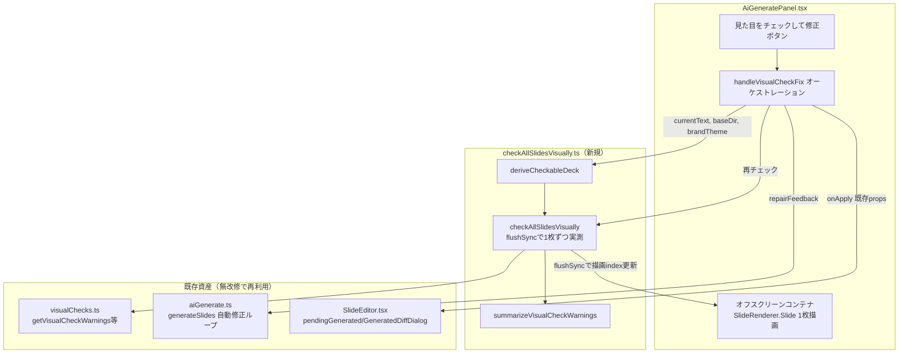

# 全スライドVisualCheck→AI修正機能

**ドキュメント種別:** 技術設計書 (Design Doc)
**SDDフェーズ:** Plan (計画/設計)
**最終更新日:** 2026-08-27
**関連 Spec:** [ai-visual-check-and-fix_spec.md](./ai-visual-check-and-fix_spec.md)
**関連 PRD:** [ai-visual-check-and-fix.md](../requirement/ai-visual-check-and-fix.md)

---

# 1. 実装ステータス

**ステータス:** ✅ 実装済み。既存のVisualCheck機構（`src/visualChecks.ts`）と既存のAI生成機能（`src/aiGenerate.ts`・#14）の上に、編集画面から両者を橋渡しする一括チェック→修正フローを追加した。`npm run typecheck` / `npm run format:check` / `npm run lint:css`（本機能はCSS変更なしのため対象外の確認のみ）/ `npx vitest run`（98ファイル・1679テスト）が green。実機（Playwright・screenshot モード）でボタンの配置・ラベル・事前ゲート連動を確認済み。実際のAI往復（Vertex AI / 外部CLIへの実呼び出し）は、開発サンドボックスにTauriランタイム・GCP認証・Claude CLIが無いため未検証で、利用者環境での実機確認が完了条件として残る。

## 1.1. 実装進捗

| モジュール/機能 | ステータス | 備考 |
|:---|:---|:---|
| 全スライド実測ロジック（`checkAllSlidesVisually.ts`） | ✅ | FR-002/004。`deriveCheckableDeck`・`checkAllSlidesVisually`・`summarizeVisualCheckWarnings` |
| オフスクリーン描画（`AiGeneratePanel.tsx` 内） | ✅ | FR-002。`SlideRenderer.Slide` を非表示コンテナで1枚ずつ描画し `flushSync` で同期コミット |
| 一括チェック→AI修正→再チェックのオーケストレーション | ✅ | FR-003/004/005/006/007/008。`handleVisualCheckFix`（`AiGeneratePanel.tsx`） |
| `SlideEditor.tsx` からの `baseDir`/`brandTheme` 伝播 | ✅ | NFR-002。ライブプレビューと同じ実測規則にするための1行（2 props追加） |
| i18n（`aiGenerate.visualCheck*`） | ✅ | ja-JP/en-US/fr-FR の3ロケールに7キーを追加（フラットな2階層命名） |
| 単体テスト | ✅ | `checkAllSlidesVisually.test.tsx`（7件）・`AiGeneratePanel.test.tsx` 追加分（5件） |
| 実機（Vertex AI / 外部CLIへの実際のAI往復） | 🔴 | 開発サンドボックスでは検証不可。利用者環境での確認が必要（§9.3） |

---

# 2. 設計目標

1. **既存の安全性・確認フローを損なわない** — 新しいAI呼び出し口・適用経路を作らず、既存の自動修正ループ（`generateSlides`）・差分確認ダイアログ（`GeneratedDiffDialog`）・事前ゲート・安全退避をそのまま再利用する（DC-001）。
2. **実測の忠実性** — オフスクリーン実測がライブプレビューと異なる結果を出さないよう、アセットパス解決（`resolveLocalAssetPaths`）・ブランドテーマ合成（`mergeThemeData`）・キャンバスサイズ（`resolveCanvasSize`）をライブプレビュー（`SlideEditor.tsx`）と同一の導出規則で行う（NFR-002）。
3. **描画ロジックの非重複** — オフスクリーン描画は既存の本番同一レンダラ（`SlideRenderer.Slide`）をそのまま使い、新しい描画コンポーネントを作らない（DC-002）。
4. **コストの境界付け** — 警告0件ならAIを呼ばない。チェック→修正→再チェックのラウンド数に上限を設け、無制限のAI呼び出しを避ける（NFR-003）。
5. **最小の変更範囲** — 既存の差分確認ダイアログ・`SlideEditor` の適用経路（`applyGeneratedSlides`/`pendingGenerated`）には触れず、`SlideEditor.tsx` の変更を1行（`baseDir`/`brandTheme` の2 props追加）に限定する。

---

# 3. 技術スタック

| 領域 | 採用技術 | 選定理由 |
|:---|:---|:---|
| オフスクリーン実測の同期コミット | `react-dom` の `flushSync` | 「状態を更新→直後にDOMを実測する」という明確な同期パターンに合致する公式API。`useEffect` ベースの状態機械（indexを進める→effectで実測→次のindexへ）より単純で、`checkAllSlidesVisually` を素直な `for` ループ＋`await`として書ける |
| オフスクリーン描画コンポーネント | 既存 `SlideRenderer.Slide` ＋ `LazyImageContext.Provider value={false}`（`SlidePreview.tsx` と同じ組み合わせ） | 本番同一レンダラの再利用（DC-002）。`SlidePreview.tsx` 自体（`ResizeObserver`によるスケール計算を持つ）は再利用しない — スケールが既定値0.3から実際の値へ非同期に収束する過程を挟むため、実測タイミングとの整合を取りにくい（§9.1で検討） |
| 実測ロジック | 既存 `getVisualCheckWarnings` / `waitForImagesToSettle` / `waitForLayoutToSettle`（`src/visualChecks.ts`） | 既存のVisualCheck機構を再実装せず再利用（DC-002）。ライブ実行時の `useVisualCheckWarnings` と同じ3関数の組み合わせ |
| AI呼び出し・自動修正ループ | 既存 `generateSlides`（`src/aiGenerate.ts`） | 既存の自動修正ループ・事前ゲート・安全退避をそのまま再利用（DC-001）。`repairFeedback` は元々「次試行に積む検証エラー要約」を渡す設計であり、初回呼び出しから独自の要約文字列を渡すことも契約上問題ない |
| 適用・確認UI | 既存 `GeneratedDiffDialog` / `SlideEditor.applyGeneratedSlides` | 新規UIを作らず既存のAI生成結果と同一の確認・適用フローに統合（FR-006） |

---

# 4. アーキテクチャ

## 4.1. システム構成図



自動修正ループそのもの（スキーマ検証・`repairFeedback`の再投入）は `aiGenerate.ts` が既存のとおり駆動する。本機能が新設するのは「①全スライドを実測して警告を集める」「②警告を`repairFeedback`形式に整形して初回投入する」「③AI修正後に再実測して残警告を判定し、必要なら②へ戻る」という**外側の**オーケストレーションであり、`generateSlides` 自体の内部（試行回数・スキーマ検証）には変更を加えない。

## 4.2. モジュール分割

| モジュール名 | 責務 | 依存関係 | 配置場所 |
|:---|:---|:---|:---|
| `checkAllSlidesVisually` | 全スライドのオフスクリーン実測・警告集約・repairFeedback形式への整形 | `visualChecks`, `slidesSerialize`, `localSlideLoader`, `applyTheme`, `sections`, `react-dom`(`flushSync`) | `src/edit/checkAllSlidesVisually.ts`（新規） |
| `AiGeneratePanel` | 新規ボタン・オフスクリーン描画・一括チェック→修正→再チェックのオーケストレーション（既存の生成UIに追加） | `checkAllSlidesVisually`, `aiGenerate`（再利用）, `components/SlideRenderer`, `components/FallbackImage`, `hooks/useReveal`(`resolveCanvasSize`), `theme`(`presentationTheme`) | `src/edit/AiGeneratePanel.tsx`（改修） |
| `SlideEditor` | `AiGeneratePanel` へ `baseDir`/`brandTheme` を渡す（既に自身で計算済みの値を渡すのみ） | `AiGeneratePanel` | `src/edit/SlideEditor.tsx`（改修・1行・2 props追加） |
| `visualChecks` | VisualCheck実測（既存・無改修） | なし | `src/visualChecks.ts`（**再利用**） |
| `aiGenerate` | 生成・自動修正ループ（既存・無改修） | なし | `src/aiGenerate.ts`（**再利用**） |

---

# 5. データモデル

`slides.json` のデータ構造（`PresentationData`/`SlideData`等）は既存 `src/data/types.ts` をそのまま用いる。本機能が追加するのは、オフスクリーン実測に必要な「導出済みデッキ」と「スライド単位の実測結果」の2型のみ。

```typescript
// src/edit/checkAllSlidesVisually.ts
export interface CheckableDeck {
  slides: SlideData[]
  logo?: LogoConfig
  confidential?: ConfidentialConfig
  theme?: ThemeData
  sections: SectionInfo[]
}

export interface SlideVisualCheckResult {
  index: number
  slideId: string
  warnings: string[]
}
```

`CheckableDeck` は `SlideEditor.tsx` が自身の描画（`previewData`/`effectiveTheme`/`sections`）のために行っている導出（`resolveLocalAssetPaths` → `mergeThemeData` → `buildSections`）と同じ手順を、`AiGeneratePanel` 内で `currentText`（またはAI修正候補のJSON文字列）に対して独立に再現したものである。

---

# 6. インターフェース定義

```typescript
// src/edit/checkAllSlidesVisually.ts（新規）
export function deriveCheckableDeck(text: string, baseDir: string, brandTheme: ThemeData | undefined): CheckableDeck | null
// JSON構文/構造エラー時はnull（「警告0件」と区別してチェック不能を表す。D-002）

export async function checkAllSlidesVisually(
  slides: SlideData[],
  setCheckIndex: (index: number) => void,   // オフスクリーンJSXの描画対象indexを切り替えるReact state setter
  getSection: () => HTMLElement | null,     // 直近のflushSyncコミット後にオフスクリーンコンテナから section.slide-container を取り直す
): Promise<SlideVisualCheckResult[]>

export function summarizeVisualCheckWarnings(results: SlideVisualCheckResult[]): string
// "- slides[{index}]（id: {slideId}）: {warning}" 形式の行に整形し、そのまま repairFeedback として渡せる文字列にする
```

```typescript
// src/edit/AiGeneratePanel.tsx（改修）— checkAllSlidesVisually の呼び出し口。
// deriveCheckableDeck が null（JSON構文/構造エラー）を返した場合は runVisualCheck も null を返し、
// 呼び出し元（handleVisualCheckFix）は「チェック不能」（エラー表示）と「警告0件」（成功表示）を
// 明確に分けて扱う。0スライド（空デッキ）は警告があり得ないため意図的に空配列 [] を返す（null とは区別）
async function runVisualCheck(text: string): Promise<SlideVisualCheckResult[] | null>
```

```tsx
// src/edit/AiGeneratePanel.tsx（改修）— props拡張
function AiGeneratePanel({
  currentText, onApply, defaultExpanded,
  baseDir = '',          // 新規: SlideEditor.tsx の source.baseDir と同じ値
  brandTheme,            // 新規: SlideEditor.tsx の brandTheme state と同じ値
}: { /* ... */ })
```

```tsx
// src/edit/SlideEditor.tsx（改修・1行）
<AiGeneratePanel currentText={text} onApply={applyGeneratedSlides} defaultExpanded={source.aiPanelExpanded}
  baseDir={source.baseDir} brandTheme={brandTheme} />
```

---

# 7. 非機能要件実現方針

| 要件 | 実現方針 |
|:---|:---|
| NFR-001（互換性・リグレッションなし） | 既存の `generateSlides`／`getVisualCheckWarnings`／`GeneratedDiffDialog`／`SlideEditor` の既存コードパスは無改修（`SlideEditor.tsx` は新規propsを渡す1行のみ）。`npm run typecheck`／`test`／`format:check`／`lint:css` を green 維持 |
| NFR-002（実測の忠実性） | `deriveCheckableDeck` が `SlideEditor.tsx` の `previewData`/`effectiveTheme`/`sections` と同じ導出手順（`resolveLocalAssetPaths` → `mergeThemeData` → `buildSections`）をそのまま再現する。オフスクリーンコンテナは `resolveCanvasSize` で決まるキャンバス実寸をtransform scaleなしで使う（`SlidePreview` のスケーラーは使わない） |
| NFR-003（コスト境界） | `MAX_VISUAL_FIX_ROUNDS = 2`（`AiGeneratePanel.tsx` の定数）。警告0件時はAI呼び出し自体をスキップする（FR-003） |
| NFR-004（非ブロッキング） | オフスクリーンコンテナは `position: fixed; left: -100000px` で画面外に配置し、通常の編集操作（JSON編集・プレビュー切替）とDOM上競合しない |

---

# 8. テスト戦略

| テストレベル | 対象 | カバレッジ目標 |
|:---|:---|:---|
| Vitest 単体 | `checkAllSlidesVisually`（警告あり/なしスライドの混在・sectionが取得できないindexのスキップ）、`summarizeVisualCheckWarnings`（整形書式・空配列時）、`deriveCheckableDeck`（正常系・JSON構文エラー時null） | 分岐網羅（`checkAllSlidesVisually.test.tsx` 7件） |
| Vitest component | `AiGeneratePanel` の新規ボタン（事前ゲート連動）、警告0件時にAIを呼ばない、警告ありでrepairFeedback付きでgenerateSlidesを呼ぶ、再チェックで警告が残る場合の表示、generateSlides失敗時にonApplyを呼ばない | `checkAllSlidesVisually` をモックしオーケストレーションのみ検証（`AiGeneratePanel.test.tsx` 追加5件） |
| 手動（実ブラウザ・Playwright screenshot モード） | ボタンの配置・ラベル・事前ゲートによる無効化状態の目視確認 | 実施済み（本ドキュメント執筆時点） |
| 手動（実機・利用者環境） | Vertex AI / 外部CLIへの実際のAI呼び出し・修正・差分確認ダイアログでの適用の一連 | 未実施（§9.3の未解決課題） |

**実装結果**: Vitest 98ファイル・1679テスト（本機能追加分13件を含む）で green（テスト件数は実行結果に基づく。将来のテスト追加でドリフトし得るため、正の情報源は `npx vitest run` の実行結果とする）。

---

# 9. 設計判断

## 9.1. 決定事項

| 決定事項 | 選択肢 | 決定内容 | 理由 |
|:---|:---|:---|:---|
| オフスクリーン実測の同期方式 | (A) `flushSync` で同期コミット直後に測定 / (B) `useEffect` ベースの状態機械 | **(A) flushSync** | 「更新→直後に測定」という単純な逐次処理として書ける。(B)は index の遷移をeffectの依存配列で駆動する必要があり、`checkAllSlidesVisually` の `for` ループ構造と噛み合わない |
| オフスクリーン描画の再利用対象 | (A) `SlideRenderer.Slide` を直接使う / (B) `SlidePreview` コンポーネントをそのまま流用 | **(A) SlideRenderer.Slide 直接** | `SlidePreview` は `ResizeObserver` で初期値0.3から実際のスケールへ非同期に収束する。この収束を待たずに測定すると誤った縮小サイズを実測してしまう。`waitForLayoutToSettle` はCSS Animation/Transitionを監視する設計であり、命令的なstyle更新（ResizeObserver由来のscale変更）を捕捉できないため、スケール変化に依存しない(A)を選んだ |
| VisualCheck警告のAIへの投入経路 | (A) 既存の`repairFeedback`にそのまま乗せる / (B) 専用のAI呼び出し口を新設する | **(A) 既存repairFeedbackへ合流** | `GenerateRequest.repairFeedback`は「初回は省略可能な検証エラー要約」という契約であり、VisualCheck警告も同じ形式（`- path: message`相当の行の集合）に整形できる。専用の呼び出し口を作ると事前ゲート・中断・差分確認・安全退避を二重に実装する必要が生じる（DC-001） |
| 実測に必要な情報（baseDir/brandTheme）の受け渡し | (A) `AiGeneratePanel` に新規propsとして渡す / (B) `AiGeneratePanel`内で`currentText`のみから完全に自己完結させる | **(A) 新規props（baseDir/brandTheme）を追加** | (B)は当初案だったが、`SlideEditor.tsx`の`previewData`（アセットパス解決）・`effectiveTheme`（ブランドテーマ合成）は`baseDir`/`brandTheme`という`AiGeneratePanel`が元々持っていない情報に依存するため、`currentText`のみでは実測結果がライブプレビューと食い違う可能性がある（NFR-002）。`SlideEditor.tsx`側の変更を1行（2 props追加）に抑えられる範囲であるため許容した |
| AI修正指示の内容 | (A) 文言・構成の調整のみを指示する固定プロンプト / (B) 検出パターンに応じた個別の修正指示 | **(A) 固定プロンプト** | AIはslides.jsonのみを操作でき実装コードは変更できないため、指示を「内容調整のみ」に明示することで自然に実装非破壊な修正に収まる（DC-003）。パターン別の個別指示（B）は警告文字列のバリエーションに応じた複雑な分岐が必要になり過剰設計 |
| 再チェックのラウンド数上限 | (A) 1回（AI修正→即差分確認） / (B) 上限を設けた複数回（実装は2） | **(B) 2ラウンド** | AI修正後に警告が残っていないかを確認する機会を最低1回設けたい一方、無制限に繰り返すとコスト・待ち時間が増大する。既存の自動修正ループ（`MAX_GENERATE_ATTEMPTS=3`）とは独立した外側の上限として2に設定した（NFR-003） |
| ボタンの配置場所 | (A) パネル見出し（開閉トグル）の隣 / (B) 実行/中断ボタン（「生成」ボタン）の隣 | **(B) 生成ボタンの隣** | 利用者の要望「AI生成ボタンの隣に」は、実際にAI呼び出しを行う「生成」ボタン（パネル展開後の実行行）を指すと解釈した。この行には既存の`kind`（内蔵/外部）選択・事前ゲート・プロンプト入力等の文脈が揃っており、同じ文脈を共有するボタンとして自然に置ける |
| チェック不能（JSON構文エラー）時の扱い | (A) 空配列 `[]` を返し「警告0件」と同じ扱いにする / (B) `null` を返し呼び出し元で明確に区別する | **(B) null で区別**（レビューで判明・実装を修正） | 初期実装は(A)だった。JSON編集中に構文エラーの状態でボタンを押すと、実際には何も検証していないにもかかわらず「見た目の問題は見つかりませんでした」という成功メッセージが表示され、D-002（バリデーションエラーは構造化して報告する）に反していた。`runVisualCheck`の戻り値型を`SlideVisualCheckResult[] \| null`に変更し、`handleVisualCheckFix`側で`null`のとき専用のエラー文言（`aiGenerate.visualCheckInvalidJson`）を表示するよう修正した |

## 9.2. 原則準拠チェックリスト

- [x] A-001（コンポーネント分離）: 全スライド実測ロジックを`checkAllSlidesVisually.ts`として`AiGeneratePanel`から分離し、単一責務を保った
- [x] A-002（スタイルの階層管理）: 新規ボタン・進捗表示は既存の`--fixed-*` CSS変数を使用し、色値をハードコードしていない
- [x] A-003（データ駆動型スライドアーキテクチャ）: オフスクリーン描画は既存の`SlideRenderer.Slide`をそのまま使い、新しい描画コンポーネントを作っていない
- [x] A-005（フォールバックファースト設計）: `generateSlides`が`failed`/`cancelled`を返した場合は既存と同じく`onApply`を呼ばず、器に触れず退避する
- [ ] D-001（Specification-Driven）: **違反**。本機能は`_spec.md`/`_design.md`が存在しない状態で実装が先行し、本ドキュメントは実装完了後に遡及的に作成した（§10 変更履歴参照）。今後は同種の逸脱を避け、実装前に仕様書を作成する
- [x] D-002（バリデーション駆動型データ処理）: `deriveCheckableDeck`はJSON構文/構造エラー時に`null`を返し、`runVisualCheck`/`handleVisualCheckFix`が「チェック不能」を「警告0件」と区別して報告する（当初は区別していない実装ミスがあり、レビューで修正済み。上表参照）
- [x] T-001（TypeScript Strict Mode）: 新規ファイルは`tsc --noEmit`でエラーなし

## 9.3. 未解決の課題

| 課題 | 影響度 | 対応方針 |
|:---|:---|:---|
| 実機でのAI往復の未検証 | 中 | 開発サンドボックスにTauriランタイム・GCP認証・Claude CLIが無く、実際のAI呼び出しを確認できていない。利用者環境（`npm run tauri:dev`）での動作確認を完了条件として残す |
| DOM実測フェーズ（AI呼び出し前）のキャンセル不可 | 低 | 現状「中断」ボタンは`cancelGenerate()`（AI呼び出しフェーズ）のみを止める。全スライド実測自体はDOM操作のみで高速なため、v1では中断対象に含めていない |
| 大量スライド時の実測時間 | 低 | スライド枚数に比例して`waitForImagesToSettle`/`waitForLayoutToSettle`の待機時間が積算される。進捗表示（FR-008）で緩和しているが、上限枚数のガードは設けていない |

---

# 10. 変更履歴

## v0.1（2026-08-27）

**変更内容:**

- 初版。既存のVisualCheck機構と既存のAI生成機能（自動修正ループ・差分確認ダイアログ）を橋渡しする「全スライドVisualCheck→AI修正」機能を実装（`checkAllSlidesVisually.ts`新規・`AiGeneratePanel.tsx`/`SlideEditor.tsx`改修・i18n3ロケール追加・単体テスト12件追加）。本ドキュメントは実装完了後に遡及的に作成した（PRDレビューで指摘済み。§1.1参照）。
