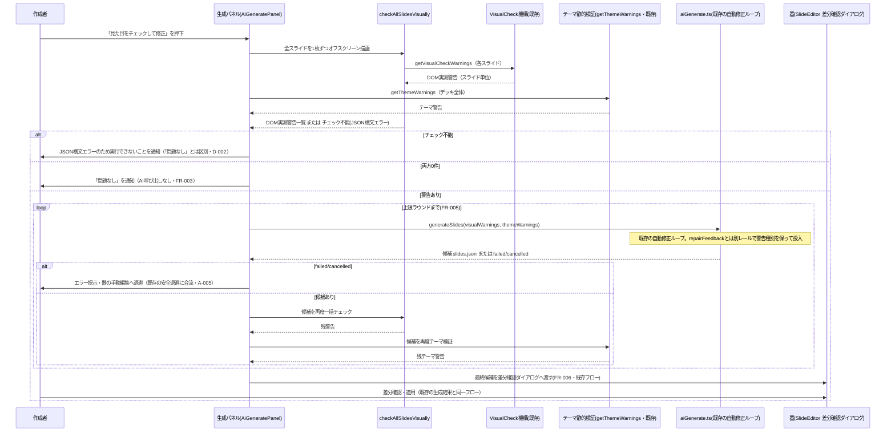

# 全スライドVisualCheck→AI修正機能

**ドキュメント種別:** 抽象仕様書 (Spec)
**SDDフェーズ:** Specify (仕様化)
**最終更新日:** 2026-08-28
**関連 Design Doc:** [ai-visual-check-and-fix_design.md](./ai-visual-check-and-fix_design.md)
**関連 PRD:** [ai-visual-check-and-fix.md](../requirement/ai-visual-check-and-fix.md)

---

# 1. 背景

既存の VisualCheck 機構（はみ出し・セーフエリア侵入・装飾との重なり・埋める要素の高さ0・内部クリッピングの5種を検出）は、ライブ実行中に「現在表示している1枚のスライド」の DOM 実測を前提とする設計であり、編集中に全スライドを一括でチェックする手段がない。見た目の破綻は個別スライドを目視するか、配布サンプル・基準見本デッキ向けのCIスクリプト（Playwright経由）の実行結果を待つまで気づけない。

既存のAI生成機能（[ai-slide-generation_spec.md](./ai-slide-generation_spec.md)）は「生成 → 構造・スキーマ検証 → 検証エラー要約を次試行へ再投入する」自動修正ループを持つが、これはスキーマ適合性のみを検証対象としており、実際の描画結果（レイアウト実測）を検証入力として使う経路を持たない。

本仕様は、[slide-edit-mode_spec.md](./slide-edit-mode_spec.md) が提供する器（`SlideEditor` の単一真実源）と、[ai-slide-generation_spec.md](./ai-slide-generation_spec.md) が提供する生成インターフェース・自動修正ループ・差分確認ダイアログを上流に持ち、これらを再利用してVisualCheckの警告を修正対象に取り込む。

# 2. 概要

編集画面の生成パネル（`AiGeneratePanel`）に、既存の生成ボタンと同じ文脈で使える新規ボタンを追加し、押下すると①全スライドを1枚ずつオフスクリーンで実測してDOM実測警告を集約するとともにテーマ設定の静的検証警告（`getThemeWarnings`）も収集し、②警告があれば種別ごとに専用フィールド（`visualWarnings`/`themeWarnings`）へ整形して既存の自動修正ループへ投入し、③修正結果を再度実測・再検証して警告が残っていれば上限ラウンドまで繰り返し、④最終候補を既存の差分確認ダイアログへ渡す。本仕様は PRD の **UR-001**（全スライドの見た目チェックとAI修正）と **UR-002**（既存資産の再利用による安全性の継承）を満たすことを目的とする。設計原則は以下のとおり。

- **警告種別を保った既存生成インターフェースへの合流**: DOM実測警告（`getVisualCheckWarnings`）とテーマ設定の静的検証警告（`getThemeWarnings`）を、混同されない専用フィールド（`GenerateRequest.visualWarnings`/`.themeWarnings`）としてそれぞれ投入し、既存の検証エラー要約再投入経路（`repairFeedback`）とは別レールで扱う。既存の生成インターフェース（内蔵/外部の切替を含む）はそのまま呼び出す（**FR-004・DC-001**）。プロンプト構築側（Rust `user_prompt()`）が警告種別ごとに適切な指示文を生成し、意味論のズレ（検証エラー文脈でテーマ値調整を指示してしまう等）を避ける。
- **本番同一レンダラでのオフスクリーン実測**: 全スライドの実測は、既存の本番同一レンダラ（`SlideRenderer.Slide`）を画面外に描画して行い、専用の描画ロジックを新設しない（**FR-002・DC-002**）。実測はライブプレビューと同じ規則（アセットパス解決・ブランドテーマ合成）で行う（**NFR-002**）。
- **既存フローへの統合**: 最終候補は既存の差分確認ダイアログへ渡し、新規の適用経路は作らない。事前ゲート・中断は既存の生成ボタンと共有し相互排他にする（**FR-006・FR-007**）。
- **無駄なAI呼び出しの回避と上限制御**: DOM実測・テーマ検証のいずれも警告が0件ならAIを呼ばない（**FR-003**）。チェック→修正→再チェックのラウンド数に上限を設け、上限到達後も警告が残る場合は残数を明示してそのまま次工程へ進める（**FR-005・NFR-003**）。
- **内容・テーマ設定調整限定のAI指示＋逸脱防止ガードレール**: AIへの指示はスライドの文言・構成の調整、またはテーマ設定（色・フォント等）の値調整に限定し、レイアウトの実装やコンポーネントの使い方を変える指示は行わない（**DC-003**）。加えて、警告（`visualWarnings`/`themeWarnings`）を1件以上投入する場合、Rust側プロンプトの末尾に「指摘箇所以外は変更しない」旨のガードレールを付与し、検証対象外フィールド（`speakerNotes`等）への無関係な書き換えを抑制する（**DC-003 の実装上の具体化**。指摘外フィールドの書き換えは既存の検証（構造/スキーマ/テーマ）を素通りするため、実機検証で判明した必要な補強）。

**個別スライド単位でのチェック・検出パターンごとの専用修正ロジック・チェック実行中（DOM実測フェーズ）のキャンセル・結果の永続化はスコープ外**（PRD §7）。

# 3. 要求定義

## 3.1. 機能要件 (Functional Requirements)

| ID | 要件 | 優先度 | 根拠（PRD） |
|:---|:---|:---|:---|
| FR-001 | 生成パネルに、既存の生成ボタンと同じ文脈（実行/中断の行）に新規ボタンを設け、押下で全スライドの一括チェックを開始する | 必須 | FR-001 / UR-001 / DC-004 |
| FR-002 | 全スライドを1枚ずつオフスクリーンに実描画し、既存のVisualCheck機構で警告を検出してスライド単位（index・id）で集約する。同時にテーマ設定の静的検証警告（`getThemeWarnings`）も収集する（PRD未記載の拡張。§10 v0.4参照） | 必須 | FR-002 / UR-001 / DC-002 |
| FR-003 | DOM実測・テーマ検証のいずれも警告が0件の場合はAIを呼び出さず「問題なし」を通知して終了する | 必須 | FR-003 / UR-001 |
| FR-004 | 警告がある場合は種別（DOM実測=`visualWarnings`／テーマ検証=`themeWarnings`）ごとに専用フィールドへ整形して既存の自動修正ループへ投入し、AIに内容調整またはテーマ設定調整のみでの修正を指示する。1件以上投入する場合は「指摘箇所以外は変更しない」ガードレールを付与する | 必須 | FR-004 / UR-001 / UR-002 / DC-001 / DC-003 |
| FR-005 | AI修正結果を再チェックし、警告が残る場合は上限ラウンド数まで再投入する。上限到達後も残る場合は残数を明示する | 必須 | FR-005 / UR-001 |
| FR-006 | 最終候補は既存の差分確認ダイアログへ渡し、新規の適用経路を作らない | 必須 | FR-006 / UR-002 |
| FR-007 | 既存の生成の事前ゲート（内蔵=Vertex設定済み／外部=CLI利用可能）と中断を、本機能のボタンと共有し相互排他にする | 推奨 | FR-007 / UR-002 |
| FR-008 | 実行中は段階（チェック中・修正依頼中・再チェック中）と既存の試行回数表示を提示する | 推奨 | FR-008 / UR-001 / DC-004 |

## 3.2. 非機能要件 (Non-Functional Requirements)

| ID | カテゴリ | 優先度 | 要件 | 目標値／根拠（PRD） |
|:---|:---|:---|:---|:---|
| NFR-001 | 互換性 | 必須 | 既存の表示・編集・AI生成・保存・書き出し機能が従来どおり動作。typecheck/test/lint 通過 | NFR-001 |
| NFR-002 | 信頼性 | 必須 | オフスクリーン実測がライブプレビューと同じ規則（アセット解決・ブランドテーマ合成）で行われる | NFR-002 |
| NFR-003 | 信頼性／コスト | 推奨 | チェック→修正→再チェックのラウンド数に上限（2ラウンド）を設けコスト・時間の増大を防ぐ | NFR-003 |
| NFR-004 | ユーザビリティ | 推奨 | オフスクリーン描画が画面上に表示されず、通常の編集操作を妨げない | NFR-004 |

# 4. API

本仕様で追加・変更する公開インターフェース（実装詳細・技術選定は Design Doc 参照）。

| ディレクトリ | ファイル名 | エクスポート | 概要 |
|:---|:---|:---|:---|
| `src/edit` | `checkAllSlidesVisually.ts`（新規） | `deriveCheckableDeck` / `checkAllSlidesVisually` / `formatSlideVisualWarnings` | 全スライドのオフスクリーン実測とDOM実測警告集約、`GenerateRequest.visualWarnings`形式への整形（FR-002/004）。見出し・箇条書き記号はRust側`user_prompt()`が付与するため付けない |
| `src/edit` | `AiGeneratePanel.tsx`（改修） | `<AiGeneratePanel currentText onApply defaultExpanded baseDir brandTheme />`（`baseDir`/`brandTheme` を新規追加） | 新規ボタン・オフスクリーン描画・実行フローの追加。テーマ静的検証（`getThemeWarnings`）も呼び出し`visualWarnings`/`themeWarnings`の2フィールドで`generateSlides`へ渡す。既存 `currentText` / `onApply` はそのまま再利用（FR-001/002/003/004/005/006/007/008） |
| `src/edit` | `SlideEditor.tsx`（改修） | `<AiGeneratePanel>` 呼び出しへ `baseDir`/`brandTheme` を渡す1行のみ | オフスクリーン実測をライブプレビューと同じ規則にするための情報を渡す（NFR-002）。`onApply`/差分確認ダイアログ側は無改修 |
| `src` | `applyTheme.ts`（再利用・無改修） | `getThemeWarnings` | テーマ設定の静的検証警告を取得する（FR-002） |
| `src` | `aiGenerate.ts`（改修） | `generateSlides` / `GenerateRequest.visualWarnings` / `GenerateRequest.themeWarnings`（新規フィールド） | 既存の自動修正ループ（`repairFeedback`）とは別レールの警告種別フィールドを追加し、そのまま呼び出す（FR-004。詳細は [ai-slide-generation_spec.md](./ai-slide-generation_spec.md) §4.1） |
| `src` | `visualChecks.ts`（再利用・無改修） | `getVisualCheckWarnings` / `waitForImagesToSettle` / `waitForLayoutToSettle` | 既存のVisualCheck機構をオフスクリーン描画に対しても呼び出す（FR-002） |

## 4.1. 型定義

```typescript
// src/edit/checkAllSlidesVisually.ts — 全スライド一括チェックの契約型
export interface CheckableDeck {
  slides: SlideData[]
  logo?: LogoConfig
  confidential?: ConfidentialConfig
  theme?: ThemeData
  sections: SectionInfo[]
}

export interface SlideVisualCheckResult {
  index: number
  slideId: string
  warnings: string[]
}

export function deriveCheckableDeck(text: string, baseDir: string, brandTheme: ThemeData | undefined): CheckableDeck | null
export function checkAllSlidesVisually(
  slides: SlideData[],
  setCheckIndex: (index: number) => void,
  getSection: () => HTMLElement | null,
): Promise<SlideVisualCheckResult[]>
// "slides[{index}]（id: {slideId}）: {warning}" 形式の文字列配列に整形する。
// 見出し・箇条書き記号（`- `）は Rust 側 user_prompt() が付与するため付けない
export function formatSlideVisualWarnings(results: SlideVisualCheckResult[]): string[]
```

```typescript
// src/aiGenerate.ts（改修）— GenerateRequest への追加フィールド（詳細は ai-slide-generation_spec.md §4.1）
// getThemeWarnings（src/applyTheme.ts）の戻り値はそのまま themeWarnings として渡せる（追加整形不要）
interface GenerateRequest {
  // ...既存フィールド（prompt/kind/baseSlides/repairFeedback/promptIntent）は変更なし
  visualWarnings?: string[]  // formatSlideVisualWarnings の戻り値（DOM実測。repairFeedbackとは別レール）
  themeWarnings?: string[]   // getThemeWarnings の戻り値（テーマ静的検証。同じく別レール）
}
```

# 5. 用語集

| 用語 | 説明 |
|:---|:---|
| VisualCheck | はみ出し・セーフエリア侵入・装飾との重なり・埋める要素の高さ0・内部クリッピングの5種を検出する既存の仕組み（`getVisualCheckWarnings`） |
| テーマ静的検証 | `theme.colors`のコントラスト不足・未知キー・未登録アイコン名等をJSONの構造から検証する既存の仕組み（`getThemeWarnings`）。DOM実測（VisualCheck）とは検証の種類が異なる |
| 自動修正ループ | 生成結果が検証に通らない場合、検証エラー要約を次の試行に再投入して上限回数まで修正を試みる既存の仕組み（[ai-slide-generation_spec.md](./ai-slide-generation_spec.md)） |
| repairFeedback | 自動修正ループで次試行に積む**構造/スキーマ検証エラー**の要約文字列（`GenerateRequest.repairFeedback`）。本機能のVisualCheck/テーマ警告はこの経路を使わず、別レール（`visualWarnings`/`themeWarnings`）を使う |
| visualWarnings／themeWarnings | 本機能が追加した`GenerateRequest`の専用フィールド。それぞれDOM実測警告・テーマ静的検証警告を保持し、Rust側`user_prompt()`が種別ごとに異なる指示文＋逸脱防止ガードレールを生成する（詳細は [ai-slide-generation_spec.md](./ai-slide-generation_spec.md) §4.1） |
| 差分確認ダイアログ | AI生成・修正結果を器へ適用する前に変更内容を確認する既存UI（`GeneratedDiffDialog`） |
| オフスクリーン描画 | 画面には表示せず、既存の本番同一レンダラ（`SlideRenderer.Slide`）で1枚のスライドを描画して実測する手法 |
| 器（うつわ） | 編集・保存・書き出しの基盤（[slide-edit-mode_spec.md](./slide-edit-mode_spec.md) が提供する `SlideEditor` の単一真実源） |

# 6. 使用例

```tsx
// AiGeneratePanel.tsx 内の実行フロー（概念例。実装詳細は Design Doc 参照）
async function handleVisualCheckFix() {
  let results = await runVisualCheck(currentText) // FR-002: 全スライドを1枚ずつ実測しつつテーマ静的検証も収集
  if (results === null) {
    showStatus('JSONの構文エラーのため実行できません', 'error') // D-002: 「問題なし」とは区別する
    return
  }
  if (results.slideResults.length === 0 && results.themeWarnings.length === 0) {
    showStatus('問題は見つかりませんでした') // FR-003: AIを呼ばずに終了
    return
  }

  let baseSlides = currentText
  let visualWarnings = formatSlideVisualWarnings(results.slideResults)
  let themeWarnings = results.themeWarnings
  let candidate

  for (let round = 1; round <= MAX_VISUAL_FIX_ROUNDS; round++) {
    // FR-004: 既存の自動修正ループを再利用。repairFeedbackとは別の専用フィールドに警告種別を保って渡す
    const result = await generateSlides({ prompt: VISUAL_FIX_PROMPT, kind, baseSlides, visualWarnings, themeWarnings, promptIntent: 'change-instruction' })
    candidate = toGeneratedCandidate(result)
    if (!candidate) break // failed/cancelled: 既存の安全退避に合流

    results = await runVisualCheck(candidate.slidesJson) // FR-005: 再チェック
    if (results.slideResults.length === 0 && results.themeWarnings.length === 0) break
    baseSlides = candidate.slidesJson
    visualWarnings = formatSlideVisualWarnings(results.slideResults)
    themeWarnings = results.themeWarnings
  }

  if (candidate) onApply(candidate) // FR-006: 既存の差分確認ダイアログへ合流
}
```

# 7. 振る舞い図

## 7.1. 全スライドチェック → AI修正 → 差分確認のフロー



# 8. 制約事項

- 全スライドの実測は既存の本番同一レンダラ（`SlideRenderer.Slide`）をそのまま使い、専用の描画ロジックを新設しない（DC-002）。
- AIへの修正指示はスライドの文言・構成の調整、またはテーマ設定（色・フォント等）の調整に限定し、レイアウトの実装やコンポーネントの使い方を変える指示は行わない（DC-003）。加えて、警告投入時は「指摘箇所以外は変更しない」ガードレールを付与し、検証対象外フィールドへの無関係な書き換えを防ぐ。
- 最終候補の適用は既存の差分確認ダイアログに一本化し、本機能専用の適用経路・確認UIを作らない（FR-006）。
- 新規に追加するボタン・進捗表示は既存の編集モードUIと同じテーマCSS変数を用いる（DC-004 / A-002）。

---

# 9. 原則への言及

| 原則ID | 原則名 | 本仕様での適用内容 |
|:---|:---|:---|
| A-001 | コンポーネント分離 | 全スライド実測ロジックを `checkAllSlidesVisually.ts` として生成パネルから分離する |
| A-002 | スタイルの階層管理 | 新規ボタン・進捗表示はテーマCSS変数を用い色値をハードコードしない（DC-004） |
| A-003 | データ駆動型スライドアーキテクチャ | オフスクリーン実測は既存の `SlideRenderer.Slide` をそのまま用い、専用描画ロジックを新設しない（DC-002） |
| A-005 | フォールバックファースト設計 | AI呼び出しの失敗・中断時は既存の安全退避（器に触れない）にそのまま合流する |
| D-002 | バリデーション駆動型データ処理 | `deriveCheckableDeck` はJSON構文/構造エラー時に `null` を返し、呼び出し元は「警告0件」と区別してチェック不能として扱う |
| B-001 | 表示品質の優先 | 見た目の破綻を編集時点で検出・修正できるようにし、表示品質を損なう要因を配布前に減らす |

# 10. PRD 整合性レビュー結果

関連 PRD: [ai-visual-check-and-fix.md](../requirement/ai-visual-check-and-fix.md)

| チェック項目 | 結果 |
|:---|:---|
| 要求カバレッジ（FR） | ✅ PRD の FR-001〜008 をすべて spec の FR-001〜008 に対応付け |
| 要求 ID 参照 | ✅ 各機能要件に PRD の FR/UR/DC ID を「根拠」列で明記 |
| 非機能要件の反映 | ✅ PRD の NFR-001〜004 を spec の NFR-001〜004 に反映 |
| 設計制約の反映 | ✅ DC-001〜003 を制約事項・各 FR で参照。DC-004 は FR-001/FR-008 の根拠列と制約事項の両方で参照 |
| 用語整合性 | ✅ VisualCheck／自動修正ループ／repairFeedback／差分確認ダイアログ／オフスクリーン描画／器 を PRD と統一 |
| PRD未記載の拡張 | ⚠️ テーマ静的検証（`getThemeWarnings`）警告の対象化、`visualWarnings`/`themeWarnings`専用フィールドへの分離、逸脱防止ガードレールの3点は、実装後に判明した不具合（AIが指摘外のフィールドを書き換える）への対応として追加され、PRD には対応する FR/DC が無い（既存の DC-003・FR-002/004 の拡張として spec に反映。§11 変更履歴 v0.4 参照）。PRD 自体の改訂は本更新のスコープ外とした |

# 11. 変更履歴

## v0.4（2026-08-28・テーマ警告の統合とRust側ガードレール追加）

**変更内容:**

- `getThemeWarnings`（テーマ設定の静的検証）の警告も本機能のチェック対象に統合した（FR-002拡張）。
- DOM実測警告・テーマ警告を、既存の`repairFeedback`（構造/スキーマ検証エラー専用）とは別の専用フィールド（`GenerateRequest.visualWarnings`/`.themeWarnings`）でRustへ送るように変更した（FR-004改訂）。実機検証で、テーマ警告が`repairFeedback`の「前回の出力の検証エラー」という文脈に混在してAIに伝わり、指示の性質（テーマ設定値の調整）と提示文脈（構文/内容エラー修正）がズレる不具合が判明したための対応。
- 併せて、警告投入時に「指摘箇所以外は変更しない」ガードレールをRust側プロンプトへ追加した。`speakerNotes`等の検証対象外フィールドへの無関係な書き換えが検証をすり抜けて`succeeded`として通ってしまう不具合への対応（DC-003の実装上の具体化）。
- `checkAllSlidesVisually.ts`の旧`summarizeVisualCheckWarnings`（1本の文字列に整形する関数。廃止済み）を`formatSlideVisualWarnings`（文字列配列を返す関数。見出し・箇条書き記号はRust側`user_prompt()`が付与）に置き換えた。<!-- doc-check-ignore -->
- 詳細な設計判断は [ai-visual-check-and-fix_design.md](./ai-visual-check-and-fix_design.md) §9.1、Rust側`GenerateRequest`型の変更は [ai-slide-generation_spec.md](./ai-slide-generation_spec.md) §4.1 を参照。

## v0.1（2026-08-27）

**変更内容:**

- 初版。
