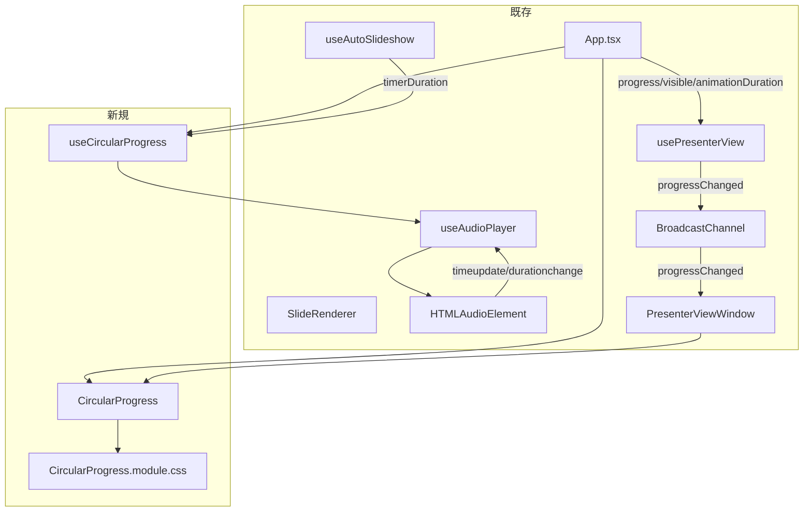

# 自動スクロールプログレスバー（Auto Scroll Progress Bar）

**ドキュメント種別:** 技術設計書 (Design Doc)
**SDDフェーズ:** Plan (計画/設計)
**最終更新日:** 2026-02-02
**関連 Spec:** [auto-scroll-progress-bar_spec.md](./auto-scroll-progress-bar_spec.md)
**関連 PRD:** [auto-scroll-progress-bar.md](../requirement/auto-scroll-progress-bar.md)

---

# 1. 実装ステータス

**ステータス:** 🟢 実装済み

## 1.1. 実装進捗

| モジュール/機能                 | ステータス | 備考                                                                        |
|--------------------------|-------|---------------------------------------------------------------------------|
| useCircularProgress フック  | 🟢    | 進行率算出ロジック（audio/timer/none の判定、クランプ、ゼロ除算防止）                               |
| CircularProgress コンポーネント | 🟢    | UI表示（SVGリングによる円形プログレス、音声モード: CSS transition / タイマーモード: CSS @keyframes）    |
| useAudioPlayer への進行情報追加  | 🟢    | currentTime/duration の公開（timeupdate/durationchange/loadedmetadata イベント経由） |
| App.tsx への統合             | 🟢    | useCircularProgress フック呼び出し + AudioControlBar 経由で円形プログレスを表示               |
| 発表者ビューへの統合               | 🟢    | BroadcastChannel 経由の progressChanged メッセージ + ボタン周囲にリング表示                  |

---

# 2. 設計目標

1. **既存アーキテクチャとの一貫性**: 既存の `useAudioPlayer`、`useAutoSlideshow` フックのパターンに従い、プログレスバーのロジックをカスタムフックとして分離する
2. **最小限の変更**: 既存コードへの変更を最小限にし、主に新規ファイルの追加で実現する
3. **タイマー統合**: `useAutoSlideshow` から `timerDuration` を受け取り、CSS @keyframes アニメーションで滑らかに進行表示する
4. **テーマ統合**: CSS変数を活用し、テーマカラーとの統一感を保つ（A-002 準拠）
5. **デュアルビュー対応**: メインウィンドウと発表者ビューの両方でプログレスバーを表示し、既存の BroadcastChannel
   通信パターンに従って進行状況を同期する

---

# 3. 技術スタック

| 領域               | 採用技術                                            | 選定理由                                                                             |
|------------------|-------------------------------------------------|----------------------------------------------------------------------------------|
| UI               | React コンポーネント + SVG                             | 既存のコンポーネントアーキテクチャに準拠（A-001）。SVG circle で円形リングを描画                                 |
| ロジック             | React カスタムフック                                   | 既存の useAudioPlayer, useAutoSlideshow パターンとの一貫性                                   |
| アニメーション（音声モード）   | CSS transition (stroke-dashoffset 0.3s ease)    | React state で更新される progress 値の変化を CSS で滑らかに補間                                    |
| アニメーション（タイマーモード） | CSS @keyframes (circularFill)                   | ブラウザ GPU で 0→100% を滑らかに補間。React state の毎フレーム更新が不要でカクつかない                         |
| スタイリング           | CSS Modules                                     | コンポーネント固有スタイルの管理（A-002 の3層モデル準拠）                                                 |
| 音声進行取得           | HTMLAudioElement timeupdate/durationchange イベント | 既存の useAudioPlayer が内部で管理する Audio 要素から進行情報を取得。durationchange で duration の取得漏れを防止 |

---

# 4. アーキテクチャ

## 4.1. システム構成図



## 4.2. モジュール分割

| モジュール名                      | 責務                                        | 依存関係                                                 | 配置場所                                       |
|-----------------------------|-------------------------------------------|------------------------------------------------------|--------------------------------------------|
| useCircularProgress         | 進行率の算出と表示状態の管理                            | useAudioPlayer の戻り値、useAutoSlideshow の timerDuration | src/hooks/useCircularProgress.ts           |
| CircularProgress            | 円形プログレスの描画（2モード: transition / @keyframes） | なし（props のみ）                                         | src/components/CircularProgress.tsx        |
| CircularProgress.module.css | 円形プログレスのスタイル定義（transition + @keyframes）   | CSS変数（--theme-*, --circumference）                    | src/components/CircularProgress.module.css |

## 4.3. 既存コードへの変更

| 対象ファイル                                 | 変更内容                                                                                      | 理由                                                    |
|----------------------------------------|-------------------------------------------------------------------------------------------|-------------------------------------------------------|
| src/hooks/useAudioPlayer.ts            | `currentTime` と `duration` を戻り値に追加。`durationchange` イベント対応、`timeupdate` 内での duration 同期   | 音声再生の進行情報をプログレスバーに提供するため。loadedmetadata が発火しないケースへの対策 |
| src/App.tsx                            | useCircularProgress フックの呼び出しと AudioControlBar 経由で円形プログレスを表示                               | 円形プログレスの統合                                            |
| src/components/AudioControlBar.tsx     | progress/progressVisible/animationDuration/progressResetKey props を追加、自動スライドショーボタンにリングを統合 | メインウィンドウでの円形プログレス表示                                   |
| src/hooks/usePresenterView.ts          | `PresenterViewMessage` に `progressChanged` メッセージ型を追加（animationDuration フィールド含む）           | 発表者ビューへの進行状況同期                                        |
| src/components/PresenterViewWindow.tsx | 自動スライドショーボタン周囲に CircularProgress リングを配置                                                   | 発表者ビューでの円形プログレス表示                                     |

---

# 5. データモデル

```typescript
/** useAudioPlayer の戻り値への追加 */
interface UseAudioPlayerReturn {
  // 既存フィールド
  playbackState: AudioPlaybackState
  play: (src: string) => void
  stop: () => void
  isPlaying: boolean
  onEndedRef: React.MutableRefObject<(() => void) | null>
  // 追加フィールド
  currentTime: number   // 現在の再生位置（秒）
  duration: number      // 音声の総時間（秒）
}

/** useCircularProgress の入力 */
interface UseCircularProgressOptions {
  autoSlideshow: boolean
  hasVoice: boolean
  audioProgress: AudioProgress | null
  /** タイマーがアクティブな場合の総時間（秒）。非アクティブ時は null */
  timerDuration: number | null
}

/** useCircularProgress の出力 */
interface UseCircularProgressReturn {
  progress: number
  source: 'audio' | 'timer' | 'none'
  visible: boolean
  /** タイマーモード時の CSS アニメーション用 duration（秒）。audio/none 時は undefined */
  animationDuration?: number
}

/** CircularProgress の props */
interface CircularProgressProps {
  /** 進行率（0.0〜1.0）。animationDuration 未指定時に使用 */
  progress: number
  /** 表示/非表示 */
  visible: boolean
  /** CSS アニメーションで 0→100% を補間する duration（秒）。指定時は progress を無視 */
  animationDuration?: number
  /** 変更するとアニメーションをリセットする key */
  resetKey?: string | number
}

/** BroadcastChannel progressChanged メッセージペイロード */
interface ProgressChangedPayload {
  progress: number
  visible: boolean
  animationDuration?: number
}
```

---

# 6. インターフェース定義

```typescript
/** useCircularProgress フック */
function useCircularProgress(options: UseCircularProgressOptions): UseCircularProgressReturn {
}

/** CircularProgress コンポーネント */
function CircularProgress(props: CircularProgressProps): JSX.Element | null {
}
```

---

# 7. 非機能要件実現方針

| 要件                       | 実現方針                                                                                                                                                 |
|--------------------------|------------------------------------------------------------------------------------------------------------------------------------------------------|
| 滑らかなアニメーション（FR-ASPB-004） | 音声モード: CSS `transition: stroke-dashoffset 0.3s ease` で React state 更新を滑らかに補間。タイマーモード: CSS `@keyframes circularFill` でブラウザ GPU による滑らかな 0→100% アニメーション |
| コンテンツ非干渉（DC_ASPB_002）    | ボタン周囲にリングとして配置し、スライドコンテンツ領域を占有しない                                                                                                                    |
| テーマ統合（DC_ASPB_001）       | リングの色に `var(--theme-primary)` を使用                                                                                                                    |
| ライフサイクル管理（DC_ASPB_003）   | useEffect のクリーンアップで timeupdate/durationchange/loadedmetadata イベントリスナーを解除                                                                             |

---

# 8. テスト戦略

| テストレベル  | 対象                       | カバレッジ目標                                                 |
|---------|--------------------------|---------------------------------------------------------|
| ユニットテスト | useCircularProgress フック  | 進行率算出ロジック（audio/timer/none の各ケース、animationDuration の返却） |
| ユニットテスト | CircularProgress コンポーネント | 表示/非表示切替、progress 値の反映                                  |
| ユニットテスト | useAudioPlayer 拡張        | currentTime/duration の正しい値返却                            |

---

# 9. 設計判断

## 9.1. 決定事項

| 決定事項               | 選択肢                                                                        | 決定内容                         | 理由                                                                                                                                                   |
|--------------------|----------------------------------------------------------------------------|------------------------------|------------------------------------------------------------------------------------------------------------------------------------------------------|
| アニメーション方式（音声モード）   | (a) CSS transition (b) requestAnimationFrame (c) CSS animation             | (a) CSS transition           | React state（audioPlayer.currentTime）の変化を `transition: stroke-dashoffset 0.3s ease` で滑らかに補間。timeupdate は約250ms間隔で発火するため、0.3s の transition で十分滑らか      |
| アニメーション方式（タイマーモード） | (a) CSS transition + rAF (b) CSS @keyframes (c) JS setInterval             | (b) CSS @keyframes           | React state の毎フレーム更新（rAF）は CSS transition と競合してカクつく。CSS @keyframes なら React の再レンダリング不要でブラウザ GPU が滑らかに補間。`animationDuration` で秒数を指定するだけ               |
| 音声進行の取得方法          | (a) useAudioPlayer を拡張 (b) 別途 Audio 参照を取得                                  | (a) useAudioPlayer を拡張       | 既存の Audio 要素管理の一元化を維持（A-001 準拠）。currentTime/duration を戻り値に追加するだけの最小変更                                                                                |
| duration 取得の信頼性向上  | (a) loadedmetadata のみ (b) durationchange 追加 (c) timeupdate 内でも同期           | (b) + (c) 併用                 | loadedmetadata が発火しないケース（ブラウザ差異、キャッシュ等）への対策。timeupdate 内で `isFinite(dur) && dur > 0` ガード付きで duration も同期                                             |
| スタイリング方式           | (a) CSS Modules (b) MUI sx prop (c) インラインスタイル                              | (a) CSS Modules              | コンポーネント固有の複雑なスタイル（position, transition, animation）を管理するため、A-002 の3層モデルに従い CSS Modules を採用                                                            |
| タイマープログレスのインターフェース | (a) TimerProgress { elapsed, total } (b) timerDuration: number &#124; null | (b) timerDuration            | CSS @keyframes 方式ではブラウザが 0→100% を自動補間するため、elapsed（経過時間）は不要。総時間（秒）のみで十分                                                                               |
| 円形プログレスの配置場所（メイン）  | (a) 各 section 内 (b) ボタン周囲にリング (c) position: fixed バー                       | (b) ボタン周囲にリング                | 自動スライドショーボタンの周囲に SVG リングとして配置。スライドコンテンツ領域を占有せず、ボタンの状態と視覚的に一体化する                                                                                      |
| 発表者ビューでの配置場所       | (a) コントロールバー下部バー (b) ウィンドウ最下部 (c) ボタン周囲にリング                                | (c) ボタン周囲にリング                | メインウィンドウと同じUI表現を提供。自動スライドショーボタンにリングを重ねることで、どのボタンに関連する進行状況かが直感的に分かる                                                                                   |
| 発表者ビューへの同期方式       | (a) BroadcastChannel 経由 (b) 発表者ビュー側で独立に算出                                  | (a) BroadcastChannel 経由      | 既存の usePresenterView の通信パターン（BroadcastChannel `'presenter-view'`）に従う。メインウィンドウで算出した progress/visible/animationDuration を送信し、発表者ビューは受信して表示するだけのシンプルな構成 |
| 円形プログレスの描画方式       | (a) CSS width バー (b) SVG stroke-dasharray リング (c) MUI CircularProgress     | (b) SVG stroke-dasharray リング | SVG の stroke-dasharray / stroke-dashoffset で時計回りアニメーションを実現。外部ライブラリ不要でサイズ・色のカスタマイズが容易。rotate(-90deg) で12時位置から開始                                       |

## 9.2. 未解決の課題

なし（タイマープログレスは `timerDuration: number | null` インターフェースで解決済み）
