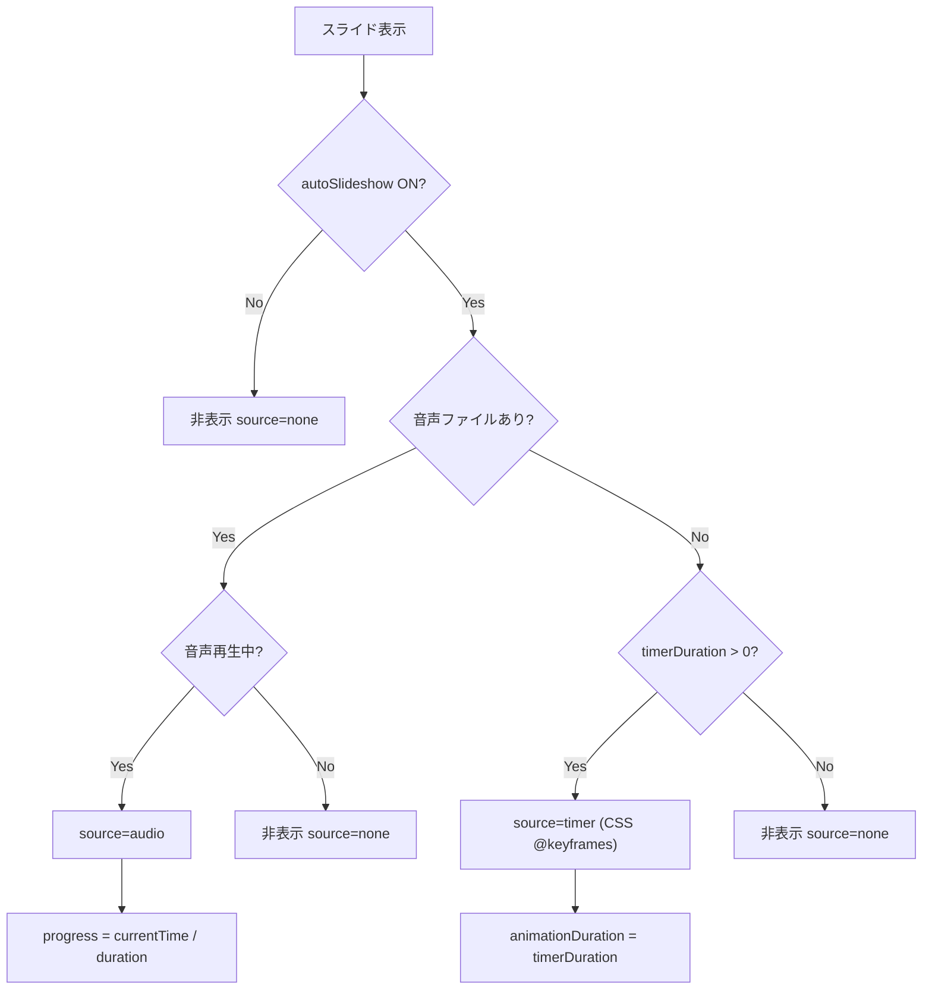
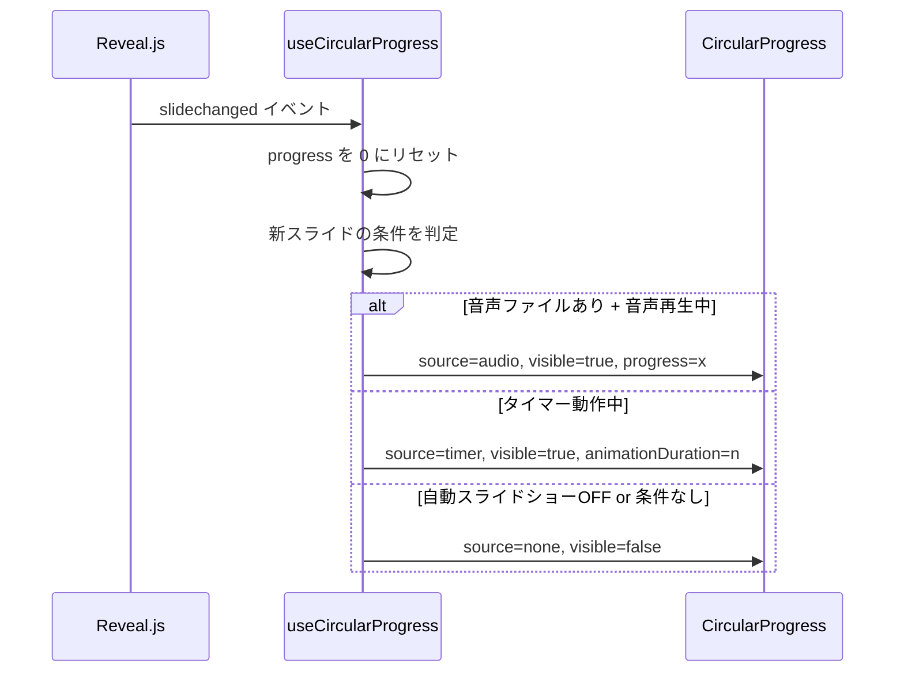
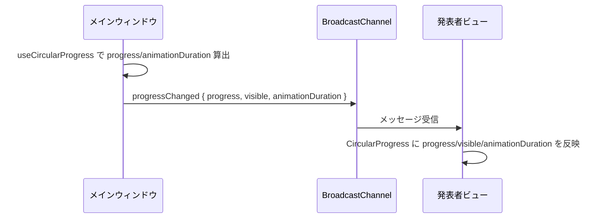

# 自動スクロールプログレスバー（Auto Scroll Progress Bar）

**ドキュメント種別:** 抽象仕様書 (Spec)
**SDDフェーズ:** Specify (仕様化)
**最終更新日:** 2026-02-02
**関連 Design Doc:** [auto-scroll-progress-bar_design.md](./auto-scroll-progress-bar_design.md)
**関連 PRD:** [auto-scroll-progress-bar.md](../requirement/auto-scroll-progress-bar.md)

---

# 1. 背景

プレゼンテーションの自動スクロール機能（音声再生トリガーおよびタイマーベース）では、発表者と聴衆が「いつ次のスライドに切り替わるのか」を把握する手段がない。これにより、発表者はスライド遷移のタイミングを予測できず、聴衆もコンテンツの読了ペースを調整しにくい状況が生じる。

メインウィンドウおよび発表者ビューの自動スライドショーボタン周囲に円形プログレス（SVGリング）を表示し、自動スクロールの進行状況を視覚的に示すことで、発表者と聴衆の双方が次スライドへの遷移タイミングを直感的に把握できるようにする。

# 2. 概要

自動スクロールプログレスバーは、自動スライドショーの進行状況を自動スライドショーボタンの周囲に表示する円形プログレス（SVGリング）で可視化するUI要素である。

**設計原則:**

- **2つの進行モード**: 音声再生の進行に連動するモード（React state + CSS transition）と、タイマーの経過に連動するモード（CSS @keyframes アニメーション）を提供する
- **非干渉**: スライドコンテンツの視認性・伝達力を損なわない補助的なUI要素として機能する。ボタン周囲のリングとして表示することでスライドコンテンツ領域を占有しない
- **状態連動**: 自動スライドショーのON/OFF状態に連動し、OFFの場合は非表示とする
- **デュアルビュー**: メインウィンドウと発表者ビューの両方に円形プログレスを表示し、同一の進行状況を同期する

# 3. 要求定義

## 3.1. 機能要件 (Functional Requirements)

| ID          | 要件                                                   | 優先度 | 根拠                                 |
|-------------|------------------------------------------------------|-----|------------------------------------|
| FR-ASPB-001 | 音声ファイル再生中に、再生開始から終了までの進行を円形プログレスで可視化する               | 必須  | PRD FR_ASPB_001: 音声再生の進行状況を可視化     |
| FR-ASPB-002 | タイマーベース自動スクロール中に、スライド表示から設定時間経過までの進行を円形プログレスで可視化する   | 必須  | PRD FR_ASPB_002: タイマー進行の可視化        |
| FR-ASPB-003 | 円形プログレスを自動スライドショーボタンの周囲にリングとして表示する                   | 推奨  | PRD FR_ASPB_003: スライドコンテンツと重ならない配置 |
| FR-ASPB-004 | 円形プログレスが12時位置から時計回りに滑らかなアニメーションで進行する                 | 推奨  | PRD FR_ASPB_004: 視覚的に自然な進行表現       |
| FR-ASPB-005 | 自動スライドショーがOFFの場合、円形プログレスを非表示にする                      | 推奨  | PRD FR_ASPB_005: 不要時の非表示           |
| FR-ASPB-006 | スライド切替時に円形プログレスを0%にリセットし、新しいスライドの条件に応じて再開する          | 推奨  | PRD FR_ASPB_006: スライド遷移時のリセット      |
| FR-ASPB-007 | 発表者ビューの自動スライドショーボタン周囲にも、メインウィンドウと同じ進行状況の円形プログレスを表示する | 推奨  | PRD FR_ASPB_007: 発表者ビューでの進行確認      |

# 4. API

## 4.1. 公開API一覧

| ディレクトリ          | ファイル名                  | エクスポート                | 概要                      |
|-----------------|------------------------|-----------------------|-------------------------|
| src/hooks/      | useCircularProgress.ts | `useCircularProgress` | 円形プログレスの進行率を算出するカスタムフック |
| src/components/ | CircularProgress.tsx   | `CircularProgress`    | 円形プログレスUI表示コンポーネント      |

## 4.2. 型定義

```typescript
/** 円形プログレスの進行ソース種別 */
type ProgressSource = 'audio' | 'timer' | 'none'

/** useCircularProgress フックの入力 */
interface UseCircularProgressOptions {
  /** 自動スライドショーが有効か */
  autoSlideshow: boolean
  /** 現在のスライドに音声ファイルがあるか */
  hasVoice: boolean
  /** 音声プレイヤーの進行情報（再生中のみ非 null） */
  audioProgress: AudioProgress | null
  /** タイマーがアクティブな場合の総時間（秒）。非アクティブ時は null */
  timerDuration: number | null
}

/** 音声再生の進行情報 */
interface AudioProgress {
  /** 現在の再生位置（秒） */
  currentTime: number
  /** 音声の総時間（秒） */
  duration: number
}

/** useCircularProgress フックの出力 */
interface UseCircularProgressReturn {
  /** 進行率（0.0〜1.0）。タイマーモードでは常に 0（CSS アニメーションが進行を担当） */
  progress: number
  /** 現在の進行ソース */
  source: ProgressSource
  /** 円形プログレスを表示するか */
  visible: boolean
  /** タイマーモード時の CSS アニメーション用 duration（秒）。audio/none 時は undefined */
  animationDuration?: number
}

/** 円形プログレスコンポーネントのプロパティ */
interface CircularProgressProps {
  /** 進行率（0.0〜1.0）。animationDuration 未指定時に使用 */
  progress: number
  /** 表示/非表示 */
  visible: boolean
  /** CSS アニメーションで 0→100% を補間する duration（秒）。指定時は progress を無視 */
  animationDuration?: number
  /** 変更するとアニメーションをリセットする key */
  resetKey?: string | number
}
```

# 5. 用語集

| 用語                         | 説明                                    |
|----------------------------|---------------------------------------|
| 円形プログレス（Circular Progress） | 自動スクロールの進行状況をボタン周囲のSVGリングで可視化するUI要素   |
| 音声プログレス（Audio Progress）    | 音声ファイル再生の進行に基づくプログレスの表示モード。React state + CSS transition で描画 |
| タイマープログレス（Timer Progress）  | タイマーベース自動スクロールの進行に基づくプログレスの表示モード。CSS @keyframes で描画 |
| スクロールスピード（Scroll Speed）    | 音声未定義スライドで次スライドへ自動遷移するまでの待機時間（秒）      |
| 進行ソース（Progress Source）     | 円形プログレスの進行率を決定する情報源（audio/timer/none） |

# 6. 使用例

## 6.1. メインウィンドウでの使用（AudioControlBar 経由）

```tsx
import { AudioControlBar } from './AudioControlBar'
import { useCircularProgress } from '../hooks/useCircularProgress'

function App() {
  const { progress, visible, animationDuration } = useCircularProgress({
    autoSlideshow: true,
    hasVoice: true,
    audioProgress: { currentTime: 15, duration: 30 },
    timerDuration: null,
  })

  return (
    <AudioControlBar
      autoPlay={autoPlay}
      onAutoPlayChange={setAutoPlay}
      autoSlideshow={autoSlideshow}
      onAutoSlideshowChange={setAutoSlideshow}
      progress={progress}
      progressVisible={visible}
      animationDuration={animationDuration}
    />
  )
}
```

## 6.2. 発表者ビューでの使用（ボタン周囲にリング表示）

```tsx
import { CircularProgress } from './CircularProgress'

function PresenterViewWindow({ progressState }) {
  return (
    <div className={styles.audioControls}>
      {/* 自動スライドショーボタンをラッパーで囲み、リングを重ねる */}
      <div className={styles.buttonWrapper}>
        <button className={styles.audioButton}>{/* ... */}</button>
        <CircularProgress
          progress={progressState.progress}
          visible={progressState.visible}
          animationDuration={progressState.animationDuration}
        />
      </div>
    </div>
  )
}
```

# 7. 振る舞い図

## 7.1. 進行ソース判定フロー



## 7.2. スライド遷移時のリセット



## 7.3. 発表者ビューへの進行状況同期



# 8. 制約事項

- プログレスバーのスタイリングはCSS変数（`--theme-*`）を使用すること（CONSTITUTION A-002 準拠）
- プログレスバーはスライドコンテンツの視認性を損なわないこと（CONSTITUTION B-001 準拠）
- アニメーション・タイマーのライフサイクルは useEffect で管理すること（CONSTITUTION T-003 準拠）
- TypeScript strict モードで型安全性を確保すること（CONSTITUTION T-001 準拠）
- Reveal.js の DOM 構造との互換性を維持すること（CONSTITUTION T-002 準拠）

---

## PRD参照

- 対応PRD: [auto-scroll-progress-bar.md](../requirement/auto-scroll-progress-bar.md)
- カバーする要求: UR_ASPB_001, FR_ASPB_001, FR_ASPB_002, FR_ASPB_003, FR_ASPB_004, FR_ASPB_005, FR_ASPB_006,
  FR_ASPB_007, DC_ASPB_001, DC_ASPB_002, DC_ASPB_003
