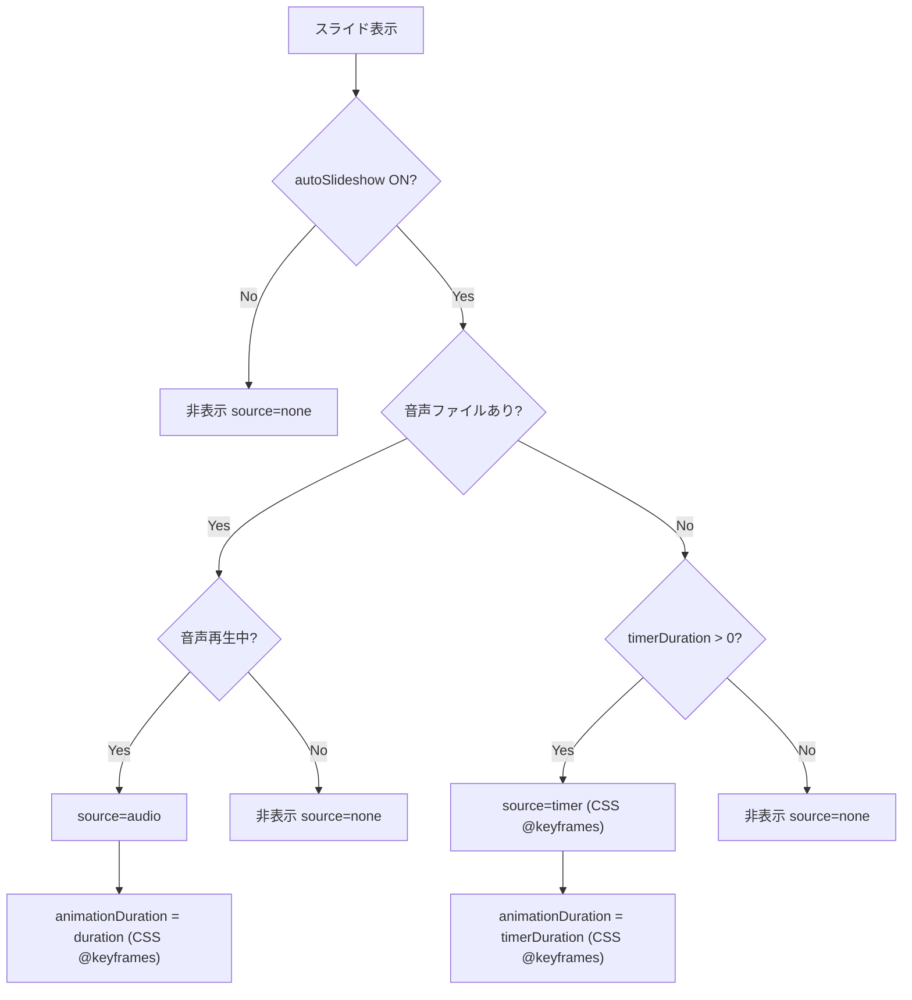
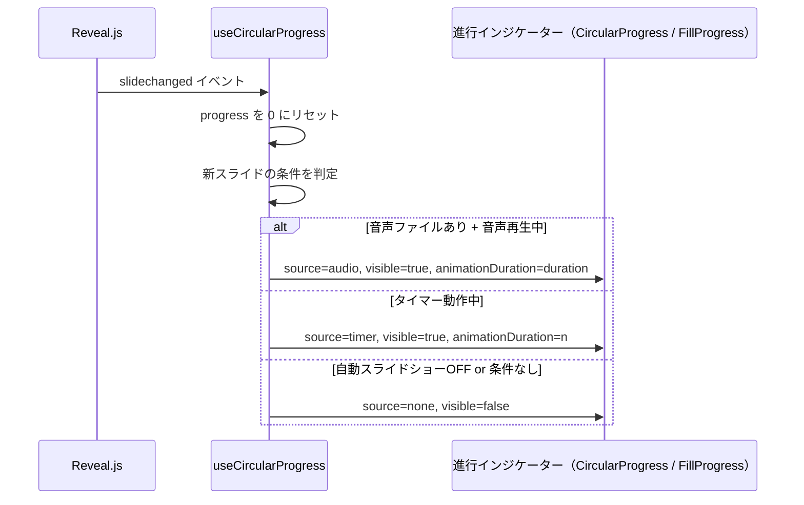
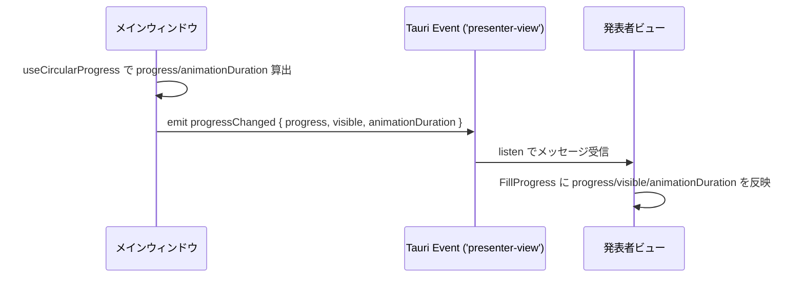

# 自動スクロールプログレスバー（Auto Scroll Progress Bar）

**ドキュメント種別:** 抽象仕様書 (Spec)
**SDDフェーズ:** Specify (仕様化)
**最終更新日:** 2026-07-24
**関連 Design Doc:** [auto-scroll-progress-bar_design.md](./auto-scroll-progress-bar_design.md)
**関連 PRD:** [auto-scroll-progress-bar.md](../requirement/auto-scroll-progress-bar.md)

---

# 1. 背景

プレゼンテーションの自動スクロール機能（音声再生トリガーおよびタイマーベース）では、発表者と聴衆が「いつ次のスライドに切り替わるのか」を把握する手段がない。これにより、発表者はスライド遷移のタイミングを予測できず、聴衆もコンテンツの読了ペースを調整しにくい状況が生じる。

自動スライドショーボタンに一体化した進行インジケーターを表示し、自動スクロールの進行状況を視覚的に示すことで、発表者と聴衆の双方が次スライドへの遷移タイミングを直感的に把握できるようにする。メインウィンドウはボタン周囲の円形プログレス（SVGリング）、発表者ビューはボタンを下から上へ塗りつぶすオーバーレイ（FillProgress）で表現する。

# 2. 概要

自動スクロールプログレスバーは、自動スライドショーの進行状況を自動スライドショーボタンに一体化して可視化するUI要素である。進行状態は共通のカスタムフック `useCircularProgress` が算出し、ビューごとに異なるコンポーネントで描画する。メインウィンドウは円形プログレス（`CircularProgress`：SVGリング）、発表者ビューは塗りつぶしオーバーレイ（`FillProgress`：ボタンを下から上へ塗る）を用いる。

**設計原則:**

- **2つの進行モード**: 音声再生の進行に連動するモードと、タイマーの経過に連動するモードを提供する。いずれも CSS @keyframes アニメーションで滑らかに進行を補間する
- **非干渉**: スライドコンテンツの視認性・伝達力を損なわない補助的なUI要素として機能する。自動スライドショーボタンに重ねて表示することでスライドコンテンツ領域を占有しない
- **状態連動**: 自動スライドショーのON/OFF状態に連動し、OFFの場合は非表示とする
- **デュアルビュー**: メインウィンドウ（円形プログレス）と発表者ビュー（塗りつぶしオーバーレイ）の両方に進行インジケーターを表示し、同一の進行状況を同期する。視覚表現はビューごとに異なるが、進行率・表示状態・アニメーション時間は共通

# 3. 要求定義

## 3.1. 機能要件 (Functional Requirements)

| ID          | 要件                                                   | 優先度 | 根拠                                 |
|-------------|------------------------------------------------------|-----|------------------------------------|
| FR-ASPB-001 | 音声ファイル再生中に、再生開始から終了までの進行を進行インジケーターで可視化する               | 必須  | PRD FR_ASPB_001: 音声再生の進行状況を可視化     |
| FR-ASPB-002 | タイマーベース自動スクロール中に、スライド表示から設定時間経過までの進行を進行インジケーターで可視化する   | 必須  | PRD FR_ASPB_002: タイマー進行の可視化        |
| FR-ASPB-003 | 進行インジケーターを自動スライドショーボタンに一体化して表示する（メイン=周囲のリング／発表者ビュー=ボタン上のオーバーレイ）   | 推奨  | PRD FR_ASPB_003: スライドコンテンツと重ならない配置 |
| FR-ASPB-004 | 進行インジケーターが0%から100%へ滑らかなアニメーションで進行する（メイン=12時位置から時計回り／発表者ビュー=下から上への塗りつぶし）                 | 推奨  | PRD FR_ASPB_004: 視覚的に自然な進行表現       |
| FR-ASPB-005 | 自動スライドショーがOFFの場合、進行インジケーターを非表示にする                      | 推奨  | PRD FR_ASPB_005: 不要時の非表示           |
| FR-ASPB-006 | スライド切替時に進行インジケーターを0%にリセットし、新しいスライドの条件に応じて再開する          | 推奨  | PRD FR_ASPB_006: スライド遷移時のリセット      |
| FR-ASPB-007 | 発表者ビューの自動スライドショーボタン上に、メインウィンドウと同じ進行状況の塗りつぶしオーバーレイ（FillProgress）を表示する | 推奨  | PRD FR_ASPB_007: 発表者ビューでの進行確認      |

# 4. API

## 4.1. 公開API一覧

| ディレクトリ          | ファイル名                  | エクスポート                              | 概要                                          |
|-----------------|------------------------|-------------------------------------|---------------------------------------------|
| src/hooks/      | useCircularProgress.ts | `useCircularProgress`               | 進行率・表示状態・アニメーション時間を算出する共通カスタムフック（メイン・発表者ビュー共用） |
| src/components/ | CircularProgress.tsx   | `CircularProgress`, `CircularProgressProps` | メインウィンドウ用の円形プログレスUI（SVGリング）表示コンポーネント          |
| src/components/ | FillProgress.tsx       | `FillProgress`, `FillProgressProps` | 発表者ビュー用の塗りつぶしオーバーレイUI（下から上へ塗る）表示コンポーネント      |

## 4.2. 型定義

```typescript
/** 円形プログレスの進行ソース種別 */
type ProgressSource = 'audio' | 'timer' | 'none'

/** useCircularProgress フックの入力 */
interface UseCircularProgressOptions {
  /** 自動スライドショーが有効か */
  autoSlideshow: boolean
  /** 現在のスライドに音声ファイルがあるか */
  hasVoice: boolean
  /** 音声プレイヤーの進行情報（再生中のみ非 null） */
  audioProgress: AudioProgress | null
  /** タイマーがアクティブな場合の総時間（秒）。非アクティブ時は null */
  timerDuration: number | null
}

/** 音声再生の進行情報 */
interface AudioProgress {
  /** 現在の再生位置（秒） */
  currentTime: number
  /** 音声の総時間（秒） */
  duration: number
}

/** useCircularProgress フックの出力 */
interface UseCircularProgressReturn {
  /** 進行率（0.0〜1.0）。audio/timer モードでは常に 0（CSS @keyframes アニメーションが進行を担当） */
  progress: number
  /** 現在の進行ソース */
  source: ProgressSource
  /** 円形プログレスを表示するか */
  visible: boolean
  /** CSS アニメーション用 duration（秒）。audio モード・timer モードで使用。none 時は undefined */
  animationDuration?: number
}

/** 円形プログレスコンポーネント（メインウィンドウ用）のプロパティ */
interface CircularProgressProps {
  /** 進行率（0.0〜1.0）。animationDuration 未指定時に使用 */
  progress: number
  /** 表示/非表示 */
  visible: boolean
  /** CSS アニメーションで 0→100% を補間する duration（秒）。指定時は progress を無視 */
  animationDuration?: number
  /** 変更するとアニメーションをリセットする key */
  resetKey?: string | number
}

/** 塗りつぶしオーバーレイコンポーネント（発表者ビュー用）のプロパティ。CircularProgressProps と同一形状で、描画表現のみ異なる */
interface FillProgressProps {
  /** 進行率（0.0〜1.0）。animationDuration 未指定時に使用（height に反映） */
  progress: number
  /** 表示/非表示 */
  visible: boolean
  /** CSS アニメーションで 0→100% を補間する duration（秒）。指定時は progress を無視 */
  animationDuration?: number
  /** 変更するとアニメーションをリセットする key */
  resetKey?: string | number
}
```

# 5. 用語集

| 用語                         | 説明                                    |
|----------------------------|---------------------------------------|
| 円形プログレス（Circular Progress） | メインウィンドウで自動スライドショーボタン周囲のSVGリングとして進行状況を可視化するUI要素（`CircularProgress`）   |
| 塗りつぶしオーバーレイ（Fill Progress） | 発表者ビューで自動スライドショーボタンを下から上へ塗りつぶすオーバーレイとして進行状況を可視化するUI要素（`FillProgress`） |
| 音声プログレス（Audio Progress）    | 音声ファイル再生の進行に基づくプログレスの表示モード。CSS @keyframes で描画（animationDuration = 音声の総時間） |
| タイマープログレス（Timer Progress）  | タイマーベース自動スクロールの進行に基づくプログレスの表示モード。CSS @keyframes で描画（animationDuration = スクロールスピード） |
| スクロールスピード（Scroll Speed）    | 音声未定義スライドで次スライドへ自動遷移するまでの待機時間（秒）      |
| 進行ソース（Progress Source）     | 進行率を決定する情報源（audio/timer/none）。共通フック useCircularProgress が判定する |

# 6. 使用例

## 6.1. メインウィンドウでの使用（AudioControlBar 経由）

```tsx
import { AudioControlBar } from './AudioControlBar'
import { useCircularProgress } from '../hooks/useCircularProgress'

function App() {
  const { progress, visible, animationDuration } = useCircularProgress({
    autoSlideshow: true,
    hasVoice: true,
    audioProgress: { currentTime: 15, duration: 30 },
    timerDuration: null,
  })

  return (
    <AudioControlBar
      autoPlay={autoPlay}
      onAutoPlayChange={setAutoPlay}
      autoSlideshow={autoSlideshow}
      onAutoSlideshowChange={setAutoSlideshow}
      progress={progress}
      progressVisible={visible}
      animationDuration={animationDuration}
    />
  )
}
```

## 6.2. 発表者ビューでの使用（ボタン上に塗りつぶしオーバーレイ表示）

```tsx
import { FillProgress } from './FillProgress'

function PresenterViewWindow({ progressState, currentIndex }) {
  return (
    <div className={styles.audioControls}>
      {/* 自動スライドショーボタンをラッパーで囲み、オーバーレイを重ねる */}
      <div className={styles.buttonWrapper}>
        <button className={styles.audioButton}>{/* ... */}</button>
        <FillProgress
          progress={progressState?.progress ?? 0}
          visible={progressState?.visible ?? false}
          animationDuration={progressState?.animationDuration}
          resetKey={currentIndex}
        />
      </div>
    </div>
  )
}
```

# 7. 振る舞い図

## 7.1. 進行ソース判定フロー


```mermaid
flowchart TD
    A[スライド表示] --> B{autoSlideshow ON?}
    B -- No --> C[非表示 source=none]
    B -- Yes --> D{音声ファイルあり?}
    D -- Yes --> E{音声再生中?}
    E -- Yes --> F[source=audio]
    E -- No --> G[非表示 source=none]
    D -- No --> H{timerDuration > 0?}
    H -- Yes --> I["source=timer (CSS @keyframes)"]
    H -- No --> J[非表示 source=none]
    F --> K["animationDuration = duration (CSS @keyframes)"]
    I --> L["animationDuration = timerDuration (CSS @keyframes)"]
```

## 7.2. スライド遷移時のリセット


```mermaid
sequenceDiagram
    participant Reveal as Reveal.js
    participant Hook as useCircularProgress
    participant Bar as 進行インジケーター（CircularProgress / FillProgress）
    Reveal ->> Hook: slidechanged イベント
    Hook ->> Hook: progress を 0 にリセット
    Hook ->> Hook: 新スライドの条件を判定
    alt 音声ファイルあり + 音声再生中
        Hook ->> Bar: source=audio, visible=true, animationDuration=duration
    else タイマー動作中
        Hook ->> Bar: source=timer, visible=true, animationDuration=n
    else 自動スライドショーOFF or 条件なし
        Hook ->> Bar: source=none, visible=false
    end
```

## 7.3. 発表者ビューへの進行状況同期


```mermaid
sequenceDiagram
    participant Main as メインウィンドウ
    participant EV as Tauri Event ('presenter-view')
    participant PV as 発表者ビュー
    Main ->> Main: useCircularProgress で progress/animationDuration 算出
    Main ->> EV: emit progressChanged { progress, visible, animationDuration }
    EV ->> PV: listen でメッセージ受信
    PV ->> PV: FillProgress に progress/visible/animationDuration を反映
```

# 8. 制約事項

- プログレスバーのスタイリングはCSS変数（`--theme-*`）を使用すること（CONSTITUTION A-002 準拠）
- プログレスバーはスライドコンテンツの視認性を損なわないこと（CONSTITUTION B-001 準拠）
- アニメーション・タイマーのライフサイクルは useEffect で管理すること（CONSTITUTION T-003 準拠）
- TypeScript strict モードで型安全性を確保すること（CONSTITUTION T-001 準拠）
- Reveal.js の DOM 構造との互換性を維持すること（CONSTITUTION T-002 準拠）

---

## PRD参照

- 対応PRD: [auto-scroll-progress-bar.md](../requirement/auto-scroll-progress-bar.md)
- カバーする要求: UR_ASPB_001, FR_ASPB_001, FR_ASPB_002, FR_ASPB_003, FR_ASPB_004, FR_ASPB_005, FR_ASPB_006,
  FR_ASPB_007, DC_ASPB_001, DC_ASPB_002, DC_ASPB_003

### 要求別充足度

| PRD要求ID    | 要求内容                          | 対応 Spec / 実装                                            | 充足 |
|-------------|-------------------------------|-------------------------------------------------------|----|
| UR_ASPB_001 | 進行インジケーターで遷移タイミングを可視化         | §2 / useCircularProgress + CircularProgress + FillProgress | ✅  |
| FR_ASPB_001 | 音声再生の進行を可視化                   | FR-ASPB-001 / source=audio・animationDuration=duration    | ✅  |
| FR_ASPB_002 | タイマー進行を可視化                    | FR-ASPB-002 / source=timer・animationDuration=timerDuration | ✅  |
| FR_ASPB_003 | ボタン一体化・スライドと非干渉               | FR-ASPB-003 / buttonWrapper 内にリング（メイン）・オーバーレイ（発表者ビュー）    | ✅  |
| FR_ASPB_004 | 0%→100% の滑らかなアニメーション          | FR-ASPB-004 / CSS @keyframes（circularFill / fillUp）      | ✅  |
| FR_ASPB_005 | 自動スライドショーOFF時は非表示             | FR-ASPB-005 / visible=false                             | ✅  |
| FR_ASPB_006 | スライド切替時に0%リセット               | FR-ASPB-006 / resetKey による再マウント                        | ✅  |
| FR_ASPB_007 | 発表者ビューへ同期表示                   | FR-ASPB-007 / Tauri Event `progressChanged` + FillProgress | ✅  |
| DC_ASPB_001 | CSS変数（--theme-*）準拠のスタイリング     | §8 / `var(--theme-primary)`                             | ✅  |
| DC_ASPB_002 | コンテンツ非干渉                      | §8 / 自動スライドショーボタンに重ねて表示                                | ✅  |
| DC_ASPB_003 | ライフサイクル管理（useEffect クリーンアップ）  | §8 / useAudioPlayer の useEffect で listener 解除            | ✅  |
