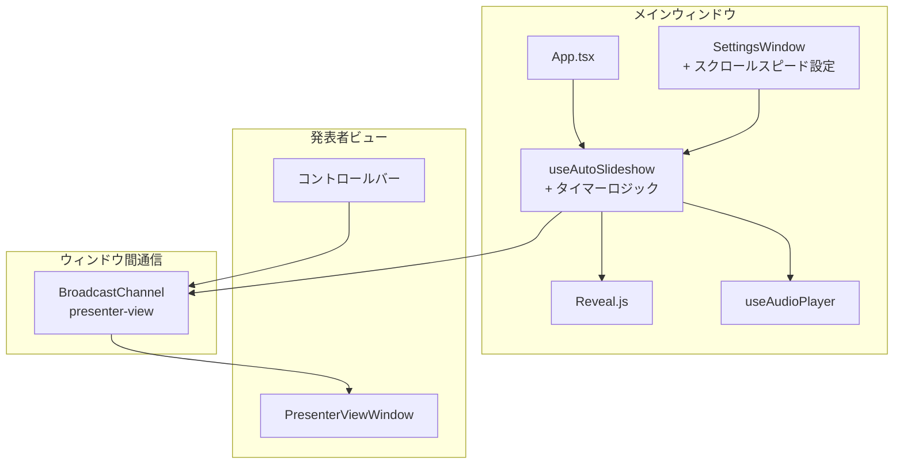

# タイマーベース自動スクロール（Auto Scroll Timer）

**ドキュメント種別:** 技術設計書 (Design Doc)
**SDDフェーズ:** Plan (計画/設計)
**最終更新日:** 2026-02-02
**関連 Spec:** [auto-scroll-timer_spec.md](./auto-scroll-timer_spec.md)
**関連 PRD:** [auto-scroll-timer.md](../requirement/auto-scroll-timer.md)

---

# 1. 実装ステータス

**ステータス:** 🟢 実装済み

## 1.1. 実装進捗

| モジュール/機能                     | ステータス    | 備考                      |
|------------------------------|----------|-------------------------|
| useAutoSlideshow タイマーロジック追加  | 🟢 実装済み  | 既存フックの拡張                |
| scrollSpeed 状態管理             | 🟢 実装済み  |                         |
| SettingsWindow スクロールスピード設定UI | 🟢 実装済み  |                         |
| BroadcastChannel スクロールスピード同期 | 🟢 実装済み  | 発表者ビューとの同期              |

---

# 2. 設計目標

1. **既存フックの拡張** — `useAutoSlideshow` フックにタイマーロジックを追加し、既存の自動スライドショー機能と統合する
2. **最小限の変更** — 新規コンポーネントの追加を最小限にし、既存のアーキテクチャに自然に統合する
3. **音声優先の明確化** — voice フィールドの有無でタイマーと音声トリガーを明確に切り替える
4. **設定UIの再利用** — language-settings 機能で実装される SettingsWindow にスクロールスピード設定を追加する
5. **ライフサイクル管理** — タイマーの作成・クリアを useEffect で適切に管理する（T-003 準拠）

---

# 3. 技術スタック

| 領域       | 採用技術                   | 選定理由                                                                |
|----------|------------------------|---------------------------------------------------------------------|
| タイマー     | setTimeout             | 一定時間後の1回実行に適しており、setInterval より制御が容易。スライド遷移ごとにリセットするためワンショットタイマーが自然 |
| 状態管理     | React useState         | scrollSpeed は既存の useAutoSlideshow フック内でローカル状態として管理。新たなContext追加は不要  |
| 設定UI     | ネイティブ HTML input + CSS Modules | SettingsWindow が CSS Modules で構築されており、MUI を使わずネイティブ要素で統一              |
| ウィンドウ間同期 | BroadcastChannel       | 既存の発表者ビュー通信基盤を拡張。新規メッセージタイプ `scrollSpeedChange` を追加                 |

---

# 4. アーキテクチャ

## 4.1. システム構成図



## 4.2. モジュール分割

| モジュール名                | 責務                          | 依存関係                   | 配置場所                                |
|-----------------------|-----------------------------|------------------------|-------------------------------------|
| useAutoSlideshow (拡張) | タイマーロジック、scrollSpeed 状態管理   | useAudioPlayer, Reveal | `src/hooks/useAutoSlideshow.ts`     |
| SettingsWindow (拡張)   | スクロールスピード入力UI               | useAutoSlideshow       | `src/components/SettingsWindow.tsx` |
| usePresenterView (拡張) | scrollSpeedChange メッセージの送受信 | BroadcastChannel       | `src/hooks/usePresenterView.ts`     |

## 4.3. useAutoSlideshow の変更概要

```
useAutoSlideshow (既存)
├── autoPlay 状態管理
├── autoSlideshow 状態管理
├── 音声自動再生（スライド変更時）
└── 音声終了 → 次スライド遷移

useAutoSlideshow (拡張後)
├── autoPlay 状態管理
├── autoSlideshow 状態管理
├── scrollSpeed 状態管理（localStorage 永続化付き） ← 追加
├── timerDuration 算出（プログレス表示用）            ← 追加
├── 音声自動再生（スライド変更時）
├── 音声終了/エラー → 次スライド遷移（エラー時はタイマーフォールバック）
└── タイマーベース自動遷移               ← 追加
    ├── voice 未定義スライドで setTimeout 開始
    ├── 音声読み込み失敗時のフォールバックとして setTimeout 開始 ← 追加
    ├── スライド変更時に clearTimeout
    ├── 最終スライドではタイマー不開始
    └── voice 定義済みかつ音声読み込み成功時はタイマー不開始
```

---

# 5. データモデル

## 5.1. スクロールスピードのデフォルト値と永続化

```typescript
const DEFAULT_SCROLL_SPEED = 20  // 秒
const SCROLL_SPEED_STORAGE_KEY = 'slide-app-scroll-speed'
```

scrollSpeed は `localStorage` に永続化される。初期値の決定順序:

1. `initialScrollSpeed` オプションが指定されていればその値
2. `localStorage` に保存値があり、有効な数値（≥ 1）であればその値
3. いずれもなければ `DEFAULT_SCROLL_SPEED`（20秒）

## 5.2. BroadcastChannel メッセージ拡張

```typescript
// 既存メッセージタイプに追加
type PresenterViewMessage =
  | { type: 'slideChanged'; payload: { currentIndex: number; slides: SlideData[] } }
  | { type: 'controlStateChanged'; payload: PresenterControlState }
  | { type: 'navigate'; payload: { direction: 'prev' | 'next' } }
  | { type: 'audioToggle' }
  | { type: 'autoPlayToggle' }
  | { type: 'autoSlideshowToggle' }
  | { type: 'scrollSpeedChange'; payload: { speed: number } }  // 追加
```

---

# 6. インターフェース定義

```typescript
/** UseAutoSlideshowOptions の拡張 */
interface UseAutoSlideshowOptions {
  slides: SlideData[]
  currentIndex: number
  audioPlayer: UseAudioPlayerReturn
  goToNext: () => void
  initialScrollSpeed?: number  // 初期スクロールスピード（秒）
}

/** UseAutoSlideshowReturn の拡張 */
interface UseAutoSlideshowReturn {
  autoPlay: boolean
  setAutoPlay: (enabled: boolean) => void
  autoSlideshow: boolean
  setAutoSlideshow: (enabled: boolean) => void
  scrollSpeed: number
  setScrollSpeed: (speed: number) => void
  /** タイマーがアクティブな場合の総時間（秒）。非アクティブ時は null。
   *  プログレス表示用に使用（→ [auto-scroll-progress-bar_design.md](./auto-scroll-progress-bar_design.md)） */
  timerDuration: number | null
}
```

---

# 7. 非機能要件実現方針

| 要件        | 実現方針                                                               |
|-----------|--------------------------------------------------------------------|
| タイマー精度    | setTimeout の精度で十分。秒単位の遷移にミリ秒精度は不要                                  |
| タイマーリーク防止 | useEffect のクリーンアップ関数で clearTimeout を実行。スライド変更・アンマウント時に確実にクリア       |
| 設定変更の即時反映 | scrollSpeed を useState で管理し、useEffect の依存配列に含めることで、変更時にタイマーが再設定される |

---

# 8. テスト戦略

| テストレベル     | 対象                                        | カバレッジ目標 |
|------------|-------------------------------------------|---------|
| ユニットテスト    | useAutoSlideshow: voice 未定義時のタイマー開始       | 主要パス    |
| ユニットテスト    | useAutoSlideshow: voice 定義済み時のタイマー不動作     | 主要パス    |
| ユニットテスト    | useAutoSlideshow: voice 定義済みだが音声読み込み失敗時のタイマーフォールバック | 主要パス    |
| ユニットテスト    | useAutoSlideshow: 最終スライドでのタイマー不動作         | 主要パス    |
| ユニットテスト    | useAutoSlideshow: 手動スライド移動時のタイマーリセット      | 主要パス    |
| ユニットテスト    | useAutoSlideshow: scrollSpeed 変更時のタイマー再設定 | 主要パス    |
| コンポーネントテスト | SettingsWindow: スクロールスピード入力の動作            | ハッピーパス  |

---

# 9. 設計判断

## 9.1. 決定事項

| 決定事項              | 選択肢                                                                         | 決定内容                      | 理由                                                                                                       |
|-------------------|-----------------------------------------------------------------------------|---------------------------|----------------------------------------------------------------------------------------------------------|
| タイマー実装方式          | A) setTimeout B) setInterval C) requestAnimationFrame                       | **A) setTimeout**         | スライド遷移はワンショット実行であり、setTimeout が最も自然。setInterval は繰り返し実行のため制御が複雑になる。rAF はアニメーション用途で秒単位の遅延には不適切            |
| scrollSpeed の管理場所 | A) useAutoSlideshow 内 B) 新規Context C) App.tsx のprops                        | **A) useAutoSlideshow 内** | scrollSpeed は自動スライドショーロジックと密結合。既存フック内に状態を追加することで、外部への依存を最小化し、コンポーネント分離（A-001）を維持                         |
| 設定UIの配置先          | A) language-settings の SettingsWindow B) AudioControlBar に追加 C) 新規UIコンポーネント | **A) SettingsWindow**     | PRDの要求（FR_AST_002）で「設定ウィンドウから変更」と明記。language-settings の SettingsWindow（FR-LANG-010: 拡張性）に設定項目として追加するのが自然 |
| 自動スライドショートグルの共有   | A) 既存トグル共有 B) 別トグル新設                                                        | **A) 既存トグル共有**            | タイマーベース自動スクロールは自動スライドショーの一部（音声なしスライド向けの補完機能）であるため、既存の autoSlideshow トグルを共有。ユーザーに追加の操作負担を与えない             |

---

# 10. 変更履歴

## v1.1.0 (2026-02-02)

**実装との整合性修正:**

- `UseAutoSlideshowReturn` に `timerDuration: number | null` を追加（プログレス表示用、auto-scroll-progress-bar_design.md 参照）
- `PresenterViewMessage` の既存メッセージ型を実装に合わせて `payload` ラッパー形式に修正
- `scrollSpeed` の `localStorage` 永続化仕様を追記（初期値決定順序を明記）
- `useAutoSlideshow` の変更概要に `timerDuration` 算出と localStorage 永続化を追記

## v1.0.0 (2026-02-01)

**初版作成:**

- タイマーベース自動スクロール機能の技術設計を策定
- 既存 useAutoSlideshow フックの拡張方針を決定
- setTimeout によるワンショットタイマーを採用
- language-settings の SettingsWindow にスクロールスピード設定を統合する方針を決定
