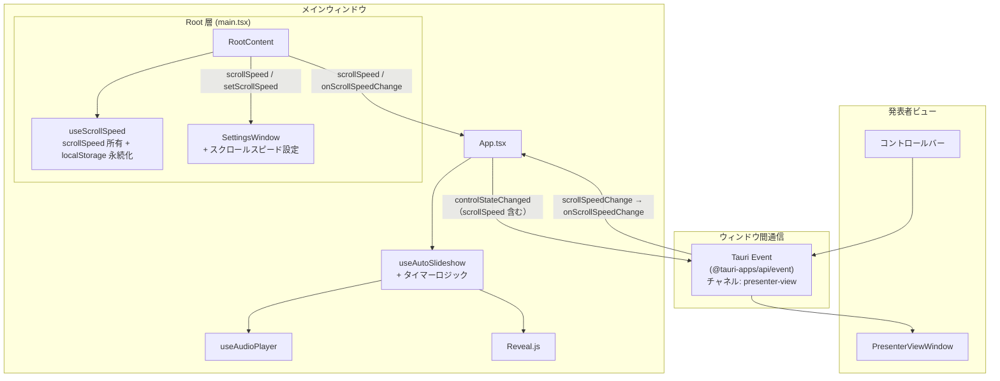

# タイマーベース自動スクロール（Auto Scroll Timer）

**ドキュメント種別:** 技術設計書 (Design Doc)
**SDDフェーズ:** Plan (計画/設計)
**最終更新日:** 2026-07-28
**関連 Spec:** [auto-scroll-timer_spec.md](./auto-scroll-timer_spec.md)
**関連 PRD:** [auto-scroll-timer.md](../requirement/auto-scroll-timer.md)

---

# 1. 実装ステータス

**ステータス:** 🟢 実装済み

## 1.1. 実装進捗

| モジュール/機能                     | ステータス    | 備考                      |
|------------------------------|----------|-------------------------|
| useAutoSlideshow タイマーロジック追加  | 🟢 実装済み  | 既存フックの拡張。scrollSpeed は controlled（引数で受け取る） |
| scrollSpeed 状態管理             | 🟢 実装済み  | `useScrollSpeed`（Root 層で所有・localStorage 永続化） |
| SettingsWindow スクロールスピード設定UI | 🟢 実装済み  |                         |
| Tauri Event スクロールスピード同期    | 🟢 実装済み  | 発表者ビューとの同期              |

---

# 2. 設計目標

1. **既存フックの拡張** — `useAutoSlideshow` フックにタイマーロジックを追加し、既存の自動スライドショー機能と統合する
2. **最小限の変更** — 新規コンポーネントの追加を最小限にし、既存のアーキテクチャに自然に統合する
3. **音声優先の明確化** — voice フィールドの有無でタイマーと音声トリガーを明確に切り替える
4. **設定UIの再利用** — language-settings 機能で実装される SettingsWindow にスクロールスピード設定を追加する
5. **ライフサイクル管理** — タイマーの作成・クリアを useEffect で適切に管理する（T-003 準拠）

---

# 3. 技術スタック

| 領域       | 採用技術                   | 選定理由                                                                |
|----------|------------------------|---------------------------------------------------------------------|
| タイマー     | setTimeout             | 一定時間後の1回実行に適しており、setInterval より制御が容易。スライド遷移ごとにリセットするためワンショットタイマーが自然 |
| 状態管理     | React useState（専用フック `useScrollSpeed`） | scrollSpeed は複数の消費者を持つ localStorage 永続のグローバル設定。共通祖先である Root 層（`main.tsx` の `RootContent`）で所有し、消費者へは props で配る。Context は消費者が近接しており不要（§9.1 参照） |
| 設定UI     | ネイティブ HTML input + CSS Modules | SettingsWindow が CSS Modules で構築されており、MUI を使わずネイティブ要素で統一              |
| ウィンドウ間同期 | Tauri Event（`@tauri-apps/api/event` の emit/listen） | 既存の発表者ビュー通信基盤（イベント/チャネル名 `presenter-view`）を拡張。新規メッセージタイプ `scrollSpeedChange` を追加 |

---

# 4. アーキテクチャ

## 4.1. システム構成図


```mermaid
graph TD
    subgraph "メインウィンドウ"
        subgraph "Root 層 (main.tsx)"
            RootContent[RootContent]
            UseScrollSpeed["useScrollSpeed<br/>scrollSpeed 所有 + localStorage 永続化"]
            SettingsWindow[SettingsWindow<br/>+ スクロールスピード設定]
        end
        App[App.tsx]
        UseAutoSlideshow[useAutoSlideshow<br/>+ タイマーロジック]
        AudioPlayer[useAudioPlayer]
        Reveal[Reveal.js]
    end

    subgraph "発表者ビュー"
        PVWindow[PresenterViewWindow]
        PVControls[コントロールバー]
    end

    subgraph "ウィンドウ間通信"
        Evt["Tauri Event<br/>(@tauri-apps/api/event)<br/>チャネル: presenter-view"]
    end

    RootContent --> UseScrollSpeed
    RootContent -- "scrollSpeed / setScrollSpeed" --> SettingsWindow
    RootContent -- "scrollSpeed / onScrollSpeedChange" --> App
    App --> UseAutoSlideshow
    UseAutoSlideshow --> AudioPlayer
    UseAutoSlideshow --> Reveal
    App -- "controlStateChanged（scrollSpeed 含む）" --> Evt
    Evt -- "scrollSpeedChange → onScrollSpeedChange" --> App
    Evt --> PVWindow
    PVControls --> Evt
```

## 4.2. モジュール分割

| モジュール名                | 責務                          | 依存関係                   | 配置場所                                |
|-----------------------|-----------------------------|------------------------|-------------------------------------|
| useScrollSpeed (新規)   | scrollSpeed の保持・localStorage 永続化・復元値の検証 | localStorage           | `src/hooks/useScrollSpeed.ts`       |
| RootContent (拡張)      | scrollSpeed の所有（`useScrollSpeed` 呼び出し）と消費者への配布 | useScrollSpeed         | `src/main.tsx`                      |
| useAutoSlideshow (拡張) | 自動再生・自動送り・タイマーロジック（scrollSpeed は引数で受け取る） | useAudioPlayer, Reveal | `src/hooks/useAutoSlideshow.ts`     |
| SettingsWindow (拡張)   | スクロールスピード入力UI（値・setter は props。未指定時は当該行を非表示） | RootContent (props)    | `src/components/SettingsWindow.tsx` |
| usePresenterView (拡張) | scrollSpeedChange メッセージの送受信 | Tauri Event (emit/listen) | `src/hooks/usePresenterView.ts`     |

## 4.3. useAutoSlideshow / useScrollSpeed の変更概要

```
useAutoSlideshow (既存)
├── autoPlay 状態管理
├── autoSlideshow 状態管理
├── 音声自動再生（スライド変更時）
└── 音声終了 → 次スライド遷移

useAutoSlideshow (拡張後)
├── autoPlay 状態管理
├── autoSlideshow 状態管理
├── scrollSpeed を引数で受け取る（controlled。所有は useScrollSpeed）← 変更
├── timerDuration 算出（プログレス表示用）            ← 追加
├── 音声自動再生（スライド変更時）
├── 音声終了/エラー → 次スライド遷移（エラー時はタイマーフォールバック）
└── タイマーベース自動遷移               ← 追加
    ├── voice 未定義スライドで setTimeout 開始
    ├── 音声読み込み失敗時のフォールバックとして setTimeout 開始 ← 追加
    ├── スライド変更時に clearTimeout
    ├── 最終スライドではタイマー不開始
    └── voice 定義済みかつ音声読み込み成功時はタイマー不開始

useScrollSpeed (新規)
├── DEFAULT_SCROLL_SPEED / SCROLL_SPEED_STORAGE_KEY の定義
├── 初期化時に localStorage を1回読み、検証して初期値を決定
└── setter: state 更新 + localStorage への永続化
```

---

# 5. データモデル

## 5.1. スクロールスピードのデフォルト値と永続化

定数はいずれも `src/hooks/useScrollSpeed.ts` に置く（`DEFAULT_SCROLL_SPEED` のみ export、キーはモジュールプライベート）。

```typescript
export const DEFAULT_SCROLL_SPEED = 20  // 秒
const SCROLL_SPEED_STORAGE_KEY = 'slide-app-scroll-speed'
```

scrollSpeed は `localStorage` に永続化される。初期値の決定は `useScrollSpeed` の責務で、`useState` の初期化関数内で次の順に解決する:

1. `localStorage` に保存値があり、`Number` 変換後に `Number.isFinite(parsed) && parsed >= 1` を満たせばその値
2. 未保存または無効値なら `DEFAULT_SCROLL_SPEED`（20秒）

`useAutoSlideshow` は初期値解決に関与しない（`scrollSpeed` を必須引数として受け取るだけ）。この結果、`localStorage` を読むのは**アプリ起動時の 1 回だけ**になる（従来は `App` のマウント毎、すなわちデッキを開く毎に読み直していた）。

**有効範囲:** 設定 UI（`SettingsWindow` の数値入力）で下限 1・上限 300 秒を強制する（`min={1}` / `max={300}` および `onChange` の `1 ≤ v ≤ 300` ガード）。`useScrollSpeed` の `localStorage` 読み込み時の検証は下限（≥ 1）のみで、上限チェックは設定 UI が担う（§9.2 参照）。

## 5.2. 発表者ビュー通信（Tauri Event）メッセージ拡張

発表者ビューとの通信は Tauri Event（`@tauri-apps/api/event` の `emit`/`listen`、イベント/チャネル名 `presenter-view`）で行う。本機能では `PresenterViewMessage`（`src/data/types.ts`）に `scrollSpeedChange` を追加する。以下は本機能に関係する部分の抜粋（実際の union には `progressChanged` / `addonsChanged` / `presenterViewReady` / `presenterViewClosed` 等も含まれる）。

```typescript
// PresenterViewMessage（抜粋。本機能で追加するのは scrollSpeedChange）
type PresenterViewMessage =
  | { type: 'slideChanged'; payload: { currentIndex: number; slides: SlideData[] } }
  | { type: 'controlStateChanged'; payload: PresenterControlState }
  | { type: 'navigate'; payload: { direction: 'prev' | 'next' } }
  | { type: 'audioToggle' }
  | { type: 'autoPlayToggle' }
  | { type: 'autoSlideshowToggle' }
  | { type: 'scrollSpeedChange'; payload: { speed: number } }  // 追加
```

---

# 6. インターフェース定義

```typescript
/** useScrollSpeed（新規）: scrollSpeed の所有フック。値と setter のタプルを返す */
function useScrollSpeed(): [number, (speed: number) => void]

/** UseAutoSlideshowOptions の拡張 */
interface UseAutoSlideshowOptions {
  slides: SlideData[]
  currentIndex: number
  audioPlayer: UseAudioPlayerReturn
  goToNext: () => void
  /** タイマー自動送りの秒数。localStorage 永続のグローバル設定なので所有者は Root（useScrollSpeed）側 */
  scrollSpeed: number
}

/** UseAutoSlideshowReturn の拡張 */
interface UseAutoSlideshowReturn {
  autoPlay: boolean
  setAutoPlay: (enabled: boolean) => void
  autoSlideshow: boolean
  setAutoSlideshow: (enabled: boolean) => void
  /** タイマーがアクティブな場合の総時間（秒）。非アクティブ時は null。
   *  プログレス表示用に使用（→ [auto-scroll-progress-bar_design.md](./auto-scroll-progress-bar_design.md)） */
  timerDuration: number | null
}

/** SettingsWindow の props（抜粋）: スクロールスピードはプレゼンテーション画面専用のため任意 */
type SettingsWindowProps = {
  scrollSpeed?: number
  setScrollSpeed?: (speed: number) => void
  // ...（言語・アドオン設定等は language-settings 側の設計を参照）
}

/** App の props（抜粋）: 値は Root から受け取り、変更は Root へ返す */
type AppProps = {
  scrollSpeed: number
  onScrollSpeedChange: (speed: number) => void
  // ...
}
```

`useAutoSlideshow` は `scrollSpeed` / `setScrollSpeed` を返さない。参照元は `useScrollSpeed` に一本化されており、`DEFAULT_SCROLL_SPEED` の再 export も行わない。

---

# 7. 非機能要件実現方針

| 要件ID (spec / PRD)          | 要件        | 実現方針                                                               |
|----------------------------|-----------|--------------------------------------------------------------------|
| NFR-001 / NFR_AST_001      | タイマー精度    | setTimeout の精度で十分。秒単位の遷移にミリ秒精度は不要（許容誤差 ±1 秒以内）                    |
| NFR-002 / NFR_AST_002      | タイマーリーク防止 | useEffect のクリーンアップ関数で clearTimeout を実行。スライド変更・アンマウント時に確実にクリアし、アクティブなタイマーは最大 1 個 |
| NFR-003 / NFR_AST_003      | 設定変更の即時反映 | scrollSpeed を Root 層の useState（`useScrollSpeed`）で管理し、props で受け取った値を `useAutoSlideshow` の useEffect 依存配列に含めることで、変更時にタイマーが再設定される |

---

# 8. テスト戦略

| テストレベル     | 対象                                        | カバレッジ目標 | 実装状況 |
|------------|-------------------------------------------|---------|------|
| ユニットテスト    | useAutoSlideshow: voice 未定義時のタイマー開始       | 主要パス    | ✅ 実装済み（`useAutoSlideshow.test.ts`） |
| ユニットテスト    | useAutoSlideshow: voice 定義済み時のタイマー不動作     | 主要パス    | ✅ 実装済み |
| ユニットテスト    | useAutoSlideshow: 最終スライドでのタイマー不動作         | 主要パス    | ✅ 実装済み |
| ユニットテスト    | useAutoSlideshow: autoSlideshow OFF 時のタイマー不動作 | 主要パス | ✅ 実装済み |
| ユニットテスト    | useAutoSlideshow: 手動スライド移動時のタイマーリセット      | 主要パス    | ✅ 実装済み |
| ユニットテスト    | useAutoSlideshow: scrollSpeed 変更時のタイマー再設定（`rerender` で外から値を変える） | 主要パス | ✅ 実装済み |
| ユニットテスト    | useAutoSlideshow: timerDuration の算出（voice 有無 / autoSlideshow OFF） | 主要パス | ✅ 実装済み |
| ユニットテスト    | useScrollSpeed: 保存値なし時のデフォルト値（20 秒）        | 主要パス    | ✅ 実装済み（`useScrollSpeed.test.ts`） |
| ユニットテスト    | useScrollSpeed: localStorage 保存値の復元             | 主要パス    | ✅ 実装済み |
| ユニットテスト    | useScrollSpeed: 不正な保存値（数値でない・0・負値・空文字）を無視してデフォルト値 | 境界値 | ✅ 実装済み（`it.each`） |
| ユニットテスト    | useScrollSpeed: setter が state と localStorage の両方を更新 | 主要パス | ✅ 実装済み |
| ユニットテスト    | useAutoSlideshow: voice 定義済みだが音声読み込み失敗時のタイマーフォールバック | 主要パス | ⚠️ 未カバー（テスト未実装。§9.2 参照） |
| コンポーネントテスト | SettingsWindow: スクロールスピード入力の表示・変更         | ハッピーパス  | ✅ 実装済み（`SettingsWindow.test.tsx`） |
| コンポーネントテスト | SettingsWindow: scrollSpeed 未指定時にスクロールスピード行を表示しない（ホーム画面） | 主要パス | ✅ 実装済み |

> 注: 音声読み込み失敗時のタイマーフォールバック（FR_AST_006 の後段 / DC_SNA_002）はロジックとしては `useAutoSlideshow`（`shouldUseTimer` が `audioPlayer.hasError` を判定）に実装済みだが、これを検証する専用のユニットテストは現時点で存在しない。詳細は §9.2 未解決の課題を参照。

---

# 9. 設計判断

## 9.1. 決定事項

| 決定事項              | 選択肢                                                                         | 決定内容                      | 理由                                                                                                       |
|-------------------|-----------------------------------------------------------------------------|---------------------------|----------------------------------------------------------------------------------------------------------|
| タイマー実装方式          | A) setTimeout B) setInterval C) requestAnimationFrame                       | **A) setTimeout**         | スライド遷移はワンショット実行であり、setTimeout が最も自然。setInterval は繰り返し実行のため制御が複雑になる。rAF はアニメーション用途で秒単位の遅延には不適切            |
| scrollSpeed の管理場所 | A) useAutoSlideshow 内 B) 新規Context C) Root 層（`RootContent`）で所有し props で配布 D) App が setter を Root へ登録 | **C) Root 層で所有**（当初は A。設定ダイアログの Root 引き上げに伴い変更） | scrollSpeed は localStorage 永続のグローバル設定で、消費者が3つ（タイマー・設定 UI・発表者ビュー同期）に分散しており、その共通祖先が `RootContent` である。所有を共通祖先に置くのが状態配置の原則に合う（詳細は下記「補足」） |
| 設定UIの配置先          | A) language-settings の SettingsWindow B) AudioControlBar に追加 C) 新規UIコンポーネント | **A) SettingsWindow**     | PRDの要求（FR_AST_002）で「設定ウィンドウから変更」と明記。language-settings の SettingsWindow（FR-LANG-010: 拡張性）に設定項目として追加するのが自然 |
| 自動スライドショートグルの共有   | A) 既存トグル共有 B) 別トグル新設                                                        | **A) 既存トグル共有**            | タイマーベース自動スクロールは自動スライドショーの一部（音声なしスライド向けの補完機能）であるため、既存の autoSlideshow トグルを共有。ユーザーに追加の操作負担を与えない             |

### 補足: scrollSpeed の所有権を Root 層へ移した経緯

**きっかけ:** ホーム画面に設定画面への導線がなく、スライドを開くまで UI 言語を変更できなかった。これを解決するため設定ダイアログ（`SettingsWindow`）を `App` から `main.tsx` の `RootContent`（Root 層）へ引き上げた。その副作用として、設定 UI が参照する scrollSpeed の所有権も見直す必要が生じた。

**判断:** scrollSpeed は `localStorage` 永続のグローバル設定であり、消費者は次の3つに分散している。

| 消費者              | 所在                              | 用途                                        |
|------------------|---------------------------------|-------------------------------------------|
| タイマー自動送り         | `App` 内の `useAutoSlideshow`     | `setTimeout(goToNext, scrollSpeed * 1000)` |
| 設定 UI            | Root の `SettingsWindow`         | 数値入力による変更（1〜300）                          |
| 発表者ビュー同期         | `App` の `sendControlState`      | `controlStateChanged` で発表者ビューへ現在値を通知       |

これら3つの共通祖先が `RootContent` なので、所有もそこに置く（React における「状態は共通祖先へ持ち上げる」原則）。値の実体は `useScrollSpeed`（`src/hooks/useScrollSpeed.ts`）に切り出し、`App` へは `scrollSpeed` / `onScrollSpeedChange` の props で渡す。

**採らなかった案:** `App` が状態を持ち続け、setter だけを Root へ登録する方式（選択肢 D）。値の実体（App の state）と参照（Root の SettingsWindow）が分裂して**二重の真実源**になり、どちらが正なのかがコードから読み取れなくなるため却下した。実装量の多寡ではなく、真実源が一つに保てるかで判断している。

**副産物:** 従来は `App` のマウント毎（＝デッキを開く毎）に `localStorage` を読み直していたが、所有が Root に移ったことで**アプリ起動時 1 回**になった。加えて `App.tsx` にあった死んだ `scrollSpeedRef`（書き込みのみで読み出しがなかった）と `setScrollSpeedRef` / `handleScrollSpeedChange` を削除でき、発表者ビューからの `scrollSpeedChange` は props をそのまま `usePresenterView` の `onScrollSpeedChange` に渡す形に単純化された。

## 9.2. 未解決の課題

| 課題                                             | 影響度 | 対応方針                                                                                                     |
|------------------------------------------------|-----|----------------------------------------------------------------------------------------------------------|
| 音声読み込み失敗時のタイマーフォールバックに対する専用ユニットテストが未整備 | 中   | フォールバックロジック自体は `useAutoSlideshow`（`shouldUseTimer` が `audioPlayer.hasError` を判定）に実装済みだが、`audioPlayer.hasError=true` かつ voice 定義済みのケースでタイマーが起動することを検証するテストは未作成。回帰検知のため今後 `useAutoSlideshow.test.ts` にテストを追加する |
| スクロールスピード上限（300 秒）の検証が設定 UI にしかない          | 低   | 検証の所在が2箇所に分かれている。**下限（≥ 1）**は `useScrollSpeed` の `localStorage` 復元時と `SettingsWindow` の `onChange` ガードの両方にあるが、**上限（≤ 300）**は `SettingsWindow`（`max={300}` と `1 ≤ v ≤ 300` ガード）のみで、`useScrollSpeed` 側にはない。値の変更経路が設定 UI と発表者ビューの `scrollSpeedChange` に限られ、`localStorage` に入る値も設定 UI 由来のため実害はないが、将来 `useScrollSpeed` 側にも上限検証を寄せるか検討する |

---

# 10. 変更履歴

## v1.3.0 (2026-07-28)

**scrollSpeed の所有権を Root 層へ移動（設定ダイアログの Root 引き上げに伴う変更）:**

- `useScrollSpeed`（`src/hooks/useScrollSpeed.ts`）を新設。`DEFAULT_SCROLL_SPEED`・localStorage キー・初期値の検証・setter の永続化を `useAutoSlideshow` から移設（§4.2 / §4.3 / §5.1）
- `useAutoSlideshow` を controlled 化。`initialScrollSpeed?: number` → `scrollSpeed: number`（必須）、戻り値から `scrollSpeed` / `setScrollSpeed` を削除（§6）
- 所有者を `main.tsx` の `RootContent` に変更し、`SettingsWindow`（`scrollSpeed` / `setScrollSpeed` は optional。ホーム画面では非表示）と `App`（`scrollSpeed` / `onScrollSpeedChange`）へ props で配布（§4.1 図 / §4.2 / §9.1）
- §9.1 に所有権を Root へ移した理由と、採らなかった案（App が setter を Root へ登録する二重の真実源）を追記
- §8 テスト戦略に `useScrollSpeed.test.ts`（デフォルト値・復元・不正値・setter）と SettingsWindow の非表示ケースを反映
- §9.2 の上限未検証の課題を、下限（`useScrollSpeed`）と上限（`SettingsWindow`）の検証所在の整理として書き換え

## v1.2.0 (2026-07-24)

**実装を真実の源としたドキュメント整合:**

- ウィンドウ間同期の記述を `BroadcastChannel` → **Tauri Event**（`@tauri-apps/api/event` の emit/listen、チャネル `presenter-view`）に修正（§1.1 / §3 / §4.1 図 / §4.2 / §5.2）。実装は `usePresenterView` の Tauri emit/listen
- §7 非機能要件実現方針に要件 ID（spec NFR-001〜003 / PRD NFR_AST_001〜003）のトレース元を追加
- §8 テスト戦略を実テスト（`useAutoSlideshow.test.ts` / `SettingsWindow.test.tsx`）に整合。音声読み込み失敗時のフォールバックテストが未実装である旨を明記し §9.2 へ課題として記載
- §5.1 にスクロールスピードの有効範囲（1〜300 秒、上限は設定 UI で強制）を追記
- front matter（YAML）を追加

## v1.1.0 (2026-02-02)

**実装との整合性修正:**

- `UseAutoSlideshowReturn` に `timerDuration: number | null` を追加（プログレス表示用、auto-scroll-progress-bar_design.md 参照）
- `PresenterViewMessage` の既存メッセージ型を実装に合わせて `payload` ラッパー形式に修正
- `scrollSpeed` の `localStorage` 永続化仕様を追記（初期値決定順序を明記）
- `useAutoSlideshow` の変更概要に `timerDuration` 算出と localStorage 永続化を追記

## v1.0.0 (2026-02-01)

**初版作成:**

- タイマーベース自動スクロール機能の技術設計を策定
- 既存 useAutoSlideshow フックの拡張方針を決定
- setTimeout によるワンショットタイマーを採用
- language-settings の SettingsWindow にスクロールスピード設定を統合する方針を決定
