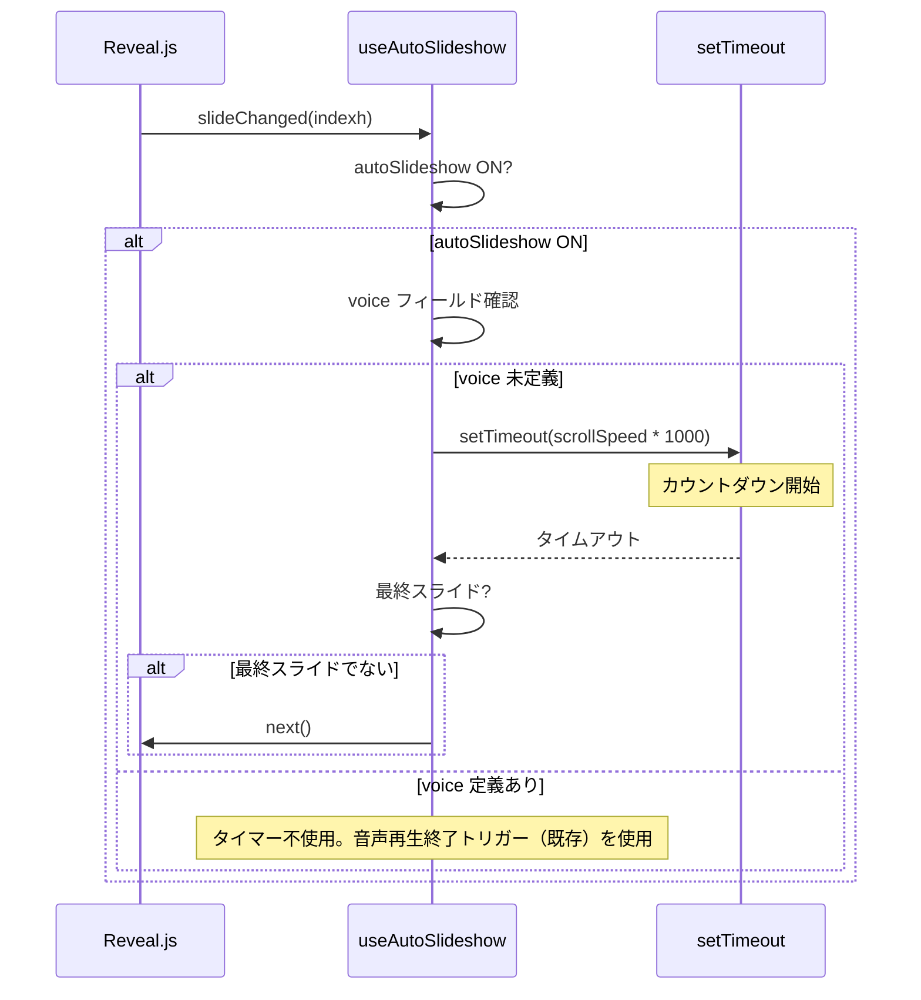
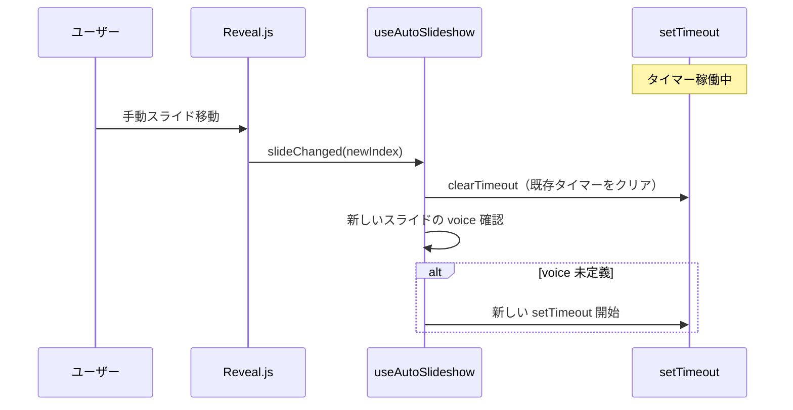
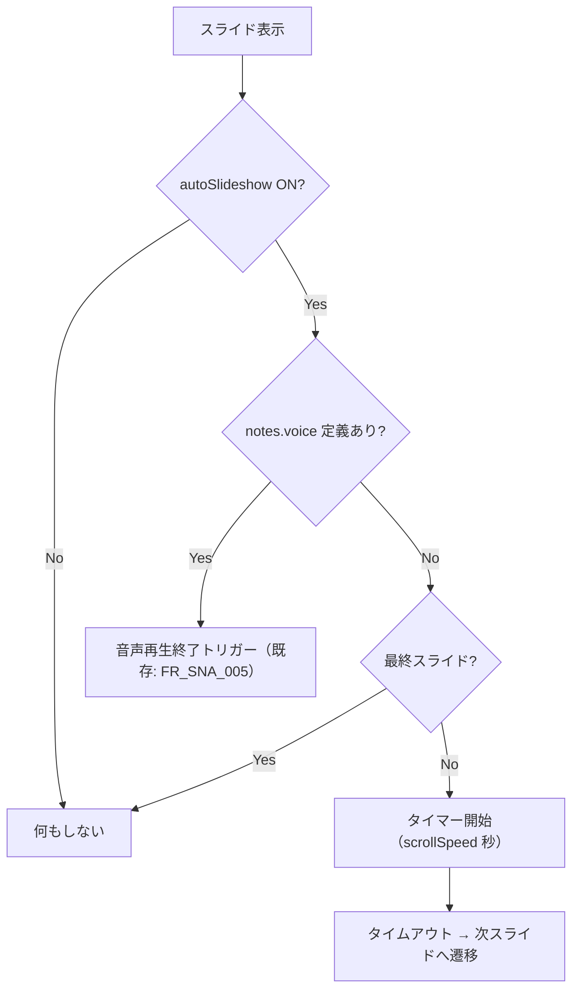

# タイマーベース自動スクロール（Auto Scroll Timer）

**ドキュメント種別:** 抽象仕様書 (Spec)
**SDDフェーズ:** Specify (仕様化)
**最終更新日:** 2026-02-01
**関連 Design Doc:** [auto-scroll-timer_design.md](./auto-scroll-timer_design.md)
**関連 PRD:** [auto-scroll-timer.md](../requirement/auto-scroll-timer.md)

---

# 1. 背景

既存の自動スライドショー機能（FR_SNA_005）は、音声ファイルの再生終了をトリガーとしてスライド遷移を行う。しかし、音声ファイルが定義されていないスライドでは自動遷移が機能しないため、音声ありスライドと音声なしスライドが混在するプレゼンテーションでは、ハンズフリーの自動進行が途切れてしまう。

タイマーベース自動スクロール機能は、音声未定義のスライドに対して時間ベースの自動遷移を提供し、完全なハンズフリープレゼンテーションを実現する。

# 2. 概要

自動スライドショーがONの状態で、音声ファイル（notes.voice）が定義されていないスライドが表示された場合、設定されたスクロールスピード（秒数）の経過後に自動的に次のスライドへ遷移する。

**主要な設計原則:**

1. **音声優先** — 音声ファイルが定義されているスライドでは既存の音声再生終了トリガー（FR_SNA_005）が使用され、タイマーは動作しない
2. **既存機能の拡張** — 新規のON/OFFトグルは追加せず、既存の自動スライドショーON/OFF（FR_SNA_006）を共有する
3. **フォールバックファースト** — スクロールスピード設定の読み込みに失敗した場合はデフォルト値（20秒）を使用する（A-005準拠）
4. **データ駆動** — スクロールスピードの設定値はアプリケーション状態として管理し、ハードコードしない（A-003準拠）

# 3. 要求定義

## 3.1. 機能要件 (Functional Requirements)

| ID     | 要件                                                             | 優先度    | PRD参照      |
|--------|----------------------------------------------------------------|--------|------------|
| FR-001 | 自動スライドショーONかつ notes.voice が未定義のスライド表示時、設定秒数後に次スライドへ自動遷移する      | Must   | FR_AST_001 |
| FR-002 | 設定ウィンドウからスクロールスピード（秒数）を変更できる                                   | Must   | FR_AST_002 |
| FR-003 | スクロールスピードのデフォルト値は20秒                                           | Could  | FR_AST_003 |
| FR-004 | タイマーカウント中に手動でスライドを移動した場合、タイマーがリセットされ新しいスライドで再カウントが開始される        | Should | FR_AST_004 |
| FR-005 | 最終スライドではタイマーによる自動遷移を行わない                                       | Should | FR_AST_005 |
| FR-006 | notes.voice が定義されたスライドではタイマーは動作せず、音声再生終了トリガー（FR_SNA_005）が優先される | Must   | FR_AST_006 |

# 4. API

## 4.1. 公開API一覧

| ディレクトリ          | ファイル名               | エクスポート                         | 概要                                   |
|-----------------|---------------------|--------------------------------|--------------------------------------|
| src/hooks/      | useAutoSlideshow.ts | `useAutoSlideshow()` (拡張)      | 既存フックにタイマーベース自動スクロール機能を追加            |
| src/hooks/      | useAutoSlideshow.ts | `UseAutoSlideshowOptions` (拡張) | options に scrollSpeed を追加            |
| src/hooks/      | useAutoSlideshow.ts | `UseAutoSlideshowReturn` (拡張)  | 戻り値に scrollSpeed, setScrollSpeed を追加 |
| src/components/ | SettingsWindow.tsx  | `SettingsWindow` (拡張)          | 言語設定機能の設定ウィンドウにスクロールスピード設定フィールドを追加   |

## 4.2. 型定義

```typescript
/** UseAutoSlideshowOptions の拡張 */
interface UseAutoSlideshowOptions {
  slides: SlideData[]
  currentIndex: number
  audioPlayer: UseAudioPlayerReturn
  goToNext: () => void
  scrollSpeed?: number  // 追加: スクロールスピード（秒）。未指定時はデフォルト値
}

/** UseAutoSlideshowReturn の拡張 */
interface UseAutoSlideshowReturn {
  autoPlay: boolean
  setAutoPlay: (enabled: boolean) => void
  autoSlideshow: boolean
  setAutoSlideshow: (enabled: boolean) => void
  scrollSpeed: number                       // 追加: 現在のスクロールスピード（秒）
  setScrollSpeed: (speed: number) => void   // 追加: スクロールスピードの変更
}
```

# 5. 用語集

| 用語             | 説明                                             |
|----------------|------------------------------------------------|
| スクロールスピード      | 音声未定義スライドで次スライドへ自動遷移するまでの待機時間（秒）               |
| タイマーベース自動スクロール | 音声ファイルがないスライドで、指定秒数後に自動でスライドを遷移させる機能           |
| 自動スライドショー      | 音声再生終了またはタイマー完了をトリガーに次スライドへ自動遷移する機能の総称         |
| 設定ウィンドウ        | language-settings 機能で実装されるスクロールスピード等の設定を変更するUI |

# 6. 使用例

```tsx
// App.tsx での使用（既存コードの拡張）
const autoSlideshow = useAutoSlideshow({
  slides: presentationData.slides,
  currentIndex,
  audioPlayer,
  goToNext: () => revealRef.current?.next(),
  scrollSpeed: 20,  // デフォルト20秒
})

// SettingsWindow 内でのスクロールスピード設定
function ScrollSpeedSetting() {
  const { scrollSpeed, setScrollSpeed } = useAutoSlideshow(/* ... */)
  return (
    <input
      type="number"
      value={scrollSpeed}
      onChange={(e) => setScrollSpeed(Number(e.target.value))}
      min={1}
    />
  )
}
```

# 7. 振る舞い図

## 7.1. タイマーベース自動スクロールフロー



## 7.2. タイマーリセットフロー



## 7.3. 自動遷移の判定フロー



# 8. 制約事項

- スクロールスピードの設定値はデータ駆動で管理し、ハードコードを禁止する（A-003 準拠）
- タイマーのライフサイクルは useEffect で管理し、クリーンアップ時にリソースを解放する（T-003 準拠）
- TypeScript strict モードで型安全性を確保する（T-001 準拠）
- Reveal.js の DOM 構造との互換性を維持する（T-002 準拠）
- スタイリングは3層モデルに従い、テーマカラーは CSS変数経由で参照する（A-002 準拠）
- プレゼンテーションの視覚的品質と伝達力を損なわない（B-001 準拠）

---

## PRD参照

- 対応PRD: [auto-scroll-timer.md](../requirement/auto-scroll-timer.md)
- カバーする要求: UR_AST_001, FR_AST_001, FR_AST_002, FR_AST_003, FR_AST_004, FR_AST_005, FR_AST_006, DC_AST_001,
  DC_AST_002
