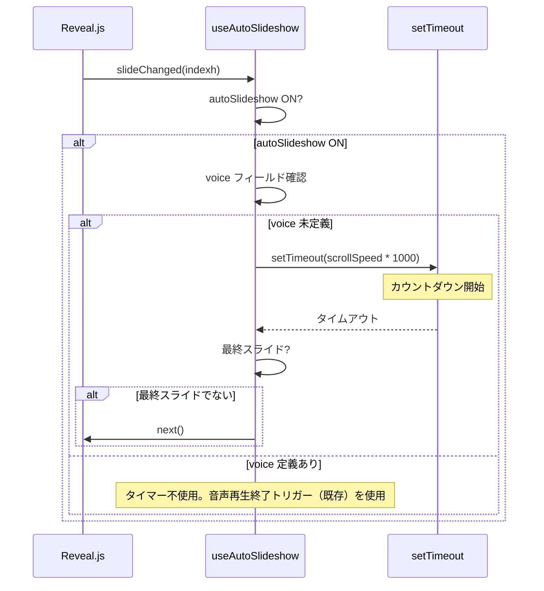
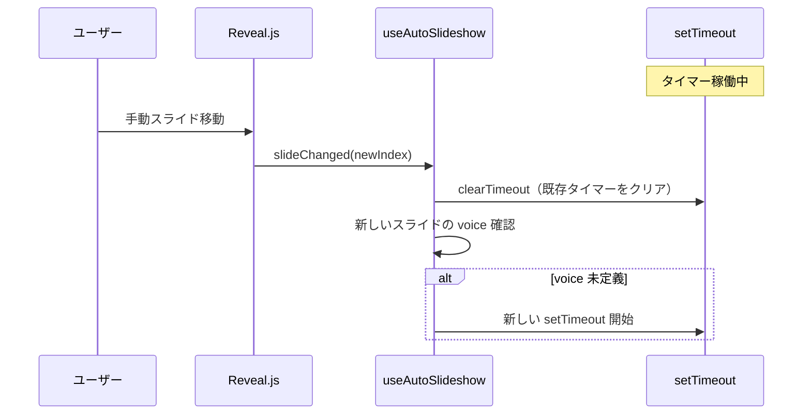
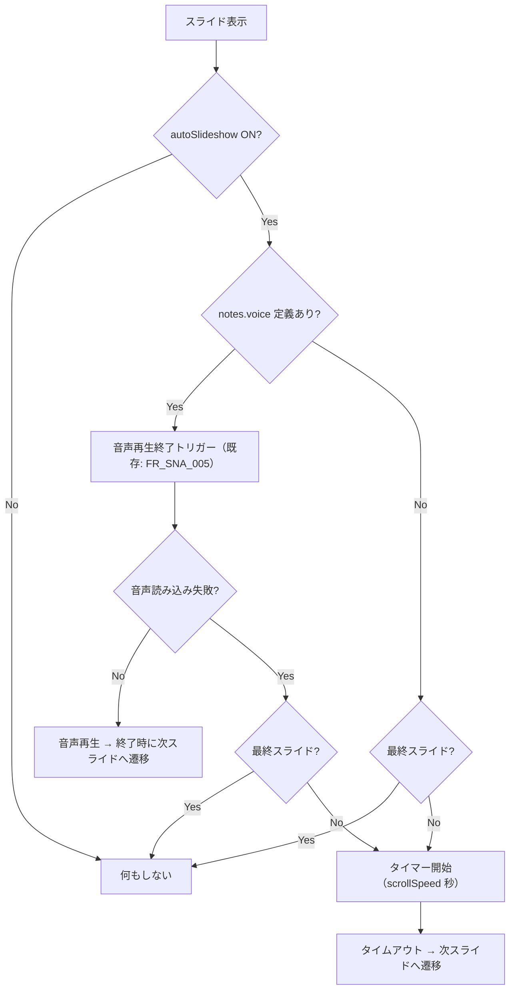

# タイマーベース自動スクロール（Auto Scroll Timer）

**ドキュメント種別:** 抽象仕様書 (Spec)
**SDDフェーズ:** Specify (仕様化)
**最終更新日:** 2026-07-28
**関連 Design Doc:** [auto-scroll-timer_design.md](./auto-scroll-timer_design.md)
**関連 PRD:** [auto-scroll-timer.md](../requirement/auto-scroll-timer.md)

---

# 1. 背景

既存の自動スライドショー機能（FR_SNA_005）は、音声ファイルの再生終了をトリガーとしてスライド遷移を行う。しかし、音声ファイルが定義されていないスライドでは自動遷移が機能しないため、音声ありスライドと音声なしスライドが混在するプレゼンテーションでは、ハンズフリーの自動進行が途切れてしまう。

タイマーベース自動スクロール機能は、音声未定義のスライドに対して時間ベースの自動遷移を提供し、完全なハンズフリープレゼンテーションを実現する。

# 2. 概要

自動スライドショーがONの状態で、音声ファイル（notes.voice）が定義されていないスライドが表示された場合、設定されたスクロールスピード（秒数）の経過後に自動的に次のスライドへ遷移する。

**主要な設計原則:**

1. **音声優先** — 音声ファイルが定義されているスライドでは既存の音声再生終了トリガー（FR_SNA_005）が使用され、タイマーは動作しない
2. **既存機能の拡張** — 新規のON/OFFトグルは追加せず、既存の自動スライドショーON/OFF（FR_SNA_006）を共有する
3. **フォールバックファースト** — スクロールスピード設定の読み込みに失敗した場合、または保存値が無効（数値でない、または 1 未満）な場合はデフォルト値（20秒）を使用する（A-005準拠）
4. **設定値の状態管理とバリデーション** — スクロールスピードの設定値はコードにハードコードせず、アプリケーション状態（`localStorage` 永続化付き）として管理する。外部から読み込む値は使用前に検証する（D-002準拠）

# 3. 要求定義

## 3.1. 機能要件 (Functional Requirements)

| ID     | 要件                                                             | 優先度    | PRD参照      |
|--------|----------------------------------------------------------------|--------|------------|
| FR-001 | 自動スライドショーONかつ notes.voice が未定義のスライド表示時、設定秒数後に次スライドへ自動遷移する      | Must   | FR_AST_001 |
| FR-002 | 設定ウィンドウからスクロールスピード（秒数、1〜300 の範囲）を変更できる                          | Must   | FR_AST_002 |
| FR-003 | スクロールスピードのデフォルト値は20秒                                           | Could  | FR_AST_003 |
| FR-004 | タイマーカウント中に手動でスライドを移動した場合、タイマーがリセットされ新しいスライドで再カウントが開始される        | Should | FR_AST_004 |
| FR-005 | 最終スライドではタイマーによる自動遷移を行わない                                       | Should | FR_AST_005 |
| FR-006 | notes.voice が定義されたスライドではタイマーは動作せず、音声再生終了トリガー（FR_SNA_005）が優先される | Must   | FR_AST_006 |

## 3.2. 非機能要件 (Non-Functional Requirements)

| ID      | カテゴリ    | 要件               | 目標値                                                      | PRD参照       |
|---------|---------|------------------|----------------------------------------------------------|-------------|
| NFR-001 | 性能      | 自動遷移のタイミング精度     | 秒単位（許容誤差 ±1 秒以内）で十分。ミリ秒精度は不要                             | NFR_AST_001 |
| NFR-002 | 信頼性     | タイマーリーク防止        | スライド遷移・アンマウント時に必ずクリアし、同時にアクティブなタイマーは最大 1 個（メモリリークなし）      | NFR_AST_002 |
| NFR-003 | ユーザビリティ | 設定変更の即時反映        | scrollSpeed 変更後、追加のユーザー操作なしに次のカウントへ即座に反映                  | NFR_AST_003 |

# 4. API

## 4.1. 公開API一覧

| ディレクトリ          | ファイル名               | エクスポート                         | 概要                                   |
|-----------------|---------------------|--------------------------------|--------------------------------------|
| src/hooks/      | useScrollSpeed.ts   | `useScrollSpeed()`             | スクロールスピードの保持と `localStorage` 永続化。`[scrollSpeed, setScrollSpeed]` のタプルを返す |
| src/hooks/      | useScrollSpeed.ts   | `DEFAULT_SCROLL_SPEED`         | スクロールスピードのデフォルト値（20 秒）           |
| src/hooks/      | useAutoSlideshow.ts | `useAutoSlideshow()` (拡張)      | 自動再生・自動送り・タイマーベース自動スクロールを担うフック。スクロールスピードは保持せず引数で受け取る（controlled） |
| src/hooks/      | useAutoSlideshow.ts | `UseAutoSlideshowOptions` (拡張) | options に scrollSpeed（必須）を追加        |
| src/hooks/      | useAutoSlideshow.ts | `UseAutoSlideshowReturn` (拡張)  | 戻り値に timerDuration を追加             |
| src/components/ | SettingsWindow.tsx  | `SettingsWindow` (拡張)          | 言語設定機能の設定ウィンドウにスクロールスピード設定フィールドを追加。`scrollSpeed` / `setScrollSpeed` は任意で、両方が渡されたときだけ当該行を表示する |

スクロールスピードの所有者は `useScrollSpeed` を呼び出す Root 層（`main.tsx` の `RootContent`）であり、`useAutoSlideshow`（タイマー）と `SettingsWindow`（設定 UI）はいずれも値を受け取る側になる。詳細な根拠は [auto-scroll-timer_design.md](./auto-scroll-timer_design.md) §9.1 を参照。

## 4.2. 型定義

```typescript
/** スクロールスピードの所有フック。値と setter のタプルを返す */
function useScrollSpeed(): [number, (speed: number) => void]

/** UseAutoSlideshowOptions の拡張 */
interface UseAutoSlideshowOptions {
  slides: SlideData[]
  currentIndex: number
  audioPlayer: UseAudioPlayerReturn
  goToNext: () => void
  scrollSpeed: number  // タイマー自動送りの秒数（必須・controlled）。所有者は useScrollSpeed を呼ぶ Root 層
}

/** UseAutoSlideshowReturn の拡張 */
interface UseAutoSlideshowReturn {
  autoPlay: boolean
  setAutoPlay: (enabled: boolean) => void
  autoSlideshow: boolean
  setAutoSlideshow: (enabled: boolean) => void
  timerDuration: number | null              // 追加: タイマー稼働中の総秒数。非稼働時は null（プログレス表示用）
}
```

- `useScrollSpeed` は初回マウント時に `localStorage`（キー `slide-app-scroll-speed`）を 1 回だけ読み、保存値が有効な数値かつ 1 以上であればそれを初期値とし、未保存・無効な場合はデフォルト値 20 秒（`DEFAULT_SCROLL_SPEED`）を用いる。setter は state の更新と同キーへの永続化を同時に行う。
- `useAutoSlideshow` はスクロールスピードを保持しない（controlled）。受け取った `scrollSpeed` をタイマーの待機時間および `timerDuration` にそのまま用いるため、値の変更は追加操作なしに次のカウントへ反映される（NFR-003）。
- `timerDuration` は、タイマーが稼働中のとき総秒数（= 受け取った `scrollSpeed`）を、非稼働時は `null` を返す。プログレス表示（別機能 [auto-scroll-progress-bar.md](../requirement/auto-scroll-progress-bar.md)）が残り時間を算出するために使用する。

# 5. 用語集

| 用語             | 説明                                             |
|----------------|------------------------------------------------|
| スクロールスピード      | 音声未定義スライドで次スライドへ自動遷移するまでの待機時間（秒）               |
| タイマーベース自動スクロール | 音声ファイルがないスライドで、指定秒数後に自動でスライドを遷移させる機能           |
| 自動スライドショー      | 音声再生終了またはタイマー完了をトリガーに次スライドへ自動遷移する機能の総称         |
| 設定ウィンドウ        | language-settings 機能で実装されるスクロールスピード等の設定を変更するUI |

# 6. 使用例

```tsx
// main.tsx の RootContent（所有者）— アプリ起動時に localStorage から復元し、消費者へ配る
const [scrollSpeed, setScrollSpeed] = useScrollSpeed()

// ホーム画面ではスクロールスピード行を出さないため、プレゼンテーション表示中のみ渡す
<SettingsWindow open={settingsOpen} onClose={closeSettings} scrollSpeed={view === 'presentation' ? scrollSpeed : undefined} setScrollSpeed={view === 'presentation' ? setScrollSpeed : undefined} />
<App presentationData={data} scrollSpeed={scrollSpeed} onScrollSpeedChange={setScrollSpeed} />

// App.tsx での使用（controlled: 値は props で受け取ったものをそのまま渡す）
const { autoPlay, setAutoPlay, autoSlideshow, setAutoSlideshow, timerDuration } = useAutoSlideshow({
  slides: presentationData.slides,
  currentIndex,
  audioPlayer,
  goToNext,
  scrollSpeed,
})

// SettingsWindow は scrollSpeed / setScrollSpeed を props で受け取る
function ScrollSpeedSetting({ scrollSpeed, setScrollSpeed }: { scrollSpeed: number; setScrollSpeed: (speed: number) => void }) {
  return (
    <input
      type="number"
      value={scrollSpeed}
      onChange={(e) => {
        const v = Number(e.target.value)
        if (v >= 1 && v <= 300) setScrollSpeed(v)
      }}
      min={1}
      max={300}
    />
  )
}
```

# 7. 振る舞い図

## 7.1. タイマーベース自動スクロールフロー


```mermaid
sequenceDiagram
    participant Reveal as Reveal.js
    participant Hook as useAutoSlideshow
    participant Timer as setTimeout
    Reveal ->> Hook: slideChanged(indexh)
    Hook ->> Hook: autoSlideshow ON?
    alt autoSlideshow ON
        Hook ->> Hook: voice フィールド確認
        alt voice 未定義
            Hook ->> Timer: setTimeout(scrollSpeed * 1000)
            Note over Timer: カウントダウン開始
            Timer -->> Hook: タイムアウト
            Hook ->> Hook: 最終スライド?
            alt 最終スライドでない
                Hook ->> Reveal: next()
            end
        else voice 定義あり
            Note over Hook: タイマー不使用。音声再生終了トリガー（既存）を使用
        end
    end
```

## 7.2. タイマーリセットフロー


```mermaid
sequenceDiagram
    participant User as ユーザー
    participant Reveal as Reveal.js
    participant Hook as useAutoSlideshow
    participant Timer as setTimeout
    Note over Timer: タイマー稼働中
    User ->> Reveal: 手動スライド移動
    Reveal ->> Hook: slideChanged(newIndex)
    Hook ->> Timer: clearTimeout（既存タイマーをクリア）
    Hook ->> Hook: 新しいスライドの voice 確認
    alt voice 未定義
        Hook ->> Timer: 新しい setTimeout 開始
    end
```

## 7.3. 自動遷移の判定フロー


```mermaid
flowchart TD
    A[スライド表示] --> B{autoSlideshow ON?}
    B -- No --> Z[何もしない]
    B -- Yes --> C{notes.voice 定義あり?}
    C -- Yes --> D["音声再生終了トリガー（既存: FR_SNA_005）"]
    D --> D1{音声読み込み失敗?}
    D1 -- No --> D2["音声再生 → 終了時に次スライドへ遷移"]
    D1 -- Yes --> E2{最終スライド?}
    C -- No --> E{最終スライド?}
    E -- Yes --> Z
    E -- No --> F["タイマー開始（scrollSpeed 秒）"]
    F --> G["タイムアウト → 次スライドへ遷移"]
    E2 -- Yes --> Z
    E2 -- No --> F
```

音声ファイルが定義されているが読み込みに失敗した場合は、タイマーベース自動スクロールにフォールバックし、自動スライドショーの進行が停止しないようにする（DC_SNA_002 準拠）。

# 8. 制約事項

- スクロールスピードの設定値はコードにハードコードせず、アプリケーション状態として管理する。外部（localStorage）から読み込む値は使用前に検証し、無効時はデフォルト値へフォールバックする（D-002 / A-005 準拠）
- スクロールスピードの設定可能範囲は 1〜300 秒とし、設定 UI（SettingsWindow の数値入力）で下限 1・上限 300 を強制する。`useScrollSpeed` の `localStorage` 復元時の検証は下限（1 以上）のみで、上限の検証は設定 UI が担う
- タイマーのライフサイクルは useEffect で管理し、クリーンアップ時にリソースを解放する（T-003 準拠）
- TypeScript strict モードで型安全性を確保する（T-001 準拠）
- Reveal.js の DOM 構造との互換性を維持する（T-002 準拠）
- スタイリングは3層モデルに従い、テーマカラーは CSS変数経由で参照する（A-002 準拠）
- プレゼンテーションの視覚的品質と伝達力を損なわない（B-001 準拠）

---

## PRD参照

- 対応PRD: [auto-scroll-timer.md](../requirement/auto-scroll-timer.md)
- カバーする要求: UR_AST_001, FR_AST_001, FR_AST_002, FR_AST_003, FR_AST_004, FR_AST_005, FR_AST_006, DC_AST_001,
  DC_AST_002, NFR_AST_001, NFR_AST_002, NFR_AST_003
