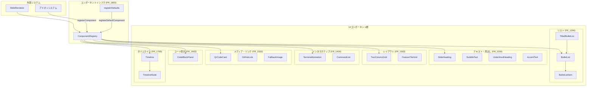

# 組み込みUIコンポーネント群

**ドキュメント種別:** 技術設計書 (Design Doc)
**SDDフェーズ:** Plan (計画/設計)
**最終更新日:** 2026-07-24
**関連 Spec:** [builtin-ui-components_spec.md](./builtin-ui-components_spec.md)
**関連 PRD:** [builtin-ui-components.md](../requirement/builtin-ui-components.md)

---

# 1. 実装ステータス

**ステータス:** 🟢 実装済み

## 1.1. 実装進捗

| モジュール/機能                   | ステータス | 備考                            |
|:---------------------------|:------|:------------------------------|
| テキスト・見出し系（FR_1100）         | 🟢    | SlideHeading, SubtitleText, UnderlinedHeading, AccentText |
| リスト系（FR_1200）              | 🟢    | BulletList, BulletListItem, TitledBulletList |
| レイアウト系（FR_1300）            | 🟢    | TwoColumnGrid, FeatureTileGrid |
| インタラクティブ系（FR_1400）         | 🟢    | TerminalAnimation, CommandList |
| メディア・リンク系（FR_1500）         | 🟢    | QrCodeCard, GitHubLink, FallbackImage |
| コード表示（FR_1600）             | 🟢    | CodeBlockPanel               |
| タイムライン（FR_1700）            | 🟢    | Timeline, TimelineNode       |
| コンポーネントインフラ（FR_1800）       | 🟢    | ComponentRegistry, registerDefaults |

---

# 2. 設計目標

1. **テーマ連動**: すべてのコンポーネントが CSS 変数（`--theme-*`）を通じてテーマと連動し、ハードコードされた色値を排除する
2. **合成可能性**: 各コンポーネントが独立して動作し、任意の組み合わせで使用できる
3. **型安全性**: TypeScript strict モードで完全な型チェックが通る Props インターフェースを提供する
4. **名前解決**: ComponentRegistry による二層構造（default/custom）で、アドオンによる上書きを実現する
5. **Reveal.js 互換性**: `.reveal > .slides > section` 内で正しく描画される

---

# 3. 技術スタック

| 領域               | 採用技術                       | 選定理由                                     |
|:-----------------|:---------------------------|:-----------------------------------------|
| UIフレームワーク        | React                      | コンポーネント指向、宣言的UI構築（T-001）                 |
| UIライブラリ          | MUI (Material-UI)          | Box, Typography 等の基本コンポーネントと sx prop による柔軟なスタイリング |
| スタイリング（静的）       | CSS Modules                | コンポーネント固有のスタイルをスコープ付きで管理（TerminalAnimation 等） |
| スタイリング（動的）       | MUI sx prop                | インラインの微調整、CSS変数参照                        |
| スタイリング（テーマ）      | CSS カスタムプロパティ               | `--theme-*` 変数によるテーマ連動（A-002, NFR_300）    |
| QR コード生成          | 外部 API `api.qrserver.com`  | QrCodeCard が QR 画像 URL を組み立て、`FallbackImage` 経由で表示（`qrcode` ライブラリ依存なし）。オフライン時や外部 API 停止時は FallbackImage のエラー表示にフォールバックし、URL は外部サービスに送信される（プライバシー面の留意点） |
| アイコン              | @mui/icons-material        | デフォルト登録のMUIアイコン（6種: Description, PlaylistAddCheck, Traffic, FactCheck, Memory, Search） |
| アニメーション           | setTimeout + React state   | TerminalAnimation のタイピングエフェクト              |
| 表示検知              | Intersection Observer API  | TerminalAnimation の表示トリガー                  |

---

# 4. アーキテクチャ

## 4.1. システム構成図


```mermaid
graph TD
    subgraph "コンポーネントインフラ (FR_1800)"
        CR[ComponentRegistry]
        RD[registerDefaults]
    end

    subgraph "UIコンポーネント群"
        subgraph "テキスト・見出し (FR_1100)"
            SH[SlideHeading]
            ST[SubtitleText]
            UH[UnderlinedHeading]
            AT[AccentText]
        end

        subgraph "リスト (FR_1200)"
            BL[BulletList]
            BLI[BulletListItem]
            TBL[TitledBulletList]
        end

        subgraph "レイアウト (FR_1300)"
            TCG[TwoColumnGrid]
            FTG[FeatureTileGrid]
        end

        subgraph "インタラクティブ (FR_1400)"
            TA[TerminalAnimation]
            CL[CommandList]
        end

        subgraph "メディア・リンク (FR_1500)"
            QR[QrCodeCard]
            GH[GitHubLink]
            FI[FallbackImage]
        end

        subgraph "コード表示 (FR_1600)"
            CBP[CodeBlockPanel]
        end

        subgraph "タイムライン (FR_1700)"
            TL[Timeline]
            TN[TimelineNode]
        end
    end

    subgraph "外部システム"
        SR[SlideRenderer]
        Addon[アドオンシステム]
    end

    SR --> CR
    CR --> SH & BL & TCG & TA & QR & CBP & TL
    Addon -->|registerComponent| CR
    RD -->|registerDefaultComponent| CR
    BL --> BLI
    TBL --> BL
    TL --> TN
```

## 4.2. モジュール分割

| モジュール名                | 責務                                | 依存関係                          | 配置場所                               |
|:----------------------|:----------------------------------|:------------------------------|:-----------------------------------|
| ComponentRegistry     | コンポーネント名前解決、登録管理                  | なし（依存ゼロ）                      | `src/components/ComponentRegistry.tsx` |
| registerDefaults      | デフォルトコンポーネントの一括登録                 | ComponentRegistry, TerminalAnimation, MUI icons | `src/components/registerDefaults.tsx` |
| SlideHeading          | バリアント対応スライド見出し                    | MUI Typography                | `src/components/SlideHeading.tsx`  |
| SubtitleText          | サブタイトル表示                          | MUI Typography                | `src/components/SubtitleText.tsx`  |
| UnderlinedHeading     | 下線付き見出し                           | MUI Typography                | `src/components/UnderlinedHeading.tsx` |
| AccentText            | プライマリカラー強調テキスト                    | MUI Typography                | `src/components/AccentText.tsx`    |
| BulletList            | 箇条書きリストコンテナ                       | MUI List, BulletListItem      | `src/components/BulletList.tsx`    |
| BulletListItem        | シェブロンアイコン付きリスト項目                  | MUI ListItem, ChevronRight    | `src/components/BulletListItem.tsx` |
| TitledBulletList      | タイトル付き箇条書きリスト                     | MUI Box, BulletList           | `src/components/TitledBulletList.tsx` |
| TwoColumnGrid         | 2カラムグリッドレイアウト                     | MUI Box                      | `src/components/TwoColumnGrid.tsx` |
| FeatureTileGrid       | 3カラム機能紹介タイルグリッド                   | MUI Card, CardContent, Stack, Avatar, Typography | `src/components/FeatureTileGrid.tsx` |
| CodeBlockPanel        | ヘッダー付きコードブロック                     | MUI Paper, List, ListItem, ListItemText | `src/components/CodeBlockPanel.tsx` |
| Timeline              | 縦型タイムラインコンテナ                      | CSS Modules                   | `src/components/Timeline.tsx`      |
| TimelineNode          | 番号付きタイムラインステップ                    | CSS Modules                   | `src/components/TimelineNode.tsx`  |
| TerminalAnimation     | タイピングアニメーション付きターミナル               | MUI Box, CSS Modules, Intersection Observer | `src/components/TerminalAnimation.tsx` |
| CommandList           | 色指定対応コマンドリスト                      | MUI List, ListItem            | `src/components/CommandList.tsx`   |
| QrCodeCard            | QRコード生成カード                        | MUI Box, FallbackImage（外部 QR API 経由） | `src/components/QrCodeCard.tsx`    |
| GitHubLink            | GitHubリポジトリリンク                    | MUI Typography + inline SVG   | `src/components/GitHubLink.tsx`    |
| FallbackImage         | フォールバック付き画像                       | MUI Box, Typography, React state (onError) | `src/components/FallbackImage.tsx` |

---

# 5. データモデル

## ComponentRegistry の内部構造

```typescript
// 二層 Map 構造
const defaultComponents = new Map<string, RegisteredComponent>();
const customComponents = new Map<string, RegisteredComponent>();
// custom 登録の所有者を記録する（name → owner）。unregisterOwner での一括破棄に使用
const customOwners = new Map<string, string>();

// 解決優先順位: custom → default → FallbackComponent
```

## デフォルト登録コンポーネント一覧

| 登録名                      | 実体                              |
|:-------------------------|:--------------------------------|
| `TerminalAnimation`      | DefaultTerminalAnimation（デフォルト logText を注入するラッパー） |
| `Image`                  | DefaultImage（FallbackImage のラッパー。`src`/`width`/`height`/`alt` を受け取る） |
| `Icon:Description`       | MUI DescriptionIcon (32px)      |
| `Icon:PlaylistAddCheck`  | MUI PlaylistAddCheckIcon (32px) |
| `Icon:Traffic`           | MUI TrafficIcon (32px)          |
| `Icon:FactCheck`         | MUI FactCheckIcon (32px)        |
| `Icon:Memory`            | MUI MemoryIcon (32px)           |
| `Icon:Search`            | MUI SearchIcon (32px)           |

---

# 6. インターフェース定義

## ComponentRegistry API

```typescript
// レジストリに登録可能なコンポーネントの型（コンポーネント本体そのもの）
export type RegisteredComponent = ComponentType<Record<string, unknown>>;

// 公開API
export function registerDefaultComponent(name: string, component: RegisteredComponent): void;
export function registerComponent(name: string, component: RegisteredComponent, owner?: string): void;
export function unregisterOwner(owner: string): void;
export function resolveComponent(name: string): RegisteredComponent;
export function getRegisteredComponents(): string[];
export function clearRegistry(): void;
```

**設計上の注意点:**

- `resolveComponent` は常に有効なコンポーネントを返す（null を返さない）。未登録の場合は内部の `FallbackComponent` を返す
- `FallbackComponent` はコンポーネント名を表示し、CSS 変数 `--theme-text-muted` / `--theme-text-body` を使用する
- `registerComponent` の第3引数 `owner` はオプション。指定すると custom 登録が owner 単位で記録され、`unregisterOwner(owner)` でその owner の登録のみをまとめて破棄できる（default 登録は温存）。同名を異なる owner が上書きする際は `console.warn` で名前衝突を通知する（パッケージ切替時の検知用）
- `unregisterOwner` はアドオン/スライドパッケージのアンロード時に、対象 owner が登録したコンポーネントのみを除去する用途で使用する
- `clearRegistry` はテスト用に提供され、default/custom/owner のすべての内部 Map をクリアする

## TerminalAnimation の内部定数

```typescript
const TYPING_SPEED = 40;          // コマンド行の1文字あたりの表示間隔 (ms)
const COMMAND_DONE_PAUSE = 400;   // コマンド行完了後の待機時間 (ms)
const OUTPUT_LINE_INTERVAL = 150; // 出力行の表示間隔 (ms)
const EMPTY_LINE_INTERVAL = 80;   // 空行の表示間隔 (ms)
const RESTART_DELAY = 2000;       // 全行表示完了後のリスタート待機時間 (ms)
```

## 行分類ルール

| 先頭文字 | 分類     | CSS クラス          |
|:-----|:-------|:-----------------|
| `$`  | コマンド   | `line-command`   |
| `✓`  | 成功     | `line-success`   |
| `⚠`  | 警告     | `line-warning`   |
| `✗`  | エラー    | `line-error`     |
| `>`  | アクセント  | `line-accent`    |
| その他  | デフォルト  | `line-default`   |

---

# 7. 非機能要件実現方針

| 要件                  | 実現方針                                                                                  |
|:--------------------|:--------------------------------------------------------------------------------------|
| テーマ連動（NFR_300）      | すべてのコンポーネントで CSS 変数 `var(--theme-*)` を使用。MUI sx prop や CSS Modules で参照                  |
| 合成可能性（NFR_301）      | 各コンポーネントが独立したファイルで実装。Props のみで外部と通信し、暗黙的なグローバル状態を持たない                                  |
| アニメーション性能（NFR_302）  | TerminalAnimation で setTimeout + React state による逐次的な行表示。DOM 操作は React の再レンダリングに委任       |
| リソースクリーンアップ（T-003） | TerminalAnimation は各 `useEffect` のクリーンアップ関数で `clearTimeout(timer)` を返し、Intersection Observer は `observer.disconnect()` で解放する。アンマウント・依存変化・非表示化のたびにタイマー/オブザーバーが残留しないようにし、メモリリークと不要な再描画を防ぐ |
| エラー耐性（NFR_303）      | ComponentRegistry の FallbackComponent による未登録コンポーネント処理。FallbackImage の onError ハンドラによる画像エラー処理 |

---

# 8. テスト戦略

| テストレベル  | 対象                              | カバレッジ目標              |
|:--------|:--------------------------------|:---------------------|
| ユニットテスト | ComponentRegistry（登録、解決、優先順位、クリア） | 主要パス網羅               |
| ユニットテスト | 行分類関数（getLineClassName）          | 全分類パターン              |
| 描画テスト   | 各 UI コンポーネントの基本描画               | 主要 Props パターンのスナップショット |

---

# 9. 設計判断

## 9.1. 決定事項

| 決定事項                     | 選択肢                              | 決定内容                       | 理由                                          |
|:-------------------------|:----------------------------------|:--------------------------|:--------------------------------------------|
| コンポーネント解決の戻り値            | null を返す / FallbackComponent を返す  | FallbackComponent を返す      | 呼び出し側での null チェック不要、NFR_303 準拠               |
| レジストリの二層構造               | 単一 Map / default+custom の二層 Map  | 二層 Map                    | アドオンによる上書きとデフォルトの分離を実現（FR_1801）              |
| TerminalAnimation のアニメーション方式 | CSS アニメーション / setTimeout + state | setTimeout + React state  | 行ごとの逐次制御が必要、行分類に基づく動的なスタイリングが可能             |
| TerminalAnimation の表示トリガー   | 即座に開始 / IntersectionObserver      | IntersectionObserver      | スライドが表示された時にのみアニメーション開始、パフォーマンスに配慮（NFR_302） |
| スタイリング方式の混合              | CSS Modules 統一 / MUI sx 統一 / 混合 | 混合                        | 静的スタイルは CSS Modules、動的な微調整は MUI sx prop（A-002 準拠） |
| デフォルト TerminalAnimation のラッパー | Props で logText を渡す / ラッパーコンポーネント | ラッパーコンポーネント（DefaultTerminalAnimation） | デフォルトの logText を注入しつつ、logTextUrl による上書きを許可  |

## 9.2. 未解決の課題

| 課題                           | 影響度 | 対応方針                            |
|:-----------------------------|:----|:--------------------------------|
| TerminalAnimation のアクセシビリティ対応 | 低   | スクリーンリーダー対応の要望が発生した時点で着手する。ターミナル出力領域に `aria-live="polite"` を付与し、アニメーションの一時停止操作を追加する |
| コンポーネントの遅延読み込み               | 低   | 現状のバンドルサイズでは不要。初期バンドルにパフォーマンス問題が観測された、または MUI アイコン等の依存が増大した時点で `React.lazy` による分割を導入する |

---

# 10. 変更履歴

## v1.0.0 (2026-01-30)

**変更内容:**

- 初版の技術設計書を作成
- 全19コンポーネント + ComponentRegistry + registerDefaults の設計を記録
