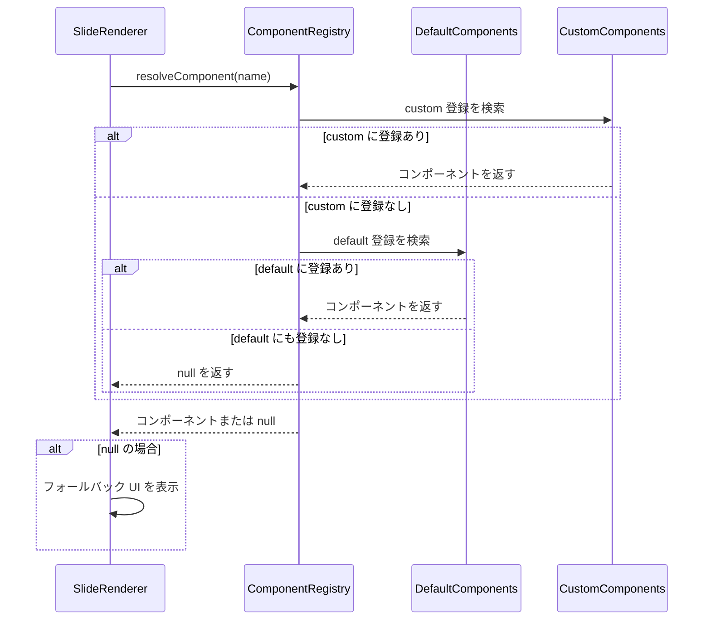
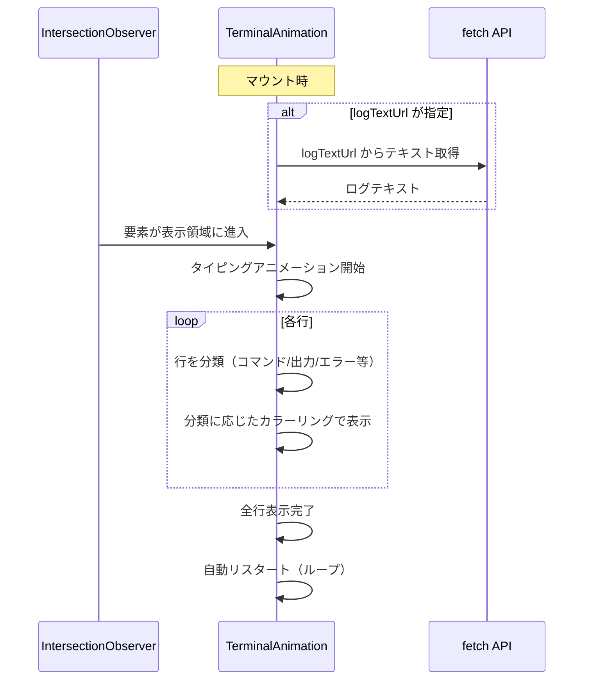

# 組み込みUIコンポーネント群

**ドキュメント種別:** 抽象仕様書 (Spec)
**SDDフェーズ:** Specify (仕様化)
**最終更新日:** 2026-01-30
**関連 Design Doc:** [builtin-ui-components_design.md](./builtin-ui-components_design.md)
**関連 PRD:** [builtin-ui-components.md](../requirement/builtin-ui-components.md)

---

# 1. 背景

データ駆動型スライドシステム（slide-content-customization）では、スライドの内容を JSON データで定義し、SlideRenderer がレイアウトに応じたビジュアル要素を描画する。この仕組みにおいて、テキスト・リスト・コードブロック・タイムラインなどプレゼンテーションに必要な基本的な UI パーツが揃っている必要がある。

組み込み UI コンポーネント群は、これらの再利用可能なパーツを体系的に提供し、スライド全体で一貫したデザインとテーマ連動を実現する。また、ComponentRegistry を通じてアドオンによるコンポーネントの上書き・拡張の基盤となる。

# 2. 概要

組み込み UI コンポーネント群は、以下の設計原則に基づいてスライドプレゼンテーションのビジュアル構築を支援する。

- **宣言的構築**: JSON データから UI を宣言的に生成する
- **テーマ連動**: CSS 変数（`--theme-*`）と連動し、テーマ変更時にすべてのコンポーネントが自動追従する
- **合成可能性**: 各コンポーネントは独立して使用でき、自由に組み合わせ可能である
- **名前解決**: ComponentRegistry による名前ベースのコンポーネント解決で、アドオンによる上書きを可能にする
- **エラー耐性**: 未登録コンポーネントや画像読み込み失敗時に適切なフォールバックを表示する

# 3. 要求定義

## 3.1. 機能要件 (Functional Requirements)

| ID      | 要件                                                       | 優先度    | 根拠                                     |
|:--------|:---------------------------------------------------------|:-------|:---------------------------------------|
| FR_1100 | テキスト・見出しコンポーネント（見出し、サブタイトル、強調テキスト等）を提供する              | Must   | スライドの基本的なテキスト表現に不可欠（UR_300）            |
| FR_1101 | バリアント（h1/h2/h3）対応・説明テキスト付きスライド見出しコンポーネント               | Must   | スライドの視覚的階層を構成する中核要素                    |
| FR_1102 | サブタイトル表示コンポーネント                                          | Should | タイトルスライドの補足情報表示                        |
| FR_1103 | 下線付き見出しコンポーネント                                           | Could  | セクション区切りの視覚的強調                         |
| FR_1104 | プライマリカラー強調テキストコンポーネント                                    | Could  | テキスト内の重要語句の強調                          |
| FR_1200 | リストコンポーネント（箇条書きリスト、タイトル付きリスト）を提供する                      | Must   | 情報の構造化表示に不可欠（UR_300）                   |
| FR_1201 | アイコン付き箇条書きリストコンポーネント                                     | Must   | コンテンツの列挙表示の基本パーツ                       |
| FR_1202 | タイトル付き箇条書きリストコンポーネント                                     | Should | 見出し付きリストの表示                            |
| FR_1300 | レイアウトコンポーネント（2カラムグリッド、タイルグリッド）を提供する                     | Must   | スライド内コンテンツの柔軟な配置に不可欠（UR_300）           |
| FR_1301 | 2カラムグリッドレイアウトコンポーネント                                     | Must   | left/right のコンテンツ配置                    |
| FR_1302 | 機能紹介タイルグリッド（3カラム）コンポーネント                                 | Should | 機能一覧のタイル表示                             |
| FR_1400 | インタラクティブコンポーネント（ターミナルアニメーション、コマンドリスト）を提供する              | Should | デモスライドでの動的表示（UR_300）                   |
| FR_1401 | タイピングアニメーション・行分類ハイライト・表示トリガー・自動リスタート付きターミナルコンポーネント      | Should | リアルなターミナル操作の再現                         |
| FR_1402 | URL からのログテキスト取得機能                                        | Should | 外部ファイルからのデモデータ取得                       |
| FR_1403 | 色指定対応コマンドリストコンポーネント                                      | Could  | コマンド一覧の視覚的な分類表示                        |
| FR_1500 | メディア・リンクコンポーネント（QRコード、GitHubリンク、画像）を提供する               | Could  | 外部リソースへの参照表示（UR_300）                   |
| FR_1501 | QR コード生成カードコンポーネント                                       | Could  | URL の QR コード化による共有                     |
| FR_1502 | GitHub リポジトリリンク表示コンポーネント                                 | Could  | ソースコードリポジトリへの誘導                        |
| FR_1503 | エラー時フォールバック付き画像表示コンポーネント                                 | Could  | 画像読み込み失敗時の graceful degradation        |
| FR_1600 | ヘッダー付きスタイル付きコードブロックコンポーネントを提供する                          | Should | ソースコードの表示                              |
| FR_1700 | 番号付きステップの縦型タイムラインコンポーネントを提供する                            | Should | プロセスやワークフローの段階的表示                      |
| FR_1800 | コンポーネントインフラ（名前解決、デフォルト登録、フォールバック）を提供する                  | Must   | コンポーネントシステムの基盤（UR_300）                 |
| FR_1801 | 名前解決（custom 優先、default フォールバック）                          | Must   | アドオンによる上書きを可能にする二層構造                   |
| FR_1802 | 未登録コンポーネントのフォールバック UI 表示                                 | Must   | 参照エラー時のクラッシュ防止                         |
| FR_1803 | デフォルトコンポーネントの一括登録                                        | Must   | アプリケーション起動時の初期化                        |

## 3.2. 非機能要件 (Non-Functional Requirements)

| ID      | カテゴリ        | 要件                                       | 目標値                            |
|:--------|:-----------|:-----------------------------------------|:-------------------------------|
| NFR_300 | テーマ連動      | すべてのコンポーネントが CSS 変数と連動する                 | テーマ変更時に全コンポーネントが自動追従           |
| NFR_301 | 合成可能性      | コンポーネント間の暗黙的依存なし                         | 任意の組み合わせで使用可能                  |
| NFR_302 | パフォーマンス    | インタラクティブコンポーネントの滑らかな動作                   | 60fps                          |
| NFR_303 | エラー耐性      | エラー状態でのフォールバック表示                          | クラッシュなし、フォールバック UI 表示          |

# 4. API

公開 API の一覧を以下に示す。

| ディレクトリ         | ファイル名                   | エクスポート                         | 概要                                        |
|:---------------|:------------------------|:-------------------------------|:------------------------------------------|
| `components/`  | `SlideHeading.tsx`      | `SlideHeading`                 | バリアント対応・説明テキスト付きスライド見出し                   |
| `components/`  | `SubtitleText.tsx`      | `SubtitleText`                 | サブタイトル表示                                  |
| `components/`  | `UnderlinedHeading.tsx` | `UnderlinedHeading`            | 下線付き見出し                                   |
| `components/`  | `AccentText.tsx`        | `AccentText`                   | プライマリカラー強調テキスト                            |
| `components/`  | `BulletList.tsx`        | `BulletList`                   | 箇条書きリストコンテナ                               |
| `components/`  | `BulletListItem.tsx`    | `BulletListItem`               | シェブロンアイコン付きリスト項目                          |
| `components/`  | `TitledBulletList.tsx`  | `TitledBulletList`             | タイトル付き箇条書きリスト                             |
| `components/`  | `TwoColumnGrid.tsx`     | `TwoColumnGrid`                | 2カラムグリッドレイアウト                             |
| `components/`  | `FeatureTileGrid.tsx`   | `FeatureTileGrid`              | 3カラム機能紹介タイルグリッド                           |
| `components/`  | `CodeBlockPanel.tsx`    | `CodeBlockPanel`               | ヘッダー付きスタイル付きコードブロック                       |
| `components/`  | `Timeline.tsx`          | `Timeline`                     | 縦型タイムラインコンテナ                              |
| `components/`  | `TimelineNode.tsx`      | `TimelineNode`                 | 番号付きタイムラインステップ                            |
| `components/`  | `TerminalAnimation.tsx` | `TerminalAnimation`            | アニメーション付きターミナル表示                          |
| `components/`  | `CommandList.tsx`       | `CommandList`                  | 色指定対応コマンドリスト                              |
| `components/`  | `QrCodeCard.tsx`        | `QrCodeCard`                   | QR コード生成カード                               |
| `components/`  | `GitHubLink.tsx`        | `GitHubLink`                   | GitHub リポジトリリンク表示                         |
| `components/`  | `FallbackImage.tsx`     | `FallbackImage`                | エラー時フォールバック付き画像表示                         |
| `components/`  | `ComponentRegistry.tsx` | `registerDefaultComponent`, `registerComponent`, `resolveComponent`, `getRegisteredComponents`, `clearRegistry` | コンポーネント名前解決システム |
| `components/`  | `registerDefaults.tsx`  | `registerDefaultComponents`    | デフォルトコンポーネント一括登録                          |

## 4.1. 型定義

### テキスト・見出し系

```typescript
interface SlideHeadingProps {
  title: string;
  variant?: 'h1' | 'h2' | 'h3';
  description?: ReactNode | ReactNode[];
  sx?: SxProps<Theme>;
}

interface SubtitleTextProps {
  children: ReactNode;
  sx?: SxProps<Theme>;
}

interface UnderlinedHeadingProps {
  children: ReactNode;
  sx?: SxProps<Theme>;
}

interface AccentTextProps {
  children: ReactNode;
  sx?: SxProps<Theme>;
}
```

### リスト系

```typescript
interface BulletListProps {
  items: ReactNode[];
}

interface BulletListItemProps {
  primary: ReactNode;
}

interface TitledBulletListProps {
  title: string;
  description?: ReactNode;
  items: ReactNode[];
}
```

### レイアウト系

```typescript
interface TwoColumnGridProps {
  left: ReactNode;
  right: ReactNode;
}

interface FeatureTileGridProps {
  tiles: {
    icon: ReactNode;
    title: string;
    description: ReactNode;
  }[];
}
```

### コード表示

```typescript
interface CodeBlockPanelProps {
  header: ReactNode;
  items: ReactNode[];
}
```

### タイムライン

```typescript
interface TimelineProps {
  items: ReactNode[];
}

interface TimelineNodeProps {
  number: number;
  title: string;
  children: ReactNode;
}
```

### インタラクティブ

```typescript
interface TerminalAnimationProps {
  logText?: string;
  logTextUrl?: string;
  title?: string;
}

interface CommandListProps {
  commands: {
    text: string;
    color: string;
  }[];
  sx?: SxProps<Theme>;
}
```

### リンク・メディア

```typescript
interface QrCodeCardProps {
  url: string;
  size?: number;
  sx?: SxProps<Theme>;
}

interface GitHubLinkProps {
  repo: string;
  sx?: SxProps<Theme>;
}

interface FallbackImageProps {
  src: string;
  width: number;
  height: number;
  alt?: string;
  className?: string;
}
```

### コンポーネントインフラ

```typescript
type RegisteredComponent = {
  name: string;
  component: ComponentType<Record<string, unknown>>;
};

function registerDefaultComponent(
  name: string,
  component: ComponentType<Record<string, unknown>>
): void;

function registerComponent(
  name: string,
  component: ComponentType<Record<string, unknown>>
): void;

function resolveComponent(
  name: string
): ComponentType<Record<string, unknown>> | null;

function getRegisteredComponents(): Map<string, RegisteredComponent>;

function clearRegistry(): void;

function registerDefaultComponents(): void;
```

# 5. 用語集

| 用語                    | 説明                                                                 |
|:----------------------|:-------------------------------------------------------------------|
| 組み込みコンポーネント           | アプリケーションにデフォルトで含まれる UI パーツ。アドオンによる上書きが可能                          |
| ComponentRegistry     | コンポーネント名から実コンポーネントを解決する名前解決システム。default/custom の二層構造を持つ            |
| デフォルト登録               | `registerDefaultComponent` によるコンポーネント登録。custom 登録で上書き可能            |
| フォールバック               | コンポーネントが見つからない場合や画像読み込み失敗時に、代替 UI を表示する仕組み                       |
| CSS 変数                | `--theme-primary` 等の CSS カスタムプロパティ。テーマシステムにより動的に値が設定される            |
| SlideRenderer         | スライドデータの `layout` フィールドに基づき適切なレンダリングを行い、組み込みコンポーネントを配置するレンダラー     |
| Intersection Observer | ブラウザ API。要素が表示領域に入ったことを検知し、TerminalAnimation の開始トリガーとして使用される       |
| sx prop               | MUI のスタイリング用プロパティ。インラインスタイルの微調整に使用される                             |

# 6. 使用例

## テキスト・見出しの使用

```tsx
import { SlideHeading } from './components/SlideHeading';
import { AccentText } from './components/AccentText';

function ExampleSlide() {
  return (
    <section>
      <SlideHeading
        title="AI-SDDワークフロー"
        variant="h1"
        description="仕様駆動開発の新しいアプローチ"
      />
      <AccentText>重要なポイント</AccentText>
    </section>
  );
}
```

## リスト・レイアウトの組み合わせ

```tsx
import { TwoColumnGrid } from './components/TwoColumnGrid';
import { BulletList } from './components/BulletList';
import { CodeBlockPanel } from './components/CodeBlockPanel';

function TwoColumnSlide() {
  return (
    <section>
      <TwoColumnGrid
        left={<BulletList items={['項目1', '項目2', '項目3']} />}
        right={
          <CodeBlockPanel
            header="コード例"
            items={[<code>const x = 1;</code>]}
          />
        }
      />
    </section>
  );
}
```

## ComponentRegistry による名前解決

```tsx
import { resolveComponent } from './components/ComponentRegistry';

const MyComponent = resolveComponent('TerminalAnimation');
if (MyComponent) {
  return <MyComponent logTextUrl="/demo-log.txt" />;
}
```

# 7. 振る舞い図

## コンポーネント解決フロー



## TerminalAnimation ライフサイクル



# 8. 制約事項

- TypeScript strict モードに準拠すること（T-001）
- Reveal.js の DOM 構造（`.reveal > .slides > section`）内で正しく動作すること（T-002）
- テーマシステムの CSS 変数を直接参照し、ハードコードされた色値を使用しないこと（NFR_300）
- 1280x720 の解像度で正しく表示されること（B-001）
- コンポーネント間に暗黙的な依存関係を持たないこと（NFR_301）
