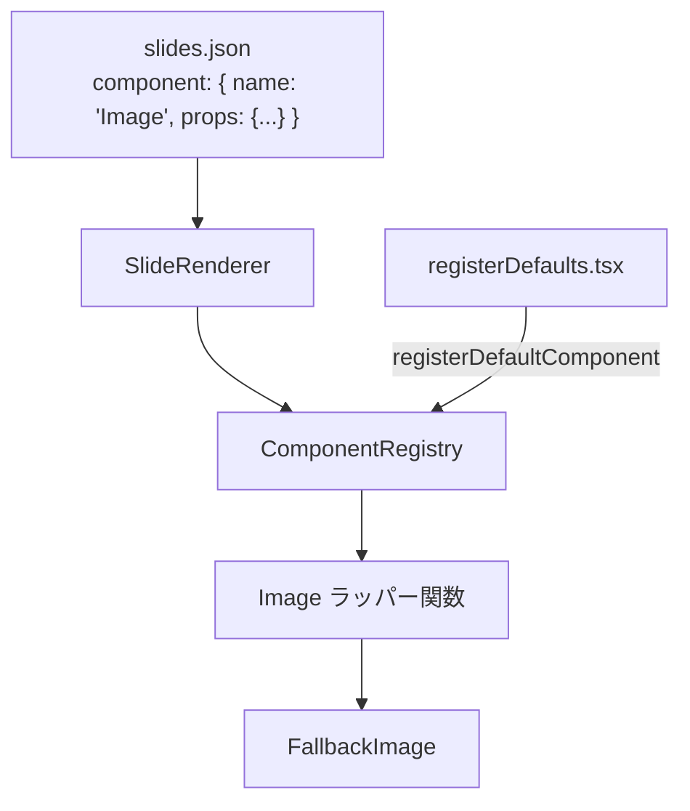

# 画像表示コンポーネント

**ドキュメント種別:** 技術設計書 (Design Doc)
**SDDフェーズ:** Plan (計画/設計)
**最終更新日:** 2026-01-30
**関連 Spec:** [image-component_spec.md](./image-component_spec.md)
**関連 PRD:** [image-component.md](../requirement/image-component.md)

---

# 1. 実装ステータス

**ステータス:** 🟢 実装済み

## 1.1. 実装進捗

| モジュール/機能                    | ステータス | 備考 |
|-----------------------------|-------|----|
| Image ラッパーコンポーネント           | 🟢    |    |
| registerDefaults.tsx への登録   | 🟢    |    |
| default-slides.json への使用例追加 | 🟢    |    |

---

# 2. 設計目標

- 既存の `FallbackImage` コンポーネントを再利用し、最小限のコードで画像表示機能を提供する
- `registerDefaults.tsx` の既存パターン（`DefaultTerminalAnimation` のラッパーパターン）に従う
- 新規ファイルを作成せず、既存ファイルへの追記で実現する

---

# 3. 技術スタック

| 領域        | 採用技術              | 選定理由                       |
|-----------|-------------------|----------------------------|
| UIライブラリ   | React             | 既存プロジェクトの基盤                |
| 画像表示      | FallbackImage     | 既存コンポーネントの再利用（エラーハンドリング付き） |
| コンポーネント登録 | ComponentRegistry | 既存のデフォルトコンポーネント登録パターンを使用   |

---

# 4. アーキテクチャ

## 4.1. システム構成図



## 4.2. モジュール分割

| モジュール名               | 責務                            | 依存関係              | 配置場所                                |
|----------------------|-------------------------------|-------------------|-------------------------------------|
| Image ラッパー関数         | props を受け取り FallbackImage に渡す | FallbackImage     | src/components/registerDefaults.tsx |
| registerDefaults.tsx | Image をデフォルトコンポーネントとして登録      | ComponentRegistry | src/components/registerDefaults.tsx |

---

# 5. データモデル

```typescript
/** ComponentRegistry から渡される props */
type ImageProps = {
  src: string
  width: number
  height: number
  alt?: string
  // ComponentRegistry が追加する name prop
  name?: string
}
```

---

# 6. インターフェース定義

```typescript
// registerDefaults.tsx 内にラッパー関数として定義
function DefaultImage(props: { src: string; width: number; height: number; alt?: string }): JSX.Element {
}
```

---

# 7. 非機能要件実現方針

| 要件    | 実現方針                                                   |
|-------|--------------------------------------------------------|
| テーマ連動 | FallbackImage のフォールバック UI が既にテーマ CSS 変数を参照しているため追加対応不要 |
| エラー耐性 | FallbackImage の既存エラーハンドリングをそのまま利用                      |

---

# 8. テスト戦略

| テストレベル  | 対象                       | カバレッジ目標 |
|---------|--------------------------|---------|
| ユニットテスト | Image ラッパーの props 受け渡し   | 必須      |
| ユニットテスト | ComponentRegistry への登録確認 | 必須      |

---

# 9. 設計判断

## 9.1. 決定事項

| 決定事項        | 選択肢                                       | 決定内容                    | 理由                                              |
|-------------|-------------------------------------------|-------------------------|-------------------------------------------------|
| 実装場所        | A) 新規ファイル, B) registerDefaults.tsx に追記    | B) registerDefaults.tsx | DefaultTerminalAnimation と同じパターンに従い、ファイル数を増やさない |
| コンポーネント名    | A) Image, B) FallbackImage, C) SlideImage | A) Image                | シンプルで直感的な名前                                     |
| props の型安全性 | A) 厳密な型定義, B) Record<string, unknown>     | A) 厳密な型定義               | TypeScript strict モード準拠、開発者体験の向上                |
