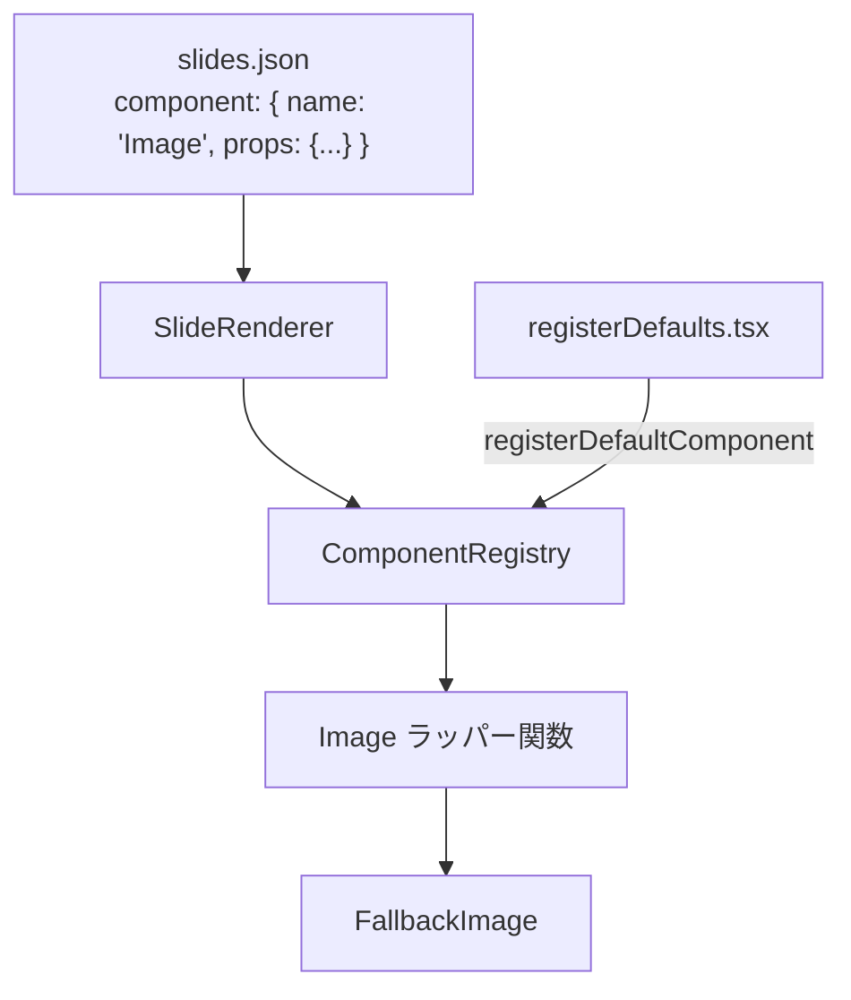

# 画像表示コンポーネント 技術設計書

**ドキュメント種別:** 技術設計書 (Design Doc)
**SDDフェーズ:** Plan (計画/設計)
**最終更新日:** 2026-07-24
**関連 Spec:** [image-component_spec.md](./image-component_spec.md)
**関連 PRD:** [image-component.md](../requirement/image-component.md)

---

# 1. 実装ステータス

**ステータス:** 🟢 実装済み

## 1.1. 実装進捗

| モジュール/機能                    | ステータス | 備考 |
|-----------------------------|-------|----|
| Image ラッパーコンポーネント           | 🟢    |    |
| registerDefaults.tsx への登録   | 🟢    |    |
| default-slides-ja.json / default-slides-en.json への使用例追加 | 🟢 | ロケール別デフォルトスライドの両方に `Image` 使用例スライドを追加済み |

---

# 2. 設計目標

- 既存の `FallbackImage` コンポーネントを再利用し、最小限のコードで画像表示機能を提供する
- `registerDefaults.tsx` の既存パターン（`DefaultTerminalAnimation` のラッパーパターン）に従う
- 新規ファイルを作成せず、既存ファイルへの追記で実現する

---

# 3. 技術スタック

| 領域        | 採用技術              | 選定理由                       |
|-----------|-------------------|----------------------------|
| UIライブラリ   | React             | 既存プロジェクトの基盤                |
| 画像表示      | FallbackImage     | 既存コンポーネントの再利用（エラーハンドリング付き） |
| コンポーネント登録 | ComponentRegistry | 既存のデフォルトコンポーネント登録パターンを使用   |

---

# 4. アーキテクチャ

## 4.1. システム構成図


```mermaid
graph TD
    JSON["slides.json<br/>component: { name: 'Image', props: {...} }"]
    SR[SlideRenderer]
    CR[ComponentRegistry]
    RD[registerDefaults.tsx]
    IMG[Image ラッパー関数]
    FB[FallbackImage]
    JSON --> SR
    SR --> CR
    CR --> IMG
    RD -->|registerDefaultComponent| CR
    IMG --> FB
```

## 4.2. モジュール分割

| モジュール名               | 責務                            | 依存関係              | 配置場所                                |
|----------------------|-------------------------------|-------------------|-------------------------------------|
| Image ラッパー関数         | props を受け取り FallbackImage に渡す | FallbackImage     | src/components/registerDefaults.tsx |
| registerDefaults.tsx | Image をデフォルトコンポーネントとして登録      | ComponentRegistry | src/components/registerDefaults.tsx |

---

# 5. データモデル

`DefaultImage` の実行時の引数型は、ComponentRegistry の登録型 `RegisteredComponent = ComponentType<Record<string, unknown>>` に従い `Record<string, unknown>` である（型の詳細は §6・§9.1 参照）。
`SlideRenderer` は `<Component {...(ref.props ?? {})} name={ref.name} />` の形でコンポーネントを描画するため、`slides.json` の `props` に加えて参照名 `name` も注入される。
実行時に意味を持つフィールドは以下のとおり（このオブジェクトは `Record<string, unknown>` の一部として渡る論理構造であり、`DefaultImage` 内で `as` により個別に絞り込む）:

```typescript
/** DefaultImage が Record<string, unknown> として受け取り、内部で参照する論理フィールド */
type ImageProps = {
  src: string
  width: number
  height: number
  alt?: string
  // SlideRenderer が注入するコンポーネント参照名（DefaultImage 内では未使用）
  name?: string
}
```

---

# 6. インターフェース定義

```typescript
// registerDefaults.tsx 内にラッパー関数として定義。
// ComponentRegistry の登録型 RegisteredComponent = ComponentType<Record<string, unknown>> に一致させるため、
// props は Record<string, unknown> で受け取り、関数内で各フィールドを as で絞り込んで FallbackImage に渡す。
function DefaultImage(props: Record<string, unknown>) {
  return <FallbackImage src={props.src as string} width={props.width as number} height={props.height as number} alt={props.alt as string | undefined} />
}
```

---

# 7. 非機能要件実現方針

| 要件               | 実現方針                                                                                                  |
|------------------|-------------------------------------------------------------------------------------------------------|
| テーマ連動 (NFR-001)  | FallbackImage のフォールバック UI が既にテーマ CSS 変数（`--theme-border-light` / `--theme-text-muted`）を参照しているため追加対応不要 |
| 既存パターン準拠 (NFR-002) | `DefaultTerminalAnimation` と同じラッパー関数 + `registerDefaultComponent` パターンで登録し、`registerDefaults.tsx` に追記     |
| エラー耐性 (FR-004)   | FallbackImage の既存エラーハンドリング（`onError` によるフォールバック UI 表示）をそのまま利用                                          |

---

# 8. テスト戦略

| テストレベル  | 対象                                                | 対応要件   | 状態                                                             |
|---------|---------------------------------------------------|--------|----------------------------------------------------------------|
| ユニットテスト | Image ラッパーが props を受け取り img 要素へ src/alt を反映する      | FR-001 / FR-002 | カバー済み（`src/components/__tests__/registerDefaults.test.tsx`） |
| ユニットテスト | ComponentRegistry に `Image` が登録され解決できる             | FR-003 | カバー済み（`src/components/__tests__/registerDefaults.test.tsx`） |
| ユニットテスト | 画像読み込み失敗時に FallbackImage のエラーフォールバック UI を表示する      | FR-004 | gap（未カバー）— 現状テスト実体なし。FallbackImage 自体の onError 動作に依存             |

---

# 9. 設計判断

## 9.1. 決定事項

| 決定事項        | 選択肢                                       | 決定内容                    | 理由                                              |
|-------------|-------------------------------------------|-------------------------|-------------------------------------------------|
| 実装場所        | A) 新規ファイル, B) registerDefaults.tsx に追記    | B) registerDefaults.tsx | DefaultTerminalAnimation と同じパターンに従い、ファイル数を増やさない |
| コンポーネント名    | A) Image, B) FallbackImage, C) SlideImage | A) Image                | シンプルで直感的な名前                                     |
| props の型安全性 | A) 厳密な型定義 (ImageProps), B) Record<string, unknown> | B) Record<string, unknown> | ComponentRegistry の登録型が `RegisteredComponent = ComponentType<Record<string, unknown>>` であり、`registerDefaultComponent('Image', DefaultImage)` に渡すにはこの汎用契約へシグネチャを一致させる必要がある。そのため props は `Record<string, unknown>` で受け、関数内で `src`/`width`/`height`/`alt` を `as` で個別に絞り込み FallbackImage に渡す。厳密型を採用すると登録時に型不一致となる |

## 9.2. 未解決の課題

| 課題                                                                                         | 影響度 | 対応方針                                                                                                                              |
|--------------------------------------------------------------------------------------------|-----|-----------------------------------------------------------------------------------------------------------------------------------|
| props に対する実行時検証がない。`Record<string, unknown>` を `as` で絞り込むのみのため、`src` 欠落や型不正な props が渡っても実行時に検知されない | Low | 将来的に `DefaultImage` へ軽量なランタイム検証（`src` が string か等）を追加し、不正時はフォールバック表示へ切り替えることを検討する。現状は FallbackImage の `onError` による画像読み込み失敗検知（FR-004）で最低限のグレースフルデグレードを担保している |
