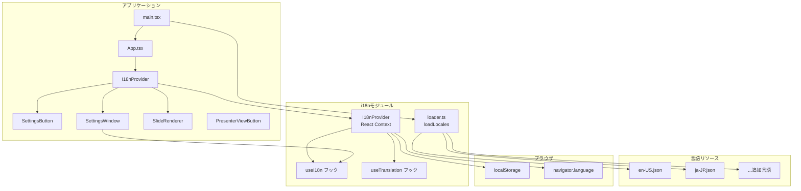

# 言語設定機能（Language Settings）

**ドキュメント種別:** 技術設計書 (Design Doc)
**SDDフェーズ:** Plan (計画/設計)
**最終更新日:** 2026-02-01
**関連 Spec:** [language-settings_spec.md](./language-settings_spec.md)
**関連 PRD:** [language-settings.md](../requirement/language-settings.md)

---

# 1. 実装ステータス

**ステータス:** 🟢 実装完了

## 1.1. 実装進捗

| モジュール/機能                                | ステータス   | 備考                                                           |
|-----------------------------------------|---------|--------------------------------------------------------------|
| 言語リソースJSONファイル（en-US, ja-JP）            | 🟢 実装完了 | `public/assets/locales/` に配置、manifest.json による自動検出           |
| 言語リソースローダー（loadLocales）                 | 🟢 実装完了 | `src/i18n/loader.ts` — バリデーション付きローダー                         |
| I18nProvider / useI18n / useTranslation | 🟢 実装完了 | `src/i18n/i18nProvider.tsx` — React Context ベース              |
| SettingsButton コンポーネント                  | 🟢 実装完了 | `src/components/SettingsButton.tsx` — 歯車アイコン、左上配置            |
| SettingsWindow コンポーネント                  | 🟢 実装完了 | `src/components/SettingsWindow.tsx` — オーバーレイモーダル、言語セレクト      |
| ブラウザ言語検出                                | 🟢 実装完了 | 完全一致 → プレフィックス一致 → en-US フォールバック                             |
| localStorage 永続化                        | 🟢 実装完了 | キー `slide-app-locale` で保存・復元                                 |
| 既存UIテキストの翻訳キー化                          | 🟢 実装完了 | PresenterViewButton, AudioPlayButton, AudioControlBar を翻訳キー化 |

---

# 2. 設計目標

1. **データ駆動の維持** — 言語リソースはJSONファイルとして `public/assets/locales/` に配置し、コード変更なしで言語追加を可能にする（A-003準拠）
2. **フォールバックファースト** — 言語リソースの読み込み失敗、キー欠落時に英語（en-US）にフォールバック（A-005準拠）
3. **コンポーネント分離** — 設定UI（SettingsButton, SettingsWindow）は既存コンポーネントと独立（A-001準拠）
4. **スタイルの階層管理** — CSS変数（`--theme-*`）を使用し、色値ハードコードを禁止（A-002準拠）
5. **バリデーション駆動** — 言語リソースJSONの構造検証を実装（D-002準拠）
6. **Reveal.js非干渉** — 設定UIがReveal.jsのキーボードショートカット・スライド操作を妨げない（T-002準拠）
7. **拡張性** — 設定ウィンドウに将来的に他の設定項目を追加可能な構造とする

---

# 3. 技術スタック

| 領域        | 採用技術                             | 選定理由                                                                           |
|-----------|----------------------------------|--------------------------------------------------------------------------------|
| 状態管理      | React Context API                | アプリ全体で言語状態を共有する必要があり、既存プロジェクトに外部状態管理ライブラリがないため、Contextが最適。言語切り替え時の再レンダリングも許容範囲 |
| 永続化       | localStorage                     | 後述の設計判断（9.1）参照。シンプルなキー・バリュー保存に適しており、セッション跨ぎの永続性がある                             |
| 言語リソース形式  | JSON                             | PRDの制約に準拠。`manifest.json` による動的検出でビルド不要の言語追加を実現                                |
| UIコンポーネント | カスタムHTML + CSS Modules            | 既存UIコンポーネント（PresenterViewButton, AudioPlayButton等）がMUIコンポーネントを使わずカスタムHTML + CSS Modulesで実装されており、一貫性を維持 |
| スタイリング    | CSS Modules                      | A-002に準拠。CSS変数（`--theme-*`）を使用し、テーマシステムとの統合を維持                                 |

---

# 4. アーキテクチャ

## 4.1. システム構成図



## 4.2. モジュール分割

| モジュール名         | 責務                 | 依存関係         | 配置場所                                |
|----------------|--------------------|--------------|-------------------------------------|
| loadLocales    | 言語リソースJSONの読み込み・検証 | なし           | `src/i18n/loader.ts`                |
| I18nProvider   | 言語状態管理、Context提供   | loadLocales  | `src/i18n/i18nProvider.tsx`         |
| useI18n        | 言語コンテキストへのアクセスフック  | I18nProvider | `src/i18n/i18nProvider.tsx`         |
| useTranslation | 翻訳関数（t）の提供         | I18nProvider | `src/i18n/i18nProvider.tsx`         |
| SettingsButton | 設定ボタンUI（左上オーバーレイ）  | なし           | `src/components/SettingsButton.tsx` |
| SettingsWindow | 設定ウィンドウUI（モーダル）    | useI18n      | `src/components/SettingsWindow.tsx` |
| en-US.json     | 英語リソース（フォールバック兼用）  | なし           | `public/assets/locales/en-US.json`  |
| ja-JP.json     | 日本語リソース            | なし           | `public/assets/locales/ja-JP.json`  |

## 4.3. 言語リソース読み込みフロー

```
main.tsx
├── Promise.all([loadAddons(), loadLocales()])  # アドオンと言語リソースを並列ロード
│   └── loadLocales()
│       ├── fetch('/assets/locales/manifest.json')  # マニフェストから言語ファイル一覧を取得
│       ├── 各JSONファイルを fetch で読み込み
│       ├── 構造バリデーション（D-002準拠）
│       └── LocaleResource[] を返却
├── fetch('/slides.json')      # 既存のスライドデータ読み込み
└── <I18nProvider locales={locales}>
      <App presentationData={data} />
    </I18nProvider>
```

---

# 5. データモデル

## 5.1. 言語リソースJSON構造

```typescript
// public/assets/locales/en-US.json の構造
interface LocaleResource {
  languageCode: string   // "en-US"
  languageName: string   // "English"
  ui: {
    settings: {
      title: string      // "Settings"
      language: string   // "Language"
      close: string      // "Close"
    }
    presenterView: {
      open: string       // "Open Presenter View"
      // 発表者ビュー関連のテキスト
    }
    // 将来的に追加されるUIセクション
    [key: string]: Record<string, string> | string
  }
}
```

## 5.2. localStorage のキー

| キー                 | 値                 | 説明          |
|--------------------|-------------------|-------------|
| `slide-app-locale` | 言語コード（例: `ja-JP`） | ユーザーが選択した言語 |

---

# 6. インターフェース定義

```typescript
// I18nProvider の props
interface I18nProviderProps {
  locales: LocaleResource[]
  defaultLocale?: string        // 初期言語の明示指定（省略時はlocalStorage → ブラウザ言語 → en-US の優先順で決定）
  children: React.ReactNode
}

// useI18n フックの返り値
interface I18nContextValue {
  locale: string
  locales: LocaleResource[]
  setLocale: (code: string) => void
  t: (key: string, fallback?: string) => string
}

// バリデーション結果
interface LocaleValidationResult {
  valid: boolean
  errors: Array<{
    path: string
    message: string
    expected: string
    actual: string
  }>
  resource: LocaleResource  // 補完済みリソース
}
```

---

# 7. 非機能要件実現方針

| 要件                     | 実現方針                                                                                         |
|------------------------|----------------------------------------------------------------------------------------------|
| NFR-001: 言語切り替え500ms以内 | React Context の状態更新により即座に再レンダリング。言語リソースはアプリ起動時にすべてメモリに読み込み済みのため、切り替え時のI/Oなし                  |
| Reveal.js非干渉           | 設定ウィンドウのオーバーレイ要素に `onKeyDown` ハンドラで `stopPropagation()` を設定し、キーボードイベントがReveal.jsに伝播するのを防止。`useReveal` フックの変更が不要でシンプル |

---

# 8. テスト戦略

| テストレベル     | 対象                                     | カバレッジ目標 |
|------------|----------------------------------------|---------|
| ユニットテスト    | loadLocales（バリデーション・フォールバック）           | 主要パス    |
| ユニットテスト    | t() 翻訳関数（キー解決、フォールバック）                 | 主要パス    |
| ユニットテスト    | 言語検出ロジック（navigator.language → 対応言語マッチ） | 主要パス    |
| コンポーネントテスト | SettingsWindow（言語切り替え操作）               | 主要パス    |
| 統合テスト      | 言語切り替え → localStorage保存 → 再読み込み復元      | ハッピーパス  |

---

# 9. 設計判断

## 9.1. 決定事項

| 決定事項       | 選択肢                                                      | 決定内容                          | 理由                                                                                                                                                   |
|------------|----------------------------------------------------------|-------------------------------|------------------------------------------------------------------------------------------------------------------------------------------------------|
| 永続化ストレージ   | A) localStorage B) Cookie C) sessionStorage D) IndexedDB | **A) localStorage**           | 保存するデータは言語コード（文字列1つ）のみでシンプル。localStorageはセッション跨ぎで永続化され、同期的にアクセス可能。Cookieはサーバーに毎回送信されるためクライアント専用アプリには不適切。sessionStorageはタブ閉じで消失する。IndexedDBは少量データには過剰 |
| 言語リソース配置場所 | A) public/assets/locales/ B) src/i18n/locales/           | **A) public/assets/locales/** | PRDの要求（FR-LANG-008）でコード変更なしの言語追加が必須。publicディレクトリに配置することでビルド不要で追加可能。`manifest.json` にファイル一覧を記載し、ランタイムで `fetch` により動的に読み込む方式を採用                         |
| 状態管理方式     | A) React Context B) Zustand C) グローバル変数                   | **A) React Context**          | 既存プロジェクトに外部状態管理ライブラリがなく、言語状態はアプリ全体で共有するためContextが適切。Zustandは新規依存の追加になる。グローバル変数はReactの再レンダリングと統合できない                                                  |
| 翻訳関数の実装    | A) 自前実装 B) react-i18next C) react-intl                   | **A) 自前実装**                   | このアプリのUI翻訳は限定的（設定ウィンドウ、発表者ビューボタン等の少数テキスト）であり、ライブラリ追加のオーバーヘッドに見合わない。ドット記法のキー解決（`t('settings.title')`）程度の簡易実装で十分                                       |
| 設定ウィンドウの実装 | A) MUI Dialog B) カスタムモーダル                                | **B) カスタムモーダル**               | 既存UIコンポーネント（PresenterViewButton, AudioPlayButton, AudioControlBar）がMUIコンポーネントを使わずカスタムHTML + CSS Modulesで実装されているため、一貫性を維持。オーバーレイ、閉じるボタン、外部クリック閉じをCSS Modulesで実装 |

## 9.2. 永続化ストレージ詳細比較

ユーザーの要望に基づき、ブラウザストレージの選択肢を詳細に比較した。

| 観点         | localStorage | Cookie                 | sessionStorage | IndexedDB  |
|------------|--------------|------------------------|----------------|------------|
| **永続性**    | ブラウザ閉じても維持   | 有効期限設定可能               | タブ閉じで消失        | ブラウザ閉じても維持 |
| **容量**     | 約5MB         | 約4KB                   | 約5MB           | 事実上無制限     |
| **API**    | 同期（シンプル）     | document.cookie（パース必要） | 同期（シンプル）       | 非同期（複雑）    |
| **サーバー送信** | なし           | 毎リクエスト自動送信             | なし             | なし         |
| **適合性**    | 最適           | 不適切（サーバーなし）            | 不適切（永続性なし）     | 過剰         |

**結論**: localStorageが最適。理由は以下の通り：

- このアプリはクライアントサイドのみで動作するため、Cookieのサーバー送信は不要かつ無駄
- sessionStorageはタブを閉じると設定が消えるため、FR-LANG-007（再訪問時復元）を満たせない
- IndexedDBは非同期APIであり、言語コード1つの保存には過剰
- localStorageは同期的にアクセスでき、ブラウザを閉じても維持される

---

# 10. 変更履歴

## v1.1.0 (2026-02-01)

**実装完了に伴う設計書更新:**

- 実装ステータスを 🟢 実装完了 に更新
- 設定ウィンドウの実装方式を MUI Dialog からカスタムモーダル（CSS Modules）に変更（既存コンポーネントとの一貫性）
- 言語リソース読み込み方式を `import.meta.glob` から `fetch` + `manifest.json` に変更
- Reveal.js非干渉の実現方式を `Reveal.configure()` から `stopPropagation()` に変更
- I18nProviderProps に `defaultLocale` オプショナルプロパティを追記
- 技術スタックのUIコンポーネント・スタイリング欄を実装に合わせて修正

## v1.0.0 (2026-02-01)

**初版作成:**

- 言語設定機能の技術設計を策定
- 永続化ストレージとしてlocalStorageを選定
- React Context による状態管理を採用
- 翻訳関数の自前実装を決定
