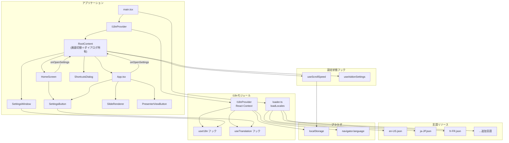

# 言語設定機能（Language Settings）

**ドキュメント種別:** 技術設計書 (Design Doc)
**SDDフェーズ:** Plan (計画/設計)
**最終更新日:** 2026-07-29
**関連 Spec:** [language-settings_spec.md](./language-settings_spec.md)
**関連 PRD:** [language-settings.md](../requirement/language-settings.md)

---

# 1. 実装ステータス

**ステータス:** 🟢 実装完了

## 1.1. 実装進捗

| モジュール/機能                                | ステータス   | 備考                                                           |
|-----------------------------------------|---------|--------------------------------------------------------------|
| 言語リソースJSONファイル（en-US, ja-JP, fr-FR）      | 🟢 実装完了 | `assets/locales/`（プロジェクトルート）に配置、manifest.json による自動検出       |
| 言語リソースローダー（loadLocales）                 | 🟢 実装完了 | `src/i18n/loader.ts` — バリデーション付きローダー                         |
| I18nProvider / useI18n / useTranslation | 🟢 実装完了 | `src/i18n/i18nProvider.tsx` — React Context ベース              |
| SettingsButton コンポーネント                  | 🟢 実装完了 | `src/components/SettingsButton.tsx` — 歯車アイコン。プレゼンテーション画面（`toolbar toolbar-left`）とホーム画面（`HomeScreen.module.css` の `.settingsCorner`）の左上に配置 |
| SettingsWindow コンポーネント                  | 🟢 実装完了 | `src/components/SettingsWindow.tsx` — `DialogFrame`（MUI Dialog）ベース。言語セレクト・ショートカット一覧・同梱アドオン設定＋（プレゼンテーション画面のみ）スクロール速度 |
| 設定ダイアログの Root 層保持                       | 🟢 実装完了 | `src/main.tsx` の `RootContent` が `settingsOpen` / `shortcutsOpen` と実体を1インスタンスだけ保持（FR-011） |
| アドオン信頼設定フック（useAddonSettings）            | 🟢 実装完了 | `src/hooks/useAddonSettings.ts` — `App.tsx` から抽出。`RootContent` が呼ぶ         |
| スクロール速度フック（useScrollSpeed）                | 🟢 実装完了 | `src/hooks/useScrollSpeed.ts` — `slide-app-scroll-speed` の読み書きを `useAutoSlideshow` から移設 |
| ブラウザ言語検出                                | 🟢 実装完了 | 完全一致 → プレフィックス一致 → en-US フォールバック                             |
| localStorage 永続化                        | 🟢 実装完了 | キー `slide-app-locale` で保存・復元                                 |
| 既存UIテキストの翻訳キー化                          | 🟢 実装完了 | PresenterViewButton, AudioPlayButton, AudioControlBar を翻訳キー化 |

---

# 2. 設計目標

1. **データ駆動の維持** — 言語リソースはJSONファイルとして `assets/locales/`（プロジェクトルート）に配置し、コード変更なしで言語追加を可能にする（A-003準拠）
2. **フォールバックファースト** — 言語リソースの読み込み失敗時は該当リソースを除外し、UIキー欠落時は参照時に英語（en-US）へフォールバック（A-005準拠）
3. **コンポーネント分離** — 設定UI（SettingsButton, SettingsWindow）は既存コンポーネントと独立（A-001準拠）
4. **スタイルの階層管理** — 原則としてCSS変数（`--theme-*`）を使用しテーマシステムと統合する（A-002準拠）。ただし一部にハードコード色が残存する（§9.3 参照）
5. **バリデーション駆動** — 言語リソースJSONの構造検証を実装（D-002準拠）
6. **Reveal.js非干渉** — 設定UIがReveal.jsのキーボードショートカット・スライド操作を妨げない（T-002準拠）
7. **拡張性** — 設定ウィンドウに将来的に他の設定項目を追加可能な構造とする
8. **設定 UI の到達性** — スライドを開く前（ホーム画面）でも言語を変更できるよう、設定ダイアログを画面本体から独立させて Root 層で保持する（FR-001 / FR-011）

---

# 3. 技術スタック

| 領域        | 採用技術                             | 選定理由                                                                           |
|-----------|----------------------------------|--------------------------------------------------------------------------------|
| 状態管理      | React Context API                | アプリ全体で言語状態を共有する必要があり、既存プロジェクトに外部状態管理ライブラリがないため、Contextが最適。言語切り替え時の再レンダリングも許容範囲 |
| 永続化       | localStorage                     | 後述の設計判断（9.1）参照。シンプルなキー・バリュー保存に適しており、セッション跨ぎの永続性がある                             |
| 言語リソース形式  | JSON                             | PRDの制約に準拠。`manifest.json` による動的検出でビルド不要の言語追加を実現                                |
| UIコンポーネント | カスタムHTML + CSS Modules（ダイアログ枠のみ MUI Dialog） | ボタン類は既存UIコンポーネント（PresenterViewButton, AudioPlayButton等）と揃えてカスタムHTML + CSS Modulesで実装。ダイアログ枠はフォーカストラップ・Esc 閉じを自前実装せずに済むよう `DialogFrame`（MUI Dialog）へ共通化した（§9.1） |
| スタイリング    | CSS Modules                      | 原則A-002に準拠し、CSS変数（`--theme-*`）を使用してテーマシステムと統合。ただしオーバーレイ背景やボタン前景色など一部にハードコード色が残存（§9.3 参照）             |

---

# 4. アーキテクチャ

## 4.1. システム構成図


```mermaid
graph TD
    subgraph "アプリケーション"
        Main[main.tsx]
        RootContent["RootContent<br/>(画面切替＋ダイアログ所有)"]
        HomeScreen[HomeScreen]
        App[App.tsx]
        I18nProvider[I18nProvider]
        SettingsButton[SettingsButton]
        SettingsWindow[SettingsWindow]
        ShortcutsDialog[ShortcutsDialog]
        SlideRenderer[SlideRenderer]
        PresenterViewButton[PresenterViewButton]
    end

    subgraph "設定状態フック"
        UseScrollSpeed[useScrollSpeed]
        UseAddonSettings[useAddonSettings]
    end

    subgraph "i18nモジュール"
        Loader[loader.ts<br/>loadLocales]
        Provider[I18nProvider<br/>React Context]
        UseI18n[useI18n フック]
        UseTranslation[useTranslation フック]
    end

    subgraph "言語リソース"
        EnUS[en-US.json]
        JaJP[ja-JP.json]
        FrFR[fr-FR.json]
        OtherLocales[...追加言語]
    end

    subgraph "ブラウザ"
        LocalStorage[localStorage]
        NavLang[navigator.language]
    end

    Main --> Loader
    Loader --> EnUS
    Loader --> JaJP
    Loader --> FrFR
    Loader --> OtherLocales
    Main --> I18nProvider
    I18nProvider --> Provider
    Provider --> UseI18n
    Provider --> UseTranslation
    I18nProvider --> RootContent
    RootContent --> HomeScreen
    RootContent --> App
    RootContent --> SettingsWindow
    RootContent --> ShortcutsDialog
    RootContent --> UseScrollSpeed
    RootContent --> UseAddonSettings
    HomeScreen -- onOpenSettings --> RootContent
    App -- onOpenSettings --> RootContent
    HomeScreen --> SettingsButton
    App --> SettingsButton
    App --> SlideRenderer
    App --> PresenterViewButton
    SettingsButton --> UseTranslation
    SettingsWindow --> UseI18n
    Provider --> LocalStorage
    Provider --> NavLang
    UseScrollSpeed --> LocalStorage
```

## 4.2. モジュール分割

| モジュール名         | 責務                 | 依存関係         | 配置場所                                |
|----------------|--------------------|--------------|-------------------------------------|
| loadLocales    | 言語リソースJSONの読み込み・検証 | なし           | `src/i18n/loader.ts`                |
| I18nProvider   | 言語状態管理、Context提供   | loadLocales  | `src/i18n/i18nProvider.tsx`         |
| useI18n        | 言語コンテキストへのアクセスフック  | I18nProvider | `src/i18n/i18nProvider.tsx`         |
| useTranslation | 翻訳関数（t）の提供         | I18nProvider | `src/i18n/i18nProvider.tsx`         |
| SettingsButton | 設定ボタンUI（左上オーバーレイ。ホーム画面・プレゼンテーション画面の双方から使用） | useTranslation | `src/components/SettingsButton.tsx` |
| SettingsWindow | 設定ウィンドウUI（モーダル。言語・ショートカット・同梱アドオン設定＋任意でスクロール速度） | useI18n, DialogFrame | `src/components/SettingsWindow.tsx` |
| RootContent    | 画面（ホーム / プレゼンテーション / 編集）の切り替えと設定・ショートカットダイアログの開閉状態の所有 | useI18n, useScrollSpeed, useAddonSettings | `src/main.tsx`（同ファイル内の内部コンポーネント） |
| useScrollSpeed | スクロール速度の状態保持と localStorage 永続化 | なし | `src/hooks/useScrollSpeed.ts` |
| useAddonSettings | 同梱アドオンの信頼設定（一律無効化・許可履歴・個別許可）の読み書き | localSlideLoader | `src/hooks/useAddonSettings.ts` |
| en-US.json     | 英語リソース（フォールバック兼用）  | なし           | `assets/locales/en-US.json`         |
| ja-JP.json     | 日本語リソース            | なし           | `assets/locales/ja-JP.json`         |
| fr-FR.json     | フランス語リソース          | なし           | `assets/locales/fr-FR.json`         |

## 4.3. 言語リソース読み込みフロー

```
main.tsx
├── Promise.all([loadBuiltinAddons(), loadLocales(), getRecentSlidePackages(), applyTheme()])  # 起動時に並列ロード
│   └── loadLocales()
│       ├── fetch('/assets/locales/manifest.json')  # マニフェストから言語ファイル一覧を取得
│       ├── 各JSONファイルを fetch で読み込み
│       ├── validateLocaleResource() で構造バリデーション（D-002準拠。不正リソースは読み込み対象から除外）
│       └── LocaleResource[] を返却
└── <Root locales={locales} initialRecentPackages={...}>
      └── <I18nProvider locales={locales}>
            <ToastProvider>
              <RootContent />
            </ToastProvider>
          </I18nProvider>
```

## 4.4. 設定ダイアログの配置

`RootContent` は「画面本体」と「ダイアログ」を兄弟として描画する。画面本体は排他（いずれか1つだけ）だが、ダイアログはどの画面と組み合わせても開ける。

```
<I18nProvider>
└── <ThemeProvider theme={theme}>   # MUI テーマはこの層で 1 度だけ張る（§9.4）
      └── <ToastProvider>
            └── <RootContent>
                  ├── renderScreen()（排他）
                  │   ├── <SlideEditor>   # view === 'edit' かつ editSource あり
                  │   ├── <HomeScreen onOpenSettings={openSettings}>   # view === 'home'
                  │   └── <App onOpenSettings={openSettings} scrollSpeed onScrollSpeedChange />
                  ├── <SettingsWindow open={settingsOpen}
                  │     scrollSpeed={view === 'presentation' ? scrollSpeed : undefined}   # FR-011
                  │     setScrollSpeed={setScrollSpeed}
                  │     embeddedAddonsDisabled / onToggleEmbeddedAddons / onResetAddonTrust
                  │     addonTrust / onSetAddonTrust / onOpenShortcuts />
                  └── <ShortcutsDialog open={shortcutsOpen} />
```

- 開閉状態（`settingsOpen` / `shortcutsOpen`）は `RootContent` が所有し、`HomeScreen` / `App` へは `onOpenSettings` のコールバックだけを渡す
- 出し分けの条件は「値の有無」1 本に寄せる。`scrollSpeed` だけを `view` で切り替え、`setScrollSpeed` は常に渡す（受け側の判定も `scrollSpeed !== undefined` の 1 つで済む）
- `view` の変化を監視する `useEffect` で両ダイアログを閉じる。従来は `App` 全体の再マウントで閉じていた挙動を、Root 保持へ移した後も維持するため
- `?` キーの `keydown` 購読は `RootContent` が持つ。ダイアログの所有者と同じ層に置くことで、ホーム・プレゼンテーション・編集のどの画面からでも同じキーで開ける（`App` への `onOpenShortcuts` prop は不要になった）
- 一方 `T` キー（ツールバートグル）の購読は `App` に残す。`toolbarHidden` はプレゼンテーション画面固有のローカル状態であり、ホーム画面の URL 入力中に `T` でツールバー状態が動くような無関係な結合を避けるため
- どちらの購読も `INPUT` / `TEXTAREA` / `contentEditable` にフォーカスがある間は無視する（編集画面の JSON 入力中に誤発火させない）

---

# 5. データモデル

## 5.1. 言語リソースJSON構造

```typescript
// assets/locales/en-US.json の構造
interface LocaleResource {
  languageCode: string   // "en-US"
  languageName: string   // "English"
  ui: {
    settings: {
      title: string      // "Settings"
      language: string   // "Language"
      close: string      // "Close"
    }
    presenterView: {
      open: string       // "Open Presenter View"
      // 発表者ビュー関連のテキスト
    }
    // 将来的に追加されるUIセクション
    [key: string]: Record<string, string> | string
  }
}
```

## 5.2. localStorage のキー

| キー                 | 値                 | 説明          |
|--------------------|-------------------|-------------|
| `slide-app-locale` | 言語コード（例: `ja-JP`） | ユーザーが選択した言語 |

---

# 6. インターフェース定義

```typescript
// I18nProvider の props
interface I18nProviderProps {
  locales: LocaleResource[]
  defaultLocale?: string        // 初期言語の明示指定（省略時はlocalStorage → ブラウザ言語 → en-US の優先順で決定）
  children: React.ReactNode
}

// useI18n フックの返り値
interface I18nContextValue {
  locale: string
  locales: LocaleResource[]
  setLocale: (code: string) => void
  t: (key: string, fallback?: string) => string
}

// バリデーション結果
interface LocaleValidationResult {
  valid: boolean
  errors: Array<{
    path: string
    message: string
    expected: string
    actual: string
  }>
  resource: LocaleResource  // 検証対象のリソース（マージ・補完はしない。渡された resource をそのまま返す）
}

// loader.ts が公開する検証関数（必須構造のみを検査し、valid=false のリソースは loadLocales が読み込み対象から除外）
function validateLocaleResource(resource: LocaleResource): LocaleValidationResult

// SettingsWindow の props（FR-010: 言語以外の設定項目を追加できる拡張構造を具現化）
// 言語セレクト以外の行はすべて「対応する props が揃っているときだけ描画する」規約で表示を切り替える
interface SettingsWindowProps {
  open: boolean
  onClose: () => void
  scrollSpeed?: number                    // 自動スライドショーのスクロール速度（秒）。未指定時はスクロール速度行を非表示（FR-011）
  setScrollSpeed?: (speed: number) => void  // 呼び出し側は常に渡す。行の表示判定は scrollSpeed の有無のみで行う
  embeddedAddonsDisabled?: boolean        // 同梱アドオンの一律無効化フラグ
  onToggleEmbeddedAddons?: (disabled: boolean) => void  // 未指定時はアドオン設定セクション全体を非表示
  onResetAddonTrust?: () => void          // アドオン許可履歴のリセット
  addonTrust?: AddonTrustEntry[]          // パッケージ単位の許可/拒否の一覧（未指定/空なら非表示）
  onSetAddonTrust?: (path: string, decision: AddonTrustDecision | undefined) => void
  onOpenShortcuts?: () => void            // ショートカット一覧を開く（未指定時はボタンを非表示）
}

// スクロール速度の状態フック（既定値 20 秒 / localStorage キー `slide-app-scroll-speed`）
function useScrollSpeed(): [number, (speed: number) => void]

// 同梱アドオンの信頼設定フック（active が true になるたび信頼一覧を作り直す）。
// title の供給元は Root が持つ recentPackages で、store の再読はしない
function useAddonSettings(options: { active: boolean; recentPackages: RecentSlidePackageEntry[] }): UseAddonSettingsReturn

// 層C の一覧要素。定義はフック側（src/hooks/useAddonSettings.ts）が持ち、SettingsWindow が import する
type AddonTrustEntry = { path: string; title: string; decision: AddonTrustDecision | undefined }

interface UseAddonSettingsReturn {
  addonsDisabled: boolean
  addonTrustList: AddonTrustEntry[]
  handleToggleAddonsDisabled: (disabled: boolean) => void
  handleResetAddonTrust: () => void
  handleSetAddonTrust: (path: string, decision: AddonTrustDecision | undefined) => void
}

// HomeScreen は設定ダイアログを所有せず、開く要求だけを Root へ通知する（必須 prop）
interface HomeScreenProps {
  // ...（スライド読み込み系の props は省略）
  onOpenSettings: () => void
}
```

---

# 7. 非機能要件実現方針

| 要件                     | 実現方針                                                                                         |
|------------------------|----------------------------------------------------------------------------------------------|
| NFR-001: 言語切り替え500ms以内 | React Context の状態更新により即座に再レンダリング。言語リソースはアプリ起動時にすべてメモリに読み込み済みのため、切り替え時のI/Oなし                  |
| Reveal.js非干渉           | 設定ウィンドウのオーバーレイ要素に `onKeyDown` ハンドラで `stopPropagation()` を設定し、キーボードイベントがReveal.jsに伝播するのを防止 |
| `?` キーと Reveal の衝突     | Reveal は keyCode 191（`/`）を一時停止に割り当てており、`?` は `Shift` + `/` のため一覧を開くたびにスライドがブラックアウトしていた。`useReveal` の `keyboard: { 191: null }` で当該バインドのみ外して解消（一時停止は `B` / `.` で従来どおり可能）。回帰は `e2e/shortcuts.spec.ts` で検証する |

---

# 8. テスト戦略

| テストレベル     | 対象                                     | カバレッジ目標 |
|------------|----------------------------------------|---------|
| ユニットテスト    | loadLocales（バリデーション・フォールバック）           | 主要パス    |
| ユニットテスト    | t() 翻訳関数（キー解決、フォールバック）                 | 主要パス    |
| ユニットテスト    | 言語検出ロジック（navigator.language → 対応言語マッチ） | 主要パス    |
| ユニットテスト    | useScrollSpeed（既定値・localStorage 読み書き）`src/hooks/__tests__/useScrollSpeed.test.ts` | 主要パス |
| ユニットテスト    | useAddonSettings（無効化フラグ復元・信頼一覧の構築・保存失敗時のロールバック）`src/hooks/__tests__/useAddonSettings.test.ts` | 主要パス |
| コンポーネントテスト | SettingsWindow（言語切り替え操作、`scrollSpeed` 未指定でスクロール速度行が出ないこと・FR-011） | 主要パス    |
| コンポーネントテスト | HomeScreen（設定ボタン押下で `onOpenSettings` が呼ばれること・FR-001） | 主要パス    |
| コンポーネントテスト | ShortcutsDialog（ビューア・編集モード・発表者ビューの全節と各キーが表示されること） | 主要パス    |
| 統合テスト      | 言語切り替え → localStorage保存 → 再読み込み復元      | ハッピーパス  |
| E2E（Playwright） | `e2e/settings.spec.ts` — 設定ダイアログの開閉と各コントロール、ホーム画面から開くとグローバル設定のみ表示（FR-011）、ホーム画面での言語切り替えで UI 文言が即座に変わる（FR-004 / UR-LANG-001） | ハッピーパス |
| E2E（Playwright） | `e2e/shortcuts.spec.ts` — `?` で全節が開く / `?` でスライドが一時停止しない（Reveal の keyCode 191 との衝突の回帰） / `B` の一時停止は維持 / ホーム画面でも `?` で開く | ハッピーパス＋回帰 |

---

# 9. 設計判断

## 9.1. 決定事項

| 決定事項       | 選択肢                                                      | 決定内容                          | 理由                                                                                                                                                   |
|------------|----------------------------------------------------------|-------------------------------|------------------------------------------------------------------------------------------------------------------------------------------------------|
| 永続化ストレージ   | A) localStorage B) Cookie C) sessionStorage D) IndexedDB | **A) localStorage**           | 保存するデータは言語コード（文字列1つ）のみでシンプル。localStorageはセッション跨ぎで永続化され、同期的にアクセス可能。Cookieはサーバーに毎回送信されるためクライアント専用アプリには不適切。sessionStorageはタブ閉じで消失する。IndexedDBは少量データには過剰 |
| 言語リソース配置場所 | A) プロジェクトルート assets/locales/ B) public/assets/locales/ C) src/i18n/locales/ | **A) プロジェクトルート assets/locales/** | PRDの要求（FR-LANG-008）でコード変更なしの言語追加が必須。`vite.config.ts` の assetsPlugin が `/assets` を dev サーバーで配信し、ビルド時に `dist/assets` へコピーするため、`public/` を経由せずプロジェクトルート直下の `assets/` に配置する独自規約を採用。フォント・テーマ等の他アセットと配置規約を統一でき、`manifest.json` にファイル一覧を記載してランタイムで `fetch` により動的に読み込む方式を採用 |
| 状態管理方式     | A) React Context B) Zustand C) グローバル変数                   | **A) React Context**          | 既存プロジェクトに外部状態管理ライブラリがなく、言語状態はアプリ全体で共有するためContextが適切。Zustandは新規依存の追加になる。グローバル変数はReactの再レンダリングと統合できない                                                  |
| 翻訳関数の実装    | A) 自前実装 B) react-i18next C) react-intl                   | **A) 自前実装**                   | このアプリのUI翻訳は限定的（設定ウィンドウ、発表者ビューボタン等の少数テキスト）であり、ライブラリ追加のオーバーヘッドに見合わない。ドット記法のキー解決（`t('settings.title')`）程度の簡易実装で十分                                       |
| 設定ウィンドウの実装 | A) MUI Dialog B) カスタムモーダル                                | **A) MUI Dialog（`DialogFrame` で共通化）**  | 初版は B) カスタムモーダルだったが、ショートカット一覧・アドオン許可などダイアログが増えたため、フォーカストラップ・Esc 閉じ・外部クリック閉じを MUI Dialog に委ね、ヘッダー／フッターと配色（`DialogFrame.module.css` の `.window` で `--fixed-*` パレットに固定）を `DialogFrame` へ共通化する方式に移行した |
| 設定ダイアログの所有者 | A) `App`（プレゼンテーション画面）が持つ B) `RootContent`（Root 直下）が持つ C) 画面ごとに別インスタンスを持つ | **B) `RootContent` が持つ** | 言語設定を持つ `I18nProvider` は Root 直下にあるのに、変更 UI が `App` のライフサイクル内に閉じ込められていたことが「ホーム画面で言語を変更できない」原因だった。データ（開閉状態）の所有は使用側の共通祖先に置くという原則に従い、ホーム画面・プレゼンテーション画面・編集画面の共通祖先へ引き上げた。C) は同じダイアログの実装が複数箇所に散り、状態の同期が必要になるため却下 |
| プレゼンテーション専用設定の出し分け | A) props 未指定で行を非表示 B) `variant`/`mode` prop で表示セットを切り替え C) 画面ごとに別のウィンドウコンポーネント | **A) props 未指定で行を非表示** | `SettingsWindow` は既に `onOpenShortcuts` / `onToggleEmbeddedAddons` を「渡されたときだけ行を描画する」規約で拡張してきた（FR-010）。`scrollSpeed` / `setScrollSpeed` を optional にするだけで FR-011 を満たせ、新しい概念（variant）を導入しないで済む |
| 編集画面（SlideEditor）への設定導線 | A) 今回追加する B) スコープ外とする | **B) スコープ外とする** | 現状 `SlideEditor.tsx` に設定導線が存在せず、追加は新機能になる。加えて編集画面は `editorUiTheme`（コンパクトな固定サイズ）で描画されるため、設定ダイアログを重ねるにはテーマ境界の設計が別途必要。ダイアログ自体は Root にあるので、将来 `onOpenSettings` を1つ渡すだけで対応できる状態にしてある |

## 9.2. 永続化ストレージ詳細比較

ユーザーの要望に基づき、ブラウザストレージの選択肢を詳細に比較した。

| 観点         | localStorage | Cookie                 | sessionStorage | IndexedDB  |
|------------|--------------|------------------------|----------------|------------|
| **永続性**    | ブラウザ閉じても維持   | 有効期限設定可能               | タブ閉じで消失        | ブラウザ閉じても維持 |
| **容量**     | 約5MB         | 約4KB                   | 約5MB           | 事実上無制限     |
| **API**    | 同期（シンプル）     | document.cookie（パース必要） | 同期（シンプル）       | 非同期（複雑）    |
| **サーバー送信** | なし           | 毎リクエスト自動送信             | なし             | なし         |
| **適合性**    | 最適           | 不適切（サーバーなし）            | 不適切（永続性なし）     | 過剰         |

**結論**: localStorageが最適。理由は以下の通り：

- このアプリはクライアントサイドのみで動作するため、Cookieのサーバー送信は不要かつ無駄
- sessionStorageはタブを閉じると設定が消えるため、FR-LANG-007（再訪問時復元）を満たせない
- IndexedDBは非同期APIであり、言語コード1つの保存には過剰
- localStorageは同期的にアクセスでき、ブラウザを閉じても維持される

## 9.3. 未解決の課題

| 課題                                                                                                                                                                                                 | 影響度 | 対応方針                                                                                                                                    |
|----------------------------------------------------------------------------------------------------------------------------------------------------------------------------------------------------|-----|-----------------------------------------------------------------------------------------------------------------------------------------|
| 設定UIのCSSに一部ハードコード色が残存しており、A-002（色値ハードコード禁止）に完全準拠していない。具体的には `SettingsButton.module.css` の前景色 `color: #fff`、`DialogFrame.module.css` の box-shadow `rgba(0, 0, 0, 0.4)`（オーバーレイ背景は MUI Dialog の backdrop に委譲済み） | 低   | 前景色・影用の `--theme-*` CSS変数を追加して置き換える。視認性確保のための黒半透明の影・バックドロップはテーマ非依存の妥当値だが、変数化することで一貫性を高める余地がある。CSSはコード側の変更となるため本設計書では課題として記録するにとどめる |

## 9.4. MUI テーマを Root で 1 度だけ張る理由

`ThemeProvider theme={theme}`（`src/theme.ts`）は `Root`（`I18nProvider` の直下）で 1 度だけ張り、配下の `RootContent`・画面本体・両ダイアログすべてがそれを共有する。かつては MUI を使うサブツリーごとに provider を持たせていた（`App` / `presenterViewEntry` / `SlideEditor`）が、ダイアログが Root へ上がった時点で `App` 側の provider は重複になったため削除した。`presenterViewEntry` は別ウィンドウ＝別 React root なので独自に張り、`SlideEditor` は `editorUiTheme` を入れ子で上書きする（いずれも現状維持）。

テーマを与えないと配色が崩れる。理由は CSS の詳細度にある。

- `DialogFrame` は MUI `Dialog` の paper スロットへ `DialogFrame.module.css` の `.window` を渡し、`background: var(--theme-background-alt)` で背景色を決めている
- MUI が paper に付ける `.MuiPaper-root` も単一クラスセレクタであり、`.window` と詳細度が同等になる。したがって勝敗は宣言順に依存し、`.MuiPaper-root` 側の `background-color` が後勝ちすると背景が上書きされる
- `theme` は `MuiPaper.styleOverrides.root` で `backgroundImage: 'none'` を指定し、パレットを `mode: 'dark'` / `background.paper: '#292524'` に固定している。ThemeProvider を外すと MUI 既定（ライトテーマ）の paper 色とエレベーション用グラデーションが適用され、暗色前提の設定ダイアログの配色が破綻する

そのため、ダイアログを Root へ引き上げる際はテーマ境界も一緒に持ち上げる。Root 層に MUI を使う UI を足すときも、この provider の内側にあることを前提にできる。

---

# 10. 変更履歴

## v1.4.0 (2026-07-29)

**ショートカット一覧の単一真実源化と `?` キーの Root 移動:**

- `?` キーの `keydown` 購読を `App` から `RootContent` へ移動。ダイアログの所有者と同じ層に置き、ホーム・プレゼンテーション・編集のどの画面からでも開けるようにした（`App` の `onOpenShortcuts` prop は削除。`T` キーは `toolbarHidden` がローカル状態のため `App` に残す）
- `ShortcutsDialog` に「発表者ビュー」節（`→` / `Space` / `←`）を追加し、3 節を 2 カラム配置にして 1280x720 でスクロールなしに収まるようにした（`assets/locales/*.json` に `shortcuts.presenterSection` を追加）
- **既存バグの修正**: Reveal は keyCode 191（`/`）を一時停止に割り当てており、`?` は `Shift` + `/` のため一覧を開くたびにスライドがブラックアウトしていた。`useReveal` の `keyboard: { 191: null }` で当該バインドのみ外した（`B` / `.` での一時停止は維持。`src/reveal.d.ts` の `keyboard` 型も実仕様へ拡張）
- README 英日からキーマップの表（プレゼンビューア / 編集モード / 発表者ビュー）を削除し、`?` で開ける旨と `shortcuts.png` のみを残した。キーマップの真実源をダイアログ 1 つに統一して実装との乖離を防ぐ
- 回帰テストを `e2e/shortcuts.spec.ts` に追加（全節の表示 / `?` で一時停止しない / `B` は一時停止する / ホーム画面でも開く）

**前バージョンで反映漏れだった実装（レビュー後の整理分）を追記:**

- `ThemeProvider` は `Root` で 1 度だけ張り、`App` 側の provider は削除済み（§4.4・§9.4）
- `useAddonSettings` は `{ active, recentPackages }` を受け取り、title 補完のための store 再読を廃止（§6）
- `AddonTrustEntry` の定義は `src/hooks/useAddonSettings.ts` が持ち、`SettingsWindow` が import する（hooks → components の依存方向の逆流を解消）
- `setScrollSpeed` は常に渡し、行の表示判定は `scrollSpeed` の有無のみで行う（§4.4・§6）
- `.settingsCorner` の位置は `12px`（`global.css` の `.toolbar-left` と一致させ、画面遷移時のずれを解消）

## v1.3.0 (2026-07-28)

**設定ダイアログの Root 層への引き上げ（FR-LANG-011 追加）:**

- 設定・ショートカットダイアログの所有者を `App` から `main.tsx` の `RootContent` へ移動（開閉 state と実体の描画。画面本体の兄弟として1インスタンスのみ）。`view` 変化時に `useEffect` で閉じることで、従来の「App 再マウントで閉じる」挙動を維持（§4.4・§9.1）
- `HomeScreen` に必須 prop `onOpenSettings` と左上の `SettingsButton` を追加（`.settingsCorner` は `position: fixed`。`.container` が `overflow-y: auto` のスクロール領域のため）。読み込み中も無効化しない（FR-001）
- `SettingsWindow` の `scrollSpeed` / `setScrollSpeed` を optional 化し、両方揃ったときのみスクロール速度行を描画。ホーム画面ではグローバル設定のみを提示する（FR-011）
- アドオン信頼設定を `src/hooks/useAddonSettings.ts` に、スクロール速度の永続化を `src/hooks/useScrollSpeed.ts` に抽出（`useAutoSlideshow` は controlled 化し `scrollSpeed` を必須オプションで受け取る）
- `App` に `scrollSpeed` / `onScrollSpeedChange` / `onOpenSettings` / `onOpenShortcuts` を追加し、読み出しのない `scrollSpeedRef` 系を削除
- ダイアログを `ThemeProvider` で包む理由（`.window` と `.MuiPaper-root` の詳細度が同等）を §9.4 に記録
- 編集画面（`SlideEditor`）への設定導線をスコープ外とした判断を §9.1 に記録
- 技術スタック・§9.1「設定ウィンドウの実装」を実態（`DialogFrame` = MUI Dialog）へ訂正し、§9.3 のハードコード色の所在も実態（`DialogFrame.module.css` の box-shadow。オーバーレイ背景は MUI backdrop へ移行済み）へ更新
- テスト戦略に `useScrollSpeed` / `useAddonSettings` / `HomeScreen` / `e2e/settings.spec.ts` を追記

## v1.2.0 (2026-07-24)

**実装との整合（ドキュメント修正）:**

- 言語リソース配置を `public/assets/locales/` → `assets/locales/`（プロジェクトルート、vite assetsPlugin が `/assets` を配信）に修正し、独自 assets/ 規約の採用理由を §9.1 に追記
- 対応ロケールを en-US / ja-JP / fr-FR の3言語に更新（manifest.json / fr-FR.json 実在）
- 欠落キー補完の仕組みを「ロード時マージ」→「`t()` 参照時の en-US フォールバック」に修正（§6 の「補完済みリソース」記述を実態に合わせて訂正）
- SettingsWindow の拡張 props（scrollSpeed / setScrollSpeed / embeddedAddonsDisabled / onToggleEmbeddedAddons / onResetAddonTrust）と対応UIを反映（FR-010 の具現化）
- A-002 準拠記述を実態（一部ハードコード色あり）に訂正し、§9.3 未解決の課題を追加
- 起動フローを `Promise.all([loadBuiltinAddons(), loadLocales(), getRecentSlidePackages(), applyTheme()])` に修正（`loadAddons` → `loadBuiltinAddons`）

## v1.1.0 (2026-02-01)

**実装完了に伴う設計書更新:**

- 実装ステータスを 🟢 実装完了 に更新
- 設定ウィンドウの実装方式を MUI Dialog からカスタムモーダル（CSS Modules）に変更（既存コンポーネントとの一貫性）
- 言語リソース読み込み方式を `import.meta.glob` から `fetch` + `manifest.json` に変更
- Reveal.js非干渉の実現方式を `Reveal.configure()` から `stopPropagation()` に変更
- I18nProviderProps に `defaultLocale` オプショナルプロパティを追記
- 技術スタックのUIコンポーネント・スタイリング欄を実装に合わせて修正

## v1.0.0 (2026-02-01)

**初版作成:**

- 言語設定機能の技術設計を策定
- 永続化ストレージとしてlocalStorageを選定
- React Context による状態管理を採用
- 翻訳関数の自前実装を決定
