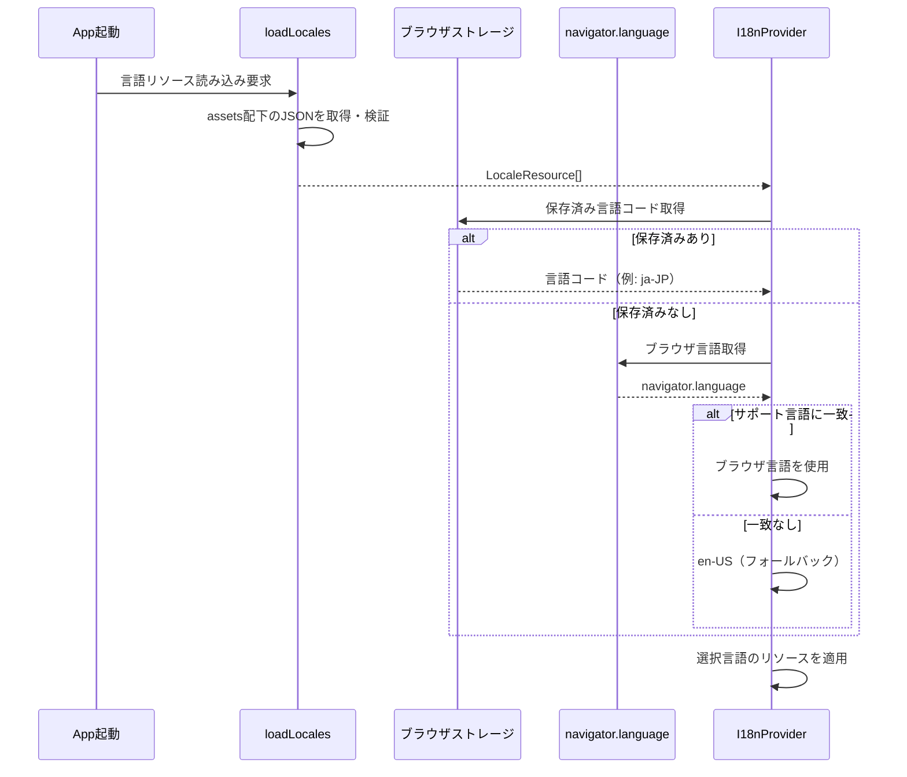
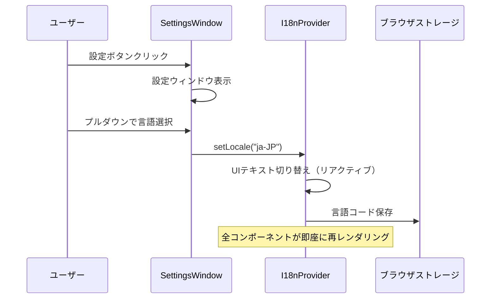

# 言語設定機能（Language Settings）

**ドキュメント種別:** 抽象仕様書 (Spec)
**SDDフェーズ:** Specify (仕様化)
**最終更新日:** 2026-02-01
**関連 Design Doc:** [language-settings_design.md](./language-settings_design.md)
**関連 PRD:** [language-settings.md](../requirement/language-settings.md)

---

# 1. 背景

スライドプレゼンテーションアプリは国際的なユーザーに使用される可能性があるが、現状ではUIテキスト（ボタンラベル、ウィンドウタイトル等）が固定言語で表示されている。ユーザーが自身の言語でアプリを操作できるようにすることで、利便性と理解のしやすさが向上する。

また、言語リソースをファイルベースで管理し、JSONファイルの追加のみでサポート言語を拡張できる仕組みとすることで、開発者以外でも言語の追加・更新が容易になる。

# 2. 概要

言語設定機能は、アプリのUI表示言語をユーザーが動的に切り替えられる仕組みを提供する。

**主要な設計原則:**

1. **データ駆動** — 言語リソースはJSONファイルとして外部管理し、コード変更なしで言語を追加可能とする（A-003準拠）
2. **フォールバックファースト** — 言語リソースの欠落や読み込み失敗時は英語（en-US）にフォールバックし、アプリの動作を継続する（A-005準拠）
3. **コンポーネント分離** — 設定UI（設定ボタン、設定ウィンドウ）は既存のSlideRendererとは独立したコンポーネントとして実装する（A-001準拠）
4. **バリデーション駆動** — 外部JSONファイルは読み込み時に構造を検証し、不正なデータに対して安全にフォールバックする（D-002準拠）

# 3. 要求定義

## 3.1. 機能要件 (Functional Requirements)

| ID     | 要件                                                                                | 優先度    | PRD参照       |
|--------|-----------------------------------------------------------------------------------|--------|-------------|
| FR-001 | メインスライド画面の左上に設定ボタンを常時表示する。ボタンはスライドコンテンツの上にオーバーレイ配置し、Reveal.jsのスライド操作を妨げない         | Must   | FR-LANG-001 |
| FR-002 | 設定ボタン押下時にスライドの上にオーバーレイ形式で設定ウィンドウを表示する。ウィンドウ外クリックまたは閉じるボタンで非表示にできる                 | Must   | FR-LANG-002 |
| FR-003 | 設定ウィンドウ内にプルダウン形式の言語選択UIを配置する。読み込み済みの全サポート言語が選択肢として表示される                           | Must   | FR-LANG-003 |
| FR-004 | プルダウンで言語を選択すると、アプリのUIテキストがページリロードなしで即座に切り替わる                                      | Must   | FR-LANG-004 |
| FR-005 | 初回訪問時（保存済み設定なし）にブラウザの言語設定を検出し、対応するサポート言語があればデフォルトとする                              | Should | FR-LANG-005 |
| FR-006 | ブラウザ言語が非対応の場合、または言語リソースのキーが欠落している場合、英語（en-US）をフォールバックとして使用する                      | Must   | FR-LANG-006 |
| FR-007 | ユーザーが選択した言語設定（言語コード）をブラウザに永続化し、再訪問時に自動復元する                                        | Must   | FR-LANG-007 |
| FR-008 | 言語リソースをassets配下のJSONファイルとして管理し、ファイル配置のみで自動的に読み込む。JSONの構造を検証し、欠落キーはフォールバック言語から補完する | Must   | FR-LANG-008 |
| FR-009 | 日本語（ja-JP）と英語（en-US）を最低限サポートする                                                    | Must   | FR-LANG-009 |
| FR-010 | 設定ウィンドウは将来的に言語以外の設定項目を追加できる構造とする                                                  | Could  | FR-LANG-010 |

## 3.2. 非機能要件 (Non-Functional Requirements)

| ID      | カテゴリ | 要件               | 目標値     |
|---------|------|------------------|---------|
| NFR-001 | 性能   | 言語切り替え時のUIテキスト反映 | 500ms以内 |

# 4. API

## 4.1. 公開API一覧

| ディレクトリ          | ファイル名              | エクスポート           | 概要                              |
|-----------------|--------------------|------------------|---------------------------------|
| src/i18n/       | i18nProvider.tsx   | `I18nProvider`   | 言語コンテキストを提供するプロバイダーコンポーネント      |
| src/i18n/       | i18nProvider.tsx   | `useI18n`        | 現在の言語リソース・言語切り替え関数を返すフック        |
| src/i18n/       | i18nProvider.tsx   | `useTranslation` | 翻訳関数 `t(key)` を返すフック            |
| src/i18n/       | loader.ts          | `loadLocales`    | assets配下の言語リソースJSONを読み込み・検証する関数 |
| src/components/ | SettingsButton.tsx | `SettingsButton` | スライド左上に表示する設定ボタンコンポーネント         |
| src/components/ | SettingsWindow.tsx | `SettingsWindow` | 設定ウィンドウのオーバーレイコンポーネント           |

## 4.2. 型定義

```typescript
/** 言語リソースの構造 */
interface LocaleResource {
  languageCode: string       // BCP 47形式（例: "ja-JP"）
  languageName: string       // 表示名（例: "日本語"）
  ui: Record<string, string | Record<string, string>>  // UIテキストのキー・バリュー（ネスト可）
}

/** i18nコンテキストの公開インターフェース */
interface I18nContext {
  locale: string                            // 現在の言語コード
  locales: LocaleResource[]                 // 利用可能な言語リソース一覧
  setLocale: (code: string) => void         // 言語を切り替える
  t: (key: string, fallback?: string) => string  // 翻訳関数（ドット記法でキーを指定）
}
```

# 5. 用語集

| 用語      | 説明                               |
|---------|----------------------------------|
| UI言語    | アプリのインターフェース（ボタン、ラベル等）の表示言語      |
| 言語リソース  | 各言語のUIテキストを定義するJSONファイル          |
| フォールバック | 指定言語のリソースが見つからない場合に使用される代替言語（英語） |
| 言語コード   | BCP 47形式の言語識別子（例: ja-JP, en-US）  |
| ロケール    | 言語コードの別名。言語と地域の組み合わせ             |

# 6. 使用例

```tsx
import { I18nProvider, useTranslation } from './i18n/i18nProvider'

// アプリのルートでプロバイダーをラップ
function App() {
  return (
    <I18nProvider>
      <MainContent />
    </I18nProvider>
  )
}

// コンポーネント内での翻訳使用
function SettingsWindow() {
  const { t } = useTranslation()
  const { locale, locales, setLocale } = useI18n()

  return (
    <div>
      <h2>{t('settings.title')}</h2>
      <select value={locale} onChange={(e) => setLocale(e.target.value)}>
        {locales.map((l) => (
          <option key={l.languageCode} value={l.languageCode}>
            {l.languageName}
          </option>
        ))}
      </select>
    </div>
  )
}
```

# 7. 振る舞い図

## 7.1. 言語初期化フロー



## 7.2. 言語切り替えフロー



# 8. 制約事項

- 言語リソースファイルの形式はJSON固定（A-003 データ駆動型）
- フォールバック言語は英語（en-US）で固定
- Reveal.jsのスライド操作（キーボードショートカット等）を妨げないUIとすること（T-002準拠）
- すべての色・フォントは `--theme-*` CSS変数を使用すること（A-002準拠）
- 言語リソースJSONの読み込みはバリデーションを伴うこと（D-002準拠）

---

## PRD参照

- 対応PRD: [language-settings.md](../requirement/language-settings.md)
- カバーする要求: UR-LANG-001, FR-LANG-001, FR-LANG-002, FR-LANG-003, FR-LANG-004, FR-LANG-005, FR-LANG-006,
  FR-LANG-007, FR-LANG-008, FR-LANG-009, FR-LANG-010, NFR-LANG-001
