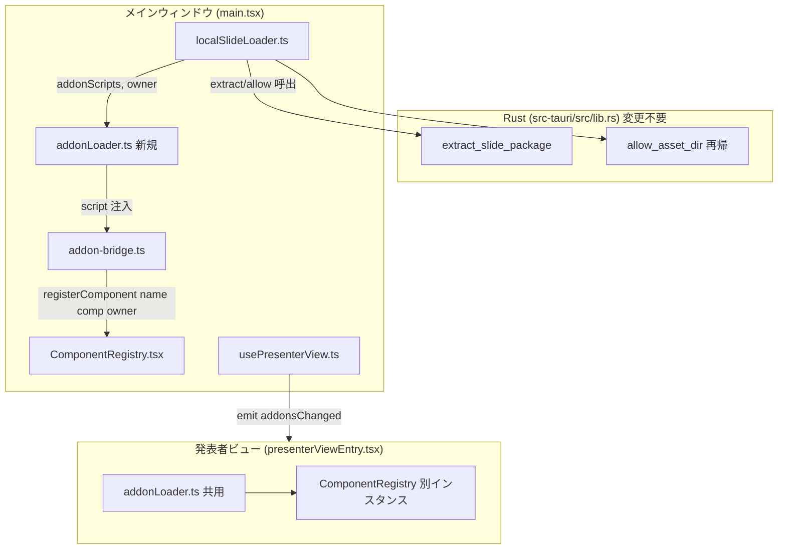

# パッケージ同梱アドオンのランタイムロード

**ドキュメント種別:** 技術設計書 (Design Doc)
**SDDフェーズ:** Plan (計画/設計)
**最終更新日:** 2026-07-22
**関連 Spec:** [package-embedded-addon_spec.md](./package-embedded-addon_spec.md)
**関連 PRD:** [package-embedded-addon.md](../requirement/package-embedded-addon.md)

---

# 1. 実装ステータス

**ステータス:** 🟢 実装済み（コード・自動テスト完了。macOS 実機で核心経路を確認済み。一部 AC の目視と Windows は残）

> 2026-07-23: macOS 実機で「同梱アドオンの初回確認ダイアログ表示」「同梱コンポーネントの正常描画（fallback にならない）」を確認（AC-1、AC-5 のダイアログ部）。残る目視項目: A→B→A 切替（AC-2）・再オープン二重注入（AC-3）・発表者ビュー（AC-4）・拒否→fallback/一律無効/リセット（AC-6）・ホーム復帰クリア（AC-7）・Windows(NFR-004)。これらのロジックは統合テスト `src/__tests__/addonLifecycle.integration.test.ts` で担保済み。

## 1.1. 実装進捗

| モジュール/機能 | ステータス | 備考 |
|----------|--------|------|
| 実機 PoC（asset script 実行）| 🟢 | Issue #5 で macOS 検証済み（Windows は追跡課題） |
| `ComponentRegistry` owner API | 🟢 | FR-002。`registerComponent(owner?)`/`unregisterOwner`。単体テスト済み |
| `addonLoader.ts`（新規） | 🟢 | FR-001 / FR-004。`loadAddonScripts`/`loadBuiltinAddons`。冪等化を単体テスト済み |
| `addon-bridge.ts` owner 伝搬 | 🟢 | FR-002。`setCurrentAddonOwner` |
| `localSlideLoader.ts` アドオン解決 | 🟢 | FR-005。`resolvePackageAddons`/`extractAddonBundlePaths`（純粋関数テスト済み） |
| `main.tsx` 順序制御 | 🟢 | FR-003。破棄→await→再マウント。`sourcePath` で信頼判定 |
| 発表者ビュー伝搬 | 🟢 | FR-006。`addonsChanged` emit（usePresenterView）／描画前ロード（presenterViewEntry） |
| `export-slides.mjs` 同梱 | 🟢 | FR-007。`--addons`／相対パス化／純粋関数テスト済み。`export:slides` に `build:addons` 前段 |
| セキュリティ（信頼確認/オプトアウト） | 🟢 | FR-008〜010。`isAddonAllowed`（既定拒否）／`SettingsWindow` トグル・失効 |
| 実機統合検証（4.5）・Windows(NFR-004) | 🔴 | headless 環境のため未実施。実機での A→B→A・発表者ビュー・拒否時の確認が残 |
| lib.rs 検証テスト（任意 5.2） | ⚪ | 任意タスク。未実施（本体変更不要のため） |

---

# 2. 設計目標

1. **owner スコープによるライフサイクルの構造的解決** — パッケージ切替時の残留・同名 silent 上書き・戻り時の混線（NFR-003）を、owner 単位のアンロードで根本的に防ぐ。
2. **解決ロジックの不変性** — `resolveComponent` の custom → default → fallback を一切変更せず、追加 API のみで実現する（DC-001）。
3. **ロード順序の厳守** — 「展開 → `allow_asset_dir` → `<script>` 注入 → 再マウント」の順序を守り、描画前に登録を完了させる（Map は React 状態でないため）。
4. **ローダの一元化と冪等化** — `main.tsx` / `presenterViewEntry.tsx` に重複する `loadAddonScript`/`loadAddons` を単一モジュールへ集約し、二重注入を防止する。
5. **セキュリティのデフォルト安全化** — 同梱アドオンは既定で実行せず、利用者の明示的許可を要する。
6. **リグレッションゼロ** — 既存のビルド時同梱・組み込みアドオンロードの挙動を変えない（NFR-002）。

---

# 3. 技術スタック

| 領域 | 採用技術 | 選定理由 |
|------|------|------|
| ロード方式 | IIFE + `convertFileSrc` の asset URL を `<script src>` 注入 | 実機 PoC（#5）で macOS 動作確認済み。ES 動的 `import()` は react の import map + シムが必須で macOS 13.3 未満リスク・ESM クロスオリジン未検証のため不採用 |
| コンポーネント解決 | 既存 `ComponentRegistry`（3層：custom→default→fallback） | A-004 準拠。owner 管理は追加 API として実装し解決順は不変 |
| パッケージ展開 | Rust `extract_slide_package` / `allow_asset_dir`（`flate2`/`tar`） | 既存実装をそのまま活用（再帰スコープ許可で `addons/` を包含） |
| 永続化 | `@tauri-apps/plugin-store`（`LazyStore`） | 既存の最近使ったリストと同じ機構。信頼判断は既存ストア `slide-package-state.json` に別キー `addonTrust` で path 単位保存（最近使ったリストの `recentSlidePackages` と分離） |
| 確認ダイアログ | `@tauri-apps/plugin-dialog` | 既存のエラーダイアログと同じ機構 |
| パッケージング | Node スクリプト（`export-slides.mjs`）+ `npm pack` | 既存のエクスポート機構を踏襲。`build:addons` 前段でアドオンをビルド |

---

# 4. アーキテクチャ

## 4.1. システム構成図



## 4.2. モジュール分割

| モジュール名 | 責務 | 依存関係 | 配置場所 |
|--------|------|------|------|
| `ComponentRegistry` | owner を記録する登録・owner 単位アンロード | なし | `src/components/ComponentRegistry.tsx`（改修） |
| `addonLoader` | manifest 解決済み bundle の冪等 `<script>` 注入、組み込みロード集約 | `addon-bridge` | `src/addonLoader.ts`（新規） |
| `addon-bridge` | `__ADDON_REGISTER__` に owner を伝搬 | `ComponentRegistry` | `src/addon-bridge.ts`（改修） |
| `localSlideLoader` | `addons/manifest.json` 読取・asset URL 化、`owner`/`addonScripts` 返却、信頼判定 | Rust コマンド, `plugin-store`, `plugin-dialog` | `src/localSlideLoader.ts`（改修） |
| `main.tsx` | 切替順序制御（破棄→await→再マウント）、`owner`/`addonScripts` 受領 | `addonLoader`, `ComponentRegistry`, `localSlideLoader` | `src/main.tsx`（改修） |
| `usePresenterView` | 切替時・ready 受信時に `addonsChanged` を emit | `types` | `src/hooks/usePresenterView.ts`（改修） |
| `presenterViewEntry` | 受信アドオンを描画前にロード・登録、切替時 unregister | `addonLoader`, `ComponentRegistry` | `src/presenterViewEntry.tsx`（改修） |
| `types` | `PresenterViewMessage` に `addonsChanged` 追加 | なし | `src/data/types.ts`（改修） |
| `export-slides` | `--addons` でアドオン同梱、manifest 相対パス化 | なし | `scripts/export-slides.mjs`（改修） |

`src-tauri/src/lib.rs` は**変更不要**（`extract_tgz` が `package/` ごと展開、`allow_asset_dir` の再帰許可が `addons/` を包含）。任意で `addons/` 展開の検証テストを追加してよい。

---

# 5. データモデル

```typescript
// localSlideLoader.ts
export interface LoadedSlidePackage {
  data: PresentationData
  baseDir: string
  addonScripts: string[]  // convertFileSrc 済み・manifest 宣言分のみ
  owner: string           // = baseDir
}

// パッケージ内 addons/manifest.json（既存 AddonManifest と同形。bundle は相対パス）
type PackageAddonManifest = {
  addons: Array<{ name: string; bundle: string }> // 例: "addons/addons.iife.js"
}

// 信頼判断の永続化（既存ストア slide-package-state.json のキー "addonTrust"）
type AddonTrustDecision = 'allowed' | 'denied'
type AddonTrustMap = Record<string /* path */, AddonTrustDecision>

// 設定（グローバル一律無効化）— 既存 SettingsWindow で管理
interface AddonSettings {
  disableEmbeddedAddons: boolean
}
```

---

# 6. インターフェース定義

```typescript
// ComponentRegistry.tsx
const customOwners = new Map<string, string>() // name → owner
export function registerComponent(name: string, component: RegisteredComponent, owner?: string): void
export function unregisterOwner(owner: string): void // owner に属する custom 登録のみ削除
// resolveComponent / clearRegistry は不変（clearRegistry はテスト専用のまま）

// addonLoader.ts（新規）
const injectedScripts = new Set<string>() // src の二重注入防止
export function loadAddonScripts(scripts: string[], owner: string): Promise<void>
export function loadBuiltinAddons(): Promise<void> // 従来の /addons/manifest.json ロードを集約

// addon-bridge.ts
export function setCurrentAddonOwner(owner: string | undefined): void
// __ADDON_REGISTER__ は currentOwner を registerComponent の第3引数へ渡す

// localSlideLoader.ts
async function resolvePackageAddons(baseDir: string): Promise<string[]>
// allow_asset_dir 後に baseDir/addons/manifest.json を読み、bundle を convertFileSrc で URL 化
async function isAddonAllowed(path: string, hasAddons: boolean): Promise<boolean>
// 設定の一律無効化 → 永続化済み判断 → 未判断なら確認ダイアログ（既定拒否）

// usePresenterView.ts
sendAddonsChanged(owner: string, scripts: string[]): void
// パッケージ切替時と presenterViewReady 受信時に emit
```

---

# 7. 非機能要件実現方針

| 要件 | 実現方針 |
|------|------|
| NFR-001 セキュリティ | `isAddonAllowed` で「設定の一律無効化 → path 単位の永続化判断 → 未判断は確認ダイアログ（既定拒否）」を通過したときのみ `loadAddonScripts` を呼ぶ。一律無効化トグルは既存 `SettingsWindow` に追加。ロード対象は manifest 宣言かつ `baseDir/addons/` 配下に限定（FR-010）。README に信頼発行元・無効化を明記 |
| NFR-002 リグレッション | 起動時ロードは `loadBuiltinAddons()`（旧 `loadAddons` を移設）として分離保持。`registerComponent` の owner は任意引数のため既存呼び出しは無変更。typecheck/test をゲートにする |
| NFR-003 切替堅牢性 | 切替の度に旧 owner を `unregisterOwner` → 新 owner を `await` ロード → 再マウント。ホーム復帰・サンプル表示時も旧 owner を unregister。owner=baseDir で A/B を一意識別 |
| NFR-004 実機互換 | ロード方式は PoC 済みの asset script 注入。Windows(WebView2) は追跡課題として `9.2` に記載 |

---

# 8. テスト戦略

| テストレベル | 対象 | カバレッジ目標 |
|--------|------|---------|
| 単体（Vitest） | `ComponentRegistry`: owner 登録・`unregisterOwner` が custom のみ削除・default 温存・同名別 owner 警告 | 分岐網羅 |
| 単体（Vitest） | `addonLoader`: 同一 src の二重注入なし・CSS 冪等 | 主要分岐 |
| 単体（Vitest） | `export-slides`: manifest bundle の相対パス書換・`files` に `addons` 追加 | 正常系 |
| 単体（Vitest） | 信頼判定: 一律無効/許可済み/拒否済み/未判断 の分岐 | 分岐網羅 |
| 結合（手動/デモ） | A→B→A 切替で残留・混線なし、再オープンで二重注入なし、発表者ビューで fallback にならない、拒否時もスライドは開ける | AC 全項目 |
| リグレッション | `npm run typecheck` / `npm run test`、既存ビルド時同梱の動作 | 全通過 |

---

# 9. 設計判断

## 9.1. 決定事項

| 決定事項 | 選択肢 | 決定内容 | 理由 |
|------|-----|------|------|
| ロード方式 | A:script注入 / B:動的import() | **A（script 注入）** | 実機 PoC 済み。B は react 解決に import map+シム必須で OS 依存リスク・ESM クロスオリジン未検証 |
| レジストリ拡張 | 最小変更(owner無) / owner スコープ | **owner スコープ（方式C）** | singleton Map の残留・混線は owner 管理なしでは解決不能。最小変更でも実質必須で本方式に収束 |
| `registerComponent` の owner | 新関数追加 / 既存に任意引数 | **既存に任意引数 `owner?`** | 後方互換を保ちつつ既存呼び出しを無変更にできる |
| ローダ配置 | 各エントリに重複 / 共通モジュール | **`addonLoader.ts` に集約** | `main.tsx`/`presenterViewEntry.tsx` の重複実装を統合し冪等化を一元管理 |
| 切替順序 | 状態更新と並行ロード / 逐次 | **逐次（破棄→await→再マウント）** | `customComponents` は React 状態でないため、描画前に登録完了が必須 |
| セキュリティ緩和 | origin/iframe 分離 / オプトアウト | **オプトアウト** | 分離は React 単一インスタンス共有要件と両立しない |
| 初回既定挙動 | 確認して拒否 / 確認して許可待ち / 一律無効 | **確認して既定拒否** | RCE 相当リスクに対し安全側に倒す（ユーザー確認済み） |
| Rust 側 | 変更 / 変更不要 | **変更不要** | `extract_tgz` の `package/` 展開と `allow_asset_dir` の再帰許可で `addons/` を包含 |

## 9.2. 未解決の課題

| 課題 | 影響度 | 対応方針 |
|------|-----|------|
| Windows(WebView2) 実機未検証 | 中 | `http://asset.localhost/…` 形式での動作を環境が用意でき次第確認（Epic #4 フォローアップ）。設計上はロード方式非依存 |
| manifest の SHA-256 整合性ピン止め | 低 | FR では任意項目。初期実装ではスコープ外とし、必要に応じ追加 |

---

# 10. 変更履歴

## v0.1（draft）

**変更内容:**

- 初版作成。Issue #4（Epic）/ #6（方式C）/ #7（セキュリティ）に基づく技術設計を定義
