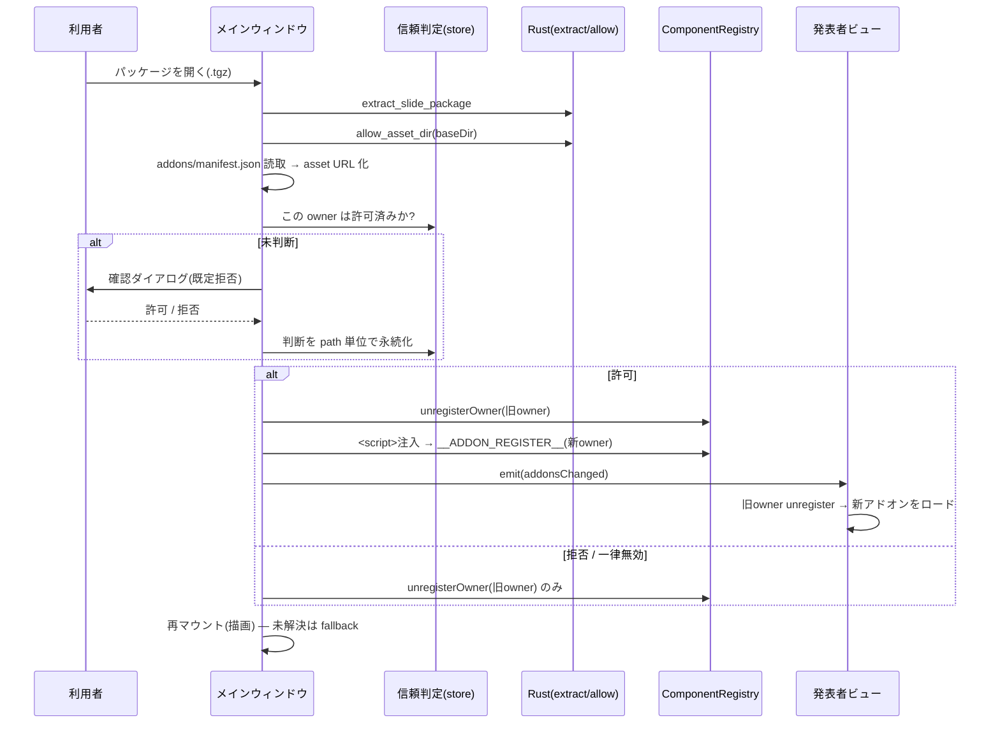

# パッケージ同梱アドオンのランタイムロード

**ドキュメント種別:** 抽象仕様書 (Spec)
**SDDフェーズ:** Specify (仕様化)
**最終更新日:** 2026-07-22
**関連 Design Doc:** [package-embedded-addon_design.md](./package-embedded-addon_design.md)
**関連 PRD:** [package-embedded-addon.md](../requirement/package-embedded-addon.md)

---

# 1. 背景

現状アドオン（ビジュアルコンポーネント群の IIFE バンドル）は、起動時に一度だけ `/addons/manifest.json` から読み込まれ、ビルド時に固定される。そのため、スライド（パッケージ）ごとにアドオンを差し替えることができない。

一方で `.tgz` スライドパッケージは「ローカルスライド選択」機能により起動後に開いて内容を丸ごと差し替えられる。ここにアドオンを同梱し、パッケージを開いたときに動的ロードできれば、スライド作成者が必要なビジュアルコンポーネントを配布物に含めて配れるようになる。

ただし `ComponentRegistry` の `customComponents` はモジュール singleton の Map であり、`App` が `presentationKey` で再マウントされても中身が残る。パッケージ切替時に**古いアドオンの残留・同名の silent 上書き（last-write-wins）・戻り時の混線**が構造的に発生する。また同梱 JS はサンドボックスなしでアプリと同一権限で実行される（RCE 相当）ため、利用者が実行を止められる制御が必須となる。

関連する既存仕様: [visual-addon_spec.md](./visual-addon_spec.md)（ビルド時同梱の起動時一括ロード）。本仕様はこれを上流に持ち、ランタイムロード・ライフサイクル・セキュリティ・パッケージング・発表者ビュー伝搬を新規に定義する。

# 2. 概要

`.tgz` パッケージに同梱したアドオンを、パッケージを開いた時点で起動後に動的ロードし、スライドの `{ "component": { "name": ... } }` 参照を解決できるようにする。設計原則は以下のとおり。

- **オーナースコープ型レジストリ**: 登録されたコンポーネントを「所有者（owner）」単位で管理し、パッケージ切替時に旧 owner のアドオンだけを安全に破棄してから新アドオンをロードする。`resolveComponent` の解決順（custom → default → fallback）は不変とし、owner 管理は追加 API として実現する。
- **ロード方式の固定**: 実機（macOS/WKWebView）で確認済みの「IIFE + `convertFileSrc` の asset URL を `<script src>` 注入」を採る。ロードは「`.tgz` 展開 → `allow_asset_dir` → `<script>` 注入」の順序を厳守する。
- **フォールバックファースト**: アドオンが拒否・失敗してもスライド自体は開け、未解決コンポーネントは fallback で描画する。
- **セキュリティは分離ではなくオプトアウトで緩和**: 別 origin / iframe による分離は React 単一インスタンス共有要件と両立しないため採らず、利用者が実行可否を制御できるようにする。既定挙動は「確認して拒否」。

**対象は Tauri ランタイム経路に限定する。** dev/build（Vite）経路での同梱アドオン配信、および既存のビルド時同梱（`public/slides.json`・`VITE_SLIDE_PACKAGE`）はスコープ外・変更なし。

# 3. 要求定義

## 3.1. 機能要件 (Functional Requirements)

| ID     | 要件                                                                                          | 優先度 | 根拠（PRD） |
|--------|---------------------------------------------------------------------------------------------|-----|---------|
| FR-001 | manifest 記載の IIFE を asset URL 経由で `<script>` 注入し、起動後にロードする                       | 必須  | FR-001  |
| FR-002 | `ComponentRegistry` に owner 単位の登録・アンロード API を追加する（解決順は不変）                   | 必須  | FR-002 / DC-001 |
| FR-003 | パッケージ切替時に「旧 owner 破棄 → `await` ロード → 再マウント」の順序を守る                        | 必須  | FR-003  |
| FR-004 | 同一バンドルの `<script>` の二重注入を防止する（冪等。CSS は現行アドオン非出力のため将来対応）           | 必須  | FR-004  |
| FR-005 | `allow_asset_dir` 完了後に `addons/manifest.json` を読み、bundle を asset URL 化して owner とともに返す | 必須  | FR-005  |
| FR-006 | 発表者ビューへアドオン変更を伝搬し、描画前にロード・登録、切替時にアンロードする                            | 必須  | FR-006  |
| FR-007 | `export-slides` でアドオンを同梱し、manifest の bundle をパッケージ相対パスへ書き換える                  | 必須  | FR-007  |
| FR-008 | 同梱アドオンありパッケージの初回オープン時に確認ダイアログを出し、**既定拒否**で判断を path 単位に永続化する    | 必須  | FR-008  |
| FR-009 | 設定で同梱アドオンを一律無効化でき、許可済み path を失効できる                                           | 推奨  | FR-009  |
| FR-010 | ロード対象を manifest 宣言かつ `baseDir/addons/` 配下のバンドルに限定する                              | 必須  | FR-010  |

## 3.2. 非機能要件 (Non-Functional Requirements)

| ID      | カテゴリ   | 要件                                                                | 目標値／根拠（PRD） |
|---------|--------|-------------------------------------------------------------------|-------------|
| NFR-001 | セキュリティ | 利用者が同梱アドオンの実行を止められる。既定挙動は「確認して拒否」                          | NFR-001     |
| NFR-002 | 互換性    | 既存のビルド時同梱・起動時 `/addons/manifest.json` ロードが従来どおり動作。typecheck/test 通過 | NFR-002     |
| NFR-003 | 信頼性    | パッケージ A→B→A 切替で残留・混線・同名衝突が起きない。ホーム復帰時に custom 登録がクリアされる       | NFR-003     |
| NFR-004 | 互換性    | macOS(WKWebView) で asset URL の `<script>` 実行が可能。Windows は追跡課題      | NFR-004     |

# 4. API

本仕様で追加・変更する公開インターフェース（実装詳細は Design Doc 参照）。

| ディレクトリ | ファイル名 | エクスポート | 概要 |
|--------|-------|--------|------|
| `src/components` | `ComponentRegistry.tsx` | `registerComponent(name, component, owner?)` | 既存 API を拡張し、任意の owner を記録する（後方互換） |
| `src/components` | `ComponentRegistry.tsx` | `unregisterOwner(owner)` | 指定 owner の custom 登録のみを削除する（default は温存） |
| `src` | `addonLoader.ts` | `loadAddonScripts(scripts, owner)` | manifest 解決済みの bundle 群を冪等に `<script>` 注入してロードする |
| `src` | `addonLoader.ts` | `loadBuiltinAddons()` | 起動時の組み込み `/addons/manifest.json` ロード（既存 `loadAddons` を集約） |
| `src` | `addon-bridge.ts` | （内部）`setCurrentAddonOwner(owner)` | `__ADDON_REGISTER__` が登録するコンポーネントの owner を伝搬する |
| `src` | `localSlideLoader.ts` | `LoadedSlidePackage`（型拡張） | `addonScripts: string[]` と `owner: string` を追加 |
| `src/data` | `types.ts` | `PresenterViewMessage`（型拡張） | `addonsChanged` メッセージを追加 |
| `scripts` | `export-slides.mjs` | `--addons` フラグ | ビルド済みアドオンをパッケージに同梱するオプション |

## 4.1. 型定義

```typescript
// ComponentRegistry.tsx — owner を任意引数として追加（省略時は従来どおり owner なし）
export function registerComponent(name: string, component: RegisteredComponent, owner?: string): void
export function unregisterOwner(owner: string): void

// localSlideLoader.ts — パッケージ読み込み結果にアドオン情報を追加
export interface LoadedSlidePackage {
  data: PresentationData
  baseDir: string
  /** convertFileSrc で asset URL 化済みのアドオンバンドル URL（manifest 宣言分のみ） */
  addonScripts: string[]
  /** アドオン登録の所有者スコープ（= baseDir） */
  owner: string
}

// types.ts — 発表者ビューへアドオン変更を伝搬するメッセージ
type PresenterViewMessage =
  // ... 既存メンバーに追加 ...
  | { type: 'addonsChanged'; payload: { owner: string; scripts: string[] } }
```

# 5. 用語集

| 用語 | 説明 |
|------|------|
| owner（オーナースコープ） | 登録コンポーネントの所有者識別子。パッケージ単位（= `baseDir`）でスコープする |
| アンロード | 指定 owner の custom 登録のみをレジストリから削除すること（default は温存） |
| asset URL | `convertFileSrc` が返す `asset://localhost/<絶対パス>` 形式のローカルリソース URL |
| 冪等ロード | 同一 bundle を複数回ロードしても二重注入されないこと（CSS は現行アドオン非出力） |
| 組み込みアドオン | 起動時に `/addons/manifest.json` から読まれる従来のビルド時同梱アドオン |
| 同梱アドオン | `.tgz` パッケージ内 `addons/` に含めて配布されるアドオン |

# 6. 使用例

```tsx
// localSlideLoader が返す owner / addonScripts を使ったパッケージ切替（概念例）
const { data } = await pickAndLoadSlidePackage()
if (data) {
  unregisterOwner(previousOwner)                 // (1) 旧アドオンを破棄
  setCurrentAddonOwner(data.owner)
  await loadAddonScripts(data.addonScripts, data.owner) // (2) 新アドオンを await ロード
  showPresentation(data.data)                    // (3) 再マウント（描画）
  previousOwner = data.owner
}
```

# 7. 振る舞い図

## 7.1. パッケージ切替時のアドオンロード



# 8. 制約事項

- CSP 無効（`tauri.conf.json` の `csp: null`）と asset プロトコルの `text/javascript` 配信を前提とする。
- 既存の IIFE ローダ規約（`window.React` / `window.ReactJSXRuntime` 公開、`__ADDON_REGISTER__` コールバック）を流用する。
- `ComponentRegistry` の解決優先順位（custom → default → fallback）を変更しない（DC-001）。
- ロードは「展開 → `allow_asset_dir` → `<script>` 注入」の順序を守る（`allow` 前は 403）。
- 対象は Tauri ランタイム経路に限定する（dev/build 経路はスコープ外）。
- 別 origin / iframe 分離は採らない（React 単一インスタンス共有要件と両立しないため）。

---

# 9. PRD 整合性レビュー結果

関連 PRD: [package-embedded-addon.md](../requirement/package-embedded-addon.md)

| チェック項目 | 結果 |
|--------|------|
| 要求カバレッジ（FR） | ✅ PRD の FR-001〜010 をすべて spec の FR-001〜010 に対応付け |
| 要求 ID 参照 | ✅ 各機能要件に PRD の FR/DC ID を「根拠」列で明記 |
| 非機能要件の反映 | ✅ PRD の NFR-001〜004 を spec の NFR-001〜004 に反映 |
| 用語整合性 | ✅ owner／同梱アドオン／asset URL 等を PRD と統一 |
