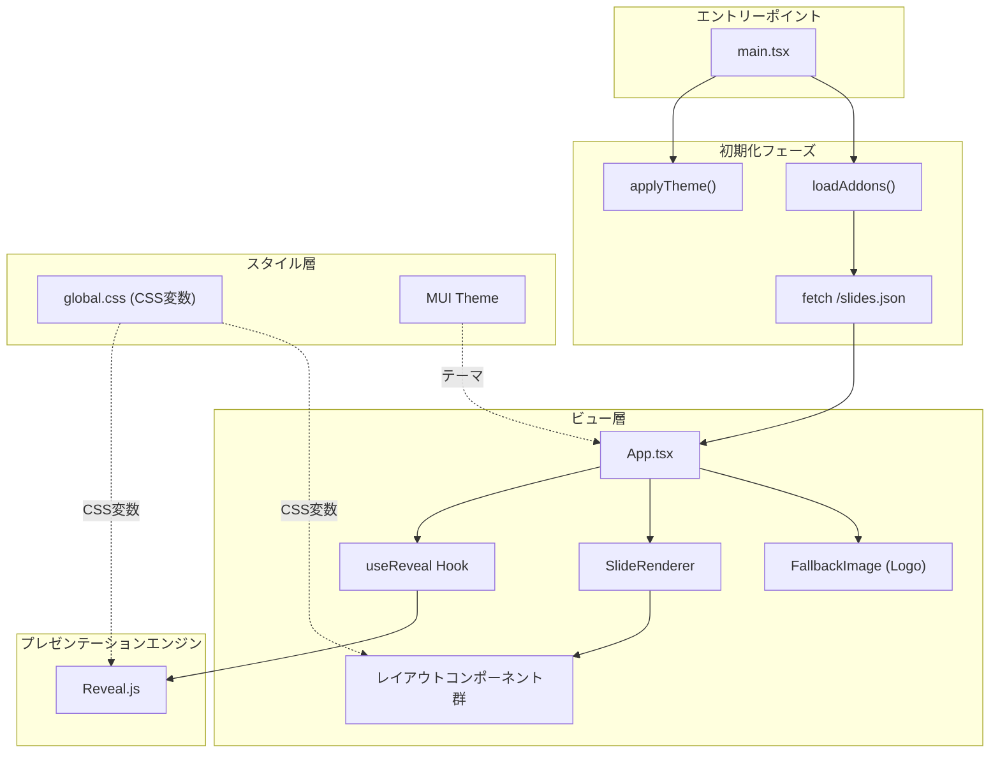

# Reveal.js プレゼンテーション基盤

**ドキュメント種別:** 技術設計書 (Design Doc)
**SDDフェーズ:** Plan (計画/設計)
**最終更新日:** 2026-01-30
**関連 Spec:** [presentation-foundation_spec.md](./presentation-foundation_spec.md)
**関連 PRD:** [presentation-foundation.md](../requirement/presentation-foundation.md)

---

# 1. 実装ステータス

**ステータス:** 🟢 実装済み

## 1.1. 実装進捗

| モジュール/機能                  | ステータス   | 備考                                                     |
|---------------------------|---------|--------------------------------------------------------|
| `useReveal` フック           | 🟢 実装済み | Reveal.js の初期化・破棄を管理                                   |
| App コンポーネント（Reveal.js 統合） | 🟢 実装済み | データ駆動型プレゼンテーション表示                                      |
| レイアウトコンポーネント群             | 🟢 実装済み | TitleLayout, ContentLayout, SectionLayout, BleedLayout |
| グローバルCSS（テーマ変数・アニメーション）   | 🟢 実装済み | CSS変数ベースのテーマシステム                                       |
| ロゴ表示（FallbackImage）       | 🟢 実装済み | エラー時プレースホルダー表示。`meta.logo` による動的設定対応                   |
| MUI テーマ統合                 | 🟢 実装済み | ダークモード、カスタムタイポグラフィ                                     |
| テーマ適用（applyTheme）         | 🟢 実装済み | 2段階テーマ適用（グローバル色 + プレゼンテーション固有）                         |

---

# 2. 設計目標

1. **Reveal.js との最小結合**: React コンポーネントと Reveal.js の結合点を `useReveal` フック1つに集約し、ライフサイクル競合を防ぐ
2. **CSS変数による一元的テーマ管理**: すべてのテーマカラー・フォントを CSS 変数で管理し、動的なテーマ切り替えを実現する
3. **DOM構造の厳守**: Reveal.js が要求する `.reveal > .slides > section` 構造を全レイアウトで維持する（T-002）
4. **レスポンシブスケーリング**: 固定解像度（1280×720）を基準とし、Reveal.js の組み込みスケーリング機能で画面適応する
5. **宣言的なスライド構築**: React コンポーネントツリーの中で、各スライドを `<section>` 要素として宣言的に配置する（A-001）

---

# 3. 技術スタック

| 領域        | 採用技術                  | 選定理由                                                          |
|-----------|-----------------------|---------------------------------------------------------------|
| UI        | React 18 + TypeScript | 型安全なコンポーネント指向開発。strict モード準拠（T-001）                           |
| プレゼンテーション | Reveal.js             | スライド表示に特化したライブラリ。ナビゲーション・スケーリング・トランジションを内包                    |
| UIコンポーネント | MUI (Material-UI)     | Card、Typography 等のUIプリミティブ提供。ダークモードテーマとの統合                    |
| スタイリング    | CSS 変数 + グローバルCSS     | Reveal.js との親和性が高い。CSS-in-JS はReveal.js のスタイル上書きと相性が悪い（A-002） |
| ビルドツール    | Vite                  | 高速HMR、CSS/JSON のネイティブインポート対応                                  |

---

# 4. アーキテクチャ

## 4.1. システム構成図



## 4.2. モジュール分割

| モジュール名        | 責務                                                 | 依存関係                                                | 配置場所                               |
|---------------|----------------------------------------------------|-----------------------------------------------------|------------------------------------|
| useReveal     | Reveal.js の初期化・設定・破棄を管理                            | Reveal.js                                           | `src/hooks/useReveal.ts`           |
| App           | ルートコンポーネント。Reveal.js コンテナ、スライドレンダリング、テーマ適用、ロゴ表示を統合 | useReveal, SlideRenderer, applyTheme, FallbackImage | `src/App.tsx`                      |
| TitleLayout   | タイトルスライド用レイアウト                                     | React, MUI                                          | `src/layouts/TitleLayout.tsx`      |
| ContentLayout | 見出し＋本文スライド用レイアウト                                   | React, MUI                                          | `src/layouts/ContentLayout.tsx`    |
| SectionLayout | セクション区切り用レイアウト                                     | React, MUI                                          | `src/layouts/SectionLayout.tsx`    |
| BleedLayout   | 2カラム全幅レイアウト                                        | React                                               | `src/layouts/BleedLayout.tsx`      |
| FallbackImage | 画像表示（エラー時プレースホルダー）                                 | React, MUI                                          | `src/components/FallbackImage.tsx` |
| applyTheme    | CSS変数ベースのテーマ適用                                     | なし（DOM API のみ）                                      | `src/applyTheme.ts`                |
| global.css    | CSS変数定義、アニメーション、Reveal.js オーバーライド                  | なし                                                  | `src/styles/global.css`            |
| theme.ts      | MUI テーマ設定                                          | MUI                                                 | `src/theme.ts`                     |

## 4.3. ディレクトリ構造

```
src/
├── main.tsx                    # エントリーポイント（初期化フロー制御）
├── App.tsx                     # ルートコンポーネント
├── applyTheme.ts               # テーマ適用ユーティリティ
├── addon-bridge.ts             # アドオン用グローバルブリッジ
├── theme.ts                    # MUI テーマ定義
├── hooks/
│   └── useReveal.ts            # Reveal.js ライフサイクル管理フック
├── components/
│   ├── FallbackImage.tsx       # 画像表示（エラーハンドリング付き）
│   ├── ComponentRegistry.tsx   # コンポーネントレジストリ
│   ├── SlideRenderer.tsx       # データ駆動型スライドレンダラー
│   └── registerDefaults.tsx    # デフォルトコンポーネント登録
├── layouts/
│   ├── TitleLayout.tsx         # タイトルスライド用
│   ├── ContentLayout.tsx       # コンテンツスライド用
│   ├── SectionLayout.tsx       # セクション区切り用
│   ├── BleedLayout.tsx         # 2カラム全幅レイアウト
│   └── index.ts                # re-export
├── data/
│   ├── types.ts                # 型定義
│   ├── loader.ts               # データローダー
│   ├── default-slides.json     # デフォルトスライドデータ
│   └── index.ts                # re-export
└── styles/
    └── global.css              # CSS変数、アニメーション、Reveal.js オーバーライド
```

---

# 5. データモデル

## 5.1. Reveal.js 設定オブジェクト

```typescript
// useReveal フック内で使用する Reveal.js 設定
const revealConfig = {
  // 表示設定
  width: 1280,              // 基準幅（NFR_203）
  height: 720,              // 基準高さ（NFR_203）
  margin: 0,                // マージンなし（NFR_203）
  minScale: 0.2,            // 最小スケール（NFR_203）
  maxScale: 2.0,            // 最大スケール（NFR_203）
  center: false,            // カスタムレイアウトのため中央揃え無効

  // UIコントロール
  controls: true,           // ナビゲーション矢印ボタン（FR_603）
  slideNumber: 'c/t',       // スライド番号「現在/合計」形式（FR_604）
  progress: true,           // プログレスバー（FR_606）

  // インタラクション
  keyboard: true,           // キーボードナビゲーション（FR_601）
  touch: true,              // タッチナビゲーション（FR_602）
  navigationMode: 'linear', // 線形ナビゲーション（ネストスライドなし）

  // アニメーション
  transition: 'slide',      // デフォルトトランジション（FR_703）

  // ナビゲーション
  hash: true,               // URLハッシュルーティング（FR_605）
};
```

## 5.2. CSS変数体系

```css
:root {
    /* カラーパレット */
    --theme-primary: #e07a5f;
    --theme-primary-rgb: 224, 122, 95;
    --theme-background: #1c1917;
    --theme-background-rgb: 28, 25, 23;
    --theme-background-alt: #292524;
    --theme-background-grid: #33302e;
    --theme-text-heading: #faf8f5;
    --theme-text-body: #a8a29e;
    --theme-text-subtitle: #d6d3d1;
    --theme-text-muted: #78716c;
    --theme-border: #3d3835;
    --theme-border-light: #4a4543;
    --theme-success: #4ade80;
    --theme-code-text: #fb923c;

    /* フォント */
    --theme-font-heading: 'Roboto', sans-serif;
    --theme-font-body: 'Roboto', sans-serif;
    --theme-font-code: 'Roboto Mono', monospace;

    /* フォントサイズ（baseFontSize で動的に上書き可能） */
    --theme-font-size-base: 20px;
    --theme-font-size-h1: 72px;       /* ratio: 3.6 */
    --theme-font-size-h2: 48px;       /* ratio: 2.4 */
    --theme-font-size-h3: 24px;       /* ratio: 1.2 */
    --theme-font-size-h4: 20px;       /* ratio: 1.0 */
    --theme-font-size-subtitle1: 28px; /* ratio: 1.4 */
    --theme-font-size-body1: 20px;    /* ratio: 1.0 */
    --theme-font-size-body2: 16px;    /* ratio: 0.8 */
}
```

---

# 6. インターフェース定義

## 6.1. useReveal フック

```typescript
/**
 * Reveal.js の初期化・破棄を管理する React フック。
 * 返される ref を .reveal コンテナ要素に設定する。
 *
 * - マウント時: Reveal.js インスタンスを生成し initialize() を呼び出す
 * - アンマウント時: destroy() を呼び出しリソースを解放する
 */
function useReveal(): React.RefObject<HTMLDivElement> {
}
```

## 6.2. applyTheme

```typescript
/**
 * public/theme-colors.json からテーマカラーを読み込み、CSS変数に適用する。
 * アプリケーション起動時に1回呼び出す。
 */
async function applyTheme(): Promise<void> {
}

/**
 * PresentationData の theme フィールドからCSS変数を動的に適用する。
 * カラー、フォント（名前・サイズ・ソース）、カスタムCSSをサポート。
 *
 * - fonts.heading/body/code: フォントファミリーを CSS 変数に設定
 * - fonts.baseFontSize: 基準サイズから比率で全フォントサイズ CSS 変数を算出・設定
 * - fonts.sources: ローカルフォント(@font-face)または外部フォント(<link>)を動的ロード
 */
function applyThemeData(themeData: ThemeData): void {
}

/**
 * baseFontSize から各フォントサイズ CSS 変数を比率ベースで設定する。
 */
function applyBaseFontSize(root: HTMLElement, baseFontSize: number): void {
}

/**
 * フォントソースを動的にロードする。
 * - src 指定: @font-face スタイル要素を動的追加
 * - url 指定: <link rel="stylesheet"> を動的追加
 * 重複ロード防止機構あり。
 */
function loadFontSources(sources: FontSource[]): void {
}
```

---

# 7. 非機能要件実現方針

| 要件                       | 実現方針                                                                                |
|--------------------------|-------------------------------------------------------------------------------------|
| NFR_200: スケーリングパフォーマンス   | Reveal.js 内蔵のスケーリング機能を使用。CSS transform ベースで GPU アクセラレーション対応                         |
| NFR_201: Reveal.js DOM構造 | 全レイアウトコンポーネントが `<section>` をルート要素として返す。App.tsx で `.reveal > .slides` コンテナを固定        |
| NFR_202: React 統合の安全性    | `useReveal` フックの `useEffect` cleanup で `deck.destroy()` を呼び出し。依存配列 `[]` で初期化は1回のみ   |
| NFR_203: 基準解像度           | Reveal.js の `width: 1280, height: 720, margin: 0, minScale: 0.2, maxScale: 2.0` で固定 |

---

# 8. テスト戦略

| テストレベル   | 対象                    | カバレッジ目標                                      |
|----------|-----------------------|----------------------------------------------|
| 型チェック    | 全TypeScriptファイル       | ビルドエラーゼロ                                     |
| ユニットテスト  | FallbackImage（状態遷移）   | loading/loaded/error の3状態                    |
| 統合テスト    | SlideRenderer + レイアウト | デフォルト10枚のスライドが `<section>` として正しくレンダリングされること |
| ビジュアルテスト | デフォルトプレゼンテーション表示      | 1280×720での表示が意図通りであること（目視確認）                 |
| 動作テスト    | ナビゲーション               | キーボード・タッチ・UIコントロールが正常動作（目視確認）                |

**テスト環境の注意点:**

- jsdom環境には IntersectionObserver が存在しないため、`test-setup.ts` でグローバルモックを設定
- Reveal.js はブラウザ環境を前提とするため、DOM統合テストはビルド後の動作確認に依存

---

# 9. 設計判断

## 9.1. 決定事項

| 決定事項             | 選択肢                                          | 決定内容                                       | 理由                                                                                                  |
|------------------|----------------------------------------------|--------------------------------------------|-----------------------------------------------------------------------------------------------------|
| Reveal.js 統合方式   | React ref + useEffect / 外部管理 / ラッパーライブラリ     | React ref + useEffect（`useReveal` フック）     | React のライフサイクルと最小結合で統合。外部ラッパーは不要な依存を追加し、Reveal.js の直接制御が困難になる                                       |
| スケーリング方式         | Reveal.js 内蔵 / 独自CSS transform / viewport単位  | Reveal.js 内蔵（width/height/margin/scale 設定） | Reveal.js のスケーリングエンジンはbattle-testedで信頼性が高い。独自実装は不要な複雑性を追加                                           |
| テーマ管理方式          | CSS変数 / CSS-in-JS / インラインスタイル                | CSS変数（`document.documentElement.style`）    | Reveal.js のスタイルとの親和性が高い。CSS-in-JS は Reveal.js のグローバルCSSとの優先度管理が困難（A-002）                            |
| ナビゲーションモード       | 線形 / グリッド（ネストスライド）                           | 線形（`navigationMode: 'linear'`）             | プレゼンテーションの流れが明確。ネストスライドは複雑性を追加し、聴衆の混乱を招く                                                            |
| ロゴ配置方式           | Reveal.js プラグイン / fixed 要素 / スライド内埋め込み       | fixed 要素（`.slide-logo`）                    | Reveal.js のスライド外に配置することで、スケーリングやトランジションの影響を受けない                                                     |
| ロゴ設定方式           | ハードコード / meta.logo 動的設定 / 環境変数               | `meta.logo` 動的設定（`LogoConfig` 型）           | `slides.json` の `meta.logo` でロゴの `src`/`width`/`height` を指定可能。未指定時はロゴ非表示。プレゼンテーション単位でロゴをカスタマイズ可能にする |
| 背景グリッド           | CSS background-image / SVG / Canvas          | CSS background-image（linear-gradient）      | CSS のみで実装可能。40px×40px のグリッドパターンを2方向のグラデーションで表現                                                      |
| entrance アニメーション | CSS animation / JavaScript / Reveal.js プラグイン | CSS animation（`fadeInUp`）                  | Reveal.js の `.present` クラス付与に連動。JavaScript 不要で宣言的                                                   |
| スライド上部アクセントバー    | CSS pseudo-element / 実DOM要素                  | CSS `::before` 擬似要素                        | `.slide-container::before` で4pxのプライマリカラーバーを表示。実DOM追加不要                                              |

## 9.2. 未解決の課題

| 課題                                  | 影響度 | 対応方針                                                                                       |
|-------------------------------------|-----|--------------------------------------------------------------------------------------------|
| Reveal.js の React 18 Strict Mode 対応 | 低   | 現状 `useEffect` が2回実行されても `destroy()` → 再 `initialize()` で正常動作。将来的にReveal.js の更新で変更がある場合は対応 |

---

# 10. 変更履歴

## v1.2.0 (2026-01-31)

**変更内容:**

- CSS変数体系にフォントサイズ変数（`--theme-font-size-*`）を追加
- `applyThemeData` のインターフェース説明にフォントサイズ・フォントソース機能を追記
- `applyBaseFontSize`, `loadFontSources` 関数のインターフェースを追加

## v1.1.0 (2026-01-31)

**変更内容:**

- ロゴ表示を `meta.logo`（`LogoConfig` 型）による動的設定に対応
- `meta.logo` 未指定時はロゴを非表示とする仕様に変更
- 設計判断にロゴ設定方式を追加
- FR_901, FR_902 を追加

## v1.0.0 (2026-01-30)

**変更内容:**

- 初版作成。既存実装に基づくプレゼンテーション基盤の技術設計を文書化
