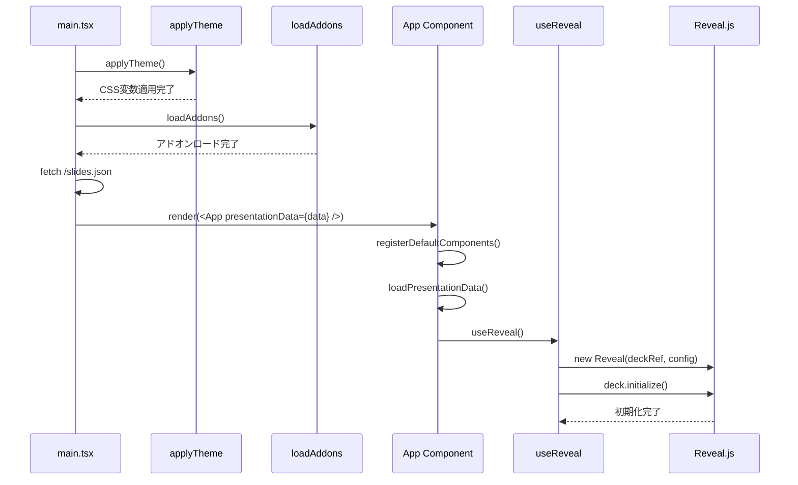
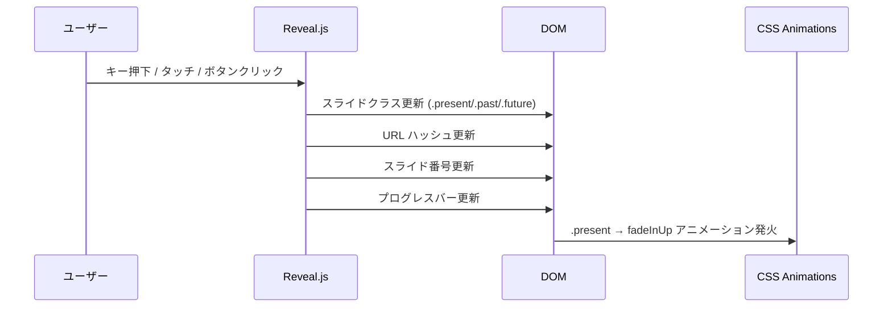
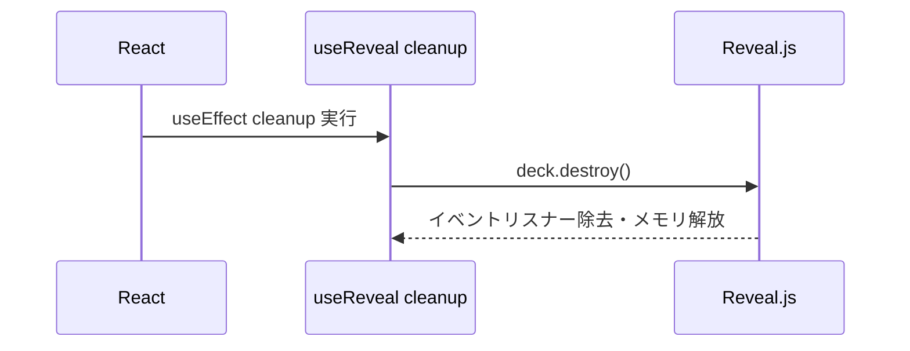

# Reveal.js プレゼンテーション基盤

**ドキュメント種別:** 抽象仕様書 (Spec)
**SDDフェーズ:** Specify (仕様化)
**最終更新日:** 2026-01-30
**関連 Design Doc:** [presentation-foundation_design.md](./presentation-foundation_design.md)
**関連 PRD:** [presentation-foundation.md](../requirement/presentation-foundation.md)

---

# 1. 背景

スライドプレゼンテーションをブラウザ上で動作させるには、スライドの順序制御、ナビゲーション（キーボード・タッチ・UI）、トランジションアニメーション、画面サイズへの適応といったプレゼンテーション固有の機能が必要である。これらを Reveal.js ライブラリとの統合により実現し、React のコンポーネントライフサイクルと調和させることで、宣言的かつ拡張可能なプレゼンテーション基盤を構築する。

---

# 2. 概要

本機能は、React アプリケーション内で Reveal.js を統合し、以下のプレゼンテーション体験を提供する。

- **スライドナビゲーション**: キーボード・タッチ・UIコントロールによるスライド間移動と現在位置の把握
- **スライド表示**: Reveal.js 互換のDOM構造によるレンダリング、個別の背景・トランジション適用
- **レスポンシブスケーリング**: 基準解像度（1280×720）を維持しつつウインドウサイズに自動適応
- **ブランディング**: ロゴの固定位置表示
- **ライフサイクル管理**: React コンポーネントのマウント/アンマウントに連動した Reveal.js の初期化・破棄

技術的な実装詳細（具体的な設定値、CSS実装、モジュール構成）は Design Doc を参照。

---

# 3. 要求定義

## 3.1. 機能要件 (Functional Requirements)

| ID | 要件 | 優先度 | 根拠 |
|------|------|------|------|
| FR_600 | キーボード・タッチ・UIコントロールによりスライド間を移動でき、現在位置を把握できること | 必須 | UR_200 |
| FR_601 | キーボードの矢印キー等でスライドを前後に移動できること | 必須 | FR_600 |
| FR_602 | タッチ操作（スワイプ等）でスライドを前後に移動できること | 推奨 | FR_600 |
| FR_603 | 画面上にナビゲーション用の矢印ボタンを表示し、クリックでスライド移動できること | 推奨 | FR_600 |
| FR_604 | 現在のスライド番号と総スライド数を「現在/合計」形式で表示できること | 任意 | FR_600 |
| FR_605 | 現在のスライド位置をURLハッシュに反映し、URLから特定スライドに直接アクセスできること | 任意 | FR_600 |
| FR_606 | プレゼンテーション全体の進捗をプログレスバーで表示できること | 任意 | FR_600 |
| FR_700 | スライドを Reveal.js のDOM構造で正しくレンダリングし、個別の背景やトランジションを適用できること | 必須 | UR_200 |
| FR_701 | Reveal.js が要求するDOM構造（`.reveal > .slides > section`）でスライドをレンダリングすること | 必須 | FR_700, NFR_201 |
| FR_702 | スライドごとに背景色または背景画像を個別に指定できること | 推奨 | FR_700 |
| FR_703 | スライドごとにトランジションの種類を個別に指定できること | 推奨 | FR_700 |
| FR_704 | スライド表示時に entrance アニメーションを適用できること | 任意 | FR_700 |
| FR_705 | スライドの背景にグリッドパターンを表示できること | 任意 | FR_700 |
| FR_800 | 基準解像度（1280×720）を維持しつつ、ウインドウサイズに応じて自動スケーリングできること | 必須 | UR_200 |
| FR_900 | プレゼンテーション画面の固定位置（左下）にロゴを常時表示でき、表示するロゴをカスタマイズできること | 任意 | UR_200 |
| FR_901 | ロゴ画像のパス・幅・高さを `meta.logo` フィールドで設定できること | 任意 | FR_900 |
| FR_902 | `meta.logo` 未指定時にロゴを非表示とすること | 任意 | FR_900 |
| FR_1000 | React コンポーネントのライフサイクルに連動して Reveal.js を初期化・破棄できること | 必須 | UR_200, NFR_202 |

## 3.2. 非機能要件 (Non-Functional Requirements)

| ID | カテゴリ | 要件 | 目標値 |
|------|------|------|------|
| NFR_200 | パフォーマンス | スケーリング処理がリアルタイムに行われ、リサイズ時に視覚的な遅延が発生しないこと | 遅延なし |
| NFR_201 | 設計制約 | Reveal.js の要求するDOM構造（`.reveal > .slides > section`）を厳密に維持すること | 構造一致 |
| NFR_202 | 設計制約 | Reveal.js のライフサイクル管理が React のコンポーネントライフサイクルと競合しないこと | メモリリーク・イベントリスナー残留なし |
| NFR_203 | 設計制約 | 基準解像度を 1280×720 とし、スケーリング範囲を 0.2〜2.0 倍、マージンを 0 とすること | 指定値厳守 |

---

# 4. API

## 4.1. 公開API一覧

| ディレクトリ | ファイル名 | エクスポート | 概要 |
|------|------|------|------|
| `src/hooks/` | `useReveal.ts` | `useReveal()` | Reveal.js の初期化・破棄を管理する React フック。`.reveal` コンテナの ref を返す |
| `src/` | `App.tsx` | `App` | ルートコンポーネント。Reveal.js コンテナ、スライドレンダラー、ロゴを統合 |
| `src/layouts/` | `TitleLayout.tsx` | `TitleLayout` | タイトルスライド用レイアウト。中央揃えの `<section>` を返す |
| `src/layouts/` | `ContentLayout.tsx` | `ContentLayout` | 見出し＋本文コンテンツ用レイアウト。スライドタイトルとコンテンツエリアを持つ `<section>` を返す |
| `src/layouts/` | `SectionLayout.tsx` | `SectionLayout` | セクション区切り用レイアウト。全高中央揃えの `<section>` を返す |
| `src/layouts/` | `BleedLayout.tsx` | `BleedLayout` | 2カラム全幅レイアウト。左コンテンツ＋右画像の `<section>` を返す |
| `src/components/` | `FallbackImage.tsx` | `FallbackImage` | 画像読み込みエラー時にプレースホルダーを表示するコンポーネント |

## 4.2. 型定義

```typescript
/** useReveal フックの戻り値 */
type UseRevealReturn = React.RefObject<HTMLDivElement>;

/** App コンポーネントの Props */
interface AppProps {
  presentationData?: PresentationData;
}

/** ロゴ設定 */
interface LogoConfig {
  src: string;
  width?: number;   // デフォルト: 120
  height?: number;  // デフォルト: 40
}

/** レイアウトコンポーネント共通 Props */
interface LayoutProps {
  id?: string;
  children: React.ReactNode;
  meta?: SlideMeta;
}

/** ContentLayout 固有の Props */
interface ContentLayoutProps extends LayoutProps {
  title: string;
}

/** BleedLayout 固有の Props */
interface BleedLayoutProps {
  id?: string;
  left: React.ReactNode;
  right: React.ReactNode;
  meta?: SlideMeta;
}

/** FallbackImage の Props */
interface FallbackImageProps {
  src: string;
  width: number;
  height: number;
  alt: string;
}

/** スライドメタデータ（Reveal.js data 属性にマッピング） */
interface SlideMeta {
  transition?: string;
  notes?: string;
  backgroundImage?: string;
  backgroundColor?: string;
}
```

---

# 5. 用語集

| 用語 | 説明 |
|------|------|
| Reveal.js | HTML ベースのプレゼンテーションフレームワーク |
| スケーリング | 基準解像度を維持しつつ、表示領域に合わせてスライド全体を拡大・縮小する処理 |
| トランジション | スライド間の切り替え時に適用される視覚効果（fade, slide 等） |
| ハッシュルーティング | URLの `#` 以降の文字列を使って現在のスライド位置を永続化する仕組み |
| entrance アニメーション | スライドが表示される際に要素がアニメーションしながら出現する効果 |
| プログレスバー | プレゼンテーション全体に対する現在の進行度合いを示す水平バー |
| ライフサイクル管理 | React コンポーネントの生成・破棄に連動して外部ライブラリの初期化・クリーンアップを行う仕組み |

---

# 6. 使用例

```tsx
import { App } from './App';
import type { PresentationData } from './data/types';

// デフォルトプレゼンテーション（内部データを使用）
function DefaultPresentation() {
  return <App />;
}

// カスタムプレゼンテーション（外部JSONデータを使用）
function CustomPresentation({ data }: { data: PresentationData }) {
  return <App presentationData={data} />;
}
```

```tsx
import { useReveal } from './hooks/useReveal';

// Reveal.js コンテナの宣言的な構築
function PresentationContainer() {
  const deckRef = useReveal();

  return (
    <div className="reveal" ref={deckRef}>
      <div className="slides">
        <section>スライド 1</section>
        <section>スライド 2</section>
      </div>
    </div>
  );
}
```

---

# 7. 振る舞い図

## 7.1. 初期化シーケンス



## 7.2. ナビゲーションフロー



## 7.3. アンマウントシーケンス



---

# 8. 制約事項

- Reveal.js のDOM構造（`.reveal > .slides > section`）を厳密に維持すること（T-002）
- React + TypeScript の技術スタックを維持すること（T-001）
- 1280×720 の解像度で正しく表示されること（B-001）
- プレゼンテーションの視覚的品質と伝達力を損なわないこと（B-001）
- スライド間に直接的な依存関係を持たせないこと（A-001）

---

## PRD参照

- 対応PRD: `.sdd/requirement/presentation-foundation.md`
- カバーする要求: UR_200, FR_600, FR_601, FR_602, FR_603, FR_604, FR_605, FR_606, FR_700, FR_701, FR_702, FR_703, FR_704, FR_705, FR_800, FR_900, FR_901, FR_902, FR_1000, NFR_200, NFR_201, NFR_202, NFR_203
