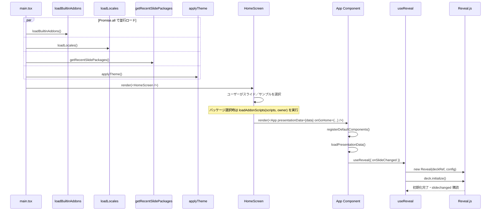
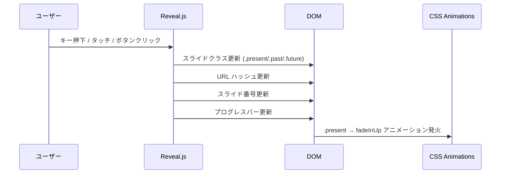
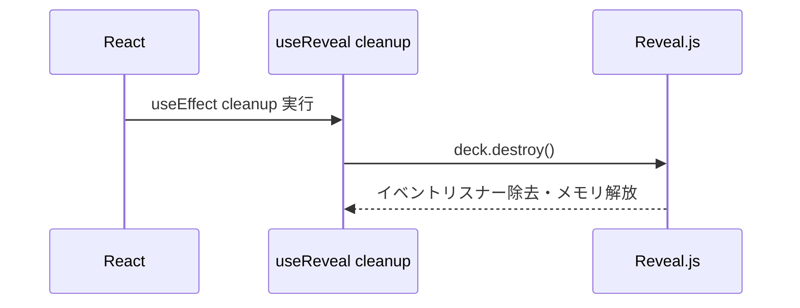

# Reveal.js プレゼンテーション基盤

**ドキュメント種別:** 抽象仕様書 (Spec)
**SDDフェーズ:** Specify (仕様化)
**最終更新日:** 2026-07-24
**関連 Design Doc:** [presentation-foundation_design.md](./presentation-foundation_design.md)
**関連 PRD:** [presentation-foundation.md](../requirement/presentation-foundation.md)

---

# 1. 背景

スライドプレゼンテーションをブラウザ上で動作させるには、スライドの順序制御、ナビゲーション（キーボード・タッチ・UI）、トランジションアニメーション、画面サイズへの適応といったプレゼンテーション固有の機能が必要である。これらを Reveal.js ライブラリとの統合により実現し、React のコンポーネントライフサイクルと調和させることで、宣言的かつ拡張可能なプレゼンテーション基盤を構築する。

---

# 2. 概要

本機能は、React アプリケーション内で Reveal.js を統合し、以下のプレゼンテーション体験を提供する。

- **スライドナビゲーション**: キーボード・タッチ・UIコントロールによるスライド間移動と現在位置の把握
- **スライド表示**: Reveal.js 互換のDOM構造によるレンダリング、個別の背景・トランジション適用
- **レスポンシブスケーリング**: 基準解像度（1280×720）を維持しつつウインドウサイズに自動適応
- **ブランディング**: ロゴの固定位置表示
- **ライフサイクル管理**: React コンポーネントのマウント/アンマウントに連動した Reveal.js の初期化・破棄

技術的な実装詳細（具体的な設定値、CSS実装、モジュール構成）は Design Doc を参照。

## 2.1. 主要ユースケース

| アクター | ユースケース | 概要 | 関連要求 |
|------|------|------|------|
| 発表者 | スライドをナビゲーションする | キーボード・タッチ・矢印ボタンでスライド間を移動し、スライド番号・プログレスバー・URLハッシュで現在位置を把握・共有する | FR_600〜FR_606 |
| 発表者 | プレゼンテーションを表示する | ホーム画面からスライド（サンプルまたはローカルパッケージ）を選び、Reveal.js でレンダリングして発表を開始する | FR_700, FR_701 |
| 聴衆 | スライドを閲覧する | 基準解像度を維持したまま、任意のウインドウサイズで崩れなく表示されたスライドを閲覧する | FR_800, NFR_200, NFR_203 |
| 発表者 | ブランディングを表示する | 画面左下にロゴを常時固定表示し、`meta.logo` でロゴをカスタマイズする（未指定時は非表示） | FR_900〜FR_902 |

---

# 3. 要求定義

## 3.1. 機能要件 (Functional Requirements)

| ID | 要件 | 優先度 | 根拠 |
|------|------|------|------|
| FR_600 | キーボード・タッチ・UIコントロールによりスライド間を移動でき、現在位置を把握できること | 必須 | UR_200 |
| FR_601 | キーボードの矢印キー等でスライドを前後に移動できること | 必須 | FR_600 |
| FR_602 | タッチ操作（スワイプ等）でスライドを前後に移動できること | 推奨 | FR_600 |
| FR_603 | 画面上にナビゲーション用の矢印ボタンを表示し、クリックでスライド移動できること | 推奨 | FR_600 |
| FR_604 | 現在のスライド番号と総スライド数を「現在/合計」形式で表示できること | 任意 | FR_600 |
| FR_605 | 現在のスライド位置をURLハッシュに反映し、URLから特定スライドに直接アクセスできること | 任意 | FR_600 |
| FR_606 | プレゼンテーション全体の進捗をプログレスバーで表示できること | 任意 | FR_600 |
| FR_700 | スライドを Reveal.js のDOM構造で正しくレンダリングし、個別の背景やトランジションを適用できること | 必須 | UR_200 |
| FR_701 | Reveal.js が要求するDOM構造（`.reveal > .slides > section`）でスライドをレンダリングすること | 必須 | FR_700, NFR_201 |
| FR_702 | スライドごとに背景色または背景画像を個別に指定できること | 推奨 | FR_700 |
| FR_703 | スライドごとにトランジションの種類を個別に指定できること | 推奨 | FR_700 |
| FR_704 | スライド表示時に entrance アニメーションを適用できること | 任意 | FR_700 |
| FR_705 | スライドの背景にグリッドパターンを表示できること | 任意 | FR_700 |
| FR_706 | スライド上部にプライマリカラーのアクセントバーを表示できること | 任意 | FR_700 |
| FR_800 | 基準解像度（1280×720）を維持しつつ、ウインドウサイズに応じて自動スケーリングできること | 必須 | UR_200 |
| FR_900 | プレゼンテーション画面の固定位置（左下）にロゴを常時表示でき、表示するロゴをカスタマイズできること | 任意 | UR_200 |
| FR_901 | ロゴ画像のパス・幅・高さを `meta.logo` フィールドで設定できること | 任意 | FR_900 |
| FR_902 | `meta.logo` 未指定時にロゴを非表示とすること | 任意 | FR_900 |
| FR_1000 | React コンポーネントのライフサイクルに連動して Reveal.js を初期化・破棄できること | 必須 | UR_200, NFR_202 |

## 3.2. 非機能要件 (Non-Functional Requirements)

| ID | カテゴリ | 要件 | 目標値 |
|------|------|------|------|
| NFR_200 | パフォーマンス | スケーリング処理がリアルタイムに行われ、リサイズ時に視覚的な遅延が発生しないこと | リサイズ反映を 1 フレーム（約 16ms／60fps 相当）以内 |
| NFR_201 | 設計制約 | Reveal.js の要求するDOM構造（`.reveal > .slides > section`）を厳密に維持すること | 構造一致 |
| NFR_202 | 設計制約 | Reveal.js のライフサイクル管理が React のコンポーネントライフサイクルと競合しないこと | メモリリーク・イベントリスナー残留なし |
| NFR_203 | 設計制約 | 基準解像度を 1280×720 とし、スケーリング範囲を 0.2〜2.0 倍、マージンを 0 とすること | 指定値厳守 |

---

# 4. API

## 4.1. 公開API一覧

| ディレクトリ | ファイル名 | エクスポート | 概要 |
|------|------|------|------|
| `src/hooks/` | `useReveal.ts` | `useReveal()` | Reveal.js の初期化・破棄・ナビゲーションを管理する React フック。`deckRef`／`getCurrentSlide`／`goToNext`／`goToPrev` を返す |
| `src/` | `App.tsx` | `App` | プレゼンテーション画面のルートコンポーネント。Reveal.js コンテナ、スライドレンダラー、ロゴ、ツールバーを統合 |
| `src/layouts/` | `TitleLayout.tsx` | `TitleLayout` | タイトルスライド用レイアウト。中央揃えの `<section>` を返す |
| `src/layouts/` | `ContentLayout.tsx` | `ContentLayout` | 見出し＋本文コンテンツ用レイアウト。スライドタイトルとコンテンツエリアを持つ `<section>` を返す |
| `src/layouts/` | `SectionLayout.tsx` | `SectionLayout` | セクション区切り用レイアウト。全高中央揃えの `<section>` を返す |
| `src/layouts/` | `BleedLayout.tsx` | `BleedLayout` | 2カラム全幅レイアウト。左コンテンツ＋右画像の `<section>` を返す |
| `src/components/` | `FallbackImage.tsx` | `FallbackImage` | 画像読み込みエラー時にプレースホルダーを表示するコンポーネント |

## 4.2. 型定義

```typescript
/** useReveal フックのオプション */
interface UseRevealOptions {
  onSlideChanged?: (event: { indexh: number; indexv: number }) => void;
}

/** useReveal フックの戻り値 */
interface UseRevealReturn {
  deckRef: React.RefObject<HTMLDivElement | null>;
  getCurrentSlide: () => { indexh: number; indexv: number } | null;
  goToNext: () => void;
  goToPrev: () => void;
}

/** App コンポーネントの Props */
interface AppProps {
  presentationData?: PresentationData;
  /** ホーム画面へ戻るコールバック（必須） */
  onGoHome: () => void;
  /** 現在のパッケージ同梱アドオンの owner（発表者ビューへの伝搬用） */
  addonOwner?: string;
  /** 現在のパッケージ同梱アドオンの asset URL 群（発表者ビューへの伝搬用） */
  addonScripts?: string[];
}

/** ロゴ設定 */
interface LogoConfig {
  src: string;
  width?: number;   // デフォルト: 120
  height?: number;  // デフォルト: 40
}

/** レイアウトコンポーネント共通 Props */
interface LayoutProps {
  id: string;
  children: React.ReactNode;
  meta?: SlideMeta;
}

/** ContentLayout 固有の Props */
interface ContentLayoutProps extends LayoutProps {
  title: string;
}

/** BleedLayout 固有の Props */
interface BleedLayoutProps {
  id: string;
  left: React.ReactNode;
  right: React.ReactNode;
  meta?: SlideMeta;
  /** 発表者ビューのスケーリング計測用に <section> へ渡す ref */
  sectionRef?: React.Ref<HTMLElement>;
}

/** FallbackImage の Props */
interface FallbackImageProps {
  src: string;
  width: number;
  height: number;
  alt?: string;
  className?: string;
}

/** スライドメタデータ（Reveal.js data 属性にマッピング） */
interface SlideMeta {
  transition?: string;
  notes?: string | SlideNotes;
  backgroundImage?: string;
  backgroundColor?: string;
}
```

---

# 5. 用語集

| 用語 | 説明 |
|------|------|
| Reveal.js | HTML ベースのプレゼンテーションフレームワーク |
| スケーリング | 基準解像度を維持しつつ、表示領域に合わせてスライド全体を拡大・縮小する処理 |
| トランジション | スライド間の切り替え時に適用される視覚効果（fade, slide 等） |
| ハッシュルーティング | URLの `#` 以降の文字列を使って現在のスライド位置を永続化する仕組み |
| entrance アニメーション | スライドが表示される際に要素がアニメーションしながら出現する効果 |
| プログレスバー | プレゼンテーション全体に対する現在の進行度合いを示す水平バー |
| ライフサイクル管理 | React コンポーネントの生成・破棄に連動して外部ライブラリの初期化・クリーンアップを行う仕組み |

---

# 6. 使用例

```tsx
import { App } from './App';
import type { PresentationData } from './data/types';

// デフォルトプレゼンテーション（presentationData 省略時は locale に応じた内部データを使用）
// onGoHome は必須。ホーム画面へ戻る処理を渡す
function DefaultPresentation({ goHome }: { goHome: () => void }) {
  return <App onGoHome={goHome} />;
}

// カスタムプレゼンテーション（外部JSONデータを使用）
function CustomPresentation({ data, goHome }: { data: PresentationData; goHome: () => void }) {
  return <App presentationData={data} onGoHome={goHome} />;
}
```

```tsx
import { useReveal } from './hooks/useReveal';

// Reveal.js コンテナの宣言的な構築
function PresentationContainer() {
  const { deckRef, goToNext, goToPrev } = useReveal({
    onSlideChanged: ({ indexh }) => console.log('current slide:', indexh),
  });

  return (
    <div className="reveal" ref={deckRef}>
      <div className="slides">
        <section>スライド 1</section>
        <section>スライド 2</section>
      </div>
    </div>
  );
}
```

---

# 7. 振る舞い図

## 7.1. 初期化シーケンス

起動時はまず並行初期化を完了させてホーム画面を表示し、ユーザーがスライド（サンプルまたはローカルパッケージ）を選択した時点で App をマウントして Reveal.js を初期化する。


```mermaid
sequenceDiagram
    participant Main as main.tsx
    participant Addons as loadBuiltinAddons
    participant I18n as loadLocales
    participant Recent as getRecentSlidePackages
    participant Theme as applyTheme
    participant Home as HomeScreen
    participant App as App Component
    participant Hook as useReveal
    participant Reveal as Reveal.js

    par Promise.all で並行ロード
        Main->>Addons: loadBuiltinAddons()
    and
        Main->>I18n: loadLocales()
    and
        Main->>Recent: getRecentSlidePackages()
    and
        Main->>Theme: applyTheme()
    end
    Main->>Home: render(<HomeScreen />)
    Home->>Home: ユーザーがスライド／サンプルを選択
    Note over Home: パッケージ選択時は loadAddonScripts(scripts, owner) を実行
    Home->>App: render(<App presentationData={data} onGoHome={...} />)
    App->>App: registerDefaultComponents()
    App->>App: loadPresentationData()
    App->>Hook: useReveal({ onSlideChanged })
    Hook->>Reveal: new Reveal(deckRef, config)
    Hook->>Reveal: deck.initialize()
    Reveal-->>Hook: 初期化完了・slidechanged 購読
```

## 7.2. ナビゲーションフロー


```mermaid
sequenceDiagram
    participant User as ユーザー
    participant Reveal as Reveal.js
    participant DOM as DOM
    participant CSS as CSS Animations

    User->>Reveal: キー押下 / タッチ / ボタンクリック
    Reveal->>DOM: スライドクラス更新 (.present/.past/.future)
    Reveal->>DOM: URL ハッシュ更新
    Reveal->>DOM: スライド番号更新
    Reveal->>DOM: プログレスバー更新
    DOM->>CSS: .present → fadeInUp アニメーション発火
```

## 7.3. アンマウントシーケンス


```mermaid
sequenceDiagram
    participant React as React
    participant Hook as useReveal cleanup
    participant Reveal as Reveal.js

    React->>Hook: useEffect cleanup 実行
    Hook->>Reveal: deck.destroy()
    Reveal-->>Hook: イベントリスナー除去・メモリ解放
```

---

# 8. 制約事項

- Reveal.js のDOM構造（`.reveal > .slides > section`）を厳密に維持すること（T-002）
- React + TypeScript の技術スタックを維持すること（T-001）
- 1280×720 の解像度で正しく表示されること（B-001）
- プレゼンテーションの視覚的品質と伝達力を損なわないこと（B-001）
- スライド間に直接的な依存関係を持たせないこと（A-001）

---

## PRD参照

- 対応 PRD: [presentation-foundation.md](../requirement/presentation-foundation.md)
- カバーする要求: UR_200, FR_600, FR_601, FR_602, FR_603, FR_604, FR_605, FR_606, FR_700, FR_701, FR_702, FR_703, FR_704, FR_705, FR_706, FR_800, FR_900, FR_901, FR_902, FR_1000, NFR_200, NFR_201, NFR_202, NFR_203
