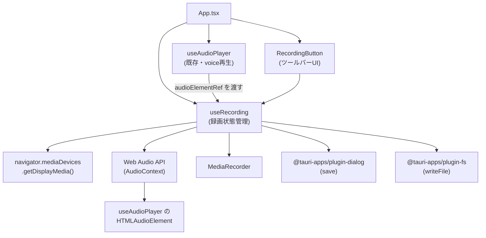

# プレゼンテーション録画（Presentation Recording）

**ドキュメント種別:** 技術設計書 (Design Doc)
**SDDフェーズ:** Plan (計画/設計)
**最終更新日:** 2026-08-24
**関連 Spec:** [presentation-recording_spec.md](./presentation-recording_spec.md)
**関連 PRD:** [presentation-recording.md](../requirement/presentation-recording.md)

---

# 1. 実装ステータス

**ステータス:** 🟢 実装済み

## 1.1. 実装進捗

| モジュール/機能 | ステータス | 備考 |
|----------|-------|------|
| `useAudioPlayer` 拡張（audioElementRef公開） | 🟢 | 既存フックへの後方互換な拡張。`src/hooks/useAudioPlayer.ts` |
| `useRecording` フック | 🟢 | 画面/音声キャプチャ・MediaRecorder制御・保存。`src/hooks/useRecording.ts` |
| `RecordingButton` コンポーネント | 🟢 | SVGアイコン + CSS Modules。`src/components/RecordingButton.tsx` |
| App.tsx 統合 | 🟢 | フック接続とツールバーへの配置。`src/App.tsx` |

## 1.2. 実機（macOS）確認状況

| 項目 | 状態 | 備考 |
|----------|-------|------|
| 録画開始/停止・画面/音声の記録 | 🟢 確認済み | 画面遷移とvoice音声を記録した動画ファイルの生成をバイナリ解析・再生で確認 |
| 動画ファイルの保存・再生 | 🟢 確認済み | QuickTime Playerで再生し、映像・音声を確認 |
| 画面録画権限の初回許可フロー | ⚪ 未確認 | マージ前の完了を推奨するが実装のブロッカーではない |
| 自動再生・自動スライドショー併用のハンズフリー録画（FR-PR-004） | ⚪ 未確認 | 同上 |
| 録画あり/なしでのスライド遷移の視覚的コマ落ち比較（NFR-PR-003） | ⚪ 未確認 | 同上 |
| 複数回録画時のメモリ確保・解放（リソースリーク） | ⚪ 未確認 | 同上 |

---

# 2. 設計目標

1. **既存音声再生への影響最小化**: 録画機能は既存の `useAudioPlayer` によるvoice再生の挙動（再生・一時停止・自動再生）を変更しない。録画中も通常のスピーカー出力を維持する
2. **Web標準APIのみで実現**: `getDisplayMedia` / Web Audio API / `MediaRecorder` というブラウザ/WebView標準APIのみで実装し、Rust側の追加実装を必要としない（意思決定フレームワーク #3 シンプルさ）
3. **フォールバックファースト**: 共有選択のキャンセル、録画中のエラーや共有停止が発生してもプレゼンテーション本体の表示を継続する（A-005 準拠）
4. **リソースのクリーンアップ**: `MediaRecorder` / `MediaStream` / `AudioContext` 関連リソースを useEffect で管理し、アンマウント時・録画終了時に確実に解放する（T-003 準拠）
5. **既存パターンの再利用**: ファイル保存は `pdfExport.ts` と同じ `@tauri-apps/plugin-dialog`（`save`）+ `@tauri-apps/plugin-fs`（`writeFile`）の組み合わせを使い、Tauri capabilities（`dialog:default` / `fs:allow-write-file`）は変更しない

---

# 3. 技術スタック

| 領域 | 採用技術 | 選定理由 |
|------|------|------|
| 画面/ウィンドウキャプチャ | `navigator.mediaDevices.getDisplayMedia()`（Screen Capture API） | ブラウザ/WebView標準API。外部ライブラリ・Rust側の追加実装が不要 |
| 音声合成 | Web Audio API（`AudioContext.createMediaElementSource()` + `createMediaStreamDestination()`） | 既存のvoice再生用 `<audio>` 要素をそのままキャプチャでき、システム音声ループバックに伴うOS権限問題を回避できる |
| 録画 | `MediaRecorder`（MediaStream Recording API） | ブラウザ/WebView標準API。チャンクベース（`ondataavailable`）でメモリ効率よく記録できる |
| ファイル保存 | `@tauri-apps/plugin-dialog`（`save()`）+ `@tauri-apps/plugin-fs`（`writeFile()`） | `pdfExport.ts` と同じ保存パターンを再利用。Tauri capabilities は既に `dialog:default` / `fs:allow-write-file` で許可済みのため変更不要 |
| 状態管理 | React useState / useRef | 既存パターンに従う |
| ライフサイクル | React useEffect | T-003 準拠。MediaRecorder/MediaStream/AudioContext の生成・破棄を管理 |
| アイコン | インライン SVG アイコン | 既存の `AudioPlayButton` / `PdfExportButton` と同様、外部アイコン依存を避ける |
| スタイリング | CSS 変数 + CSS Modules | A-002 準拠 |

---

# 4. アーキテクチャ

## 4.1. システム構成図



## 4.2. モジュール分割

| モジュール名 | 責務 | 依存関係 | 配置場所 |
|--------|------|------|------|
| `useAudioPlayer` 拡張 | 内部で保持する `HTMLAudioElement` を `audioElementRef` として公開する | なし（既存フックへの後方互換な拡張） | `src/hooks/useAudioPlayer.ts` |
| `useRecording` | `getDisplayMedia` 呼出、音声トラックの合成（Web Audio API）、`MediaRecorder` 制御、共有停止・エラー検知、保存処理、状態管理 | `useAudioPlayer` の `audioElementRef`、Web Audio API、`MediaRecorder`、`@tauri-apps/plugin-dialog`、`@tauri-apps/plugin-fs` | `src/hooks/useRecording.ts` |
| `RecordingButton` | 録画開始/停止トグルUI（録画中インジケータ表示を兼ねる） | インライン SVG + CSS Modules | `src/components/RecordingButton.tsx` |
| App.tsx 統合 | `useAudioPlayer.audioElementRef` を `useRecording` に渡し、`RecordingButton` をツールバー（`PdfExportButton` の隣）に配置 | `useRecording`, `RecordingButton`, `useAudioPlayer` | `src/App.tsx` |

---

# 5. データモデル

```typescript
/** 録画の状態 */
type RecordingState = 'idle' | 'recording' | 'saving' | 'error'
```

---

# 6. インターフェース定義

```typescript
/** useAudioPlayer の戻り値への追加フィールド（既存フィールドはそのまま維持） */
interface UseAudioPlayerReturn {
  // ...既存フィールド（playbackState, play, pause, resume, toggle, stop, isPlaying, hasError, onEndedRef, currentTime, duration）
  /** 内部で保持する HTMLAudioElement への参照。useRecording が Web Audio API 経由で音声を合成する際に使用する */
  audioElementRef: React.RefObject<HTMLAudioElement | null>
}
```

> **実装時の必須タスク**: このフィールドは [speaker-note-audio_spec.md](./speaker-note-audio_spec.md) が定義する `UseAudioPlayerReturn`（承認済み・実装済み）への追加である。D-001（Specification-Driven）に従い、実装時に `speaker-note-audio_spec.md` の該当インターフェース定義へ同じフィールドを追記し、両ドキュメントの記述を実装と同期させること。

```typescript
/** useRecording フック */
function useRecording(options: {
  /** 録画対象の音声トラックに合成する HTMLAudioElement（useAudioPlayer.audioElementRef） */
  audioElementRef: React.RefObject<HTMLAudioElement | null>
}): {
  state: RecordingState
  start: () => void // getDisplayMedia({ video: true, audio: false }) を呼び出し、選択完了後に録画を開始する。キャンセル時は state を 'idle' に保つ
  stop: () => void // 録画を停止し、保存先選択を経てファイルに書き出す。保存先選択がキャンセルされた場合は記録済みデータを破棄し state を 'idle' に戻す
} {
}

/** RecordingButton のプロパティ */
interface RecordingButtonProps {
  state: RecordingState
  onToggle: () => void // state に応じて start/stop のいずれかを呼ぶ
}
```

---

# 7. 非機能要件実現方針

| 要件 | 実現方針 |
|------|------|
| macOSの画面録画権限案内（NFR-PR-001） | 録画開始（`start()`）呼出時、`getDisplayMedia()` が権限未許可でエラーになった場合は `useToast` でエラーメッセージを表示し、`state` を `'idle'` に戻す。事前の権限確認UIは初期実装では設けず、エラー時のフィードバックのみとする |
| 互換性（NFR-PR-002） | `navigator.mediaDevices?.getDisplayMedia` および `window.MediaRecorder` の存在チェックを行い、非対応環境では `RecordingButton` を無効化する（A-005 フォールバック） |
| パフォーマンス（NFR-PR-003） | `ondataavailable` の timeslice を 1000ms に設定し、チャンクを都度 `Blob[]` に退避することで大きなメモリ確保を避ける。録画中のスライド遷移アニメーション（`fadeInUp` 等）が、録画なし時と比較して視覚的にコマ落ちしないこと（目安: 30fps相当を下回らない）を8章のテスト戦略（手動確認）で検証する |
| リソース解放（DC-PR-002） | `useEffect` のクリーンアップで `MediaRecorder.stop()`、`MediaStreamTrack.stop()`（画面・音声双方）、`AudioContext.close()` を呼び出す |
| 表示継続（DC-PR-001） | `getDisplayMedia()` の reject（キャンセル・権限拒否）と `MediaRecorder` の `onerror`、共有トラックの `onended` はすべて try/catch とイベントハンドラで捕捉し、プレゼンテーション本体（Reveal.js側）には伝播させない |

---

# 8. テスト戦略

| テストレベル | 対象 | カバレッジ目標 |
|--------|------|---------|
| ユニットテスト | `useRecording` | `getDisplayMedia`/`MediaRecorder` をモックし、start→recording、stop→saving→idle、キャンセル時のidle維持、共有停止/エラー時のフォールバックの各状態遷移 |
| ユニットテスト | `useAudioPlayer` 拡張 | `audioElementRef` が内部の `HTMLAudioElement` を正しく参照すること（既存テストへの追加） |
| コンポーネントテスト | `RecordingButton` | idle/recording/saving/error 各状態の表示・クリック動作 |
| 手動確認 | 実機での画面+音声録画とファイル保存 | `getDisplayMedia` の権限UIおよびOS権限フローはE2Eで自動化できないため、macOS実機で手動確認する |

---

# 9. 設計判断

## 9.1. 決定事項

| 決定事項 | 選択肢 | 決定内容 | 理由 |
|------|-----|------|------|
| 画面キャプチャ方式 | `getDisplayMedia`（Web標準） / Tauriネイティブ（ffmpeg sidecar + OS API） | `getDisplayMedia` | Web標準APIのみで実装可能。Rust側の追加実装・クロスプラットフォーム対応が不要（意思決定フレームワーク #3 シンプルさ） |
| 音声取得方式 | システム音声ループバック / `<audio>` 要素のキャプチャ合成 | `<audio>` 要素をWeb Audio API経由でMediaStream化して合成 | システム音声ループバックはOS依存の権限設定が別途必要になる。既存のvoice再生用audio要素を対象にすることで、録画対象の音声を確実にvoice再生音のみに限定できる |
| `useAudioPlayer` との連携方式 | `useRecording` 内で独自に音声要素を作る / `useAudioPlayer` の既存要素を共有 | `useAudioPlayer` に `audioElementRef` を新規公開し共有する | 二重再生・二重リソース確保を避ける。既存フックへの追加は後方互換なオプショナルフィールドとして行う |
| `AudioContext`/`MediaElementAudioSourceNode` のライフサイクル | 録画ごとに生成 / シングルトンとして遅延生成し再利用 | シングルトンとして初回録画開始時に生成し再利用する | `createMediaElementSource()` は同一 `HTMLAudioElement` に対して一度しか呼び出せない制約があるため |
| 音声ルーティング | 合成先ストリームのみに接続 / スピーカー出力にも接続 | `MediaElementAudioSourceNode` を録画用の `MediaStreamAudioDestinationNode` とスピーカー出力（`audioContext.destination`）の両方に接続する | 録画開始によって通常のvoice再生（スピーカーからの音声）が無音化しないようにする |
| 録画停止トリガー | ボタン操作のみ / OS側の共有停止操作も検知 | 両方（画面トラックの `onended` も監視） | ユーザーがOS標準の「共有を停止」操作をした場合も録画を安全に終了させる必要がある（FR-PR-009） |
| `getDisplayMedia()` の音声取得 | `{ video: true, audio: true }`（画面/ウィンドウ自体の音声も取得） / `{ video: true, audio: false }`（映像トラックのみ） | `{ video: true, audio: false }` | 画面共有自体からの音声取得は行わず、録画対象の音声はWeb Audio API経由のvoice再生音のみに限定する（PRD「7. スコープ外」の「アプリ外のシステム音声の録音」除外との整合） |
| ファイル保存方式 | 専用Rustコマンドを新設 / 既存の `pdfExport.ts` と同じ dialog+fs パターン | 既存パターンを再利用（`save()` + `writeFile()`） | 既存実装と一貫性があり、追加のTauri capability変更が不要 |
| 保存先選択キャンセル時の扱い | 記録済みデータを保持し再保存を試行可能にする / 破棄してidleに戻す | 破棄してidleに戻す | `pdfExport.ts` の保存キャンセル時（`PdfExportResult: 'cancelled'`）と同じ簡潔な挙動に揃える。再保存機能はPRDのスコープ外 |
| 動画コンテナ/MIMEタイプの決定方式 | `video/webm` に固定する / 対応形式の中から `video/mp4` を最優先する（`MediaRecorder.isTypeSupported()` で実行時に判定し、非対応時のみ `video/webm` にフォールバック） | MP4を最優先する実行時判定を採用（`useRecording.ts` の `MIME_TYPE_CANDIDATES`/`pickSupportedMimeType`/`extensionForMimeType`） | #381 実機確認（macOS）で判明: `mimeType` 未指定時のWKWebViewの既定出力はMP4（fragmented, `ftyp iso5/hlsf`）だが、`video/webm;codecs=vp9,opus` を明示指定すると実際に有効なWebM（EBML, `1A 45 DF A3`）も生成できる。しかしmacOSのQuickTime等OS標準プレイヤーはWebMを再生できないため、WebMに対応していても再生できるファイルにはならない。そのため対応可否に関わらずMP4を最優先し、MP4非対応のWebViewエンジンでのみWebMにフォールバックする方式にした（固定拡張子だと実体と食い違う問題も併せて解消） |

## 9.2. 原則準拠チェックリスト

- [x] A-002: レコーディングボタン・録画中インジケータのスタイリングはCSS変数経由でテーマカラーを参照する
- [x] A-004: レコーディングボタン・録画中インジケータはComponentRegistry管理の対象外とし、App.tsxで直接構成する
- [x] A-005: 共有選択キャンセル・録画エラー・共有停止時もプレゼンテーション表示自体は継続する
- [x] B-001: 録画機能の追加が既存の表示品質・操作性を損なわない
- [x] T-001: `useRecording`/`RecordingButton` はTypeScript strictモードで型安全に実装する
- [x] T-003: MediaRecorder/MediaStream/AudioContextのリソースをuseEffectのクリーンアップで解放する

## 9.3. 未解決の課題

| 課題 | 影響度 | 対応方針 |
|------|-----|------|
| `<audio>` 要素を `createMediaElementSource` に接続した場合の通常再生（音量・ミュート等）への影響 | 低 | 実装時にmacOS実機で検証する。スピーカー出力用の接続（9.1参照）で通常再生を維持する方針とする |
| WebViewごとの `getDisplayMedia`/`MediaRecorder` 対応差異（Windows WebView2等） | 中 | まずmacOS（WKWebView）での動作を優先実装する。他OSでの動作保証はPRDのスコープ外（[presentation-recording.md](../requirement/presentation-recording.md) 7. スコープ外）とする |
| NFR-PR-001（macOS権限の事前案内）が初期実装では未対応 | 中 | 初期実装はエラー時フィードバックのみで暫定対応する（7章参照）。事前確認ダイアログ等の追加提示は本実装完了後に別途検討する |

**解決済み（#381 実機確認により判明・対応済み）**:

- `MediaRecorder` の出力形式が固定拡張子（webm）だと実体と食い違う課題、およびOS標準プレイヤーで再生できない課題: macOS実機確認の結果、①`mimeType`未指定時のWKWebViewの既定出力はMP4（fragmented）である、②`video/webm;codecs=vp9,opus`を明示指定すると実際に有効なWebMも生成できる（技術的にはサポートされている）、の両方が判明した。QuickTime等OS標準プレイヤーはWebMを再生できないため、対応可否に関わらずMP4を最優先し、非対応時のみWebMにフォールバックする方式（9.1参照）を実装して解決した

---

# 10. 変更履歴

## v1.1.0 (2026-08-24)

**実機確認（macOS）に基づく修正（2回の実機確認を経て確定）:**

- 1回目の実機確認: `mimeType`未指定でMediaRecorderを生成すると、WKWebViewの既定出力はMP4（fragmented, `ftyp iso5/hlsf`）であり、固定拡張子`.webm`のまま保存すると実体と食い違うことが判明。`MediaRecorder.isTypeSupported()`による実行時判定を実装し、対応形式に応じて拡張子を動的に決定する方式に変更した
- 2回目の実機確認: 上記の実行時判定が`video/webm;codecs=vp9,opus`を対応形式として検出し、実際に有効なWebMファイルとして保存されることを確認（WKWebViewはWebM自体には対応している）。しかしmacOSのQuickTime等OS標準プレイヤーはWebMを再生できないため、対応可否に関わらずMP4を最優先する方式に変更した（`MIME_TYPE_CANDIDATES`の順序をMP4優先に変更。9.1決定事項に追記、9.3未解決課題から解決済みへ移動）

## v1.0.0 (2026-08-24)

**初版作成:**

- プレゼンテーション録画機能の技術設計を定義
- `getDisplayMedia` + `MediaRecorder`（Web標準API）による画面録画アーキテクチャ
- 既存 `useAudioPlayer` の `<audio>` 要素をWeb Audio API経由で音声トラックに合成する方式
- 既存の `pdfExport.ts` と同じ保存パターン（`@tauri-apps/plugin-dialog` + `@tauri-apps/plugin-fs`）の再利用
