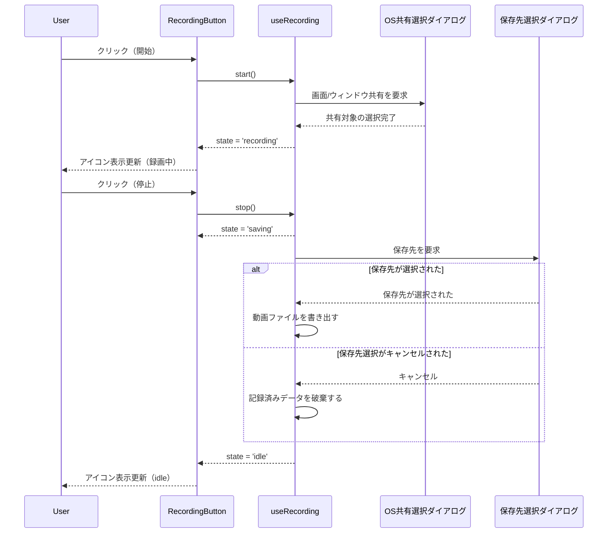
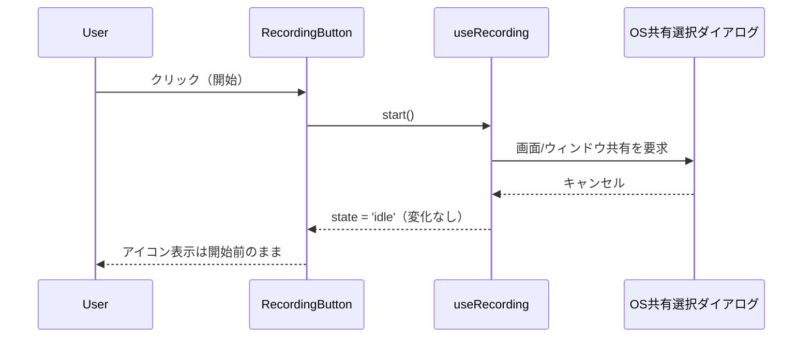
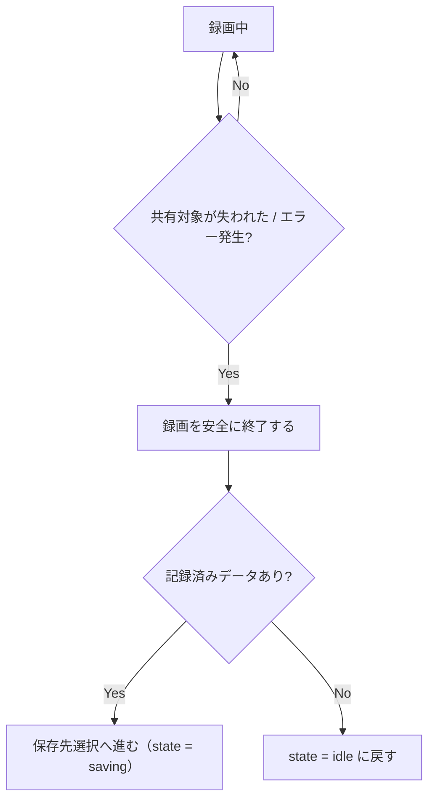

# プレゼンテーション録画（Presentation Recording）

**ドキュメント種別:** 抽象仕様書 (Spec)
**SDDフェーズ:** Specify (仕様化)
**最終更新日:** 2026-08-24
**関連 Design Doc:** [presentation-recording_design.md](./presentation-recording_design.md)
**関連 PRD:** [presentation-recording.md](../requirement/presentation-recording.md)

---

# 1. 背景

プレゼンテーション発表中の画面表示とスピーカーノート音声（[speaker-note-audio_spec.md](./speaker-note-audio_spec.md) の `voice` 再生音）は、既存の自動再生・自動スライドショー機能と組み合わせることでハンズフリーの進行が可能になっている。しかし、その様子を記録に残し、ライブ発表に参加できなかった視聴者への共有や研修・オンボーディング資料として再利用する手段は存在しない。

そこで、発表中の画面と音声をまとめて動画として録画し、ファイルに保存できる機能を提供する。

# 2. 概要

ツールバーの既存「PDFで保存」ボタンの横にレコーディングボタンを追加する。ボタンを押すと画面/ウィンドウキャプチャの共有選択が求められ、選択が完了すると録画が始まる。録画対象の音声には、再生中のスピーカーノート音声（voice再生音）を含める。録画中は既存の自動再生・自動スライドショー機能と併用でき、発表者が操作しなくてもスライド進行と音声再生がそのまま記録される。

録画中はボタンの見た目が変化し、録画中であることが分かる。再度ボタンを押すと録画が停止し、保存先を選択して動画ファイルとして保存する。共有選択のキャンセルや録画中のエラーが発生しても、プレゼンテーション本体の表示は継続する（A-005 準拠）。

# 3. 要求定義

## 3.1. 機能要件 (Functional Requirements)

| ID | 要件 | 優先度 | PRD参照 |
|--------|------|-----|------|
| FR-001 | ツールバーの「PDFで保存」ボタンの横に、開始/停止トグルのレコーディングボタンを表示する | 必須 | FR_PR_001 |
| FR-002 | レコーディングボタン押下時、画面/ウィンドウキャプチャの共有選択を要求し、選択完了後に録画を開始する | 必須 | FR_PR_002 |
| FR-003 | 録画対象の音声トラックに、再生中のスピーカーノート音声（voice再生音）を含める | 必須 | FR_PR_003 |
| FR-004 | 録画中、既存の自動再生・自動スライドショー機能と併用できる | 推奨 | FR_PR_004 |
| FR-005 | 録画中はレコーディングボタンの見た目変化で録画中であることを示す | 必須 | FR_PR_005 |
| FR-006 | レコーディングボタンを再度押すことで録画を停止する | 必須 | FR_PR_006 |
| FR-007 | 録画停止時、保存先を選択して動画ファイルとして保存する | 必須 | FR_PR_007 |
| FR-008 | 共有選択がキャンセルされた場合、録画を開始せずボタンを操作前の状態に戻す | 必須 | FR_PR_008 |
| FR-009 | 録画中に共有対象が失われる、またはエラーが発生した場合、録画を安全に終了し記録済み内容を保存可能な状態にする | 必須 | FR_PR_009 |

## 3.2. 非機能要件 (Non-Functional Requirements)

| ID | カテゴリ | 要件 | 目標値 |
|---------|------|------|------|
| NFR-001 | ユーザビリティ | macOSの画面録画権限が必要になることを、録画開始前に発表者が理解できる形で示す | PRD参照: NFR-PR-001 |
| NFR-002 | 互換性 | 録画機能は本アプリが動作するデスクトップ環境で利用可能な範囲で動作する | PRD参照: NFR-PR-002 |
| NFR-003 | パフォーマンス | 録画中もスライド遷移・音声再生が視覚的・聴覚的に滑らかであること | PRD参照: NFR-PR-003（具体的な数値基準は本ドキュメントでは定めず [presentation-recording_design.md](./presentation-recording_design.md) で定義する） |

# 4. API

## 4.1. 公開API一覧

| ディレクトリ | ファイル名 | エクスポート | 概要 |
|--------|-------|--------|------|
| `src/hooks/` | `useRecording.ts` | `useRecording(options)` | プレゼンテーションの画面と音声をまとめて録画する状態管理フック。録画対象の音声を提供する参照（`audioElementRef`）を入力に取る |
| `src/components/` | `RecordingButton.tsx` | `RecordingButton` | ツールバーに表示する録画開始/停止ボタン（録画中インジケータ表示を兼ねる） |

## 4.2. 型定義

```typescript
/** 録画の状態 */
type RecordingState = 'idle' | 'recording' | 'saving' | 'error'

/** useRecording の入力 */
interface UseRecordingOptions {
  /** 録画対象の音声トラックに合成する、再生中のスピーカーノート音声を提供する参照 */
  audioElementRef: React.RefObject<HTMLAudioElement | null>
}

/** useRecording の戻り値 */
interface UseRecordingReturn {
  state: RecordingState
  /** 画面/ウィンドウ共有選択を要求し、選択完了後に録画を開始する。キャンセル時は state を 'idle' に保つ */
  start: () => void
  /** 録画を停止し、保存先選択を経て動画ファイルとして保存する */
  stop: () => void
}

/** RecordingButton のプロパティ */
interface RecordingButtonProps {
  state: RecordingState
  /** state に応じて start/stop のいずれかを呼ぶ */
  onToggle: () => void
}
```

# 5. 用語集

| 用語 | 説明 |
|------|------|
| レコーディングボタン | ツールバー上で録画の開始・停止を切り替えるボタン。録画中インジケータの表示も兼ねる |
| 画面共有選択ダイアログ | 録画対象の画面/ウィンドウを選択するOS標準のダイアログ |
| voice再生音 | [speaker-note-audio_spec.md](./speaker-note-audio_spec.md) で定義されたスピーカーノート音声（`notes.voice`）の再生音 |
| RecordingState | 録画の状態を表す型（idle / recording / saving / error） |

# 6. 使用例

## 6.1. コンポーネント使用例

```tsx
import { RecordingButton } from './components/RecordingButton'
import { useRecording } from './hooks/useRecording'
import { useAudioPlayer } from './hooks/useAudioPlayer'

function ToolbarRecording() {
  const { audioElementRef } = useAudioPlayer()
  const { state, start, stop } = useRecording({ audioElementRef })
  const handleToggle = () => (state === 'recording' ? stop() : start())

  return <RecordingButton state={state} onToggle={handleToggle} />
}
```

# 7. 振る舞い図

## 7.1. 録画開始〜停止〜保存フロー



保存先選択がキャンセルされた場合も、録画開始前の共有選択キャンセル（7.2節）と同様にエラーとは扱わず、記録済みデータを破棄して `state` を `'idle'` に戻す。再度録画をやり直すには録画を開始し直す（録画データの一時保持・再保存の仕組みは持たない）。

## 7.2. 共有選択キャンセル時のフォールバック



## 7.3. 録画中断・エラー時のフォールバック



プレゼンテーション本体の表示・操作は、共有選択のキャンセルや録画中のエラー発生によって中断されない（A-005 準拠）。

# 8. 制約事項

- 共有選択のキャンセルや録画中のエラー発生時も、プレゼンテーション表示自体は継続する（A-005 準拠）
- 録画に使用するリソースは useEffect のクリーンアップで解放する（T-003 準拠）
- レコーディングボタン・録画中インジケータはスライドコンテンツではなくアプリのクロムUIであり、`ComponentRegistry` 管理の対象外とする（A-004 準拠）
- レコーディングボタンのスタイリングは3層モデルに従い、テーマカラーはCSS変数経由で参照する（A-002 準拠）
- 録画機能の追加によって、既存のプレゼンテーション表示品質・操作性を損なわない（B-001 準拠）
- 録画対象・録画方式の具体的な技術選定は本ドキュメントでは定めず、[presentation-recording_design.md](./presentation-recording_design.md) で定義する

# 9. 原則への言及

| 原則ID | 原則名 | 本仕様での適用内容 |
|------|------|------------|
| A-004 | 多層コンポーネントレジストリ | レコーディングボタン・録画中インジケータはアプリのクロムUIとして扱い、ComponentRegistry管理の対象外とする |
| A-005 | フォールバックファースト設計 | 共有選択キャンセル・録画エラー時もプレゼンテーション表示自体は継続させる |
| T-003 | React-外部ライブラリのライフサイクル統合 | 録画リソースをuseEffectで管理し確実に解放する |
| B-001 | 表示品質の優先 | 録画機能の追加が既存の表示品質・操作性を損なわないようにする |

---

## PRD参照

- 対応PRD: [presentation-recording.md](../requirement/presentation-recording.md)
- カバーする要求: UR_PR_001, FR_PR_001, FR_PR_002, FR_PR_003, FR_PR_004, FR_PR_005, FR_PR_006, FR_PR_007, FR_PR_008, FR_PR_009, NFR-PR-001, NFR-PR-002, NFR-PR-003, DC_PR_001, DC_PR_002, DC_PR_003
