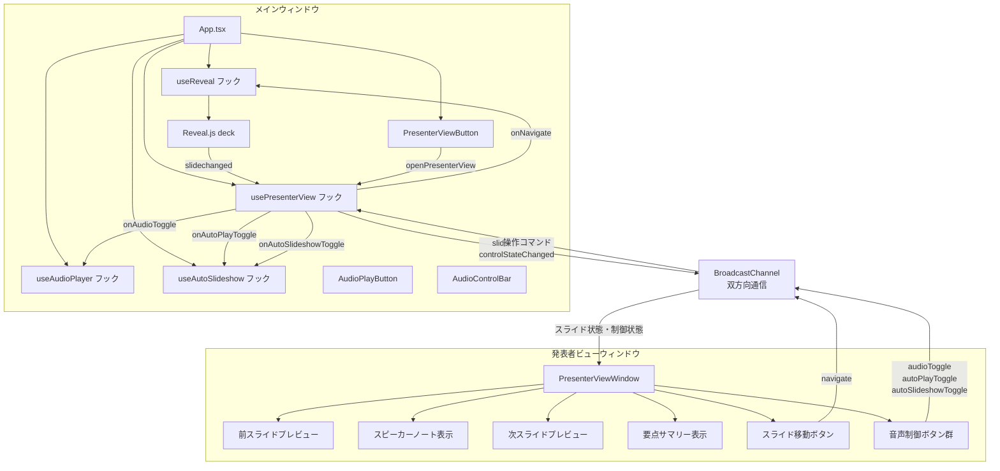

# 発表者ビュー（Presenter View）

**ドキュメント種別:** 技術設計書 (Design Doc)
**SDDフェーズ:** Plan (計画/設計)
**最終更新日:** 2026-02-01
**関連 Spec:** [presenter-view_spec.md](./presenter-view_spec.md)
**関連 PRD:** [presenter-view.md](../requirement/presenter-view.md)

---

# 1. 実装ステータス

**ステータス:** 🟢 実装完了

## 1.1. 実装進捗

| モジュール/機能 | ステータス | 備考 |
|---|---|---|
| notes フィールド型拡張 | 🟢 完了 | `SlideMeta.notes` を `string \| SlideNotes` に拡張。後方互換性維持 |
| useReveal フック拡張 | 🟢 完了 | `onSlideChanged` コールバック、`getCurrentSlide`、`goToNext`、`goToPrev` メソッド追加 |
| ウィンドウ間通信（双方向） | 🟢 完了 | `usePresenterView` フック（BroadcastChannel、双方向同期、コマンド受信コールバック） |
| 発表者ビューUI | 🟢 完了 | `PresenterViewWindow` コンポーネント（コントロールバー＋2x2パネル構成、CSS Modules） |
| 発表者ビュー起動ボタン | 🟢 完了 | `PresenterViewButton` コンポーネント |
| バリデーション拡張 | 🟢 完了 | `validateSlideNotes()` を `loader.ts` に追加 |
| notes ヘルパー関数 | 🟢 完了 | `normalizeNotes`, `getSpeakerNotes`, `getSlideSummary` |
| エントリーポイント | 🟢 完了 | `presenter-view.html` + `presenterViewEntry.tsx`（コマンド送信対応） |
| Vite マルチエントリー | 🟢 完了 | `vite.config.ts` に `rollupOptions.input` 追加 |
| 前スライドプレビュー | 🟢 完了 | FR-PV-007 対応。前スライドの縮小表示、最初のスライドではメッセージ表示 |
| 双方向ウィンドウ間通信 | 🟢 完了 | DC-PV-003 対応。同一BroadcastChannelで双方向通信、コマンドパターン採用 |
| スライド移動操作 | 🟢 完了 | FR-PV-008 対応。ナビゲーションボタン＋キーボード操作（ArrowRight/Space/ArrowLeft） |
| 音声再生制御 | 🟢 完了 | FR-PV-009 対応。音声再生/停止ボタン（hasVoiceに基づく無効化） |
| 自動音声再生制御 | 🟢 完了 | FR-PV-010 対応。自動再生ON/OFFトグルボタン |
| 自動スライドショー制御 | 🟢 完了 | FR-PV-011 対応。自動スライドショーON/OFFトグルボタン |
| 制御状態の同期 | 🟢 完了 | `PresenterControlState` による状態同期、`presenterViewReady` 時の初期同期 |

---

# 2. 設計目標

1. **データ駆動の維持** — ノートデータは slides.json で管理し、A-003 に準拠する
2. **既存コードへの影響最小化** — useReveal フックの拡張は後方互換性を維持する
3. **リソースの確実なクリーンアップ** — ウィンドウ間通信のライフサイクルを useEffect で管理し、T-003 に準拠する
4. **フォールバックファースト** — ノート未定義、ウィンドウブロック、通信エラー時にも安全に動作する（A-005 準拠）
5. **後方互換性** — 既存の `SlideMeta.notes: string` との互換性を `string | SlideNotes` のユニオン型で維持する
6. **双方向通信の確立** — 既存の単方向通信（メイン→発表者ビュー）を拡張し、発表者ビュー→メインウィンドウの操作コマンドを追加する
7. **操作の一元管理** — 発表者ビューはコマンドを送信するのみで、実際の操作（Reveal.js操作、音声再生）はメインウィンドウが実行する

---

# 3. 技術スタック

| 領域 | 採用技術 | 選定理由 |
|---|---|---|
| ウィンドウ間通信 | BroadcastChannel API | 同一オリジンの複数ウィンドウ間でメッセージングが可能。SharedWorker より軽量でシンプル。双方向通信にも対応 |
| ウィンドウ管理 | window.open() | ブラウザ標準のポップアップウィンドウAPI。別ウィンドウの生成に必要十分 |
| 発表者ビューUI | React + CSS Modules | 既存プロジェクトのスタイリング規約（A-002）に準拠。発表者ビューは独自のレイアウトを持つため CSS Modules が適切 |
| スライドイベント | Reveal.js `slidechanged` イベント | Reveal.js 標準のスライド変更イベント。deck インスタンスの `on()` メソッドで取得 |

---

# 4. アーキテクチャ

## 4.1. システム構成図



## 4.2. モジュール分割

| モジュール名 | 責務 | 依存関係 | 配置場所 |
|---|---|---|---|
| `useReveal` (拡張) | Reveal.js 初期化、スライド変更イベントのコールバック通知 | Reveal.js | `src/hooks/useReveal.ts` |
| `usePresenterView` (拡張) | 発表者ビューウィンドウの管理、BroadcastChannel による双方向同期、コマンド受信コールバック | useReveal, useAudioPlayer, useAutoSlideshow | `src/hooks/usePresenterView.ts` |
| `PresenterViewButton` | 発表者ビューを開くUIボタン（CSS Modules、ホバー展開） | usePresenterView | `src/components/PresenterViewButton.tsx` |
| `PresenterViewWindow` (拡張) | 発表者ビューウィンドウのルートコンポーネント（前後スライドプレビュー、ナビゲーション、音声制御を追加） | BroadcastChannel | `src/components/PresenterViewWindow.tsx` |
| `presenter-view.html` | 発表者ビューウィンドウ用のHTMLエントリーポイント | - | `presenter-view.html`（プロジェクトルート） |
| `presenterViewEntry.tsx` (拡張) | 発表者ビューウィンドウの React エントリーポイント（コマンド送信機能を追加） | PresenterViewWindow | `src/presenterViewEntry.tsx` |
| 型定義拡張 | `PresenterControlState` 型、`PresenterViewMessage` の拡張 | - | `src/data/types.ts` |
| バリデーション拡張 | notes フィールドのバリデーション | - | `src/data/loader.ts` |

---

# 5. データモデル

## 5.1. notes フィールドの型拡張

```typescript
/** スライドのノート情報 */
interface SlideNotes {
  speakerNotes?: string
  summary?: string[]
}

/** 既存の SlideMeta を拡張 */
interface SlideMeta {
  transition?: string
  notes?: string | SlideNotes  // string（後方互換）または SlideNotes オブジェクト
  backgroundImage?: string
  backgroundColor?: string
}
```

## 5.2. ウィンドウ間通信メッセージ（拡張）

```typescript
/** 音声・スライドショーの制御状態 */
interface PresenterControlState {
  isPlaying: boolean
  autoPlay: boolean
  autoSlideshow: boolean
  hasVoice: boolean
}

/** BroadcastChannel で送受信するメッセージ（双方向） */
type PresenterViewMessage =
  // メインウィンドウ → 発表者ビュー
  | { type: 'slideChanged'; payload: { currentIndex: number; slides: SlideData[] } }
  | { type: 'controlStateChanged'; payload: PresenterControlState }
  // 発表者ビュー → メインウィンドウ
  | { type: 'navigate'; payload: { direction: 'prev' | 'next' } }
  | { type: 'audioToggle' }
  | { type: 'autoPlayToggle' }
  | { type: 'autoSlideshowToggle' }
  // 双方向
  | { type: 'presenterViewReady' }
  | { type: 'presenterViewClosed' }
```

---

# 6. インターフェース定義

## 6.1. useReveal フックの拡張

```typescript
interface UseRevealOptions {
  /** スライド変更時のコールバック */
  onSlideChanged?: (event: { indexh: number; indexv: number }) => void
}

/** 戻り値を拡張 */
interface UseRevealReturn {
  deckRef: React.RefObject<HTMLDivElement | null>
  /** 現在のスライドインデックスを取得 */
  getCurrentSlide: () => { indexh: number; indexv: number } | null
  /** 次のスライドに進む */
  goToNext: () => void
  /** 前のスライドに戻る */
  goToPrev: () => void
}

function useReveal(options?: UseRevealOptions): UseRevealReturn {}
```

**実装上の注意:** `onSlideChanged` コールバックは `useRef` で最新値を保持し、`useEffect` 内のイベントハンドラから ref 経由で呼び出す（stale closure 回避パターン）。Reveal.js の `useEffect` は `[]` 依存で一度しか実行されないため、直接 `options.onSlideChanged` を参照するとクロージャが古い参照を保持し続ける問題がある。

## 6.2. usePresenterView フック（拡張）

```typescript
interface UsePresenterViewOptions {
  slides: SlideData[]
  /** 発表者ビューからのスライド移動コマンドを受信するコールバック */
  onNavigate?: (direction: 'prev' | 'next') => void
  /** 発表者ビューからの音声再生切り替えコマンドを受信するコールバック */
  onAudioToggle?: () => void
  /** 発表者ビューからの自動音声再生切り替えコマンドを受信するコールバック */
  onAutoPlayToggle?: () => void
  /** 発表者ビューからの自動スライドショー切り替えコマンドを受信するコールバック */
  onAutoSlideshowToggle?: () => void
}

interface UsePresenterViewReturn {
  openPresenterView: () => void
  isOpen: boolean
  /** スライド変更時にメインウィンドウから呼び出す */
  sendSlideState: (currentIndex: number) => void
  /** 音声・制御状態を発表者ビューに送信する */
  sendControlState: (state: PresenterControlState) => void
}

function usePresenterView(options: UsePresenterViewOptions): UsePresenterViewReturn {}
```

## 6.3. PresenterViewButton コンポーネント

```typescript
interface PresenterViewButtonProps {
  onClick: () => void
  isOpen: boolean
}

function PresenterViewButton(props: PresenterViewButtonProps): JSX.Element {
}
```

**UIの振る舞い:**

- 画面右上に固定配置（`position: fixed; top: 12px; right: 12px`）
- 通常時: モニターアイコンのみ表示（`opacity: 0.15`、半透明）
- ホバー時: `opacity: 1` に変化し、ラベルテキスト「発表者ビュー」が展開表示。角丸が円形からラウンド角に CSS transition で遷移する
- 発表者ビュー表示中: グレー背景でラベル「表示中」を表示、ボタン無効化
- CSS Modules（`PresenterViewButton.module.css`）でスタイル管理

## 6.4. PresenterViewWindow コンポーネント（拡張）

```typescript
interface PresenterViewWindowProps {
  slides: SlideData[]
  currentIndex: number
  controlState: PresenterControlState | null
  onNavigate: (direction: 'prev' | 'next') => void
  onAudioToggle: () => void
  onAutoPlayToggle: () => void
  onAutoSlideshowToggle: () => void
}
```

**UIの構成:**

- **上部**: スライド進捗表示（`N / total`）+ ナビゲーションボタン（前へ/次へ）+ 音声制御ボタン群
- **左上**: 前スライドプレビュー（縮小表示、最初のスライドではメッセージ表示）
- **右上**: 次スライドプレビュー（縮小表示、最終スライドではメッセージ表示）
- **左下**: スピーカーノート表示
- **右下**: 要点サマリー表示

**キーボード操作:**

- `ArrowRight` / `Space`: 次のスライド
- `ArrowLeft`: 前のスライド

---

# 7. 非機能要件実現方針

| 要件 | 実現方針 |
|---|---|
| スライド同期の即時性 | BroadcastChannel はイベント駆動のため、postMessage 即座に配信される。ポーリング不要 |
| ポップアップブロック対策 | window.open() がブロックされた場合はユーザーに許可を促すメッセージを表示 |
| ウィンドウクローズ時のクリーンアップ | `beforeunload` イベントと `useEffect` クリーンアップで BroadcastChannel を閉じる |
| 後方互換性 | `notes` フィールドが `string` の場合は `speakerNotes` として扱い、`summary` は空配列とする |
| 双方向通信の信頼性 | BroadcastChannel の同一チャネル（`presenter-view`）で双方向にメッセージを送受信。メッセージの `type` フィールドで送信元と意図を識別 |
| 操作の安全性 | 発表者ビューはコマンドを送信するのみで、Reveal.js や音声プレイヤーを直接操作しない。メインウィンドウが一元的に操作を実行する |
| 制御状態の整合性 | メインウィンドウが音声再生・自動再生の状態変更時に `controlStateChanged` メッセージを送信し、発表者ビューのUIを同期する |

---

# 8. テスト戦略

| テストレベル | 対象 | カバレッジ目標 |
|---|---|---|
| ユニットテスト | notes フィールドの型判定・変換ロジック | `string` → `SlideNotes` 変換、未定義時のフォールバック |
| ユニットテスト | バリデーション拡張 | notes フィールドのバリデーション（string, SlideNotes, undefined, 不正値） |
| ユニットテスト | usePresenterView フック | ウィンドウ管理、BroadcastChannel メッセージ送受信、コマンド受信コールバック |
| ユニットテスト | PresenterViewMessage 型 | 新しいメッセージタイプ（navigate, audioToggle, autoPlayToggle, autoSlideshowToggle, controlStateChanged）の送受信 |
| 結合テスト | スライド変更 → ノート表示の同期 | メインウィンドウ操作 → 発表者ビュー更新の一連フロー |
| 結合テスト | 発表者ビュー操作 → メインウィンドウ反映 | 発表者ビューからの navigate / audioToggle → メインウィンドウでの実行 |
| E2Eテスト | 発表者ビューの起動から操作まで | 手動デモンストレーションで検証 |

---

# 9. 設計判断

## 9.1. 決定事項

| 決定事項 | 選択肢 | 決定内容 | 理由 |
|---|---|---|---|
| ウィンドウ間通信方式 | (1) BroadcastChannel (2) SharedWorker (3) localStorage + storage event (4) postMessage | BroadcastChannel | 同一オリジン前提で最もシンプル。SharedWorker は過剰。localStorage は同期的でパフォーマンス懸念あり。postMessage は window 参照の管理が複雑 |
| 発表者ビューのレンダリング方式 | (1) 別エントリーポイント (2) 同一アプリ内の別ルート (3) iframe | 別エントリーポイント | 発表者ビューはメインプレゼンテーションと異なるUIを持つ。別エントリーポイントにすることでメインバンドルサイズへの影響を回避 |
| notes フィールドの型拡張 | (1) `string \| SlideNotes` ユニオン型 (2) 新しい別フィールド追加 (3) `SlideNotes` のみに変更 | `string \| SlideNotes` ユニオン型 | 既存の `notes?: string` との後方互換性を維持しつつ、構造化データも対応可能 |
| 次スライドプレビューの実装 | (1) スライドデータからHTMLを再レンダリング (2) スライドのサムネイル画像を生成 (3) スライドのテキスト情報のみ表示 | スライドデータからHTMLを再レンダリング | データ駆動型アーキテクチャ（A-003）と整合。SlideRenderer を縮小表示で再利用可能 |
| useReveal コールバックの stale closure 対策 | (1) useRef で最新コールバックを保持 (2) useEffect の依存配列にコールバックを追加 (3) useCallback + useMemo で安定参照を作成 | useRef パターン | Reveal.js の初期化は一度だけ実行すべきであり、依存配列にコールバックを追加すると deck の再生成が発生する。ref パターンは依存配列を変えずに最新のコールバックを呼べるため最適 |
| 起動ボタンのUI | (1) 常時テキストボタン表示 (2) アイコン + ホバー展開 (3) キーボードショートカットのみ | アイコン + ホバー展開 | プレゼンテーション中に常時表示されるボタンはスライドの視認性を損なう。半透明アイコンとホバー展開により、必要時のみ視認可能にする |
| 双方向通信のアーキテクチャ | (1) 同一BroadcastChannelで双方向 (2) 送受信で別チャネル (3) postMessage併用 | 同一BroadcastChannelで双方向 | メッセージの `type` フィールドで方向と意図を識別可能。チャネル管理がシンプルになり、既存実装への変更も最小限 |
| 発表者ビューからの操作方式 | (1) コマンド送信（メインウィンドウが実行） (2) 発表者ビューで直接操作（Reveal.js、音声プレイヤーのインスタンス共有） | コマンド送信方式 | 発表者ビューは別エントリーポイントのため、Reveal.js や音声プレイヤーのインスタンスを直接参照できない。コマンド送信方式ならば既存のBroadcastChannelを拡張するだけで実現可能 |
| 音声制御状態の同期 | (1) メインウィンドウから状態をpush (2) 発表者ビューからポーリング (3) 状態変更イベントごとに同期 | 状態変更イベントごとにpush | イベント駆動で即座に同期される。ポーリングは不要な通信が発生する。pushモデルはスライド同期と同じパターンで一貫性がある |

## 9.2. 解決済みの課題

| 課題 | 影響度 | 対応結果 |
|---|---|---|
| Vite のマルチエントリーポイント設定 | 中 | `vite.config.ts` の `build.rollupOptions.input` に `presenter-view.html` を追加。プロジェクトルートに HTML を配置 |
| Reveal.js 型定義の拡張 | 低 | `reveal.d.ts` に `on()`, `off()`, `getIndices()` メソッドの型を追加 |
| ポップアップブロッカーへの対応 | 中 | ユーザー操作（クリック）起点で `window.open()` を呼び出すことでブロックを回避。ブロック時は `console.warn` でガイダンスを出力 |
| useReveal の stale closure | 高 | `onSlideChangedRef` で最新のコールバックを保持し、`useEffect` 内のイベントハンドラから ref 経由で呼び出す |
| ナビゲーションとの重なり | 中 | ボタンを右下から右上に移動し、半透明アイコン + ホバー展開のUI に変更 |

## 9.3. 未解決の課題

| 課題 | 影響度 | 対応方針 |
|---|---|---|
| 発表者ビューのキーボード操作とブラウザのデフォルト動作の競合 | 低 | `preventDefault()` でブラウザのデフォルト動作を抑制する |
| 音声制御状態の初期同期 | 中 | `presenterViewReady` 受信時に現在の制御状態を送信する |
| 発表者ビューウィンドウのレイアウト変更 | 中 | 既存の3パネル構成を前後プレビュー＋ノート＋サマリー＋コントロールバーに再構成する |
