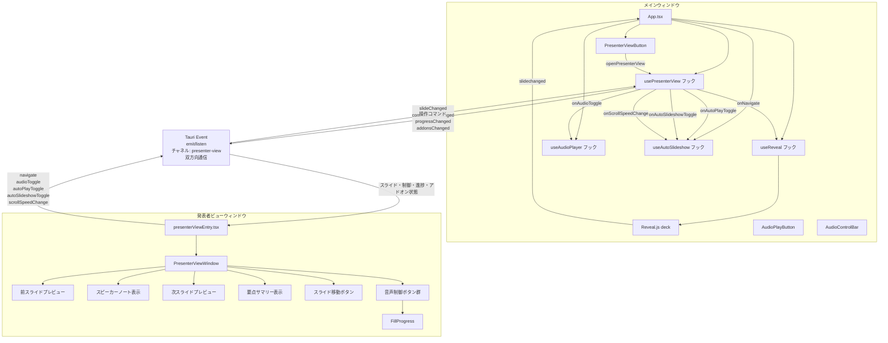

# 発表者ビュー（Presenter View）

**ドキュメント種別:** 技術設計書 (Design Doc)
**SDDフェーズ:** Plan (計画/設計)
**最終更新日:** 2026-07-24
**関連 Spec:** [presenter-view_spec.md](./presenter-view_spec.md)
**関連 PRD:** [presenter-view.md](../requirement/presenter-view.md)

---

# 1. 実装ステータス

**ステータス:** 🟢 実装完了

## 1.1. 実装進捗

| モジュール/機能 | ステータス | 備考 |
|---|---|---|
| notes フィールド型拡張 | 🟢 完了 | `SlideMeta.notes` を `string \| SlideNotes` に拡張。`SlideNotes` は `speakerNotes` / `summary` / `voice` を持つ。後方互換性維持 |
| notes ヘルパー関数 | 🟢 完了 | `normalizeNotes`, `getSpeakerNotes`, `getSlideSummary`, `getVoicePath`（`src/data/noteHelpers.ts`） |
| バリデーション拡張 | 🟢 完了 | `validateSlideNotes()` を `loader.ts` に追加 |
| useReveal フック拡張 | 🟢 完了 | `onSlideChanged` コールバック、`goToNext`、`goToPrev` メソッド追加 |
| usePresenterView フック | 🟢 完了 | Tauri Event（`emit`/`listen`、チャネル `presenter-view`）による双方向同期、`WebviewWindow` 生成（ラベル `presenterView`）、コマンド受信コールバック |
| 発表者ビューUI | 🟢 完了 | `PresenterViewWindow`（コントロールバー＋スピーカーノート＋前後プレビュー＋サマリー、CSS Modules、16:9 プレビューレイアウト） |
| 発表者ビュー起動ボタン | 🟢 完了 | `PresenterViewButton`（右上固定・ホバー展開） |
| エントリーポイント | 🟢 完了 | `presenter-view.html` + `presenterViewEntry.tsx`（コマンド送信・アドオンロード対応） |
| Vite マルチエントリー | 🟢 完了 | `vite.config.ts` に `rollupOptions.input` 追加 |
| スライド移動操作 (FR-PV-008) | 🟢 完了 | ナビゲーションボタン＋キーボード操作（ArrowRight/Space/ArrowLeft、`preventDefault` 適用） |
| 音声再生制御 (FR-PV-009) | 🟢 完了 | 音声再生/停止ボタン（`hasVoice` / `hasError` に基づく無効化・エラー表示） |
| 自動音声再生制御 (FR-PV-010) | 🟢 完了 | 自動再生 ON/OFF トグルボタン |
| 自動スライドショー制御 (FR-PV-011) | 🟢 完了 | 自動スライドショー ON/OFF トグルボタン |
| 前後スライドプレビュー (FR-PV-004/007) | 🟢 完了 | `SlideRenderer` 縮小表示、境界（最初/最後）ではメッセージ表示 |
| 制御状態の同期 | 🟢 完了 | `PresenterControlState`（6 フィールド）による状態同期、`presenterViewReady` 時の初期同期 |
| 進捗表示の同期 | 🟢 完了 | `progressChanged` メッセージ＋発表者ビューの `FillProgress`（下から塗りつぶすオーバーレイ） |
| スクロール速度の同期 | 🟢 完了 | `scrollSpeedChange` メッセージ＋`onScrollSpeedChange` コールバック |
| アドオンの伝搬 | 🟢 完了 | `addonsChanged` メッセージで owner/scripts を伝搬し、発表者ビューが `loadAddonScripts` でロード |

---

# 2. 設計目標

1. **データ駆動の維持** — ノートデータは slides.json で管理し、A-003 に準拠する
2. **既存コードへの影響最小化** — useReveal フックの拡張は後方互換性を維持する
3. **リソースの確実なクリーンアップ** — ウィンドウ間通信のライフサイクルを useEffect で管理し、T-003 に準拠する
4. **フォールバックファースト** — ノート未定義、ウィンドウブロック、通信エラー時にも安全に動作する（A-005 準拠）
5. **後方互換性** — 既存の `SlideMeta.notes: string` との互換性を `string | SlideNotes` のユニオン型で維持する
6. **双方向通信の確立** — 既存の単方向通信（メイン→発表者ビュー）を拡張し、発表者ビュー→メインウィンドウの操作コマンドを追加する
7. **操作の一元管理** — 発表者ビューはコマンドを送信するのみで、実際の操作（Reveal.js操作、音声再生）はメインウィンドウが実行する

---

# 3. 技術スタック

| 領域 | 採用技術 | 選定理由 |
|---|---|---|
| ウィンドウ間通信 | Tauri Event（`@tauri-apps/api/event` の `emit`/`listen`、チャネル名 `presenter-view`） | Tauri のマルチ WebView 環境ではネイティブ層を介したイベントブロードキャストが必要。BroadcastChannel は WebView（ウィンドウ）間で共有されないため使用できない。Tauri Event なら全ウィンドウへ双方向にメッセージを配信できる |
| ウィンドウ管理 | `WebviewWindow`（`@tauri-apps/api/webviewWindow`、ラベル `presenterView`） | Tauri のネイティブウィンドウ生成 API。`getByLabel` で既存ウィンドウの重複生成を回避し、`url: 'presenter-view.html'` で発表者ビュー用エントリーを読み込む |
| 発表者ビューUI | React + CSS Modules | 既存プロジェクトのスタイリング規約（A-002）に準拠。発表者ビューは独自のレイアウトを持つため CSS Modules が適切 |
| スライドイベント | Reveal.js `slidechanged` イベント | Reveal.js 標準のスライド変更イベント。deck インスタンスの `on()` メソッドで取得 |
| 進捗表示 | `FillProgress`（発表者ビュー専用オーバーレイ） | 発表者ビューでは自動スライドショー進捗を下から塗りつぶすオーバーレイで表示する（メインウィンドウの `CircularProgress` とは別 UI） |

---

# 4. アーキテクチャ

## 4.1. システム構成図


```mermaid
graph TD
    subgraph "メインウィンドウ"
        App[App.tsx]
        useReveal[useReveal フック]
        usePresenterView[usePresenterView フック]
        useAudioPlayer[useAudioPlayer フック]
        useAutoSlideshow[useAutoSlideshow フック]
        Button[PresenterViewButton]
        Reveal[Reveal.js deck]
        AudioPlayer[AudioPlayButton]
        AudioControlBar[AudioControlBar]
    end

    subgraph "発表者ビューウィンドウ"
        Entry[presenterViewEntry.tsx]
        PVWindow[PresenterViewWindow]
        PrevPreviewPanel[前スライドプレビュー]
        NotesPanel[スピーカーノート表示]
        NextPreviewPanel[次スライドプレビュー]
        SummaryPanel[要点サマリー表示]
        NavControls[スライド移動ボタン]
        AudioControls[音声制御ボタン群]
        Fill[FillProgress]
    end

    Event[Tauri Event<br/>emit/listen<br/>チャネル: presenter-view<br/>双方向通信]

    App --> useReveal
    App --> usePresenterView
    App --> useAudioPlayer
    App --> useAutoSlideshow
    App --> Button
    useReveal --> Reveal
    Reveal -->|slidechanged| App

    usePresenterView -->|slideChanged<br/>controlStateChanged<br/>progressChanged<br/>addonsChanged| Event
    Event -->|スライド・制御・進捗・アドオン状態| Entry
    Entry --> PVWindow

    PVWindow --> PrevPreviewPanel
    PVWindow --> NotesPanel
    PVWindow --> NextPreviewPanel
    PVWindow --> SummaryPanel
    PVWindow --> NavControls
    PVWindow --> AudioControls
    AudioControls --> Fill

    Entry -->|navigate<br/>audioToggle<br/>autoPlayToggle<br/>autoSlideshowToggle<br/>scrollSpeedChange| Event
    Event -->|操作コマンド| usePresenterView

    usePresenterView -->|onNavigate| useReveal
    usePresenterView -->|onAudioToggle| useAudioPlayer
    usePresenterView -->|onAutoPlayToggle| useAutoSlideshow
    usePresenterView -->|onAutoSlideshowToggle| useAutoSlideshow
    usePresenterView -->|onScrollSpeedChange| useAutoSlideshow

    Button -->|openPresenterView| usePresenterView
```

## 4.2. モジュール分割

| モジュール名 | 責務 | 依存関係 | 配置場所 |
|---|---|---|---|
| `useReveal` (拡張) | Reveal.js 初期化、スライド変更イベントのコールバック通知、`goToNext`/`goToPrev` | Reveal.js | `src/hooks/useReveal.ts` |
| `usePresenterView` (拡張) | 発表者ビューウィンドウの生成（`WebviewWindow`）、Tauri Event による双方向同期、コマンド受信コールバック、`sendSlideState`/`sendControlState`/`sendProgressState` | `@tauri-apps/api/event`, `@tauri-apps/api/webviewWindow` | `src/hooks/usePresenterView.ts` |
| `PresenterViewButton` | 発表者ビューを開くUIボタン（CSS Modules、ホバー展開） | usePresenterView | `src/components/PresenterViewButton.tsx` |
| `PresenterViewWindow` (拡張) | 発表者ビューウィンドウのルートコンポーネント（前後スライドプレビュー、ナビゲーション、音声制御、進捗表示） | SlideRenderer, FillProgress, noteHelpers, i18n | `src/components/PresenterViewWindow.tsx` |
| `FillProgress` | 自動スライドショー進捗を下から塗りつぶすオーバーレイ表示 | - | `src/components/FillProgress.tsx` |
| `noteHelpers` | notes の正規化・取得（`normalizeNotes`/`getSpeakerNotes`/`getSlideSummary`/`getVoicePath`） | - | `src/data/noteHelpers.ts` |
| `presenter-view.html` | 発表者ビューウィンドウ用のHTMLエントリーポイント | - | `presenter-view.html`（プロジェクトルート） |
| `presenterViewEntry.tsx` (拡張) | 発表者ビューウィンドウの React エントリーポイント（Tauri Event の listen/emit、コマンド送信、アドオンロード） | PresenterViewWindow, `@tauri-apps/api/event`, addonLoader | `src/presenterViewEntry.tsx` |
| 型定義拡張 | `PresenterControlState` 型、`PresenterViewMessage` の拡張、`SlideNotes.voice` | - | `src/data/types.ts` |
| バリデーション拡張 | notes フィールドのバリデーション | - | `src/data/loader.ts` |

---

# 5. データモデル

## 5.1. notes フィールドの型拡張

```typescript
/** スライドのノート情報 */
interface SlideNotes {
  speakerNotes?: string
  summary?: string[]
  voice?: string // 音声ファイルへの相対パス
}

/** 既存の SlideMeta を拡張 */
interface SlideMeta {
  transition?: string
  notes?: string | SlideNotes  // string（後方互換）または SlideNotes オブジェクト
  backgroundImage?: string
  backgroundColor?: string
}
```

## 5.2. ウィンドウ間通信メッセージ（拡張）

```typescript
/** 音声・スライドショーの制御状態 */
interface PresenterControlState {
  isPlaying: boolean
  autoPlay: boolean
  autoSlideshow: boolean
  hasVoice: boolean
  hasError: boolean   // 音声読み込みに失敗した場合 true
  scrollSpeed: number // 自動スライドショーのスクロール速度
}

/** Tauri イベント（チャネル名 'presenter-view'）で送受信するメッセージ（双方向） */
type PresenterViewMessage =
  // メインウィンドウ → 発表者ビュー
  | { type: 'slideChanged'; payload: { currentIndex: number; slides: SlideData[] } }
  | { type: 'controlStateChanged'; payload: PresenterControlState }
  | { type: 'progressChanged'; payload: { progress: number; visible: boolean; animationDuration?: number } }
  | { type: 'addonsChanged'; payload: { owner: string; scripts: string[] } }
  // 発表者ビュー → メインウィンドウ
  | { type: 'navigate'; payload: { direction: 'prev' | 'next' } }
  | { type: 'audioToggle' }
  | { type: 'autoPlayToggle' }
  | { type: 'autoSlideshowToggle' }
  | { type: 'scrollSpeedChange'; payload: { speed: number } }
  // 双方向
  | { type: 'presenterViewReady' }
  | { type: 'presenterViewClosed' }
```

---

# 6. インターフェース定義

## 6.1. useReveal フックの拡張

```typescript
interface UseRevealOptions {
  /** スライド変更時のコールバック */
  onSlideChanged?: (event: { indexh: number; indexv: number }) => void
}

/** 戻り値を拡張 */
interface UseRevealReturn {
  deckRef: React.RefObject<HTMLDivElement | null>
  /** 現在のスライドインデックスを取得 */
  getCurrentSlide: () => { indexh: number; indexv: number } | null
  /** 次のスライドに進む */
  goToNext: () => void
  /** 前のスライドに戻る */
  goToPrev: () => void
}

function useReveal(options?: UseRevealOptions): UseRevealReturn {}
```

**実装上の注意:** `onSlideChanged` コールバックは `useRef` で最新値を保持し、`useEffect` 内のイベントハンドラから ref 経由で呼び出す（stale closure 回避パターン）。Reveal.js の `useEffect` は `[]` 依存で一度しか実行されないため、直接 `options.onSlideChanged` を参照するとクロージャが古い参照を保持し続ける問題がある。

## 6.2. usePresenterView フック（拡張）

```typescript
interface UsePresenterViewOptions {
  slides: SlideData[]
  /** 現在のパッケージ同梱アドオンの owner（組み込みのみの場合は空文字） */
  addonOwner?: string
  /** 発表者ビューへ伝搬してロードさせるアドオンの asset URL 群 */
  addonScripts?: string[]
  /** 発表者ビューからのスライド移動コマンドを受信するコールバック */
  onNavigate?: (direction: 'prev' | 'next') => void
  /** 発表者ビューからの音声再生切り替えコマンドを受信するコールバック */
  onAudioToggle?: () => void
  /** 発表者ビューからの自動音声再生切り替えコマンドを受信するコールバック */
  onAutoPlayToggle?: () => void
  /** 発表者ビューからの自動スライドショー切り替えコマンドを受信するコールバック */
  onAutoSlideshowToggle?: () => void
  /** 発表者ビューからのスクロール速度変更コマンドを受信するコールバック */
  onScrollSpeedChange?: (speed: number) => void
}

interface UsePresenterViewReturn {
  openPresenterView: () => void
  isOpen: boolean
  /** スライド変更時にメインウィンドウから呼び出す */
  sendSlideState: (currentIndex: number) => void
  /** 音声・制御状態を発表者ビューに送信する */
  sendControlState: (state: PresenterControlState) => void
  /** 自動スライドショーの進捗（FillProgress 表示用）を発表者ビューに送信する */
  sendProgressState: (progress: number, visible: boolean, animationDuration?: number) => void
}

function usePresenterView(options: UsePresenterViewOptions): UsePresenterViewReturn {}
```

**ウィンドウ生成ロジック:** `openPresenterView` は `WebviewWindow.getByLabel('presenterView')` で既存ウィンドウの有無を確認し、存在すれば `setFocus()` するのみで重複生成を回避する。存在しなければ `new WebviewWindow('presenterView', { url: 'presenter-view.html', ... })` を生成し、`win.once('tauri://error', ...)` で生成失敗を `console.warn` で捕捉する。`isOpen`（React state）はイベント経由の非同期状態のため、実際のウィンドウ有無は都度 Tauri へ問い合わせる。

## 6.3. PresenterViewButton コンポーネント

```typescript
interface PresenterViewButtonProps {
  onClick: () => void
  isOpen: boolean
}

function PresenterViewButton(props: PresenterViewButtonProps): JSX.Element {
}
```

**UIの振る舞い:**

- 画面右上に固定配置（`position: fixed; top: 12px; right: 12px`）
- 通常時: モニターアイコンのみ表示（`opacity: 0.15`、半透明）
- ホバー時: `opacity: 1` に変化し、ラベルテキスト「発表者ビュー」が展開表示。角丸が円形からラウンド角に CSS transition で遷移する
- 発表者ビュー表示中: グレー背景でラベル「表示中」を表示、ボタン無効化
- CSS Modules（`PresenterViewButton.module.css`）でスタイル管理

## 6.4. PresenterViewWindow コンポーネント（拡張）

```typescript
interface PresenterViewWindowProps {
  slides: SlideData[]
  currentIndex: number
  controlState: PresenterControlState | null
  /** 自動スライドショーの進捗（FillProgress 表示用） */
  progressState?: { progress: number; visible: boolean; animationDuration?: number }
  onNavigate: (direction: 'prev' | 'next') => void
  onAudioToggle: () => void
  onAutoPlayToggle: () => void
  onAutoSlideshowToggle: () => void
  onScrollSpeedChange?: (speed: number) => void
}
```

**UIの構成:**

- **上部コントロールバー**: ナビゲーションボタン（前へ）+ スライド進捗表示（`N / total`）+ ナビゲーションボタン（次へ）+ 音声制御ボタン群（音声再生/停止・自動音声再生トグル・自動スライドショートグル）。自動スライドショートグルには `FillProgress` オーバーレイを重ねて進捗を表示する
- **メインコンテンツ 左**: スピーカーノート表示（未定義時はデフォルトメッセージ）
- **メインコンテンツ 右カラム上**: 次スライドプレビュー（`SlideRenderer` の 16:9 縮小表示、最終スライドではメッセージ表示）
- **メインコンテンツ 右カラム下**: 前スライドプレビュー（16:9 縮小表示、最初のスライドではメッセージ表示）
- **フッター**: 要点サマリー表示（箇条書き、未定義時はデフォルトメッセージ）

プレビューは `ResizeObserver` でコンテナサイズを監視し、16:9 比率を維持しながらレイアウトを再計算する。

**音声制御ボタンの状態表示:**

- `hasVoice` が false または `hasError` が true の場合、音声再生ボタンを無効化する
- `hasError` が true の場合はエラーアイコンを表示する（ボタンの色は現状ハードコード `#d32f2f`）

**キーボード操作:**

- `ArrowRight` / `Space`: 次のスライド（`preventDefault` でブラウザ既定動作を抑制）
- `ArrowLeft`: 前のスライド（同上）

---

# 7. 非機能要件実現方針

| 要件 | 実現方針 |
|---|---|
| スライド同期の即時性 | Tauri Event はイベント駆動のため、`emit` で即座に全ウィンドウへ配信される。ポーリング不要 |
| ウィンドウ生成失敗時のハンドリング | `WebviewWindow` 生成失敗は `tauri://error` イベントで捕捉し `console.warn` で警告出力する。Tauri のネイティブウィンドウのためブラウザのポップアップブロッカーは存在しない |
| ウィンドウクローズ時のクリーンアップ | 発表者ビュー側は `beforeunload` で `presenterViewClosed` を `emit` し、両ウィンドウとも `useEffect` クリーンアップで `listen` の `unlisten` を実行する |
| 後方互換性 | `notes` フィールドが `string` の場合は `speakerNotes` として扱い、`summary` は空配列とする |
| 双方向通信の信頼性 | Tauri Event の同一チャネル（`presenter-view`）で双方向にメッセージを `emit`/`listen`。メッセージの `type` フィールドで送信元と意図を識別 |
| 操作の安全性 | 発表者ビューはコマンドを送信するのみで、Reveal.js や音声プレイヤーを直接操作しない。メインウィンドウが一元的に操作を実行する |
| 制御状態の整合性 | メインウィンドウが音声再生・自動再生・スクロール速度の状態変更時に `controlStateChanged` メッセージを送信し、発表者ビューのUIを同期する |
| テーマ準拠（A-002） | スタイリングは 3 層モデルに従い、テーマカラーは原則 CSS 変数（`--theme-*`）経由で参照する。ただし音声エラー状態色（`#d32f2f`）とプライマリのフォールバック色（`#6464ff`）は現状ハードコードされている（改善余地あり） |

---

# 8. テスト戦略

| テストレベル | 対象 | カバレッジ目標 |
|---|---|---|
| ユニットテスト | notes フィールドの型判定・変換ロジック | `string` → `SlideNotes` 変換、未定義時のフォールバック |
| ユニットテスト | バリデーション拡張 | notes フィールドのバリデーション（string, SlideNotes, undefined, 不正値） |
| ユニットテスト | usePresenterView フック | ウィンドウ管理（`WebviewWindow`）、Tauri Event メッセージ送受信、コマンド受信コールバック |
| ユニットテスト | PresenterViewMessage 型 | メッセージタイプ（navigate, audioToggle, autoPlayToggle, autoSlideshowToggle, scrollSpeedChange, controlStateChanged, progressChanged, addonsChanged）の送受信 |
| 結合テスト | スライド変更 → ノート表示の同期 | メインウィンドウ操作 → 発表者ビュー更新の一連フロー |
| 結合テスト | 発表者ビュー操作 → メインウィンドウ反映 | 発表者ビューからの navigate / audioToggle → メインウィンドウでの実行 |
| E2Eテスト | 発表者ビューの起動から操作まで | 手動デモンストレーションで検証 |

---

# 9. 設計判断

## 9.1. 決定事項

| 決定事項 | 選択肢 | 決定内容 | 理由 |
|---|---|---|---|
| ウィンドウ間通信方式 | (1) Tauri Event (emit/listen) (2) BroadcastChannel (3) localStorage + storage event (4) postMessage | Tauri Event | Tauri のマルチ WebView 環境では BroadcastChannel が WebView（ウィンドウ）間で共有されず使用不可。Tauri Event はネイティブ層を介して全ウィンドウへブロードキャストされ、双方向通信にも対応する。localStorage/postMessage も WebView 間で直接共有できない |
| ウィンドウ生成API | (1) `WebviewWindow`（Tauri） (2) `window.open()` | `WebviewWindow`（ラベル `presenterView`） | Tauri のネイティブウィンドウを生成する標準 API。`getByLabel` で既存ウィンドウを検出し重複生成を防ぐ。`window.open()` は Tauri のマルチウィンドウ管理と統合されない |
| 発表者ビューの進捗表示 | (1) `FillProgress`（塗りつぶしオーバーレイ） (2) `CircularProgress`（メインと同一） | `FillProgress` | 発表者ビューは自動スライドショートグルボタン上に進捗を重ねるため、下から塗りつぶすオーバーレイが視認性に優れる。メインウィンドウの `CircularProgress`（SVG リング）とは表示要件が異なる |
| 発表者ビューのレンダリング方式 | (1) 別エントリーポイント (2) 同一アプリ内の別ルート (3) iframe | 別エントリーポイント | 発表者ビューはメインプレゼンテーションと異なるUIを持つ。別エントリーポイントにすることでメインバンドルサイズへの影響を回避 |
| notes フィールドの型拡張 | (1) `string \| SlideNotes` ユニオン型 (2) 新しい別フィールド追加 (3) `SlideNotes` のみに変更 | `string \| SlideNotes` ユニオン型 | 既存の `notes?: string` との後方互換性を維持しつつ、構造化データも対応可能 |
| 次スライドプレビューの実装 | (1) スライドデータからHTMLを再レンダリング (2) スライドのサムネイル画像を生成 (3) スライドのテキスト情報のみ表示 | スライドデータからHTMLを再レンダリング | データ駆動型アーキテクチャ（A-003）と整合。SlideRenderer を縮小表示で再利用可能 |
| useReveal コールバックの stale closure 対策 | (1) useRef で最新コールバックを保持 (2) useEffect の依存配列にコールバックを追加 (3) useCallback + useMemo で安定参照を作成 | useRef パターン | Reveal.js の初期化は一度だけ実行すべきであり、依存配列にコールバックを追加すると deck の再生成が発生する。ref パターンは依存配列を変えずに最新のコールバックを呼べるため最適 |
| 起動ボタンのUI | (1) 常時テキストボタン表示 (2) アイコン + ホバー展開 (3) キーボードショートカットのみ | アイコン + ホバー展開 | プレゼンテーション中に常時表示されるボタンはスライドの視認性を損なう。半透明アイコンとホバー展開により、必要時のみ視認可能にする |
| 双方向通信のアーキテクチャ | (1) 同一チャネルで双方向 (2) 送受信で別チャネル (3) 別 API 併用 | 同一チャネル（`presenter-view`）で双方向 | メッセージの `type` フィールドで方向と意図を識別可能。チャネル管理がシンプルになり、実装への変更も最小限 |
| 発表者ビューからの操作方式 | (1) コマンド送信（メインウィンドウが実行） (2) 発表者ビューで直接操作（Reveal.js、音声プレイヤーのインスタンス共有） | コマンド送信方式 | 発表者ビューは別エントリーポイント・別ウィンドウのため、Reveal.js や音声プレイヤーのインスタンスを直接参照できない。コマンド送信方式ならば Tauri Event チャネルにメッセージタイプを追加するだけで実現可能 |
| 音声制御状態の同期 | (1) メインウィンドウから状態をpush (2) 発表者ビューからポーリング (3) 状態変更イベントごとに同期 | 状態変更イベントごとにpush | イベント駆動で即座に同期される。ポーリングは不要な通信が発生する。pushモデルはスライド同期と同じパターンで一貫性がある |
| アドオンの伝搬 | (1) `addonsChanged` で owner/scripts を伝搬しロード (2) 発表者ビューで独自にアドオン検出 | `addonsChanged` で伝搬 | 発表者ビューはメインと同じスライドを描画するため、同一アドオンの登録が必要。メインが把握する owner/scripts を伝搬し、発表者ビュー側は slides 描画前に `loadAddonScripts` でロードして未解決コンポーネントの fallback 表示を防ぐ |
| クローム UI の管理（A-004 の適用範囲） | (1) ComponentRegistry で管理 (2) 専用コンポーネントとして直接配置 | クローム UI は直接配置（A-004 対象外） | A-004（ComponentRegistry によるコンポーネント管理）はスライド本文の描画コンポーネントを対象とする。発表者ビューのクローム UI（操作ボタン・情報パネル）はスライド本文ではなくアプリ固定の UI であり、`App.tsx` / `PresenterViewWindow` に直接配置する。発表者ビュー内のスライドプレビュー描画は `SlideRenderer` 経由で ComponentRegistry を利用し A-004 に準拠する |

## 9.2. 解決済みの課題

| 課題 | 影響度 | 対応結果 |
|---|---|---|
| Vite のマルチエントリーポイント設定 | 中 | `vite.config.ts` の `build.rollupOptions.input` に `presenter-view.html` を追加。プロジェクトルートに HTML を配置 |
| Reveal.js 型定義の拡張 | 低 | `reveal.d.ts` に `on()`, `off()`, `getIndices()` メソッドの型を追加 |
| ウィンドウ生成失敗時のハンドリング | 中 | `WebviewWindow` 生成失敗を `win.once('tauri://error', ...)` で捕捉し `console.warn` で警告出力する。Tauri のネイティブウィンドウのためポップアップブロッカーは存在しない |
| useReveal の stale closure | 高 | `onSlideChangedRef` で最新のコールバックを保持し、`useEffect` 内のイベントハンドラから ref 経由で呼び出す |
| ナビゲーションとの重なり | 中 | ボタンを右下から右上に移動し、半透明アイコン + ホバー展開のUI に変更 |
| 音声制御状態の初期同期 | 中 | 発表者ビューの `presenterViewReady` 受信時に、`latestControlStateRef` が保持する最新の制御状態を `controlStateChanged` で送信する |
| 発表者ビューウィンドウのレイアウト | 中 | コントロールバー（ナビ＋音声制御）＋左スピーカーノート＋右カラム（次・前プレビュー）＋フッター要点サマリーに再構成。`ResizeObserver` で 16:9 プレビューを維持 |
| キーボード操作とブラウザ既定動作の競合 | 低 | `PresenterViewWindow` の `keydown` ハンドラで `ArrowRight`/`Space`/`ArrowLeft` に対し `preventDefault()` を適用する |

## 9.3. 未解決の課題

現時点で未解決の設計課題はない。

改善余地として、`PresenterViewWindow.module.css` の音声エラー状態色（`#d32f2f`）およびプライマリのフォールバック色（`#6464ff`）が CSS 変数化されずハードコードされている点がある（A-002 の完全準拠には別途対応が必要）。

---

# 10. 変更履歴

## 2026-07-24

**変更内容:**

- ウィンドウ間通信の記述を実装に合わせて全面更新: `BroadcastChannel` / `window.open()` → Tauri Event（`@tauri-apps/api/event` の `emit`/`listen`、チャネル `presenter-view`）/ `WebviewWindow`（`@tauri-apps/api/webviewWindow`、ラベル `presenterView`）
- `PresenterControlState` に `hasError` / `scrollSpeed` を追記（4 → 6 フィールド）
- `PresenterViewMessage` に `progressChanged` / `scrollSpeedChange` / `addonsChanged` を追記（8 → 11 種）
- `UsePresenterViewReturn` に `sendProgressState`、`UsePresenterViewOptions` に `addonOwner`/`addonScripts`/`onScrollSpeedChange`、`PresenterViewWindowProps` に `progressState`/`onScrollSpeedChange`、`SlideNotes` に `voice` を追記
- 進捗表示（`FillProgress`）・スクロール速度同期・アドオン伝搬（`addonsChanged`）・`getVoicePath`・`WebviewWindow` 生成ロジック（`getByLabel` 重複回避）を追記
- 実装済みの「音声制御状態の初期同期」「発表者ビュー UI レイアウト」「キーボード操作の競合」を §9.2 解決済みへ移動。ポップアップブロック前提の記述を Tauri のウィンドウ生成失敗ハンドリング（`console.warn`）に統一
- クローム UI が A-004（ComponentRegistry 管理）の対象外である旨を §9.1 に明記
