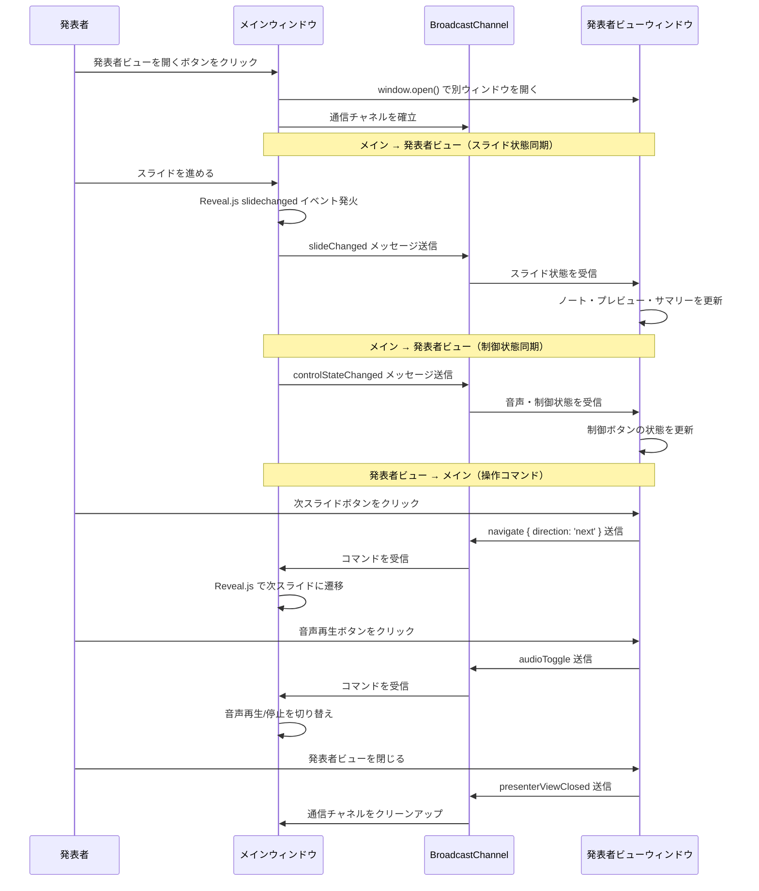
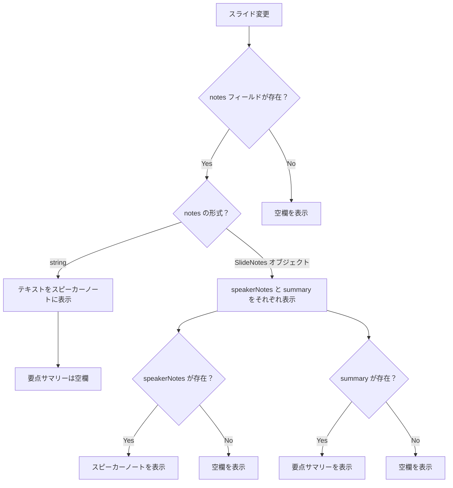

# 発表者ビュー（Presenter View）

**ドキュメント種別:** 抽象仕様書 (Spec)
**SDDフェーズ:** Specify (仕様化)
**最終更新日:** 2026-02-01
**関連 Design Doc:** [presenter-view_design.md](./presenter-view_design.md)
**関連 PRD:** [presenter-view.md](../requirement/presenter-view.md)

---

# 1. 背景

プレゼンテーション時に発表者はスライドの内容だけでなく、補足的な情報（スピーカーノート、前後のスライド内容、要点の確認）を手元で参照する必要がある。現状のシステムでは聴衆と発表者が同一の画面を参照しており、発表者が台本やメモを確認する手段がない。

また、発表者が発表者ビューからスライドの移動や音声再生の制御を行えることで、メインウィンドウの操作に依存せず発表を進行できるようになる。

発表者ビュー機能は、メインプレゼンテーションとは別のウィンドウで発表者向けの情報を表示し、スライド進行に同期して表示を切り替え、さらに発表者ビューからの操作をメインウィンドウに反映する双方向同期を提供することで、発表の質を向上させる。

# 2. 概要

発表者ビューは、プレゼンテーション実行中に発表者が参照するための補助的なウィンドウである。以下の情報と操作機能を提供する。

**情報表示:**
1. **スピーカーノート** — 現在のスライドに紐づく発表者用のメモ・台本
2. **前スライドプレビュー** — 前に表示されていたスライドの縮小表示
3. **次スライドプレビュー** — 次に遷移するスライドの縮小表示
4. **要点サマリー** — 現在のスライドの要点の箇条書き

**操作機能:**
5. **スライド移動** — アイコンボタンおよびキーボード操作によるスライドの前後移動
6. **音声再生** — 現在のスライドの音声再生/停止
7. **自動音声再生** — 自動音声再生のON/OFF切り替え
8. **自動スライドショー** — 自動スライドショーのON/OFF切り替え

メインウィンドウでのスライド操作に同期して発表者ビューの表示内容がリアルタイムで切り替わり、発表者ビューからの操作もメインウィンドウに同期される（双方向同期）。

# 3. 要求定義

## 3.1. 機能要件 (Functional Requirements)

| ID | 要件 | 優先度 | PRD参照 |
|---|---|---|---|
| FR-001 | 発表者がUI操作（画面右上のホバー展開ボタン）により別ウィンドウで発表者ビューを開ける | Must | FR-PV-001 |
| FR-002 | メインウィンドウでのスライド遷移が発表者ビューにリアルタイムで同期される。発表者ビューからのスライド操作もメインウィンドウに同期される（双方向同期） | Must | FR-PV-002 |
| FR-003 | 現在のスライドに紐づくスピーカーノートが発表者ビューに表示される | Must | FR-PV-003 |
| FR-004 | 次のスライドのプレビューが発表者ビューに表示される | Should | FR-PV-004 |
| FR-005 | 現在のスライドの要点サマリーが箇条書きで表示される | Should | FR-PV-005 |
| FR-006 | slides.json の各スライドに notes フィールドを定義できる | Must | FR-PV-006 |
| FR-007 | ノートが未定義のスライドでは空欄またはデフォルトメッセージを表示する | Must | DC-PV-002 |
| FR-008 | 発表者ビューウィンドウを閉じてもメインプレゼンテーションに影響しない | Must | - |
| FR-009 | 最終スライドでは次スライドプレビューに「最後のスライドです」と表示する | Should | FR-PV-004 |
| FR-010 | 前のスライドのプレビューが発表者ビューに表示される。最初のスライドでは「最初のスライドです」と表示する | Should | FR-PV-007 |
| FR-011 | 発表者ビューからスライドの前後移動をアイコンボタンおよびキーボード操作（矢印キー、Spaceキー等）で行え、操作結果がメインウィンドウに同期される | Must | FR-PV-008 |
| FR-012 | 発表者ビューから現在のスライドの音声を再生/停止できるアイコンボタンがあり、操作結果がメインウィンドウに同期される | Must | FR-PV-009 |
| FR-013 | 発表者ビューから自動音声再生のON/OFFを切り替えられるアイコンボタンがあり、操作結果がメインウィンドウに同期される | Must | FR-PV-010 |
| FR-014 | 発表者ビューから自動スライドショーのON/OFFを切り替えられるアイコンボタンがあり、操作結果がメインウィンドウに同期される | Must | FR-PV-011 |

# 4. API

## 4.1. 公開API一覧

| ディレクトリ | ファイル名 | エクスポート | 概要 |
|---|---|---|---|
| `src/hooks/` | `useReveal.ts` | `useReveal()` | Reveal.js初期化フック（スライド変更コールバック、スライド移動メソッド対応） |
| `src/hooks/` | `usePresenterView.ts` | `usePresenterView()` | 発表者ビューのウィンドウ管理・双方向同期ロジック |
| `src/components/` | `PresenterViewButton.tsx` | `PresenterViewButton` | 発表者ビューを開くUIボタン |
| `src/components/` | `PresenterViewWindow.tsx` | `PresenterViewWindow` | 発表者ビューウィンドウのルートコンポーネント |

## 4.2. 型定義

```typescript
/** スライドのノート情報（SlideMeta.notes を拡張） */
interface SlideNotes {
  /** スピーカーノート（発表者メモ・台本） */
  speakerNotes?: string
  /** 要点サマリー（箇条書き用の配列） */
  summary?: string[]
}

/** 発表者ビューに同期されるスライド状態 */
interface PresenterSlideState {
  /** 現在のスライドインデックス */
  currentIndex: number
  /** 現在のスライドデータ */
  currentSlide: SlideData
  /** 前のスライドデータ（最初のスライドの場合は null） */
  previousSlide: SlideData | null
  /** 次のスライドデータ（最終スライドの場合は null） */
  nextSlide: SlideData | null
  /** 全スライド数 */
  totalSlides: number
}

/** 音声・スライドショーの制御状態 */
interface PresenterControlState {
  /** 音声再生中か */
  isPlaying: boolean
  /** 自動音声再生が有効か */
  autoPlay: boolean
  /** 自動スライドショーが有効か */
  autoSlideshow: boolean
  /** 現在のスライドに音声があるか */
  hasVoice: boolean
}

/** usePresenterView フックの戻り値 */
interface UsePresenterViewReturn {
  /** 発表者ビューウィンドウを開く */
  openPresenterView: () => void
  /** 発表者ビューが開いているか */
  isOpen: boolean
  /** スライド変更時にメインウィンドウから呼び出し、発表者ビューに状態を送信する */
  sendSlideState: (currentIndex: number) => void
  /** 音声・制御状態を発表者ビューに送信する */
  sendControlState: (state: PresenterControlState) => void
}

/** BroadcastChannel で送受信するメッセージ */
type PresenterViewMessage =
  | { type: 'slideChanged'; payload: { currentIndex: number; slides: SlideData[] } }
  | { type: 'controlStateChanged'; payload: PresenterControlState }
  | { type: 'presenterViewReady' }
  | { type: 'presenterViewClosed' }
  | { type: 'navigate'; payload: { direction: 'prev' | 'next' } }
  | { type: 'audioToggle' }
  | { type: 'autoPlayToggle' }
  | { type: 'autoSlideshowToggle' }
```

# 5. 用語集

| 用語 | 説明 |
|---|---|
| 発表者ビュー（Presenter View） | 発表者が参照するための別ウィンドウ。スピーカーノート、前後スライドプレビュー、要点サマリー、スライド操作、音声制御を含む |
| スピーカーノート（Speaker Notes） | 各スライドに紐づく発表者用のメモ・台本テキスト |
| 要点サマリー（Slide Summary） | 各スライドの要点を箇条書きにまとめたもの |
| 前スライドプレビュー（Previous Slide Preview） | 前に表示されていたスライドの縮小表示 |
| 次スライドプレビュー（Next Slide Preview） | 次に遷移するスライドの縮小表示 |
| スライド同期（Slide Synchronization） | メインウィンドウと発表者ビューウィンドウ間でスライド位置を一致させる仕組み |
| 双方向同期（Bidirectional Sync） | 発表者ビューからの操作がメインウィンドウに伝達され、メインウィンドウの状態が発表者ビューに同期される仕組み |
| 音声再生制御（Audio Control） | 音声の再生/停止、自動音声再生、自動スライドショーの操作 |

# 6. 使用例

## 6.1. slides.json でのノート定義

```json
{
  "slides": [
    {
      "id": "intro",
      "layout": "center",
      "content": {
        "title": "AI-SDD ワークフロー"
      },
      "meta": {
        "notes": {
          "speakerNotes": "まず、AI-SDDの概要を説明します。仕様書中心の開発手法であることを強調してください。",
          "summary": [
            "AI-SDDとは仕様書中心の開発手法",
            "Vibe Coding問題を解決",
            "4つのフェーズで構成"
          ]
        }
      }
    }
  ]
}
```

## 6.2. 発表者ビューの起動と双方向同期

```tsx
import { usePresenterView } from '../hooks/usePresenterView'
import { useReveal } from '../hooks/useReveal'
import { PresenterViewButton } from '../components/PresenterViewButton'

function Presentation({ slides }) {
  const { openPresenterView, isOpen, sendSlideState, sendControlState } = usePresenterView({
    slides,
    onNavigate: (direction) => {
      // 発表者ビューからのスライド移動コマンドを受信
      if (direction === 'next') deck.next()
      else deck.prev()
    },
    onAudioToggle: () => { /* 音声再生/停止を切り替え */ },
    onAutoPlayToggle: () => { /* 自動音声再生を切り替え */ },
    onAutoSlideshowToggle: () => { /* 自動スライドショーを切り替え */ },
  })

  const handleSlideChanged = useCallback(
    (event: { indexh: number }) => sendSlideState(event.indexh),
    [sendSlideState],
  )
  const { deckRef } = useReveal({ onSlideChanged: handleSlideChanged })

  return (
    <>
      <div className="reveal" ref={deckRef}>...</div>
      <PresenterViewButton onClick={openPresenterView} isOpen={isOpen} />
    </>
  )
}
```

# 7. 振る舞い図

## 7.1. 双方向ウィンドウ間同期シーケンス



## 7.2. フォールバック動作



# 8. 制約事項

- データ駆動型アーキテクチャ（A-003）に準拠し、ノートデータは slides.json で管理する
- フォールバックファースト設計（A-005）に準拠し、ノート未定義時もエラーなく表示する
- 既存の `SlideMeta.notes` フィールド（現在 `string` 型）との後方互換性を維持する
- 発表者ビューウィンドウのクローズ時に通信リソースを確実に解放する
- 発表者ビューからの操作コマンドは BroadcastChannel を通じてメインウィンドウに送信し、メインウィンドウが実際の操作を実行する（発表者ビューが直接 Reveal.js や音声プレイヤーを操作しない）
- 発表者ビューの音声制御ボタンの状態は、メインウィンドウから同期された制御状態に基づいて表示する

---

## PRD参照

- 対応PRD: [presenter-view.md](../requirement/presenter-view.md)
- カバーする要求: UR-PV-001, FR-PV-001, FR-PV-002, FR-PV-003, FR-PV-004, FR-PV-005, FR-PV-006, FR-PV-007, FR-PV-008, FR-PV-009, FR-PV-010, FR-PV-011, DC-PV-001, DC-PV-002, DC-PV-003
