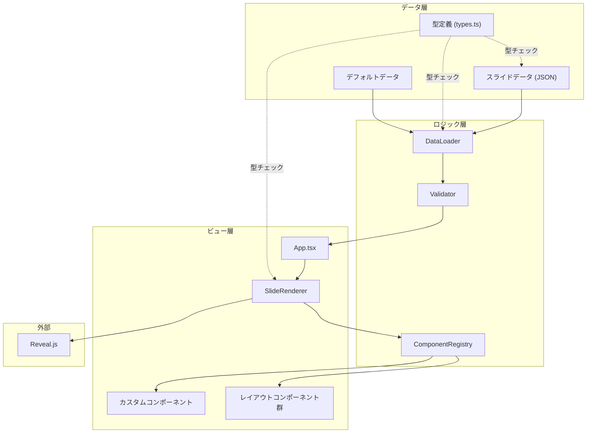

# スライドコンテンツカスタマイズ

**ドキュメント種別:** 技術設計書 (Design Doc)
**SDDフェーズ:** Plan (計画/設計)
**最終更新日:** 2026-01-30
**関連 Spec:** [slide-content-customization_spec.md](./slide-content-customization_spec.md)
**関連 PRD:** [slide-content-customization.md](../requirement/slide-content-customization.md)

---

# 1. 実装ステータス

**ステータス:** 🟢 実装済み

## 1.1. 実装進捗

| モジュール/機能                            | ステータス  | 備考                   |
|-------------------------------------|--------|----------------------|
| 型定義（types.ts）                       | 🟢 実装済み | スライドデータの型定義（`LogoConfig` 含む） |
| デフォルトデータ（default-slides.json）       | 🟢 実装済み | 既存10枚スライドのJSON化      |
| データローダー（loader.ts）                  | 🟢 実装済み | 読み込み・バリデーション・フォールバック |
| コンポーネントレジストリ（ComponentRegistry.tsx） | 🟢 実装済み | カスタムコンポーネントの登録・解決    |
| スライドレンダラー（SlideRenderer.tsx）        | 🟢 実装済み | データ駆動型レンダリング         |
| レイアウトコンポーネント群                       | 🟢 実装済み | 既存レイアウトをSlideRendererから活用 |
| テーマ適用                               | 🟢 実装済み | applyThemeData関数で対応   |
| App.tsx 統合                          | 🟢 実装済み | データ駆動型への移行完了         |

---

# 2. 設計目標

1. **後方互換性の完全な維持**: デフォルトデータ使用時に既存のプレゼンテーションと見た目・動作が完全に同一であること（NFR-003,
   B-001, B-002）
2. **データとビューの分離**: スライドコンテンツをJSON構造化データとして分離し、コード変更なしでコンテンツを差し替え可能にする
3. **型安全性**: すべてのスライドデータ構造をTypeScriptの型システムで表現し、コンパイル時に型チェックを行う（T-001）
4. **Reveal.js互換性**: データ駆動で生成されたDOMが `.reveal > .slides > section` 構造を維持する（T-002）
5. **段階的導入**: 既存のスライドコンポーネントを維持しつつ、データ駆動型への移行を段階的に行える設計

---

# 3. 技術スタック

| 領域        | 採用技術                       | 選定理由                                           |
|-----------|----------------------------|------------------------------------------------|
| UI        | React 18 + TypeScript      | 既存プロジェクトの技術スタック。コンポーネント指向でレイアウト種別の拡張が容易（T-001） |
| プレゼンテーション | Reveal.js                  | 既存プロジェクトで使用。DOM構造の互換性を維持する必要あり（T-002）          |
| データフォーマット | JSON                       | PRDで指定。ViteのJSON importとHMRに対応。非技術者にも編集しやすい    |
| バリデーション   | TypeScript型ガード + ランタイムチェック | 外部ライブラリ不要。型安全性とランタイム検証を両立                      |
| ビルドツール    | Vite                       | 既存プロジェクトで使用。JSON importとHMRをネイティブサポート          |
| スタイリング    | CSS（既存style.css） + CSS変数   | テーマ切り替えにCSS変数を使用。既存スタイルとの互換性を維持（A-002）         |

---

# 4. アーキテクチャ

## 4.1. システム構成図



## 4.2. モジュール分割

| モジュール名            | 責務                             | 依存関係                             | 配置場所                                   |
|-------------------|--------------------------------|----------------------------------|----------------------------------------|
| types             | スライドデータの型定義                    | なし                               | `src/data/types.ts`                    |
| default-slides    | 既存10枚スライドのデフォルトデータ             | types                            | `src/data/default-slides.json`         |
| loader            | データ読み込み、バリデーション、フォールバック        | types, default-slides            | `src/data/loader.ts`                   |
| ComponentRegistry | コンポーネントの登録・解決・上書き              | React                            | `src/components/ComponentRegistry.tsx` |
| SlideRenderer     | スライドデータからコンポーネントへの変換           | types, ComponentRegistry         | `src/components/SlideRenderer.tsx`     |
| レイアウトコンポーネント群     | 各レイアウト種別のレンダリング                | types, React                     | `src/layouts/*.tsx`                    |
| App               | ルートコンポーネント。データ読み込みとReveal.js統合 | loader, SlideRenderer, Reveal.js | `src/App.tsx`                          |

## 4.3. ディレクトリ構造

```
src/
├── main.tsx                    # エントリーポイント（変更なし）
├── App.tsx                     # データ駆動型に改修
├── data/
│   ├── types.ts                # スライドデータの型定義
│   ├── default-slides.json     # デフォルトスライドデータ
│   ├── loader.ts               # データ読み込み・バリデーション
│   └── index.ts                # re-export
├── components/
│   ├── ComponentRegistry.tsx   # コンポーネント登録・解決
│   ├── SlideRenderer.tsx       # スライドレンダラー
│   └── ...                     # 既存の共通コンポーネント
├── layouts/
│   ├── TitleLayout.tsx         # タイトルスライド用レイアウト
│   ├── ContentLayout.tsx       # 本文スライド用レイアウト
│   ├── TwoColumnLayout.tsx     # 2カラムレイアウト
│   ├── CustomLayout.tsx        # カスタムコンポーネント用レイアウト
│   └── index.ts                # レイアウト登録・re-export
├── slides/                     # 既存スライドコンポーネント（段階的に移行）
│   └── ...
└── styles/
    └── style.css               # 既存スタイル（CSS変数追加）
```

---

# 5. データモデル

## 5.1. JSONデータ構造

```json
{
  "meta": {
    "title": "AI-SDD ワークフロー デモ",
    "description": "AI駆動仕様駆動開発のプレゼンテーション",
    "author": "Demo Author",
    "logo": {
      "src": "/logo.png",
      "width": 120,
      "height": 40
    }
  },
  "theme": {
    "colors": {
      "primary": "#667eea",
      "accent": "#764ba2",
      "background": "#0a0a2e",
      "text": "#ffffff"
    },
    "fonts": {
      "heading": "'Noto Sans JP', sans-serif",
      "body": "'Noto Sans JP', sans-serif",
      "code": "'Source Code Pro', monospace",
      "baseFontSize": 24,
      "sources": [
        { "family": "MyFont", "src": "/fonts/MyFont.woff2" },
        { "family": "Fira Code", "url": "https://fonts.googleapis.com/css2?family=Fira+Code:wght@400;700&display=swap" }
      ]
    }
  },
  "slides": [
    {
      "id": "title",
      "layout": "title",
      "content": {
        "title": "AI-SDD",
        "subtitle": "AI駆動 仕様駆動開発"
      },
      "meta": {
        "transition": "fade"
      }
    }
  ]
}
```

## 5.2. レイアウト種別マッピング

構造ベースの命名によるレイアウト種別：

| レイアウト名       | ラッパー                           | 用途                                                      |
|--------------|--------------------------------|---------------------------------------------------------|
| `center`     | TitleLayout / SectionLayout    | タイトル・まとめ。`variant: "section"` で SectionLayout を選択       |
| `content`    | ContentLayout                  | 子要素で描画を判別: `steps` → Timeline, `tiles` → FeatureTileGrid |
| `two-column` | ContentLayout + TwoColumnGrid  | 左右2カラム                                                  |
| `bleed`      | BleedLayout                    | 2カラム全幅（端まで広がるレイアウト）                                     |
| `custom`     | なし                             | カスタムコンポーネント参照用                                          |

---

# 6. インターフェース定義

## 6.1. DataLoader インターフェース

```typescript
/**
 * スライドデータを読み込む。
 * 外部データ未指定時またはバリデーション失敗時はデフォルトデータにフォールバック。
 */
function loadPresentationData(
    source?: PresentationData | string
): PresentationData {
}

/**
 * スライドデータのバリデーション。
 * 型ガードとして動作し、不正なデータを検出する。
 */
function validatePresentationData(
    data: unknown
): data is PresentationData {
}

/**
 * バリデーションエラーの詳細を取得する。
 */
function getValidationErrors(
    data: unknown
): ValidationError[] {
}

interface ValidationError {
    path: string;       // エラー箇所のJSONパス（例: "slides[0].content.title"）
    message: string;    // エラーメッセージ
    expected: string;   // 期待される型・値
    actual: string;     // 実際の型・値
}
```

## 6.2. ComponentRegistry インターフェース

```typescript
/**
 * カスタムコンポーネントを名前付きで登録する。
 * 同名のデフォルトコンポーネントが存在する場合は上書きされる。
 */
function registerComponent(
    name: string,
    component: React.ComponentType<SlideContent>
): void {
}

/**
 * 名前からコンポーネントを解決する。
 * カスタム → デフォルト → フォールバック の優先順で解決。
 */
function resolveComponent(
    name: string
): React.ComponentType<SlideContent> {
}

/**
 * 登録済みの全コンポーネント名を取得する。
 */
function getRegisteredComponents(): string[] {
}
```

## 6.3. SlideRenderer インターフェース

```typescript
interface SlideRendererProps {
    slides: SlideData[];
    registry?: ComponentRegistry;
}

/**
 * スライドデータ配列を受け取り、Reveal.js互換の<section>要素群をレンダリングする。
 */
function SlideRenderer(props: SlideRendererProps): JSX.Element {
}
```

---

# 7. 非機能要件実現方針

| 要件                      | 実現方針                                                                                    |
|-------------------------|-----------------------------------------------------------------------------------------|
| NFR-001: HMR即時反映        | ViteのJSON importを使用。JSONファイル変更時にHMRが自動的にモジュールを更新する                                      |
| NFR-002: IntelliSense対応 | TypeScript型定義をエクスポートし、JSONファイルに `$schema` プロパティを追加。VSCodeのJSON Schema対応でIntelliSense有効化 |
| NFR-003: 後方互換性          | デフォルトデータとして既存スライドの内容を忠実にJSON化。レイアウトコンポーネントで既存コンポーネントの見た目を再現                             |
| NFR-004: Reveal.js互換    | SlideRendererが各SlideDataに対して `<section>` 要素を生成。data属性（transition等）もmeta情報から設定           |
| NFR-005: 型安全性           | `PresentationData` 型を中心とした型定義。ランタイムバリデーションで型ガードを実装                                      |

---

# 8. テスト戦略

| テストレベル   | 対象                           | カバレッジ目標                   |
|----------|------------------------------|---------------------------|
| 型チェック    | 全TypeScriptファイル              | ビルドエラーゼロ                  |
| ユニットテスト  | loader.ts（バリデーション、フォールバック）   | 主要パス100%                  |
| ユニットテスト  | ComponentRegistry（登録、解決、上書き） | 主要パス100%                  |
| 統合テスト    | SlideRenderer + レイアウト        | デフォルトデータで10枚全スライド正常レンダリング |
| ビジュアルテスト | デフォルトデータでのプレゼン表示             | 既存プレゼンとの差異ゼロ（NFR-003）     |

**テスト環境の注意点:**
- jsdom環境にはIntersectionObserverが存在しないため、`test-setup.ts`でグローバルモックを設定。TerminalAnimationコンポーネントを含むSlideRendererテストで必要

---

# 9. 設計判断

## 9.1. 決定事項

| 決定事項        | 選択肢                              | 決定内容                       | 理由                                               |
|-------------|----------------------------------|----------------------------|--------------------------------------------------|
| データフォーマット   | JSON / YAML / TypeScript Object  | JSON                       | PRDで指定。ViteのHMR対応。非技術者が編集可能。スコープ外にYAML/TOML対応を明記 |
| バリデーション手法   | 外部ライブラリ（zod/ajv）/ TypeScript型ガード | TypeScript型ガード + ランタイムチェック | 外部依存を最小化。プレゼンアプリとしてはランタイム型ガードで十分                 |
| コンポーネント解決方式 | 文字列ベースレジストリ / React.lazy動的import | 文字列ベースレジストリ                | シンプルで理解しやすい。プレゼンアプリの規模では動的importは過剰              |
| テーマ適用方式     | CSS変数 / CSS-in-JS / インラインスタイル    | CSS変数                      | Reveal.jsとの親和性が高い。既存style.cssへの追加で対応可能（A-002準拠）  |
| デフォルトデータ形式  | JSON静的ファイル / TypeScriptオブジェクト    | JSON静的ファイル                 | データとコードの分離原則に合致。実際の利用イメージと一致する                   |
| 既存スライドの移行   | 一括移行 / 段階的移行                     | 完全データ駆動化（一括移行） | ユーザー選択。全10枚のスライドをJSON化し、SlideRendererで統一レンダリング |
| レイアウト実装方式 | 個別レイアウトファイル / SlideRenderer集約 | SlideRenderer集約 | 既存の4レイアウト（Title/Content/Bleed/Section）をSlideRenderer内で活用。レイアウト種別ごとのレンダリングロジックをSlideRenderer.tsxに集約 |
| アイコン解決方式 | コンポーネント直接指定 / 名前ベースレジストリ | 名前ベースレジストリ（Icon:プレフィックス） | JSONから文字列でアイコンを指定可能にするため。registerDefaultsでMUIアイコンを名前登録 |
| TerminalAnimation注入方式 | props直接指定 / ラッパーコンポーネント | ラッパーコンポーネント（registerDefaults.tsx） | TerminalAnimationはlogText propsが必須だが、デフォルトデータからはコンポーネント参照のみでpropsを渡さないため、`?raw`インポートしたlogTextを事前注入するラッパーが必要 |
| HTMLコンテンツ処理方式 | Markdownパーサー / dangerouslySetInnerHTML / カスタムパーサー | dangerouslySetInnerHTML | 既存スライドで使用されている`<strong>`, `<code>`, `<br>`タグをJSON文字列から復元するため。コンテンツはすべてアプリ内部のJSON定義であり外部入力ではないためXSSリスクなし |
| フォントサイズ制御方式 | 固定px値 / CSS変数 + 比率ベース / rem単位 | CSS変数 + 比率ベース（`baseFontSize`） | `baseFontSize` を基準に全サイズを比率で算出し CSS 変数に設定。MUI typography と global.css の両方で CSS 変数を参照することで一元管理。固定px値と同等のデフォルト値を `:root` に設定し後方互換性を維持 |
| フォントソースロード方式 | ビルド時バンドル / ランタイム動的ロード | ランタイム動的ロード（`@font-face` / `<link>` 挿入） | ローカルフォントは `@font-face` スタイル要素を動的追加、外部フォント（Google Fonts等）は `<link>` タグを動的挿入。重複ロード防止機構あり。ビルド時バンドルは設定ファイルだけでフォントを差し替えたいユースケースに不向き |

## 9.2. 未解決の課題

| 課題                       | 影響度 | 対応方針                                                                | 状況 |
|--------------------------|-----|---------------------------------------------------------------------|------|
| 既存10枚スライドの忠実なJSON化       | 高   | 各スライドコンポーネントの内容を分析し、レイアウト種別を特定した上でJSON化する                           | ✅ 解決済み。default-slides.jsonに全10枚をJSON化 |
| 複雑なスライド（アニメーション付き）のデータ表現 | 中   | TerminalAnimation等の複雑なコンポーネントはカスタムコンポーネントとして登録し、componentフィールドで参照する | ✅ 解決済み。registerDefaults.tsxでデフォルト登録 |
| JSONスキーマの自動生成            | 低   | TypeScript型定義からのJSONスキーマ自動生成は将来課題。初期は手動作成                           | 未着手（将来課題） |
| SlideMeta対応              | 低   | Reveal.jsのdata-transition等の属性をsection要素に設定する                         | 未着手。既存レイアウトのProps拡張が必要 |
| 目視確認による後方互換性検証           | 高   | デフォルトデータでの表示が変更前と一致することの目視確認                                        | 要確認。`npm run dev`での実行確認が必要 |

---

# 10. 変更履歴

## v0.1.0 (2026-01-30)

**変更内容:**

- 初版作成。スライドコンテンツカスタマイズ機能の技術設計を定義

## v0.2.0 (2026-01-30)

**変更内容:**

- 実装ステータスを🟢実装済みに更新
- 設計判断に3項目追加: レイアウト実装方式、アイコン解決方式、既存スライド移行を完全データ駆動化に変更
- 未解決の課題を更新: JSON化・カスタムコンポーネント登録は解決済み、SlideMeta対応・目視確認を追加

## v0.5.0 (2026-01-31)

**変更内容:**

- `FontDefinition` に `baseFontSize?: number` と `sources?: FontSource[]` を追加
- `FontSource` インターフェース（`family`, `src?`, `url?`）を追加
- フォントサイズ制御方式の設計判断を追加（CSS変数 + 比率ベース）
- フォントソースロード方式の設計判断を追加（ランタイム動的ロード）
- JSONデータ構造例に `baseFontSize` と `sources` を追記

## v0.4.0 (2026-01-31)

**変更内容:**

- `PresentationMeta` に `logo?: LogoConfig` フィールドを追加
- `LogoConfig` 型（`src`, `width?`, `height?`）を追加
- JSONデータ構造例に `meta.logo` を追記
- `meta.logo` 未指定時はロゴ非表示とする仕様

## v0.3.0 (2026-01-30)

**変更内容:**

- 設計判断に2項目追加: TerminalAnimation注入方式、HTMLコンテンツ処理方式
- テスト戦略にIntersectionObserverモックの注意点を追記
- task/DEM-001/ の実装ログから設計判断を統合し、タスクログを削除
